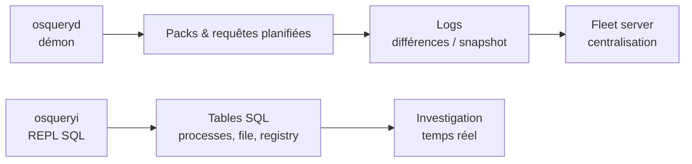

# osquery — Défense & SIEM

> [!info] **En 1 phrase**
> osquery transforme le système (processus, fichiers, réseau, registre...) en **base de données
> requêtable en SQL**, pour superviser et enquêter sur les endpoints à grande échelle.

---

## Overview

| Champ | Valeur |
|---|---|
| Nom complet | osquery |
| Description | Agent d'instrumentation des endpoints : le système devient une base SQL interrogeable en temps réel (osqueryi) et en continu (osqueryd) |
| Catégorie | IDS / SIEM / EDR |
| Sous-catégorie | Endpoint monitoring / HIDS / Incident response |
| Fonction principale | Exposer processus, fichiers, réseau, registre, services sous forme de tables SQL et journaliser les changements |
| Type d'outil | Agent + CLI (binaire unique : `osqueryi` shell, `osqueryd` démon) |
| Licence | Apache License 2.0 |
| Open source / propriétaire | Open source (gouvernance Linux Foundation depuis 2019) |
| Langage(s) de programmation | C++ (moteur), SQL via virtual tables SQLite |
| Développeur / organisation | Créé chez Facebook (2014), maintenu par la fondation osquery (Linux Foundation) |
| Projet officiel | osquery |
| Dépôt officiel | https://github.com/osquery/osquery |
| Documentation officielle | https://osquery.readthedocs.io |
| Date de création | 2014 (open source), 2019 (Linux Foundation) |
| État du projet | actif (5.23.1 publiée le 2026-06-24) |
| Dernière version connue | 5.23.1 |
| Systèmes compatibles | Linux (x86_64, aarch64), macOS, Windows, FreeBSD ; conteneurs |

> [!note] Pour vérifier / compléter
> La couverture des tables varie selon l'OS : Windows expose moins de tables que Linux/macOS (ex. pas de `crontab`, tables `registry`/`services`/`scheduled_tasks` spécifiques). Les tables d'événements (`process_events`, `file_events`, `socket_events`) dépendent de la plateforme (auditd/eBPF Linux, OpenBSM/ESF macOS, ETW Windows).

---

## Concept

osquery expose le système d'exploitation sous forme de **tables SQL** : `processes`, `file`, `interface_addresses`, `registry`, `services`, `crontab`, `osquery_info`... On interroge donc l'état réel des machines comme une base de données, en local (`osqueryi`) ou en continu (`osqueryd`). `osqueryd` est un démon qui **journalise les changements** (démarrages de processus, connexions réseau, accès fichiers) selon des **packs** de requêtes planifiées. Le moteur de requêtes est SQLite : chaque table est un *virtual table* dont les lignes sont générées à la volée par un appel au système (procfs, syscalls, registre Windows, API macOS).

Le déploiement de **fleet management** (Fleet, Kolide, osctrl) centralise des milliers d'agents et leurs résultats : chaque endpoint exécute son planning, envoie ses logs (logger TLS/syslog/filesystem), et le serveur Fleet pousse configurations, packs et labels. C'est l'outil de **supervision d'endpoint** idéal en réponse à incident et en chasse de menaces : léger, précis, scriptable, massivement utilisé par Facebook, Google et de grands SOC.

Il se place dans les phases **défense / réponse à incident / threat hunting** : `osqueryi` donne une réponse immédiate sur une machine compromise, tandis que `osqueryd` fournit la couche **HIDS** par différences de logs, complémentaire aux alertes réseau (Suricata/Zeek) et aux SIEM (Elastic, Splunk, Graylog) qui collectent ses journaux JSON.



---

## Concepts fondamentaux

| Concept | Explication |
|---|---|
| Table | « Vue » du système exposée en SQL : `processes`, `file`, `registry`, `process_open_sockets`, `osquery_info` |
| Virtual table | Mécanisme SQLite : les lignes sont calculées à la volée par du code C++ interrogeant l'OS (procfs, API Windows...) |
| osqueryi | Shell SQL interactif : une commande = une requête, idéal pour le quick check IR |
| osqueryd | Démon de supervision : exécute le planning de requêtes, journalise les changements, envoie les logs |
| Pack | Ensemble nommé de requêtes planifiées (ex. `incident-response`, `osquery-monitoring`) |
| Schedule | Tableau des requêtes planifiées : requête SQL + intervalle (ex. toutes les 60 s) |
| Differential / Snapshot log | Log de type « résultat en plus/absent » vs précédent, ou résultat complet (`"snapshot": true`) |
| Event table | Table dédiée aux événements réels : `process_events`, `file_events`, `socket_events` (nécessite activation) |
| Decorator | Champs ajoutés automatiquement à chaque ligne (hostname, uptime, labels) |
| Logger / Config plugin | Destination des logs (`filesystem`, `syslog`, `tls`, `stdout`) et source de configuration (`filesystem`, `tls` Fleet) |
| Fleet server | Serveur de gestion (Fleet, Kolide, osctrl) : pousse config/packs, reçoit les logs, labels par parc |
| Enroll secret | Secret partagé d'enrôlement d'un agent vers le serveur TLS |

---

## Installation

### Debian / Ubuntu / Kali Linux

```bash
curl -fsSL https://pkg.osquery.io/deb/pubkey.gpg | sudo gpg --dearmor -o /usr/share/keyrings/osquery.gpg
echo "deb [signed-by=/usr/share/keyrings/osquery.gpg] https://pkg.osquery.io/deb deb main" | sudo tee /etc/apt/sources.list.d/osquery.list
sudo apt update && sudo apt install -y osquery
osqueryi --version
```

### Fedora / RHEL

```bash
sudo rpm -Uvh https://pkg.osquery.io/rpm/osquery-5.23.1-1.linux.x86_64.rpm
```

### macOS

```bash
brew install osquery
```

### Windows

```powershell
choco install osquery
osqueryi --version
# OU installer le paquet .msi officiel : https://pkg.osquery.io/windows/osquery-5.23.1.msi
```

### Docker (serveur Fleet pour centraliser les agents)

```bash
docker run -d -p 8080:8080 -p 8081:8081 fleetdm/fleet
# L'UI Fleet sur http://localhost:8080, API sur 8081
```

### Compilation depuis les sources

```bash
git clone https://github.com/osquery/osquery.git && cd osquery
sudo apt install -y build-essential cmake python3 pipx
# pipx run osqueryi... ou suivre la doc officielle (cmake) : make deps && make
```

> [!warning] Prérequis & problèmes potentiels
> - Les tables `process_open_sockets` et `file` nécessitent souvent **root** : utiliser `sudo osqueryi` sur Linux/macOS pour des résultats complets.
> - Les **event tables** doivent être activées : `--enable_file_events`, `--disable_audit=false` (Linux audit), ou config `events` dans osquery.conf — sinon `file_events` reste vide.
> - Sous Windows, l'installeur MSI installe le service `osqueryd` mais la configuration par défaut est minimale : prévoir un `osquery.flags` + `osquery.conf`.

---

## Configuration

| Paramètre | Rôle | Valeur possible | Impact | Exemple |
|---|---|---|---|---|
| `--config_path` | Chemin du fichier de configuration | `/etc/osquery/osquery.conf` | Source de config filesystem | `--config_path=/etc/osquery/osquery.conf` |
| `--flagfile` | Fichier de flags supplémentaires | `/etc/osquery/osquery.flags` | Centralise les flags au démarrage | `--flagfile=/etc/osquery/osquery.flags` |
| `schedule` | Requêtes planifiées + intervalle | objet JSON | Fréquence de collecte (attention au coût CPU) | `"query_name": {"query": "...", "interval": 60}` |
| `packs` | Packs activés | `incident-response`, `osquery-monitoring` | Charge des jeux de requêtes prêts à l'emploi | `"packs": {"incident-response": true}` |
| `events` | Activation des event tables | `audit`, `file_paths`, `schedule` | Collecte temps réel des processus/fichiers | `"file_paths": {"etc": ["/etc/"]}` |
| `decorators` | Champs ajoutés à chaque ligne | `load`, `always`, `intervals` | Enrichissement systématique des logs | `"load": {"hostname": "SELECT hostname FROM system_info"}` |
| `--logger_plugin` | Destination des logs | `filesystem`, `syslog`, `tls`, `stdout` | Envoi vers Fleet/SIEM | `--logger_plugin=tls` |
| `--config_plugin` | Source de configuration | `filesystem`, `tls` | Pilotage à distance par Fleet | `--config_plugin=tls` |
| `--enroll_secret_path` | Fichier du secret d'enrôlement | chemin | Authentification agent → Fleet | `--enroll_secret_path=/etc/osquery/secret` |
| `--tls_hostname` | URL du serveur Fleet | `https://fleet.example.com:8080` | Destination TLS (config + logs) | `--tls_hostname=https://fleet.example.com:8080` |
| `--disable_events` | Coupe la collecte d'événements | `false` (défaut) | `true` = rapide mais perte de détection | `--disable_events=false` |
| `--events_max` | Taille max du buffer d'événements | entier | Évite la perte d'événements sous charge | `--events_max=50000` |

> [!note] À vérifier
> Chemins par défaut : config `/etc/osquery/osquery.conf`, flags `/etc/osquery/osquery.flags`, logs `/var/log/osquery/{results,osquery}.log`. Sur Windows : `C:\ProgramData\osquery\`. Le schéma exact du JSON de config est documenté dans la doc officielle « Configuration ».

---

## Architecture interne

Composants et flux à l'exécution :

- **Moteur de requêtes** : SQLite embarqué ; les tables sont des *virtual table* C++ qui, à chaque `SELECT`, appellent les API du système (procfs/sysfs Linux, Win32 API, Foundation/IOKit macOS). Une requête peut être *streaming* (échantillonnage) ou bloquante (scan de `file`).
- **osqueryi** : shell REPL (`osqueryi "SELECT ..."`), charge les extensions et tables, exécute en une passe — utilisé en investigation.
- **osqueryd** : démon qui charge la config (plugin), construit le **schedule** et exécute chaque requête à son intervalle, compare au résultat précédent, et émet des **logs différentiels/snapshot** via le **logger plugin** (filesystem → fichiers JSON, syslog, ou TLS → Fleet).
- **Event framework** : les event tables (`process_events`, `file_events`, `socket_events`) s'appuient sur les sources natives : auditd/eBPF (Linux), OpenBSM/EndpointSecurity (macOS), ETW (Windows). Chaque événement est mis en buffer (borné par `--events_max`) puis renvoyé comme résultat de la table.
- **Extensions** : des binaires externes peuvent enregistrer des tables supplémentaires (API extensions Unix socket / named pipe).
- **Mode Fleet** : le démon s'enrôle (enroll secret), télécharge config + packs via TLS, exécute le planning et pousse les logs au serveur ; les requêtes *live* (`osqueryd` `--nodiscover` ou via Fleet « live query ») sont poussées à la volée.

Flux type : `osqueryd` exécute la requête planifiée `SELECT ... FROM process_open_sockets` toutes les 60 s → log différentiel JSON → `logger_plugin=tls` → Fleet → SIEM (Elastic/Graylog) → alerte sur un port de reverse shell.

---

## Commandes

### Commandes principales

```bash
osqueryi                                          # console SQL interactive
osqueryi "SELECT name, path FROM processes LIMIT 10;"
osqueryi --json "SELECT * FROM listening_ports WHERE port=4444;"
sudo osqueryd --verbose --config_path /etc/osquery/osquery.conf   # démon de test (avant)
sudo systemctl start osqueryd
```

| Commande | Objectif | Résultat attendu |
|---|---|---|
| `osqueryi "SQL;"` | Exécute une requête en une fois | Table de résultats |
| `osqueryi --json "SQL;"` | Sortie JSON (parser/pipeline) | JSON valide sur stdout |
| `osqueryi --csv "SQL;"` | Sortie CSV | CSV sur stdout |
| `.tables` (dans le shell) | Liste toutes les tables | Liste `osquery` |
| `.schema processes` | Structure d'une table | Colonnes et types |
| `.mode json` / `.mode line` | Change le format d'affichage | Format choisi |
| `osqueryi --pack incident-response` | Charge un pack | Exécute les requêtes du pack |
| `sudo osqueryd --verbose` | Démon en mode verbeux | Logs détaillés de démarrage |

### Commandes avancées

```bash
# Lister les tables disponibles
osqueryi ".tables"

# Requête sur les sockets avec processus associé
osqueryi --json "SELECT p.name, s.remote_address, s.remote_port, s.state
  FROM process_open_sockets s JOIN processes p USING (pid)
  WHERE s.family = 2 AND s.remote_port != 0;"

# Vérifier la config chargée et le planning
sudo osqueryd --config_check --config_path /etc/osquery/osquery.conf

# Afficher les flags actifs
osqueryi "SELECT * FROM osquery_flags;"
```

---

## Options et flags

| Option | Description | Exemple | Niveau |
|---|---|---|---|
| `--json` | Sortie JSON | `osqueryi --json "SELECT * FROM processes;"` | Basic |
| `--csv` | Sortie CSV | `osqueryi --csv "SELECT name FROM services;"` | Basic |
| `--pack` | Charge un pack de requêtes | `osqueryi --pack incident-response` | Basic |
| `--config_path` | Fichier de configuration | `--config_path=/etc/osquery/osquery.conf` | Basic |
| `--logger_path` | Dossier des logs filesystem | `--logger_path=/var/log/osquery` | Intermediate |
| `--logger_plugin` | Plugin de sortie des logs | `--logger_plugin=syslog` | Intermediate |
| `--config_plugin` | Plugin de source de config | `--config_plugin=tls` | Advanced |
| `--tls_hostname` | URL du serveur TLS (Fleet) | `--tls_hostname=https://fleet.example.com:8080` | Advanced |
| `--enroll_secret_path` | Secret d'enrôlement | `--enroll_secret_path=/etc/osquery/secret` | Advanced |
| `--disable_events` | Désactive les event tables | `--disable_events=false` | Advanced |
| `--enable_file_events` | Active les événements fichiers | `--enable_file_events=true` | Advanced |
| `--events_max` | Taille du buffer d'événements | `--events_max=50000` | Advanced |
| `--verbose` | Logs détaillés | `sudo osqueryd --verbose` | Intermediate |
| `--disable_audit` | Désactive l'audit Linux (process_events) | `--disable_audit=false` | Expert |

> [!tip] Options les plus utiles au quotidien
> `--json` pour toutes les sorties pipelinées, `--pack incident-response` pour un triage IR immédiat, `sudo osqueryi` pour les tables nécessitant root, et `--logger_plugin=syslog` pour brancher osquery sur un SIEM sans serveur Fleet.

---

## Exemples pratiques

### Beginner

```sql
-- Objectif : lister les processus en cours / vérifier la version
SELECT pid, name, path FROM processes ORDER BY pid LIMIT 20;
SELECT * FROM osquery_info;

-- Objectif : trouver qui écoute sur un port suspect
SELECT pid, address, port, protocol FROM listening_ports WHERE port IN (4444, 5555, 1337);
```

### Intermediate

```sql
-- Objectif : connexions réseau sortantes (hors local)
SELECT p.name, s.local_address, s.local_port, s.remote_address, s.remote_port, s.state
FROM process_open_sockets s JOIN processes p USING (pid)
WHERE s.family = 2 AND s.remote_address NOT IN ('0.0.0.0', '127.0.0.1', '::');

-- Objectif : recherche de persistance crontab (reverse shell typique)
SELECT * FROM crontab WHERE command LIKE '%/dev/tcp/%' OR command LIKE '%bash -i%';
```

### Advanced

```sql
-- Objectif : activer et interroger les événements de processus (Linux audit)
-- Config osquery.conf : { "events": { "audit": { "process_events": true, "socket_events": true } } }
SELECT * FROM process_events WHERE path LIKE '/tmp/%' ORDER BY time DESC LIMIT 20;

-- Objectif : détection de fichiers modifiés (file_events)
-- Config : "events": { "file_paths": { "critical": ["/etc/", "/usr/local/bin/"] } }
SELECT target_path, action, uid FROM file_events WHERE action = 'UPDATED' LIMIT 20;
```

### Expert

```bash
# Objectif : live query Fleet — même requête sur tout le parc
# UI Fleet : New Live Query → "SELECT name, path FROM processes WHERE path LIKE '/tmp/%';"
# Chaque agent répond en < 10 s, résultats agrégés par hostname.
```

```text
# Objectif : config pilotée par Fleet (config_plugin + logger_plugin tls)
# /etc/osquery/osquery.flags :
#   --config_plugin=tls --logger_plugin=tls
#   --tls_hostname=https://fleet.example.com:8080 --enroll_secret_path=/etc/osquery/secret
#   --config_refresh=60
# Le serveur Fleet pousse packs/labels ; les logs arrivent centralisés.
```

---

## Workflow complet (scénario pas à pas)

1. **Premier contact** : `osqueryi` puis `.tables` pour lister les tables disponibles ; vérifier la version avec `SELECT * FROM osquery_info;`.
2. **Superviser les connexions réseau** :
   ```sql
   SELECT pid, remote_address, remote_port, state FROM process_open_sockets WHERE family=2;
   ```
3. **Chasser un processus suspect** (persistance Linux) :
   ```sql
   SELECT path, name FROM processes WHERE name='bash' OR path LIKE '/tmp%';
   SELECT * FROM crontab WHERE command LIKE '%/dev/tcp%';
   ```
4. **Planifier la détection** : créer `/etc/osquery/osquery.conf` avec un pack incluant la requête précédente planifiée toutes les 60 s.
5. **Lancer osqueryd** : `sudo systemctl start osqueryd` ; les résultats vont dans `/var/log/osquery/results.log` (une ligne JSON par exécution).
6. **Centraliser avec Fleet** : déployer le serveur Fleet (`docker run -p 8080:8080 -p 8081:8081 fleetdm/fleet`), créer un team et un pack, puis enrôler l'agent : `--enroll_secret_path=/etc/osquery/secret --tls_hostname=https://fleet.example.com:8080`.

---

## Scénarios avancés

### Scénario 1 : Investigation IR — timeline des processus

```sql
SELECT pid, path, name, start_time
FROM processes
ORDER BY start_time DESC LIMIT 20;
-- Repérer un processus démarré après l'incident ou exécuté depuis /tmp, /dev/shm, /var/tmp
```

### Scénario 2 : Détection de persistance Windows

```sql
SELECT * FROM registry
WHERE key LIKE 'HKEY_LOCAL_MACHINE\Software\Microsoft\Windows\CurrentVersion\Run%';

SELECT name, path, start_type FROM services
WHERE start_type = 'auto' AND path LIKE '%powershell%';
```

### Scénario 3 : Écoute réseau anormale à l'échelle d'un parc

```sql
SELECT remote_address, remote_port, COUNT(*) AS n
FROM process_open_sockets
WHERE family = 2 AND remote_address NOT IN ('0.0.0.0', '127.0.0.1')
GROUP BY remote_address, remote_port
ORDER BY n DESC;
-- Comparer les résultats sur plusieurs postes pour isoler le poste compromis
```

### Scénario 4 : Chasse de configuration SSH compromise

```sql
SELECT * FROM file WHERE path = '/root/.ssh/authorized_keys';
SELECT * FROM ssh_config WHERE host LIKE '%example.com%' AND (user = 'root' OR port != 22);
```

---

## Cybersecurity use cases

| Phase | Utilisation |
|---|---|
| Détection (HIDS) | Requêtes planifiées + event tables : processus/fichiers/sockets, alertes par différences |
| Réponse à incident | `osqueryi` en triage immédiat : processus, persistance, réseau, connexions |
| Threat hunting | Chasse SQL sur le parc via Fleet (live queries), comparaison inter-postes |
| Conformité | Vérification de configuration (SSH, registry, services) par requêtes planifiées |
| Supervision | Statut des endpoints, heartbeat, latence des requêtes (`osquery_monitoring`) |
| Post-exploitation (défense) | Détection des comportements post-exploitation (reverse shells, keys, persistence) |

---

## MITRE ATT&CK

| Tactique | Technique / Sub-technique | ID | Raison | Détection | Mitigation |
|---|---|---|---|---|---|
| Persistence | Boot or Logon Autostart Execution: Registry Run Keys / Startup Folder | T1547.001 | Surveillance des clés Run et Startup | Requête `registry` sur `...\CurrentVersion\Run` | Restreindre les clés Run, supervision |
| Discovery | System Information Discovery | T1082 | Collecte d'informations système par l'adversaire | Table `system_info`, `osquery_info` | Logs centralisés, anomalies |
| Discovery | Process Discovery | T1057 | Énumération des processus avant ciblage | Table `processes` planifiée | Corrélation avec les autres logs |
| Discovery | Query Registry | T1012 | Lecture du registre pour trouver creds/persistance | Table `registry` (Windows) | Restreindre l'accès registre |
| Command and Control | Application Layer Protocol: Web Protocols | T1071.001 | Connexions C2 sortantes identifiables | Table `process_open_sockets` + corrélation | Egress filtering, inspection TLS |
| Defense Evasion | Impair Defenses: Disable or Modify Tools | T1562.001 | Arrêt de osqueryd / suppression des logs par l'attaquant | Heartbeat Fleet, alerte absence de logs | Restreindre les droits admin, supervision |

> [!note] Ne renseigner que si l'association est réellement pertinente.
> osquery est un outil de détection : il ne détecte pas par signature, il expose l'état — la détection dépend des requêtes planifiées et de la corrélation en SIEM.

---

## Defensive Security

### Signes observables

| Indicateur | Détail |
|---|---|
| osqueryd arrêté ou désinstallé sur un poste | Statut du service, absence de heartbeat Fleet |
| Pic de requêtes `file`/`processes` (scan large) | Coût CPU/IO anormal sur l'endpoint |
| Secret d'enrôlement volé | Rotation des enroll secrets, TLS mutuel, vérification des certificats |
| Logs osquery absents ou vidés | Supervision `results.log`, alertes d'absence |
| Nouvelle clé SSH autorisée ajoutée | Requête planifiée `authorized_keys` |

### Règles de détection (Sigma / Suricata / Snort / YARA)

```yaml
# Sigma — ajout suspect de clé autorisée SSH (données osquery : table file sur authorized_keys)
title: Suspicious SSH Authorized Keys Modification
id: b3a9f2c1-8d4e-4f5a-9b2c-3d4e5f6a7b8c
status: experimental
logsource:
    product: osquery
    table: file
detection:
    selection:
        action: [UPDATED, CREATED]
        target_path|contains: /root/.ssh/authorized_keys
    condition: selection
falsepositives:
    - Rotation légitime des clés par l'équipe ops
level: high
```

```bash
# Suricata — corrélation réseau complémentaire : C2 sortant vers IP inconnue
alert tcp $HOME_NET any -> $EXTERNAL_NET any (msg:"ET OSQUERY Suspicious egress to unknown host"; \
  flow:established,to_server; threshold:type both, track by_src, count 5, seconds 60; sid:1000002; rev:1;)
```

---

## Automatisation

```bash
# Bash — triage rapide d'une machine compromise en un seul appel
osqueryi --json "SELECT name, path, start_time FROM processes ORDER BY start_time DESC LIMIT 50" \
  | jq -r '.[] | "\(.start_time)\t\(.name)\t\(.path)"' | head -20
```

```python
# Python — live query sur le parc via l'API Fleet
import requests

resp = requests.post("https://fleet.example.com:8080/api/latest/fleet/queries/run",
                     json={"query_ids": [42], "host_ids": [1, 2, 3]},
                     auth=("api_token", "FLYT_TOKEN"))
for r in resp.json().get("results", []):
    print(r["host_hostname"], r["rows"])
```

---

## Output et parsing

La sortie de `osqueryi --json` est un tableau JSON de lignes ; `results.log` contient une ligne JSON par exécution planifiée, avec `name` (requête), `hostIdentifier`, `unixTime`, `diffResults` (added/removed/unchanged) ou `snapshot` selon le type.

```bash
# Parser les résultats d'une requête en JSON avec jq
osqueryi --json "SELECT name, remote_port FROM process_open_sockets WHERE family=2;" \
  | jq -r '.[] | select(.remote_port != "0") | "\(.name):\(.remote_port)"' | sort | uniq -c
```

---

## Intégrations

```text
osqueryd (endpoints) → Fleet server → Elastic / Graylog / Splunk (logs JSON)
osqueryd → syslog logger → SIEM existant sans Fleet
Suricata / Zeek (réseau) + osquery (host) → corrélation croisée en SIEM
osqueryi → réponse à incident locale, couplée à Velociraptor pour la collecte forensique
```

- [[Tools| Outils]]
- [[Outil - Elastic]] — logs `logs-osquery-*` ingérés (module osquery de Filebeat) pour la corrélation
- [[Outil - Graylog]] — logs osquery centralisés (logger syslog ou TLS)
- [[Outil - Splunk]] — collecte des logs osquery et dashboards
- [[Outil - Wazuh]] — XDR complémentaire (FIM, vulnérabilités) à côté d'osquery
- [[Outil - Velociraptor]] — collecte forensique approfondie déclenchée après un triage osquery
- [[Outil - Suricata]] — corrélation réseau/host sur un même poste compromis
- [[Outil - Sigma]] — règles converties en requêtes osquery ou alertes SIEM

---

## Alternatives

| Outil | Avantages | Inconvénients | Cas d'usage |
|---|---|---|---|
| Sysmon (Windows) | Événements détaillés natifs (Event ID 1, 11, 22), léger | Windows uniquement, config XML complexe | Windows audit + SIEM |
| Falco | Règles de runtime container, eBPF | Focalisé Linux/conteneurs | Détection runtime Cloud/K8s |
| Auditd (Linux) | Audit natif kernel, puissant | Volumineux, config difficile | Conformité/audit Linux |
| Velociraptor | Collecte forensique + artefacts, VQL | Orienté investigation plus que supervision | DFIR |
| Agent EDR commercial | Détection + réponse automatisée | Coût, fermé, dépendance fournisseur | SOC entreprise |
| Wazuh | XDR complet avec agents | Plus lourd qu'osquery | SOC open source consolidé |

> **Quand utiliser osquery plutôt qu'un EDR ?** Pour une **supervision / chasse légère et scriptable** où l'on veut interroger l'état des endpoints en SQL sans agent propriétaire. Un EDR apporte la détection + réponse automatisée ; osquery reste le couteau suisse de l'investigation et du hunting.

---

## Performance

- osqueryd est léger : ~1-3 % CPU et quelques dizaines de Mo RAM avec un planning raisonnable (requêtes toutes les 60-300 s).
- Les requêtes **bloquantes** (`file` sur un grand arborescence, `processes` sans `WHERE`) consomment CPU/IO : utiliser `WHERE` et `LIMIT`.
- Les **event tables** (audit/eBPF, ETW) génèrent du trafic : borner avec `--events_max` et des règles ciblées (`file_paths` réduits).
- Le mode Fleet multiplie les requêtes (live queries) : limiter la taille des résultats et le nombre d'agents simultanés.
- En plein parc, privilégier les **requêtes planifiées discrètes** et les **packs officiels** plutôt que des requêtes custom coûteuses.

> [!note] À vérifier
> Les chiffres précis dépendent du nombre de requêtes, de l'intervalle et du matériel : toujours tester un pack sur un poste de référence avant déploiement de masse.

---

## Troubleshooting

### Common problems

#### Problème : `file_events` ou `process_events` retourne vide

- **Cause** : event tables non activées (flag `--disable_events` ou config `events` absente).
- **Solution** : activer `--enable_file_events`, configurer `"events": {"audit": {...}, "file_paths": {...}}` et redémarrer osqueryd.
- **Vérification** : `osqueryi "SELECT * FROM osquery_events;"` pour voir les publishers actifs.

#### Problème : les tables `process_open_sockets` ou `file` semblent incomplètes

- **Cause** : osqueryi lancé sans privilèges root.
- **Solution** : `sudo osqueryi` (Linux/macOS) pour accéder aux tables système protégées.
- **Vérification** : comparer le nombre de lignes avec et sans `sudo`.

#### Problème : le démon ne charge pas la configuration

- **Cause** : JSON invalide ou chemin incorrect (`--config_path`).
- **Solution** : valider avec `sudo osqueryd --config_check --config_path /etc/osquery/osquery.conf`.
- **Vérification** : `sudo osqueryd --verbose` et `journalctl -u osqueryd`.

#### Problème : l'agent ne s'enrôle pas chez Fleet

- **Cause** : secret incorrect, TLS, ou `--tls_hostname` inatteignable.
- **Solution** : vérifier le secret (`--enroll_secret_path`), le certificat et le port (8080/8081) ; renouveler le secret côté Fleet.
- **Vérification** : `sudo osqueryd --verbose` (messages enroll) et les logs `/var/log/osquery/osquery.log`.

---

## Sécurité de l'outil

- **Privilèges** : osqueryd tourne en root/system pour accéder aux tables système : durcir l'endpoint et restreindre l'accès au binaire et aux logs.
- **Logs sensibles** : les résultats contiennent parfois des secrets (variables, args de processus) : chiffrer les logs au repos et restreindre `/var/log/osquery`.
- **Enrôlement** : protéger `enroll_secret` (permissions 0600), préférer le TLS mutuel, faire tourner les tokens régulièrement.
- **Config distance** : en mode TLS, protéger le serveur Fleet (auth, rate limiting) : un Fleet compromis peut pousser des requêtes lourdes ou malveillantes aux agents.
- **Requêtes adverses** : un attaquant avec un accès `osqueryi` peut faire des requêtes DoS (scan `file` massif) — limiter l'exécution non root et surveiller les usages.
- **Audit des usages** : journaliser qui lance les live queries dans Fleet (rôles, permissions par team).

---

## Limitations

- Pas un **EDR complet** : pas de réponse automatisée ni de blocage (uniquement détection/instrumentation).
- La couverture des **tables varie selon l'OS** : Windows a moins de tables ; certaines requêtes ne fonctionnent pas sur toutes les plateformes.
- Les **event tables** dépendent de la plateforme et d'une activation explicite : mal configurées, elles restent silencieuses.
- osquery détecte ce que ses **requêtes** savent chercher : sans requête pertinente, aucune alerte (pas de signature magique).
- Le **scan de fichiers** (`file`) est coûteux à grande échelle : l'utiliser avec parcimonie.
- La corrélation multi-hôtes n'existe pas nativement : elle repose sur un serveur Fleet + SIEM.

---

## Cheatsheet

```bash
# Version et infos
osqueryi "SELECT * FROM osquery_info;"

# Processus
osqueryi "SELECT pid, name, path FROM processes ORDER BY start_time DESC LIMIT 20;"

# Ports en écoute (reverse shell)
osqueryi --json "SELECT pid, port, address FROM listening_ports WHERE port IN (4444,5555,1337);"

# Connexions sortantes
osqueryi "SELECT p.name, s.remote_address, s.remote_port FROM process_open_sockets s JOIN processes p USING (pid) WHERE s.family=2 AND s.remote_address NOT IN ('127.0.0.1','0.0.0.0');"

# Persistance Linux (crontab)
osqueryi "SELECT * FROM crontab WHERE command LIKE '%/dev/tcp/%';"

# Persistance Windows (Run keys)
osqueryi "SELECT * FROM registry WHERE key LIKE 'HKEY_LOCAL_MACHINE\\Software\\Microsoft\\Windows\\CurrentVersion\\Run%';"

# Pack de triage IR
sudo osqueryi --pack incident-response

# Check config osqueryd
sudo osqueryd --config_check --config_path /etc/osquery/osquery.conf

# Logs
tail -f /var/log/osquery/results.log
```

---

## Quick reference

| | |
|---|---|
| **À quoi sert-il ?** | Exposer l'état d'un endpoint en tables SQL pour supervision, détection et investigation |
| **Quand l'utiliser ?** | Triage IR, chasse de menaces, supervision HIDS, vérification de configuration |
| **Commande principale** | `osqueryi "SELECT * FROM processes LIMIT 10;"` |
| **Alternative principale** | Sysmon (Windows), Falco (Linux/conteneurs), EDR commercial |
| **Concepts importants** | Tables/virtual tables, osqueryd, packs, event tables, differential logs, Fleet |
| **Liens associés** | [[Outil - Wazuh]] · [[Outil - Elastic]] · [[Outil - Graylog]] · [[Outil - Velociraptor]] |

---

## Détection & Défense

| Signe | Défense |
|---|---|
| Démon osqueryd arrêté ou désinstallé sur un poste | Supervision du statut des agents, alertes sur les absences de heartbeat |
| Requêtes SQL massives sur les tables lourdes (`file`, `processes`) | Limiter les packs planifiés, rate limit côté Fleet |
| Secrets exposés dans les logs JSON | Restreindre l'accès aux logs, rotation des tokens d'enrôlement |
| Agent enrôlé par un secret volé | Renouveler les `enroll_secret`, TLS mutuel, vérifier les certificats |
| Clés SSH autorisées modifiées sur un poste | Requête planifiée `authorized_keys`, alerte SIEM |

---

## Tips & Pièges

> [!tip] `WHERE` d'abord, `LIMIT` ensuite**
> En SQL osquery comme partout : filtre avec `WHERE` pour éviter de scanner des millions de lignes (`processes`, `file` sont lourds). Ajoute `LIMIT 10` en test pour valider la requête sans charger la machine.

> [!tip] **Toujours tester en root**
> Lance `sudo osqueryi` pour le triage : les tables `process_open_sockets`, `file`, `listening_ports` donnent des résultats partiels en utilisateur simple.

> [!tip] **Packs officiels pour démarrer**
> Active `incident-response` et `osquery-monitoring` avant d'écrire tes propres requêtes : ils couvrent 80 % des cas classiques.

> [!warning] **Piège** : les tables `*_events` dépendent de l'activation.
> Sans `--enable_file_events` ni config `events`/`audit`, `file_events` et `process_events` retournent vide même si le système change. Vérifier `SELECT * FROM osquery_events;`.

> [!warning] **Piège** : JSON de config strict.
> Une virgule manquante dans `osquery.conf` empêche le démon de charger le planning sans erreur visible : toujours passer par `--config_check`.

> [!warning] **Piège** : les logs de différences.
> Par défaut osquery journalise les **différences**, pas les états complets : un processus présent avant la planification n'apparaîtra pas. Utiliser `"snapshot": true` pour une ligne d'état complète.

---

## References

### Official

- Site officiel : https://osquery.io
- Documentation officielle : https://osquery.readthedocs.io
- GitHub osquery : https://github.com/osquery/osquery
- Binaire/packages : https://pkg.osquery.io
- Serveur Fleet (fleetdm) : https://fleetdm.com/docs

### Security references

- MITRE ATT&CK T1547.001 — Registry Run Keys : https://attack.mitre.org/techniques/T1547/001/
- MITRE ATT&CK T1057 — Process Discovery : https://attack.mitre.org/techniques/T1057/
- MITRE ATT&CK T1562.001 — Impair Defenses : https://attack.mitre.org/techniques/T1562/001/

### Community

- osquery packs communautaires : https://github.com/osquery/osquery/tree/master/packs
- Blog Fleet (live queries, hunting) : https://fleetdm.com/handbook
- Kolide (fleet commercial) : https://www.kolide.com

---

**Liens :** [[Tools| Outils]] · [[Techniques/Privilege Escalation Linux| Privesc Linux]] · [[Techniques/Privilege Escalation Windows| Privesc Windows]] · [[Techniques/Reverse Shells| Reverse Shells]] · [[Outil - Wazuh]] · [[Outil - Elastic]] · [[Outil - Graylog]] · [[Outil - Velociraptor]]
