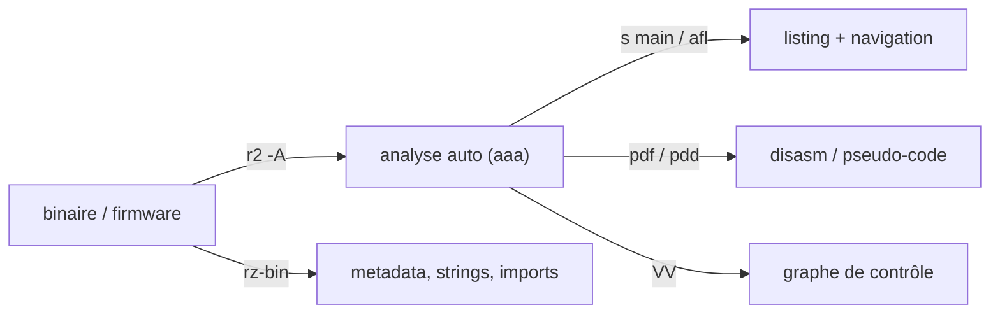

# radare2 — Mobile & Reverse Engineering

> [!info] **En 1 phrase**
> **radare2 (r2)** est un framework de reverse engineering **100% CLI** : analyse, désassemblage, édition,
> debug et visualisation de binaires, avec un écosystème de plugins dont **r2ghidra** (le décompilateur de
> Ghidra) et le paquet **rz-bin** pour l'extraction d'informations (moins connu que Ghidra).

---

## Overview

| Champ | Valeur |
|---|---|
| Nom complet | radare2 (r2) |
| Description | Framework de reverse engineering en CLI : analyse, désassemblage, édition, debug et visualisation de binaires |
| Catégorie | Mobile & Reverse Engineering |
| Fonction principale | `r2 -A <binaire>` → boucle interactive `[0x...]>` (analyse, désassemblage, patch) |
| Type d'outil | CLI (avec vue graphe en terminal) + bibliothèque (libr2) + outils satellites |
| Licence | GNU GPL v3 |
| Langage(s) de programmation | C (libr2), bindings r2pipe (Python, Node, …) |
| Développeur / organisation | radareorg (initié par pancake / ncorn) |
| Projet officiel | radareorg/radare2 |
| Dépôt officiel | https://github.com/radareorg/radare2 |
| Documentation officielle | https://book.rada.re (Radare2 Book) |
| Dernière version connue | 6.2.0 (07/08/2026, « Febrer Deams ») |
| Systèmes compatibles | Linux, Windows, macOS, *BSD — architectures x86/ARM/MIPS/… |

> [!note] À vérifier
> Version 6.2.0 relevée au moment de la rédaction (codename « Febrer Deams », ~500 commits, 25 contributeurs) ; vérifier https://github.com/radareorg/radare2/releases pour la release à jour.

---

## Concept

r2 est un outil en ligne de commande puissant mais à la courbe d'apprentissage raide : une boucle
interactive (`[0x...]>`) où tout se pilote avec des commandes courtes (`aaa` = analyse automatique,
`afl` = liste des fonctions, `pdf` = désassemble une fonction, `s` = seek). On l'utilise pour l'analyse
rapide de binaires, les CTF, le reverse de firmware et la rétro-analyse sans GUI. `rz-bin` extrait les
métadonnées, strings, imports et sections. Le couple **r2 + r2ghidra** fournit un décompilateur C digne
de Ghidra en pur CLI. Dans un pentest, radare2 se place en phase de **reverse engineering** : comprendre le fonctionnement d'un binaire (légitime ou malveillant), localiser une fonction de validation, extraire un secret, patcher un programme ou vérifier les protections avant exploitation (PIE, NX, canary).



---

## Concepts fondamentaux

| Concept | Explication |
|---|---|
| Seek (`s`) | Déplacement du curseur (offset) dans le binaire — la navigation se fait par `s <adresse|symbole|string>` |
| Analyse automatique (`aaa`) | Analyse profonde : fonctions, références croisées, strings ; `afl` liste ensuite les fonctions trouvées |
| Désassemblage (`pdf`) | « Print disassemble function » : désassemble la fonction sous le curseur (ou `pdf @ main`) |
| Décompilation (`pdd`) | Pseudo-code C produit par le plugin **r2ghidra** (portage du décompilateur de Ghidra) |
| Vue graphe (`VV`) | Représentation graphique du graphe de contrôle dans le terminal |
| Xrefs (`axt`) | Cross-references vers une adresse : « qui appelle/pointe ici ? » |
| Patch (`w` / `wx`) | Écriture d'octets en mémoire (`wx 75`) — ouverture avec `r2 -w` pour sauvegarder |
| Debug (`r2 -d`) | Mode debugger intégré (`db`, `dc`, `ds`, `dr`) : breakpoints, pas-à-pas, registres |
| r2pm | Gestionnaire de plugins (ex. `r2pm -ci r2ghidra`) |

---

## Installation

### Linux (paquet)

```bash
sudo apt install radare2          # version du dépôt parfois ancienne
```

### Depuis les sources (version à jour)

```bash
git clone https://github.com/radareorg/radare2
cd radare2 && ./sys/install.sh
```

### Windows

```powershell
# Installateur officiel ou build portable :
# https://github.com/radareorg/radare2/releases → r2_6.2.0_windows64.zip
# puis ajouter le dossier bin/ au PATH
r2 --version
```

### Plugin r2ghidra

```bash
r2pm -ci r2ghidra                # compile et installe le décompilateur
r2 -A ./binaire && s main && pdd # vérification
```

> [!warning] Prérequis & problèmes potentiels
> - `r2pm -ci r2ghidra` compile le plugin (C++/CMake) : nécessite un compilateur et du temps.
> - Sous Windows, préférer le zip officiel (pas de dépendances système).
> - Si `r2` existe en version ancienne (paquet distro) et qu'un `r2` frais est installé, vérifier `r2 -v` et le `PATH` (conflits fréquents avec le fork Rizin).

---

## Configuration

r2 se configure via les **variables `e`** (eval), le **fichier de démarrage** `~/.radare2rc` et les flags de ligne de commande.

| Paramètre | Rôle | Valeur possible | Impact | Exemple |
|---|---|---|---|---|
| `asm.arch` | Architecture par défaut | `x86`, `arm`, `mips`, `dalvik`… | Désassemblage correct | `e asm.arch=arm` |
| `asm.bits` | Taille des registres | `32` \| `64` | Désassemblage 32/64 bits | `e asm.bits=64` |
| `asm.syntax` | Syntaxe Intel/AT&T | `intel` \| `att` | Lisibilité du disasm | `e asm.syntax=intel` |
| `anal.depth` | Profondeur de l'analyse | entier | Équilibre vitesse/précision de `aaa` | `e anal.depth=64` |
| `bin.strings` | Extraction des strings | `true`/`false` | Activation `iz`/`izz` | `e bin.strings=true` |
| `cfg.debug` | Mode debug par défaut | `true`/`false` | `r2 -d` permanent | `e cfg.debug=true` |
| `scr.color` | Coloration de sortie | `0`\|\| `true` | Sorties scriptables | `e scr.color=0` |

---

## Architecture interne

- **libr2** : bibliothèque C monolithique découpée en couches : `libr_core` (orchestration, boucle interactive), `libr_io` (couche I/O fichier/processus/réseau), `libr_bin` (parsers de formats : ELF, PE, Mach-O, DEX, MZ…), `libr_asm` (assemblage/désassemblage multi-architectures via plugins), `libr_anal` (analyse : fonctions, xrefs, types), `libr_debug` (backends de debug : ptrace, windbg…), `libr_esil` (émulation d'instructions).
- **Boucle interactive** : `[0x...]>` — commandes courtes à 1-2 lettres regroupées par préfixe (`s` = seek, `p` = print, `a` = analyse, `w` = write, `d` = debug, `i` = info, `x` = hexdump).
- **Plugins** : chargés depuis `libr/` et via `r2pm` (ex. r2ghidra). Chaque famille (bin, asm, anal, dbg, io) a une API de plugin.
- **Outils satellites** : `rabin2` (métadonnées), `rasm2` (assembleur/désassembleur), `radiff2` (diff de binaires), `rahash2` (hachage), `rax2` (conversions base), `rarun2` (environnement d'exécution), `r2agent` (daemon).
- **r2pipe** : socket/pipe vers la boucle interactive pour le scripting externe.

---

## Commandes

### Commandes essentielles

```bash
r2 -A ./binary             # ouvre + analyse automatique
aaa                        # analyse profonde (dans la boucle r2)
afl                        # liste des fonctions
s main                     # seek vers la fonction main
pdf @ main                 # désassemble la fonction main
VV                         # vue graphe de contrôle (q pour quitter)
px 64 @ 0x401000           # hexdump 64 octets
rz-bin -I ./binary         # infos (architecture, format)
rz-bin -s ./binary         # strings
```

### Non-interactif (scripts)

```bash
r2 -qc "aaa; s main; pdf" ./binaire        # un coup, sans boucle
r2 -qc "s main; pdd" ./binaire             # décompilation directe
```

| Commande | Effet |
|---|---|
| `r2 -A binaire` | Ouvre le fichier et lance l'analyse automatique |
| `aaa` | Analyse avancée (fonctions, xrefs, strings) |
| `afl` | Affiche la liste des fonctions |
| `s main` | Déplace le curseur (seek) sur `main` |
| `pdf @ main` | Désassemble la fonction pointée |
| `VV` | Graphe de contrôle interactif |
| `px 64` | Hexdump 64 octets depuis le curseur |
| `rz-bin -I` | Métadonnées du fichier (ELF/PE, archi) |
| `axt @ <addr>` | Cross-references vers une adresse |
| `pdd` | Pseudo-code C via r2ghidra |

---

## Options et flags

### Flags de ligne de commande `r2`

| Option | Description | Exemple | Niveau |
|---|---|---|---|
| `-A` | Analyse automatique à l'ouverture | `r2 -A binaire` | Basic |
| `-w` | Ouverture en écriture (patch persisté) | `r2 -w binaire` | Basic |
| `-d` | Mode debugger (attache/lance) | `r2 -d ./prog` | Intermediate |
| `-q` | Mode silencieux (non-interactif) | `r2 -qc "pdf @ main" binaire` | Basic |
| `-c <cmd>` | Commande(s) exécutée(s) à l'ouverture | `r2 -qc "aaa" binaire` | Intermediate |
| `-n` | Ne pas charger les symboles | `r2 -n binaire` | Advanced |
| `-e <var=val>` | Définit une variable d'env avant lancement | `r2 -e asm.bits=32 binaire` | Advanced |

### Commandes in-shell fréquentes

| Commande | Description | Niveau |
|---|---|---|
| `iI` / `iS` / `iE` | Infos générales / sections / entrées | Basic |
| `iz` / `izz` | Strings courtes / longues (tous fichiers) | Basic |
| `afi` | Détail de la fonction courante | Intermediate |
| `w wx <hex>` | Écriture d'octets | Intermediate |
| `db <addr>` / `dc` / `ds` / `dr` | Breakpoint / continuer / step / registres (debug) | Advanced |
| `axt <addr>` | Xrefs vers une adresse | Intermediate |
| `V` / `VV` | Vue panneaux / graphe | Intermediate |
| `?` / `?*` | Aide contextuelle / liste des commandes | Basic |

> [!tip] Options les plus utiles au quotidien
> `r2 -A binaire` puis `afl`, `s main`, `pdf`, `px 64`, `axt`, `VV` ; pour le scripting : `r2 -qc "..."` et `e scr.color=0`.

---

## Exemples pratiques

### Beginner

```bash
# Objectif : ouvrir un binaire et obtenir un premier aperçu
r2 -A ./hello
# dans la boucle :
iI                       # architecture, format, PIE/NX/canary
afl                      # fonctions détectées
s main && pdf            # désassemble main
px 32 @ main             # 32 premiers octets de la fonction
```

### Intermediate

```bash
# Objectif : retrouver les strings intéressantes et leurs usages
iz                       # strings courtes (dont .rodata)
s "Enter password"       # seek sur la string
axt @ <addr>             # qui la référence ?
pdf @ sym.check          # lire la fonction qui l'utilise
```

### Advanced

```bash
# Objectif : décompilation C via r2ghidra
r2 -qc "aaa; s sym.check; pdd" ./challenge
# Objectif : dump mémoire de la pile en mode debug
r2 -d ./challenge
db sym.check
dc
dr rdi                    # premier argument (ex. le buffer saisi)
px 32 @ rsp
```

### Expert

```bash
# Objectif : patch d'un check sans relancer l'analyse
r2 -w ./challenge
aaa
s sym.check
pdf                       # repérer le saut conditionnel
s <addr_du_jz>
wx 75                     # JZ -> JNZ
q                         # sauvegarde le patch (mode -w)
```

---

## Workflow complet (scénario pas à pas)

Scénario : retrouver la chaîne de comparaison d'un programme de CTF.

1. **Ouvrir et analyser** :
   ```bash
   r2 -A challenge
   ```
2. **Lister les fonctions** :
   ```
   afl | grep main
   ```
3. **Chercher les strings** :
   ```
   iz        (strings du .rodata)
   ```
4. **Seek sur la string intéressante et suivre les xrefs** :
   ```
   s "password?"  puis  axt @ addr   → xrefs
   ```
5. **Lire la fonction appelante** :
   ```
   pdf @ 0x4011a0   → on voit strcmp(input, secret)
   ```
6. **Récupérer le secret en mémoire** :
   ```
   s <addr> ; ps @ addr
   # ou en debug :  r2 -d challenge ; s main ; dcu main ; dr rdi=AAAA...
   ```

```bash
# Désassemblage d'une seule fonction en sortie :
r2 -qc "aaa; s main; pdf" ./challenge
# Décompilation via le plugin r2ghidra :
r2 -qc "aaa; s main; pdd" ./challenge
```

---

## Scénarios avancés

### Scénario 1 : Patching d'un binaire de CTF (contournement de check)

Localiser le test de comparaison et inverser la condition avec `wa` (write asm) puis `w` (write bytes).

```bash
r2 -w challenge                 # ouverture en écriture
aaa
s sym.check_password            # se placer sur la fonction de check
pdf                             # repérer le saut conditionnel
# Inverser le JZ en JNZ (0x74 -> 0x75) sur le saut identifié
s <addr_du_jz>
wx 75                           # patch en mémoire
q
# Le binaire patché accepte maintenant n'importe quel mot de passe
```

### Scénario 2 : Analyse statique d'un malware ELF

Extraire les indicateurs (C2, chemins) d'un binaire malveillant Linux sans l'exécuter.

```bash
rz-bin -I malware.elf           # type, archi, sections
rz-bin -s malware.elf | grep -iE "http|\.onion|/tmp"
r2 -A malware.elf
aaa
iz; izz                          # strings courtes et longues
axt @ <addr_c2>                  # qui référence l'URL du C2 ?
pdf @ main                       # comprendre le point d'entrée
```

---

## Cybersecurity use cases

| Phase | Utilisation |
|---|---|
| Reverse engineering | Désassemblage/analyse rapide de binaires (légitimes ou malveillants) |
| Analyse de malware | Extraction de C2/strings, compréhension du point d'entrée, sans exécution |
| CTF / crackme | Localisation de la logique de validation, patch, extraction de secrets |
| Analyse de firmware | Reverse de bootloaders/IoT (multi-architectures) |
| Vérification de protections | PIE/NX/canary via `iI`, préparation d'exploitation (ROP : `rasm2`, gadgets) |

---

## MITRE ATT&CK

| Tactique | Technique / Sub-technique | ID | Raison | Détection | Mitigation |
|---|---|---|---|---|---|
| Execution | Native API | T1106 | Compréhension des appels système/API d'un binaire pour l'analyser ou l'exploiter | Monitoring des processus de debug sur les postes d'analyse | Sandboxing des labos d'analyse |
| Defense Evasion | Obfuscated Files or Information | T1027 | Analyse de binaires obfusqués/packés (dé-pack, xrefs, ESIL) | Détection d'outils de RE (Sigma) | Obfuscation robuste, packs |
| Defense Evasion | Debugger Evasion | T1622 | Contournement/identification d'anti-debug au cours de l'analyse | Traçage des accès ptrace | Durcissement anti-debug |
| Credential Access | Unsecured Credentials : Credentials In Files | T1552.001 | Découverte de secrets/credentials dans les strings d'un binaire | Revue des strings (défense) | Pas de secrets en clair dans les binaires |

> [!note] Ne renseigner que si l'association est réellement pertinente.
> radare2 est un **outil d'analyse** ; côté défense il est surtout utilisé pour trier/analyser des échantillons. Les IDs les plus pertinents restent T1027 (obfuscation) et T1552.001 (secrets dans les strings).

---

## Defensive Security

### Signes observables

| Indicateur | Détail |
|---|---|
| Exécution de `r2`, `rabin2`, `rz-bin`, `rasm2` sur un poste | Artefact de RE — à corréler avec les échantillons analysés |
| Processus debug attaché (`r2 -d`, ptrace) | Signal d'analyse dynamique |
| Sorties massives de désassemblage | Logs/textes volumineux typiques d'un lab |
| `r2pm` installations de plugins | Configuration d'un poste de RE |

### Règles de détection (Sigma / Suricata / Snort / YARA)

```yaml
# Sigma — Linux : exécution d'outils radare2 (reverse engineering)
title: Radare2 Execution
id: 9c6f1a5d-3e8b-4f2c-8d4a-0b1c2d3e4f5a
status: test
logsource:
    category: process_creation
    product: linux
detection:
    selection:
        Image|endswith:
            - 'r2'
            - 'rabin2'
            - 'r2pm'
            - 'rasm2'
        CommandLine|contains:
            - '-A'
            - 'aaa'
    condition: selection
falsepositives:
    - Reverse engineering légitime en lab
level: low
```

---

## Automatisation

```bash
# Bash — lot d'analyse : extraire strings + fonctions de plusieurs binaires
for bin in samples/*; do
    echo "== $bin =="
    r2 -q -c "aaa; afl" "$bin" 2>/dev/null | head -10
done
```

```python
# Python — r2pipe : analyse programmatique avec sortie JSON
import r2pipe

r2 = r2pipe.open("challenge")
r2.cmd("aaa")
funcs = r2.cmdj("aflj")          # liste des fonctions (JSON)
for f in (funcs or []):
    if f.get("name") == "sym.check":
        dis = r2.cmdj(f"pdfj @ {f['offset']}")
        print(f"addr: {hex(f['offset'])} size: {f['size']} instrs: {len(dis or [])}")
r2.quit()
```

---

## Output et parsing

r2 produit du **texte** par défaut et du **JSON** avec les commandes suffixées `j` (`aflj`, `pdfj`, `iIj`, `izzj`). C'est la voie recommandée pour automatiser.

```bash
# Fonctions (JSON) triées par taille
r2 -qc "aaa; aflj" ./binaire | jq -r '.[] | "\(.size)\t\(.name)"' | sort -rn | head -10
# Strings courtes : trouver les URLs
r2 -qc "izzj" ./binaire | jq -r '.[].string' | grep -E "https?://"
# Métadonnées du format en JSON
r2 -qc "iIj" ./binaire | jq '{arch: .arch, bits: .bits, format: .bin}
```

```python
# Python — extraction des xrefs vers une string
import r2pipe, json
r2 = r2pipe.open("malware.elf")
r2.cmd("aaa")
hit = r2.cmdj('izzj')
url = next((s for s in hit if "http" in s.get("string","")), None)
if url:
    refs = r2.cmdj(f"axtj @ {url['vaddr']}")
    for r in (refs or []):
        print(f"ref from {r['from']} type={r.get('type')}")
```

---

## Intégrations

```text
r2 (analyse/script) → r2ghidra (pdd) → patch (wx) → re-test dynamique (r2 -d)
rabin2/rz-bin (metadata) → scripts d'analyse → rapport
```

- [[Tools| Outils]] global
- [[Outil - Cutter| Cutter]] — GUI construite sur le même moteur (Rizin pour la v2+)
- [[Outil - Ghidra| Ghidra]] — décompilateur de référence (dont r2ghidra est un portage)
- [[Outil - gdb-peda| gdb-peda]] — debug dynamique complémentaire
- [[Outil - x64dbg| x64dbg]] — debug/RE sous Windows (interface graphique)
- [[Techniques/Buffer Overflow|Buffer Overflow]] · [[Techniques/Hardware - JTAG et SWD| JTAG / SWD]]

---

## Alternatives

| Outil | Avantages | Inconvénients | Cas d'usage |
|---|---|---|---|
| [[Outil - Ghidra|Ghidra]] | Décompilateur excellent, GUI, collaboration | Lourd, analyse moins fine en CLI | Gros binaires, équipe |
| [[Outil - Cutter|Cutter]] | GUI sur le moteur de r2 (Rizin) | Décompilateur optionnel (r2ghidra) | RE confortable sans r2 brut |
| objdump / readelf | Présents partout, simples | Analyse limitée | Vérifs rapides |
| gdb ([[Outil - gdb-peda|gdb-peda]]) | Debug dynamique mature | Pas d'analyse statique étendue | Débogage pas-à-pas |
| Ghidra headless | Analyse scriptable en CLI | Setup plus lourd que r2 | Pipelines d'analyse |

> **Quand radare2 plutôt que Ghidra ?** Dès qu'il faut de la **rapidité, du scripting et du léger** (CTF, firmware, serveurs sans GUI) : r2 + r2pipe automatisent tout en pur CLI. Ghidra reste supérieur pour les gros projets collaboratifs et la lisibilité du décompilateur.

---

## Performance

- `r2` ouvre un binaire **en millisecondes** ; `aaa` peut prendre de **quelques secondes à plusieurs minutes** sur les gros binaires (d'où `anal.depth`, `e anal.threads`).
- L'indexation des strings (`izz`) est rapide mais volumineuse sur les gros fichiers — filtrer (`~http`).
- Le désassemblage d'une fonction (`pdf`) est quasi instantané.
- r2ghidra (`pdd`) compile une passe de décompilation : premier appel plus lent, puis mis en cache.
- Les bindings r2pipe ajoutent une surcharge réseau/pipe minime.

---

## Troubleshooting

### Common problems

#### Problème : `Cannot analyze ...` / analyse incomplète

- **Cause** : architecture non détectée, format inconnu, analyse trop peu profonde.
- **Solution** : forcer l'archi (`r2 -a arm -b 32`), réduire `anal.depth`, utiliser `aaaa` (analyse complète) sur les binaires durs.
- **Vérification** : `iI` pour voir la détection ; `e anal.timeout` pour borner.

#### Problème : `r2` ne trouve pas `r2ghidra` (`pdd` inconnu)

- **Cause** : plugin non installé ou dans un mauvais `R2_PLUGINS`.
- **Solution** : `r2pm -ci r2ghidra`, vérifier `r2 -L | grep ghidra`.
- **Vérification** : `pdd` fonctionne après rechargement.

#### Problème : sortie illisible dans un script / terminal

- **Cause** : couleurs ou pager actifs (`scr.color`, `scr.pager`).
- **Solution** : `e scr.color=0` et `e scr.pager=0` dans les scripts (`r2 -e scr.color=0 -qc ...`).
- **Vérification** : sortie sans séquences ANSI.

---

## Sécurité de l'outil

- **Malware** : analyser les échantillons dans une VM isolée (réseau cloisonné) ; le mode debug (`r2 -d`) exécute le binaire.
- **Chaîne d'outils** : compiler depuis les sources ou télécharger les releases officielles (https://github.com/radareorg/radare2/releases) ; vérifier les signatures.
- **Données** : les dumps/scripts r2 peuvent contenir des secrets de l'échantillon : ne pas les versionner publiquement.
- **Exposition** : ne pas exposer `r2agent` sur un réseau non fiable.
- **Autorisation** : le reverse de binaires tiers (apps, firmware) doit rester dans un cadre autorisé.

---

## Limitations

- **Courbe d'apprentissage raide** : les commandes courtes et la syntaxe `@`/`e`/`?` demandent du temps.
- **Analyse imparfaite** : sur les binaires strippés/obfusqués, `aaa` reconstruit partiellement (`afl` moins utile) ; `aaaa` aide mais ralentit.
- **Décompilateur** : r2ghidra est excellent mais moins affiné que Ghidra sur les gros projets.
- **Écosystème fragmenté** : coexistence r2/Rizin (`rabin2` vs `rz-bin`) peut prêter à confusion.
- **Pas de collaboration intégrée** : contrairement à Ghidra, pas de serveur de projet partagé.

---

## Cheatsheet

```bash
# Ouvrir + analyser
r2 -A ./binaire
# Analyse complète (binaires durs)
aaaa
# Fonctions
afl
# Seek + désassemblage
s main
pdf @ main
# Pseudo-code C (r2ghidra)
s main; pdd
# Strings
iz            # courtes
# Hexdump
px 64 @ <addr>
# Patch (mode -w)
r2 -w ./binaire
s <addr>
wx 75
q
# Debug
r2 -d ./prog
db main; dc; dr; ds
# Non-interactif (scripts)
r2 -qc "aaa; s main; pdf" ./binaire
```

---

## Quick reference

| | |
|---|---|
| **À quoi sert-il ?** | Framework RE en CLI : analyse, désassemblage, patch, debug, graphe |
| **Quand l'utiliser ?** | CTF, reverse rapide, firmware, malware (statique), scripting sans GUI |
| **Commande principale** | `r2 -A binaire` puis `afl`, `s main`, `pdf`, `VV`, `pdd` |
| **Alternative principale** | [[Outil - Ghidra|Ghidra]] (décompilateur/GUI), [[Outil - Cutter|Cutter]] (GUI sur r2) |
| **Concepts importants** | seek, aaa, afl, pdf, pdd, xrefs (axt), patch (wx), r2pipe, ESIL, rabin2/rz-bin |
| **Liens associés** | [[Outil - Cutter]] · [[Outil - Ghidra]] · [[Outil - gdb-peda]] · [[Outil - x64dbg]] |

---

## Détection & Défense

| Signe | Défense |
|---|---|
| Anti-debug (ptrace self-attach, `TracerPid`) | Déjouer via LD_PRELOAD ou plugin r2 ; signaler la technique |
| Obfuscation (opaque predicates, strings XORées) | Chercher les chaînes en clair à la main, désassembler dynamiquement |
| Anti-disasm (bytecode invalide entre vraies instructions) | Ne pas suivre `pdf` aveuglément, analyser les données |
| Binaire packé (UPX/Themida) | `upx -d` d'abord, sinon dump mémoire |
| Binaire strippé | `aaa` reconstruit partiellement, `afl` moins utile ; relancer sur les symboles via flir |

---

## Tips & Pièges

> [!tip] **La boucle interactive gagne du temps**
> Tout se fait dans la boucle `[0x...]>` : combine `s`, `pdf`, `px`, `axt` pour naviguer sans relancer
> l'outil. Tape `?` pour lister les commandes de la catégorie courante.

> [!tip] **r2ghidra en CLI = Ghidra sans GUI**
> `pdd` produit le pseudo-code C : parfait pour les scripts et serveurs d'analyse sans interface
> graphique.

> [!warning] `-A` OU `aaa`, pas les deux**
> `r2 -A` lance déjà l'analyse : refaire `aaa` derrière est inutile et ralentit. Choisis un mode.

> [!warning] **Bien choisir son outil**
> r2 excelle en **CLI/scripting** ; Cutter apporte la GUI ; Ghidra le décompilateur de référence.
> CTF rapide = r2, gros binaire = Ghidra.

---

## References

### Official

- Dépôt officiel : https://github.com/radareorg/radare2
- Site officiel : https://rada.re
- Radare2 Book (documentation) : https://book.rada.re
- Releases / changelogs : https://github.com/radareorg/radare2/releases
- r2ghidra (plugin décompilateur) : https://github.com/radareorg/r2ghidra

### Security references

- MITRE ATT&CK T1106 — Native API : https://attack.mitre.org/techniques/T1106/
- MITRE ATT&CK T1027 — Obfuscated Files or Information : https://attack.mitre.org/techniques/T1027/
- MITRE ATT&CK T1622 — Debugger Evasion : https://attack.mitre.org/techniques/T1622/
- MITRE ATT&CK T1082 — System Information Discovery : https://attack.mitre.org/techniques/T1082/
- MITRE ATT&CK T1552.001 — Unsecured Credentials : https://attack.mitre.org/techniques/T1552/001/

### Community

- HackTricks — Reverse engineering : https://book.hacktricks.xyz/reversing-and-exploiting
- blog de pancake (fondateur) : https://github.com/radareorg
- Rizin (fork) : https://github.com/rizinorg/rizin
---

**Liens :** [[Tools| Outils]] · [[Outil - Cutter| Cutter]] · [[Outil - Ghidra| Ghidra]] · [[Outil - gdb-peda| gdb-peda]] · [[Outil - x64dbg| x64dbg]] · [[Techniques/Buffer Overflow|Buffer Overflow]] · [[Techniques/Hardware - JTAG et SWD| JTAG / SWD]]
