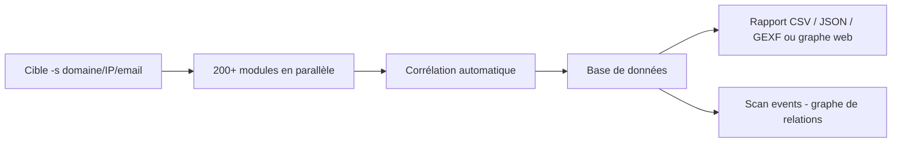
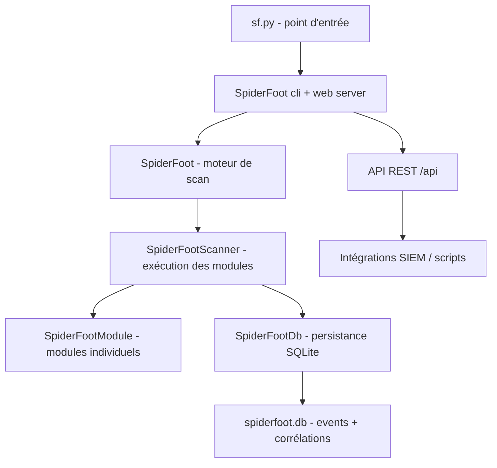

# SpiderFoot — Plateforme OSINT automatisée et corrélée

> [!info] **En 1 phrase**
> SpiderFoot est une plateforme OSINT automatisée qui combine plus de 200 modules (DNS, whois, Shodan, réseaux sociaux, brute-force, certs) pour cartographier une cible en un clic, via interface web ou CLI.

---

## Overview

| Champ | Valeur |
|---|---|
| Nom complet | SpiderFoot |
| Description | Plateforme de renseignement (OSINT) automatisée : collecte, corrélation et visualisation de données sur des cibles (domaines, IP, emails, ASN, binaires, téléphones...) |
| Catégorie | Reconnaissance & OSINT |
| Sous-catégorie | OSINT / Threat Intelligence / Recon automatisée |
| Fonction principale | Lancer des scans multi-modules sur une cible et corréler les résultats en graphe |
| Type d'outil | Application web (défaut `127.0.0.1:5001`) + CLI (`sf.py`) + API |
| Licence | MIT |
| Open source / propriétaire | Open source |
| Langage(s) de programmation | Python 3 |
| Développeur / organisation | Steve Micallef (smicallef) |
| Projet officiel | https://www.spiderfoot.net |
| Dépôt officiel | https://github.com/smicallef/spiderfoot |
| Documentation officielle | https://www.spiderfoot.net/documentation/ |
| Date de création | ~2017 (développement continu depuis) |
| État du projet | actif |
| Dernière version connue | v4.0 (branche `v4.0` / `main` en cours de développement actif) |
| Systèmes compatibles | Linux, macOS, Windows (Docker recommandé), Python 3 |

> [!note] Pour vérifier / compléter
> Le projet est passé en v4.0 (refonte de l'UI et de l'API). La branche `main` est la référence : `git clone` puis `git checkout v4.0` (ou rester sur `main`). Docker est le mode d'installation le plus fiable.

---

## Concept

SpiderFoot automatise la **collecte OSINT** : on lui donne une cible (domaine, IP, email, ASN) et il lance automatiquement des centaines de scans en parallèle, reliés par une logique de **corrélation** (une IP trouvée alimente d'autres modules). Résultat : une base de données exploitable + un graphe de relations. Idéal en début d'engagement pour obtenir une vue **large et exhaustive** en peu de temps. Utilisable en CLI (`spiderfoot -s <cible>`) ou via l'interface web (`spiderfoot -l 127.0.0.1:5001`).

Le scan se déroule en deux grandes familles de modules : les modules **passifs** (DNS, CT, whois, API tierces) qui ne touchent pas la cible, et les modules **actifs** (`PORTSCAN`, `BRUTE`, `SFPORTSCAN`) qui envoient des requêtes directes. Les résultats sont stockés en base SQLite et consultables via l'onglet **Browse** (graphe) ou **Scan Results**. En pentest, on l'utilise en amont pour **réduire la surface de recon manuelle**, puis on exporte pour alimenter le rapport (CSV, JSON, GEXF).



---

## Concepts fondamentaux

| Concept | Explication |
|---|---|
| Cible (target) | Domaine, IP, email, ASN, mot-clé, téléphone, binaire (hashes)... : le point d'entrée du scan |
| Modules | Briques de collecte : chacun interroge une source précise (DNS, WHOIS, CT, Shodan, Google, etc.) |
| Corrélation | Les entités découvertes (IP, email, sous-domaine) deviennent de nouvelles cibles de modules : scan en cascade |
| Scan events | Résultats individuels (type + data) : `IPADDR:203.0.113.5`, `EMAILADDR:...`, `WEBSERVER_BANNER:...` |
| Scan types | Familles de données générées : `DOMAIN_NAME`, `IP_ADDRESS`, `EMAILADDR`, `LEAKED_PASSWORD`, `NETBLOCK`... |
| Base SQLite | Stockage local des résultats et de la configuration (`spiderfoot.db`) |
| UI web | Console avec barre de recherche, onglets Scan/Browse/Config, vue graphe interactive |
| API | Interface REST pour lancer des scans et récupérer les résultats (intégration SIEM/scripts) |
| Mode actif vs passif | Les modules passifs ne contactent pas la cible ; PORTSCAN/BRUTE envoient des requêtes |

---

## Installation

### Via Docker (recommandé)

```bash
docker pull ghcr.io/smicallef/spiderfoot:latest
docker run -d -p 5001:5001 -v /data:/data ghcr.io/smicallef/spiderfoot:latest
# puis http://localhost:5001
```

### Depuis les sources

```bash
git clone https://github.com/smicallef/spiderfoot.git
cd spiderfoot
git checkout v4.0
pip install -r requirements.txt
python3 ./sf.py -l 127.0.0.1:5001
```

### Kali / apt

```bash
# Paquet spiderfoot présent dans Kali
sudo apt install spiderfoot
```

### Vérification

```bash
python3 ./sf.py -V
python3 ./sf.py -l 127.0.0.1:5001
# Ouvrir http://127.0.0.1:5001
```

---

## Configuration

### Modules du scan (UI)

Dans l'interface : onglet **Modules** de la création de scan, on coche les modules (ou « all »). Les modules peuvent nécessiter des clés API (Shodan, VirusTotal, Censys, BinaryEdge...) configurées dans l'onglet **Configuration** (`api_key` / `api_key_<service>`).

### Options CLI

| Option | Effet |
|---|---|
| `-s <cible>` | Cible à scanner |
| `-t <type>` | Type de cible (`DOMAIN`, `IPADDR`, `EMAILADDR`, `ASN`...) |
| `-m <modules>` | Modules (`-m all`, `-m DNS,SSL`, `-m PORTSCAN`) |
| `-l <host:port>` | Interface web (défaut `127.0.0.1:5001`) |
| `-p` | Scan prioritaire |
| `-q` | Mode silencieux |
| `-o <fichier>` | Export : `.csv`, `.json`, `.gexf` |
| `-L` | Liste des modules |
| `-T <type>` | Liste des types de données |
| `-u` | Mise à jour de la base de données |

### Clés API à configurer (recommandées)

```
SHODAN_API_KEY, VT_API_KEY (VirusTotal), CENSYS_ID/CENSYS_SECRET,
BINARYEDGE_API_KEY, GOOGLE_API_KEY, OPENCAGEAPI_KEY, TWITTER_API_KEY...
```

---

## Architecture interne



- **`sf.py`** : binaire principal (CLI + serveur web). En v4.0, la CLI est un serveur qui contrôle des *workers*.
- **`spiderfoot/`** : moteur (`SpiderFoot`, `SpiderFootScanner`, `SpiderFootModule`), couche DB (`SpiderFootDb`) et utilitaires.
- **Modules** : chaque module dans un fichier `sflib/` ou package dédié, avec une classe héritant de `SpiderFootModule`, exposant `events`, `options` et `watchedEvents`.
- **Corrélation** : le scanner alimente les modules selon les types d'events qu'ils « watch » : les résultats deviennent des entrées pour d'autres modules.
- **API** : endpoints REST (`/api/scan/create`, `/api/scan/list`, `/api/scan/results`...) pour intégration.

---

## Commandes

### Commandes essentielles

```bash
python3 sf.py -s example.com -m all -q          # scan complet (long)
python3 sf.py -s example.com -m DNS,SSL -q      # modules ciblés
python3 sf.py -s 203.0.113.5 -t IPADDR -q       # cible IP explicite
python3 sf.py -s example.com -m PORTSCAN -p -q  # scan prioritaire + actif
python3 sf.py -L                                 # liste les modules
```

### Tableau des commandes

| Commande | Effet |
|---|---|
| `-s <cible>` | Cible à scanner (domaine, IP, email, ASN...) |
| `-t <type>` | Type de cible (`DOMAIN`, `IPADDR`, `EMAILADDR`, `ASN`...) |
| `-m <modules>` | Modules à utiliser (`-m all`, `-m DNS,SSL`, `-m PORTSCAN`...) |
| `-l <host:port>` | Interface web (par défaut `127.0.0.1:5001`) |
| `-p` | Scan prioritaire (lance les modules importants en premier) |
| `-q` | Mode silencieux (aucune console interactive) |
| `-o <fichier>` | Export : `.csv`, `.json`, `.gexf` (graphe Gephi) |
| `-L` | Liste tous les modules disponibles |
| `-T <type>` | Liste des types de données générés |
| `-u` | Mise à jour de la base de données |

### Modules populaires

```
DNS, DNSR (reverse), SSL (certificats), WHOIS, SHODAN, PORTSCAN (actif),
BRUTE (sous-domaines), CT (certificate transparency), NETBLOCK,
SOCIAL (réseaux sociaux), EMAILADDR, LEAKEDPASSWORDS, SUBDOMAINENUM
```

---

## Options et flags

| Flag | Effet |
|---|---|
| `-s, --spiderfoot <target>` | Cible du scan |
| `-t, --type <type>` | Type de la cible (auto-détection sinon) |
| `-m, --modules <modules>` | Modules séparés par des virgules ou `all` |
| `-p, --prioritise` | Lance d'abord les modules « importants » |
| `-l, --listen <host:port>` | Interface web |
| `-q, --quiet` | Mode silencieux |
| `-o, --output <fichier>` | Export (extension détermine le format) |
| `-L, --list-modules` | Liste des modules |
| `-T, --list-types` | Liste des types d'events |
| `-u, --update` | Mise à jour de la base de données |
| `-V, --version` | Version |
| `-h, --help` | Aide |

---

## Exemples pratiques

### Scan ciblé et rapide (modules passifs)

```bash
python3 sf.py -s example.com -m DNS,SSL,CT -q -o sf_example.json
```

### Scan d'une IP

```bash
python3 sf.py -s 203.0.113.5 -t IPADDR -m all -q
```

### Scan complet silencieux

```bash
python3 sf.py -s example.com -m all -q -o sf_complet.json
```

### Brute-force de sous-domaines

```bash
python3 sf.py -s example.com -m BRUTE -q -o sf_brute.json
```

### Export pour Gephi

```bash
python3 sf.py -s example.com -m all -q -o rapport.gexf
```

---

## Workflow complet (scénario pas à pas)

1. **Lancer l'interface web** : `python3 sf.py -l 127.0.0.1:5001`, puis ouvrir `http://127.0.0.1:5001` et créer un scan sur `example.com` avec tous les modules.
2. **Scan CLI ciblé** : lancer une première passe passive pour cadrer le périmètre.
   ```bash
   python3 sf.py -s example.com -m DNS,SSL,CT -q -o sf_example.json
   ```
3. **Corrélation** : dans l'interface, onglet « Browse » pour naviguer dans le graphe et les liens entre entités (une IP, un email, un sous-domaine).
4. **Brute-force de sous-domaines** : relancer avec le module `BRUTE` pour compléter les sources passives.
5. **Qualifier les résultats** : filtrer les données utiles depuis l'export JSON.
   ```bash
   jq -r '.[] | select(.type=="EMAILADDR") | .data' sf_passe1.json | sort -u
   ```
6. **Export pro** : générer `export.gexf` puis l'ouvrir dans **Gephi** pour une visualisation réseau du graphe.

---

## Scénarios avancés

### Scénario 1 : Recon complète d'un domaine avant engagement

```bash
# Passe 1 : ciblée et rapide
python3 sf.py -s example.com -m DNS,SSL,CT,WHOIS,NETBLOCK -q -o sf_passe1.json
# Passe 2 : approfondie avec modules actifs + bruteforce
python3 sf.py -s example.com -m BRUTE,PORTSCAN,SOCIAL,LEAKEDPASSWORDS -p -q -o sf_passe2.json
# Passe 3 : corrélation des deux passes dans l'UI, export GEXF pour le rapport
python3 sf.py -s example.com -m all -q -o sf_rapport.gexf
```

### Scénario 2 : Analyse d'une adresse email ou d'une IP isolée

```bash
# Email : retrouver les comptes liés et les fuites éventuelles
python3 sf.py -s contact@example.com -t EMAILADDR -m all -q
# IP : cartographier les ports, les certs et les réseaux associés
python3 sf.py -s 203.0.113.5 -t IPADDR -m all -q
# ASN : lister les plages IP et les infrastructures de l'organisation
python3 sf.py -s AS12345 -t ASN -m NETBLOCK,WHOIS,DNS -q
```

### Scénario 3 : Intégration API (automation)

```bash
# Créer un scan via l'API
curl -X POST http://127.0.0.1:5001/api/scan/create \
  -H "Content-Type: application/json" \
  -d '{"target":"example.com","moduleList":"DNS,SSL,CT","type":"DOMAIN","scanId":"scan1"}'
# Lister les résultats
curl "http://127.0.0.1:5001/api/scan/results?scanId=scan1"
```

---

## Cybersecurity use cases

| Cas d'usage | Exemple concret |
|---|---|
| Pentest (recon initiale) | Vue large et exhaustive de la surface en un scan |
| Bug bounty | Énumération passive avant le scan actif du scope |
| Threat Intelligence | Surveillance d'infrastructures malveillantes (phishing, C2) |
| Réponse à incident | Cartographier les actifs publics liés à un domaine/email compromis |
| Due diligence | Évaluation de l'exposition d'une entreprise avant acquisition |
| Audit d'exposition | Revue périodique automatique de sa propre surface |

---

## MITRE ATT&CK

| Technique | ID | Rapport avec SpiderFoot |
|---|---|---|
| Search Open Technical Databases | T1596 | Modules DNS, CT, WHOIS, Shodan, Censys |
| Search Open Websites/Domains | T1593 | Modules Google, réseaux sociaux, mentions |
| Gather Victim Host Information | T1590 | IP, ports (PORTSCAN), services, OS |
| Gather Victim Identity Information | T1589 | Emails, comptes, fuites |
| Active Scanning | T1595 | Modules actifs (PORTSCAN, BRUTE) |
| Search Victim-Owned Websites | T1594 | Recon des sites/apps du domaine |

---

## Defensive Security

| Usage défensif | Description |
|---|---|
| Audit de surface | Scanner son propre domaine/ASN pour connaître les infos publiques disponibles |
| Détection de fuites | Modules LEAKEDPASSWORDS, leaks pour des comptes d'entreprise |
| Monitoring | Scans planifiés + API pour diffuser les résultats vers un SIEM |
| Enrichissement | Corréler les infos OSINT avec les alertes SOC |
| Sensibilisation | Montrer concrètement à la direction ce qu'un attaquant trouve en 30 min |

> [!warning] Contexte
> SpiderFoot combine modules passifs (indolores) et actifs (PORTSCAN/BRUTE) : ces derniers envoient de vraies requêtes vers la cible et les tiers. À n'utiliser que dans le cadre d'un engagement autorisé.

---

## Automatisation

### Scans planifiés (cron)

```bash
# Audit hebdomadaire passif
0 5 * * 1 cd ~/spiderfoot && python3 sf.py -s example.com -m DNS,SSL,CT,WHOIS -q -o /data/sf_$(date +\%F).json
```

### API REST (intégration)

```bash
# Lancer un scan
curl -s -X POST http://127.0.0.1:5001/api/scan/create \
  -d '{"target":"example.com","moduleList":"DNS","type":"DOMAIN"}' \
  -H "Content-Type: application/json"

# Récupérer les events
curl -s "http://127.0.0.1:5001/api/scan/results?scanId=<id>" | jq '.results[] | {type, data}'
```

### Filtrage des exports

```bash
# Extraire les emails et domaines d'un export JSON
jq -r '.[] | select(.type=="EMAILADDR") | .data' sf.json | sort -u
jq -r '.[] | select(.type=="INTERNET_NAME") | .data' sf.json | sort -u
```

---

## Output et parsing

### Formats d'export

| Extension | Format | Usage |
|---|---|---|
| `.csv` | Tableur | Analyse rapide, rapports |
| `.json` | JSON array | Traitement avec `jq` / scripts |
| `.gexf` | Graphe XML | Visualisation Gephi |

### Exemple JSON

```json
[
  {"type": "IPADDR", "data": "203.0.113.5", "module": "DNS_RESOLVE", "source": "example.com"},
  {"type": "INTERNET_NAME", "data": "mail.example.com", "module": "CT", "source": "example.com"}
]
```

### Filtrage avec jq

```bash
jq -r '.[] | select(.module=="CT") | .data' sf.json | sort -u
```

---

## Intégrations

| Outil | Intégration |
|---|---|
| [[Outil - Shodan\|Shodan]] | Module SHODAN (clé API requise) pour enrichir IP/ports |
| [[Outil - Censys\|Censys]] | Module CENSYS (clé API) pour services et certs |
| [[Outil - Amass\|Amass]] | Complémentaire pour l'énumération DNS active (bruteforce massif) |
| [[Outil - Recon-ng\|Recon-ng]] | Alternative modulaire en console pour des passes ciblées |
| [[Outil - theHarvester\|theHarvester]] | Rapide pour la partie emails/hôtes d'un domaine |
| [[Outil - Nmap\|Nmap]] / [[Outil - naabu\|naabu]] | Vérification active des ports/services trouvés |
| Gephi | Visualisation du graphe `.gexf` pour les rapports |
| SIEM / API | Export via API REST pour enrichir les corrélations SOC |

---

## Alternatives

| Outil | Différence clé |
|---|---|
| [[Outil - Recon-ng\|Recon-ng]] | Framework modulaire en console, base SQLite, plus « manuel » |
| [[Outil - theHarvester\|theHarvester]] | Léger, rapide, focalisé emails + hôtes |
| [[Outil - Maltego\|Maltego]] | Analyse graphique interactive avec transforms |
| OSINT frameworks (lists web) | Fiches manuelles, moins automatisées |
| Hunchly / Maltego CE | Collecte web forensique / visualisation |

---

## Performance

| Facteur | Impact |
|---|---|
| `-m all` | Peut prendre des heures : beaucoup de requêtes vers des tiers |
| Quotas API | Les clés (Shodan, VT...) bornent le nombre d'appels |
| Modules actifs | PORTSCAN/BRUTE plus lents et plus visibles |
| Corrélation | La cascade génère beaucoup d'events : penser à limiter la portée |
| Base SQLite | Gros scans : la base peut grossir fortement (purger les anciens scans) |

---

## Troubleshooting

| Problème | Cause probable | Solution |
|---|---|---|
| Erreur d'import Python | Dépendances manquantes | `pip install -r requirements.txt` |
| Interface inaccessible | Port occupé / mauvais `-l` | `-l 127.0.0.1:5001`, vérifier le port |
| Module silencieusement vide | Source modifiée / clé manquante | Configurer la clé API, `git pull` |
| `scan failed` | Type de cible invalide | Préciser `-t DOMAIN/IPADDR/EMAILADDR/ASN` |
| Base corrompue | Crash pendant le scan | Purger/supprimer `spiderfoot.db` (sauvegarde avant) |
| Vue web vide | Worker bloqué | Redémarrer `sf.py`, vérifier les logs |
| Quotas atteints | Tiers rate-limit | Réduire les modules, ajouter des clés |

---

## Sécurité de l'outil

| Point | Détail |
|---|---|
| Interface web | À exposer uniquement sur `127.0.0.1` : une instance publique expose les données de scans |
| Base SQLite | Contient des données OSINT potentiellement sensibles : protéger le dossier |
| Clés API | Stockées dans la config : ne pas les versionner |
| Données tierces | Les requêtes vers les API partent avec votre IP et vos clés |
| Modules actifs | Traçables côté cible : cadre d'autorisation indispensable |

---

## Limitations

| Limitation | Détail |
|---|---|
| Lenteur des scans complets | `-m all` peut prendre des heures |
| Dépendance aux API tierces | Quotas, changements de formats cassent des modules |
| Couverture des sources | Toutes les données publiques ne sont pas couvertes |
| Confiance des résultats | Nécessite une validation humaine (faux positifs, données périmées) |
| UI/CLI v4 | Refonte en cours : compatibilité des anciens scripts à vérifier |

---

## Cheatsheet

```bash
# Scan complet
python3 sf.py -s example.com -m all -q -o sf.json

# Scan ciblé passif
python3 sf.py -s example.com -m DNS,SSL,CT -q

# Cible IP explicite
python3 sf.py -s 203.0.113.5 -t IPADDR -m all -q

# Brute-force sous-domaines
python3 sf.py -s example.com -m BRUTE -q

# Interface web
python3 sf.py -l 127.0.0.1:5001

# Liste des modules
python3 sf.py -L
```

---

## Quick reference

| Action | Commande |
|---|---|
| Scanner un domaine | `python3 sf.py -s <domaine>` |
| Scanner une IP | `python3 sf.py -s <ip> -t IPADDR` |
| Modules ciblés | `-m DNS,SSL,CT` |
| Export JSON/CSV/GEXF | `-o fichier.json/csv/gexf` |
| Interface web | `-l 127.0.0.1:5001` |
| Lister les modules | `-L` |
| Mettre à jour | `git pull && pip install -r requirements.txt` |

---

## Détection & Défense

| Réponse | Détail |
|---|---|
| Modules passifs par défaut | Pas de paquets vers la cible pour la majorité des modules |
| Modules actifs (`PORTSCAN`, `BRUTE`) | Requêtes directes : visibles dans les logs de la cible |
| Volume important | Un scan `-m all` génère beaucoup de requêtes vers des tiers (moteurs, APIs) : attention aux quotas |
| Défense : limiter la surface | Les infos collectées sont publiques : la seule défense est de ne pas les exposer |
| Défense : surveiller les logs DNS/HTTP | Les modules actifs laissent des traces : rate limiting + analyse des patterns de requêtes |

---

## Tips & Pièges

> [!tip] **Commencer par l'UI web**
> L'interface web montre l'**avancement en temps réel** et le graphe de corrélation : bien plus lisible que la CLI pour un premier passage.

> [!tip] **Exporter en GEXF**
> `-o export.gexf` + Gephi donne une visualisation réseau très parlante pour un rapport client.

> [!tip] **Nettoyer la base entre deux engagements**
> Les données de scans restent dans la base SQLite : supprimez les anciens scans avant un nouvel engagement pour éviter les corrélations parasites.

> [!warning] `-m all` peut être très long**
> Des centaines de modules = plusieurs heures et beaucoup de requêtes. Cibler les familles utiles (`-m DNS,SSL,CT`) pour un premier passage.

> [!warning] **Mettre à jour SpiderFoot**
> `git pull` régulièrement : les sources (APIs, parsers) changent et les anciennes versions échouent en silence.

> [!warning] **Ne pas exposer l'interface web**
> Lancer de préférence sur `127.0.0.1` ; une instance exposée sur Internet est une aubaine pour un tiers (données de scans stockées).

> [!danger] **Modules actifs = requêtes vers la cible**
> PORTSCAN et BRUTE sont visibles côté cible : les réserver aux périmètres autorisés.

---

## References

### Official
- [GitHub officiel — SpiderFoot](https://github.com/smicallef/spiderfoot)
- [Documentation SpiderFoot](https://www.spiderfoot.net/documentation/)
- [Site SpiderFoot (HX)](https://www.spiderfoot.net)

### Security
- [Série d'articles SpiderFoot (smicallef)](https://www.spiderfoot.net/blog/)
- [MITRE ATT&CK — Search Open Technical Databases T1596](https://attack.mitre.org/techniques/T1596/)

### Community
- [Docker Hub / images SpiderFoot](https://hub.docker.com/r/spiderfoot/spiderfoot)

---

**Liens :** [[Tools| Outils]] · [[01 - Reconnaissance| Reconnaissance]] · [[Outil - Shodan| Shodan]] · [[Outil - Amass| Amass]] · [[Outil - Recon-ng| Recon-ng]]
