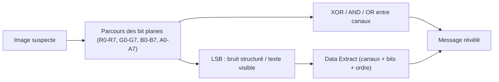

# StegSolve — L'analyseur visuel de stéganographie d'images

> [!info] **En 1 phrase**
> Passez une image pixel par pixel, plan de bits par plan de bits, pour révéler le flag invisible caché dans les couleurs ou les bits de poids faible.

---

## Overview

| Champ | Valeur |
|---|---|
| Nom complet | Stegsolve (StegSolve) |
| Description | Utilitaire Java d'analyse visuelle de stéganographie : plans de bits, extraction de données, combinaisons de canaux, solveur de stéréogrammes |
| Catégorie | CTF & Développement |
| Sous-catégorie | Stéganographie / Forensique |
| Fonction principale | Explorer visuellement les bit planes (R/G/B/A) et extraire des données cachées dans les bits de poids faible |
| Type d'outil | Application GUI Java (`.jar`) |
| Licence | Open source (licence personnalisée) |
| Open source / propriétaire | Open source |
| Langage(s) de programmation | Java |
| Développeur / organisation | Caesum (Robert) — « A Challengers Handbook » |
| Projet officiel | Non centralisé (jar original sur caesum.com) |
| Dépôt officiel (forks) | https://github.com/eugenekolo/stegsolve |
| Documentation officielle | http://www.caesum.com/handbook/stego.htm |
| Dernière version connue | Forks : 1.3 (eugenekolo), 1.4 / 1.5-alpha (Giotino) |
| Systèmes compatibles | Tout système avec Java (JRE 8+) ; Linux, macOS, Windows |

> [!note] À vérifier
> L'outil d'origine (`Stegsolve.jar` sur caesum.com) n'est plus hébergé sur l'ancien lien officiel ; on utilise les forks (eugenekolo/stegsolve, Giotino/stegsolve) ou le paquet dans les collections CTF (`zardus/ctf-tools`). Vérifier la version du jar téléchargé (1.3 / 1.4 / 1.5-alpha).

---

## Concept

StegSolve est un petit utilitaire **Java** qui permet d'analyser une image en profondeur. Au lieu de chercher un fichier caché, il explore les **plans de bits** (bit plane) de chaque canal de couleur (R, G, B, A) et propose des opérations **XOR**, **AND** et **OR** entre canaux. Un flag dissimulé via **LSB** (least significant bit) devient alors visible : la technique du LSB encode le message dans les bits de poids faible de chaque pixel, invisibles à l'œil nu. Avec StegSolve, on bascule entre les plans pour faire apparaître le message en clair.

Il est l'outil de base des **CTF stego** : chaque plan de bit (0 à 7) d'un canal affiche une version de l'image où seul ce bit est conservé (les autres passent en noir ou blanc). Sur les plans 0-2 d'un canal, un message LSB apparaît comme une **bande de bruit structurée** en surimpression. Les opérations combinées (XOR entre deux canaux, par exemple) révèlent aussi des messages répartis entre canaux. Depuis le menu **Analyse**, `Data Extract` permet d'extraire les bits sur une grille définie (offset, bit, canal, ordre) pour reconstituer un message binaire.



---

## Concepts fondamentaux

| Concept | Explication |
|---|---|
| Bit plane | Plan de bits : pour un canal (R/G/B/A), image binaire de chaque pixel où seul le bit n (0-7) est conservé |
| LSB | Least Significant Bit (bit 0) : le plus utilisé pour cacher des données |
| MSB | Most Significant Bit (bit 7) : parfois utilisé pour cacher des images/QR |
| Canal | Composante de couleur : Rouge (R), Vert (G), Bleu (B), Alpha (A) |
| Data Extract | Extraction programmée : choisir canaux + bits + ordre (ligne/colonne) pour reconstituer les octets |
| Frame Browser | Navigation rapide entre les plans de bits (touches fléchées) |
| Image Combiner | Combinaison de deux images (XOR/AND/OR/ADD...) |
| Stereogram Solver | Résout les stéréogrammes (autostéréogrammes) cachant une image |
| File Format | Inspection des structures/headers de l'image (taille, octets supplémentaires) |
| Bit Order | Ordre de lecture des bits dans l'extraction : MSB First ou LSB First |

---

## Installation

### Prérequis : Java

```bash
# Debian/Ubuntu/Kali
sudo apt install default-jre
# Arch
sudo pacman -S jre-openjdk
# macOS
brew install openjdk
```

### Téléchargement (fork maintenu)

```bash
# Fork eugenekolo (v1.3) via ctf-tools
wget https://github.com/eugenekolo/stegsolve/releases/download/v1.3/StegSolve.jar -O stegsolve.jar
```

### Téléchargement (alternative, jar original)

```bash
wget http://www.caesum.com/handbook/Stegsolve.jar -O stegsolve.jar
```

### Lancement

```bash
chmod +x stegsolve.jar
java -jar stegsolve.jar
```

### Ouverture directe d'une image

```bash
java -jar stegsolve.jar image.png
```

> [!warning] Prérequis & problèmes potentiels
> - Java (JRE 8+) obligatoire : `java -version` pour vérifier.
> - L'ancien lien caesum.com peut être mort : privilégier les forks GitHub (eugenekolo, Giotino) ou le paquet dans `zardus/ctf-tools`.
> - Certains paquets système (`apt install stegsolve-java`) existent mais peuvent être anciens — vérifier la version.

---

## Configuration

StegSolve étant une **GUI Java**, la configuration est limitée : menus d'analyse et paramètres de Data Extract dans l'interface.

| Paramètre | Rôle | Valeur possible | Impact | Exemple |
|---|---|---|---|---|
| Analyse > File Format | Inspecter les structures | fenêtre d'info | Voir headers/taille/octets | Vérifier un PNG suspect |
| Analyse > Data Extract | Définir l'extraction | canaux + bits + ordre | Reconstituer les données | Tick R0, G0, B0, LSB first |
| Analyse > Frame Browser | Naviguer les plans | flèches gauche/droite | Explorer visuellement | Aller sur plan R0 |
| Analyse > Image Combiner | Combiner avec une 2e image | XOR/AND/OR/ADD... | Révéler un message inter-canaux | XOR avec image2.png |
| Analyse > Stereogram Solver | Résoudre un stéréogramme | fenêtre | Extraire l'image cachée | Solver sur une image magique |
| Options de rendu | Zoom, scroll (forks 1.4+) | zoom/drag&drop | Confort visuel | Zoomer sur les plans |

> [!note] À vérifier
> Les menus exacts varient selon le fork (Giotino 1.4+ ajoute zoom, drag&drop et « All » dans Data Extract) : vérifier l'interface du jar téléchargé.

---

## Architecture interne

- **Application Java Swing** : interface fenêtrée avec menus (Analyse, Options) et navigation par touches.
- **Lecture d'images** : utilise les lecteurs Java AWT/ImageIO (PNG, BMP, JPEG, GIF) pour décoder la matrice de pixels RGBA.
- **Plans de bits** : pour chaque canal, l'outil isole le bit k (0-7) de chaque pixel et construit une image binaire — l'affichage met en blanc/les autres bits en noir.
- **Data Extract** : extrait un flux de bits selon un masque (canaux cochés), un ordre de lecture (row/column, MSB/LSB first) et un offset — les bits sont regroupés en octets puis en texte/binaire.
- **Image Combiner** : applique des opérations bitwise (XOR, AND, OR, ADD, SUB) pixel à pixel entre deux images chargées.
- **Stereogram Solver** : analyse la répétition horizontale des motifs pour reconstituer le relief/image cachée d'un autostéréogramme.

---

## Commandes

StegSolve est une **GUI** : il n'y a pas de CLI complète. Les « commandes » sont les actions des menus.

| Action (menu) | Objectif | Résultat attendu |
|---|---|---|
| `Analyse > File Format` | Vérifier la structure du fichier | Headers, taille, commentaires |
| `Analyse > Frame Browser` | Parcourir les plans de bits | Vue R0...A7 navigable |
| `Analyse > Data Extract` | Extraire les données par masque | Texte/binaire extrait |
| `Analyse > Image Combiner` | Combiner deux images | Résultat XOR/AND/OR... |
| `Analyse > Stereogram Solver` | Résoudre un stéréogramme | Image cachée |
| `Fichier > Open` | Ouvrir une image | Image affichée |
| `Fichier > Save` | Enregistrer la vue courante | PNG du plan visible |

### Utilisation via terminal (ouverture directe)

```bash
java -jar stegsolve.jar image.png
```

> [!note] À vérifier
> Certains forks/collections proposent un wrapper CLI ; l'outil officiel reste une GUI (contrairement à [[Outil - zsteg]] qui est CLI).

---

## Options et flags

Comme c'est une GUI, les « options » sont les paramètres des boîtes de dialogue :

| Option | Description | Exemple | Niveau |
|---|---|---|---|
| Data Extract — canaux cochés | Sélectionner R/G/B/A pour l'extraction | R0 + G0 + B0 | Intermediate |
| Data Extract — bits | Bits utilisés par canal | bit 0 (LSB) ou 7 (MSB) | Intermediate |
| Data Extract — Bit Order | Ordre de lecture | MSB First / LSB First | Advanced |
| Data Extract — order | Parcours lignes ou colonnes | Row order / Column order | Advanced |
| Data Extract — offset | Décalage initial | 0 | Advanced |
| Frame Browser — flèches | Naviguer les plans | Gauche/droite | Basic |
| Image Combiner — opération | XOR / AND / OR / ADD / SUB | XOR | Intermediate |
| Save — format | Export de la vue | PNG | Basic |

> [!tip] Options les plus utiles au quotidien
> **Frame Browser** (trouver le plan suspect), **Data Extract** avec R/G/B bit 0 (LSB), essayer MSB First puis LSB First, et **Image Combiner** (XOR) entre deux images d'un même challenge.

---

## Exemples pratiques

### Beginner

```bash
# Objectif : lancer l'outil sur une image
java -jar stegsolve.jar image.png
# Puis : Analyse > Frame Browser et naviguer avec les flèches
```

```bash
# Objectif : ouvrir l'image directement
java -jar stegsolve.jar
# Fichier > Open > image.png
```

### Intermediate

```text
# Objectif : repérer un flag LSB
# Analyse > Frame Browser : naviguer sur les plans R0, G0, B0
# Un texte/bande de bruit structurée apparaît sur le plan LSB
```

```text
# Objectif : extraire le flag
# Analyse > Data Extract :
#   cocher Red 0, Green 0, Blue 0
#   Bit Order : LSB First (puis MSB First si rien)
#   Preview → lire le texte
```

### Advanced

```text
# Objectif : image cachée en MSB
# Data Extract : cocher Red 7, Green 7, Blue 7, Bit Order MSB First
# Preview → QR code / image apparaît
```

### Expert

```text
# Objectif : deux images combinées (XOR)
# Analyse > Image Combiner : charger image2.png, opération XOR
# Le flag apparaît dans la différence
```

---

## Workflow complet (scénario pas à pas)

1. **Étape 1 — Ouvrir l'image suspecte** :
   ```bash
   java -jar stegsolve.jar image.png
   ```
2. **Étape 2 — Vérifier la structure** : `Analyse > File Format` (headers, octets supplémentaires éventuels).
3. **Étape 3 — Parcourir les plans de bits** : `Analyse > Frame Browser`, naviguer (flèches) sur R0-R7, G0-G7, B0-B7, A0-A7 ; chercher texte ou motif structuré sur un plan.
4. **Étape 4 — Extraire les données** : `Analyse > Data Extract` avec les canaux/bits suspects, tester LSB First et MSB First, ligne puis colonne.
5. **Étape 5 — Si deux images** : `Image Combiner` (XOR/AND/OR) et re-inspecter.
6. **Étape 6 — Décoder le texte extrait** (base64/hex/ROT via [[Outil - CyberChef]]) et consigner le flag.

---

## Scénarios avancés

### Scénario 1 : flag réparti entre canaux (XOR)

```text
# Deux images du challenge : a.png et b.png
# Analyse > Image Combiner : a.png, opération XOR, b.png
# Le flag apparaît dans l'image résultante
```

### Scénario 2 : QR code caché dans les bits MSB

```text
# Data Extract : R7 + G7 + B7, MSB First, Row order
# Preview → un QR code net ; le scanner donne le flag
```

### Scénario 3 : extraction d'un message binaire (colonnes)

```text
# Data Extract : un seul canal (ex. G0), Column order, LSB First
# La sortie est un flux d'octets → décodez avec CyberChef
```

### Scénario 4 : stéréogramme magique

```text
# Analyse > Stereogram Solver
# L'image cachée (QR/texte) apparaît en 3D
```

---

## Cybersecurity use cases

| Phase | Utilisation |
|---|---|
| Analyse de fichiers | Détecter une stéganographie visuelle (LSB/MSB) |
| CTF / forensique | Résoudre les challenges d'images cachées |
| OSINT | Vérifier des images avant de les diffuser |
| Défense / DLP | Détecter des fuites par stéganographie d'images |
| Recherche | Comprendre les mécanismes de dissimulation |

---

## MITRE ATT&CK

| Tactique | Technique / Sub-technique | ID | Raison | Détection | Mitigation |
|---|---|---|---|---|---|
| Defense Evasion | Obfuscated Files or Information | T1027 | Données cachées dans les images (stéganographie LSB) | Analyse des fichiers/images | DLP, inspection du trafic |
| Collection | Data from Local System | T1005 | Extraction de données depuis des images locales | Monitoring des accès fichiers | Moindre privilège |
| Exfiltration | Exfiltration Over Alternative Protocol | T1048 | Données exfiltrées via images stéganographiées | Analyse du trafic sortant | DLP, filtrage |
| Defense Evasion | Hidden Data (analogie) | T1027.001 | Dissimulation dans les bits de poids faible | Analyse statique des images | Politique de fichiers |

> [!note] Ne renseigner que si l'association est réellement pertinente.
> StegSolve est surtout un outil **d'analyse** : du côté attaquant, la stéganographie d'images correspond à T1027/T1048 (dissimulation/exfiltration) ; du côté défense, il sert à l'inspection (T1005).

---

## Defensive Security

### Signes observables

| Indicateur | Détail |
|---|---|
| Images avec bruit structuré en LSB | Possible stéganographie |
| Fichiers image volumineux pour leur contenu | Données embarquées |
| Trafic sortant d'images suspectes | Exfiltration par stégo |
| Données illisibles après extraction | Chiffrement de la couche cachée |

### Règles de détection (Sigma / Suricata / Snort / YARA)

```yaml
# Sigma — utilisation de Java StegSolve sur un endpoint
title: StegSolve Java Usage
id: a1b2c3d4-e5f6-4a7b-8c9d-0e1f2a3b4c5d
status: experimental
logsource:
    category: process_creation
    product: linux
detection:
    selection:
        CommandLine|contains: 'stegsolve'
    condition: selection
falsepositives:
    - Legitimate CTF analysis
level: low
```

```yaml
# YARA — anomalie de taille d'image vs dimensions (heuristique)
rule suspicious_png_size
{
    strings:
        $ihdr = { 49 48 44 52 }  # "IHDR"
    condition:
        $ihdr
}
```

> [!note] À vérifier
> Règles pédagogiques à adapter ; détecter la stéganographie passe surtout par l'analyse statistique des plans de bits et les outils de stéganalyse (zsteg, stegsolve).

---

## Automatisation

StegSolve étant une GUI, l'automatisation passe par des outils CLI complémentaires ([[Outil - zsteg]], ImageMagick, Python) :

```bash
# Bash — extraire un plan de bits avec ImageMagick (équivalent Frame Browser)
convert image.png -channel R -separate r.png
convert r.png -auto-level -threshold 50% r_thresh.png
```

```python
# Python (PIL) — isoler le LSB du canal rouge
from PIL import Image
im = Image.open("image.png").convert("RGBA")
r = [px[0] & 1 for px in im.getdata()]
print("".join(str(b) for b in r[:64]))
```

```bash
# Automatiser l'extraction LSB en batch
for img in *.png; do
    python3 -c "
from PIL import Image
im = Image.open('$img').convert('L')
bits = ''.join(str(p & 1) for p in im.getdata())
print('$img', bytes(int(bits[i:i+8],2) for i in range(0, len(bits)//8*8, 8))[:32])
"
done
```

---

## Output et parsing

StegSolve exporte par **Save** (image PNG de la vue courante) et par les boutons de Data Extract (texte ou binaire).

```text
# Data Extract — boutons : Preview, Save Text, Save Bin
# Save Bin → fichier binaire des données extraites
```

```bash
# Après export : analyser le binaire extrait
file extract.bin
strings extract.bin | grep -i flag
```

```python
# Python — reconstruire le texte depuis le flux binaire extrait
data = open("extract.bin", "rb").read()
print(data.decode("utf-8", errors="ignore"))
```

---

## Intégrations

```text
Image → stegsolve (plans/Data Extract) → zsteg (auto) → CyberChef (décodage) → flag
```

- [[Tools| Outils]]
- [[Outil - zsteg]] — détection automatique complémentaire (CLI)
- [[Outil - exiftool]] — métadonnées avant analyse visuelle
- [[Outil - CyberChef]] — décodage des données extraites (base64/hex/ROT)
- [[Outil - binwalk]] — extraction de fichiers embarqués si l'image en cache un
- [[10 - Cheatsheets| Cheatsheets]]

---

## Alternatives

| Outil | Avantages | Inconvénients | Cas d'usage |
|---|---|---|---|
| zsteg | Automatique, CLI, rapide | Pas d'analyse visuelle | Détection LSB PNG/BMP |
| binwalk | Extraction de blobs | Pas d'analyse de pixels | Fichiers embarqués |
| StegSolve | Visuel, pédagogique, bit planes | GUI, pas de CLI | Analyse par l'œil |
| ImageMagick | Scriptable, transformation | Pas d'extraction ciblée | Plans de bits en batch |
| Python (PIL/numpy) | Contrôle total | Code à écrire | Pipelines custom |
| Steganabara | Analyse de couleurs | Moins complet | Variante visuelle |

> **Quand utiliser zsteg plutôt que StegSolve ?** Pour la détection automatique et rapide sur PNG/BMP (une seule commande) ; StegSolve reste imbattable pour l'inspection visuelle des plans et les combinaisons de canaux quand zsteg ne trouve rien.

---

## Performance

- **GUI légère** : la navigation dans les plans est instantanée (calcul à la volée).
- **Data Extract** : rapide sur les images CTF (quelques Mo) ; l'extraction complète est quasi immédiate.
- **Limite mémoire** : de très grandes images (photos haute résolution) peuvent être lentes à charger (AWT).
- **Image Combiner** : opération pixel à pixel, reste rapide pour les formats standards.

> [!note] À vérifier
> Les performances dépendent de la taille de l'image et de la machine ; pas de benchmark officiel.

---

## Troubleshooting

### Common problems

#### Problème : le jar ne se lance pas

- **Cause** : Java absent ou version ancienne.
- **Solution** : `sudo apt install default-jre` ; vérifier `java -version` (8+). **Vérif** : `java -jar stegsolve.jar`.

#### Problème : l'image ne s'ouvre pas (format non supporté)

- **Cause** : format non lu par ImageIO (TIFF/WebP/RAW).
- **Solution** : convertir en PNG avec ImageMagick. **Vérif** : `convert img.tiff img.png`.

#### Problème : le Data Extract ne donne rien de lisible

- **Cause** : mauvais canal/bit/ordre.
- **Solution** : tester R/G/B bit 0 puis MSB First, puis colonnes ; vérifier aussi le canal Alpha. **Vérif** : essayer chaque bit plan.

#### Problème : le lien de téléchargement original est mort

- **Cause** : caesum.com parfois inaccessible.
- **Solution** : forks GitHub (eugenekolo/stegsolve, Giotino/stegsolve) ou ctf-tools. **Vérif** : télécharger depuis GitHub.

---

## Sécurité de l'outil

- **Exécution Java** : le jar exécute du code Java ; ne télécharger que depuis des sources fiables (forks officiels).
- **Fichiers analysés** : les images sont lues localement, sans envoi réseau.
- **Données extraites** : un fichier extrait peut être un binaire malveillant (ex. payload) — ne pas l'exécuter, l'analyser (`file`, `strings`).

---

## Limitations

- **GUI uniquement** : pas de CLI native (l'automatisation passe par d'autres outils).
- **Java requis** : dépendance JRE à installer sur la machine.
- **Formats limités** : dépend d'ImageIO (pas de TIFF/WebP/RAW nativement).
- **Analyse visuelle** : inefficace sur les données chiffrées/compressées (bruit aléatoire) — utiliser des outils statistiques.
- **Pas de détection automatique** : contrairement à [[Outil - zsteg]], tout est manuel.

---

## Cheatsheet

```text
# Lancer
java -jar stegsolve.jar image.png
# Parcourir les plans
Analyse > Frame Browser (flèches ←/→)
# Vérifier la structure
Analyse > File Format
# Extraire le LSB
Analyse > Data Extract → Red 0, Green 0, Blue 0 → LSB First → Preview
# Extraire le MSB (image cachée)
Analyse > Data Extract → Red 7, Green 7, Blue 7 → MSB First → Preview
# Combiner deux images
Analyse > Image Combiner → 2e image → XOR
# Stéréogramme
Analyse > Stereogram Solver
# Sauvegarder la vue
Fichier > Save (PNG)
```

---

## Quick reference

| | |
|---|---|
| **À quoi sert-il ?** | Analyser visuellement les plans de bits et extraire des données cachées dans les images |
| **Quand l'utiliser ?** | Challenge stego d'image où le flag est « visible » (LSB/MSB, XOR) |
| **Commande principale** | `java -jar stegsolve.jar image.png` puis Frame Browser |
| **Alternative principale** | [[Outil - zsteg]] (automatique), ImageMagick, Python |
| **Concepts importants** | Bit plane, LSB/MSB, Data Extract, Frame Browser, Image Combiner |
| **Liens associés** | [[Outil - zsteg]] · [[Outil - exiftool]] · [[Outil - binwalk]] |

---

## Détection & Défense

| Signe | Défense |
|---|---|
| Bruit structuré dans le plan LSB | Inspection des images entrantes/sortantes |
| Images à taille anormale | Vérifier les octets supplémentaires (binwalk) |
| Extraction donnant des octets illisibles | Couche chiffrée/compressée : analyser avec des heuristiques |
| Trafic sortant d'images | DLP + inspection du contenu |

---

## Tips & Pièges

> [!tip] **Tips**
> - Parcourez **tous** les plans (A0-A7 compris) : le flag peut être dans l'alpha.
> - Testez toujours **MSB First ET LSB First** dans Data Extract.
> - Une bande de bruit « structurée » sur un plan LSB = signature classique d'un message.
> - Combinez avec [[Outil - zsteg]] pour confirmer automatiquement ce que vous voyez.
> - Utilisez Image Combiner si le challenge fournit deux images « presque identiques ».

> [!warning] **Pièges**
> - Ne confondez pas le plan 0 (LSB) et le plan 7 (MSB) : le message peut être dans l'un comme l'autre.
> - L'ordre de lecture (row/column, MSB/LSB first) change tout le résultat de l'extraction.
> - Les données extraites peuvent être en base64/hex : décodez-les ([[Outil - CyberChef]]) avant de conclure.
> - Le canal Alpha est souvent négligé : vérifiez-le systématiquement.
> - L'image peut contenir d'abord un fichier caché (binwalk) : StegSolve n'est qu'une brique de l'analyse.

---

## References

### Official

- Manuel de Caesum (doc originale) : http://www.caesum.com/handbook/stego.htm
- Fork eugenekolo (jar) : https://github.com/eugenekolo/stegsolve
- Fork Giotino (v1.4+) : https://github.com/Giotino/stegsolve
- Collection ctf-tools : https://github.com/zardus/ctf-tools

### Security references

- MITRE ATT&CK T1027 — Obfuscated Files or Information : https://attack.mitre.org/techniques/T1027/
- MITRE ATT&CK T1027.001 — Binary Padding (analogie) : https://attack.mitre.org/techniques/T1027/001/
- MITRE ATT&CK T1005 — Data from Local System : https://attack.mitre.org/techniques/T1005/
- MITRE ATT&CK T1048 — Exfiltration Over Alternative Protocol : https://attack.mitre.org/techniques/T1048/

### Community

- HackTricks — stéganographie : https://book.hacktricks.xyz/crypto-and-stego
- wiki.bi0s.in — tutoriels stego : https://wiki.bi0s.in/cryptography/steganography/
- CTF 101 — steganography : https://ctf101.org/forensics/what-is-stegonography/

---

**Liens :** [[Tools| Outils]] · [[Outil - zsteg| zsteg]] · [[Outil - exiftool| ExifTool]] · [[Outil - binwalk| binwalk]] · [[Outil - CyberChef| CyberChef]] · [[Outil - Ghidra| Ghidra]] · [[Outil - hashcat| hashcat]] · [[Outil - John the Ripper| John the Ripper]]
