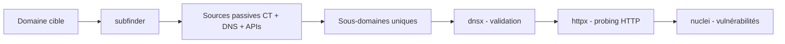
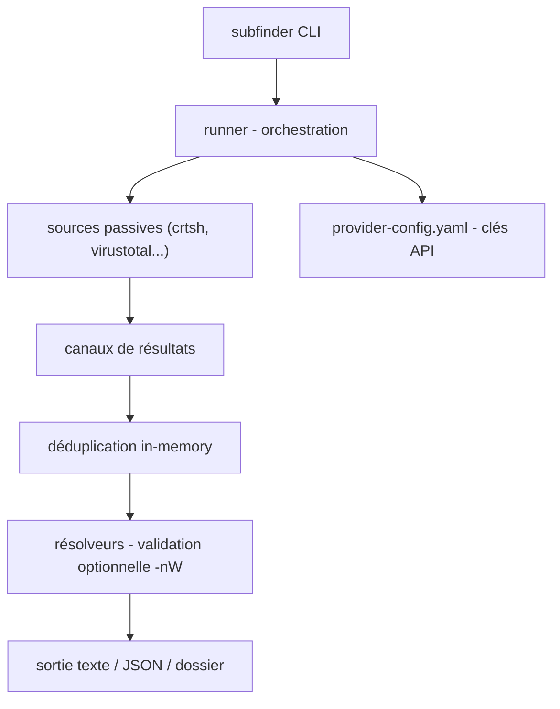

# 🔭 subfinder — Découverte massive de sous-domaines (passif + actif)

> [!info] **En 1 phrase**
> subfinder agrège des dizaines de sources OSINT pour retrouver tous les sous-domaines d'une cible en quelques secondes, sans la toucher.

---

## 🧾 Overview

| Champ | Valeur |
|---|---|
| Nom complet | subfinder |
| Description | Moteur d'énumération de sous-domaines : interroge des dizaines de sources passives (CT logs, DNS historique, engines, APIs OSINT) en parallèle et consolide les résultats |
| Catégorie | Reconnaissance & OSINT |
| Sous-catégorie | Enumeración de sous-domaines / Subdomain Enumeration |
| Fonction principale | Trouver les sous-domaines d'un domaine à partir de sources publiques |
| Type d'outil | CLI (binaire Go unique, `go install` / releases / Docker) |
| Licence | MIT |
| Open source / propriétaire | Open source |
| Langage(s) de programmation | Go |
| Développeur / organisation | ProjectDiscovery |
| Projet officiel | https://projectdiscovery.io |
| Dépôt officiel | https://github.com/projectdiscovery/subfinder |
| Documentation officielle | https://docs.projectdiscovery.io/tools/subfinder/usage |
| Date de création | 2020 |
| État du projet | actif |
| Dernière version connue | v2.14.0 |
| Systèmes compatibles | Linux, macOS, Windows, Docker |

> [!note] Pour vérifier / compléter
> Depuis les versions récentes, le bruteforce a été retiré du cœur de l'outil au profit de l'écosystème (puredns, alterx) ; l'option `-brute` reste disponible dans certaines versions/paquets historiques. Le fichier `~/.config/subfinder/provider-config.yaml` stocke les clés API (SecurityTrails, Censys, VirusTotal, Shodan...) sans lesquelles plusieurs sources restent inactives.

---

## 🎯 Concept

subfinder est le moteur d'énumération de sous-domaines de l'écosystème **ProjectDiscovery**. Il interroge en parallèle un grand nombre de sources passives — logs de transparence des certificats (CT), bases de données DNS historiques, engines de recherche, API de bug bounty et OSINT — et consolide les résultats dédupliqués. Position : tout premier maillon de la recon web ; sa sortie alimente **dnsx** (validation), **httpx** (probing HTTP) et **naabu** (scan de ports). La phase passive ne génère quasiment aucun trafic vers la cible elle-même.

`-recursive` poursuit l'énumération sur les sous-domaines découverts, `-nW`/`-active` ne garde que les noms qui résolvent réellement. L'outil est pensé pour la chaîne : `subfinder → dnsx → httpx → nuclei`.



---

## 🧠 Concepts fondamentaux

| Concept | Explication |
|---|---|
| Sources passives | CT logs (crtsh, certspotter), DNS historique (SecurityTrails, passive DNS), engines (Google, Bing), APIs (VirusTotal, Shodan, Censys, GitHub) |
| Certificate Transparency (CT) | Registres publics des certificats TLS émis : chaque certificat liste ses noms (sous-domaines) |
| Passive DNS | Historique des résolutions observées par des tiers (SecurityTrails, DNSDumpster...) |
| `-all` | Active toutes les sources configurées (plus de résultats, plus lent) |
| `-recursive` | Relance l'énumération sur chaque sous-domaine découvert (profondeur) |
| `-nW` / `-active` | Résolution active des noms trouvés : ne garde que ceux qui résolvent |
| Résolveurs | `-r <ip1,ip2>` remplace les résolveurs système ; `-rL` lit une liste |
| provider-config.yaml | Fichier des clés API des sources qui en demandent |
| Wildcard | DNS wildcard (`*.example.com`) : répond à tout sous-domaine, pollue les résultats |
| Chaîne d'outils | La sortie est prête pour `dnsx`, `httpx`, `naabu`, `nuclei` sans parsing |

---

## 🛠️ Installation

### Via Go (binaire à jour)

```bash
go install -v github.com/projectdiscovery/subfinder/v2/cmd/subfinder@latest
export PATH=$PATH:$(go env GOPATH)/bin
```

### Via les paquets de distribution (Kali/Debian)

```bash
sudo apt install subfinder
```

### Docker

```bash
docker pull projectdiscovery/subfinder:latest
docker run --rm projectdiscovery/subfinder:latest -d example.com
```

### Depuis les releases

```bash
# wget https://github.com/projectdiscovery/subfinder/releases/latest/download/subfinder_<version>_linux_amd64.zip
# unzip ... && sudo mv subfinder /usr/local/bin/
```

### Vérification

```bash
subfinder -version
subfinder -h
```

---

## ⚙️ Configuration

### Fichier de clés API : `~/.config/subfinder/provider-config.yaml`

Sans clés, plusieurs sources (VirusTotal, SecurityTrails, Censys...) sont inactives. Format :

```yaml
securitytrails:
  - api_key: "TA_CLE"
virustotal:
  - api_key: "TA_CLE"
censys:
  - id: "CID"
    secret: "SECRET"
github:
  - username: "mon_user"
    token: "ghp_xxx"
shodan:
  - api_key: "TA_CLE"
binaryedge:
  - api_key: "TA_CLE"
chaos:
  - api_key: "TA_CLE"
```

> [!note] Chemins
> Sur Linux/macOS : `~/.config/subfinder/`. Windows : `%USERPROFILE%\.config\subfinder\`. L'option `-pc <fichier>` permet de pointer vers un autre fichier de config.

### Sources disponibles (liste)

```bash
subfinder -ls          # liste toutes les sources installées/utilisables
subfinder -s crtsh     # n'utiliser que la source crtsh
```

---

## 🏗️ Architecture interne



- **`runner`** : gère les flags, la config, les résolveurs et le rate limiting global (`-rl`).
- **Sources** : chaque source (crtsh, hackertarget, virustotal, github, chaos, shodan, censys...) est implémentée comme un « source » Go appelée en goroutines.
- **Déduplication** : les noms identiques sont fusionnés (insensible à la casse, normalisation des points).
- **Validation** : avec `-nW`, chaque nom est résolu via les résolveurs choisis ; les échecs sont écartés.
- **Sorties** : stdout en mode pipeline (`-silent`), fichier (`-o`), JSON (`-oJ`), dossier avec sources (`-oD`).

---

## ⌨️ Commandes

### Commandes essentielles

```bash
subfinder -d example.com -all -o subs.txt
subfinder -d example.com -recursive -silent
subfinder -dL domains.txt -all -o all_subs.txt
subfinder -d example.com -s crtsh,github,virustotal -silent   # sources précises
subfinder -d example.com -nW -o live.txt                      # ne garde que les noms résolvants
```

### Options principales

| Option | Effet |
|---|---|
| `-d` | Domaine cible |
| `-dL` | Fichier contenant plusieurs domaines |
| `-s` | Sources précises à utiliser (`crtsh,github`, liste avec `-ls`) |
| `-all` | Utilise toutes les sources (plus de résultats, plus lent) |
| `-recursive` | Énumération récursive sur les sous-domaines découverts |
| `-nW` / `-active` | Ne conserve que les sous-domaines actifs (résolution vérifiée) |
| `-r` / `-rL` | Résolveur DNS personnalisé / liste de résolveurs |
| `-o` | Sortie texte |
| `-oJ` / `-oD` | Sortie JSON / dans un dossier |
| `-silent` | Sortie épurée, utilisable en pipeline |
| `-timeout` / `-max-time` | Timeout par requête / durée maximale d'énumération |
| `-rl` | Nombre max de requêtes HTTP par seconde (rate-limit) |
| `-es` | Exclut des sources (`-es virustotal,shodan`) |
| `-pc` | Fichier de config provider alternatif |

---

## 🚩 Options et flags (détail)

| Flag | Défaut | Description |
|---|---|---|
| `-d` | — | Domaine unique |
| `-dL` | — | Liste de domaines (un par ligne) |
| `-s` | toutes | Sources sélectionnées |
| `-es` | — | Sources exclues |
| `-all` | false | Toutes les sources |
| `-recursive` | false | Récursion sur les sous-domaines |
| `-nW` | false | Ne garder que les noms qui résolvent |
| `-r` | résolveurs système | Résolveur(s) custom |
| `-rL` | — | Fichier de résolveurs |
| `-o` | — | Fichier de sortie texte |
| `-oJ` | — | Sortie JSON |
| `-oD` | — | Sortie par dossier |
| `-silent` | false | Sortie épurée |
| `-timeout` | 30 | Timeout HTTP par requête (s) |
| `-max-time` | 10 | Durée max de l'énumération (min) |
| `-rl` | 150 | Rate limit HTTP/s |
| `-pc` | défaut | Fichier provider-config |
| `-ls` | — | Lister les sources |

---

## 🧪 Exemples pratiques

### Énumération simple

```bash
subfinder -d example.com -silent
```

### Toutes les sources, sortie fichier

```bash
subfinder -d example.com -all -o subs.txt
```

### Sources précises

```bash
subfinder -d example.com -s crtsh,certspotter,github -silent
```

### Plusieurs domaines

```bash
subfinder -dL targets.txt -all -oJ subs.json
```

### Garder uniquement les noms qui résolvent

```bash
subfinder -d example.com -all -nW -silent -o live_subs.txt
```

### Résolveurs personnalisés

```bash
subfinder -d example.com -all -r 8.8.8.8,1.1.1.1 -silent
```

---

## 🔄 Workflow complet (scénario pas à pas)

1. **Énumération initiale** — toutes sources, sortie propre.
   ```bash
   subfinder -d example.com -all -silent -o subs.txt
   ```
2. **Énumération récursive** — traquer les sous-domaines de sous-domaines.
   ```bash
   subfinder -d example.com -recursive -silent >> subs.txt
   ```
3. **Bruteforce ciblé** — noms courants absents des sources passives (via puredns/alterx, l'outil moderne).
   ```bash
   puredns bruteforce /usr/share/seclists/Discovery/DNS/subdomains-top1million-5000.txt example.com -r resolvers.txt
   ```
4. **Fusion et déduplication.**
   ```bash
   sort -u subs.txt -o subs.txt
   ```
5. **Validation en pipeline** — ne garder que les noms qui résolvent.
   ```bash
   cat subs.txt | dnsx -silent -o live_subs.txt
   ```
6. **Rejouer avec des résolveurs personnalisés** si les résolutions échouent (split-horizon, filtrage).
   ```bash
   subfinder -d example.com -all -r 8.8.8.8,1.1.1.1 -silent -o subs_resolved.txt
   ```

---

## 🎬 Scénarios avancés

### Scénario 1 : Énumération profonde d'une cible critique

```bash
subfinder -d example.com -all -recursive \
  -s crtsh,securitytrails,virustotal,certspotter \
  -timeout 20 -max-time 15 -silent -o subs.txt
```

### Scénario 2 : Inventaire complet du périmètre

```bash
subfinder -dL targets.txt -all -silent -oJ subs.json
jq -r '.host' subs.json | sort -u | dnsx -silent | httpx -sc -title -silent
```

### Scénario 3 : Chasse aux sous-domaines oubliés (shadow assets)

```bash
# Croiser CT logs sur plusieurs années + énumération récursive
subfinder -d example.com -s crtsh,certspotter -recursive -silent -o ct_subs.txt
# Comparer avec l'inventaire connu : les différences = actifs non gérés
sort -u ct_subs.txt | dnsx -silent -resp-only | httpx -sc -silent
# Un sous-domaine répondant à une IP inconnue / version obsolète = cible prioritaire
```

### Scénario 4 : Pipeline complet recon (subfinder → dnsx → httpx → nuclei)

```bash
subfinder -d example.com -all -silent | dnsx -silent | httpx -sc -title -silent | nuclei -silent
```

---

## 🛡️ Cybersecurity use cases

| Cas d'usage | Exemple concret |
|---|---|
| Bug bounty | Énumération complète du scope avant probing HTTP |
| Pentest | Premier maillon de la chaîne de recon web |
| Attack Surface Management | Inventaire continu des sous-domaines d'une organisation |
| Shadow IT | Détection d'actifs non gérés / non documentés |
| Threat Intel | Enrichissement des indicateurs de domaine |
| Recon Red Team | Cartographie rapide avant la phase active |

---

## ⚔️ MITRE ATT&CK

| Technique | ID | Rapport avec subfinder |
|---|---|---|
| Search Open Technical Databases | T1596 | CT logs, passive DNS, APIs publiques |
| Search Open Websites/Domains | T1593 | Engines et sources OSINT |
| Gather Victim Host Information | T1590 | Sous-domaines et résolutions |
| DNS/Passive DNS | T1596.001 | Sources de DNS passif |
| Valid Accounts (API) | T1078 | Utilisation de clés API configurées |

---

## 🛡️ Defensive Security

| Usage défensif | Description |
|---|---|
| Audit d'exposition | Comparer les sous-domaines publics avec l'inventaire connu |
| Détection de shadow IT | Identifier les sous-domaines oubliés, non managés |
| Surveillance CT | Suivre les nouveaux certificats émis sur son domaine |
| Monitoring | Planifier `subfinder + dnsx + httpx` pour suivre l'apparition de nouveaux actifs |

> [!warning] Contexte
> La phase passive est quasiment indétectable côté cible (données publiques). La résolution active (`-nW`/dnsx) et le bruteforce génèrent des requêtes DNS visibles.

---

## 🤖 Automatisation

### Pipeline classique (binaire à binaire)

```bash
subfinder -d example.com -all -silent | sort -u | dnsx -silent | httpx -sc -title -silent
```

### Boucle multi-domaines

```bash
while read -r d; do
  subfinder -d "$d" -all -silent -o "subs_$d.txt"
done < targets.txt
```

### Cron (surveillance)

```bash
# Inventaire hebdomadaire
0 4 * * 1 subfinder -dL targets.txt -all -silent -o /data/subs_$(date +\%F).txt
```

### Sortie JSON pour le reporting

```bash
subfinder -d example.com -all -oJ -silent | jq -r '.host, .source'
```

---

## 📦 Output et parsing

### Sortie texte (stdout)

```
mail.example.com
api.example.com
dev.example.com
```

### Sortie JSON

```bash
subfinder -d example.com -oJ -silent
jq -r '.host' subs.json | sort -u
```

### Sortie dossier (`-oD`)

```
subs.txt          # noms
subs.json         # détails avec source
subs.txt.bak      # sauvegarde avant dédup
```

### Parsing courant

```bash
# Fusionner et dédupliquer
cat subs*.txt | sort -u > all_subs.txt
# Compter
wc -l all_subs.txt
```

---

## 🔗 Intégrations

| Outil | Intégration |
|---|---|
| [[Outil - dnsx\|dnsx]] | Validation/résolution des sous-domaines trouvés |
| [[Outil - httpx\|httpx]] | Probing HTTP : URLs, statut, titre, technologies |
| [[Outil - naabu\|naabu]] | Scan de ports sur les hôtes résolus |
| [[Outil - nuclei\|nuclei]] | Scanning de vulnérabilités sur les hôtes HTTP |
| [[Outil - chaos\|chaos]] | Source ProjectDiscovery de sous-domaines (clé chaos requise) |
| [[Outil - Amass\|Amass]] | Alternative/parallèle avec bruteforce intégré |
| [[Outil - Recon-ng\|Recon-ng]] | Autre voie d'énumération (modules crtsh, hackertarget) |
| [[Outil - theHarvester\|theHarvester]] | Complément pour emails + hôtes |
| puredns / alterx | Bruteforce et mutation de noms modernes |

---

## 🔄 Alternatives

| Outil | Différence clé |
|---|---|
| [[Outil - Amass\|Amass]] | Énumération active + passive, graph, plus lourd |
| theHarvester ([[Outil - theHarvester\|theHarvester]]) | Léger, emails + hôtes, moins de sources |
| puredns | Bruteforce DNS massif (massdns wrapper) |
| alterx | Génération de mutations de noms pour le bruteforce |
| findomain | D'autres sources d'agrégation |
| dnsrecon / dnsenum | Outils DNS plus généraux (bruteforce, transfert) |

---

## ⚡ Performance

| Facteur | Impact |
|---|---|
| `-all` | Plus de sources = plus de résultats mais plus lent et plus de quotas |
| Clés API | Les sources avec clés (VirusTotal, SecurityTrails) accélèrent/remontent plus de données |
| `-recursive` | Peut exploser le nombre de requêtes ; borner avec `-max-time` |
| `-rl` | Rate limit global (150/s par défaut) : réduire pour respecter les quotas |
| Résolveurs | `-nW` et dnsx sont rapides mais ajoutent des requêtes DNS |
| `-timeout` | Timeout par requête : monter sur réseaux lents |

---

## 🔧 Troubleshooting

| Problème | Cause probable | Solution |
|---|---|---|
| Résultats très faibles | Clés API absentes | Renseigner `provider-config.yaml`, vérifier avec `-ls` |
| Source en erreur | API down / quota / format changé | `-es <source>`, réessayer plus tard, mettre à jour |
| Sous-domaines qui ne résolvent pas | Wildcard / enregistrements obsolètes | Valider avec `dnsx` ; supprimer les réponses wildcard |
| `-brute` introuvable | Retiré des versions récentes | Utiliser puredns/alterx |
| Timeout/rate-limit | Trop de sources en parallèle | `-rl` plus bas, `-timeout` plus haut |
| Sortie vide | Domaine sans sous-domaines publics | Essayer d'autres sources / vériifer le domaine |
| Binaire Go introuvable | PATH non mis à jour | `export PATH=$PATH:$(go env GOPATH)/bin` |

---

## 🔒 Sécurité de l'outil

| Point | Détail |
|---|---|
| Clés API | Stockées en clair dans `provider-config.yaml` : chmod 600, ne pas versionner |
| Résolveurs | Les résolveurs custom voient vos requêtes : choisir des résolveurs de confiance |
| Sources tierces | Vos requêtes partent vers crtsh, VirusTotal... : activité visible par ces services |
| Mise à jour | `go install ...@latest` régulièrement pour les nouvelles sources |
| Usage | L'énumération de domaines dont on n'est pas propriétaire reste encadrée par la loi |

---

## ⚠️ Limitations

| Limitation | Détail |
|---|---|
| Bruteforce retiré | Le cœur actuel ne brute-force plus : passer par puredns/alterx |
| Clés API nécessaires | Sans clés, la couverture est amputée silencieusement |
| Dépendance aux sources | Les sources changent/ferment (APIs, quotas) : mises à jour nécessaires |
| Wildcard | Les domaines wildcard polluent : validation requise |
| Pas de scan de services | Ne fait que les noms : httpx/nuclei ensuite |
| Profondeur limitée | `-recursive` existe mais l'exploration exhaustive vient de combiner sources |

---

## 📋 Cheatsheet

```bash
# Énumération de base
subfinder -d example.com -silent

# Toutes sources + fichier
subfinder -d example.com -all -o subs.txt

# Récursif
subfinder -d example.com -recursive -silent

# Multi-domaines JSON
subfinder -dL targets.txt -all -oJ subs.json

# Sources précises
subfinder -d example.com -s crtsh,github -silent

# Résolution vérifiée
subfinder -d example.com -nW -o live.txt

# Pipeline
subfinder -d example.com -all -silent | dnsx -silent | httpx -sc -silent
```

---

## ⚡ Quick reference

| Action | Commande |
|---|---|
| Énumérer un domaine | `subfinder -d <domaine>` |
| Toutes les sources | `subfinder -d <domaine> -all` |
| Récursif | `-recursive` |
| Multi-domaines | `-dL <fichier>` |
| Sources précises | `-s crtsh,github` |
| Résolution active | `-nW` |
| Sortie JSON | `-oJ` |
| Sortie pipeline | `-silent` |
| Clés API | `~/.config/subfinder/provider-config.yaml` |

---

## 🔍 Détection & Défense

| Signe | Défense |
|---|---|
| L'énumération passive est quasi indétectable (données publiques) | Limiter les informations exposées dans les certificats publics |
| La phase active (bruteforce/résolution) génère des pics de requêtes DNS | Rate limiting sur le résolveur, surveiller les pics de type query flood |
| Des résolveurs publics utilisés comme relais | Restreindre la récursion sur ses propres résolveurs |
| Nouveaux certificats émis = source d'énumération | Surveiller les CT logs de son domaine |

---

## 💡 Tips & Pièges

> [!tip] 💡 **Renseigne `provider-config.yaml`**
> SecurityTrails, VirusTotal, Censys... : la couverture explose avec les clés.

> [!tip] 💡 **Combine `-all` + `-recursive` sur les cibles prioritaires**
> Garde `-all` seul pour le volume ; ajoute `-recursive` sur les cibles critiques.

> [!tip] 💡 **`-oJ` journalise les sources**
> Chaque sous-domaine garde la trace de sa source (utile pour le rapport).

> [!warning] ⚠️ **Sans clés API, des sources restent inactives**
> VirusTotal, SecurityTrails, Censys... : ta couverture est amputée silencieusement.

> [!warning] ⚠️ **Les domaines wildcard polluent les résultats**
> Ex : `*.example.com` répond à tout : valide toujours avec dnsx/massdns.

> [!warning] ⚠️ **`-brute` a été retiré des versions récentes**
> Préfère puredns/alterx pour le bruteforce moderne.

> [!warning] ⚠️ **En `-all`, certaines sources sont lentes ou instables**
> Fixez `-max-time` pour borner la durée.

> [!danger] 🚫 **Énumération ≠ autorisation**
> Même passive, l'énumération sur une cible non autorisée peut violer des conditions d'utilisation.

---

## 📚 References

### Official
- [GitHub officiel subfinder](https://github.com/projectdiscovery/subfinder)
- [Documentation projectdiscovery subfinder](https://docs.projectdiscovery.io/tools/subfinder/usage)

### Security
- [ProjectDiscovery — écosystème d'outils](https://projectdiscovery.io)
- [MITRE ATT&CK — Search Open Technical Databases T1596](https://attack.mitre.org/techniques/T1596/)

### Community
- [Seclists — wordlists DNS](https://github.com/danielmiessler/SecLists)
- [Cheatsheet subfinder (community)](https://gist.github.com/)

---

➡️ **Liens :** [[Tools|🧰 Outils]] · [[01 - Reconnaissance|🕵️ Reconnaissance]] · [[Outil - dnsx|🧬 dnsx]] · [[Outil - httpx|🌐 httpx]] · [[Outil - chaos|🌀 chaos]] · [[Outil - Amass|🌐 Amass]]
