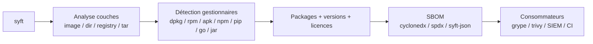
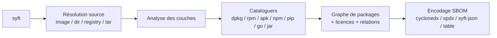

# 🧬 syft - Le générateur d'empreinte logicielle (SBOM)

> [!info] **En 1 phrase**
> syft génère un SBOM (inventaire des packages) d'une image conteneur ou d'un filesystem : la matière première qui alimente grype pour le scan de vulnérabilités.

---

## 🧾 Overview

| Champ | Valeur |
|---|---|
| Nom complet | syft |
| Description | Générateur de SBOM (Software Bill of Materials) : catalogue les packages (dpkg, rpm, apk, npm, pip, go, jar, ...) d'une image conteneur ou d'un filesystem dans des formats standardisés |
| Catégorie | 🔒 Cloud & Containers |
| Sous-catégorie | DevSecOps / SBOM / Inventaire logiciel |
| Type d'outil | CLI Go (binaire unique) |
| Licence | Apache-2.0 |
| Open source / propriétaire | Open source |
| Langage(s) de programmation | Go |
| Développeur / organisation | Anchore |
| Projet officiel | https://github.com/anchore/syft |
| Dépôt officiel | https://github.com/anchore/syft |
| Documentation officielle | https://anchore.com/syft/ |
| Date de création | 2020 |
| État du projet | actif |
| Dernière version connue | v1.19.1 (série 1.x) |
| Systèmes compatibles | Linux, macOS, Windows ; Docker, GitHub Actions |

> [!note] Pour vérifier / compléter
> Version vérifiée sur https://github.com/anchore/syft/releases (série 1.x, v1.19.1). syft publie souvent ; vérifier `syft version` et lier la version de syft à celle de grype pour la cohérence des SBOM.

---

## 🎯 Concept

syft examine le contenu d'une image conteneur (ou d'un dossier, d'un tar, d'un registre) **couche par couche** et identifie chaque paquet logiciel installé : gestionnaire (dpkg, rpm, apk), langages (npm, pip, go.mod, composer), fichiers JAR/Java, etc. Il produit ensuite un **SBOM** dans des formats standardisés : `cyclonedx-json`, `spdx-json`, `syft-json`, table, ou des formats relationnels.

Le SBOM est la **carte d'identité logicielle** d'un artefact. En pentest, syft sert à :
- **Connaître l'empreinte exacte** d'un conteneur récupéré : versions, langages, frameworks → cibler une CVE ou un framework exploitable.
- **Produire un SBOM** qui sera rescané par **grype** pour les vulnérabilités (couple officiel Anchore).
- **Inventorier les dépendances** d'un projet avant d'évaluer sa surface d'attaque.

syft ne juge pas (pas de CVE) : il **documente** ce qui est installé. C'est ce qui le distingue de trivy/grype et en fait un complément plutôt qu'une alternative.



---

## 🧠 Concepts fondamentaux

| Concept | Explication |
|---|---|
| SBOM | Liste structurée des composants logiciels (format CycloneDX ou SPDX) |
| Package | Unité logicielle détectée (paquet système ou dépendance de langage) |
| Gestionnaire de paquets | Moyen de détection : dpkg, rpm, apk, npm, pip, go, composer, gradle, ... |
| Couche | Niveau de l'image Docker ; syft analyse chaque couche pour le détail |
| CycloneDX | Format standard (JSON/XML) d'inventaire de composants (OWASP) |
| SPDX | Format standard (ISO) d'échange de SBOM (Linux Foundation) |
| Licence | Détection des licences des packages (pour la conformité) |
| Source | Cible analysée : `image`, `dir:`, `file:`, `registry:`, `oci:`, `docker:` |

---

## 🛠️ Installation

syft s'installe en binaire unique, via curl, Homebrew, Docker ou les sources.

### Binaire (Linux / macOS)

```bash
# Script officiel
curl -sSfL https://raw.githubusercontent.com/anchore/syft/main/install.sh | sh -s -- -b /usr/local/bin

# Ou via Homebrew
brew tap anchore/syft && brew install syft
```

### Windows

```powershell
# via winget
winget install anchore.syft

# ou binaire zip
curl.exe -LO https://github.com/anchore/syft/releases/download/v1.19.1/syft_1.19.1_windows_amd64.zip
Expand-Archive syft_1.19.1_windows_amd64.zip -DestinationPath .\syft
```

### Docker

```bash
# via l'image officielle
docker run --rm -v "$(pwd)":/src anchore/syft:latest /src/image.tar
```

### Compilation depuis les sources

```bash
git clone https://github.com/anchore/syft.git && cd syft
go build .
./syft version
```

> [!warning] ⚠️ Prérequis & problèmes potentiels
> - L'analyse d'images nécessite un accès au démon Docker ou un tar exporté (`docker save`).
> - Registres privés : `registry:user:pass@image` ou variables d'environnement.
> - Les formats de sortie sont nombreux : vérifier les besoins du consommateur (grype, SIEM, CI) avant le choix.

---

## ⚙️ Configuration

syft se configure par flags, variables `SYFT_*` ou fichier `~/.syft.yaml`.

| Paramètre | Rôle | Valeur possible | Impact | Exemple |
|---|---|---|---|---|
| `--scope` | Profondeur d'analyse | `squashed`, `all-layers` | Détail des couches | `--scope all-layers` |
| `-o` / `--output` | Format de sortie | `table`, `cyclonedx-json`, `spdx-json`, `syft-json` | Interopérabilité | `-o cyclonedx-json` |
| `--file` | Fichier de sortie | chemin | Archivage | `--file sbom.cdx.json` |
| `--platform` | Architecture cible | `linux/amd64` | Multi-arch | `--platform linux/arm64` |
| `--exclude` | Chemins exclus | glob | Filtrage | `--exclude './test/**'` |
| `--catalogers` | Cataloguers actifs | liste | Contrôle fin | `--catalogers dpkg-cataloger` |
| `--template` | Template Go custom | chemin | Rapports custom | `--template tmpl.tmpl` |
| `--config` | Fichier de config | chemin | Config centralisée | `--config ~/.syft.yaml` |

---

## 🏗️ Architecture interne

syft est un binaire Go structuré en pipeline d'analyse :

- **Source** : résolution de la cible (image locale, registre, tar, dossier, OCI).
- **Analyse des couches** : pour les images, lecture des couches et extraction des métadonnées système.
- **Cataloguers** : modules spécialisés détectant chaque type de paquet (dpkg-cataloger, apk-cataloger, npm-cataloger, golang-cataloger, java-cataloger, ...).
- **Assemblage** : consolidation en un graphe de packages (avec relations de dépendances).
- **Encodage** : sérialisation au format demandé (CycloneDX, SPDX, syft-json, table).



---

## ⌨️ Commandes

### Commandes principales

| Commande | Objectif | Résultat attendu |
|---|---|---|
| `syft <image>` | SBOM d'une image | Table des packages par défaut |
| `syft dir:<dossier>` | SBOM d'un filesystem | Packages du dossier |
| `syft registry:...` | SBOM depuis un registre | Inventaire sans pull complet |
| `syft <image>.tar` | SBOM d'un tar docker | Inventaire du tar |
| `syft <image> -o cyclonedx-json` | SBOM en CycloneDX | Fichier standard |
| `syft convert <sbom>` | Conversion de format | Interopérabilité |
| `syft version` | Version | Info outil |

### Commandes avancées

```bash
# SBOM CycloneDX vers un fichier
syft nginx:latest -o cyclonedx-json --file sbom.cdx.json

# Analyse complète des couches
syft nginx:latest --scope all-layers -o spdx-json -f sbom.spdx.json

# Conversion d'un SBOM vers un autre format
syft convert sbom.cdx.json -o spdx-json
```

---

## 🎚️ Options et flags

| Option | Description | Exemple | Niveau |
|---|---|---|---|
| `-o` / `--output` | Format de sortie | `-o cyclonedx-json` | Basic |
| `--file` | Fichier de sortie | `--file sbom.json` | Basic |
| `--scope` | Profondeur | `--scope all-layers` | Intermediate |
| `--platform` | Architecture | `--platform linux/arm64` | Advanced |
| `--exclude` | Chemins exclus | `--exclude './test/**'` | Intermediate |
| `--catalogers` | Cataloguers actifs | `--catalogers java-cataloger` | Advanced |
| `--template` | Template custom | `--template tmpl.tmpl` | Expert |
| `--config` | Fichier de config | `--config ~/.syft.yaml` | Expert |
| `-q` | Silencieux | `-q` | Basic |

> [!tip] Options les plus utiles au quotidien
> `-o cyclonedx-json` (standard), `--file` (archivage), `--scope all-layers` (précision), `--platform` (multi-arch), `-q` (scripts).

---

## 🧪 Exemples pratiques

### Beginner

```bash
# Inventaire simple d'une image
syft nginx:latest
```

Résultat attendu : une table `NAME VERSION TYPE` listant les packages détectés.

### Intermediate

```bash
# SBOM CycloneDX pour grype
syft nginx:latest -o cyclonedx-json -f sbom.cdx.json

# Inventaire d'un dossier de projet
syft dir:./projet
```

### Advanced

```bash
# Analyse multi-arch précise
syft registry.example/example-api:1.2.3 --platform linux/arm64 -o spdx-json

# Inventaire d'un tar exporté sans daemon
docker save nginx:latest -o /tmp/nginx.tar
syft /tmp/nginx.tar -o syft-json
```

### Expert

```bash
# Contrôle fin des cataloguers
syft nginx:latest --catalogers dpkg-cataloger,apk-cataloger -o table

# Template custom pour un rapport de pentest
syft nginx:latest --template '{{range .Artifacts}}{{.Name}} {{.Version}} {{.Type}}{{end}}'
```

---

## 🧪 Workflow complet (scénario pas à pas)

1. **Récupérer la cible** - image locale, registre, ou tar en post-exploitation.
   ```bash
   docker save registry.example/example-api:1.2.3 -o /tmp/api.tar
   ```
2. **Générer le SBOM** - inventaire complet des composants.
   ```bash
   syft /tmp/api.tar -o cyclonedx-json -f /tmp/api.sbom.cdx.json
   ```
3. **Analyser l'empreinte** - extraire les packages, langages, licences.
   ```bash
   jq -r '.components[].name' /tmp/api.sbom.cdx.json | sort -u
   ```
4. **Rescaner avec grype** - transformer l'inventaire en liste de CVE.
   ```bash
   grype sbom:/tmp/api.sbom.cdx.json --output json -f /tmp/api-grype.json
   ```
5. **Prioriser** - croiser CVE, versions et surface d'exposition pour le rapport.

---

## 🎬 Scénarios avancés

### Scénario 1 : Empreinte d'un conteneur compromis avant escalade

```bash
# 1. Récupérer l'image du pod compromis
docker save $(docker ps -q | head -1) -o /tmp/pod.tar

# 2. Générer le SBOM et le rescaner pour les CVE
syft /tmp/pod.tar -o cyclonedx-json -f /tmp/pod.sbom.json
grype sbom:/tmp/pod.sbom.json --only-fixed

# 3. Identifier les outils/scripts disponibles pour pivoter
jq -r '.components[] | select(.name|test("curl|wget|socat|nc")) | .name' /tmp/pod.sbom.json
```

Le SBOM révèle aussi les binaires utiles (curl, socat, python) et l'absence de protections : une mine d'or pour planifier le pivot.

### Scénario 2 : Inventaire de la chaîne de build

```bash
# 1. Générer les SBOM de toutes les images de la stack
for img in api front worker; do
  syft "registry.example/$img:latest" -o cyclonedx-json -f "sbom-$img.json"
done

# 2. Consolider les composants communs vulnérables
for f in sbom-*.json; do
  jq -r '.components[].name' "$f"
done | sort | uniq -c | sort -rn | head -20
```

---

## 🛡️ Cybersecurity use cases

| Phase | Utilisation |
|---|---|
| Reconnaissance | Empreinte logicielle complète d'un conteneur |
| Énumération | Versions, langages, frameworks, licences |
| Vulnérabilité | Alimentation de grype/trivy pour les CVE |
| Exploitation | Ciblage de frameworks/versions exploitables |
| Post-exploitation | Inventaire des outils disponibles dans un conteneur |
| Exfiltration | Cartographie des composants sensibles |

---

## 🎯 MITRE ATT&CK

| Tactique | Technique / Sub-technique | ID | Raison | Détection | Mitigation |
|---|---|---|---|---|---|
| Discovery | System Information Discovery | T1082 | Inventaire des packages et versions d'un conteneur | EDR, audit des commandes | Moindre privilège |
| Discovery | Software Discovery | T1518 | Énumération des versions logicielles | Logs de scans | Scanning régulier |
| Discovery | Container and Resource Discovery | T1613 | Cartographie des artefacts et de leurs composants | Audit logs | Contrôle des artefacts |

> [!note] Ne renseigner que si l'association est réellement pertinente.
> syft est un outil d'inventaire passif ; les techniques listées couvrent l'usage des données produites.

---

## 🛡️ Defensive Security

### Signes observables

| Indicateur | Détail |
|---|---|
| Exécution de `syft` sur un hôte | Génération de SBOM |
| `docker save` d'un conteneur | Post-exploitation / exfiltration |
| Génération massive de SBOM | Audits ou offense |
| Pull d'images vers un registre | Ciblage d'artefacts |

### Règles de détection (Sigma / Suricata / Snort / YARA)

```yaml
# Sigma - Linux : exécution de syft (génération de SBOM)
title: Syft SBOM Generation Execution
id: 0b0b2f90-0000-4a9a-8c5f-000000000101
status: experimental
logsource:
    product: linux
    service: auditd
detection:
    selection:
        process.name: 'syft'
    condition: selection
falsepositives:
    - Pipelines DevSecOps légitimes
level: low
```

> [!note] À vérifier
> Exemple pédagogique : l'identifiant Sigma est fictif et à régénérer si publié.

---

## 🤖 Automatisation

```bash
# Bash - SBOM systématique des images d'un registre
for img in api front worker; do
  syft "registry.example/$img:latest" -o cyclonedx-json -f "sbom-$img.json"
  grype sbom:"sbom-$img.json" --only-fixed --fail-on high
done
```

```python
# Python - lire un SBOM CycloneDX et lister les composants
import json

with open("sbom.cdx.json", encoding="utf-8") as f:
    sbom = json.load(f)

for comp in sbom.get("components", []):
    print(comp["type"], comp["name"], comp.get("version", "?"))
```

---

## 📤 Output et parsing

Le format `syft-json` structure les artifacts avec `id`, `name`, `version`, `type`, `locations`. CycloneDX utilise `components[]` ; SPDX `packages[]`.

```bash
# Lister les packages uniques d'un SBOM CycloneDX
jq -r '.components[].name' sbom.cdx.json | sort -u

# Filtrer par écosystème
jq -r '.components[] | select(.purl|test("pkg:npm")) | .name' sbom.cdx.json
```

---

## 🔗 Intégrations

- [[Tools|🛠 Outils]] global
- [[Outil - grype|grype]] - scan des vulnérabilités des SBOM produits (couple officiel)
- [[Outil - trivy|trivy]] - consommation de SBOM et scan complémentaire
- [[Outil - kube-bench|kube-bench]] - posture Kubernetes complémentaire
- [[Outil - kubectl|kubectl]] - exploitation des faiblesses des pods
- GitHub Actions, GitLab CI, Jenkins - intégrations officielles
- Anchore Engine / Enterprise - orchestration SBOM

```text
syft (SBOM) -> grype (CVE) -> kube-bench (posture) -> kubectl (exploitation)
```

---

## 🔄 Alternatives

| Outil | Avantages | Inconvénients | Cas d'usage |
|---|---|---|---|
| syft vs trivy fs/sbom | trivy génère aussi des SBOM (CycloneDX) | syft plus complet en formats | SBOM pur |
| Docker SBOM | Intégré Docker Desktop | Écosystème Docker | Rapidité |
| CycloneDX CLI | Génération pour de nombreux écosystèmes | Plus complexe | Multi-écosystèmes |
| Anchore Engine | Politique SBOM entreprise | Lourd | Entreprise |

---

## ⚡ Performance

- **Rapide** : analyse d'une image moyenne en quelques secondes.
- **`squashed` vs `all-layers`** : le premier consolide les couches (rapide), le second préserve le détail (plus lent).
- **Base locale** : syft ne télécharge pas de base de vulnérabilités (pas de CVE) : il est instantané en offline.
- **Ressources** : binaire Go léger, adapté aux pipelines CI.

---

## 🛠️ Troubleshooting

### Common problems

#### Problème : image locale introuvable

- **Cause** : pas d'accès au démon Docker ou namespace différent.
- **Solution** : `docker save` puis analyse du tar.
- **Vérification** : `syft /tmp/image.tar` fonctionne.

#### Problème : packages non détectés sur un dossier

- **Cause** : cataloguers non activés ou fichiers de lock absents.
- **Solution** : activer les cataloguers (`--catalogers`), vérifier la présence des manifests (package-lock.json, go.mod).
- **Vérification** : `syft dir:./projet -o table` liste les types trouvés.

#### Problème : sortie SPDX rejetée par un consommateur

- **Cause** : profil SPDX incomplet ou version du format inadaptée.
- **Solution** : utiliser `cyclonedx-json` (le plus interopérable) ou ajuster le profil SPDX.
- **Vérification** : `syft convert <sbom> -o cyclonedx-json` produit un fichier valide.

---

## 🔐 Sécurité de l'outil

- **Cadre légal** : analyse statique de conteneurs/fichiers ; sur des artefacts autorisés.
- **Données** : les SBOM listent composants et licences : informations d'infrastructure.
- **Réseau** : pull d'images vers les registres : trafic observable.
- **Registres privés** : ne pas laisser les credentials dans l'historique shell.
- **Binaire officiel** : installer depuis les releases Anchore.

---

## ⚠️ Limitations

- **Pas de CVE** : syft inventorie mais n'évalue pas la vulnérabilité (le rôle de grype).
- **Statique** : l'analyse reflète le contenu déclaré, pas le runtime réel.
- **Couverture des cataloguers** : certains formats exotiques peuvent échapper à la détection.
- **Images non OCI/Docker** : compatibilité variable selon la source.
- **Licences** : la détection de licences peut être incomplète (fichiers manquants).

---

## 📋 Cheatsheet

```bash
# SBOM table d'une image
syft nginx:latest

# SBOM CycloneDX vers un fichier
syft nginx:latest -o cyclonedx-json -f sbom.cdx.json

# SBOM SPDX
syft nginx:latest -o spdx-json -f sbom.spdx.json

# Filesystem
syft dir:./projet

# Tar docker (sans daemon)
docker save nginx:latest -o nginx.tar
syft nginx.tar

# Registre privé
syft registry:user:pass@registry.example.com/api:1.2.3

# Conversion de format
syft convert sbom.cdx.json -o spdx-json

# Version
syft version
```

---

## ⚡ Quick reference

| | |
|---|---|
| **À quoi sert-il ?** | Générer le SBOM (inventaire logiciel) d'une image ou d'un filesystem |
| **Quand l'utiliser ?** | Avant un scan grype, pour l'empreinte d'un conteneur récupéré |
| **Commande principale** | `syft <image> -o cyclonedx-json -f sbom.cdx.json` |
| **Alternative principale** | trivy (SBOM intégré), Docker SBOM |
| **Concepts importants** | SBOM, cataloguer, couche, CycloneDX, SPDX |
| **Liens associés** | [[Outil - grype]] · [[Outil - trivy]] · [[Outil - kube-bench]] |

---

## 🔍 Détection & Défense

| Signe | Défense |
|---|---|
| Exécution de `syft` | Audit des commandes |
| `docker save` de conteneurs | Durcissement des accès Docker |
| Génération de SBOM en masse | Surveillance des builds |
| Pull d'images vers un registre | Rate limiting, autorisation des pull |

---

## ⚠️ Tips & Pièges

> [!tip] 💡 **Tips**
> - Produis le SBOM en CycloneDX : c'est le format le plus largement accepté (grype, trivy, SIEM).
> - Couple toujours syft avec grype : l'inventaire sans CVE ne sert qu'à moitié en pentest.
> - `--scope all-layers` quand tu cherches un composant caché dans une couche intermédiaire.
> - Sur un conteneur récupéré, repère les outils de pivot (curl, socat, python) dans le SBOM.

> [!warning] ⚠️ **Pièges**
> - L'absence d'un package dans le SBOM ne garantit pas son absence réelle (cataloguer incomplet).
> - syft ne dit rien de la sécurité : un SBOM vierge de CVE n'arrive qu'après le passage de grype.
> - Les images scratch/multi-stage produisent des SBOM très pauvres.
> - Ne pas committer les SBOM contenant des infos sensibles sans besoin.

---

## 📚 References

### Official

- Dépôt officiel : https://github.com/anchore/syft
- Documentation : https://anchore.com/syft/
- Releases : https://github.com/anchore/syft/releases
- Anchore (entreprise) : https://anchore.com/

### Security references

- MITRE ATT&CK T1082 - System Information Discovery : https://attack.mitre.org/techniques/T1082/
- OWASP CycloneDX : https://cyclonedx.org/
- SPDX (Linux Foundation) : https://spdx.dev/

### Community

- Grype docs : https://grype.anchore.io/
- Anchore Blog : https://anchore.com/blog/

---

➡️ **Liens :** [[Tools|🛠 Outils]] · [[Outil - grype|grype]] · [[Outil - trivy|trivy]] · [[Outil - kube-bench|kube-bench]]
