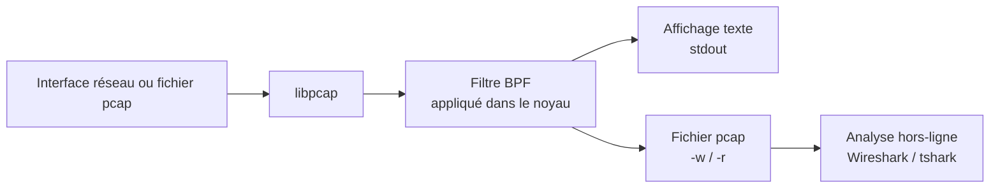

# 📡 tcpdump — Capture de paquets en ligne de commande

> [!info] **En 1 phrase**
> tcpdump est l'outil de capture et d'analyse de paquets en ligne de commande, léger, omniprésent sur les systèmes Unix, idéal pour une analyse réseau rapide.

---

## 🧾 Overview

| Champ | Valeur |
|---|---|
| Nom complet | tcpdump |
| Description | Capture et affiche les paquets réseau bruts (couches 2 à 7), filtre via BPF, écrit/lit des fichiers pcap |
| Catégorie | Réseau & Capture |
| Sous-catégorie | Capture & Analyse de paquets |
| Fonction principale | Capturer du trafic en direct ou hors-ligne et l'afficher avec un décodage statique des protocoles |
| Type d'outil | CLI |
| Licence | BSD 3-clause (tcpdump), BSD (libpcap) |
| Open source / propriétaire | Open source |
| Langage(s) de programmation | C |
| Développeur / organisation | The Tcpdump Group (créé par Van Jacobson, Craig Leres et Steven McCanne) |
| Projet officiel | Tcpdump Group |
| Dépôt officiel | https://github.com/the-tcpdump-group/tcpdump |
| Documentation officielle | https://www.tcpdump.org/manpages/tcpdump.1.html |
| Date de création | 1988 (au Lawrence Berkeley National Laboratory) |
| État du projet | actif (tcpdump 5.0 en développement) |
| Dernière version connue | 4.99.6 (2025-12-30), nécessite libpcap 1.10.5+ ; libpcap 1.10.6 |
| Systèmes compatibles | Linux, BSD, macOS, Solaris, AIX, Windows (via WSL2/WinDump) |

> [!note] Pour vérifier / compléter
> tcpdump est livré avec la bibliothèque **libpcap**, à installer/compiler séparément. Sur Windows, la pratique actuelle est WSL2 ou une VM Linux.

---

## 🎯 Concept

tcpdump capture les paquets bruts au niveau des couches 2/3 (via **libpcap**) et les affiche avec un **décodage statique simplifié** (pas de GUI, pas de dissection applicative poussée comme Wireshark). Il excelle pour : vérifier qu'une IP répond, identifier du trafic DNS/ARP/ICMP suspect, enregistrer des captures `.pcap` réutilisables dans Wireshark, et tourner en **mode non interactif** sur un serveur sans interface graphique. En offensive, il permet de vérifier qu'un reverse shell sortant aboutit, d'observer des credentials en clair ou de repérer un canal C2.

Son filtre **BPF** (Berkeley Packet Filter) est appliqué dans le **noyau** avant l'espace utilisateur, d'où sa performance même sur du trafic intense. Depuis 4.99, le **snaplen par défaut est 262 144 octets** (le `-s 0` de l'ancien défaut 64 octets n'est plus indispensable). Les options modernes incluent les horodatages en nanosecondes (`--time-stamp-precision=nano`), la rotation de fichiers (`-C/-W/-G/-z`) et l'abandon de privilèges (`-Z`). À l'arrêt, tcpdump rapporte **packets captured**, **received by filter** et **dropped by kernel** — indispensable pour repérer les pertes.



---

## 🧠 Concepts fondamentaux

| Concept | Explication |
|---|---|
| libpcap | Bibliothèque C de capture portable : pilote l'interface, applique le filtre BPF, gère les savefiles (pcap, pcapng) |
| BPF | Berkeley Packet Filter : mini-langage de filtre compilé en bytecode exécuté dans le noyau, d'où sa rapidité |
| Promiscuous mode | L'interface capture tous les paquets du segment ; désactivable avec `-p` ; nécessaire pour voir le trafic des voisins |
| Snaplen | Taille maximale capturée par paquet : défaut **262144** octets en 4.99 ; trop petit = payload tronqué (`[|proto]`) |
| Interface `any` | `-i any` capture sur toutes les interfaces, mais **sans** mode promiscuous |
| Timestamps | `hh:mm:ss.frac` ; précision µs, ns via `--time-stamp-precision=nano` ; variantes `-t`, `-tt`, `-ttt`, `-tttt` |
| Flags TCP | `S` SYN, `.` ACK, `P` PSH, `F` FIN, `R` RST, `U` URG, `W` CWR, `E` ECE |
| Compteurs de fin | `captured` / `received by filter` / `dropped by kernel` : le dernier signale un manque de buffer |
| Savefiles | pcap et pcapng en lecture via libpcap ; écriture pcap (`application/vnd.tcpdump.pcap`) |

---

## 🛠️ Installation

### Debian / Ubuntu / Kali Linux

```bash
sudo apt update && sudo apt install -y tcpdump
```

### Arch Linux

```bash
sudo pacman -S tcpdump
```

### Fedora / RHEL

```bash
sudo dnf install -y tcpdump
```

### macOS

```bash
# Préinstallé ; version plus récente via Homebrew
brew install tcpdump
```

### Windows

```powershell
# Pas de binaire natif maintenu : utiliser WSL2
wsl sudo apt install tcpdump
```

### Docker

```bash
docker run --rm --network host -it kalilinux/kali-rolling bash -c \
  "apt update && apt install -y tcpdump && tcpdump -i eth0 -n -c 10"
```

### Compilation depuis les sources

```bash
git clone https://github.com/the-tcpdump-group/tcpdump && cd tcpdump
./configure && make && sudo make install   # libpcap installé au préalable
```

> [!warning] ⚠️ Prérequis & problèmes potentiels
> - **Root requis** pour capturer (sockets raw) ; en lecture de fichier (`-r`), aucun privilège.
> - tcpdump 4.99.6 exige libpcap 1.10.5+ pour passer les tests ; dépendances : libpcap-dev, flex, bison.
> - Sur du fort trafic, augmenter le buffer noyau avec `-B` (ex : `-B 4096`).

---

## ⚙️ Configuration

tcpdump n'a **pas** de fichier de configuration principal : tout se passe en ligne de commande. Les paramètres récurrents se mettent dans un alias ou un wrapper shell.

| Paramètre | Rôle | Valeur possible | Impact | Exemple |
|---|---|---|---|---|
| `-B <taille>` | Buffer de capture du noyau | 1 à 256000 (KiB) | Buffer trop petit = dropped by kernel | `tcpdump -i eth0 -B 8192` |
| `-Z <user>` | Abandon des privilèges après ouverture | nom d'utilisateur | Réduit l'impact d'une compromission | `tcpdump -Z tcpdump` |
| `--time-stamp-precision` | Précision des horodatages | `micro` / `nano` | Fichier ns (magic différent), corrélation forensique | `tcpdump --nano -w x.pcap` |
| `-C / -W / -G` | Rotation des fichiers | Mo, nb de fichiers, secondes | Capture longue découpée | `tcpdump -w out.pcap -C 100 -W 10` |
| `-z <cmd>` | Commande post-rotation | `gzip`, `bzip2`, script | Compresse chaque fichier fermé | `tcpdump -w out.pcap -C 100 -z gzip` |
| `-T <type>` | Forcer l'interprétation du protocole | `snmp`, `tftp`, `radius`… | Décodage sur ports non standards | `tcpdump -T snmp udp port 16161` |

---

## 🏗️ Architecture interne

tcpdump est un programme C unique s'appuyant sur **libpcap**, qui abstrait les mécanismes propres à chaque OS :

- **Initialisation** : sélection de l'interface (`-i`, défaut : première interface active non-loopback), ouverture en promiscuous (sauf `-p`), réglage du buffer (`-B`).
- **Compilation du filtre** : l'expression BPF est compilée en bytecode optimisé (`-d` l'affiche, `-O` désactive l'optimiseur), puis chargée dans le noyau (`AF_PACKET` + `SO_ATTACH_FILTER` sous Linux).
- **Boucle de capture** : `pcap_loop()`/`pcap_next_ex()` délivrent les paquets, horodatés par le noyau ; `-K` désactive la vérification des checksums.
- **Décodage** : parseurs par couches — lien (`-e`), IP (`-v` : TOS/TTL/id/flags/length), TCP/UDP (ports, flags, seq/ack, window, options), applicatif (DNS, HTTP, SNMP via MIB `-m`…).
- **Sortie** : texte sur stdout (`-l` line-buffered, `-U` packet-buffered) ou savefile pcap (`-w`, rotation, compression `-z`, flush par SIGUSR2).
- **Signaux** : SIGINT/SIGTERM arrêtent et affichent les compteurs ; SIGINFO/`SIGUSR1` les affichent en cours ; SIGUSR2 flushe le buffer.
- **Sécurité** : `-Z` abaisse les privilèges après ouverture de l'interface/de la savefile, avant les fichiers de sortie.

---

## ⌨️ Commandes

### Commandes principales

```bash
tcpdump [options] [expression BPF]
```

| Commande | Objectif | Résultat attendu |
|---|---|---|
| `tcpdump -D` | Lister les interfaces de capture | Numéro + nom + description de chaque interface |
| `tcpdump -i eth0 -n -c 100` | Capturer 100 paquets sans résolution DNS | 100 lignes décodées puis compteurs |
| `tcpdump -i any -n 'icmp'` | Capturer l'ICMP sur toutes les interfaces | Uniquement les paquets ICMP |
| `tcpdump -i eth0 -n -s 0 -w cap.pcap` | Enregistrer une capture complète | Fichier lisible par Wireshark/tshark |
| `tcpdump -r cap.pcap -n` | Relire une capture hors-ligne | Affichage identique à la capture live |
| `tcpdump -i eth0 -n 'tcp[13] & 2 != 0'` | Ne garder que les SYN | Débuts de connexion / scans |
| `tcpdump -r cap.pcap -nn -q -tt` | Sortie compacte pour scripts | Lignes courtes, timestamps Unix |

### Commandes avancées

```bash
# Capture longue : rotation + compression + abandon de privilèges
sudo tcpdump -i eth0 -s 0 -w cap.pcap -C 100 -W 50 -z gzip -Z tcpdump

# Horodatage nanoseconde + numéro de paquet + payload hex/ASCII
sudo tcpdump -i eth0 -nn --time-stamp-precision=nano --number -XX

# Décodage SNMP forcé sur un port non standard
sudo tcpdump -i eth0 -nn -T snmp udp port 161
```

---

## 🎚️ Options et flags

| Option | Description | Exemple | Niveau |
|---|---|---|---|
| `-i <iface>` | Interface de capture (ou `any`) | `tcpdump -i eth0` | Basic |
| `-n` / `-nn` | Pas de résolution DNS / ni de ports | `tcpdump -nn` | Basic |
| `-c <N>` | Arrêter après N paquets | `tcpdump -c 50` | Basic |
| `-w <fichier>` | Écrire les paquets bruts dans un fichier | `tcpdump -w cap.pcap` | Basic |
| `-r <fichier>` | Lire un fichier de capture | `tcpdump -r cap.pcap` | Basic |
| `-A` | Payload en ASCII | `tcpdump -A -i eth0` | Basic |
| `-X` / `-XX` | Payload hex + ASCII (avec/sans en-tête L2) | `tcpdump -XX` | Basic |
| `-s <n>` | Snaplen (défaut 262144 en 4.99) | `tcpdump -s 0` | Basic |
| `-e` | Afficher l'en-tête de liaison (MAC) | `tcpdump -e` | Intermediate |
| `-v` / `-vv` / `-vvv` | Verbosité croissante | `tcpdump -vv` | Intermediate |
| `-q` | Sortie compacte | `tcpdump -q` | Intermediate |
| `-Q in/out/inout` | Direction du trafic | `tcpdump -Q out` | Intermediate |
| `-D` | Lister les interfaces | `tcpdump -D` | Intermediate |
| `-F <fichier>` | Filtrer depuis un fichier | `tcpdump -F bpf.txt` | Intermediate |
| `-T <proto>` | Forcer le protocole | `tcpdump -T snmp` | Advanced |
| `-C/-W/-G` | Rotation des fichiers | `tcpdump -w a.pcap -C 100` | Advanced |
| `-z <cmd>` | Commande post-rotation | `tcpdump -z gzip` | Advanced |
| `--time-stamp-precision=nano` | Horodatages nanosecondes | `tcpdump --nano` | Advanced |
| `-I` | Mode monitor (Wi-Fi 802.11) | `tcpdump -I -i wlan0` | Advanced |
| `-Z <user>` | Abandonner les privilèges | `tcpdump -Z tcpdump` | Advanced |
| `-S` | Numéros de séquence absolus | `tcpdump -S` | Advanced |
| `-K` | Ne pas vérifier les checksums | `tcpdump -K` | Expert |
| `-E spi@ip algo:secret` | Décryptage ESP IPsec (lab uniquement) | `tcpdump -E 1@host 3des-cbc:clé` | Expert |

> [!tip] Options les plus utiles au quotidien
> `-n` (vitesse), `-i any` (toutes interfaces), `-A` (payload HTTP), `-w`/`-r` (persistance) — le trio `-n -s 0 -w fichier.pcap` couvre la plupart des besoins.

---

## 🧪 Exemples pratiques

### Beginner

```bash
# Voir si une machine répond (ARP + ICMP)
sudo tcpdump -i eth0 -n 'arp or icmp'

# Vérifier qu'un service répond : handshake TCP
sudo tcpdump -i eth0 -n 'tcp port 22' -c 20
```

Le premier affiche `who-has … tell …` et les écho ICMP. Le second montre `Flags [S]` → `Flags [S.]` → `Flags [.]`. Si rien ne sort, le trafic est filtré ou la cible injoignable.

### Intermediate

```bash
# Enregistrer la session complète puis l'analyser hors-ligne
sudo tcpdump -i tun0 -n -s 0 -w session.pcap
tcpdump -r session.pcap -n 'host 10.10.20.15 and tcp port 4444'

# Grep sur du HTTP en clair pour des credentials
sudo tcpdump -i eth0 -n 'tcp port 80' -A | grep -iE 'user|pass|authorization|cookie'
```

### Advanced

```bash
# Repérer un port scan : SYNs sortants d'une même source vers de multiples ports
sudo tcpdump -i eth0 -n 'tcp[13] & 2 != 0 and not src net 10.10.14.0/24'

# Détecter un XMAS scan (FIN+PSH+URG) — flags impossibles en trafic légitime
sudo tcpdump -i eth0 -n 'tcp[13] & (tcp-fin|tcp-syn|tcp-rst|tcp-push|tcp-ack|tcp-urg) == (tcp-fin|tcp-push|tcp-urg)'
```

### Expert

```bash
# Capture tournante et compressée pendant 1h, puis analyse tshark
sudo tcpdump -i eth0 -n -s 0 -w /var/log/net/incident.pcap -G 3600 -W 1 -z gzip -Z tcpdump
tshark -r /var/log/net/incident.pcap.gz -Y 'http.request' -T fields -e http.host -e http.request.uri
```

---

## 🧪 Workflow complet (scénario pas à pas)

1. **Étape 1 — Trouver l'interface** — lister les interfaces de capture :
   ```bash
   sudo tcpdump -D
   ```
   On repère `eth0`, `tun0` (VPN), `wlan0`.

2. **Étape 2 — Capturer ciblé** — vérifier qu'un reverse shell vers la machine d'attaque aboutit :
   ```bash
   sudo tcpdump -i tun0 -n 'host 10.10.20.15 and tcp port 4444' -A
   ```
   On doit voir `Flags [S]` puis `Flags [S.]` puis le trafic du shell. L'absence totale = blocage sortant.

3. **Étape 3 — Écrire une capture complète** — pour analyse forensique :
   ```bash
   sudo tcpdump -i tun0 -n -s 0 -w session.pcap
   ```
   Ctrl+C stoppe ; les compteurs « received by filter » / « dropped by kernel » s'affichent.

4. **Étape 4 — Analyser hors-ligne** — isoler une IP ou un flux :
   ```bash
   tcpdump -r session.pcap -n 'host 10.10.20.15'
   tcpdump -r session.pcap -nn 'tcp port 4444' -XX
   ```

5. **Étape 5 — Corréler avec Wireshark/tshark** — ouvrir le fichier en GUI ou le parser :
   ```bash
   wireshark session.pcap &
   tshark -r session.pcap -Y 'http' -T fields -e http.host
   ```

---

## 🎬 Scénarios avancés

### Scénario 1 : vérification d'un reverse shell sortant

```bash
# Avant de lancer le payload, on vérifie que le flux vers l'attaquant est autorisé
sudo tcpdump -i tun0 -n 'host 10.10.20.15 and tcp port 4444' -c 10
# Puis le payload ; le handshake SYN/SYN-ACK/ACK confirme le canal
```

### Scénario 2 : chasse aux credentials en clair

```bash
# HTTP en clair : surveiller formulaires et tokens
sudo tcpdump -i eth0 -n 'tcp port 80' -A | grep -iE 'login|password|token|session|cookie'
```

### Scénario 3 : cartographie DNS d'un C2

```bash
# Enregistrer tout le DNS puis extraire les noms demandés
sudo tcpdump -i eth0 -n 'udp port 53' -w dns.pcap
tshark -r dns.pcap -Y 'dns.qr == 0' -T fields -e dns.qry.name | sort | uniq -c | sort -rn
```

### Scénario 4 : détection d'un balayage réseau

```bash
# Tous les SYN entrants, sauf la passerelle légitime
sudo tcpdump -i eth0 -n 'tcp[13] & 2 != 0 and not dst host 10.10.20.1'
```

---

## 🛡️ Cybersecurity use cases

| Phase | Utilisation |
|---|---|
| Reconnaissance | Observation passive du segment (ARP, DNS, broadcast) avant scan actif |
| Énumération | Vérification de connectivité et des services exposés sans contact applicatif |
| Exploitation | Validation des reverse shells sortants, observation des retours de payload |
| Post-exploitation | Enregistreur de trafic, récupération de credentials, repérage des flux vers d'autres cibles |
| C2 | Identification du trafic sortant vers le canal, mesure du beaconing |
| Défense | Analyse forensique de captures, corrélation avec les alertes IDS |

---

## 🎯 MITRE ATT&CK

| Tactique | Technique / Sub-technique | ID | Raison | Détection | Mitigation |
|---|---|---|---|---|---|
| Discovery | Network Sniffing | T1040 | tcpdump capture passivement le trafic du segment (credentials, DNS, flux) | Supervision des process, exécution inattendue | Chiffrement TLS, segmentation, 802.1X |
| Collection | Automated Collection | T1119 | Export de gros volumes de captures vers l'attaquant | Fichiers pcap volumineux, exfil sortante | DLP, quotas, chiffrement au repos |
| Command and Control | Application Layer Protocol | T1071 | Analyse du trafic applicatif pour localiser le canal C2 | Corrélation des flux DNS/HTTP | Filtrage applicatif, DNS filtering |
| Exfiltration | Exfiltration Over C2 Channel | T1041 | Confirmation des flux d'exfiltration sortants | Volumes sortants anormaux | Politique egress, DLP, proxy |

> [!note] Ne renseigner que si l'association est réellement pertinente.
> tcpdump est un outil passif : la technique principale est **T1040 Network Sniffing** ; les autres dépendent de l'usage qu'en fait l'attaquant.

---

## 🛡️ Defensive Security

### Signes observables

| Indicateur | Détail |
|---|---|
| Processus `tcpdump` en cours sur un serveur de production | `ps aux \| grep tcpdump`, journalisation EDR |
| Fichiers `.pcap`/`.cap` récents dans /tmp, /var/tmp ou le home | Supervision des écritures disque, DLP |
| Interface en mode promiscuous | `ip -s link` : drapeau `PROMISC` |
| Gros volumes de trafic copiés vers un poste | Corrélation des flux sortants anormaux |

### Règles de détection (Sigma / Suricata / Snort / YARA)

```yaml
# Sigma — Linux : utilisation de tcpdump sur un endpoint
title: Network Sniffing via tcpdump
id: 0f1a8b1c-4f6e-4b7d-9a2e-3c5d7f9a1b3c
status: experimental
logsource:
    category: process_creation
    product: linux
detection:
    selection_tools:
        Image|endswith:
            - '/tcpdump'
    selection_flags:
        CommandLine|contains:
            - '-i'
            - '-w'
    condition: selection_tools and selection_flags
falsepositives:
    - Legitimate packet capture by network administrators
level: medium
```

```bash
# Suricata/Snort — balayage de ports (exemple pédagogique à adapter)
alert tcp any any -> any any (msg:"Possible port scan - many SYNs from single source"; flags:S; detection_filter:track by_src, count 50, seconds 10; sid:1000001; rev:1;)
```

---

## 🤖 Automatisation

```bash
# Bash — capture tournante quotidienne compressée, conservation 7 jours
sudo tcpdump -i eth0 -n -s 0 -w /var/log/net/cap-%Y%m%d.pcap -G 86400 -W 7 -z gzip -Z tcpdump

# Capturer 30 s en arrière-plan puis s'arrêter proprement
sudo tcpdump -i eth0 -n -w cap.pcap & TPID=$!; sleep 30; kill -INT $TPID; wait $TPID
```

```python
# Python — lancer tcpdump, relire la capture, lister les hôtes sources
import subprocess, time
from scapy.all import rdpcap

p = subprocess.Popen(["sudo", "tcpdump", "-i", "eth0", "-n", "-c", "200", "-w", "/tmp/cap.pcap"])
time.sleep(10); p.terminate()
hosts = {pk[1][0].src for pk in rdpcap("/tmp/cap.pcap") if "IP" in pk}
print(sorted(hosts))
```

---

## 📤 Output et parsing

Sorties : texte (stdout, utilisable en pipe), savefile binaire pcap (`-w`), compteurs sur stderr à l'arrêt. Pour du JSON/CSV structuré, passer par tshark ou par le parsing pcap en Python.

```bash
# Top des IP de destination dans une capture
tcpdump -r cap.pcap -nn | awk '{print $3}' | cut -d. -f1-4 | sort | uniq -c | sort -rn | head
# Format structuré avec tshark
tshark -r cap.pcap -T json -Y 'http' > http.json
```

```python
# Python — extraire les requêtes HTTP d'un pcap (scapy)
from scapy.all import rdpcap, TCP, Raw
for p in rdpcap("cap.pcap"):
    if TCP in p and p[TCP].dport == 80 and Raw in p:
        print(p[IP].src, p[Raw].load[:80])
```

---

## 🔗 Intégrations

- [[Tools|🧰 Outils]] global
- [[Outil - tshark]] — même moteur que Wireshark en CLI : parsing structuré des captures tcpdump
- [[Outil - Wireshark]] — GUI d'analyse des fichiers `.pcap`
- [[Outil - tcpreplay]] — rejoue les captures pour tester un IDS
- [[Outil - Hping3]] — génère les paquets dont tcpdump analyse les réponses
- [[Outil - Scapy]] — analyse/forge les paquets en Python
- [[Outil - Zeek]] / [[Outil - Suricata]] / [[Outil - Snort]] — consommation des captures pour alertes

```text
tcpdump -w cap.pcap → tshark/Wireshark → Zeek/Suricata → SIEM
hping3/Scapy ────────> tcpdump (validation) ───> rapport
```

---

## 🔄 Alternatives

| Outil | Avantages | Inconvénients | Cas d'usage |
|---|---|---|---|
| tshark | Dissection complète (2000+ protocoles), JSON/CSV/XML | Plus lourd, binaire volumineux | Analyse structurée et automatisée |
| Wireshark | GUI, suivi de flux, filtres d'affichage puissants | Pas scriptable nativement | Analyse interactive |
| dumpcap | Capture pure ultra-rapide (moteur Wireshark) | Pas de décodage | Grosse capture sur serveur |
| Zeek | Analyse sémantique de connexions, logs structurés | Déploiement nécessaire | Supervision réseau continue |
| nload / iftop | Métriques de débit en temps réel | Pas de payload | Observation rapide de l'activité |

> **Quand utiliser dumpcap plutôt que tcpdump ?** Pour capturer de très gros volumes (Gbps) sur un serveur de collecte : dumpcap est optimisé pour l'écriture pcap/pcapng, tcpdump pour la lecture/décodage humain.

---

## ⚡ Performance

- **Filtrage dans le noyau** : les paquets non retenus par le BPF ne montent jamais en user-space.
- **Buffer noyau** : par défaut ~256 KiB (Linux) ; `dropped by kernel` signale un sous-dimensionnement → `-B` (ex : `-B 8192`).
- **Snaplen** : défaut 262144 octets en 4.99 ; réduire allège le traitement mais tronque les gros paquets.
- **Débits** : en pratique jusqu'à plusieurs Gbps sur du matériel récent ; au-delà, privilégier dumpcap.

---

## 🛠️ Troubleshooting

### Common problems

#### Problème : « Permission denied » / aucun paquet capturé

- **Cause** : capture sans droits root.
- **Solution** : `sudo tcpdump …` ou `sudo setcap cap_net_raw,cap_net_admin=eip $(which tcpdump)`.
- **Vérification** : `sudo tcpdump -i lo -n -c 1` doit afficher au moins un paquet.

#### Problème : « dropped by kernel » élevé à l'arrêt

- **Cause** : buffer noyau trop petit pour le trafic.
- **Solution** : `-B 8192` (ou plus) et filtre BPF restrictif dès le départ.
- **Vérification** : relancer et comparer « received by filter » / « dropped by kernel ».

#### Problème : le payload affiché est tronqué

- **Cause** : snaplen trop petit (ou version < 4.99 avec ancien défaut).
- **Solution** : `-s 0` (défaut 262144 en 4.99) ; le tronquage s'affiche `[|proto]`.
- **Vérification** : `tcpdump -r cap.pcap -X | tail -5`.

---

## 🔐 Sécurité de l'outil

- **Privilèges** : root requis pour capturer ; utiliser `-Z user` pour abandonner les droits dès l'ouverture du flux.
- **Télémétrie** : aucune ; mais la résolution DNS (`-n` oublié) fuite des requêtes vers un serveur tiers.
- **Traces** : mode promiscuous et exécution du binaire détectables (proc, logs, EDR).
- **Fichiers** : les captures contiennent des données sensibles — chiffrer au repos, rotation et purge automatiques.
- **Intégrité** : un attaquant avec root peut déjà capturer sans tcpdump (libpcap direct) ; la surveillance des process n'est qu'un indicateur.

---

## ⚠️ Limitations

- Pas de GUI, pas de dissection applicative poussée (TLS décrypté…) — passer par tshark/Wireshark.
- Pas de filtres d'affichage ré-applicables : le tri se fait par l'expression BPF de lancement.
- Pas de suivi de flux ni de reconstruction de fichiers.
- Le mode promiscuous ne fonctionne pas sur tous les commutateurs (voir SPAN/mirroring).
- tcpdump 5.0 (API et sortie remaniés) n'est pas encore stable.
- Windows : pas de binaire officiel maintenu (WSL2 requis).
- Le décodage TLS exige des clés de session (jamais cassé).

---

## 📋 Cheatsheet

```bash
# Lister les interfaces
sudo tcpdump -D

# Capture simple et rapide
sudo tcpdump -i eth0 -n -c 100

# Filtres BPF essentiels
sudo tcpdump -i eth0 'host 10.10.20.15'
sudo tcpdump -i eth0 'net 192.168.1.0/24'
sudo tcpdump -i eth0 'tcp port 80'
sudo tcpdump -i eth0 'tcp port 4444 and host 10.10.20.15'
sudo tcpdump -i eth0 'udp port 53'

# SYNs uniquement (scan / handshake)
sudo tcpdump -i eth0 'tcp[13] & 2 != 0'

# Payload visible
sudo tcpdump -i eth0 -A 'tcp port 80'
sudo tcpdump -i eth0 -X 'tcp port 443'

# Capture complète vers fichier, puis lecture
sudo tcpdump -i eth0 -s 0 -w cap.pcap
sudo tcpdump -r cap.pcap -nn

# Rotation + compression
sudo tcpdump -i eth0 -w out.pcap -C 100 -W 10 -z gzip
```

---

## ⚡ Quick reference

| | |
|---|---|
| **À quoi sert-il ?** | Capturer et afficher les paquets réseau, filtrer (BPF), écrire/lire des fichiers pcap |
| **Quand l'utiliser ?** | Vérification de connectivité, analyse rapide, capture pour Wireshark/tshark |
| **Commande principale** | `sudo tcpdump -i eth0 -n -s 0 -w cap.pcap` |
| **Alternative principale** | tshark (structuré), dumpcap (capture massive), Wireshark (GUI) |
| **Liens associés** | [[Outil - Wireshark]] · [[Outil - tshark]] · [[Outil - tcpreplay]] · [[Outil - Hping3]] |

---

## 🔍 Détection & Défense

| Signe | Défense |
|---|---|
| Processus `tcpdump`/`winpcap` sur un serveur | EDR + Sigma sur la ligne de commande, restriction sudo |
| Fichiers `.pcap` dans les répertoires temporaires | DLP, quotas, supervision des écritures |
| Interface en mode promiscuous | Détection `PROMISC` (ip link / commandes réseau) |
| Trafic HTTP/DNS sortant inhabituel visible en capture | Durcir les sorties, chiffrer, firewall egress |
| `dropped by kernel` élevé sur les sondes | Sizing des buffers, sondes dédiées |

---

## ⚠️ Tips & Pièges

> [!tip] 💡 **Tips**
> - Toujours `-n` (ou `-nn`) : la résolution DNS ralentit et fuite des requêtes vers un serveur tiers.
> - Filtrer le plus tôt possible (BPF) : moins de paquets montent en user-space, moins de drops.
> - `-s 0` (ou le défaut 262144 en 4.99) pour conserver le payload complet dans les fichiers `-w`.
> - Combiner `tcpdump -r fichier.pcap -q -tt` pour des sorties compactes et scriptables.
> - Utiliser `-Z tcpdump` sur les serveurs de capture permanents.

> [!warning] ⚠️ **Pièges**
> - Oublier `sudo` provoque un échec silencieux ou « Permission denied ».
> - L'expression BPF doit être **quotée** : les parenthèses et `and/or/not` sont interprétés par le shell sinon.
> - `dropped by kernel` n'est pas une erreur : c'est un signal de dimensionnement du buffer.
> - `-i any` capture sans promiscuous : du trafic peut manquer.
> - Sans port mirroring, tcpdump ne voit **que** le trafic de l'hôte.

---

## 📚 References

### Official

- Documentation officielle (man page tcpdump 4.99.6) : https://www.tcpdump.org/manpages/tcpdump.1.html
- Site officiel : https://www.tcpdump.org/
- Dépôt officiel : https://github.com/the-tcpdump-group/tcpdump
- Man page libpcap : https://www.tcpdump.org/manpages/pcap.3pcap.html
- Référence des filtres (pcap-filter) : https://www.tcpdump.org/manpages/pcap-filter.7.html

### Security references

- MITRE ATT&CK T1040 — Network Sniffing : https://attack.mitre.org/techniques/T1040/
- MITRE ATT&CK T1119 — Automated Collection : https://attack.mitre.org/techniques/T1119/
- MITRE ATT&CK T1071 — Application Layer Protocol : https://attack.mitre.org/techniques/T1071/
- OWASP — Web Security Testing Guide : https://owasp.org/www-project-web-security-testing-guide/

### Community

- Wireshark Wiki — capture avec tcpdump : https://wiki.wireshark.org/CaptureSetup/CapturePrivileges
- Page sécurité du Tcpdump Group (annonces, CVE) : https://www.tcpdump.org/security.html
- SecTools — tcpdump : https://sectools.org/tool/tcpdump/

---

➡️ **Liens :** [[Tools|🧰 Outils]] · [[Outil - Wireshark|Wireshark]] · [[Outil - tshark|tshark]] · [[Outil - tcpreplay|tcpreplay]] · [[Outil - Hping3|hping3]]
