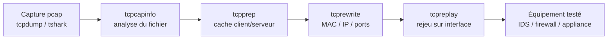
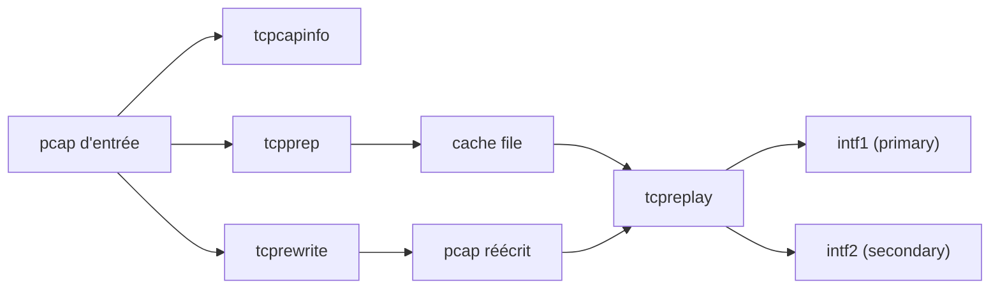

# 🎞️ tcpreplay — Le rejeu de trafic réseau

> [!info] **En 1 phrase**
> tcpreplay rejoue des captures pcap sur un réseau réel à un débit contrôlé, en réécrivant si besoin les adresses MAC/IP/ports pour tester des équipements, des IDS ou des scénarios d'attaque reproductibles.

---

## 🧾 Overview

| Champ | Valeur |
|---|---|
| Nom complet | tcpreplay (suite : tcpreplay, tcprewrite, tcpprep, tcpcapinfo, tcpliveplay, tcpreplay-edit) |
| Description | Rejeu de fichiers pcap/pcapng sur une interface, avec contrôle du débit (pps/Mbps/topspeed) et réécriture des en-têtes L2/L3/L4 |
| Catégorie | Réseau & Capture |
| Sous-catégorie | Rejeu de trafic (packet replay) |
| Fonction principale | Envoyer des paquets issus d'une capture à travers un réseau, de manière déterministe et reproductible |
| Type d'outil | CLI (suite d'outils en ligne de commande) |
| Licence | GPL-3.0-or-later |
| Open source / propriétaire | Open source |
| Langage(s) de programmation | C |
| Développeur / organisation | AppNeta (Fred Klassen), fondé par Aaron Turner |
| Projet officiel | tcpreplay (repo appneta/tcpreplay) |
| Dépôt officiel | https://github.com/appneta/tcpreplay |
| Documentation officielle | https://tcpreplay.appneta.com/ (wiki intégré) |
| Date de création | 2001 |
| État du projet | actif |
| Dernière version connue | 4.6.0 (2026-07-28) |
| Systèmes compatibles | Linux, FreeBSD, macOS, Solaris ; Windows (via Cygwin, usage limité) |

> [!note] Pour vérifier / compléter
> Sur Kali/Parrot, tcpreplay est préinstallé. La suite s'appelle aussi `tcpreplay-edit` (réécriture + rejeu en une passe). Vérifier le débit max avec `--stats` sur sa propre machine : il dépend du CPU, de la NIC et du mode utilisé (libpcap, netmap, DPDK, PF_RING).

---

## 🎯 Concept

tcpreplay prend un fichier de capture (`-r`-like, ici `-i <fichier>` pour l'entrée) et **réinjecte les paquets sur une interface réseau réelle**, à une vitesse choisie : plus vite que le temps réel (`--topspeed`), à un débit précis (`--pps`, `--mbps`) ou aussi vite que le réseau le permet. Contrairement à un scanner, il ne génère pas de trafic : il **rejoue exactement ce qui a été capturé**, ce qui garantit une reproduction fidèle d'un scénario (même timestamps, mêmes payloads, mêmes flags TCP).

Le cœur du modèle tcpreplay : **la séparation client/serveur**. Une capture contient deux directions de flux ; `tcpprep` construit un **cache file** qui étiquette chaque paquet comme *primary* ou *secondary* (source de la connexion vs réponse). `tcpreplay` émet alors les paquets *primary* sur `--intf1` et les *secondary* sur `--intf2` — indispensable pour tester un pare-feu ou un IDS en inline. Si on n'a qu'une interface, on peut tout émettre sur une seule (`-i eth0`).

Pour adapter une capture à un autre laboratoire, `tcprewrite` réécrit les adresses : MAC (`--enet-smac`, `--enet-dmac`), IP (`--srcipmap`, `--dstipmap`), ports (`--srcportmap`, `--dstportmap`, `--pnat`) et recalcule les checksums (`--fixcsum`). En cybersécurité offensive, tcpreplay sert à **reproduire une attaque capturée** (ex. un C2, une exfiltration) pour valider une détection, tester une règle, ou éduquer sans re-exécuter l'attaque réelle.



---

## 🧠 Concepts fondamentaux

| Concept | Explication |
|---|---|
| Cache file | Fichier produit par `tcpprep` qui classe chaque paquet en *primary* (client) ou *secondary* (serveur) ; passé à `tcpreplay` avec `-c/--cachefile` |
| Primary / Secondary | Étiquettes définissant la direction du flux : *primary* = initiateur, *secondary* = répondant ; émis respectivement sur `--intf1` et `--intf2` |
| Réécriture d'en-têtes | `tcprewrite` modifie MAC, IP, ports, VLAN et recalcule les checksums pour déployer la capture dans un autre réseau |
| Contrôle du débit | `--pps` (paquets/s), `--mbps` (débit), `--topspeed` (au maximum), `--duration` (durée), `--loop` (boucle) |
| Rejeu déterministe | Les paquets sont envoyés dans l'ordre et avec les timestamps de la capture (modulo le pacing choisi) |
| --unique-ip | Réécrit les IP source pour que chaque flux soit unique (évite les collisions de sessions côté équipement testé) |
| DLT (Data Link Type) | Type de liaison du fichier (Ethernet, SLL, RAW…) ; `--dlt` force une conversion si l'interface diffère |
| Preload | `-K/--preload-pcap` charge la capture en RAM avant l'envoi pour éliminer les lectures disque |
| Accélération matérielle | Modes compilés en option : netmap, DPDK, PF_RING pour des débits très élevés sur matériel adapté |
| Flow stats | `--stats` affiche périodiquement pps/Mbps/résultat du rejeu ; `--flow-stats` agrège par flux |

---

## 🛠️ Installation

### Debian / Ubuntu / Kali Linux

```bash
sudo apt update && sudo apt install -y tcpreplay
```

### Arch Linux

```bash
sudo pacman -S tcpreplay
```

### Fedora / RHEL

```bash
sudo dnf install -y tcpreplay
```

### macOS

```bash
brew install tcpreplay
```

### Compilation depuis les sources

```bash
git clone https://github.com/appneta/tcpreplay.git && cd tcpreplay
# Prérequis : libpcap, un compilateur C, automake/autoconf
./autogen.sh
./configure --enable-netmap --enable-dpdk   # options d'accélération optionnelles
make -j$(nproc)
sudo make install
```

> [!warning] ⚠️ Prérequis & problèmes potentiels
> - Le rejeu nécessite `root` (socket brut) ou les capacités appropriées.
> - `libpcap` doit être présent (`apt install libpcap-dev` pour compiler).
> - Windows : tcpreplay est compilable sous Cygwin mais le support est partiel ; préférer une VM Linux.
> - DPDK/PF_RING nécessitent une recompilation avec les librairies et du matériel compatible (NIC Intel ou Mellanox notamment).

---

## ⚙️ Configuration

La configuration se fait essentiellement par arguments de ligne de commande (comportement d'envoi, interfaces, débit). Quelques paramètres d'environnement et options récurrentes méritent attention.

| Paramètre | Rôle | Valeur possible | Impact | Exemple |
|---|---|---|---|---|
| `-i/--intf1` | Interface principale d'émission | `eth0`, `ens33`… | Où partent les paquets *primary* | `--intf1=eth0` |
| `--intf2` | Seconde interface (paquets *secondary*) | interface | Nécessaire avec un cache file pour tester en inline | `--intf1=eth0 --intf2=eth1` |
| `-c/--cachefile` | Cache client/serveur de `tcpprep` | chemin `.cache` | Active la séparation primary/secondary | `-c cap.cache` |
| `--dlt` | Forcer le type de liaison | `enet`, `sll`, `raw`… | Évite les erreurs si le fichier n'est pas Ethernet | `--dlt=enet` |
| `--mtu` | MTU pour l'analyse de fragmentation | octets | Influence le découpage/replay des fragments | `--mtu=1500` |
| `TCREPLAY_*` | Variables d'env (ex. verbosité) | — | Comportement global du suite | voir man pages |
| Fichier de log | Sorties `--stats` et `--verbose` redirigeables | fichier | Traçabilité des rejeux | `2> rejeu.log` |

---

## 🏗️ Architecture interne

La suite tcpreplay est organisée en binaires spécialisés qui s'enchaînent dans un pipeline :

- **tcpcapinfo** — lit un pcap et affiche ses caractéristiques (résolution temporelle, snap length, nombre de paquets, DLT). Première étape de diagnostic.
- **tcpprep** — construit le **cache file** : chaque paquet est marqué *primary* ou *secondary* selon `--auto`, `--port`, `--cidr`, `--regex`, `--mac`.
- **tcprewrite** — réécrit les en-têtes : MAC source/dest, adresses IP (mapping CIDR→CIDR), ports, NAT de ports, VLAN, TTL ; recalcule les checksums (`--fixcsum`) ; sort un nouveau pcap.
- **tcpreplay** — le moteur d'envoi : lit le pcap (+ cache optionnel), applique le pacing (`--pps`/`--mbps`/`--topspeed`), l'émet sur `--intf1`/`--intf2` via libpcap ou un mode accéléré.
- **tcpliveplay** — variante qui rejoue un flux *vers un hôte vivant* et tient compte des réponses réelles pour ajuster le rythme.
- **tcpreplay-edit** — combine réécriture et rejeu en une seule passe (appelé par tcpreplay quand `--enet-smac`/`--pnat`/`--unique-ip` sont passés directement).



---

## ⌨️ Commandes

### Commandes principales

```bash
tcpreplay [options] <fichier.pcap>
```

| Commande | Objectif | Résultat attendu |
|---|---|---|
| `sudo tcpreplay -i eth0 -t capture.pcap` | Rejouer au maximum de la vitesse | Trafic émis à ~topspeed |
| `sudo tcpreplay --intf1=eth0 --pps=1000 capture.pcap` | Rejouer à 1000 paquets/s | Pacing stable, stats affichées |
| `sudo tcpreplay -i eth0 --mbps=10 --duration=60 cap.pcap` | Débit fixé à 10 Mbps pendant 60 s | Contrôle du débit dans le temps |
| `sudo tcpreplay -c cap.cache --intf1=eth0 --intf2=eth1 cap.pcap` | Rejeu client/serveur en inline | Paquets répartis sur 2 interfaces |
| `tcpcapinfo cap.pcap` | Inspecter la capture | Résolution, snap, DLT, nombre de paquets |
| `tcpprep --auto=first --pcap=cap.pcap --cachefile=cap.cache` | Créer un cache client/serveur | Fichier `cap.cache` généré |
| `tcprewrite --infile=cap.pcap --outfile=cap2.pcap --srcipmap=0.0.0.0/0:10.10.20.0/24` | Réécrire les IP | Nouveau pcap aux IP cibles |

### Commandes avancées

```bash
# Rejouer en boucle avec un délai entre passes
sudo tcpreplay -i eth0 --loop=10 --loopdelay-ms=500 capture.pcap

# Précharger le fichier en RAM puis rejouer à fond
sudo tcpreplay -i eth0 -K -t capture.pcap

# Utiliser netmap pour un débit élevé (si compilé avec --enable-netmap)
sudo tcpreplay --netmap -i netmap:eth0 -t capture.pcap
```

---

## 🎚️ Options et flags

| Option | Description | Exemple | Niveau |
|---|---|---|---|
| `-i/--intf1 <iface>` | Interface principale d'émission | `-i eth0` | Basic |
| `--intf2 <iface>` | Seconde interface (secondary) | `--intf2=eth1` | Basic |
| `-t/--topspeed` | Envoyer le plus vite possible | `-t capture.pcap` | Basic |
| `--pps <N>` | Paquets par seconde | `--pps=1000` | Basic |
| `--mbps <N>` | Débit en mégabits/s | `--mbps=10` | Basic |
| `--duration <sec>` | Durée d'émission | `--duration=60` | Intermediate |
| `-l/--loop <N>` | Nombre de passes | `--loop=5` | Intermediate |
| `--loopdelay-ms <N>` | Pause entre deux passes | `--loopdelay-ms=500` | Intermediate |
| `--limit <N>` | Nombre maximal de paquets émis | `--limit=10000` | Intermediate |
| `-c/--cachefile <fichier>` | Cache client/serveur de tcpprep | `-c cap.cache` | Intermediate |
| `--unique-ip` | IP source uniques par flux | `--unique-ip` | Intermediate |
| `--pnat <ports>` | NAT de ports à la volée | `--pnat=80,443` | Advanced |
| `--enet-smac <mac>` | Réécrire MAC source | `--enet-smac=00:11:22:33:44:55` | Advanced |
| `--enet-dmac <mac>` | Réécrire MAC dest | `--enet-dmac=66:77:88:99:aa:bb` | Advanced |
| `--dlt <type>` | Forcer le type de liaison | `--dlt=enet` | Advanced |
| `--mtu <N>` | MTU pour la fragmentation | `--mtu=1500` | Advanced |
| `-K/--preload-pcap` | Précharger la capture en RAM | `-K -t cap.pcap` | Advanced |
| `--netmap` | Utiliser netmap pour l'envoi | `--netmap -i netmap:eth0` | Expert |
| `--stats <N>` | Afficher les stats toutes les N secondes | `--stats=5` | Intermediate |
| `-v/--verbose` | Sortie verbeuse | `-v` | Intermediate |
| `-V` | Version + infos de compilation | `tcpreplay -V` | Basic |

> [!tip] Options les plus utiles au quotidien
> `-i` (interface), `-t` (topspeed), `--pps`/`--mbps` (contrôle du débit), `--loop`, `-c` (cache), `--stats`. Vérifier le support de netmap/DPDK/PF_RING dans la sortie de `tcpreplay -V`.

---

## 🧪 Exemples pratiques

### Beginner

```bash
# Aperçu des infos de la capture
tcpcapinfo capture.pcap

# Rejouer le fichier sur eth0 à vitesse réelle
sudo tcpreplay -i eth0 capture.pcap

# Rejouer en boucle 5 fois
sudo tcpreplay -i eth0 --loop=5 capture.pcap
```

### Intermediate

```bash
# Débit contrôlé à 1000 pps, stats toutes les 2 s
sudo tcpreplay -i eth0 --pps=1000 --stats=2 capture.pcap

# Créer un cache client/serveur puis l'utiliser
tcpprep --auto=first --pcap=capture.pcap --cachefile=capture.cache
sudo tcpreplay -i eth0 -c capture.cache capture.pcap
```

### Advanced

```bash
# Adapter la capture à un autre lab (IP + MAC)
tcprewrite -i capture.pcap -o capture-lab.pcap \
  --srcipmap=192.168.1.0/24:10.10.20.0/24 \
  --enet-smac=00:11:22:33:44:55 --enet-dmac=66:77:88:99:aa:bb
sudo tcpreplay -i eth0 -t capture-lab.pcap

# Rejeu inline sur deux interfaces (test pare-feu/IDS)
sudo tcpreplay -c capture.cache --intf1=eth0 --intf2=eth1 capture.pcap
```

### Expert

```bash
# Vérifier que le fichier est exploitable avant tout rejeu
tcpcapinfo capture.pcap | head
tcpreplay --print-pcap-info capture.pcap
```

---

## 🧪 Workflow complet (scénario pas à pas)

1. **Étape 1 — Inspecter la capture** — confirmer DLT, résolution et nombre de paquets :
   ```bash
   tcpcapinfo capture.pcap
   ```
2. **Étape 2 — Créer le cache et adapter au lab** — classer les directions, réécrire IP/MAC :
   ```bash
   tcpprep --auto=first --pcap=capture.pcap --cachefile=capture.cache
   tcprewrite -i capture.pcap -o capture-lab.pcap --fixcsum \
     --srcipmap=192.168.1.0/24:10.10.20.0/24
   ```
3. **Étape 3 — Rejouer et valider** — émettre avec un débit maîtrisé, contrôler le reçu :
   ```bash
   sudo tcpreplay -i eth0 -c capture.cache --pps=1000 capture-lab.pcap
   tshark -r capture-lab.pcap -Y 'ip.addr == 10.10.20.15' -c 20
   ```

---

## 🎬 Scénarios avancés

### Scénario 1 : test d'un IDS Suricata en inline

```bash
# Le IDS observe eth1 ; on rejoue l'attaque capturée en direction de la cible
tcpprep --auto=first --pcap=attaque.pcap --cachefile=attaque.cache
sudo tcpreplay -c attaque.cache --intf1=eth0 --intf2=eth1 attaque.pcap
tail -f /var/log/suricata/eve.json   # vérifier les alertes émises
```

### Scénario 2 : reproduction d'un scénario C2 complet

```bash
# Rejouer un canal C2 capturé (beaconing + exfiltration) en boucle
sudo tcpreplay -i eth0 --loop=20 --loopdelay-ms=1000 c2_beacon.pcap
# Le trafic reproduit à l'identique permet de calibrer les règles de détection
```

### Scénario 3 : validation d'une règle de pare-feu

```bash
# Réécrire la capture pour qu'elle provienne de 10.10.20.15 vers un serveur test
tcprewrite -i exploit.pcap -o exploit-lab.pcap \
  --srcipmap=0.0.0.0/0:10.10.20.15 --dstipmap=0.0.0.0/0:192.168.1.10
sudo tcpreplay -i eth0 --pps=500 exploit-lab.pcap
```

### Scénario 4 : load test réseau / stress d'équipement

```bash
# Saturation progressive d'une liaison pour mesurer les pertes
sudo tcpreplay -i eth0 --mbps=100 --duration=30 --stats=5 gros.pcap
# Recommencer avec des débits croissants (50, 100, 500 Mbps) et comparer les stats
```

---

## 🛡️ Cybersecurity use cases

| Phase | Utilisation |
|---|---|
| Reconnaissance | Rejouer un scan capturé pour tester la détection de l'écosystème défensif |
| Exploitation | Reproduire un échange d'exploitation (handshake, payload) sans re-exécuter l'exploit |
| Post-exploitation | Rejouer une session C2/exfiltration pour valider l'analyse forensique |
| Défense | Calibrer Snort/Suricata/Zeek, tester les règles pare-feu et les tunnels |
| Formation | Créer des exercices réalistes (trafic malveillant rejoué dans un lab isolé) |
| Blue Team | Vérifier que les alertes remontent correctement sur du trafic connu |

---

## 🎯 MITRE ATT&CK

| Tactique | Technique / Sub-technique | ID | Raison | Détection | Mitigation |
|---|---|---|---|---|---|
| Discovery | Network Sniffing | T1040 | tcpreplay est l'aval du sniffing : il rejoue un trafic capturé pour le tester ou le réinjecter | Exécution de tcpreplay inattendue, volumes anormaux | Chiffrement, segmentation, supervision des interfaces |

> [!note] Ne renseigner que si l'association est réellement pertinente.
> tcpreplay n'est pas un outil offensif à proprement parler : c'est un outil de **rejeu/simulation**. Il s'associe surtout à T1040 (le couple capture→rejeu) et à l'activité de test de détection. Le réinjecter dans un réseau sans autorisation reste illégal ; son usage légitime est le lab et le blue teaming.

---

## 🛡️ Defensive Security

### Signes observables

| Indicateur | Détail |
|---|---|
| Exécution de `tcpreplay`/`tcprewrite` sur des machines de prod | EDR, Sigma sur process_creation, whitelisting |
| MAC source anormales (récrites via `--enet-smac`) | Supervision ARP, vérification CAM des switches |
| Rafales de paquets à débit anormal | Netflow/sFlow, seuils de pps sur les interfaces |
| Rejeu de trafic identique en boucle (`--loop`) | Corrélation des signatures de flux (mêmes séquences TCP) |
| Capture d'abord, rejeu ensuite sur le même segment | Audit des interfaces en promiscuous, 802.1X |

### Règles de détection (Sigma / Suricata / Snort / YARA)

```yaml
# Sigma — Linux : exécution de tcpreplay / tcprewrite / tcpprep
title: Packet Replay via tcpreplay
id: 6f2e1a4c-8d3b-4f1e-9a2d-5b6c7d8e9f0a
status: experimental
logsource:
    category: process_creation
    product: linux
detection:
    selection:
        Image|endswith:
            - '/tcpreplay'
            - '/tcprewrite'
            - '/tcpprep'
            - '/tcpliveplay'
    condition: selection
falsepositives:
    - Legitimate lab or blue team activity
level: medium
```

> [!note] À vérifier
> Signatures d'exemple à calibrer : le rejeu légitime (test, lab) produit les mêmes indicateurs qu'un usage malveillant. Les seuils dépendent du trafic de référence.

---

## 🤖 Automatisation

```bash
# Bash — rejouer toutes les captures d'un dossier, une par une
for f in /opt/captures/*.pcap; do
  tcpprep --auto=first --pcap="$f" --cachefile="$f.cache"
  sudo tcpreplay -i eth0 -c "$f.cache" --pps=500 "$f"
done

# Planifier un test de détection quotidien (cron)
# 0 2 * * * sudo tcpreplay -i eth0 -t /opt/captures/attaque.pcap >> /var/log/replay.log
```

```python
# Python — lancer tcpreplay et parser les stats
import re, subprocess
out = subprocess.check_output(["sudo", "tcpreplay", "-i", "eth0",
                               "--pps=1000", "--stats=1", "capture.pcap"],
                              text=True, stderr=subprocess.STDOUT)
for line in out.splitlines():
    m = re.search(r"([\d.]+) pkts/s.*?([\d.]+) Mbps", line)
    if m:
        print(f"pps={m.group(1)} mbps={m.group(2)}")
```

---

## 📤 Output et parsing

tcpreplay écrit ses statistiques sur **stderr** (affichage par défaut) ou via `--stats=N` pour un rapport périodique. Le format inclut les taux (pps, Mbps), le nombre de paquets émis et le pourcentage de réussite.

```bash
# Aperçu du rapport périodique
sudo tcpreplay -i eth0 --pps=1000 --stats=5 capture.pcap

# Sortie type
#   Actual: 1001 pkts/s, 1.42 Mbps, 100.00% ok
```

---

## 🔗 Intégrations

- [[Tools|🧰 Outils]] global
- [[Outil - tcpdump]] — capture le trafic rejoué pour validation
- [[Outil - tshark]] / [[Outil - Wireshark]] — analyse et validation des pcaps avant/après rejeu
- [[Outil - Scapy]] — génère les pcaps de test, complément de forgerie
- [[Outil - Suricata]] / [[Outil - Snort]] / [[Outil - Zeek]] — cibles du test de détection
- [[Outil - Nmap]] — génère le trafic de scan que l'on rejoue pour tester les règles

```text
tcpdump -w cap.pcap → tcpprep (cache) → tcprewrite (IP/MAC) → tcpreplay → IDS/pare-feu
Capture → tshark -V → tcpreplay → tcpdump -w out.pcap → diff des signatures
```

---

## 🔄 Alternatives

| Outil | Avantages | Inconvénients | Cas d'usage |
|---|---|---|---|
| tcpliveplay (tcpreplay) | Rejouer vers un hôte vivant, ajuste le rythme | Plus complexe à configurer | Reproduction interactive |
| Scapy (`sendp`/`srp`) | Contrôle total en Python, forgerie fine | Lent, script obligatoire | Rejeu sur mesure |
| Ostinato | GUI + API, grosses batteries de tests | Propriétaire (licence), moins répandu | Tests de charge |
| tcpdump (capture) | Inversement : capture et validation | Ne rejoue pas | Amont du workflow |
| `tcpreplay` (mode libpcap par défaut) | Fiable partout | Débit plafonné vs netmap/DPDK | Usage standard |

> **Quand utiliser tcpreplay plutôt que Scapy ?** Dès qu'il faut rejouer une capture existante à l'identique et à fort débit : tcpreplay est optimisé pour cela, Scapy est plus adapté à la forgerie de paquets ad hoc.

---

## ⚡ Performance

- **`--topspeed` + `-K`** : la précharge en RAM supprime les lectures disque et maximise le débit.
- **netmap / DPDK / PF_RING** : modes accélérés pour dépasser la limite libpcap (jusqu'à plusieurs millions de pps sur NIC adaptées).
- **`--pps`/`--mbps`** : le pacing précis coûte du CPU ; vérifier l'écart entre le taux demandé et le taux réel dans `--stats`.
- **Limites** : sans netmap, une interface standard sature vers 100-500 kpps selon le CPU ; le timing d'origine n'est pas préservé en `--topspeed`.
- **Validation** : comparer `tcpcapinfo` (paquets en entrée) au compteur de `--stats` (paquets émis) pour détecter des pertes.

> [!note] À vérifier
> Les chiffres dépendent du matériel (CPU, NIC, driver) et du mode d'envoi ; mesurer sur sa propre plateforme.

---

## 🛠️ Troubleshooting

### Common problems

#### Problème : « cache file » introuvable ou incohérent

- **Cause** : le cache de `tcpprep` ne correspond pas au pcap fourni.
- **Solution** : régénérer le cache avec le même pcap : `tcpprep --auto=first --pcap=cap.pcap --cachefile=cap.cache`.
- **Vérification** : `tcpreplay -c cap.cache -i eth0 cap.pcap` doit démarrer sans erreur.

#### Problème : erreur de DLT (data link type)

- **Cause** : le pcap n'est pas Ethernet (SLL, RAW) alors que l'interface attend de l'Ethernet.
- **Solution** : `--dlt=enet` pour forcer, ou convertir avec `tcprewrite --dlt=enet`.
- **Vérification** : `tcpcapinfo cap.pcap` affiche le type de liaison.

#### Problème : checksums invalides à destination

- **Cause** : la réécriture d'IP/MAC a cassé les checksums TCP/UDP/IP.
- **Solution** : `tcprewrite ... --fixcsum`.
- **Vérification** : `tshark -r out.pcap -Y 'ip.checksum_bad || tcp.checksum_bad'` ne doit rien trouver.

#### Problème : débit réel très inférieur à `--pps`

- **Cause** : saturation CPU, lecture disque, ou interface en mode normal (pas netmap).
- **Solution** : `-K` (preload), `--netmap`, ou réduire `--pps`.
- **Vérification** : `--stats=1` compare le taux demandé au taux « Actual ».

#### Problème : aucun paquet reçu par l'équipement testé

- **Cause** : MAC/IP de la capture non routables sur le segment, ou cache mal construit.
- **Solution** : réécrire les adresses (`--enet-smac`, `--srcipmap`) et vérifier le cache.
- **Vérification** : capturer avec tcpdump sur l'interface réceptrice : `sudo tcpdump -i eth1 -c 10`.

---

## 🔐 Sécurité de l'outil

- **Privilèges** : l'envoi de paquets bruts exige `root` (ou les capacités `CAP_NET_RAW`).
- **Risque réseau** : le rejeu peut déstabiliser un réseau réel (ARP, sessions, charges) — à utiliser uniquement en lab ou sur segment dédié.
- **Spoofing** : `--enet-smac`/`--srcipmap` produisent du trafic « usé » — traçable via les tables ARP/les logs.
- **Télémétrie** : aucune ; mais le trafic émis est observable (netflow, IDS) et identifiable comme du rejeu (séquences TCP répétées).
- **Données sensibles** : les pcaps rejoués peuvent contenir des credentials — les réécrire/nettoyer avant rejeu hors lab.
- **Autorisations** : réinjecter du trafic sur un réseau sans accord est illégal ; documenter chaque rejeu (fichier, date, réseau).

---

## ⚠️ Limitations

- Ne modifie pas le contenu applicatif : seul le rejeu d'en-têtes est natif (payloads inchangés).
- Le timing d'origine est perdu en `--topspeed` ; les modes `--pps`/`--mbps` rythment mais ne reproduisent pas les micro-variations.
- Le débit maximal est borné par le matériel et le mode d'envoi (libpcap ≪ netmap/DPDK).
- Pas d'interface graphique : tout est en CLI (mais scriptable).
- La conversion de DLT (ex. SLL→Ethernet) exige `tcprewrite` et une vérification des checksums.

---

## 📋 Cheatsheet

```bash
# Inspecter une capture
tcpcapinfo cap.pcap

# Créer un cache client/serveur
tcpprep --auto=first --pcap=cap.pcap --cachefile=cap.cache

# Réécrire IP + MAC + checksums
tcprewrite -i cap.pcap -o cap-new.pcap \
  --srcipmap=192.168.1.0/24:10.10.20.0/24 \
  --enet-smac=00:11:22:33:44:55 --fixcsum

# Rejouer au maximum
sudo tcpreplay -i eth0 -t cap.pcap

# Rejouer à un débit maîtrisé
sudo tcpreplay -i eth0 --pps=1000 cap.pcap
sudo tcpreplay -i eth0 --mbps=10 --duration=60 cap.pcap

# Stats périodiques
sudo tcpreplay -i eth0 --pps=1000 --stats=5 cap.pcap
```

---

## ⚡ Quick reference

| | |
|---|---|
| **À quoi sert-il ?** | Rejouer des captures pcap sur un réseau réel à un débit contrôlé, avec réécriture d'en-têtes |
| **Quand l'utiliser ?** | Pour tester un IDS/pare-feu, reproduire une attaque, valider une détection ou charger un réseau |
| **Commande principale** | `sudo tcpreplay -i eth0 --pps=1000 capture.pcap` |
| **Alternative principale** | Scapy (`sendp`), Ostinato, tcpliveplay pour le rejeu interactif |
| **Concepts importants** | cache file (primary/secondary), `--pps`/`--mbps`/`--topspeed`, `--fixcsum`, DLT, netmap |
| **Liens associés** | [[Outil - tcpdump]] · [[Outil - tshark]] · [[Outil - Scapy]] · [[Outil - Suricata]] |

---

## 🔍 Détection & Défense

| Signe | Défense |
|---|---|
| Exécution de `tcpreplay`/`tcpprep`/`tcprewrite` sur des postes sensibles | EDR + Sigma, whitelisting, restriction sudo |
| MAC/IP réécrites (spoofing) visibles en ARP | Supervision ARP/CAM, 802.1X |
| Rafales de paquets répétitives (mêmes séquences TCP) | Netflow/sFlow, seuils de pps, corrélation |
| Rejeu en boucle d'une même capture | Analyse de similarité des flux, signatures réseau |
| Capture + rejeu sur le même segment | Audit des interfaces promiscuous |

---

## ⚠️ Tips & Pièges

> [!tip] 💡 **Tips**
> - Toujours vérifier le pcap avec `tcpcapinfo` avant de rejouer : DLT, résolution, snap length.
> - Pour un test réaliste, réécrire les MAC/IP avec `tcprewrite` avant le rejeu, puis `--fixcsum`.
> - Utiliser `--stats=N` pour vérifier que le débit demandé est bien atteint.
> - En lab, préférer un réseau isolé : le rejeu produit des ARP et des sessions potentiellement perturbatrices.
> - Combiner `-K` (preload) et `--topspeed` pour un stress maximal simple.

> [!warning] ⚠️ **Pièges**
> - Oublier `--fixcsum` après réécriture : les équipements testés droppent le trafic sur checksum invalide.
> - Un cache `tcpprep` recréé avec un autre pcap casse le rejeu (erreur « cache file »).
> - `--topspeed` ne préserve pas le timing d'origine : les scénarios temporels (beaconing) perdent leur rythme.
> - Sans netmap/DPDK, le débit libpcap sature vite : ne pas attendre du million de pps sur du matériel standard.
> - Le rejeu sur un réseau de production sans autorisation est illégal et détectable.

---

## 📚 References

### Official

- Site officiel et wiki : https://tcpreplay.appneta.com/
- Dépôt officiel : https://github.com/appneta/tcpreplay
- Man page tcpreplay : https://tcpreplay.appneta.com/tcpreplay.html
- Man page tcprewrite : https://tcpreplay.appneta.com/tcprewrite.html
- Man page tcpprep : https://tcpreplay.appneta.com/tcpprep.html

### Security references

- MITRE ATT&CK T1040 — Network Sniffing : https://attack.mitre.org/techniques/T1040/
- Suricata — règles de détection : https://suricata.readthedocs.io/
- Snort — documentation : https://www.snort.org/

### Community

- HackTricks — pcap inspection & replay : https://book.hacktricks.xyz/generic-methodologies-and-resources/basic-forensic-methodology/pcap-inspection
- Exemples d'usage tcpreplay (blogs) : https://tcpreplay.appneta.com/wiki/howto.html

---

➡️ **Liens :** [[Tools|🧰 Outils]] · [[Outil - tcpdump|tcpdump]] · [[Outil - tshark|tshark]] · [[Outil - Wireshark|Wireshark]] · [[Outil - Scapy|Scapy]]
