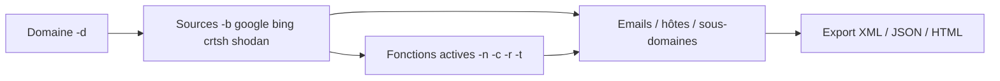
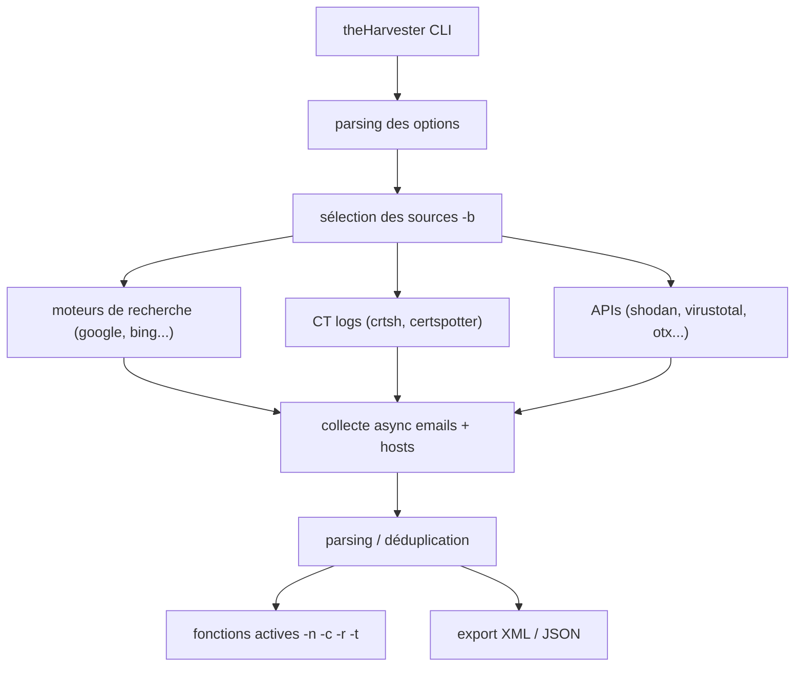

# theHarvester — Collecte d'emails, hôtes et sous-domaines en OSINT

> [!info] **En 1 phrase**
> theHarvester est un outil OSINT qui collecte emails, noms d'utilisateurs, hôtes et sous-domaines d'un domaine à partir de moteurs de recherche et de sources publiques.

---

## Overview

| Champ | Valeur |
|---|---|
| Nom complet | theHarvester |
| Description | Outil OSINT Python (async) qui agrège emails, hôtes, sous-domaines, noms d'utilisateurs et URLs depuis des moteurs de recherche et sources publiques |
| Catégorie | Reconnaissance & OSINT |
| Sous-catégorie | OSINT / Collecte d'emails / Subdomain enumeration |
| Fonction principale | Reconstruire l'empreinte publique d'une organisation (emails, hôtes, sous-domaines) |
| Type d'outil | CLI Python 3 (async), binaire `theHarvester` |
| Licence | GPL-2.0 |
| Open source / propriétaire | Open source |
| Langage(s) de programmation | Python 3 |
| Développeur / organisation | laramies (Christian Martorella) |
| Projet officiel | https://github.com/laramies/theHarvester |
| Dépôt officiel | https://github.com/laramies/theHarvester |
| Documentation officielle | https://github.com/laramies/theHarvester/wiki |
| Date de création | 2010 (outil historique Kali) |
| État du projet | actif |
| Dernière version connue | 4.11.1 (2026-06-03) |
| Systèmes compatibles | Linux (Kali), macOS, Windows ; Python 3.12+ requis pour la 4.x récente |

> [!note] Pour vérifier / compléter
> Depuis la 4.x, l'outil passe par Python async et nécessite Python 3.12+. Installation recommandée avec `uv` (`uv sync`). Les clés API se placent dans `api-keys.yaml` (et `proxies.yaml` pour les proxies).

---

## Concept

theHarvester interroge des dizaines de sources (Google, Bing, Baidu, DuckDuckGo, Shodan, crt.sh, VirusTotal, AlienVault OTX, GitHub, etc.) pour reconstruire l'empreinte publique d'une organisation : **adresses email** (utiles pour phishing ciblé / password spraying), **hôtes et sous-domaines** (surface d'attaque), **noms d'utilisateurs**. Utilisé en début de pentest pour construire la liste des cibles humaines et techniques. Certaines sources nécessitent une clé API (à placer dans `api-keys.yaml`).

L'outil est écrit en **Python 3** (async) et se lance avec `theHarvester -d <domaine> -b <source>`. La source `-b all` interroge toutes les sources configurées (long et rate-limité) ; les sources spécialisées comme `crtsh`, `certspotter` (certificats), `shodan`, `virustotal` (hôtes) nécessitent des clés. Depuis les versions récentes, il intègre aussi des fonctions actives : **DNS lookup** (`-n`), **DNS brute force** (`-c`), **vérification de DNS resolution** (`-r`) et **détection de sous-domaines pris en takeover** (`-t`). L'export `-f` produit des fichiers XML + JSON exploitables par d'autres outils.



---

## Concepts fondamentaux

| Concept | Explication |
|---|---|
| Emails | Adresses `@domaine` scrapées des moteurs/sources : cibles humaines (phishing, password spraying) |
| Hôtes / sous-domaines | Noms DNS découverts (crtsh, shodan, virustotal...) : surface d'attaque |
| Noms d'utilisateurs | Comptes découverts sur les sources (profils sociaux, forums...) |
| Sources | Moteurs (google, bing, baidu, duckduckgo), CT (crtsh, certspotter), API (shodan, virustotal, otx, github, hunterio...) |
| `api-keys.yaml` | Fichier des clés API par service (certaines sources sont inaccessibles sans clé) |
| `proxies.yaml` | Fichier des proxies HTTP/SOCKS utilisés avec `-p` |
| Takeover | Un CNAME pointant vers un service non contrôlé (S3, Heroku, GitHub Pages...) permet de prendre le sous-domaine |
| DNS functions | `-n` (lookup), `-c` (bruteforce), `-r` (vérification de résolution), `-e` (serveur DNS) |
| Rate limiting | Les moteurs bloquent après quelques requêtes : alterner les sources et limiter `-l` |

---

## Installation

### Kali / Debian

```bash
sudo apt update && sudo apt install theharvester
```

### Depuis les sources (recommandé, dernière version)

```bash
git clone https://github.com/laramies/theHarvester
cd theHarvester
pip install -r requirements/base.txt
# Python 3.12+ requis pour la version actuelle
```

### Via uv (installation moderne)

```bash
curl -LsSf https://astral.sh/uv/install.sh | sh
cd theHarvester
uv sync
uv run theHarvester -h
```

### Vérification

```bash
theHarvester -h
theHarvester -d example.com -b crtsh -l 50
```

---

## Configuration

### Clés API : `api-keys.yaml`

Les clés sont optionnelles mais certaines sources (shodan, virustotal, hunterio, securitytrails...) ne fonctionnent pas sans.

```yaml
shodan: TA_CLE_SHODAN
virustotal: TA_CLE_VT
hunterio: TA_CLE_HUNTER
securitytrails: TA_CLE_ST
github: ghp_XXXX
censys:
  - id: CID
    secret: SECRET
otx: TA_CLE_OTX
```

### Proxies : `proxies.yaml`

```yaml
http: "http://127.0.0.1:8080"
https: "http://127.0.0.1:8080"
# Utilisation : theHarvester ... -p
```

### Options CLI principales

| Option | Effet |
|---|---|
| `-d <domaine>` | Domaine cible (obligatoire) |
| `-b <source>` | Source(s) : google, bing, baidu, crtsh, shodan, virustotal, duckduckgo, all... |
| `-l <n>` | Nombre maximal de résultats (défaut 500) |
| `-f <fichier>` | Sauvegarde des résultats en XML + JSON |
| `-t` | Vérifie les sous-domaines prenables (takeover) |
| `-n` | DNS lookup sur le domaine |
| `-c` | DNS brute force du domaine |
| `-r` | Vérifie la résolution des noms trouvés |
| `-e <serveur>` | Serveur DNS à utiliser pour les lookups |
| `-s` | Interroge Shodan sur les hôtes découverts |
| `-p` | Utilise les proxies de `proxies.yaml` |
| `-v` | Mode verbeux |
| `-a` | Scan des endpoints API (via une wordlist) |

---

## Architecture interne



- **`theHarvester/`** : modules Python async. Chaque source implémente une classe d'interaction (moteurs, CT, APIs).
- **`core/`** : parsing des options, gestion des emails (`emailsearch.py`), hosts (`hostsearch.py`), DNS, et le module de takeover.
- **Async** : les requêtes vers les sources sont concurrentes (aiohttp) : rapide mais plus sensible au rate-limit.
- **`api-keys.yaml`** : chargé au démarrage pour injecter les clés dans les sources qui en demandent.
- **Export** : `-f <nom>` écrit `<nom>.xml` et `<nom>.json` ; il existe aussi un rapport HTML.

---

## Commandes

### Commandes essentielles

```bash
# Collecte emails + hôtes via Google et Bing
theHarvester -d example.com -b google,bing -l 200
# Recherche via crt.sh + Shodan (nécessite une clé Shodan)
theHarvester -d example.com -b crtsh,shodan
# Toutes les sources (long)
theHarvester -d example.com -b all
# Vérification des takeovers de sous-domaines
theHarvester -d example.com -b crtsh -t
```

### Tableau des options

| Commande | Effet |
|---|---|
| `-d <domaine>` | Domaine cible (obligatoire) |
| `-b <source>` | Source : `google`, `bing`, `baidu`, `shodan`, `crtsh`, `virustotal`, `duckduckgo`, `all`... |
| `-l <n>` | Nombre maximal de résultats (défaut 500) |
| `-f <fichier>` | Sauvegarde des résultats en XML + JSON |
| `-s` | Interroge Shodan sur les hôtes découverts |
| `-t` | Vérifie les sous-domaines potentiellement prenables (takeover) |
| `-n` | Effectue un DNS lookup sur le domaine |
| `-c` | DNS brute force du domaine |
| `-e <serveur>` | Serveur DNS à utiliser pour les lookups |
| `-p` | Utilise les proxies définis dans `proxies.yaml` |
| `-v` | Mode verbeux |
| `-a` | Scan des endpoints API du domaine |

---

## Options et flags (détail)

| Flag | Défaut | Description |
|---|---|---|
| `-d` | — | Domaine cible (requis) |
| `-b` | — | Source(s) séparées par des virgules, ou `all` |
| `-l` | 500 | Nombre max de résultats |
| `-f` | — | Base de nom pour XML/JSON/HTML |
| `-t` | off | Détection de takeover |
| `-n` | off | DNS lookup |
| `-c` | off | DNS bruteforce |
| `-r` | off | Vérification de résolution DNS |
| `-e` | système | Serveur DNS (avec `-n`/`-c`/`-r`) |
| `-s` | off | Interroger Shodan sur les hôtes |
| `-p` | off | Activer les proxies |
| `-a` | off | Scan d'endpoints API |
| `-v` | off | Verbeux |
| `-h` | — | Aide |

---

## Exemples pratiques

### Recherche simple via crtsh

```bash
theHarvester -d example.com -b crtsh -l 100
```

### Emails via plusieurs moteurs

```bash
theHarvester -d example.com -b google,bing,duckduckgo -l 300
```

### Hôtes via API avec clés

```bash
theHarvester -d example.com -b shodan,virustotal,otx
```

### Export complet

```bash
theHarvester -d example.com -b all -f results
# Produit results.xml + results.json
```

### DNS bruteforce

```bash
theHarvester -d example.com -c -e 8.8.8.8
```

---

## Workflow complet (scénario pas à pas)

1. **Recherche initiale** — collecter emails et hôtes depuis plusieurs moteurs.
   ```bash
   theHarvester -d example.com -b google,bing,crtsh -l 300
   ```
2. **Élargir avec des moteurs « alternatifs »** — résultats complémentaires.
   ```bash
   theHarvester -d example.com -b baidu,duckduckgo -l 300
   ```
3. **Sources spécialisées** — hôtes et sous-domaines avec clés API.
   ```bash
   theHarvester -d example.com -b shodan,virustotal,otx
   ```
4. **Exporter et analyser** — générer les fichiers pour le rapport ou un autre outil.
   ```bash
   theHarvester -d example.com -b all -f results
   # Produit results.xml + results.json
   ```
5. **Exploitation des emails** — les adresses `@example.com` serviront pour du password spraying (`hydra` ou un framework de phishing) si le scope le permet.

---

## Scénarios avancés

### Scénario 1 : Chasse aux takeovers de sous-domaines

```bash
# Collecter les sous-domaines puis vérifier les candidats au takeover
theHarvester -d example.com -b crtsh,certspotter -t -f ct_results
# -t signale les sous-domaines dont le CNAME pointe vers un service non contrôlé
# Vérification manuelle : dig CNAME <sous-domaine> + resolution de la cible
```

### Scénario 2 : Recon complète emails + hôtes pour un rapport

```bash
theHarvester -d example.com -b all -l 1000 -f full_scan
# Analyse du JSON avec jq
jq -r '.emails[]?.email' full_scan.json
jq -r '.hosts[]?.host' full_scan.json
# Croiser les hôtes avec nmap/httpx pour la surface d'attaque
```

### Scénario 3 : Découverte d'API endpoints exposés

```bash
# Scan des endpoints API du domaine (nécessite une wordlist)
theHarvester -d example.com -a -w /usr/share/seclists/Discovery/Web-Content/api-endpoints.txt
# ou sans wordlist : la liste par défaut de l'outil est utilisée
theHarvester -d example.com -a
```

### Scénario 4 : Emails ciblés pour password spraying

```bash
# Récupérer les emails et les normaliser
theHarvester -d example.com -b google,bing,crtsh -l 500 -f emails
jq -r '.emails[]?.email' emails.json | sort -u > targets.txt
# Puis (si autorisé) hydra -L targets.txt ...
```

---

## Cybersecurity use cases

| Cas d'usage | Exemple concret |
|---|---|
| Pentest (recon) | Emails + hôtes avant la phase d'attaque |
| Social engineering | Liste des emails réels pour phishing ciblé |
| Password spraying | Construction de la liste des comptes valides |
| Bug bounty | Sous-domaines du scope avant probing |
| OSINT / due diligence | Empreinte publique d'une organisation |
| Attribution | Recherche de noms d'utilisateurs sur les sources |

---

## MITRE ATT&CK

| Technique | ID | Rapport avec theHarvester |
|---|---|---|
| Search Open Technical Databases | T1596 | crtsh, certspotter, shodan, virustotal |
| Search Engines | T1593.001 | Google, Bing, Baidu, DuckDuckGo |
| Gather Victim Identity Information | T1589 | Emails et noms d'utilisateurs |
| Gather Victim Org Information | T1591 | Emails et structure d'organisation |
| Gather Victim Host Information | T1590 | Hôtes, sous-domaines, DNS |
| Phishing / Initial Access | T1566 | Les emails collectés alimentent le ciblage (en aval) |

---

## Defensive Security

| Usage défensif | Description |
|---|---|
| Audit de fuite d'emails | Vérifier quels emails d'entreprise sont publics |
| Monitoring d'exposition | Suivre l'apparition de nouveaux sous-domaines |
| Validation des takeovers | `-t` sur son propre domaine pour corriger les CNAME orphelins |
| Sensibilisation | Montrer ce qu'un attaquant trouve passivement |

> [!warning] Contexte
> Les fonctions actives (`-n`, `-c`, `-r`) génèrent des requêtes DNS visibles. Les emails scrapés restent des données publiques : leur utilisation (spraying, phishing) exige un cadre légal.

---

## Automatisation

### Script multi-sources

```bash
#!/bin/bash
# Collecte complète avec export
DOMAIN=${1:?Usage: $0 <domaine>}
theHarvester -d "$DOMAIN" -b all -l 1000 -f "harvest_$DOMAIN"
jq -r '.emails[]?.email' "harvest_$DOMAIN.json" | sort -u > emails_$DOMAIN.txt
jq -r '.hosts[]?.host' "harvest_$DOMAIN.json" | sort -u > hosts_$DOMAIN.txt
```

### Intégration dans la chaîne

```bash
# Hôtes trouvés → probing HTTP
jq -r '.hosts[]?.host' harvest.json | httpx -sc -title -silent
# Emails → triage
jq -r '.emails[]?.email' harvest.json | sort -u | sponge emails.txt
```

### Cron

```bash
# Revue mensuelle de son domaine
0 4 1 * * /opt/scripts/harvest.sh example.com >> /var/log/harvester.log 2>&1
```

---

## Output et parsing

### Sortie console

```
[*] Emails found: 12
----------------
contact@example.com
admin@example.com
...

[*] Hosts found: 34
----------------
mail.example.com
api.example.com
...
```

### Export JSON (`-f results`)

```bash
jq -r '.emails[]?.email' results.json | sort -u
jq -r '.hosts[]?.host' results.json | sort -u
jq -r '.users[]?.username' results.json
```

### Export XML

```bash
# results.xml : balises <email>, <host>, <user>
grep -oP '(?<=<email>)[^<]+' results.xml | sort -u
```

### HTML

`-f` produit aussi un rapport HTML consultable dans le navigateur.

---

## Intégrations

| Outil | Intégration |
|---|---|
| [[Outil - Amass\|Amass]] | Complémentaire pour l'énumération DNS active |
| [[Outil - subfinder\|subfinder]] | Plus complet sur les sous-domaines (sources passives) |
| [[Outil - httpx\|httpx]] | Probing HTTP des hôtes découverts |
| [[Outil - Nmap\|Nmap]] | Scan des hôtes / sous-domaines |
| [[Outil - hydra\|hydra]] | Password spraying avec les emails collectés (scope autorisé) |
| [[Outil - Recon-ng\|Recon-ng]] | Alternative modulaire (modules emails/hosts) |
| [[Outil - Shodan CLI\|Shodan CLI]] | Interrogation Shodan (`-s`, `-b shodan`) |
| [[Outil - spiderfoot\|SpiderFoot]] | Recon automatisée plus large |
| [[Techniques/Password Spraying\|Password Spraying]] | Utilisation aval des emails récupérés |

---

## Alternatives

| Outil | Différence clé |
|---|---|
| [[Outil - subfinder\|subfinder]] | Focalisé sous-domaines, plus de sources DNS |
| [[Outil - Amass\|Amass]] | Énumération DNS complète (active + passive) |
| [[Outil - Recon-ng\|Recon-ng]] | Framework modulaire, base SQLite |
| [[Outil - spiderfoot\|SpiderFoot]] | Scan automatisé complet avec corrélation |
| hunter.io / securitytrails | Services web commerciaux pour emails/domaines |

---

## Performance

| Facteur | Impact |
|---|---|
| `-b all` | Long et rate-limité : préférer des sources ciblées |
| `-l` | Limite le nombre de résultats par source |
| Async | Requêtes concurrentes : rapide mais risque de blocage des moteurs |
| Clés API | Sources avec clé : plus stables et plus de données |
| Fonctions actives | DNS lookup/bruteforce : dépendent du serveur DNS (`-e`) |
| Export | `-f` écrit XML+JSON, léger en coût |

---

## Troubleshooting

| Problème | Cause probable | Solution |
|---|---|---|
| Source ne renvoie rien | Rate-limit / clé manquante | Alterner les sources, ajouter la clé dans `api-keys.yaml` |
| Erreur d'import Python | Python < 3.12 | Mettre à jour Python, utiliser `uv sync` |
| `-c` lent | Bruteforce DNS massif | Réduire, utiliser un serveur DNS rapide (`-e`) |
| Google bloque vite | Rate-limit sans clé | Utiliser crtsh/bing/baidu ou une clé de recherche |
| Emails/hôtes obsolètes | Sources datées | Vérifier l'actualité avant de les ajouter au scope |
| `-t` ne détecte rien | Sous-domaines non couverts | Enrichir avec crtsh/certspotter et une vérification manuelle |

---

## Sécurité de l'outil

| Point | Détail |
|---|---|
| Clés API | En clair dans `api-keys.yaml` : chmod 600, ne pas versionner |
| Proxies | `proxies.yaml` peut rediriger tout le trafic de collecte |
| Traçabilité | Les requêtes vers les moteurs/APIs partent de votre IP |
| Données collectées | Emails/hôtes potentiellement sensibles : stockage protégé |
| Usage | Emails publics ≠ droit de les utiliser pour du phishing |

---

## Limitations

| Limitation | Détail |
|---|---|
| Rate-limit des moteurs | Google/Bing bloquent vite sans clé |
| Sources instables | Les formats/APIs changent : mettre à jour l'outil |
| Couverture emails | Ne trouve que les emails publics indexés |
| Bruteforce DNS limité | `-c` moins puissant que puredns/amass |
| Dépendance aux clés | Certaines sources inaccessibles sans clé |
| Vérification manuelle | Takeover `-t` nécessite une confirmation manuelle |

---

## Cheatsheet

```bash
# Émails + hôtes via moteurs
theHarvester -d example.com -b google,bing,crtsh -l 300

# Sources API
theHarvester -d example.com -b shodan,virustotal,otx

# Toutes sources + export
theHarvester -d example.com -b all -f results

# Takeover
theHarvester -d example.com -b crtsh -t

# DNS
theHarvester -d example.com -n -c -e 8.8.8.8

# Analyse JSON
jq -r '.emails[]?.email' results.json | sort -u
jq -r '.hosts[]?.host' results.json | sort -u
```

---

## Quick reference

| Action | Commande |
|---|---|
| Collecte emails + hôtes | `theHarvester -d <domaine> -b google,bing,crtsh` |
| Toutes les sources | `-b all` |
| Export XML/JSON/HTML | `-f <nom>` |
| Takeover | `-t` |
| DNS lookup / bruteforce | `-n` / `-c` |
| Serveur DNS | `-e 8.8.8.8` |
| Proxy | `-p` |
| Verbeux | `-v` |

---

## Détection & Défense

| Réponse | Détail |
|---|---|
| Passif | Aucun contact direct : indétectable chez la cible |
| Moteurs rate-limités | Google bloque vite sans clé : alterner les sources |
| Défense : réduire la surface | Éviter les emails pro au format scrapeable, utiliser des adresses génériques |
| Défense : surveiller crt.sh | Un attaquant repère les nouveaux sous-domaines très vite après leur création |
| Fonctions actives (`-c`, `-r`, `-n`) | Requêtes DNS directes : visibles dans les logs du résolveur |

---

## Tips & Pièges

> [!tip] **Toujours croiser plusieurs sources**
> Chaque moteur renvoie des résultats différents : une bonne liste (`google,bing,crtsh,baidu`) donne l'image la plus complète.

> [!tip] **Exporter systématiquement**
> Utilisez `-f` dès le premier scan : les fichiers XML/JSON conservent l'historique et alimentent le rapport final sans relancer les moteurs (rate-limit).

> [!warning] **Google rate-limite très vite**
> Sans API key, 5-10 requêtes suffisent pour être bloqué. Privilégier crtsh / bing / baidu ou une clé de recherche.

> [!warning] **Emails scrapés ≠ autorisation de phishing**
> En engagement légal, vérifier le scope : certains emails sont des alias techniques, d'autres de vraies cibles humaines.

> [!warning] **Sources obsolètes**
> Des hôtes / emails vieux de plusieurs années peuvent apparaître : vérifier l'actualité avant de les ajouter au scope.

> [!danger] **Pas de source active sans autorisation**
> `-c` (bruteforce) et les requêtes DNS directes sont visibles côté cible.

---

## References

### Official
- [GitHub officiel — theHarvester](https://github.com/laramies/theHarvester)
- [Documentation / API keys](https://github.com/laramies/theHarvester/wiki)

### Security
- [Kali Tools — theHarvester](https://www.kali.org/tools/theharvester/)
- [MITRE ATT&CK — Gather Victim Identity Information T1589](https://attack.mitre.org/techniques/T1589/)

### Community
- [Cheatsheet theHarvester (community)](https://gist.github.com/)

---

**Liens :** [[Tools| Outils]] · [[01 - Reconnaissance| Reconnaissance]] · [[Outil - Amass| Amass]] · [[Techniques/Password Spraying| Password Spraying]] · [[Outil - subfinder| subfinder]]
