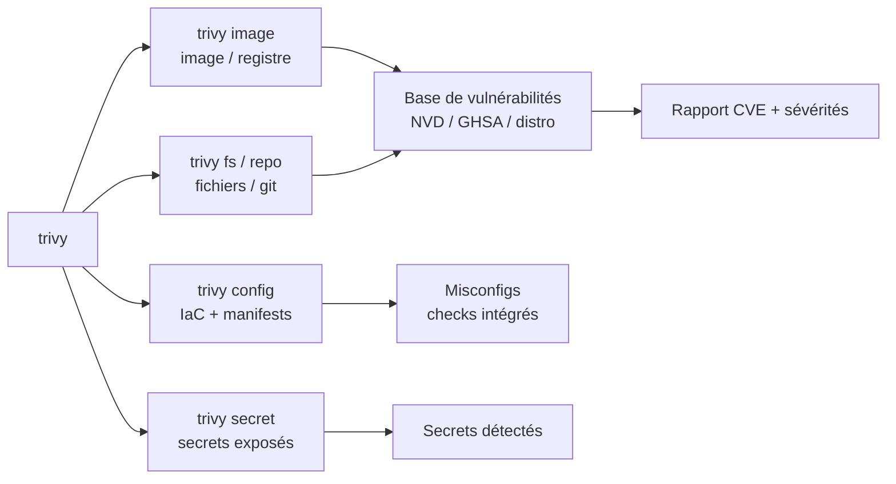
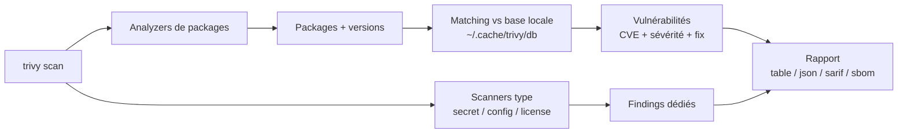

# trivy - Le scanner omniscient des vulnérabilités

> [!info] **En 1 phrase**
> trivy analyse images conteneurs, fichiers, dépôts et manifests Kubernetes pour lister les vulnérabilités, secrets et mauvaises configurations exploitables : un couteau suisse DevSecOps aussi utile en offense qu'en défense.

---

## Overview

| Champ | Valeur |
|---|---|
| Nom complet | trivy |
| Description | Scanner de sécurité tout-en-un : vulnérabilités (CVE) des images et systèmes de fichiers, secrets exposés, misconfigurations IaC/Kubernetes, SBOM, licence et code malveillant |
| Catégorie | Cloud & Containers |
| Sous-catégorie | DevSecOps / Scanner de vulnérabilités / Analyse d'images et IaC |
| Type d'outil | CLI Go (binaire unique, mode client/serveur) |
| Licence | Apache-2.0 |
| Open source / propriétaire | Open source |
| Langage(s) de programmation | Go |
| Développeur / organisation | Aqua Security (projet CNCF Sandbox) |
| Projet officiel | https://trivy.dev/ |
| Dépôt officiel | https://github.com/aquasecurity/trivy |
| Documentation officielle | https://trivy.dev/docs/ |
| Date de création | 2019 |
| État du projet | actif (CNCF Sandbox) |
| Dernière version connue | v0.74.0 |
| Systèmes compatibles | Linux, macOS, Windows ; Docker, Helm, GitHub Actions |

> [!note] Pour vérifier / compléter
> Version vérifiée sur https://github.com/aquasecurity/trivy/releases (v0.74.0). trivy publie très régulièrement ; vérifier `trivy --version` et mettre à jour la base de vulnérabilités avec `trivy image --download-db-only`.

---

## Concept

trivy compare les **packages** (et leurs versions) contenus dans une image, un filesystem ou un dépôt à une **base de vulnérabilités** (NVD, GHSA, Red Hat, Debian, Alpine, ...) agrégée localement dans `~/.cache/trivy`. Il associe chaque CVE à sa sévérité et, quand c'est possible, à la version corrigée.

En pentest, trivy sert à trois choses :
- **Identifier des images vulnérables** dans un registre (Docker Hub, ECR, GCR) ou dans le cache local : une CVE connue avec RCE dans un composant d'API peut devenir le point d'entrée du test.
- **Trouver des secrets exposés** avec `trivy secret` : clés AWS, tokens, mots de passe commités dans un repo ou un conteneur récupéré en post-exploitation.
- **Cartographier les misconfigurations** avec `trivy config` : manifests Kubernetes, Terraform, Dockerfile mal durcis (privileged, hostPath, secrets en clair) directement exploitables.

La force de trivy : un seul binaire, des scans **statiques et rapides** (pas de runtime), une base locale riche et un format de sortie standard (table, JSON, SARIF, CycloneDX).



---

## Concepts fondamentaux

| Concept | Explication |
|---|---|
| CVE / Vulnérabilité | Faiblesse référencée (NVD/GHSA) avec sévérité (CRITICAL, HIGH, MEDIUM, LOW) et version corrigée |
| Package | Logiciel installé détecté dans une couche (deb, rpm, apk, jar, npm, pip, go modules) |
| Base de vulnérabilités | Données locales dans `~/.cache/trivy`, mises à jour par téléchargement |
| Scanner (type) | Domaine d'analyse : `vuln`, `secret`, `config`, `license`, `sbom` |
| Misconfiguration | Écart par rapport aux bonnes pratiques (CIS Docker/K8s, checks Terraform) |
| SBOM | Liste des composants (SPDX, CycloneDX) : inventaire logiciel d'une image |
| Cible (target) | Ce qui est analysé : `image`, `fs`, `repo`, `rootfs`, `k8s`, `kubernetes` |
| Sévérité | Niveau de gravité filtrant le rapport (`--severity HIGH,CRITICAL`) |

---

## Installation

trivy s'installe en binaire unique, via les gestionnaires de paquets, Docker ou Helm.

### Binaire (Linux / macOS)

```bash
# Script officiel
curl -sfL https://raw.githubusercontent.com/aquasecurity/trivy/main/contrib/install.sh | sh -s -- -b /usr/local/bin

# Ou via Homebrew
brew install aquasecurity/trivy/trivy
```

### Windows

```powershell
# via winget
winget install AquaSecurity.Trivy

# ou binaire zip
curl.exe -LO https://github.com/aquasecurity/trivy/releases/download/v0.74.0/trivy_0.74.0_windows-64bit.zip
Expand-Archive trivy_0.74.0_windows-64bit.zip -DestinationPath .\trivy
```

### Docker

```bash
docker run --rm -v /var/run/docker.sock:/var/run/docker.sock \
  aquasec/trivy:latest image alpine:3.20
```

### Compilation depuis les sources

```bash
git clone https://github.com/aquasecurity/trivy.git && cd trivy
make build
./trivy --version
```

> [!warning] Prérequis & problèmes potentiels
> - Le premier scan télécharge la base de vulnérabilités (`--download-db-only` pour la pré-télécharger, ou `--skip-db-update` en offline).
> - L'analyse d'images demande un accès au registre ou à un démon Docker ; `TRIVY_USERNAME`/`TRIVY_PASSWORD` pour les registres authentifiés.
> - Dans un réseau restreint, pointer les miroirs avec `TRIVY_DB_REPOSITORY` ou `TRIVY_JAVA_DB_REPOSITORY`.

---

## Configuration

trivy se configure par flags, variables d'environnement `TRIVY_*` ou fichier `trivy.yaml` (v0.40+).

| Paramètre | Rôle | Valeur possible | Impact | Exemple |
|---|---|---|---|---|
| `--severity` | Filtre de sévérité | `LOW,MEDIUM,HIGH,CRITICAL` | Réduit le bruit | `--severity HIGH,CRITICAL` |
| `--ignore-unfixed` | Ignore les vulns sans correctif | drapeau | Focus sur les correctifs dispo | `--ignore-unfixed` |
| `--format` | Format de sortie | `table`, `json`, `sarif`, `cyclonedx`, `spdx` | Export | `--format json` |
| `--output` | Fichier de sortie | chemin | Archivage | `--output report.json` |
| `--scanners` | Types de scans | `vuln,secret,config,license` | Choix des analyses | `--scanners vuln,secret` |
| `--ignorefile` | Fichier des exclusions | chemin | Gestion des faux positifs | `--ignorefile .trivyignore` |
| `--exit-code` | Code de sortie si findings | entier | CI | `--exit-code 1` |
| `--cache-dir` | Dossier cache de la base | chemin | Offline / multi-env | `--cache-dir /data/trivy` |
| `--skip-dirs` | Dossiers exclus | liste | Scan ciblé | `--skip-dirs /proc,/sys` |

---

## Architecture interne

trivy est un binaire Go modulaire, structuré en **scanners** et **analyzers** :

- **Analyzers de packages** : reconnaissent les formats de paquets (dpkg, rpm, apk, pom.xml, package-lock, go.mod, ...) dans les couches de l'image ou le filesystem.
- **Moteur de matching** : croise les packages identifiés avec la base de vulnérabilités locale (par distro/écosystème).
- **Scanners de type** : `vuln` (CVE), `secret` (regex + règles), `config` (checks IaC), `license`, `sbom`.
- **Gestion du cache** : `~/.cache/trivy` stocke la base (`db`) et les métadonnées d'images (`fanal`).
- **Sorties** : rendu table, JSON, SARIF, CycloneDX/SPDX, HTML ; le JSON est structuré par `Results` → `Target` → `Vulnerabilities`.



---

## Commandes

### Commandes principales

| Commande | Objectif | Résultat attendu |
|---|---|---|
| `trivy image <image>` | Scan des vulnérabilités d'une image | Table CVE par package |
| `trivy fs <dossier>` | Scan d'un filesystem | Vulns des deps + secrets + config |
| `trivy repo <url>` | Scan d'un dépôt git | Vulns, secrets, misconfigs du code |
| `trivy config <dossier>` | Scan des misconfigs IaC/K8s | Checks de durcissement |
| `trivy secret <cible>` | Scan des secrets exposés | Tokens/clés détectés |
| `trivy k8s --cluster` | Scan d'un cluster live | Vulns des images + configs + RBAC |
| `trivy sbom <cible>` | Génération d'un SBOM | Liste des composants |
| `trivy server` | Mode serveur (API) | Scan centralisé |

### Commandes avancées

```bash
# Scan image avec export JSON et seuil d'alerte
trivy image --format json --severity HIGH,CRITICAL --exit-code 1 nginx:latest

# Scan secrets sur un dossier de code
trivy secret --report all --quiet ./mon-repo

# Scan des manifests Kubernetes pour des misconfigs exploitables
trivy config --severity HIGH,CRITICAL ./manifests-k8s
```

---

## Options et flags

| Option | Description | Exemple | Niveau |
|---|---|---|---|
| `--severity` | Filtre de sévérité | `--severity CRITICAL` | Basic |
| `--format` | Format de sortie | `--format json` | Basic |
| `--output` | Fichier de sortie | `--output report.json` | Intermediate |
| `--ignore-unfixed` | Ignore sans correctif | `--ignore-unfixed` | Intermediate |
| `--scanners` | Types de scan | `--scanners vuln,secret` | Intermediate |
| `--exit-code` | Code de sortie | `--exit-code 1` | Intermediate |
| `--ignorefile` | Exclusions | `--ignorefile .trivyignore` | Advanced |
| `--skip-db-update` | Pas de mise à jour de la base | `--skip-db-update` | Advanced |
| `--list-all-pkgs` | Liste tous les packages | `--list-all-pkgs` | Expert |
| `--offline-scan` | Scan sans réseau | `--offline-scan` | Expert |

> [!tip] Options les plus utiles au quotidien
> `--severity HIGH,CRITICAL` (prioriser), `--format json` (parsing), `--ignore-unfixed` (focus correctifs), `--scanners vuln,secret` (offense), `--exit-code` (automatisation).

---

## Exemples pratiques

### Beginner

```bash
# Scanner une image depuis le registre
trivy image nginx:latest
```

Résultat attendu : une table des vulnérabilités avec target, package, sévérité, CVE et version corrigée.

### Intermediate

```bash
# Scanner un dossier de code (deps + secrets + misconfigs)
trivy fs ./projet --scanners vuln,secret,config

# N'écouter que les vulnérabilités critiques corrigées
trivy image registry.example/example-api:1.2.3 --severity CRITICAL --ignore-unfixed
```

### Advanced

```bash
# Rechercher des secrets dans un repo cloné
git clone https://github.com/example/example-repo.git /tmp/repo
trivy secret /tmp/repo --report all

# Analyser un filesystem monté (post-exploitation)
trivy fs /mnt/volume-conteneur --scanners vuln,secret
```

### Expert

```bash
# Scan d'un cluster Kubernetes live
trivy k8s --cluster

# Générer un SBOM puis le re-scanner
trivy sbom --format cyclonedx -o sbom.cdx.json ubuntu:22.04
trivy sbom sbom.cdx.json

# Mode serveur/client pour scans centralisés
trivy server --listen 10.10.20.15:4954 &
trivy image --server http://10.10.20.15:4954 nginx:latest
```

---

## Workflow complet (scénario pas à pas)

1. **Cartographier les cibles** - scanner le registre, le cluster ou le code.
   ```bash
   trivy image registry.example/example-api:latest --format json -o image.json
   ```
2. **Prioriser les CVE exploitables** - filtrer sur les RCE et les correctifs disponibles.
   ```bash
   jq -r '.Results[] | .Vulnerabilities[]? | select(.Severity=="CRITICAL") | "\(.VulnerabilityID) \(.PkgName) \(.InstalledVersion)"' image.json
   ```
3. **Chercher les secrets** - clés, tokens et credentials commités.
   ```bash
   trivy secret ./ --report all | grep -iE 'aws|token|password'
   ```
4. **Analyser les manifests** - repérer privileged, hostPath, secrets en clair.
   ```bash
   trivy config --severity HIGH,CRITICAL ./manifests
   ```
5. **Exploiter les findings** - la CVE critique d'une app exposée, le secret leaké, le pod privilégié.

---

## Scénarios avancés

### Scénario 1 : De la CVE critique au shell dans une image applicative

```bash
# 1. Identifier une CVE RCE critique avec correctif
trivy image registry.example/example-api:1.2.3 --severity CRITICAL --format json | \
  jq -r '.Results[] | .Vulnerabilities[]? | select(.PkgName=="openssl") | .VulnerabilityID'

# 2. Localiser le service exposé en amont (port mapping, ingress)
curl -sk https://10.10.20.15/api/health

# 3. Vérifier la version runtime puis exploiter la CVE ou lever une faille applicative
curl -sk https://10.10.20.15/api/version
```

Une image à la traîne dans un registre privé = la promesse d'un correctif manqué en production : trivy transforme un inventaire en chemin d'attaque.

### Scénario 2 : Secrets en post-exploitation

```bash
# 1. Récupérer un volume ou un conteneur en post-exploitation
docker save -o /tmp/app.tar app-container:latest
docker run --rm -v /tmp/app.tar:/app.tar alpine tar -xf /app.tar -C /data

# 2. Scanner les secrets du filesystem extrait
trivy secret /tmp/app --report all --severity HIGH,CRITICAL

# 3. Utiliser les credentials trouvés (S3, API, DB)
jq -r '.[] | select(.RuleID|test("aws")) | .Match' secret-report.json
```

Les secrets commités dans une image ou un dépôt sont des points de pivot immédiats vers d'autres systèmes.

---

## Cybersecurity use cases

| Phase | Utilisation |
|---|---|
| Reconnaissance | Inventaire des images et de leurs packages depuis un registre |
| Énumération | CVE par composant, versions exactes, secrets exposés |
| Vulnérabilité | Cartographie des faiblesses critiques et des correctifs manquants |
| Exploitation | Ciblage des CVE RCE, des secrets utilisables, des misconfigs IaC |
| Post-exploitation | Scan des filesystems récupérés (secrets, vulns embarquées) |
| Exfiltration | Localisation des tokens/clés dans les dépôts et images |

---

## MITRE ATT&CK

| Tactique | Technique / Sub-technique | ID | Raison | Détection | Mitigation |
|---|---|---|---|---|---|
| Discovery | System Information Discovery | T1082 | Inventaire des packages et versions d'un conteneur | EDR, audit des commandes | Moindre privilège, hardening |
| Credential Access | Unsecured Credentials : Files | T1552.001 | Détection de secrets commités/dans les images | DLP, scan de secrets en CI | Secret managers, rotation |
| Initial Access | Exploit Public-Facing Application | T1190 | CVE critiques exploitables sur des services exposés | IDS/IPS, WAF | Correctifs, scan CI |
| Privilege Escalation | Escape to Host (containers) | T1611 | Misconfigs Kubernetes (privileged, hostPath) détectées | Pod Security Admission, Falco | Durcissement pods |
| Discovery | Software Discovery | T1518 | Énumération des versions logicielles vulnérables | Logs de scans | Scanning régulier |

> [!note] Ne renseigner que si l'association est réellement pertinente.
> trivy est un scanner statique ; les techniques listées correspondent à l'exploitation des findings par un attaquant.

---

## Defensive Security

### Signes observables

| Indicateur | Détail |
|---|---|
| Téléchargements de la base trivy (`ghcr.io/aquasecurity/trivy-db`) | Préparation de scans |
| Commandes `trivy image/fs/repo` sur un hôte | Activité d'analyse |
| Requêtes vers un registre pour des images spécifiques | Ciblage de vulnérabilités |
| Pod de scan trivy dans le cluster | Audit interne ou offense |
| Extraction de conteneurs (`docker save`) | Post-exploitation |

### Règles de détection (Sigma / Suricata / Snort / YARA)

```yaml
# Sigma - Linux : exécution de trivy (scan de vulnérabilités/secret)
title: Trivy Scanner Execution
id: 0b0b2f90-0000-4a9a-8c5f-000000000081
status: experimental
logsource:
    product: linux
    service: auditd
detection:
    selection:
        process.name: 'trivy'
    condition: selection
falsepositives:
    - Pipelines DevSecOps légitimes
level: low
```

> [!note] À vérifier
> Exemple pédagogique : l'identifiant Sigma est fictif et à régénérer si publié ; contextualiser avec les politiques de l'entreprise.

---

## Automatisation

```bash
# Bash - scan d'image en CI avec gate sur les critiques
trivy image --severity HIGH,CRITICAL --exit-code 1 --ignore-unfixed registry.example/example-api:latest

# Bash - scan programmé de toutes les images d'un registre (Skopeo pour lister)
skopeo list-tags docker://registry.example/example-api | \
  jq -r '.Tags[]' | while read -r tag; do
    trivy image --severity CRITICAL "registry.example/example-api:$tag"
  done
```

```python
# Python - parser un rapport JSON et remonter les CVE RCE
import json

with open("report.json", encoding="utf-8") as f:
    data = json.load(f)

for result in data.get("Results", []):
    for vuln in result.get("Vulnerabilities", []):
        if vuln.get("Severity") == "CRITICAL":
            print(result["Target"], vuln["VulnerabilityID"], vuln["PkgName"],
                  vuln.get("InstalledVersion"), vuln.get("FixedVersion"))
```

---

## Output et parsing

La sortie JSON de trivy est structurée : `SchemaVersion`, `ArtifactName`, `Results[]` (avec `Target`, `Vulnerabilities[]`, `Secrets[]`, `Misconfigurations[]`).

```bash
# Extraire toutes les CVE critiques par cible
trivy image registry.example/example-api:1.2.3 --format json | \
  jq -r '.Results[] | "\(.Target): \(.Vulnerabilities[] | select(.Severity=="CRITICAL") | .VulnerabilityID)"'

# Compter les findings par sévérité
trivy fs ./projet --scanners vuln --format json | \
  jq -r '.Results[].Vulnerabilities[]?.Severity' | sort | uniq -c
```

---

## Intégrations

- [[Tools| Outils]] global
- [[Outil - kube-bench|kube-bench]] - audit de posture Kubernetes complémentaire
- [[Outil - kube-hunter|kube-hunter]] - scan réseau des expositions K8s
- [[Outil - syft|syft]] - génération de SBOM complémentaire
- [[Outil - grype|grype]] - alternative de scan d'images (Anchor)
- [[Outil - kubectl|kubectl]] - exploitation des misconfigs détectées
- GitHub Actions, GitLab CI, Jenkins - intégrations officielles
- Helm charts, Trivy Operator (Kubernetes) - scans continus du cluster

```text
trivy (images + secrets + IaC) + syft (SBOM) -> kube-bench (posture) -> kubectl (exploitation)
```

---

## Alternatives

| Outil | Avantages | Inconvénients | Cas d'usage |
|---|---|---|---|
| grype | Rapide, base riche, intégré Syft | Moins de scans de config/secret | Scan d'images |
| Docker Scout | Natif Docker Hub, UX | Écosystème Docker, moins de formats | Registre Docker |
| Anchore | API enterprise, politique avancée | Lourd à déployer | Entreprise |
| Clair | Historique, core scanner | Moins maintenu | Scans core |
| Snyk | Base propriétaire, fix intégré | Licence commerciale | DevSecOps cloud |

---

## Performance

- **Rapide** : un scan d'image de petite/moyenne taille prend de quelques secondes à ~1 minute après téléchargement de la base.
- **Statique** : pas d'exécution de conteneur nécessaire pour `image` (les métadonnées sont analysées) ; `rootfs`/`fs` lisent les fichiers directement.
- **Base locale** : le premier scan télécharge la base (~1 Go) ; ensuite tout est hors ligne (`--skip-db-update`).
- **Coût** : linéaire en nombre de packages ; les grosses images avec beaucoup de couches prennent plus de temps.
- **Cache** : `--cache-dir` et `fanal` accélèrent les rescans d'images similaires.

---

## Troubleshooting

### Common problems

#### Problème : « failed to download the vulnerability database »

- **Cause** : accès réseau bloqué vers `ghcr.io/aquasecurity/trivy-db`, ou proxy.
- **Solution** : pré-télécharger (`trivy image --download-db-only`) ou pointer un miroir avec `TRIVY_DB_REPOSITORY`.
- **Vérification** : `trivy image --download-db-only` réussit.

#### Problème : le scan d'image locale échoue avec un daemon Docker

- **Cause** : trivy ne peut pas accéder au daemon/socket Docker.
- **Solution** : passer l'image en tar (`docker save` puis `trivy image --input image.tar`) ou monter le socket.
- **Vérification** : `trivy image --input image.tar` fonctionne.

#### Problème : beaucoup de faux positifs sur un projet

- **Cause** : fichiers de lock obsolètes ou packages dev pris en compte.
- **Solution** : utiliser `--ignorefile` (`.trivyignore`), `--skip-dirs`, `--skip-files`.
- **Vérification** : les exclusions apparaissent dans `--format json` (`MisconfSummary`/filtres).

---

## Sécurité de l'outil

- **Cadre légal** : analyse statique de fichiers et d'images ; à faire sur des artefacts autorisés (registres du client, images du test).
- **Données locales** : la base et les rapports peuvent contenir des noms de packages sensibles ; les protéger.
- **Secrets détectés** : `trivy secret` expose les credentials trouvés dans le rapport : ne pas committer les rapports.
- **Réseau** : les scans d'images téléchargent la base et interrogent les registres : trafic visible.
- **Version officielle** : télécharger depuis les releases officielles pour éviter les binaires compromis.

---

## Limitations

- **Statique** : trivy ne confirme pas l'exploitabilité d'une CVE dans le contexte d'exécution réel.
- **Base distante au premier scan** : nécessite un accès réseau au téléchargement de la base.
- **Couverture des scanners** : `secret`/`config` reposent sur des règles intégrées non exhaustives.
- **Images multi-arch** : nécessite `--platform` pour analyser une architecture précise.
- **Dépend des registres** : les images privées requièrent des credentials (variables `TRIVY_*`).

---

## Cheatsheet

```bash
# Scan des vulnérabilités d'une image
trivy image nginx:latest

# Scan image en JSON + sortie fichier
trivy image registry.example/example-api:1.2.3 --format json -o image.json

# Scan d'un dossier de code (deps + secrets + config)
trivy fs ./projet --scanners vuln,secret,config

# Recherche de secrets
trivy secret ./projet --report all

# Misconfigs IaC / Kubernetes
trivy config ./manifests --severity HIGH,CRITICAL

# Scan d'un cluster Kubernetes
trivy k8s --cluster

# Génération d'un SBOM
trivy sbom --format cyclonedx -o sbom.cdx.json ubuntu:22.04

# Gate CI sur les critiques corrigées
trivy image --severity HIGH,CRITICAL --ignore-unfixed --exit-code 1 image:tag
```

---

## Quick reference

| | |
|---|---|
| **À quoi sert-il ?** | Scanner vulnérabilités, secrets et misconfigs (images, fs, repos, K8s) |
| **Quand l'utiliser ?** | Reconnaissance des images/registres ; vérification de posture en défense |
| **Commande principale** | `trivy image <image>` puis `trivy secret <cible>` |
| **Alternative principale** | grype (images), syft (SBOM), kube-bench (posture) |
| **Concepts importants** | CVE, base locale, scanners (vuln/secret/config), sévérité |
| **Liens associés** | [[Outil - grype]] · [[Outil - syft]] · [[Outil - kube-bench]] |

---

## Détection & Défense

| Signe | Défense |
|---|---|
| Exécution de `trivy` sur un hôte | Audit des commandes, restriction des binaires |
| Téléchargements de la base `trivy-db` | Alerting sur les pull de `ghcr.io/aquasecurity` |
| Scans de registre intensifs | Rate limiting, autorisation des pull |
| Pod de scan trivy dans le cluster | ImagePolicyWebhook, approval des jobs |
| Extraction de conteneurs (`docker save`) | Durcissement des accès Docker |

---

## Tips & Pièges

> [!tip] **Tips**
> - Lance `--severity HIGH,CRITICAL --ignore-unfixed` pour obtenir une liste actionnable en une ligne.
> - En offense, couple `trivy secret` (tokens) avec `trivy image` (CVE) : un secret leaké donne souvent plus que la CVE.
> - Utilise `--format sarif` pour injecter les findings dans des outils de suivi.
> - Pour un registre privé, garde `TRIVY_USERNAME`/`TRIVY_PASSWORD` en variables sécurisées.

> [!warning] **Pièges**
> - Une CVE critique dans une image ne signifie pas une exploitation possible : vérifie la surface d'exposition.
> - Sans mise à jour de la base, les résultats sont obsolètes : `--skip-db-update` seulement si la base est fraîche.
> - `trivy secret` produit du bruit : filtre par `--severity` et croise avec les faux positifs.
> - Les rapports JSON contiennent des données sensibles : ne les committe pas.

---

## References

### Official

- Site officiel : https://trivy.dev/
- Documentation : https://trivy.dev/docs/
- Dépôt officiel : https://github.com/aquasecurity/trivy
- Releases : https://github.com/aquasecurity/trivy/releases
- Base de vulnérabilités : https://github.com/aquasecurity/trivy-db

### Security references

- MITRE ATT&CK T1082 - System Information Discovery : https://attack.mitre.org/techniques/T1082/
- MITRE ATT&CK T1552.001 - Unsecured Credentials (Files) : https://attack.mitre.org/techniques/T1552/001/
- MITRE ATT&CK T1611 - Escape to Host : https://attack.mitre.org/techniques/T1611/
- NVD (National Vulnerability Database) : https://nvd.nist.gov/

### Community

- Trivy Operator (Kubernetes) : https://github.com/aquasecurity/trivy-operator
- Aqua Blog - Trivy : https://www.aquasec.com/blog/
- CNCF (projet Sandbox) : https://www.cncf.io/projects/trivy/

---

**Liens :** [[Tools| Outils]] · [[Outil - grype|grype]] · [[Outil - syft|syft]] · [[Outil - kube-bench|kube-bench]]
