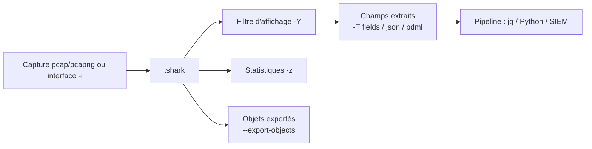

# 🧬 tshark — L'analyse de paquets en ligne de commande

> [!info] **En 1 phrase**
> tshark est la version CLI de Wireshark : le même moteur de décodage, mais scriptable, idéal pour analyser des captures massives ou du trafic live sans interface graphique.

---

## 🧾 Overview

| Champ | Valeur |
|---|---|
| Nom complet | tshark (Terminal Wireshark) |
| Description | Version ligne de commande de Wireshark : dissection de protocoles, filtres d'affichage, extraction de champs, statistiques, export d'objets |
| Catégorie | Réseau & Capture |
| Sous-catégorie | Analyse de paquets (CLI) |
| Fonction principale | Lire/capturer des paquets, les disséquer, extraire des champs et produire des statistiques/rapports |
| Type d'outil | CLI |
| Licence | GPL-2.0-or-later |
| Open source / propriétaire | Open source |
| Langage(s) de programmation | C, C++ (moteur), Lua (dissercteurs/scripts), Python (outillage) |
| Développeur / organisation | The Wireshark Project / Wireshark Foundation |
| Projet officiel | Wireshark (suite comprenant wireshark, tshark, dumpcap, capinfos, editcap, mergecap…) |
| Dépôt officiel | https://gitlab.com/wireshark/wireshark |
| Documentation officielle | https://www.wireshark.org/docs/man-pages/tshark.html |
| Date de création | 1998 (ethereal) ; renommé Wireshark en 2006 |
| État du projet | actif |
| Dernière version connue | 4.6.8 (2026-08-12) ; ancienne stable 4.4.18 ; développement 4.7.2 |
| Systèmes compatibles | Linux, Windows, macOS, BSD |

> [!note] Pour vérifier / compléter
> tshark est distribué avec la suite Wireshark ; le paquet Debian s'appelle `tshark`, le paquet Fedora/RHEL `wireshark-cli`. La liste des protocoles disséqués s'obtient avec `tshark -G protocols`.

---

## 🎯 Concept

tshark embarque **toute la puissance de décodage de Wireshark** — filtres d'affichage, dissection de plus de 3000 protocoles, exports JSON/XML/PSML, statistiques intégrées — dans un binaire scriptable, pipeable et déployable sur serveur. Il lit les `.pcap`/`.pcapng` en batch, extrait des champs précis (`-T fields -e …`), suit des flux TCP, exporte des objets HTTP/SMB/TFTP, génère des statistiques (`-z`) et capture en direct (`-i`). En cybersécurité offensive, c'est l'outil idéal pour **automatiser l'analyse de captures** : extraire des credentials HTTP, cartographier les SNI TLS, retrouver des fichiers exfiltrés ou produire un rapport forensique reproductible. En défense, il trie un gros dump réseau en quelques commandes sans lancer la GUI.

La philosophie de tshark : **deux types de filtres** à ne pas confondre. Le filtre de capture (`-f`) est un BPF appliqué en amont pendant la capture — il définit *ce qui est enregistré*. Le filtre d'affichage (`-Y`) est une expression du langage Wireshark appliquée *après* dissection — il définit *ce qui est affiché/extrait*. Le langage de display filter (`http.request.method == "POST"`, `ip.addr == 10.10.20.15`) est beaucoup plus riche que le BPF car il opère sur des champs disséqués. C'est cette combinaison (capture efficace + extraction structurée) qui rend tshark incontournable en pipeline.



---

## 🧠 Concepts fondamentaux

| Concept | Explication |
|---|---|
| Capture filter (`-f`) | Filtre BPF (comme tcpdump), appliqué pendant la capture avant dissection : `-f 'tcp port 80'` |
| Display filter (`-Y`) | Expression Wireshark appliquée après dissection sur des champs nommés : `-Y 'http.request'` |
| Champ disséqué | Toute information extraite par un dissecteur est adressable : `ip.src`, `tcp.dstport`, `http.host`… |
| Sorties structurées | `-T fields` (champs), `-T json`/`jsonraw`, `-T ek` (JSON + métadonnées), `-T pdml`/`psml` (XML), `-T text` (défaut) |
| Suivi de flux | `-z follow,tcp,raw,<num>` reconstitue le flux TCP numéro N ; variantes `ascii`, `hex`, `json` |
| Statistiques | `-z conv,tcp`, `-z endpoints,ip`, `-z io,phs` (hiérarchie), `-z io,stat,<interval>` |
| Export d'objets | `--export-objects http,<dir>` récupère les fichiers transférés (HTTP, SMB, TFTP, IMF…) |
| SSLKEYLOGFILE | Fichier de clés de session TLS exporté par le navigateur/curl (`SSLKEYLOGFILE=/tmp/keys.log`) pour décrypter le trafic avec `-o tls.keylog_file:` |
| Défauts | `-r cap.pcap` : relire un fichier ; `-i eth0` : capture live ; `-c N` : nombre de paquets ; `-a`/`-b` : autostop/rotation |
| Préférences | Surchargées en ligne de commande par `-o nom: valeur`, ou stockées dans `preferences` (voir `-G folders`) |

---

## 🛠️ Installation

### Debian / Ubuntu / Kali Linux

```bash
sudo apt update && sudo apt install -y tshark
```

### Arch Linux

```bash
sudo pacman -S wireshark-cli
```

### Fedora / RHEL

```bash
sudo dnf install -y wireshark-cli
```

### macOS

```bash
# La formule wireshark inclut tshark
brew install wireshark
```

### Windows

```powershell
choco install wireshark
# tshark.exe se trouve dans C:\Program Files\Wireshark\
# Npcap est requis pour la capture live
```

### Docker

```bash
docker run --rm -it kalilinux/kali-rolling bash -c \
  "apt update && apt install -y tshark && tshark -G protocols | head"
```

### Compilation depuis les sources

```bash
git clone https://gitlab.com/wireshark/wireshark.git && cd wireshark
# Prérequis CMake : Qt6, GLib, libpcap, c-ares, lua
cmake -B build && cmake --build build -j$(nproc)
sudo cmake --install build
```

> [!warning] ⚠️ Prérequis & problèmes potentiels
> - Capture live nécessite root (ou les droits sur l'interface) ; lecture de fichier sans privilège.
> - Sur Debian, la configuration `dumpcap` peut demander des capacités (`cap_net_raw`).
> - Compilation lourde : préférer les paquets binaires pour un usage courant.
> - Windows : ajouter `C:\Program Files\Wireshark` au PATH.

---

## ⚙️ Configuration

tshark lit les préférences de Wireshark (fichier `preferences`, répertoire indiqué par `-G folders`). Les options CLI `-o` permettent une surcharge ponctuelle, pratique pour l'automatisation.

| Paramètre | Rôle | Valeur possible | Impact | Exemple |
|---|---|---|---|---|
| `-o tls.keylog_file:<path>` | Clés de session TLS pour décryptage | chemin du SSLKEYLOGFILE | Décodage du trafic TLS (ou TLS 1.3) | `-o tls.keylog_file:/tmp/keys.log` |
| `-o <pref>:<valeur>` | N'importe quelle préférence (colonnes, décodages…) | voir `-G currentprefs` | Personnalisation sans GUI | `-o tcp.desegment_tcp_streams:TRUE` |
| `SSLKEYLOGFILE` | Variable d'env côté client (curl/firefox) | chemin | Production des clés à capturer/décrypter | `SSLKEYLOGFILE=/tmp/keys.log curl https://exemple.com` |
| `WIRESHARK_SETTINGS_DIR` | Répertoire des réglages | chemin | Profils isolés par projet | `WIRESHARK_SETTINGS_DIR=~/ws-profils` |
| `-G folders` | Liste les emplacements (prefs, plugins, profiles) | — | Diagnostic des chemins | `tshark -G folders` |
| `-G currentprefs` | Dump des préférences actives | — | Audit de configuration | `tshark -G currentprefs` |

---

## 🏗️ Architecture interne

tshark partage le cœur de Wireshark : la **libwiretap** (lecture/écriture des formats de capture : pcap, pcapng, ERF, PcapNG, DCT2000…), le **moteur de dissection** (plusieurs centaines de dissecteurs C/C++ et Lua), et **epan** (champs, display filters, suivis de flux).

- **Lecture** : les paquets arrivent via libpcap (live `-i`) ou libwiretap (fichiers `-r`) ; `-c`, `-a`, `-b` bornent capture et rotation.
- **Dissection** : chaque paquet est décodé couche par couche ; le résultat est un **arbre de champs** (même structure que l'arbre de la GUI). `-V` l'imprime en détail, `-x` ajoute le dump hex.
- **Filtrage d'affichage** : l'expression `-Y` est compilée (ptype + field info) et évaluée sur l'arbre disséqué ; seuls les paquets matcheurs sortent.
- **Extraction** : `-T fields` lit les valeurs des champs demandés (`-e`), sérialisées selon `-E` (séparateur, en-têtes, quote). `-T json` sérialise l'arbre complet.
- **Statistiques** : `-z` charge des « tap » s'abonnant aux champs pendant la dissection (conversations, endpoints, hiérarchie de protocoles, I/O graph, follow streams).
- **Sortie** : texte, JSON, XML (PDML/PSML), champs, ou écriture `-w` d'un sous-ensemble de paquets.

---

## ⌨️ Commandes

### Commandes principales

```bash
tshark [options] [filtre de capture]
```

| Commande | Objectif | Résultat attendu |
|---|---|---|
| `sudo tshark -i eth0 -c 50 -n` | Capturer 50 paquets live | 50 lignes de résumé |
| `tshark -r cap.pcap -Y 'http'` | Filtrer un fichier sur le protocole HTTP | Paquets HTTP uniquement |
| `tshark -r cap.pcap -Y 'http.request' -T fields -e http.host -e http.request.uri` | Extraire hôte + URI des requêtes | Lignes `hôte<TAB>uri` |
| `tshark -r cap.pcap -q -z conv,tcp` | Conversations TCP | Tableau source→dest, paquets, octets |
| `tshark -r cap.pcap -q -z io,phs` | Hiérarchie de protocoles | Fréquence de chaque protocole |
| `tshark -r cap.pcap -Y 'http.response' --export-objects http,./objets/` | Exporter les fichiers téléchargés | Fichiers récupérés sur disque |

### Commandes avancées

```bash
# Suivre un flux TCP complet (numéro 0) en raw
tshark -r cap.pcap -q -z follow,tcp,raw,0

# Décryptage TLS via les clés de session
tshark -r cap.pcap -o tls.keylog_file:/tmp/keys.log -Y 'http' -T fields -e http.host -e http.request.uri

# Capture avec rotation et autostop
sudo tshark -i eth0 -w cap.pcap -b filesize:100000 -b files:10 -a duration:3600
```

---

## 🎚️ Options et flags

| Option | Description | Exemple | Niveau |
|---|---|---|---|
| `-r <fichier>` | Lire un fichier de capture (ou `-` pour stdin) | `tshark -r cap.pcap` | Basic |
| `-i <iface>` | Capture live sur une interface | `tshark -i eth0 -c 100` | Basic |
| `-c <N>` | Arrêter après N paquets | `tshark -r f.pcap -c 50` | Basic |
| `-n` / `-N <opts>` | Pas de résolution de noms / options de résolution | `tshark -n` | Basic |
| `-Y <filtre>` | Filtre d'affichage (display filter) | `-Y 'http'` | Basic |
| `-f <filtre>` | Filtre de capture BPF | `-f 'tcp port 80'` | Intermediate |
| `-T fields` | Sortie par champs extraits | `-T fields -e ip.src` | Intermediate |
| `-e <champ>` | Champ à extraire (répétable) | `-e http.request.uri` | Intermediate |
| `-E <opts>` | Options de formatage fields (header, separator) | `-E header=y -E separator=,` | Intermediate |
| `-T json` / `-T ek` / `-T pdml` / `-T psml` | Formats structurés | `-T json` | Intermediate |
| `-z <stat>` | Statistique intégrée | `-z conv,tcp` | Intermediate |
| `-q` | Mode silencieux (avec `-z`) | `-q -z io,phs` | Intermediate |
| `-V` | Affichage détaillé de l'arbre de dissection | `tshark -r f.pcap -V -Y 'dns'` | Intermediate |
| `-x` | Dump hexadécimal avec l'affichage | `-x -Y 'tcp'` | Intermediate |
| `-w <fichier>` | Écrire les paquets dans un fichier | `tshark -w out.pcap` | Intermediate |
| `-F <format>` | Format d'écriture (pcap, pcapng…) | `-F pcap` | Advanced |
| `-a <autostop>` | Condition d'arrêt (`duration`, `filesize`) | `-a duration:3600` | Advanced |
| `-b <rotation>` | Rotation des fichiers (`filesize`, `files`) | `-b filesize:100000` | Advanced |
| `--export-objects <proto>,<dir>` | Exporter les objets du protocole | `--export-objects http,./x/` | Advanced |
| `-o <pref>:<val>` | Surcharger une préférence | `-o tls.keylog_file:k.log` | Advanced |
| `-G <item>` | Accès au registre interne (`fields`, `protocols`, `folders`) | `tshark -G fields | grep http` | Expert |
| `-L` | Types de liaison disponibles | `tshark -L` | Expert |
| `-X lua_script:<fichier>` | Charger un script Lua | `-X lua_script:mon_analyse.lua` | Expert |

> [!tip] Options les plus utiles au quotidien
> `-r` (lecture), `-Y` (filtre d'affichage), `-T fields -e … -E header=y` (extraction CSV), `-z` (statistiques), `-o tls.keylog_file` (décryptage TLS). Vérifier les noms de champs avec `tshark -G fields | grep <proto>`.

---

## 🧪 Exemples pratiques

### Beginner

```bash
# Aperçu d'un fichier : 20 premiers paquets
tshark -r capture.pcap -c 20 -n

# Isoler un hôte d'intérêt
tshark -r capture.pcap -Y 'ip.addr == 10.10.20.15' -c 100
```

### Intermediate

```bash
# Extraire les requêtes HTTP : hôte + URI
tshark -r capture.pcap -Y 'http.request' -T fields -e http.host -e http.request.uri -E header=y

# Statistiques d'endpoints IP
tshark -r capture.pcap -q -z endpoints,ip
```

### Advanced

```bash
# Cartographier les SNI TLS (canal C2 éventuel)
tshark -r capture.pcap -Y 'tls.handshake.type == 1' -T fields \
  -e ip.src -e tls.handshake.extensions_server_name
```

### Expert

```bash
# Pipeline : DNS suspects → comptage
tshark -r cap.pcap -Y 'dns.qry.name contains "example" && dns.flags.response == 0' \
  -T fields -e ip.src -e dns.qry.name | sort | uniq -c | sort -rn

# Script Lua chargé pour une analyse sur mesure
tshark -r cap.pcap -X lua_script:mon_analyse.lua -Y 'http'
```

---

## 🧪 Workflow complet (scénario pas à pas)

1. **Étape 1 — Aperçu du fichier** — identifier les protocoles dominants :
   ```bash
   tshark -r capture.pcap -c 20 -n
   ```
2. **Étape 2 — Extraire les requêtes HTTP** — hôte + URI de chaque requête :
   ```bash
   tshark -r capture.pcap -Y 'http.request' -T fields -e http.host -e http.request.uri
   ```
3. **Étape 3 — Générer un rapport** — exporter le trafic TLS en JSON :
   ```bash
   tshark -r capture.pcap -Y 'tls' -T json > tls_trafic.json
   ```

---

## 🎬 Scénarios avancés

### Scénario 1 : extraction des credentials HTTP

```bash
# Formulaires POST + paires clé/valeur (logins potentiels)
tshark -r capture.pcap -Y 'http.request.method == "POST"' -T fields \
  -e http.host -e http.request.uri -e urlencoded-form.key -e urlencoded-form.value

# HTTP Basic auth : champ Authorization en clair
tshark -r capture.pcap -Y 'http.authorization' -T fields -e ip.src -e http.authorization
```

### Scénario 2 : extraction des fichiers transférés en HTTP

```bash
# Tous les objets HTTP (fichiers téléchargés) vers un dossier local
tshark -r capture.pcap -Y 'http.response' --export-objects http,./objets_exportes/
```

### Scénario 3 : décryptage TLS avec les clés de session

```bash
export SSLKEYLOGFILE=/tmp/keys.log            # côté client : capturer les clés
curl https://exemple.com/login &
tshark -r capture.pcap -o tls.keylog_file:/tmp/keys.log -Y 'http' \
  -T fields -e http.host -e http.request.uri  # côté analyse : décoder
```

### Scénario 4 : détection d'un canal C2 par DNS

```bash
# Requêtes DNS vers un domaine suspect, triées par fréquence
tshark -r capture.pcap -Y 'dns.qry.name contains "exemple" && dns.flags.response == 0' \
  -T fields -e ip.src -e dns.qry.name | sort | uniq -c | sort -rn
```

---

## 🛡️ Cybersecurity use cases

| Phase | Utilisation |
|---|---|
| Reconnaissance | Cartographie des flux et des services d'un segment à partir d'une capture |
| Énumération | Identification des protocoles/versions via bannières et handshakes (SSH, TLS, HTTP) |
| Exploitation | Vérification des retours de payload, extraction de données échangées |
| Post-exploitation | Exfiltration de fichiers (objets HTTP/SMB), récupération de credentials |
| C2 | Cartographie SNI TLS, détection de beaconing DNS |
| Forensique | Analyse reproductible de grosses captures, génération de rapports JSON/XML |
| Défense | Tri et corrélation des logs réseau, décryptage TLS autorisé (clés de session) |

---

## 🎯 MITRE ATT&CK

| Tactique | Technique / Sub-technique | ID | Raison | Détection | Mitigation |
|---|---|---|---|---|---|
| Discovery | Network Sniffing | T1040 | tshark capture/dissèque le trafic (credentials, flux applicatifs) | Exécution de tshark inattendue, process | Chiffrement, segmentation, 802.1X |
| Collection | Data from Network Shared Drive / Automated Collection | T1119 / T1020 | Extraction en masse de données depuis les captures (export d'objets) | Fichiers exportés en masse, DLP | Chiffrement au repos, quotas |
| Command and Control | Application Layer Protocol | T1071 | Cartographie des SNI/domaines utilisés par le canal C2 | Corrélation DNS/SNI sortants | DNS filtering, egress control |
| Exfiltration | Exfiltration Over C2 Channel / Web Service | T1041 / T1048.003 | Confirmation et mesure des flux d'exfiltration sortants | Volumes sortants anormaux | DLP, proxy, politique egress |

> [!note] Ne renseigner que si l'association est réellement pertinente.
> Comme tcpdump, tshark est d'abord un outil passif (T1040) ; les autres ID dépendent de l'usage malveillant.

---

## 🛡️ Defensive Security

### Signes observables

| Indicateur | Détail |
|---|---|
| Exécution de `tshark`/`wireshark` sur des postes de production | EDR, Sigma sur les commandes, whitelisting |
| Création en masse de fichiers JSON/CSV d'extraction | DLP, surveillance des écritures, exfil HTTP/DNS |
| Capture sur interface en mode promiscuous | Détection `PROMISC`, audit des interfaces |
| Lecture répétée de `.pcap` contenant des données sensibles | Contrôle des accès aux partages de logs, chiffrement au repos |
| Décryptage TLS via clés de session | Gestion stricte des secrets, rotation, TLS 1.3 |

### Règles de détection (Sigma / Suricata / Snort / YARA)

```yaml
# Sigma — Linux : exécution de tshark / dumpcap / wireshark
title: Network Sniffing via tshark (TShark)
id: 7a3c2d5e-9f8b-4c1d-9e2f-0a1b2c3d4e5f
status: experimental
logsource:
    category: process_creation
    product: linux
detection:
    selection:
        Image|endswith:
            - '/tshark'
            - '/wireshark'
            - '/dumpcap'
    condition: selection
falsepositives:
    - Legitimate analysis by blue team or netadmins
level: medium
```

```bash
# Suricata/Snort — exemple pédagogique : volumes anormaux d'un même flux
alert tcp any any -> any any (msg:"High volume data exfiltration signal"; content:"|01 01|"; flow:established; threshold:type both, track by_dst, count 1000, seconds 60; sid:1000002; rev:1;)
```

> [!note] À vérifier
> Signatures d'exemple à calibrer sur le trafic de production pour éviter les faux positifs.

---

## 🤖 Automatisation

```bash
# Bash — analyse quotidienne des captures et rapport des hosts
for f in /var/log/caps/*.pcap; do
  echo "== $f =="
  tshark -r "$f" -T fields -e ip.src -e ip.dst | sort -u
done

```

```python
# Python — lancer tshark, parser le JSON produit
import json, subprocess
out = subprocess.check_output(["tshark", "-r", "capture.pcap",
                               "-Y", "http.request", "-T", "json"])
for pkt in json.loads(out):
    print(pkt["_source"]["layers"])
```

---

## 📤 Output et parsing

tshark produit des sorties très structurées, parfaites pour les pipelines : texte, champs (CSV-like), JSON, EK (JSON pour Elastic), PDML/PSML (XML).

```bash
# Sortie champs → CSV avec en-têtes
tshark -r cap.pcap -Y 'http.request' -T fields \
  -e frame.time -e ip.src -e http.host -e http.request.uri -E header=y -E separator=, > requetes.csv

# Sortie JSON → jq
tshark -r cap.pcap -Y 'dns' -T json | jq -r '.[] | ._source.layers | ."dns.qry.name" // empty' | sort | uniq -c
```

---

## 🔗 Intégrations

- [[Tools|🧰 Outils]] global
- [[Outil - tcpdump]] — capture brute ; tshark analyse les fichiers produits
- [[Outil - Wireshark]] — la GUI partage filtres, préférences et champs avec tshark
- [[Outil - tcpreplay]] — rejoue les captures après analyse/validation
- [[Outil - Zeek]] / [[Outil - Suricata]] / [[Outil - Snort]] — complément d'analyse et de détection
- [[Outil - Scapy]] — forge les paquets dont tshark vérifie la structure
- [[Outil - Hping3]] — génère des sondes ; tshark en découpe les réponses
- [[Outil - Nmap]] — scan actif ; tshark valide le trafic généré

```text
tcpdump -w cap.pcap → tshark (-T json) → jq/Python → rapport / SIEM
tshark -r cap.pcap → Suricata/Zeek → alertes
```

---

## 🔄 Alternatives

| Outil | Avantages | Inconvénients | Cas d'usage |
|---|---|---|---|
| tcpdump | Léger, BPF noyau, présent partout | Dissection limitée, pas de sortie structurée | Capture rapide, systèmes embarqués |
| Wireshark | GUI, suivi de flux visuel, filtres riches | Pas scriptable nativement | Analyse interactive |
| Zeek | Logs sémantiques de connexions, streaming | Déploiement lourd | Supervision continue |
| Scapy | Contrôle total en Python, dissection programmée | Plus lent, apprentissage | Analyse sur mesure |
| tshark (dumpcap pour capture) | Capturer + analyser en un seul outil | Concurrence des ressources sur gros volumes | Workflows tout-en-un |

> **Quand utiliser tcpdump plutôt que tshark ?** Pour une capture légère à fort débit sur un serveur ancien ou embarqué : tcpdump consomme moins de ressources ; on garde tshark pour l'analyse hors-ligne des fichiers.

---

## ⚡ Performance

- **Dissection coûteuse** : sur un gros pcap, `-V` ou `-T json` (arbre complet) sont lents ; privilégier `-T fields` et un `-Y` restrictif.
- **Filtrage précoce** : un filtre de capture `-f` (BPF) évite de disséquer ce qui ne nous intéresse pas.
- **`-n`** : désactiver la résolution de noms accélère sensiblement (DNS et OUI).
- **Statistiques `-z`** : calculées pendant la dissection en un seul passage, bien plus rapides qu'un post-traitement manuel.
- **Multi-fichiers** : lire via `-r -` (stdin) permet de paralléliser avec `xargs -P`.
- **Limites** : la dissection d'un paquet est à peu près aussi coûteuse que dans la GUI ; pour des débits > 1 Gbps, capturer avec dumpcap puis analyser par lots.

> [!note] À vérifier
> Les performances dépendent du nombre de protocoles, de la taille des paquets et du CPU ; mesurer sur ses propres fichiers.

---

## 🛠️ Troubleshooting

### Common problems

#### Problème : champ `-e` inconnu → sortie vide sans erreur

- **Cause** : mauvais nom de champ ou champ absent des paquets filtrés.
- **Solution** : `tshark -G fields | grep <proto>` pour vérifier le nom exact.
- **Vérification** : relancer sans `-e` (sortie texte) pour confirmer que des paquets matchent.

#### Problème : `-Y` et `-f` mélangés

- **Cause** : une syntaxe BPF passée à `-Y` (ou l'inverse) ne matche rien.
- **Solution** : `-f` = BPF (capture), `-Y` = display filter (après dissection).
- **Vérification** : `tshark -r f.pcap -f 'tcp port 80'` n'affiche rien sur un pcap enregistré (BPF live uniquement) ; utiliser `-Y 'tcp.port == 80'`.

#### Problème : le TLS ne se décrypte pas

- **Cause** : clés absentes, mauvaise session, TLS 1.3 incomplet.
- **Solution** : vérifier `SSLKEYLOGFILE` côté client et `-o tls.keylog_file:` côté tshark ; `tls.handshake.type == 1` pour confirmer que les ClientHello sont capturés.
- **Vérification** : `tshark -r f.pcap -o tls.keylog_file:keys.log -Y 'http'` doit produire des lignes HTTP.

#### Problème : capture live sans privilèges

- **Cause** : permissions sur l'interface ou dumpcap non-capable.
- **Solution** : `sudo tshark …` ou configurer les capabilities de dumpcap.
- **Vérification** : `sudo tshark -i lo -c 5`.

---

## 🔐 Sécurité de l'outil

- **Privilèges** : la capture live exige root/capabilities ; lire un fichier, non.
- **Données sensibles** : les exports (`--export-objects`, `-T json`) matérialisent des données (fichiers, credentials, cookies) — stockage chiffré et accès restreint.
- **Télémétrie** : aucune ; mais la résolution de noms (`-n` oublié) déclenche des requêtes DNS observables.
- **Décryptage TLS** : possible uniquement avec les clés de session ; ne jamais laisser traîner un SSLKEYLOGFILE non protégé.
- **Scripts Lua** : un `-X lua_script` exécute du code arbitraire — ne charger que des scripts de confiance.
- **Traces** : l'exécution de tshark sur un endpoint est détectable (process, EDR, logs).

---

## ⚠️ Limitations

- Pas de GUI : le suivi de flux visuel et l'édition de filtres interactifs sont moins confortables.
- `-T fields` ne sort que les champs demandés ; `-T json` est verbeux et lourd sur gros fichiers.
- Le décryptage TLS ne fonctionne que si les clés ont été exportées (pas de cassage).
- Certaines fonctionnalités avancées de la GUI (profiles, coloring rules) nécessitent des préférences `-o` verbeuses.
- La capture live est moins optimisée que dumpcap pour les très hauts débits.
- La vérification des noms de champs est fastidieuse (mais `-G fields` aide).

---

## 📋 Cheatsheet

```bash
# Aperçu rapide
tshark -r cap.pcap -c 20 -n

# Filtres d'affichage essentiels
tshark -r cap.pcap -Y 'http.request'
tshark -r cap.pcap -Y 'ip.addr == 10.10.20.15'
tshark -r cap.pcap -Y 'tcp.port == 4444'
tshark -r cap.pcap -Y 'dns.qry.name contains "exemple"'

# Extraction de champs
tshark -r cap.pcap -Y 'http.request' -T fields -e http.host -e http.request.uri -E header=y

# Statistiques
tshark -r cap.pcap -q -z conv,tcp
tshark -r cap.pcap -q -z endpoints,ip
tshark -r cap.pcap -q -z io,phs

# Suivre un flux
tshark -r cap.pcap -q -z follow,tcp,raw,0

# Exporter des objets
tshark -r cap.pcap -Y 'http.response' --export-objects http,./objets/

# Décryptage TLS
tshark -r cap.pcap -o tls.keylog_file:/tmp/keys.log -Y 'http'

# Capture live
sudo tshark -i eth0 -c 100 -n
```

---

## ⚡ Quick reference

| | |
|---|---|
| **À quoi sert-il ?** | Analyser des captures (et capturer) en CLI : dissection, extraction de champs, statistiques |
| **Quand l'utiliser ?** | Dès qu'une analyse de trafic doit être automatisée ou exécutée sur serveur |
| **Commande principale** | `tshark -r cap.pcap -Y 'http' -T fields -e http.host -e http.request.uri` |
| **Alternative principale** | tcpdump (capture légère), Wireshark (GUI), Zeek (supervision) |
| **Concepts importants** | display filter vs capture filter, `-T fields`, `-z`, export d'objets, SSLKEYLOGFILE |
| **Liens associés** | [[Outil - Wireshark]] · [[Outil - tcpdump]] · [[Outil - tcpreplay]] · [[Outil - Zeek]] |

---

## 🔍 Détection & Défense

| Signe | Défense |
|---|---|
| Exécution de `tshark`/`dumpcap` sur des postes sensibles | EDR + Sigma, whitelisting, restriction sudo |
| Création en masse de fichiers JSON/CSV d'extraction | DLP, supervision des écritures, egress control |
| Capture promiscuous non autorisée | Détection `PROMISC`, audit des interfaces |
| Lecture répétée de `.pcap` sensibles | Contrôle des accès, chiffrement au repos |
| Décryptage TLS via clés volées | Gestion stricte des secrets, rotation, TLS 1.3 |

---

## ⚠️ Tips & Pièges

> [!tip] 💡 **Tips**
> - Vérifier les noms de champs avec `tshark -G fields | grep <proto>` avant d'écrire un pipeline.
> - Combiner `-T fields` avec `-E header=y -E separator=,` pour un CSV directement exploitable.
> - Utiliser `-z io,phs` pour découvrir les protocoles présents dans une capture inconnue.
> - Sur de gros fichiers, pré-filtrer en amont (`-f` pour une capture, un `-Y` strict sinon) et utiliser `-n`.

> [!warning] ⚠️ **Pièges**
> - Un mauvais champ `-e` produit une sortie vide **sans erreur** : toujours vérifier avec `-G fields`.
> - `-Y` s'applique après dissection : sur un fichier volumineux, c'est plus lent qu'un pré-filtrage `-f`.
> - `-z follow,tcp,raw,<n>` exige le bon numéro de flux ; le retrouver avec `-z conv,tcp`.
> - Le décryptage TLS ne « casse » rien : sans clés de session, rien ne sera décodé.
> - Sur Windows, penser à ajouter le dossier Wireshark au PATH avant d'automatiser.

---

## 📚 References

### Official

- Man page tshark : https://www.wireshark.org/docs/man-pages/tshark.html
- Wiki Wireshark — outils en ligne de commande : https://wiki.wireshark.org/TShark
- Documentation des display filters : https://www.wireshark.org/docs/wsug_html_chunked/ChWorkDisplayFilterSection.html
- Dépôt officiel : https://gitlab.com/wireshark/wireshark
- Téléchargements : https://www.wireshark.org/download.html

### Security references

- MITRE ATT&CK T1040 — Network Sniffing : https://attack.mitre.org/techniques/T1040/
- MITRE ATT&CK T1071 — Application Layer Protocol : https://attack.mitre.org/techniques/T1071/
- MITRE ATT&CK T1041 — Exfiltration Over C2 Channel : https://attack.mitre.org/techniques/T1041/
- OWASP — Web Security Testing Guide : https://owasp.org/www-project-web-security-testing-guide/

### Community

- Wireshark Capture Setup (permissions, promiscuous) : https://wiki.wireshark.org/CaptureSetup
- HackTricks — tshark cheatsheet : https://book.hacktricks.xyz/generic-methodologies-and-resources/basic-forensic-methodology/pcap-inspection

---

➡️ **Liens :** [[Tools|🧰 Outils]] · [[Outil - Wireshark|Wireshark]] · [[Outil - tcpdump|tcpdump]] · [[Outil - tcpreplay|tcpreplay]] · [[Outil - Zeek|Zeek]]
