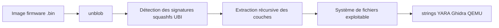
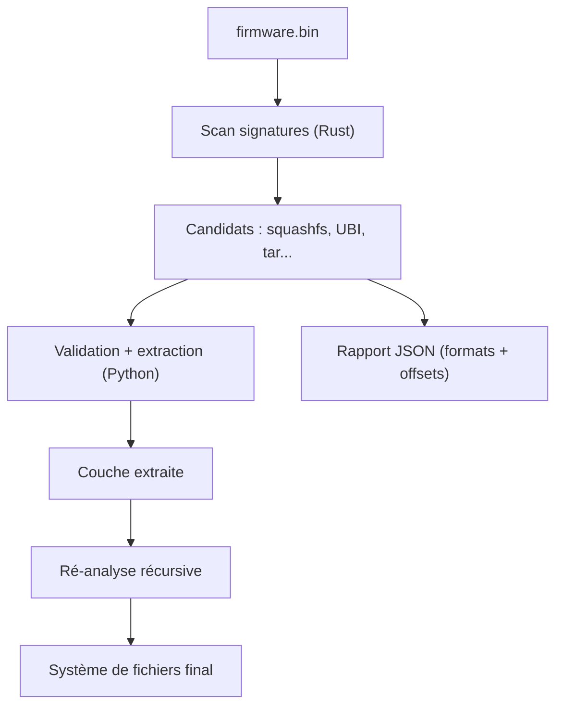

# unblob — Extraction automatique de firmware

> [!info] **En 1 phrase**
> unblob est l'outil le plus précis pour identifier et extraire les systèmes de fichiers et archives embarqués dans une image de firmware, étape indispensable avant l'analyse de tout binaire IoT.

---

## Overview

| Champ | Valeur |
|---|---|
| Nom complet | unblob |
| Description | Extracteur de firmware open-source : recherche de signatures, identification des formats (squashfs, UBI/UBIFS, cramfs, JFFS2, ext, btrfs, archives), extraction récursive de toutes les couches d'une image |
| Catégorie | Malware & Sandbox |
| Sous-catégorie | Analyse de firmware IoT — extraction de systèmes de fichiers |
| Fonction principale | Extraire automatiquement toutes les couches et systèmes de fichiers d'une image de firmware |
| Type d'outil | CLI (Python + cœur Rust) + rapport JSON |
| Licence | AGPL-3.0 (à vérifier sur le dépôt) |
| Open source / propriétaire | Open source |
| Langage(s) de programmation | Python 3 (orchestration), Rust (moteur de recherche de signatures) |
| Développeur / organisation | OneKey (onekey-sec) et la communauté |
| Projet officiel | onekey-sec/unblob |
| Dépôt officiel | https://github.com/onekey-sec/unblob |
| Documentation officielle | https://unblob.org/ |
| Date de création | 2021 (première release) |
| État du projet | actif (développement continu, ~2 400 étoiles) |
| Dernière version connue | (dernière release à confirmer sur le dépôt) |
| Systèmes compatibles | Linux (recommandé), macOS, Windows via WSL2/Docker |

> [!note] À vérifier
> La dernière version exacte se confirme sur la page Releases du dépôt ou PyPI. unblob est un projet actif : le nombre d'étoiles et les commits évoluent rapidement.

---

## Concept

unblob est un extracteur de firmware open-source (OneKey) : il analyse une image binaire (routeur, caméra, box, capteur), identifie les formats par signatures — squashfs, UBI/UBIFS, cramfs, JFFS2, ext, btrfs, archives ZIP/tar, blobs de bootloader — et extrait chaque couche récursivement dans une arborescence complète. Son moteur de recherche de signatures est plus robuste que binwalk : il gère les offsets non alignés, les entêtes obfusqués et les versions récentes de squashfs, ce qui en fait l'outil de premier choix du reverse engineer IoT.

Il se place au tout début de la chaîne d'analyse de firmware : après identification grossière (`file`, `binwalk`), unblob produit le système de fichiers réel (binaires des services, scripts de démarrage, certificats, clés) sur lequel on applique ensuite les techniques statiques (strings, YARA, Ghidra) et dynamiques (émulation avec QEMU). C'est un standard dans les SOC/équipes de vuln pour la collecte d'IOCs et la recherche de backdoors, ainsi que pour le triage de malwares multi-couches (les droppers s'appuient souvent sur des archives imbriquées).



---

## Concepts fondamentaux

| Concept | Explication |
|---|---|
| Firmware | Image binaire embarquée dans un appareil (routeur, caméra, capteur) ; contient bootloader, kernel et système de fichiers |
| Signature de format | Marqueur binaire (magic bytes, superblock) identifiant un type de conteneur (squashfs `hsqs`, UBI, cramfs) |
| Squashfs | Système de fichiers compressé en lecture seule, dominant dans les firmwares Linux embarqués |
| UBI/UBIFS | Couche de gestion des flash NAND et son système de fichiers, fréquent sur les appareils récents |
| Cramfs / JFFS2 / ext / btrfs | Autres systèmes de fichiers embarqués pris en charge |
| Bootloader (U-Boot) | Premier programme de démarrage ; il peut contenir clés, config de partition et offset des couches |
| Extraction récursive | unblob extrait les couches, puis les ré-analyses en cascade jusqu'à épuisement des formats |
| Offset non aligné | Position d'un conteneur qui ne commence pas à une frontière de secteur ; binwalk échoue souvent, unblob gère |
| Partition chiffrée | Couche non extractible sans la clé ; celle-ci est souvent dans le bootloader ou les scripts de démarrage |
| Rapport JSON | Sortie structurée : formats détectés, offsets, chemins des fichiers extraits — pour les pipelines |

---

## Installation

Installation via pip (Linux recommandé) ou via Docker :

```bash
# Linux (dépendances compilées nécessaires : python3-dev, build-essential)
pip install unblob
unblob --version

# Via Docker (aucune dépendance locale à gérer)
docker pull unblob/unblob:latest
docker run --rm -it -v "$(pwd):/data" unblob/unblob:latest /data/firmware.bin

# Windows / macOS : passer par WSL2 ou le conteneur Docker (pas de binaire natif fiable)
```

Il s'appuie sur des outils externes (sasquatch, jefferson, binwalk) que le paquet installe ou qui sont pré-packagés dans l'image Docker ; sur Debian/Ubuntu, `apt install binwalk` complète certaines signatures.

> [!warning] Prérequis & problèmes potentiels
> - **Dépendances compilées** : l'installation pip requiert des outils de compilation (`python3-dev`, `build-essential`, libmagic).
> - **Outils externes** : sasquatch, jefferson et binwalk sont requis pour certains formats ; l'image Docker les inclut.
> - **Espace disque** : l'extraction de gros firmwares peut produire des arborescences très volumineuses.
> - **Plateforme** : Linux est recommandé ; Windows passe par WSL2 ou Docker.

---

## Configuration

unblob se configure principalement via les options CLI ; un fichier de config YAML est possible pour les réglages avancés :

| Paramètre | Rôle | Valeur possible | Impact | Exemple |
|---|---|---|---|---|
| `-e, --extract-dir` | Dossier de sortie | chemin | Où sont extraits les fichiers | `-e ./out` |
| `-v, --verbose` | Logs verbeux | flag | Affiche les formats détectés | `-v` |
| `-l, --log <niveau>` | Niveau de log | `DEBUG`, `INFO`, `WARNING`, `ERROR` | Granularité des logs | `-l DEBUG` |
| `-d, --depth <n>` | Profondeur de récursion | entier | Évite les boucles infinies | `-d 10` |
| `--report <fichier>` | Rapport JSON | chemin | Sortie structurée | `--report r.json` |
| `-p, --processes <n>` | Extraction parallèle | entier | Vitesse vs ressources | `-p 4` |
| `--force` | Forcer l'extraction douteuse | flag | Passe outre les heuristiques | `--force` |

> [!note] À vérifier
> La liste exacte des options évolue ; `unblob --help` reste la référence fiable pour la version installée.

---

## Architecture interne

- **Moteur de recherche de signatures (Rust)** : scan rapide du binaire pour localiser les candidats (superblocks, magic bytes) — le point fort face à binwalk.
- **Extracteurs (Python)** : un module par format (squashfs, ubi, cramfs, jffs2, ext, btrfs, archives…) qui valide le candidat et extrait la couche.
- **Orchestrateur** : boucle récursive — chaque couche extraite est ré-analysée jusqu'à épuisement des formats ou atteinte de la profondeur maximale.
- **Rapport JSON** : liste des formats détectés, offsets, chemins — généré en parallèle de l'extraction.
- **Intégrations** : API Python utilisable en bibliothèque pour les pipelines (CI, SOC).



---

## Commandes

### Commandes principales

```bash
unblob firmware.bin                    # extraction dans unblob_firmware.bin_extract
unblob -e ./extracted firmware.bin     # dossier de sortie explicite
unblob -v firmware.bin                 # logs verbeux pour suivre les formats détectés
unblob --report report.json -e ./out firmware.bin   # rapport JSON des extractions
```

| Option | Effet |
|---|---|
| `-e, --extract-dir <dir>` | Répertoire de sortie des fichiers extraits |
| `-v, --verbose` | Affiche les détails des signatures détectées |
| `-l, --log <niveau>` | Niveau de log (`DEBUG`, `INFO`, `WARNING`) |
| `-d, --depth <n>` | Limite la profondeur de récursion (anti-boucle) |
| `--report <fichier>` | Génère un rapport JSON des extractions |
| `-p, --processes <n>` | Nombre de processus pour l'extraction parallèle |
| `--force` | Force l'extraction même sur des entrées douteuses |

### Commandes avancées

```bash
# Extraction avec profondeur limitée (anti-boucle) et parallélisme
unblob -e ./out -d 10 -p 4 firmware.bin
# Rapport JSON pour pipeline
unblob --report artifacts.json -e ./out firmware.bin
jq -r '.files[] | select(.format=="squashfs") | .path' artifacts.json
```

---

## Options et flags

| Option | Description | Exemple | Niveau |
|---|---|---|---|
| `-e, --extract-dir` | Dossier de sortie | `unblob -e ./out fw.bin` | Basic |
| `-v, --verbose` | Logs verbeux | `unblob -v fw.bin` | Basic |
| `-l, --log` | Niveau de log | `unblob -l DEBUG fw.bin` | Intermediate |
| `-d, --depth` | Profondeur max de récursion | `unblob -d 10 fw.bin` | Intermediate |
| `--report` | Rapport JSON | `unblob --report r.json fw.bin` | Intermediate |
| `-p, --processes` | Extraction parallèle | `unblob -p 4 fw.bin` | Intermediate |
| `--force` | Forcer l'extraction douteuse | `unblob --force fw.bin` | Advanced |
| `-u, --unpack-all` | Ne pas sauter les formats non prioritaires | `unblob -u fw.bin` | Expert |

> [!tip] Options les plus utiles au quotidien
> `-e ./out` (sortie propre), `-v` (suivre les formats), `--report` (JSON pour pipeline), `-d 10` (éviter les boucles), `-p 4` (paralléliser).

---

## Exemples pratiques

### Beginner

```bash
# 1. Identification grossière
file firmware.bin
ls -lh firmware.bin
binwalk firmware.bin 2>/dev/null | head -30
# 2. Extraction simple
unblob -e ./fw_extracted firmware.bin
# 3. Explorer l'arborescence
find ./fw_extracted -maxdepth 4 -type d
```

### Intermediate

```bash
# Extraction verbeuse pour suivre les couches
unblob -v -e ./fw_extracted firmware.bin
# Cibler les binaires de services réseau
find ./fw_extracted -type f \( -name "httpd" -o -name "telnetd" -o -name "*.key" \) -exec ls -la {} \;
```

### Advanced

```bash
# Recherche de credentials en clair
grep -rEi "password|passwd|root:" ./fw_extracted/etc/ 2>/dev/null
grep -r "BEGIN RSA PRIVATE KEY" ./fw_extracted/ 2>/dev/null
# Analyse statique d'un binaire extrait
strings ./fw_extracted/*/usr/sbin/httpd | grep -i "password\|root\|admin"
```

### Expert

```bash
# Partition chiffrée : chercher la clé dans le bootloader
unblob -e ./enc_part --report partition.json partition.bin
strings ./fw_extracted/*/u-boot.bin | grep -i aes
strings ./fw_extracted/*/u-boot.bin | grep -i ubifs
```

---

## Workflow complet (scénario pas à pas)

1. **Identifier grossièrement l'image** — confirmer que c'est bien un firmware et repérer la taille.

   ```bash
   file firmware.bin
   ls -lh firmware.bin
   binwalk firmware.bin 2>/dev/null | head -30
   ```

2. **Extraire toutes les couches** — lancer unblob en mode verbeux pour suivre les formats trouvés.

   ```bash
   unblob -v -e ./fw_extracted firmware.bin
   ```

3. **Explorer l'arborescence** — vérifier la structure du système de fichiers (squashfs monté, partitions UBI).

   ```bash
   find ./fw_extracted -maxdepth 4 -type d
   ```

4. **Cibler les binaires intéressants** — chercher les services réseau (`httpd`, `telnetd`), les scripts de boot et les secrets.

   ```bash
   find ./fw_extracted -type f \( -name "httpd" -o -name "telnetd" -o -name "*.key" \) -exec ls -la {} \;
   ```

5. **Analyser les artefacts** — strings, YARA, Ghidra sur les binaires extraits, ou émulation partielle sous QEMU.

   ```bash
   strings ./fw_extracted/*/usr/sbin/httpd | grep -i "password\|root\|admin"
   ```

---

## Scénarios avancés

### Scénario 1 : Recherche de backdoors et de mots de passe par défaut

Après extraction, grep global sur les credentials et les clés privées — classique sur les firmware de caméras IoT.

```bash
grep -rEi "password|passwd|root:" ./fw_extracted/etc/ 2>/dev/null
grep -r "BEGIN RSA PRIVATE KEY" ./fw_extracted/ 2>/dev/null
grep -rEi "telnetd|dropbear|busybox.*nc" ./fw_extracted/etc/init.d/ 2>/dev/null
```

### Scénario 2 : Partition chiffrée ou encodée

Si une partition est illisible (UBI chiffré ou offset décalé), forcer le format et croiser avec le bootloader :

```bash
unblob -e ./enc_part --report partition.json partition.bin
# rechercher les clés AES/ubifs dans le bootloader extrait
strings ./fw_extracted/*/u-boot.bin | grep -i aes
strings ./fw_extracted/*/u-boot.bin | grep -i ubifs
```

### Scénario 3 : Comparaison de firmware (détection d'altération supply-chain)

Extraire le firmware officiel et une image suspecte, puis diff les deux arborescences.

```bash
unblob -e ./ofw official.bin
unblob -e ./sfw suspect.bin
diff -rq ./ofw ./sfw | head -50
# Chercher les binaires en plus (backdoor) et les fichiers modifiés (timestamps, taille)
```

### Scénario 4 : Alimenter un pipeline d'analyse automatique

```bash
unblob --report artifacts.json -e ./fw_extracted firmware.bin
# Le JSON liste formats détectés, offsets et chemins ; le consommer avec jq
jq -r '.files[] | select(.format=="squashfs") | .path' artifacts.json
```

### Scénario 5 : Analyse d'un malware multi-couches (dropper à archives imbriquées)

```bash
unblob -v -e ./dropper extracted.bin
# Retrouver le fichier final et l'analyser
find ./dropper -type f -exec file {} \; | grep -iE "PE32|ELF"
sha256sum $(find ./dropper -type f -name "*.exe")
```

---

## Cybersecurity use cases

| Phase | Utilisation |
|---|---|
| Analyse de firmware IoT | Extraction du système de fichiers pour l'analyse statique |
| Recherche de vulnérabilités | Récupération des binaires à fuzzer/auditer (httpd, services) |
| Supply-chain | Comparaison de firmwares pour détecter des altérations |
| Analyse de malware | Extraction de droppers multi-couches |
| CTI | Collecte d'IOCs (chemins, binaires, clés) depuis les firmwares |
| Red team | Identification des services et backdoors par défaut des appareils |

---

## MITRE ATT&CK

| Tactique | Technique / Sub-technique | ID | Raison | Détection | Mitigation |
|---|---|---|---|---|---|
| Initial Access | Exploitation via un équipement réseau | T0869 | Les vulns firmware (httpd, services) sont le vecteur d'accès aux IoT | NDR, patching | Mises à jour constructeur |
| Execution | Command and Scripting Interpreter | T1059 | Backdoors/telnetd découverts dans les firmwares | EDR, NDR | Désactivation des services superflus |
| Persistence | Create or Modify System Process : Windows Service | T1543.003 | Services/boot scripts malveillants repérés dans le système de fichiers | Sysmon, analyse firmware | Contrôles d'intégrité |
| Credential Access | Unsecured Credentials | T1552 | Mots de passe et clés en clair dans le firmware extrait | Scan du firmware | Rotation des secrets, HSM |
| Defense Evasion | Deobfuscate/Decode Files or Information | T1140 | Partitions chiffrées à déchiffrer via les clés du bootloader | Analyse statique | Séparation des clés de production |
| Initial Access | Hardware Additions | T1200 | Backdoors matériels/supply-chain détectés par comparaison d'images | Comparaison de hash | Chaîne d'approvisionnement sécurisée |

> [!note] Ne renseigner que si l'association est réellement pertinente.
> unblob est un **outil d'extraction** : les techniques listées sont celles que l'on recherche/exploite dans les firmwares analysés, pas des techniques mises en œuvre par l'outil.

---

## Defensive Security

### Signes observables

| Indicateur | Détail |
|---|---|
| Binaires non signés ou clés embarquées dans le firmware | Renforcer la chaîne de démarrage sécurisée (Secure Boot, signatures U-Boot) |
| Backdoor netcat/reverse shell ou telnetd exposé | Bloquer les ports en entrée, désactiver les services superflus |
| Credentials par défaut en clair (root/admin) | Forcer le changement de mot de passe à la première connexion |
| Diffs avec le firmware officiel (composant supplémentaire) | Comparer les images avec `cmp`/hash pour détecter une altération supply-chain |
| Binaire `httpd` vulnérable (stack overflow classique) | Appliquer les patchs constructeur, activer ASLR/NX si supporté |
| Clés de chiffrement embarquées dans le bootloader | Séparer les clés de production, HSM, rotation des secrets |

### Règles de détection (Sigma / Suricata / Snort / YARA)

```yaml
# YARA — repérage de mots de passe par défaut dans un système de fichiers extrait (exemple)
rule Firmware_Default_Credentials
{
    strings:
        $a = "root:admin" ascii wide
        $b = "password=1234" ascii wide
        $c = "user:root" ascii wide
    condition:
        any of them
}
```

```bash
# Suricata/Snort — alerte sur un accès telnetd depuis le réseau d'un appareil IoT
alert tcp any any -> any 23 (msg:"Potential IoT telnet access"; sid:9500004; rev:1;)
```

---

## Automatisation

```bash
# Bash — extraction en lot et collecte des artefacts
for fw in /opt/firmwares/*.bin; do
    base=$(basename "$fw" .bin)
    unblob --report "/opt/out/$base.json" -e "/opt/out/$base" "$fw"
    jq -r '.files[] | select(.format=="squashfs") | .path' "/opt/out/$base.json" >> /opt/out/all.txt
done
sort -u /opt/out/all.txt -o /opt/out/all.txt
```

```python
# Python — API unblob pour un pipeline CI
import unblob
from unblob import extract

result = extract.extract_with_multiprocessing(
    "firmware.bin",
    extract_root="/data/out",
)
for report in result.reports:
    print(report.format, report.start_offset, report.path)
```

> [!note] À vérifier
> L'API Python d'unblob évolue entre versions ; l'exemple ci-dessus est un squelette à adapter à la documentation de la version installée.

---

## Output et parsing

- **Arborescence extraite** : les fichiers et systèmes de fichiers dans `-e <dir>` (souvent `unblob_<nom>_extract`).
- **Rapport JSON** (`--report`) : formats détectés, offsets, chemins — pour les pipelines.
- **Logs** : niveaux DEBUG/INFO/WARNING pour suivre les formats et les erreurs.

```bash
# Lister les formats détectés
jq -r '.files[].format' artifacts.json | sort -u
# Lister les chemins extraits pour un format donné
jq -r '.files[] | select(.format=="squashfs") | .path' artifacts.json
```

```python
# Python — parsing du rapport JSON
import json

with open("artifacts.json") as f:
    data = json.load(f)

for f in data.get("files", []):
    print(f.get("format"), f.get("start_offset"), f.get("path"))
```

---

## Intégrations

- [[Tools| Outils]] global
- [[Outil - binwalk]] — complément pour les signatures que l'un ou l'autre manque
- [[Outil - Ghidra]] — analyse statique des binaires extraits
- [[Outil - Cutter]] — alternative GUI (radare2) pour l'analyse des binaires
- [[Outil - YARA]] — signatures sur les fichiers et systèmes de fichiers extraits
- [[Outil - Flare VM]] — environnement Windows complémentaire (si besoin d'analyser des payloads Windows extraits)
- [[09 - Reverse Engineering & Malware| Reverse Engineering & Malware]]

```text
Firmware → unblob (extraction) → système de fichiers → strings + YARA + Ghidra + QEMU → IOCs
```

---

## Alternatives

| Outil | Avantages | Inconvénients | Cas d'usage |
|---|---|---|---|
| binwalk | Historique, large couverture, signatures | Plus de faux positifs, squashfs 4.x récent mal géré | Identification rapide |
| Firmware Mod Kit | Scripts prêts à l'emploi | Moins maintenu, extraction moins robuste | Reconstruire un firmware |
| sasquatch | Squashfs étendus (non standard) | Un seul format | Squashfs custom |
| jefferson | JFFS2 complet | Un seul format | JFFS2 |
| Extractor (Binwalk wrapper) | Automatisation de binwalk | Dépend de binwalk | Lot de firmwares |

> **Quand utiliser unblob plutôt que binwalk ?** Presque toujours : unblob est plus précis (moins de faux positifs), gère les offsets non alignés et les squashfs/UBI récents. Garder binwalk en complément pour les formats non couverts.

---

## Performance

- Le scan de signatures (Rust) est très rapide : de l'ordre de la seconde par Go de firmware.
- L'extraction parallèle (`-p N`) accélère les gros lots sur les machines multi-cœurs.
- La récursion peut générer de très grandes arborescences : surveiller l'espace disque.
- Le rapport JSON est généré en temps réel : utilisable pendant l'extraction.
- Docker ajoute une surcharge légère mais garantit les dépendances complètes.

---

## Troubleshooting

### Common problems

#### Problème : aucun format détecté

- **Cause** : image chiffrée, offset inhabituel ou format non couvert.
- **Solution** : lancer avec `-l DEBUG`, croiser avec binwalk, chercher les clés dans le bootloader.
- **Vérification** : `unblob -l DEBUG -e ./out firmware.bin` montre les candidats examinés.

#### Problème : la boucle de récursion sature le disque

- **Cause** : liens circulaires ou archives imbriquées infinies.
- **Solution** : limiter `-d <profondeur>`.
- **Vérification** : `du -sh ./out` après une exécution bornée.

#### Problème : erreur sur les dépendances (sasquatch, jefferson)

- **Cause** : outils externes absents ou trop anciens.
- **Solution** : utiliser l'image Docker (`unblob/unblob:latest`) qui les inclut.
- **Vérification** : `unblob --version` puis une extraction test sur un firmware de démo.

#### Problème : les répertoires system (dev, proc) sont vides

- **Cause** : comportement normal — unblob ne crée pas les pseudo-systèmes de fichiers.
- **Solution** : aucun ; ce n'est pas un échec d'extraction.
- **Vérification** : les fichiers de configuration et binaires sont bien présents.

#### Problème : partition UBI illisible

- **Cause** : décalage, chiffrement ou absence du support UBI.
- **Solution** : forcer avec `--force`, extraire d'abord le bootloader pour trouver les offsets.
- **Vérification** : `strings <bootloader>.bin | grep -i ubi`.

---

## Sécurité de l'outil

- **Isolation** : les firmwares peuvent contenir du code malveillant — travailler dans un conteneur Docker ou une VM.
- **Ne pas exécuter** : ne pas exécuter les binaires extraits sur la machine hôte ; utiliser QEMU/sandbox.
- **Artefacts** : les systèmes de fichiers extraits peuvent contenir des secrets (clés, credentials) — les protéger.
- **Origine** : installer via PyPI officiel ou l'image Docker officielle (unblob/unblob).
- **Supply-chain** : comparer les images extraites avec des références fiables avant utilisation.

---

## Limitations

- Les partitions chiffrées ou encodées ne s'extraient pas sans la clé (à chercher dans le bootloader).
- Certains formats propriétaires ou custom (squashfs étendus) nécessitent sasquatch ou du travail manuel.
- Les répertoires système (dev, proc) restent vides par conception.
- La récursion infinie (liens circulaires) peut boucler sans limite de profondeur.
- Le diff de gros firmwares est coûteux : privilégier les hash avant la comparaison fine.
- Windows natif non supporté officiellement (WSL2/Docker requis).

---

## Cheatsheet

```bash
# Extraction simple
unblob firmware.bin

# Extraction dans un dossier précis
unblob -e ./extracted firmware.bin

# Extraction verbeuse
unblob -v -e ./extracted firmware.bin

# Rapport JSON
unblob --report report.json -e ./extracted firmware.bin

# Limiter la profondeur (anti-boucle)
unblob -d 10 -e ./extracted firmware.bin

# Extraction parallèle
unblob -p 4 -e ./extracted firmware.bin

# Lister les formats détectés
jq -r '.files[].format' report.json | sort -u

# Trouver les binaires de services
find ./extracted -type f \( -name "httpd" -o -name "telnetd" \) -exec ls -la {} \;

# Grep des credentials
grep -rEi "password|root:" ./extracted/etc/ 2>/dev/null

# Comparer deux firmwares
diff -rq ./ofw ./sfw | head -50
```

---

## Quick reference

| | |
|---|---|
| **À quoi sert-il ?** | Extraire automatiquement les systèmes de fichiers et archives d'une image de firmware |
| **Quand l'utiliser ?** | Dès qu'une image IoT/embarquée doit être analysée (binaires, configs, secrets) |
| **Commande principale** | `unblob -e ./extracted firmware.bin` |
| **Alternative principale** | binwalk (identification) · Firmware Mod Kit (reconstruction) |
| **Concepts importants** | Signatures, squashfs, UBI/UBIFS, extraction récursive, rapport JSON |
| **Liens associés** | [[Outil - binwalk]] · [[Outil - Ghidra]] · [[Outil - YARA]] |

---

## Détection & Défense

| Signe | Défense |
|---|---|
| Binaires non signés ou clés embarquées dans le firmware | Renforcer la chaîne de démarrage sécurisée (Secure Boot, signatures U-Boot) |
| Backdoor netcat/reverse shell ou telnetd exposé | Bloquer les ports en entrée, désactiver les services superflus |
| Credentials par défaut en clair (root/admin) | Forcer le changement de mot de passe à la première connexion |
| Diffs avec le firmware officiel (composant supplémentaire) | Comparer les images avec `cmp`/hash pour détecter une altération supply-chain |
| Binaire `httpd` vulnérable (stack overflow classique) | Appliquer les patchs constructeur, activer ASLR/NX si supporté |
| Clés de chiffrement embarquées dans le bootloader | Séparer les clés de production, HSM, rotation des secrets |

---

## Tips & Pièges

> [!tip] **Tips**
> - Préférez unblob à binwalk pour les firmware récents : il gère les squashfs 4.x et UBI avec bien moins de faux positifs.
> - Utilisez `--report` pour générer un JSON qui alimente vos pipelines d'analyse automatique.
> - Chaînez toujours unblob → binwalk → analyse statique : les couches peuvent contenir des archives imbriquées que seul un des deux détecte.
> - Travaillez dans un conteneur Docker pour isoler les artefacts malveillants de votre machine.

> [!warning] **Pièges**
> - Les partitions chiffrées ou encodées ne s'extraient pas sans la clé : cherchez-la dans le bootloader avant de conclure.
> - Les répertoires système (dev, proc) restent vides par conception, ce n'est pas un échec d'extraction.
> - Une image avec récursion infinie (liens circulaires) peut boucler : limitez `-d` pour éviter de saturer le disque.
> - Ne pas exécuter les binaires extraits sur la machine hôte : les analyser dans un environnement isolé (QEMU/sandbox).
> - `diff -rq` sur de gros firmwares est coûteux : comparer d'abord les hash (sha256sum) des fichiers identiques par nom.

---

## References

### Official

- Dépôt GitHub officiel : https://github.com/onekey-sec/unblob
- Site et documentation : https://unblob.org/
- PyPI unblob : https://pypi.org/project/unblob/

### Security references

- MITRE ATT&CK T1552 — Unsecured Credentials : https://attack.mitre.org/techniques/T1552/
- MITRE ATT&CK T0869 — (ICS) : https://attack.mitre.org/techniques/T0869/
- MITRE ATT&CK T1200 — Hardware Additions : https://attack.mitre.org/techniques/T1200/

### Community

- binwalk (identification complémentaire) : https://github.com/ReFirmLabs/binwalk
- Firmware Mod Kit : https://github.com/rampageX/firmware-mod-kit
- fwanalyzer (analyse automatisée de firmware) : https://github.com/cruise-automation/fwanalyzer

---

**Liens :** [[Tools| Outils]] · [[Outils/Outil - binwalk| binwalk]] · [[Outils/Outil - Ghidra| Ghidra]] · [[Outils/Outil - YARA| YARA]] · [[Techniques/09 - Reverse Engineering & Malware| Reverse Engineering & Malware]]
