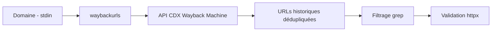
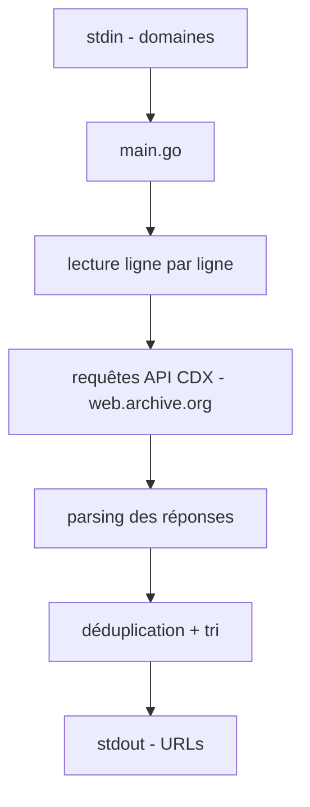

# 🕰️ waybackurls — Extraction d'URLs historiques (Wayback Machine)

> [!info] **En 1 phrase**
> waybackurls remonte le temps pour retrouver toutes les URLs qu'un domaine a exposées, grâce aux archives d'Internet.

---

## 🧾 Overview

| Champ | Valeur |
|---|---|
| Nom complet | waybackurls |
| Description | CLI Go qui interroge l'API CDX de la Wayback Machine (Internet Archive) pour lister les URLs historiques capturées d'un domaine |
| Catégorie | Reconnaissance & OSINT |
| Sous-catégorie | Content Discovery / URL harvesting |
| Fonction principale | Retrouver des URLs historiques (endpoints, paramètres, fichiers) d'un domaine |
| Type d'outil | CLI (binaire Go, stdin/stdout) |
| Licence | Non spécifiée dans le dépôt (issue du dépôt `tomnomnom/hacks`) |
| Open source / propriétaire | Open source |
| Langage(s) de programmation | Go |
| Développeur / organisation | tomnomnom |
| Projet officiel | https://github.com/tomnomnom/waybackurls |
| Dépôt officiel | https://github.com/tomnomnom/waybackurls |
| Documentation officielle | https://github.com/tomnomnom/waybackurls |
| Date de création | ~2017 (outils tomnomnom de l'écosystème bug bounty) |
| État du projet | maintenance (petit outil, peu de changements) |
| Dernière version connue | v0.0.0-2025-03-13 (snapshot de développement) |
| Systèmes compatibles | Linux, macOS, Windows (Go install) |

> [!note] Pour vérifier / compléter
> Le dépôt fait partie des « hacks » de tomnomnom : pas de version sémantique officielle ni de licence déclarée dans le repo. L'installation par `go install ...@latest` reste la méthode standard.

---

## 🎯 Concept

waybackurls (tomnomnom) interroge l'API CDX de la Wayback Machine (Internet Archive) et restitue l'historique des URLs capturées pour un domaine. Il permet de retrouver des endpoints oubliés, d'anciens paramètres, des fichiers sensibles exposés autrefois ou des pages d'admin supprimées depuis. Position : phase de content gathering de la recon web — après l'énumération de sous-domaines, avant les tests actifs.

Par défaut il traite le domaine racine ; `-subs` étend aux sous-domaines. Complément naturel de gau (qui agrège plusieurs sources : Common Crawl, OTX, URLScan) et de katana (crawl actif). Tout le traitement se fait par stdin/stdout, ce qui le rend parfait dans un pipeline Unix (`subfinder → waybackurls → httpx`).



---

## 🧠 Concepts fondamentaux

| Concept | Explication |
|---|---|
| Wayback Machine | Archive d'Internet (Internet Archive) qui capture des snapshots de pages depuis 1996 |
| API CDX | Interface de requête sur l'index des captures : renvoie la liste des URLs/snapshots |
| URLs historiques | Toutes les URLs jamais vues pour le domaine, même si elles n'existent plus aujourd'hui |
| `-subs` | Inclut les sous-domaines dans l'extraction (par défaut : domaine racine seulement) |
| `-no-subs` | Exclut explicitement les sous-domaines |
| `-dates` | Ajoute le timestamp de capture devant chaque URL |
| Content gathering | Phase de la recon web qui collecte endpoints, fichiers, paramètres avant les tests |
| Pipeline Unix | stdin/stdout : `echo domain | waybackurls | grep | httpx` |
| Déduplication | La sortie est triée et dédupliquée : un endpoint n'apparaît qu'une fois |

---

## 🛠️ Installation

### Via Go (Linux / macOS / Windows)

```bash
go install -v github.com/tomnomnom/waybackurls@latest
waybackurls -h
```

### Binaire précompilé

```bash
# Depuis les releases GitHub :
# wget https://github.com/tomnomnom/waybackurls/releases/download/v0.1.0/waybackurls-linux-amd64-0.1.0.tgz
# tar -xzf waybackurls-*.tgz && sudo mv waybackurls /usr/local/bin/
```

### Vérification

```bash
echo example.com | waybackurls | head
waybackurls -h
```

---

## ⚙️ Configuration

### Pas de fichier de config

waybackurls n'a pas de configuration persistante : tout se passe en stdin/stdout et options CLI.

### Options

| Option | Effet |
|---|---|
| `-subs` | Inclut les sous-domaines du domaine d'entrée |
| `-no-subs` | Exclut les sous-domaines (défaut : racine + subs selon version) |
| `-dates` | Préfixe chaque URL par le timestamp de capture |

### Variables d'environnement

| Variable | Effet |
|---|---|
| `HOMEPAGE` | URL de référence ajoutée dans le User-Agent (bonne pratique des outils tomnomnom) |

---

## 🏗️ Architecture interne



- **`main.go`** : lit les domaines depuis stdin (un par ligne), construit les requêtes vers `http://web.archive.org/cdx/search/cdx` et affiche les URLs extraites.
- **Requêtes** : l'API CDX est interrogée par domaine ; `-subs` ajoute la recherche des sous-domaines via les entrées CDX.
- **Traitement** : les URLs sont dédupliquées et triées avant affichage.
- **Design** : aucun état, aucune dépendance lourde : un binaire minimal, pensé pour le pipeline.

---

## ⌨️ Commandes

### Commandes essentielles

```bash
echo example.com | waybackurls | tee urls.txt
cat domains.txt | waybackurls -subs -dates > urls_archive.txt
echo example.com | waybackurls -no-subs
```

### Options

| Option | Effet |
|---|---|
| `-subs` | Inclut les sous-domaines |
| `-no-subs` | Exclut les sous-domaines |
| `-dates` | Ajoute le timestamp de capture devant chaque URL |

### Flags de tri (comportement de tri intégré)

| Comportement | Effet |
|---|---|
| Tri alphabétique | URLs triées avant sortie |
| Déduplication | Les doublons sont supprimés |

---

## 🚩 Options et flags (détail)

| Flag | Défaut | Description |
|---|---|---|
| `-subs` | false | Inclure les sous-domaines |
| `-no-subs` | false | Exclure les sous-domaines |
| `-dates` | false | Préfixer les URLs avec le timestamp |
| `-h` | — | Aide |

> [!note] Comportements par défaut
> Le comportement exact racine/sous-domaines varie selon la version : `-subs` est l'option la plus fiable pour une couverture large ; `-no-subs` pour se restreindre à la racine.

---

## 🧪 Exemples pratiques

### Extraction simple

```bash
echo example.com | waybackurls
```

### Avec sous-domaines

```bash
echo example.com | waybackurls -subs
```

### Avec dates

```bash
echo example.com | waybackurls -subs -dates
```

### Depuis une liste de domaines

```bash
cat domains.txt | waybackurls -subs > urls.txt
```

### Pipeline complet

```bash
echo example.com | waybackurls -subs | grep "=" | httpx -sc -silent
```

---

## 🔄 Workflow complet (scénario pas à pas)

1. **Collecter les domaines** — issus de subfinder/chaos.
   ```bash
   subfinder -d example.com -all -silent -o domains.txt
   ```
2. **Extraire les URLs historiques.**
   ```bash
   cat domains.txt | waybackurls -subs > urls.txt
   ```
3. **Filtrer le bruit** — supprimer les assets statiques.
   ```bash
   grep -Ev "\.(css|js|png|jpg|gif|svg|woff|woff2)$" urls.txt
   ```
4. **Cibler les URLs paramétrées** — candidats aux injections.
   ```bash
   grep "=" urls.txt
   ```
5. **Valider les cibles vivantes.**
   ```bash
   cat urls.txt | httpx -mc 200 -sc -title -silent
   ```

---

## 🎬 Scénarios avancés

### Scénario 1 : Chasse aux fichiers sensibles historiques

```bash
echo example.com | waybackurls -subs \
  | grep -Ei "\.(env|bak|sql|zip|tar\.gz|config|json|xml)$"
```

### Scénario 2 : Fusion avec gau pour maximiser la couverture

```bash
{ cat domains.txt | waybackurls -subs; cat domains.txt | gau --subs --threads 5; } \
  | sort -u > all_urls.txt
```

### Scénario 3 : Reconstitution de la chronologie d'un endpoint

Utiliser `-dates` pour dater l'apparition et la disparition d'une page sensible.

```bash
echo example.com | waybackurls -subs -dates \
  | grep -E "2020|2021" | grep -i "admin\|dev\|staging" | sort -u
```

### Scénario 4 : Pipeline complet de content discovery

Combiner waybackurls, gau et httpx pour ne garder que les endpoints vivants et paramétrés.

```bash
cat domains.txt | waybackurls -subs > wb.txt
cat domains.txt | gau --subs > gau.txt
cat wb.txt gau.txt | sort -u \
  | grep "=" \
  | httpx -mc 200 -sc -silent \
  | tee cibles_parametrees.txt
```

### Scénario 5 : Chasse aux endpoints d'admin et de dev

```bash
echo example.com | waybackurls -subs \
  | grep -Ei "(admin|console|phpmyadmin|swagger|actuator|jenkins|git|staging|dev)" \
  | sort -u
```

---

## 🛡️ Cybersecurity use cases

| Cas d'usage | Exemple concret |
|---|---|
| Bug bounty | Content gathering : endpoints oubliés hors du crawl actif |
| Pentest | Découverte de fichiers de config, backups, endpoints API |
| OSINT | Historique d'exposition d'un domaine |
| Red Team | Recherche de pages d'admin/dev non référencées |
| Shadow IT | Endpoints oubliés encore actifs mais non indexés |

---

## ⚔️ MITRE ATT&CK

| Technique | ID | Rapport avec waybackurls |
|---|---|---|
| Search Open Technical Databases | T1596 | Interrogation de la Wayback Machine |
| Search Open Websites/Domains | T1593 | URLs historiques du domaine |
| Gather Victim Host Information | T1590 | Endpoints, sous-domaines, fichiers |
| Search Victim-Owned Websites | T1594 | Contenu passé du domaine |
| Exploit Public-Facing Application | T1190 | Les endpoints trouvés alimentent les tests d'exploitation (en aval) |

---

## 🛡️ Defensive Security

| Usage défensif | Description |
|---|---|
| Audit d'exposition | Vérifier ce que l'archive montre de son domaine (fuites historiques) |
| Purge de contenu | Identifier les fichiers sensibles encore accessibles malgré leur retrait |
| Monitoring | Détecter des endpoints oubliés encore actifs |
| Détection de fuites | Rechercher des fichiers de config/dumps dans les URLs archivées |

> [!warning] Contexte
> waybackurls est passif (API publique). Il révèle des données que l'on croyait supprimées : c'est exactement ce qu'un défenseur doit contrôler sur son propre domaine.

---

## 🤖 Automatisation

### Script de content discovery

```bash
#!/bin/bash
# Extraction + filtrage + validation
DOMAIN=${1:?Usage: $0 <domaine>}
echo "$DOMAIN" | waybackurls -subs > raw_urls.txt
grep -Ev "\.(css|js|png|jpg|gif|svg|woff|woff2)$" raw_urls.txt > urls.txt
grep "=" urls.txt | httpx -mc 200 -sc -silent > cibles.txt
```

### Boucle multi-domaines

```bash
while read -r d; do
  echo "$d" | waybackurls -subs >> all_urls.txt
done < domains.txt
sort -u all_urls.txt -o all_urls.txt
```

### Cron (revue hebdomadaire)

```bash
0 3 * * 1 echo example.com | waybackurls -subs > /data/urls_$(date +\%F).txt
```

---

## 📦 Output et parsing

### Sortie simple

```
http://example.com/
http://example.com/login.php?redirect=/
https://example.com/admin/index.html
```

### Sortie avec dates (`-dates`)

```
20190603120000 http://example.com/admin/
```

### Parsing courant

```bash
# Endpoints paramétrés
grep "=" urls.txt
# Extensions sensibles
grep -Ei "\.(env|bak|sql|zip)$" urls.txt
# Par schéma
grep -E "^https?" urls.txt | cut -d/ -f3 | sort -u
```

---

## 🔗 Intégrations

| Outil | Intégration |
|---|---|
| [[Outil - gau\|gau]] | Complémentaire : agrège Wayback + Common Crawl + OTX + URLScan |
| [[Outil - httpx\|httpx]] | Validation des URLs vivantes (`-mc`, `-sc`, `-title`) |
| [[Outil - katana\|katana]] | Crawl actif des URLs découvertes |
| [[Outil - subfinder\|subfinder]] | En amont : énumération des sous-domaines |
| [[Outil - nuclei\|nuclei]] | En aval : scanning des endpoints trouvés |
| [[Outil - ffuf\|ffuf]] / [[Outil - gobuster\|gobuster]] | Content discovery complémentaire (actif) |
| [[Outil - gau\|gau]] + [[Outil - waybackurls\|waybackurls]] | Couverture maximale des sources d'URLs |

---

## 🔄 Alternatives

| Outil | Différence clé |
|---|---|
| [[Outil - gau\|gau]] | Multi-sources (Wayback + Common Crawl + OTX + URLScan), plus de couverture |
| [[Outil - katana\|katana]] | Crawl actif en temps réel du site |
| `wayback_machine_downloader` | Télécharge les snapshots (pas seulement les URLs) |
| Archive Box / CDX tools | Récupération plus fine des archives |
| httpx + wordlists | Content discovery actif (fuzzing) |

---

## ⚡ Performance

| Facteur | Impact |
|---|---|
| Volume d'URLs | Peut être très volumineux : toujours rediriger vers un fichier |
| API CDX | Rapide mais dépendant du service Internet Archive (latence réseau) |
| `-subs` | Multiplie les requêtes (chaque sous-domaine) |
| Filtrage | `grep` à la volée réduit le volume analysé |
| Pipeline | stdout → outils suivants : pas d'écriture disque intermédiaire nécessaire |

---

## 🔧 Troubleshooting

| Problème | Cause probable | Solution |
|---|---|---|
| Aucune sortie | Domaine sans captures ou API indisponible | Tester sur un domaine archivé ; réessayer plus tard |
| Résultats partiels | API CDX instable / timeout | Relancer, ajouter `-subs`, vérifier la connexion |
| Binaire introuvable | PATH non mis à jour | `export PATH=$PATH:$(go env GOPATH)/bin` |
| Sortie polluée | Fichiers statiques / erreurs | Filtrer avec grep avant analyse |
| `-no-subs` sans effet | Comportement par version | Préférer `-subs` explicite et filtrer |
| Doublons | Sources multiples | `sort -u` dans le pipeline |

---

## 🔒 Sécurité de l'outil

| Point | Détail |
|---|---|
| Passif | Interroge uniquement l'API publique de l'Internet Archive |
| Traçabilité | Les requêtes vers web.archive.org partent de votre IP |
| Données | Les URLs collectées peuvent révéler du contenu sensible : stockage protégé |
| Usage | L'exploitation des endpoints trouvés reste encadrée par l'autorisation |

---

## ⚠️ Limitations

| Limitation | Détail |
|---|---|
| Couverture archive | Ne voit que ce qui a été crawlisé (pas tout) |
| Pas de validation | Beaucoup d'URLs mortes : httpx nécessaire |
| Bruit | Fichiers statiques, pages d'erreur : filtrage requis |
| Sans `-subs` | Uniquement le domaine racine (couverture réduite) |
| Maintenance | Outil minimal, peu de fonctionnalités évolutives |
| Licence | Non déclarée dans le dépôt : vérifier avant réutilisation commerciale |

---

## 📋 Cheatsheet

```bash
# Extraction simple
echo example.com | waybackurls

# Avec sous-domaines
echo example.com | waybackurls -subs

# Avec dates
echo example.com | waybackurls -subs -dates

# Liste de domaines → fichier
cat domains.txt | waybackurls -subs > urls.txt

# Fichiers sensibles
cat urls.txt | grep -Ei "\.(env|bak|sql|zip|config)$"

# Endpoints paramétrés
cat urls.txt | grep "=" | httpx -mc 200 -sc -silent

# Endpoints admin/dev
cat urls.txt | grep -Ei "(admin|console|swagger|staging|dev)"
```

---

## ⚡ Quick reference

| Action | Commande |
|---|---|
| Extraire les URLs | `echo <domaine> \| waybackurls` |
| Avec sous-domaines | `waybackurls -subs` |
| Avec dates | `waybackurls -dates` |
| Depuis un fichier | `cat domains.txt \| waybackurls -subs` |
| Filtrer statiques | `grep -Ev "\.(css\|js\|png\|...)$"` |
| URLs paramétrées | `grep "="` |
| Valider vivantes | `\| httpx -mc 200 -sc -silent` |

---

## 🔍 Détection & Défense

| Signe | Défense |
|---|---|
| Les URLs archivées sont publiques et consultables par tous | Les archives ne peuvent pas être bloquées : purger le contenu sensible du site actif |
| D'anciennes URLs peuvent révéler du contenu supprimé | Nettoyer réellement les fichiers sensibles (pas seulement retirer les liens) |
| Wayback archive même ce que l'on croyait caché | Supprimer le contenu, pas seulement le dé-indexer |
| Requêtes régulières sur l'API CDX d'un domaine | Difficulté de blocage : c'est un service public ; renforcer le secret des endpoints |
| Pages de dev/staging archivées encore actives | Isoler les environnements de dev derrière VPN/ACL, ne pas les exposer publiquement |

---

## 💡 Tips & Pièges

> [!tip] 💡 **`-dates` aide à reconstituer la chronologie**
> Utile pour dater l'apparition et la disparition d'un endpoint sensible.

> [!tip] 💡 **Filtre à la volée avec grep**
> Isole les extensions ou mots-clés sensibles avant d'analyser.

> [!tip] 💡 **Passe par httpx ensuite**
> La majorité des URLs archivées est morte.

> [!tip] 💡 **La sortie est dédupliquée**
> Un même endpoint n'apparaît qu'une fois.

> [!tip] 💡 **Pipe vers un fichier**
> `> urls.txt` évite d'écraser ton terminal sur les gros volumes.

> [!warning] ⚠️ **Beaucoup de bruit**
> Fichiers statiques, pages d'erreur : filtre avant analyse.

> [!warning] ⚠️ **Sans `-subs`, tu ne vois que le domaine racine**
> Pense à `-subs` pour une couverture complète.

> [!warning] ⚠️ **Wayback rate les URLs jamais crawlisées**
> gau (Common Crawl, OTX, URLScan) apporte plus de profondeur.

> [!warning] ⚠️ **Les URLs peuvent pointer vers des hôtes retirés du DNS**
> Toujours revalider avec httpx.

> [!danger] 🚫 **Une URL archivée n'est pas une autorisation d'attaque**
> L'exploitation des endpoints découverts exige un scope autorisé.

---

## 📚 References

### Official
- [GitHub officiel waybackurls](https://github.com/tomnomnom/waybackurls)
- [Internet Archive Wayback Machine](https://web.archive.org)
- [Index API CDX (documentation)](https://web.archive.org/help/apidocs.html)

### Security
- [Article tomnomnom — outils de recon](https://tomnomnom.com/)
- [MITRE ATT&CK — Search Open Technical Databases T1596](https://attack.mitre.org/techniques/T1596/)

### Community
- [Outils du dépôt tomnomnom/hacks](https://github.com/tomnomnom/hacks)

---

➡️ **Liens :** [[Tools|🧰 Outils]] · [[01 - Reconnaissance|🕵️ Reconnaissance]] · [[Outil - gau|🎯 gau]] · [[Outil - httpx|🌐 httpx]] · [[Outil - katana|🗡️ katana]]
