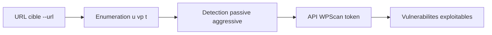

# wpscan — Scanner WordPress (Ruby)

> [!info] **En 1 phrase**
> wpscan est un scanner WordPress qui énumère plugins, thèmes et utilisateurs, et détecte les vulnérabilités connues du CMS.

---

## Overview

| Champ | Valeur |
|---|---|
| Nom complet | WPScan |
| Description | Scanner black-box WordPress : version du CMS, plugins/thèmes installés, énumération d'utilisateurs, bruteforce et vérification contre la WPScan Vulnerability Database |
| Catégorie | Scan Web & Fuzzing |
| Sous-catégorie | Scanner CMS (WordPress) |
| Fonction principale | Identifier la version de WordPress, les plugins/thèmes et les vulnérabilités associées |
| Type d'outil | CLI (gem Ruby) |
| Licence | Dual : libre pour usage non commercial, licence payante pour usage commercial |
| Open source / propriétaire | Non open source (licence custom) |
| Langage(s) de programmation | Ruby |
| Développeur / organisation | WPScanTeam (wpscanteam) |
| Projet officiel | https://wpscan.com |
| Dépôt officiel | https://github.com/wpscanteam/wpscan |
| Documentation | https://github.com/wpscanteam/wpscan/wiki |
| Version actuelle | 4.1.0 (juillet 2026) |
| Date de sortie initiale | 16 juin 2011 (par Ryan Dewhurst) |
| Prérequis | Ruby >= 3.3, Curl >= 7.72 |
| API vulnérabilités | WPScan Vulnerability Database (token via wpscan.com) |

---

## Concept

wpscan est l'outil de référence pour auditer une instance WordPress. Il identifie la version du CMS, les plugins et thèmes actifs, énumère les utilisateurs et vérifie chaque élément contre la base de vulnérabilités (WPScan Vulnerability Database).

L'option `--api-token` (token gratuit via l'API WPScan) débloque la vérification des vulnérabilités et des alertes temps réel. `--enumerate` pilote précisément l'énumération : `u` (users), `vp` (plugins vulnérables), `t` (thèmes)... `--plugins-detection` choisit la méthode entre `passive` et `aggressive`. En pentest, il s'utilise en phase de reconnaissance ciblée d'une cible WordPress : détection de la version, inventaire des extensions, recherche d'utilisateurs, puis corrélation avec la base de vulnérabilités pour choisir l'exploit.



---

## Concepts fondamentaux

- **Black-box** : wpscan n'a pas accès aux fichiers serveur — il déduit les informations des réponses HTTP et du code source des pages.
- **Fingerprinting** : identification de la version de WordPress, des plugins et thèmes via les chemins caractéristiques (`readme.html`, `wp-json`, version dans le source, changelogs).
- **Énumération (`-e`)** : `u` (utilisateurs), `p` (plugins), `t` (thèmes), `vp`/`vt` (versions vulnérables), `cb` (config backups), `dbe` (db exports), `m` (médias) — v4 : plugins non scannés par défaut, explicite avec `-e ap`.
- **WPScan Vulnerability Database** : base centralisée des vulnérabilités WordPress/plugins/thèmes, interrogée via `--api-token` pour des données à jour.
- **Détection passive vs aggressive** : passive = lit les URLs/index ; aggressive = envoie des requêtes de vérification de version/fichiers (plus bruyant).
- **Bruteforce** : `--passwords` + `--usernames` teste les identifiants sur `wp-login.php` ou XML-RPC.
- **Auth-based enumeration** (`--wp-auth`) : utilisation d'une session WordPress authentifiée pour une énumération plus précise.
- **SAM**L (`--expect-saml`) : prise en charge de l'authentification SAML pour les sites configurés ainsi.
- **Formats de sortie** : `cli`, `json`, `jsonl` (streaming), `sarif` — et historique `xml`.

---

## Installation

```bash
# Kali / Debian
sudo apt install wpscan

# Via RubyGems
gem install wpscan

# macOS (Homebrew)
brew install wpscanteam/tap/wpscan

# Conteneur
docker pull wpscanteam/wpscan
docker run -it --rm wpscanteam/wpscan --url http://10.10.10.10

# Configuration du token (recommandé)
wpscan --update --api-token VOTRE_TOKEN

# Mise à jour
gem update wpscan
```

> [!note] À vérifier
> WPScan requiert **Ruby >= 3.3** et **Curl >= 7.72** (les curl < 7.72 peuvent générer des erreurs HTTP/2).

---

## Configuration

### Options de configuration

| Paramètre | Rôle |
|---|---|
| `--api-token <token>` | Token WPScan API (base de vulnérabilités, alertes temps réel) |
| `--wp-auth <login>:<pass>` | Authentification WordPress pour une énumération plus précise |
| `--expect-saml` | Attendre une authentification SAML sur la cible |
| `--plugins-detection <mode>` | `passive` (silencieux) ou `aggressive` (bruyant) |
| `--random-user-agent` | User-Agent aléatoire |
| `--proxy <url>` | Passer par un proxy HTTP |
| `--request-timeout <sec>` | Timeout par requête |
| `--stealthy` | Réduire la visibilité (User-Agent aléatoire, détection passive...) |
| `--output <fichier>` | Écrire le rapport dans un fichier |
| `--format <fmt>` | `cli`, `json`, `jsonl`, `sarif`, `xml` |

### Dossiers de données (v4)

```text
~/.cache/wpscan/db/      # base de données locale (métadonnées WordPress)
~/.config/wpscan/        # configuration des installations v4+
```
Depuis v4.0, les nouvelles installations utilisent les répertoires **XDG** (`~/.cache/wpscan/db`, `~/.config/wpscan/`).

> [!note] À vérifier
> La base de données locale ne contient **pas** les données de vulnérabilités : celles-ci proviennent de l'API WPScan en temps réel avec `--api-token`.

---

## Architecture interne

```text
wpscan (gem Ruby)
├── wpscan.rb             # point d'entrée CLI
├── lib/
│   ├── controllers/      # orchestration (scan principal, énumération, bruteforce)
│   ├── models/           # WordPress, Plugin, Theme, User, Version
│   ├── finders/          # détection (version CMS, plugins, thèmes, utilisateurs)
│   │   └── # répertoires : main_theme, plugins, themes, users, version...
│   ├── vulnerabilities/  # chargement des données de l'API WPScan
│   ├── db/               # accès à la base locale (SQLite, métadonnées)
│   └── output/           # formats : cli, json, jsonl, sarif, xml
├── spec/                 # tests
└── Dockerfile            # image officielle
```

- **Finders** : chaque brique de détection (version, plugins, thèmes, users) a plusieurs stratégies — WPScan combine les techniques (headers, source, readme, changelogs, error messages).
- **Base locale SQLite** : stocke les métadonnées (slugs, versions connues) pour un fingerpinting rapide hors ligne.
- **API WPScan** : interrogation en temps réel de la base de vulnérabilités (nécessite `--api-token`).
- **Curl** : les requêtes HTTP reposent sur le binaire `curl` (`Typhoeus`), d'où le prérequis Curl >= 7.72.

---

## Commandes

### Commandes de base

```bash
# Scan de base (version, plugins détectés passivement, users)
wpscan --url http://10.10.10.10

# Énumération complète avec token API
wpscan --url http://10.10.10.10 --enumerate u,vp,vt --api-token TOKEN

# Énumération des utilisateurs
wpscan --url http://10.10.10.10 --enumerate u

# Plugins vulnérables, détection aggressive
wpscan --url http://10.10.10.10 --enumerate vp --plugins-detection aggressive

# Mise à jour de la base locale
wpscan --update
```

### Commandes avancées

```bash
# Bruteforce ciblé (login + wordlist)
wpscan --url http://10.10.10.10 --passwords rockyou.txt --usernames admin,editor

# Scan discret
wpscan --url http://10.10.10.10 --stealthy --random-user-agent

# Scan via proxy (Burp/ZAP)
wpscan --url http://10.10.10.10 --proxy http://127.0.0.1:8080

# Rapport JSON / SARIF / JSONL
wpscan --url http://10.10.10.10 --enumerate u,vp,vt --format json --output rapport.json
wpscan --url http://10.10.10.10 --format sarif --output rapport.sarif

# Force le scan même si la détection de WordPress échoue
wpscan --url http://10.10.10.10 --force
```


---

## Options et flags

### Options principales

| Option | Description | Niveau |
|---|---|---|
| `--url <url>` | URL de la cible (requise) | Basic |
| `--enumerate <e>` | Énumération : `u`, `p`, `t`, `vp`, `vt`, `ap`, `at`, `cb`, `dbe`, `m` | Basic |
| `--plugins-detection <mode>` | `passive` ou `aggressive` | Basic |
| `--api-token <token>` | Token WPScan API (vulnérabilités) | Basic |
| `--update` | Met à jour la base locale | Basic |
| `--format <fmt>` | `cli`, `json`, `jsonl`, `sarif`, `xml` | Intermediate |
| `--output <fichier>` | Écrire le rapport dans un fichier | Intermediate |
| `--passwords <fichier>` | Wordlist de mots de passe (bruteforce) | Intermediate |
| `--usernames <liste>` | Usernames ciblés (bruteforce) | Intermediate |
| `--proxy <url>` | Proxy HTTP | Intermediate |
| `--random-user-agent` | User-Agent aléatoire | Intermediate |
| `--stealthy` | Mode discret | Intermediate |
| `--ignore-main-redirect` | Ignorer la redirection principale | Intermediate |
| `--force` | Scanner même sans détection WordPress | Intermediate |
| `--wp-auth <id:pass>` | Auth WordPress pour l'énumération (v4) | Advanced |
| `--expect-saml` | Attendre une auth SAML (v4) | Advanced |
| `--wp-content-dir <dir>` | Dossier wp-content personnalisé | Advanced |
| `--request-timeout <sec>` | Timeout par requête | Advanced |
| `-t <n>` / `--max-threads` | Nombre de threads | Intermediate |
| `--exclude-content-based <regex>` | Exclure des réponses par contenu | Advanced |
| `--cache-dir <dir>` | Dossier de cache de la base | Expert |
| `--max-scan-duration <sec>` | Durée max du scan | Advanced |

### Codes d'énumération (`--enumerate`)

| Code | Énumération | Code | Énumération |
|---|---|---|---|
| `u` | Utilisateurs (IDs) | `vp` | Plugins vulnérables |
| `p` | Plugins | `vt` | Thèmes vulnérables |
| `t` | Thèmes | `cb` | Config backups |
| `ap` | Plugins (explicite, v4) | `dbe` | DB exports |
| `at` | Thèmes (explicite, v4) | `m` | Médias |

> [!warning] Changements v4.0
> - Les plugins ne sont **plus scannés par défaut** : il faut `-e ap` (ou `-e p`) explicitement.
> - L'énumération par défaut des plugins/backups est supprimée.
> - Les options `--timthumbs-detection`, `--config-backups-detection`, `--db-exports-detection`, `--medias-detection` sont **retirées** (utiliser `--enumerate`).

---

## Exemples pratiques

### Beginner

```bash
# Objectif : scan de base d'une cible
wpscan --url http://10.10.10.10

# Objectif : énumérer les utilisateurs
wpscan --url http://10.10.10.10 --enumerate u

# Objectif : plugins vulnérables avec token
wpscan --url http://10.10.10.10 --enumerate vp --api-token TOKEN
```

### Intermediate

```bash
# Objectif : énumération complète
wpscan --url http://10.10.10.10 --enumerate u,vp,vt --api-token TOKEN

# Objectif : détection aggressive des plugins cachés
wpscan --url http://10.10.10.10 --enumerate vp --plugins-detection aggressive

# Objectif : rapport JSON pour pipeline
wpscan --url http://10.10.10.10 --enumerate u,vp,vt \
  --api-token TOKEN --format json --output rapport.json
```

### Advanced

```bash
# Objectif : bruteforce ciblé
wpscan --url http://10.10.10.10 --passwords rockyou.txt --usernames admin,editor

# Objectif : scan discret
wpscan --url http://10.10.10.10 --stealthy --random-user-agent

# Objectif : scan via proxy pour rejouer dans Burp
wpscan --url http://10.10.10.10 --proxy http://127.0.0.1:8080
```

### Expert

```bash
# Objectif : énumération basée sur une session WordPress (v4)
wpscan --url http://10.10.10.10 --wp-auth admin:motdepasse --enumerate ap

# Objectif : site avec SAML
wpscan --url http://10.10.10.10 --expect-saml --enumerate u

# Objectif : forcer le scan sur un WordPress non standard
wpscan --url http://10.10.10.10 --force --wp-content-dir /custom-content
```

---

## Workflow complet (scénario pas à pas)

1. **Détection initiale** : obtenir la version et l'inventaire de base.
   ```bash
   wpscan --url http://10.10.10.10
   ```
2. **Énumération complète** : utilisateurs, plugins et thèmes vulnérables.
   ```bash
   wpscan --url http://10.10.10.10 --enumerate u,vp,vt --api-token TOKEN
   ```
3. **Forcer la détection** des plugins cachés :
   ```bash
   wpscan --url http://10.10.10.10 --enumerate vp --plugins-detection aggressive
   ```
4. **Identifier les usernames** avec `--enumerate u`, puis tenter un bruteforce ciblé (uniquement si autorisé).
5. **Relier chaque CVE trouvée** à nuclei ou à un template d'exploitation, puis vérifier l'exploitabilité réelle.
6. **Rester discret** :
   ```bash
   wpscan --url http://10.10.10.10 --stealthy --random-user-agent
   ```

---

## Scénarios avancés

### Scénario 1 : Bruteforce ciblé sur les utilisateurs énumérés

Après énumération des logins, tester les identifiants faibles via `wp-login.php` ou XML-RPC.
```bash
# 1. Énumérer les utilisateurs
wpscan --url http://cible.local --enumerate u

# 2. Bruteforce un compte (username et wordlist)
wpscan --url http://cible.local --passwords rockyou.txt --usernames admin,editor
```

### Scénario 2 : Exploitation d'un plugin vulnérable identifié

`--enumerate vp` remonte une CVE ; on la vérifie avec un template d'exploitation.
```bash
wpscan --url http://cible.local --enumerate vp --api-token TOKEN --plugins-detection aggressive
# Ex : plugin vulnérable identifié — chercher l'exploit puis confirmer avec nuclei
searchsploit <plugin>
nuclei -u http://cible.local -t http/cves/2018/CVE-2018-XXXX.yaml
```

### Scénario 3 : Scan via proxy pour masquer l'origine (Burp/ZAP)

```bash
wpscan --url http://cible.local --proxy http://127.0.0.1:8080
# Permet de revoir les requêtes dans Burp et de les modifier si besoin
```

### Scénario 4 : Audit complet multi-cibles avec rapport

Enchaîner sur plusieurs sites et conserver une trace exploitable.
```bash
# Scan complet avec sortie rapport JSON
wpscan --url http://cible.local --enumerate u,vp,vt \
  --api-token TOKEN --format json --output rapport.json

# Énumérer aussi les thèmes vulnérables en aggressive
wpscan --url http://cible.local --enumerate vt --plugins-detection aggressive
```

### Scénario 5 : Énumération des médias et fichiers exposés

Découvrir des contenus uploadés ou des backups dans wp-content.
```bash
wpscan --url http://cible.local --enumerate cb,dbe
# Options utiles : --exclude-content-based pour filtrer le bruit par contenu
```

### Scénario 6 : Énumération avec session WordPress (v4)

Utiliser une authentification WordPress (`--wp-auth`) pour une énumération plus fiable des plugins installés.
```bash
wpscan --url http://cible.local --wp-auth editor:motdepasse --enumerate ap,at
# Les plugins/thèmes sont détectés via l'interface admin authentifiée
```


---

## Cybersecurity use cases

| Phase | Utilisation |
|---|---|
| Reconnaissance | Identification de la version WordPress, des plugins/thèmes et des utilisateurs |
| Énumération | Découverte de config backups, db exports, médias exposés |
| Vulnérabilité | Vérification contre la WPScan Vulnerability Database (plugins/thèmes/CMS) |
| Exploitation | Corrélation CVE → exploit, bruteforce ciblé des comptes |
| Post-exploitation | Validation de la surface WordPress d'une flotte de sites |
| Rapport | Génération de rapports JSON/SARIF pour les pipelines |

---

## MITRE ATT&CK

| Tactique | Technique / Sub-technique | ID | Raison | Détection | Mitigation |
|---|---|---|---|---|---|
| Reconnaissance | Active Scanning: Vulnerability Scanning | T1595.002 | wpscan identifie les vulnérabilités WordPress | Logs HTTP, User-Agent WPScan, patterns d'énumération | WAF, supervision |
| Reconnaissance | Gather Victim Identity Information: Usernames | T1589.002 | énumération des utilisateurs WordPress | Requêtes vers `?author=`, `wp-json/wp/v2/users` | Bloquer l'énumération (Wordfence, plugin) |
| Reconnaissance | Gather Victim Host Information: Software | T1592.002 | fingerprinting de la version CMS et des plugins | Requêtes vers readme.html, changelogs | Masquer les versions, supprimer readme |
| Credential Access | Brute Force | T1110 | bruteforce des comptes via wp-login/XML-RPC | Tentatives de connexion multiples | MFA, rate limiting, désactiver XML-RPC |

> [!note] Ne renseigner que si l'association est réellement pertinente.
> L'association la plus spécifique est **T1595.002 (Vulnerability Scanning)**. L'énumération d'utilisateurs correspond à **T1589.002** seulement si elle est utilisée pour cibler des comptes.

---

## Defensive Security

### Signes observables

| Indicateur | Détail |
|---|---|
| User-Agent « WPScan » dans les logs | Signature classique d'un scan |
| Requêtes vers `wp-json`, `readme.html`, `wp-login.php` | Patterns d'énumération/détection |
| Requêtes vers `?author=1`, `/wp-json/wp/v2/users` | Énumération d'utilisateurs |
| Tentatives multiples sur wp-login.php ou xmlrpc.php | Brute force |
| Requêtes vers des chemins de plugins inconnus | Détection aggressive |

### Règles de détection (Sigma / Suricata / Snort / YARA)

```yaml
# Sigma : scan wpscan via User-Agent
title: WPScan WordPress Scanner
id: 3f1a4b2c-0005-4a5b-9c2d-000000000005
status: experimental
description: Détection d'un scan wpscan par le User-Agent
logsource:
    category: webserver
    product: apache
detection:
    selection:
        c-useragent|contains:
            - 'WPScan'
    condition: selection
falsepositives:
    - Outils d'audit légitimes
level: medium
```

```bash
# Suricata/Snort (pédagogique) : énumération d'utilisateurs WordPress
alert http any any -> any any (msg:"WPScan - username enumeration"; \
  flow:to_server,established; \
  http.uri; content:"wp-json/wp/v2/users"; \
  sid:66000021; rev:1;)
```

```yaml
# YARA : installation wpscan sur un poste
rule WPScan_Installed {
    meta:
        description = "Présence d'une installation wpscan"
        author = "Équipe SOC"
    strings:
        $a = "wpscan" ascii wide
        $b = "wp-login.php" ascii wide
        $c = "WPScanTeam" ascii wide
    condition:
        any of them
}
```

---

## Automatisation

```bash
# Scan multi-cibles avec rapport JSON par site
while read -r url; do
  wpscan --url "$url" --enumerate u,vp,vt --api-token TOKEN \
    --format json --output "rapport_${url//\//_}.json" --random-user-agent
done < sites.txt

# Cron hebdomadaire de surveillance WordPress
0 6 * * 1 wpscan --url https://cible.local --enumerate vp,vt \
  --api-token TOKEN --format jsonl --output scan.jsonl
```

```python
# Python : lancer un scan et parser le JSON
import json, subprocess

url = "http://10.10.10.10"
subprocess.run(["wpscan", "--url", url, "--enumerate", "u,vp,vt",
                "--api-token", "TOKEN", "--format", "json",
                "--output", "rapport.json"], check=True)

with open("rapport.json", encoding="utf-8") as f:
    data = json.load(f)

for plugin in data.get("plugins", {}):
    print("Plugin:", plugin, data["plugins"][plugin].get("latest_version"))
```

```yaml
# GitHub Actions : scan WordPress en CI
name: wpscan
on:
  schedule:
    - cron: "0 3 * * 1"
jobs:
  scan:
    runs-on: ubuntu-latest
    steps:
      - name: Scan
        run: |
          docker run --rm -v "$(pwd):/tmp" wpscanteam/wpscan \
            --url https://cible.local --enumerate u,vp,vt \
            --api-token "${{ secrets.WPSCAN_TOKEN }}" \
            --format json --output /tmp/rapport.json --random-user-agent
      - name: Upload
        uses: actions/upload-artifact@v4
        with:
          path: rapport.json
```

---

## Output et parsing

wpscan supporte les formats **cli**, **json**, **jsonl** (streaming, v4), **sarif** (v4) et **xml** (historique).

```bash
# Rapport JSON
wpscan --url http://10.10.10.10 --enumerate u,vp,vt \
  --api-token TOKEN --format json --output rapport.json

# Extraire les vulnérabilités avec jq
jq -r '.plugins[] | select(.vulnerabilities != null) | "\(.slug): \(.vulnerabilities[].id)"' rapport.json

# Lister les utilisateurs trouvés
jq -r '.users[] | .username' rapport.json

# Rapport SARIF (intégration code review/CI)
wpscan --url http://10.10.10.10 --format sarif --output rapport.sarif
```

> [!note] À vérifier
> Les champs exacts du JSON varient selon la version (v4 a fait évoluer la structure) : tester sur une cible de test avant d'automatiser un parser.

---

## Intégrations

```text
wpscan -> proxy (Burp/ZAP) -> trafic contrôlé et rejouable
wpscan -> API WPScan (token) -> base de vulnérabilités temps réel
wpscan -> nuclei -> validation des CVEs avec templates
wpscan -> searchsploit / exploit-db -> recherche d'exploits
wpscan -> rapports JSON/SARIF -> SIEM / pipeline CI
```

- [[Tools| Outils]] global
- [[Outil - nuclei]] — confirmation des CVEs identifiées avec des templates
- [[Outil - gobuster]] / [[Outil - ffuf]] — énumération de répertoires complémentaire
- [[Outil - Burp Suite]] / [[Outil - OWASP ZAP]] — analyse applicative après inventaire
- [[Techniques/Brute Force Rate Limit|Brute Force Rate Limit]] · [[Techniques/Virtual Hosts|Virtual Hosts]] · [[03 - Exploitation Web|Exploitation Web]]

---

## Alternatives

| Outil | Avantages | Inconvénients | Cas d'usage |
|---|---|---|---|
| WPSeku | Léger, orienté WordPress | Moins maintenu, base réduite | Quick check WordPress |
| WPScanner (online) | Pas d'installation | Envoie les données à un tiers | Vérification ponctuelle |
| Nuclei (templates WP) | Templates CVEs très à jour | Pas d'énumération dédiée | Validation des CVEs |
| OWASP ZAP (scan) | DAST complet | Non spécialisé WordPress | Audit applicatif complet |
| Manual + wp-json | Contrôle total | Lent, manuel | Analyse fine |

> **Quand utiliser wpscan plutôt que les autres ?** C'est le scanner **spécialisé WordPress** : énumération d'utilisateurs, plugins/thèmes vulnérables et corrélation avec la base WPScan. On le combine toujours avec nuclei pour valider les CVE trouvées.

---

## Performance

- **Détection passive** : rapide et discrète (lit les URLs/index, peu de requêtes).
- **Détection aggressive** : plus lente et plus bruyante (vérifie chaque plugin/thème) — à réserver quand la passive ne suffit pas.
- **Concurrence** : régler `--max-threads` pour équilibrer vitesse et discrétion.
- **Limites de durée** : `--max-scan-duration` pour borner un scan en engagement sous contrainte.
- **Base locale** : `--update` maintient les métadonnées à jour pour un fingerprinting plus fiable.
- **Formats streaming** : `--format jsonl` évite de tout charger en mémoire pour les gros scans.

> [!note] À vérifier
> Les performances dépendent du nombre de plugins/thèmes et du mode de détection : commencer en `passive`, passer en `aggressive` ciblé.

---

## Troubleshooting

### Common problems

#### Problème : `Stream error in the HTTP/2 framing layer`

- **Cause** : version de curl trop ancienne (< 7.72).
- **Solution** : mettre à jour curl (>= 7.72).
- **Vérification** : `curl --version`.

#### Problème : pas de données de vulnérabilités affichées

- **Cause** : absence de `--api-token`.
- **Solution** : créer un compte sur wpscan.com, récupérer un token, le passer avec `--api-token` (ou `--update --api-token`).
- **Vérification** : relancer avec le token et vérifier les « WARNING ».

#### Problème : le site ne semble pas être WordPress (`--force` nécessaire)

- **Cause** : WordPress modifié, cache, WAF, ou redirection.
- **Solution** : `--force`, éventuellement `--ignore-main-redirect`, préciser `--wp-content-dir`.
- **Vérification** : `curl -I http://10.10.10.10` pour voir les redirections.

#### Problème : l'énumération aggressive est bloquée (403/429)

- **Cause** : WAF ou rate limiting.
- **Solution** : passer en `passive`, ralentir (`--request-timeout`, moins de threads), utiliser `--random-user-agent`.
- **Vérification** : relancer avec `--stealthy` et comparer.

#### Problème : beaucoup de faux positifs dans les plugins

- **Cause** : la détection aggressive confond des fichiers similaires.
- **Solution** : vérifier chaque match manuellement, utiliser `--exclude-content-based` pour filtrer.
- **Vérification** : rejouer la requête correspondante avec curl/Burp.

---

## Sécurité de l'outil

- **Licence** : WPScan n'est **pas open source** — licence custom, gratuite hors usage commercial, payante en usage commercial. Vérifier les conditions avant utilisation en entreprise.
- **Token API** : le token WPScan identifie le compte — ne pas le partager, le stocker hors du code (secrets CI).
- **Bruteforce** : le bruteforce des comptes peut déclencher les verrous et est illégal sans autorisation — cadrer avec le scope.
- **Trafic** : les scans peuvent être détectés (User-Agent, patterns) ; passer par un proxy autorisé.
- **Mises à jour** : suivre les releases (v4.1.0) et les changements breaking (v4.0) avant migration des scripts.
- **Base de données** : les métadonnées locales (`~/.cache/wpscan`) et rapports contiennent des informations sensibles — les protéger.

---

## Limitations

- **Licence commerciale payante** : l'usage commercial nécessite une licence — c'est une limitation importante pour les entreprises.
- **WordPress uniquement** : ne scanne pas les autres CMS (Joomla, Drupal...).
- **Black-box** : ne voit pas la config serveur, uniquement ce qui est exposé via HTTP.
- **Faux positifs en aggressive** : la détection aggressive peut confondre des fichiers similaires.
- **Base de vulnérabilités en ligne** : sans API token, pas de données de vulnérabilités à jour.
- **Pas un DAST applicatif** : il ne teste pas la logique métier ni l'ensemble des endpoints.

---

## Cheatsheet

```bash
# Scan de base
wpscan --url http://10.10.10.10

# Énumération complète avec token
wpscan --url http://10.10.10.10 --enumerate u,vp,vt --api-token TOKEN

# Plugins explicites (v4 : pas de scan auto des plugins)
wpscan --url http://10.10.10.10 --enumerate ap

# Plugins vulnérables, aggressive
wpscan --url http://10.10.10.10 --enumerate vp --plugins-detection aggressive

# Bruteforce ciblé
wpscan --url http://10.10.10.10 --passwords rockyou.txt --usernames admin,editor

# Scan discret
wpscan --url http://10.10.10.10 --stealthy --random-user-agent

# Via proxy
wpscan --url http://10.10.10.10 --proxy http://127.0.0.1:8080

# Rapport JSON
wpscan --url http://10.10.10.10 --enumerate u,vp,vt \
  --api-token TOKEN --format json --output rapport.json

# Auth WordPress (v4)
wpscan --url http://10.10.10.10 --wp-auth admin:motdepasse --enumerate ap

# Mise à jour
wpscan --update --api-token TOKEN

# Docker
docker run -it --rm wpscanteam/wpscan --url http://10.10.10.10
```

---

## Quick reference

| | |
|---|---|
| **À quoi sert-il ?** | Scanner WordPress : version, plugins/thèmes, utilisateurs, vulnérabilités |
| **Quand l'utiliser ?** | Reconnaissance ciblée d'une cible WordPress, avant exploitation |
| **Commande principale** | `wpscan --url http://cible.local --enumerate u,vp,vt --api-token TOKEN` |
| **Alternative principale** | Nuclei (validation CVEs), OWASP ZAP (DAST complet) |
| **Concepts importants** | Fingerprinting, énumération -e, WPScan Vulnerability Database, passive/aggressive |
| **Liens associés** | [[Outil - nuclei]] · [[Outil - gobuster]] · [[Outil - OWASP ZAP]] · [[Techniques/Brute Force Rate Limit]] |

---

## Détection & Défense

| Signe | Défense |
|---|---|
| User-Agent « WPScan » dans les logs | Règles SIEM/IDS, blocage des UA connus |
| Requêtes vers `wp-json`, `readme.html`, `wp-login.php`, patterns d'énumération | Logs WordPress + corrélation, alerting sur les patterns de scan |
| Énumération des utilisateurs/plugins réussie | Wordfence, iThemes : bloquer l'énumération des utilisateurs et plugins |
| Faux plugins ou login déclenchant une alerte | Honeypots WordPress (plugins canaris) |
| Version visible dans le code source (generator) | Supprimer le generator, permaliens custom |
| Sites qui redirigent tout le trafic | Gérer avec `--ignore-main-redirect` |
| Backups/dumps de base exposés dans wp-content | Interdire les extensions sensibles (.sql, .zip), surveiller les fichiers |

---

## Tips & Pièges

> [!tip] **Tips**
> - Le token WPScan API est gratuit et change tout : sans lui, pas de vérification des vulnérabilités des plugins/thèmes. Récupère-le sur wpscan.com avant l'engagement.
> - Depuis la **v4**, les plugins ne sont plus scannés par défaut : utilise `-e ap` (ou `-e vp`) explicitement.
> - Combine toujours wpscan avec nuclei : wpscan identifie la CVE, nuclei la confirme avec un template d'exploitation — évite les faux positifs avant le test d'exploitation.
> - Utilise `--format jsonl` ou `--format sarif` pour l'automatisation et les rapports CI.

> [!warning] **Pièges**
> - `--plugins-detection aggressive` envoie beaucoup de requêtes et peut alerter les WAF ou fausser l'énumération ; commence en `passive`, passe en `aggressive` seulement si nécessaire.
> - WPScan a une **licence custom** (gratuite hors usage commercial) : vérifie les conditions avant usage professionnel.
> - Le bruteforce de comptes peut verrouiller des comptes et alerter : uniquement avec autorisation, en ciblant des usernames déjà confirmés.
> - La v4.0 a supprimé des options (`--timthumbs-detection`, `--db-exports-detection`...) : mets à jour tes scripts après migration.

---

## References

### Official

- Site officiel : https://wpscan.com
- Dépôt GitHub : https://github.com/wpscanteam/wpscan
- Wiki / documentation : https://github.com/wpscanteam/wpscan/wiki
- API WPScan (token) : https://wpscan.com/api
- Licence : https://github.com/wpscanteam/wpscan/blob/master/LICENSE

### Security references

- MITRE ATT&CK T1595 — Active Scanning : https://attack.mitre.org/techniques/T1595/
- MITRE ATT&CK T1589.002 — Usernames : https://attack.mitre.org/techniques/T1589/002/
- MITRE ATT&CK T1110 — Brute Force : https://attack.mitre.org/techniques/T1110/

### Community

- Releases : https://github.com/wpscanteam/wpscan/releases
- RubyGems : https://rubygems.org/gems/wpscan
- Image Docker : https://hub.docker.com/r/wpscanteam/wpscan

---

**Liens :** [[Tools| Outils]] · [[Outil - nuclei|Nuclei]] · [[Outil - gobuster|Gobuster]] · [[Outil - OWASP ZAP|OWASP ZAP]] · [[Techniques/Brute Force Rate Limit|Brute Force Rate Limit]] · [[Techniques/Virtual Hosts|Virtual Hosts]] · [[03 - Exploitation Web|Exploitation Web]]
