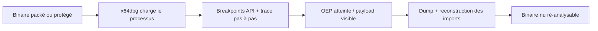
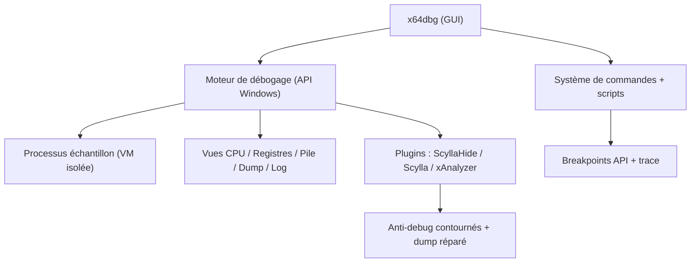

# 🧬 x64dbg — Débogueur assembleur Windows pour malwares

> [!info] **En 1 phrase**
> x64dbg (et son jumeau 32 bits x32dbg) est le débogueur moderne de référence pour dépaqueter les malwares Windows, tracer les appels API et patcher les protections ligne par ligne.

---

## 🧾 Overview

| Champ | Valeur |
|---|---|
| Nom complet | x64dbg (débogueur x64) / x32dbg (débogueur x86) |
| Description | Débogueur open-source pour code natif Windows x64 et x86 : désassemblage, breakpoints API, trace, gestion mémoire, patching, dump + reconstruction d'imports via plugins (Scylla, ScyllaHide, xAnalyzer) |
| Catégorie | 🧬 Malware & Sandbox |
| Sous-catégorie | Reverse engineering — débogage natif |
| Fonction principale | Dépaqueter les malwares, tracer les appels API et patcher les protections sous Windows |
| Type d'outil | Application desktop (GUI) + CLI (`x64dbg.exe -c`) |
| Licence | GPL-3.0 (à vérifier sur le dépôt) |
| Open source / propriétaire | Open source |
| Langage(s) de programmation | C++ (outil) ; analyse ciblée : binaires natifs Windows x86/x64 |
| Développeur / organisation | Équipe x64dbg (Duncan Ogilvie « mrexodia » et contributeurs) |
| Projet officiel | x64dbg/x64dbg |
| Dépôt officiel | https://github.com/x64dbg/x64dbg |
| Documentation officielle | https://github.com/x64dbg/x64dbg/wiki |
| Date de création | 2013 (premiers commits) |
| État du projet | actif (~48 600 étoiles) |
| Dernière version connue | Release 2026.05.27 (à confirmer sur la page Releases) |
| Systèmes compatibles | Windows (7 à 11) ; préinstallé sur Flare VM, utilisable via Wine sur Linux |

> [!note] À vérifier
> La date exacte de la dernière release se confirme sur la page Releases du dépôt GitHub. Les plugins Scylla/ScyllaHide sont des dépôts séparés à télécharger séparément.

---

## 🎯 Concept

x64dbg est un débogueur de code natif **x64 et x86** (x32dbg pour le 32 bits), successeur open-source d'OllyDbg, entièrement pensé pour l'analyse de binaires sous Windows. L'analyste charge l'échantillon, pose des points d'arrêt sur les API sensibles (`VirtualAlloc`, `CreateProcessW`, `WriteProcessMemory`), exécute pas à pas et observe registres, pile, mémoire et structure du programme. L'interface est divisée en vues synchronisées : la vue **CPU** (désassemblage avec curseur d'exécution), les **registres**, la **pile**, le **dump mémoire** et le **log** — chaque vue suit l'exécution en direct. Ses points forts : un moteur de trace fiable, la détection des sections et du point d'entrée, un gestionnaire de mémoire efficace, et une forte communauté de plugins (ScyllaHide contre les anti-debug, xAnalyzer pour la résolution des arguments, Scylla pour le dump des imports et la reconstruction de l'IAT).

Il se place dans la phase d'analyse **statique/dynamique manuelle** : quand une sandbox a confirmé la malveillance mais que le packer cache le code, x64dbg sert à dépaqueter (trouver l'OEP, dumper, réparer les imports) et à comprendre le mécanisme exact (anti-débug, injection, obfuscation). C'est l'outil complémentaire de Ghidra (statique) et de la sandbox (automatique). **Attention :** l'exécution d'un vrai malware dans un débogueur doit toujours se faire dans une VM isolée, jamais sur une machine de production.



---

## 🧠 Concepts fondamentaux

| Concept | Explication |
|---|---|
| OEP (Original Entry Point) | Adresse où le code original reprend la main après dépaquetage ; point de dump pour le binaire nu |
| Breakpoint (software/hardware) | Point d'arrêt sur une adresse ou une API ; le matériel (`bph`) est moins détectable |
| Packer / Crypter | Programme qui compresse/chiffre le binaire original ; le débogage sert à le dérouler |
| IAT (Import Address Table) | Table des imports ; un packer la reconstruit à l'exécution — Scylla la répare au dump |
| Section (PE) | Segments du fichier PE (`.text`, `.data`, UPX0/UPX1…) ; les sections non initialisées indiquent un packer |
| Anti-debug | Mécanismes détectant la présence d'un débogueur (`IsDebuggerPresent`, `NtQueryInformationProcess`, timing) |
| ScyllaHide | Plugin qui neutralise les anti-debug (hooks des API de détection) |
| Scylla | Plugin de dump : reconstruction de l'IAT et du fichier nu |
| xAnalyzer | Plugin de résolution des arguments des fonctions appelées |
| Trace | Exécution automatique (`trace into` / `trace over`) pour suivre un flot sans cliquer pas à pas |
| Run / Step | Reprendre l'exécution jusqu'au breakpoint (F9) ou exécuter une instruction (F8/F7) |
| Patch | Modification des octets d'une instruction (ex. `xor eax, eax` à la place d'un test) |

---

## 🛠️ Installation

Installation portable (pas de setup, pas d'admin requis pour lancer) :

```bash
# Télécharger la release x64dbg.zip depuis GitHub : https://github.com/x64dbg/x64dbg/releases
# Décompresser puis lancer :
x64dbg.exe   # débogueur 64 bits
x32dbg.exe   # débogueur 32 bits (pour les anciens malwares x86)
```

Plugins utiles : **ScyllaHide** (anti-anti-debug), **Scylla** (dump + reconstruction IAT), **xAnalyzer** (analyse des arguments de fonctions), **yara64** (scan YARA en mémoire). Sur **REMnux / Flare VM**, x64dbg est pré-installé ; sous Linux/Kali on peut le faire tourner via Wine mais l'analyse d'échantillons Windows se fait idéalement dans une VM Windows dédiée.

> [!warning] ⚠️ Prérequis & problèmes potentiels
> - **Architecture** : charger un échantillon 32 bits dans x32dbg (et non x64dbg), sinon adresses et registres sont faussés.
> - **Droits** : l'attachement à un processus existant (`-p`) requiert des droits administrateur.
> - **Antivirus** : certains EDR signalent x64dbg ; l'utiliser dans la VM d'analyse.
> - **Plugins** : Scylla/ScyllaHide sont des dépôts séparés à télécharger et placer dans `release/x64/plugins/` ou `release/x32/plugins/`.

---

## ⚙️ Configuration

x64dbg se configure via `Options → Preferences` et par commandes :

| Paramètre | Rôle | Valeur conseillée |
|---|---|---|
| `Options → Preferences → Exceptions` | Gestion des exceptions (page garde du packer) | Ignorer les accès illégaux pour contourner l'anti-debug de page |
| `Options → Preferences → Events` | Arrêt au chargement, DLL load, TLS | Chargement système + TLS désactivés pour la stabilité |
| `Options → Preferences → Disasm` | Rendu du désassembleur | Couleurs et syntaxe au goût |
| `Debug → Options → Settings` | Stratégie d'exécution | Arrêt au point d'entrée |
| Barre de commande | Commandes scriptables | `bpx`, `bp`, `dump`, `trace`, `patch` |
| Scripts (`Scripts → Run Script`) | Automatisation de dépaquetage | Scripts `.txt` exécutés dans le débogueur |

> [!note] À vérifier
> La localisation exacte des réglages varie selon les versions ; le menu `Options → Preferences` et la documentation wiki restent la référence.

---

## 🏗️ Architecture interne

- **Moteur de débogage** : s'appuie sur l'API Debug de Windows (x64/x86) — chargement du processus, breakpoints, pas-à-pas.
- **Vues synchronisées** : CPU (désassemblage), registres, pile, dump mémoire, log — toutes suivent l'EIP/RIP en direct.
- **Désassembleur** : rendu du code natif avec résolution des arguments d'API (xAnalyzer en renfort).
- **Système de commandes** : barre de commande et scripts pour automatiser (breakpoints, traces, patches).
- **Plugins** : SDK C++/Python pour étendre (Scylla, ScyllaHide, yara64, etc.).



---

## ⌨️ Commandes

### Commandes principales

```bash
x64dbg.exe "C:\malware\sample.exe"   # ouvrir un binaire dans le débogueur
x64dbg.exe -p 4821                    # s'attacher à un processus déjà lancé (admin requis)
x64dbg.exe -c "bpx CreateProcessW"    # exécuter une commande dès le chargement
```

Les commandes essentielles se tapent dans la barre de commande du débogueur (ou via raccourcis clavier) :

| Option | Effet |
|---|---|
| `bpx <API>` | Point d'arrêt sur une API (ex. `bpx CreateProcessW`, `bpx VirtualAlloc`) |
| `bp <adresse>` | Point d'arrêt sur une adresse mémoire |
| `run` / `F9` | Reprendre l'exécution jusqu'au prochain breakpoint |
| `step` / `F8` | Pas à pas (entrer dans les appels avec `F7`) |
| `dump <adresse>` | Afficher la mémoire à une adresse (ou `dump eax`) |
| `trace` | Trace automatique (ex. `trace into` / `trace over`) |
| `findall <adresse>` | Rechercher les chaînes référencées (Search → All referenced strings) |
| `patch` / `fill` | Modifier les octets d'une instruction (patcher) |
| `bph <adresse>` | Breakpoint matériel (indétectable par certains anti-debug) |
| `e <adresse>` | Éditer la mémoire à une adresse |
| `r` | Afficher / modifier les registres |
| `x64dbg.exe -c "<commande>"` | Exécuter une commande dès le chargement du binaire |

### Commandes avancées

```bash
# Breakpoints multiples sur les API clés d'un packer
bpx VirtualAlloc
bpx WriteProcessMemory
bpx CreateProcessW
# Trace automatique dans le flux d'exécution
trace over
```

---

## 🎚️ Options et flags

| Option | Description | Exemple | Niveau |
|---|---|---|---|
| `bpx <API>` | Breakpoint sur une API | `bpx IsDebuggerPresent` | Basic |
| `bp <adresse>` | Breakpoint sur une adresse | `bp 00401000` | Basic |
| `bph <adresse>` | Breakpoint matériel | `bph 00401000` | Intermediate |
| `dump <adresse>` | Afficher la mémoire | `dump eax` | Basic |
| `trace into/over` | Trace automatique | `trace into` | Intermediate |
| `findall <adresse>` | Chaînes référencées | `findall eip` | Intermediate |
| `patch <adresse> <octets>` | Patcher une instruction | `patch eip "90 90"` | Advanced |
| `fill <adresse> <taille> <octet>` | Remplir une zone | `fill 00400000 100 00` | Expert |
| `e <adresse>` | Éditer la mémoire | `e 00401000` | Intermediate |
| `x64dbg.exe -p <pid>` | Attacher à un processus | `x64dbg.exe -p 4821` | Advanced |
| `x64dbg.exe -c <cmd>` | Commande au chargement | `x64dbg.exe -c "bpx CreateProcessW"` | Advanced |

> [!tip] Options les plus utiles au quotidien
> `bpx` sur les API clés, `dump eax` (lire les buffers), `findall` (chaînes référencées), `bph` (contourner les anti-debug de breakpoints), Scylla pour le dump final.

---

## 🧪 Exemples pratiques

### Beginner

```bash
# 1. Charger un échantillon 64 bits
x64dbg.exe "C:\malware\sample.exe"
# 2. Breakpoint sur l'API de téléchargement
bpx URLDownloadToFileW
# 3. F9 (run) et observer le log/registres quand l'API est appelée
```

### Intermediate

```bash
# Trouver toutes les chaînes référencées (URLs, clés)
# Menu Search -> All referenced strings (ou findall)
# Patcher une instruction anti-debug
bpx IsDebuggerPresent
# au déclenchement : patch du test en xor eax, eax (retourner "faux")
```

### Advanced

```bash
# Dépaquetage UPX : breakpoints sur VirtualProtect puis repérage du jmp final
bpx VirtualProtect
# (F9 répété) repérer le jmp vers l'OEP, puis dumper avec Scylla
# Scylla : Attach -> OEP -> Get Imports -> Fix Dump
```

### Expert

```bash
# Attachement à un processus en cours (malware déjà lancé)
x64dbg.exe -p 4821
# Trace automatique du flux pour comprendre l'injection
trace into
# Scan YARA en mémoire via le plugin yara64
yara64 -s /opt/rules/malware.yar
```

---

## 🧪 Workflow complet (scénario pas à pas)

1. **Charger l'échantillon** — ouvrir le binaire avec la bonne archi (64 bits dans x64dbg, 32 bits dans x32dbg), dans une VM isolée.

   ```bash
   x64dbg.exe "C:\malware\sample.exe"
   ```

2. **Désactiver les protections** — activer ScyllaHide pour neutraliser les anti-debug basiques (`IsDebuggerPresent`, `NtQueryInformationProcess`, détection de timing).

3. **Poser des breakpoints ciblés** — sur les API qui trahissent le comportement du packer.

   ```bash
   bpx VirtualAlloc
   bpx WriteProcessMemory
   bpx CreateProcessW
   ```

4. **Reprendre et observer** — `F9` jusqu'aux breakpoints, lire registres et pile pour comprendre les arguments et l'ordre des appels.

5. **Trouver l'OEP** — une fois les sections déchiffrées, le dépaquetage se termine par un saut (`jmp`/`ret`) vers le code original : repérer le `jmp` final après le déchiffrement.

6. **Dumper et réparer les imports** — Scylla dump le processus à l'OEP et reconstruit l'IAT : on obtient un binaire propre, re-analysable avec Ghidra et scannable avec YARA.

---

## 🎬 Scénarios avancés

### Scénario 1 : Dépaquetage d'un UPX / crypter maison

Suivre l'exécution jusqu'à l'OEP, dumper proprement, vérifier les imports :

```bash
# 1) bpx VirtualProtect, F9 répété jusqu'au déchiffrement complet
# 2) repérer le jmp final vers le code original (OEP)
# 3) Scylla : 'Attach' -> renseigner l'OEP -> Get Imports -> Fix Dump
# 4) valider le dump avec Ghidra / YARA
```

### Scénario 2 : Contournement d'un anti-debug

Hooker la détection pour poursuivre l'analyse : patcher le test (`IsDebuggerPresent` retournant 0) en NOP puis recharger.

```bash
bpx IsDebuggerPresent
# quand le breakpoint se déclenche, patcher le 'mov eax, 1' en 'xor eax, eax'
# (ou NOP les instructions du test) puis recharger l'échantillon
```

### Scénario 3 : Étude d'une injection de processus

```bash
# Les breakpoints sur les APIs d'injection révèlent la cible et le payload
bpx VirtualAllocEx
bpx WriteProcessMemory
bpx CreateRemoteThread
# Observer les arguments dans la pile à chaque déclenchement
dump esp
```

### Scénario 4 : Extraction d'un payload chiffré au moment du décryptage

```bash
# Breakpoint après la boucle de décryptage : le buffer est en clair
bpx 00401000   # adresse de fin de décryptage repérée au désassemblage
# Lire le buffer avec 'dump' et l'exporter pour re-analyse
```

### Scénario 5 : Scan YARA en mémoire après dépaquetage

```bash
# Une fois l'OEP atteinte, scanner la mémoire du processus
yara64 -s /opt/rules/malware.yar
# puis dumper le binaire nu et le re-scanner statiquement
```

---

## 🛡️ Cybersecurity use cases

| Phase | Utilisation |
|---|---|
| Reverse engineering | Dépaquetage, débogage et patching de malwares natifs |
| Analyse de malware | Compréhension fine des mécanismes (anti-debug, injection) |
| Exploit dev | Reverse de vulnérabilités et vérification de shells |
| CTI | Extraction de configs (URLs, clés) directement en mémoire |
| DFIR | Attachement à un processus en cours pour observer le comportement |
| Sécurité offensive (lab) | Analyse d'échantillons packés dans un environnement contrôlé |

---

## 🎯 MITRE ATT&CK

| Tactique | Technique / Sub-technique | ID | Raison | Détection | Mitigation |
|---|---|---|---|---|---|
| Execution | User Execution : Malicious File | T1204.002 | L'échantillon est exécuté sous le débogueur | Triage e-mail, sandboxing | Contrôles d'exécution |
| Execution | Native API | T1106 | Appels `VirtualAlloc`, `CreateRemoteThread` tracés au débogage | EDR, hooks kernel | Restriction des APIs d'injection |
| Defense Evasion | Obfuscated Files or Information | T1027 | Packers/crypters déroulés et dépaquetés | YARA sur le dump | Mise à jour des signatures |
| Defense Evasion | Deobfuscate/Decode Files or Information | T1140 | Payloads déchiffrés observés en mémoire | Analyse statique + sandbox | AMSI, EDR |
| Defense Evasion | Process Injection | T1055 | Injection suivie via `VirtualAllocEx`/`CreateRemoteThread` | Sysmon EventID 8/10 | Restriction des APIs d'injection |
| Defense Evasion | Masquerading | T1036 | Binaire légitime détourné (svchost, etc.) identifié au débogage | Sysmon, EDR | Contrôles d'intégrité |
| Command & Control | Application Layer Protocol | T1071 | URLs de C2 lues dans la mémoire de l'échantillon | NDR/IPS | Filtrage sortant |

> [!note] Ne renseigner que si l'association est réellement pertinente.
> x64dbg est un **outil d'analyse** : les techniques listées sont celles étudiées/détectées sur les échantillons, pas des techniques mises en œuvre par l'outil.

---

## 🛡️ Defensive Security

### Signes observables

| Indicateur | Détail |
|---|---|
| Appels anti-debug (`IsDebuggerPresent`, `NtQueryInformationProcess`, `NtSetInformationThread`) | Neutraliser via ScyllaHide ou patch manuel, ou analyser dans une VM sans debugger |
| Sections packées (UPX0/UPX1, EP dans une section de données) | Dépaqueter puis re-analyser statiquement le binaire nu |
| Injection (`VirtualAlloc` + `WriteProcessMemory` + `CreateRemoteThread`) | Détecter côté EDR (Sysmon event 8/10), bloquer les appels d'injection |
| CRC/checksum de sections pour détecter les breakpoints | Patcher les checks ou analyser le flux de contrôle sans breakpoints matériels |
| URLs/clés de C2 visibles dans la mémoire à l'OEP | Extraire et publier les IOCs (YARA, MISP) |

### Règles de détection (Sigma / Suricata / Snort / YARA)

```yaml
# Sigma — Windows : exécution d'outils de débogage sur un poste (exemple)
title: Debugger Execution
logsource:
    category: process_creation
    product: windows
detection:
    selection:
        Image|endswith:
            - 'x64dbg.exe'
            - 'x32dbg.exe'
            - 'ollydbg.exe'
            - 'windbg.exe'
    condition: selection
level: medium
```

```yara
// YARA — repérage d'un binaire packé (heuristics) (exemple)
rule Packed_PE_Heuristic
{
    condition:
        uint16(0) == 0x5A4D and
        // EP dans une section non-exécutable ou sections aux noms de packer
        (pe.sections[0].name == "UPX0" or pe.sections[0].name == ".aspack")
}
```

---

## 🤖 Automatisation

```powershell
# PowerShell — lancer x64dbg avec une commande automatique au chargement
Start-Process x64dbg.exe -ArgumentList '"C:\malware\sample.exe" -c "bpx VirtualAlloc; bpx CreateProcessW"'
```

```bash
# Bash — script de dépaquetage UPX (squelette de commandes x64dbg)
# Fichier unpack.script (barre de commande) :
#   bpx VirtualAlloc
#   run
#   bpx VirtualProtect
#   run
#   findall eip
```

> [!note] À vérifier
> x64dbg est essentiellement une GUI ; l'automatisation passe par la barre de commande (`-c`), les scripts, ou le SDK Python (`x64dbgpy`). L'exemple ci-dessus est un squelette à adapter.

---

## 📤 Output et parsing

- **Dump Scylla** : binaire nu reconstruit (fichier `.exe`/`.dll`) re-analysable (Ghidra, YARA, sandbox).
- **Log** : traces des commandes et des événements, exportable.
- **Chaînes référencées** : liste exportable (`findall`) avec les adresses.
- **Patches** : visualisables dans la vue Patch, exportables en fichier.

```bash
# Après dump avec Scylla : valider le binaire nu
file dump_sc1.exe
sha256sum dump_sc1.exe
yara /opt/rules/malware.yar dump_sc1.exe
# Re-analyser avec Ghidra
```

```python
# Python — post-traitement du log x64dbg pour les adresses d'API
import re

with open("x64dbg.log") as f:
    for line in f:
        if re.search(r"VirtualAlloc|CreateRemoteThread|IsDebuggerPresent", line):
            print(line.strip())
```

---

## 🔗 Intégrations

- [[Tools|🧰 Outils]] global
- [[Outil - Ghidra]] — analyse statique du binaire nu dumpé (parfaitement complémentaire)
- [[Outil - Cutter]] — alternative GUI (radare2) pour l'analyse statique
- [[Outil - CAPE]] — la sandbox confirme la malveillance avant le débogage manuel
- [[Outil - Cuckoo Sandbox]] — idem (triage automatique en amont)
- [[Outil - dnSpy]] — analyse du volet .NET d'un même échantillon
- [[Outil - YARA]] — signatures sur le dump et la mémoire du processus
- [[Outil - Sysinternals Suite]] — supervision des processus autour du débogage
- [[Outil - Flare VM]] — VM Windows d'analyse avec x64dbg préinstallé
- [[09 - Reverse Engineering & Malware|🔬 Reverse Engineering & Malware]]

```text
Sandbox (triage) → x64dbg (dépaquetage) → dump nu → Ghidra + YARA → IOCs
```

---

## 🔄 Alternatives

| Outil | Avantages | Inconvénients | Cas d'usage |
|---|---|---|---|
| OllyDbg | Historique, 32 bits très documenté | Obsolète, 32 bits seul | Anciens malwares x86 |
| WinDbg | Débogage kernel et user, extensions | Courbe d'apprentissage raide | Analyse kernel/drivers |
| Ghidra | Décompilation statique, multiplateforme | Pas de débogage natif aussi fin | Analyse statique du dump |
| IDA Pro | Décompilation puissante, débogueurs multiples | Propriétaire, coûteux | Reverse avancé |
| x64dbg (x32dbg) | Open source, moderne, plugins riches | Windows only | Débogage natif — recommandé |

> **Quand utiliser x64dbg plutôt qu'un décompilateur ?** Dès qu'il faut observer l'exécution réelle (dépaquetage, anti-debug, injection) : Ghidra lit le code, x64dbg le fait tourner.

---

## ⚡ Performance

- x64dbg est léger et réactif ; le pas-à-pas manuel est la limite principale (vitesse humaine).
- La trace automatique (`trace into`) est plus rapide que le clic répété mais ralentit sur les boucles longues.
- Les breakpoints matériels (`bph`) ont un coût d'exécution faible mais un nombre limité (4 registres de debug).
- Le scan mémoire YARA après dépaquetage coûte selon la taille de l'empreinte du processus.
- Les plugins (ScyllaHide, xAnalyzer) ajoutent une surcharge au chargement et aux breakpoints.

---

## 🛠️ Troubleshooting

### Common problems

#### Problème : adresses/registres incohérents au débogage

- **Cause** : échantillon 32 bits chargé dans x64dbg (et non x32dbg).
- **Solution** : relancer le binaire dans x32dbg.
- **Vérification** : le bitness affiché correspond au PE (`x64dbg.exe` pour PE64, `x32dbg.exe` pour PE32).

#### Problème : le malware détecte le débogueur et s'arrête

- **Cause** : anti-debug actifs (`IsDebuggerPresent`, timing, NtQueryInformationProcess).
- **Solution** : activer ScyllaHide (profils par packer) ou patcher les checks.
- **Vérification** : les API de détection n'apparaissent plus dans le log.

#### Problème : le dump Scylla plante ou est incomplet

- **Cause** : OEP incorrect ou IAT mal reconstruite.
- **Solution** : refaire Get Imports, vérifier la validité des thunks, réessayer avec `Auto Trace`.
- **Vérification** : `file` + lancement test du dump dans une VM.

#### Problème : l'attachement (`-p`) échoue

- **Cause** : droits insuffisants ou processus protégé.
- **Solution** : lancer x64dbg en administrateur.
- **Vérification** : le processus apparaît dans la liste d'attachement.

#### Problème : le plugin yara64 ne scanne rien

- **Cause** : chemin des règles incorrect ou processus trop grand.
- **Solution** : vérifier le chemin des règles et lancer le scan sur les sections utiles.
- **Vérification** : `yara64 -h` liste les options disponibles.

---

## 🔐 Sécurité de l'outil

- **Détonation réelle** : appuyer sur F9 exécute le malware — uniquement dans une VM isolée jetable.
- **Attachement** : l'attachement (`-p`) est détectable par les anti-debug ; préférer le chargement dès le départ.
- **Artefacts** : les dumps contiennent le malware dépaqueté — les hasher et les conserver dans un emplacement contrôlé.
- **Origine** : télécharger depuis les Releases officielles (x64dbg/x64dbg) et les plugins depuis leurs dépôts.
- **Plugins** : les plugins sont des binaires tiers — vérifier leur origine avant installation.
- **Échantillons** : ne jamais déboguer un échantillon sur un poste de production ou connecté au réseau de prod.

---

## ⚠️ Limitations

- Windows uniquement (Linux via Wine, sans garantie de stabilité).
- Le débogage d'un malware réel demande une VM et de la prudence (détonation).
- Les anti-debug avancés (kernel-level, timing, TLS callbacks) peuvent résister aux plugins de base.
- La reconstruction d'IAT par Scylla échoue sur les protections exotiques (VMProtect, Themida).
- L'automatisation (scripts/SDK) est moins riche que celle d'IDA/WinDbg.
- Pas de décompilation intégrée : l'analyse reste au niveau assembleur (Ghidra en complément).

---

## 📋 Cheatsheet

```bash
# Ouvrir un binaire
x64dbg.exe "C:\malware\sample.exe"

# S'attacher à un processus
x64dbg.exe -p 4821

# Commande au chargement
x64dbg.exe -c "bpx CreateProcessW"

# Breakpoints API
bpx VirtualAlloc
bpx WriteProcessMemory
bpx CreateProcessW

# Breakpoint mémoire / matériel
bp 00401000
bph 00401000

# Exécution / pas à pas
run        # F9
step       # F8
# (F7 pour entrer dans les appels)

# Afficher la mémoire / registres
dump eax
r

# Chaînes référencées
findall eip

# Patcher
patch eip "90 90"

# Dump final avec Scylla (GUI)
# Attach -> OEP -> Get Imports -> Fix Dump
```

---

## ⚡ Quick reference

| | |
|---|---|
| **À quoi sert-il ?** | Déboguer et dépaqueter les malwares natifs Windows (x86/x64) |
| **Quand l'utiliser ?** | Après triage en sandbox, pour dépaqueter et comprendre le mécanisme exact |
| **Commande principale** | `x64dbg.exe "C:\malware\sample.exe"` puis `bpx <API>` |
| **Alternative principale** | OllyDbg (ancien 32 bits) · WinDbg (kernel) · Ghidra (statique) |
| **Concepts importants** | OEP, IAT, packer, anti-debug, ScyllaHide, Scylla, breakpoints API |
| **Liens associés** | [[Outil - Ghidra]] · [[Outil - CAPE]] · [[Outil - dnSpy]] · [[Outil - YARA]] |

---

## 🔍 Détection & Défense

| Signe | Défense |
|---|---|
| Appels anti-debug (`IsDebuggerPresent`, `NtQueryInformationProcess`, `NtSetInformationThread`) | Neutraliser via ScyllaHide ou patch manuel, ou analyser dans une VM sans debugger |
| Sections packées (UPX0/UPX1, EP dans une section de données) | Dépaqueter puis re-analyser statiquement le binaire nu |
| Injection (`VirtualAlloc` + `WriteProcessMemory` + `CreateRemoteThread`) | Détecter côté EDR (Sysmon event 8/10), bloquer les appels d'injection |
| CRC/checksum de sections pour détecter les breakpoints | Patcher les checks ou analyser le flux de contrôle sans breakpoints matériels |
| URLs/clés de C2 visibles dans la mémoire à l'OEP | Extraire et publier les IOCs (YARA, MISP) |

---

## ⚠️ Tips & Pièges

> [!tip] 💡 **Tips**
> - Choisissez toujours la bonne archi : un échantillon 32 bits doit être chargé dans x32dbg, sinon les adresses et registres sont faussés.
> - Utilisez `bpx` sur les API plutôt que des breakpoints au hasard : les appels API sont les points de passage obligés du malware.
> - Dumper avec Scylla (et non les dumpers basiques) : il reconstruit l'IAT et produit un binaire exploitable par Ghidra.
> - Posez un breakpoint sur la fin de la boucle de décryptage : le payload attend en clair dans le buffer.
> - Utilisez les breakpoints matériels (`bph`) contre les anti-debug qui vérifient les breakpoints logiciels.

> [!warning] ⚠️ **Pièges**
> - Ne lancez JAMAIS un vrai malware dans x64dbg sur une machine de prod : à partir du moment où l'on appuie sur F9, il s'exécute.
> - L'attachement (`-p`) est détectable par les protections anti-debug ; préférez charger le binaire dès le départ dans une VM jetable.
> - Un dump avec imports cassés fait planter le binaire extrait : vérifiez toujours la reconstruction Scylla avant de le soumettre à YARA/sandbox.
> - Les protections exotiques (VMProtect, Themida) résistent à un simple dump : il faut du travail manuel et des outils dédiés.

---

## 📚 References

### Official

- Site officiel : https://x64dbg.com/
- Dépôt GitHub : https://github.com/x64dbg/x64dbg
- Wiki/documentation : https://github.com/x64dbg/x64dbg/wiki
- Releases : https://github.com/x64dbg/x64dbg/releases

### Security references

- MITRE ATT&CK T1055 — Process Injection : https://attack.mitre.org/techniques/T1055/
- MITRE ATT&CK T1140 — Deobfuscate/Decode Files or Information : https://attack.mitre.org/techniques/T1140/
- MITRE ATT&CK T1027 — Obfuscated Files or Information : https://attack.mitre.org/techniques/T1027/

### Community

- Scylla (dump + IAT) : https://github.com/NtQuery/Scylla
- ScyllaHide (anti-anti-debug) : https://github.com/x64dbg/ScyllaHide
- Flare VM (VM d'analyse) : https://github.com/mandiant/flare-vm

---

➡️ **Liens :** [[Tools|🧰 Outils]] · [[Outils/Outil - Ghidra|🔬 Ghidra]] · [[Outils/Outil - CAPE|🧬 CAPE]] · [[Outils/Outil - Cuckoo Sandbox|🧬 Cuckoo Sandbox]] · [[Outils/Outil - dnSpy|🧬 dnSpy]] · [[Techniques/09 - Reverse Engineering & Malware|🔬 Reverse Engineering & Malware]]
