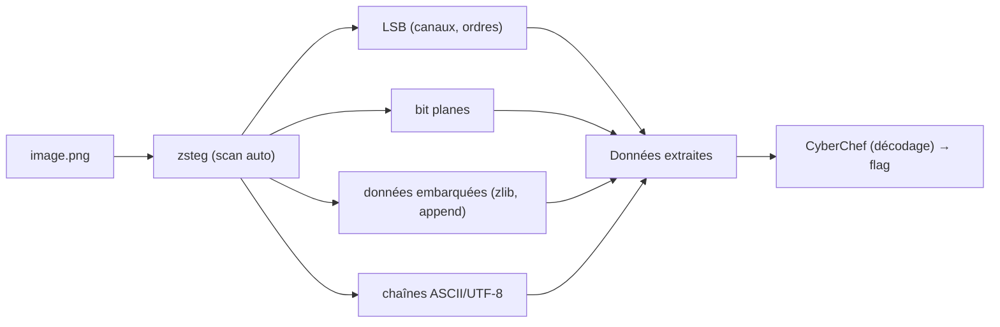

# zsteg — La détection automatique de stéganographie (PNG & BMP)

> [!info] **En 1 phrase**
> Détectez et extrayez en une seule commande les données cachées dans les images PNG/BMP : LSB, bits plans, données embarquées, chaînes.

---

## Overview

| Champ | Valeur |
|---|---|
| Nom complet | zsteg |
| Description | Détecteur/extracteur de stéganographie pour images PNG et BMP (LSB, bit planes, données embarquées, chaînes) |
| Catégorie | CTF & Développement |
| Sous-catégorie | Stéganographie / Forensique |
| Fonction principale | Scanner automatiquement les techniques de dissimulation courantes et révéler les données cachées |
| Type d'outil | CLI Ruby (gem) |
| Licence | MIT |
| Open source / propriétaire | Open source |
| Langage(s) de programmation | Ruby |
| Développeur / organisation | zed-0xff |
| Projet officiel | zed-0xff/zsteg |
| Dépôt officiel | https://github.com/zed-0xff/zsteg |
| Documentation officielle | https://github.com/zed-0xff/zsteg/blob/master/README.md |
| Dernière version connue | 0.2.14 (28 janvier 2026, RubyGem) |
| Systèmes compatients | Linux, macOS, Windows (via Ruby) |

> [!note] À vérifier
> zsteg est distribué en gem Ruby. Le README liste les détections : LSB stego PNG & BMP, zlib-compressed data, OpenStego, Camouflage 1.2.1, LSB Eratosthenes, et l'extraction de chaînes ASCII/UTF-8. Vérifier la version avec `zsteg --help`.

---

## Concept

zsteg est un outil écrit en Ruby qui scanne automatiquement les images (PNG, BMP, parfois GIF/JPEG via des plugins) pour y chercher de la stéganographie. Contrairement à StegSolve (analyse visuelle manuelle), zsteg applique **toutes les techniques courantes en parallèle** : LSB sur chaque canal (RGB/GRB/BGR...), plans de bits, LSB par paires de bits, coordonnées XY vs scanlines, données JPEG/PNG embarquées (append), et même la détection de chaînes ASCII/UTF-8. En un seul passage (`zsteg image.png`), il liste les données cachées trouvées — souvent directement le flag. C'est l'outil de premier choix pour tout challenge stego d'image, avant même l'analyse visuelle manuelle.

Il se place au **début du workflow stego** : on lance `zsteg <image>` pour une détection automatique rapide, puis on confirme avec [[Outil - stegsolve]] (inspection visuelle) et on décode les données extraites avec [[Outil - CyberChef]]. En complément, [[Outil - exiftool]] et [[Outil - binwalk]] couvrent les métadonnées et les fichiers embarqués.



---

## Concepts fondamentaux

| Concept | Explication |
|---|---|
| LSB stego | Message encodé dans le bit de poids faible de chaque pixel/canal |
| Bit plane | Isolation d'un bit (0-7) d'un canal pour visualiser/extraire |
| Canal | Composante couleur (R, G, B, Alpha) — zsteg teste plusieurs ordres (RGB, GRB...) |
| zlib data | Données compressées embarquées dans l'image (parfois le flag compressé) |
| OpenStego | Outil de stégo dont les marques sont détectées par zsteg |
| Camouflage | Outil classique Windows de dissimulation (v1.2.1 détecté) |
| LSB Eratosthenes | Variante LSB utilisant un motif (crible d'Ératosthène) |
| XY vs scanline | Ordre de parcours des pixels : coordonnées ou lignes |
| Prime | Option `-P` : coordonnées basées sur les nombres premiers (Ératosthène) |
| Extract `-E <name>` | Extraction d'une couche précise identifiée par zsteg |

---

## Installation

### Debian / Ubuntu / Kali Linux

```bash
sudo apt install ruby ruby-dev
gem install zsteg
```

### Arch Linux

```bash
sudo pacman -S ruby
gem install zsteg
```

### macOS / Homebrew

```bash
brew install ruby
gem install zsteg
```

### Windows (via Ruby)

```powershell
# Installer Ruby (rubyinstaller.org) puis :
gem install zsteg
```

### Vérification

```bash
zsteg --help
zsteg --version
```

> [!warning] Prérequis & problèmes potentiels
> - Ruby et `gem` requis ; sous Windows utiliser RubyInstaller avec DevKit.
> - Les plugins JPEG/GIF peuvent nécessiter des gemmes supplémentaires (`zsteg` inclut les dépendances de base).
> - Sur certaines distributions, `gem install` requiert les droits root ou un `--user-install`.

---

## Configuration

| Option | Rôle | Valeur possible | Impact | Exemple |
|---|---|---|---|---|
| `-a` / `--all` | Tester toutes les techniques | flag | Scan exhaustif | `zsteg -a image.png` |
| `-E <name>` / `--extract` | Extraire une couche précise | nom de couche | Récupère les données brutes | `zsteg -E 'b1,rgb,lsb' image.png` |
| `-o <order>` / `--order` | Ordre des canaux | `xy`, `yx`... | Parcours des pixels | `zsteg -o xy image.png` |
| `-c <channels>` / `--channels` | Canaux à tester | `rgb`, `rgba`, `r`, `g`... | Réduire le scan | `zsteg -c rgb image.png` |
| `-b <bits>` / `--bits` | Nombre de bits à extraire | `1..8` | Contrôle la profondeur | `zsteg -b 1 image.png` |
| `-l <n>` / `--limit` | Limite de sortie (par défaut 256) | entier | Tronque les données | `zsteg -l 128 image.png` |
| `--lsb` / `--msb` | Sens de lecture des bits | flag | LSB (défaut) ou MSB | `zsteg --msb image.png` |
| `-P` / `--prime` | Coordonnées par nombres premiers | flag | LSB Ératosthène | `zsteg -P image.png` |
| `--shift <n>` | Décalage avant lecture | entier | Données décalées | `zsteg --shift 3 image.png` |
| `--step <n>` | Pas de lecture des pixels | entier | Données espacées | `zsteg --step 2 image.png` |
| `--invert` | Inverser les bits extraits | flag | Négatif des données | `zsteg --invert image.png` |
| `--pixel-align` | Aligner sur les octets de pixels | flag | Données pixel-alignées | `zsteg --pixel-align image.png` |
| `--no-strings` | Ne pas afficher les chaînes | flag | Désactive la recherche de texte | `zsteg --no-strings image.png` |

> [!note] À vérifier
> Les noms exacts des options peuvent varier selon la version de la gem ; consulter `zsteg --help` pour la liste complète.

---

## Architecture interne

- **Gem Ruby** : un exécutable `zsteg` qui charge l'image via les bibliothèques Ruby (chunky_png, zlib...).
- **Moteur de techniques** : zsteg implémente les variantes LSB (1 bit, 2 bits...), les bit planes, l'ordre des canaux, l'ordre XY/scanline, les décalages et pas — appliquées en boucle sur l'image.
- **Détection de plugins** : détection des marques OpenStego, Camouflage 1.2.1, Eratosthenes ; recherche de données compressées zlib.
- **Extraction** : chaque technique produit un « nom de couche » (ex. `b1,rgb,lsb,xy`) ; `-E` permet d'extraire la couche identifiée.
- **Recherche de chaînes** : la sortie standard affiche les chaînes ASCII/UTF-8 lisibles trouvées dans les couches.
- **Limite** : `-l` (défaut 256) borne la sortie pour éviter les faux positifs énormes.

---

## Commandes

### Commandes principales

```bash
# Scan automatique complet
zsteg image.png

# Scan exhaustif (toutes les techniques)
zsteg -a image.png

# Extraire une couche précise
zsteg -E "b1,rgb,lsb,xy" image.png

# Détection sur BMP
zsteg image.bmp
```

| Commande | Objectif | Résultat attendu |
|---|---|---|
| `zsteg <image>` | Scan des techniques courantes | Couches trouvées + chaînes |
| `zsteg -a <image>` | Scan exhaustif | Toutes les combinaisons |
| `zsteg -E "<couche>" <image>` | Extraire une couche | Données brutes de la couche |
| `zsteg -c rgb <image>` | Tester un canal précis | Résultats pour RGB |
| `zsteg -b 2 <image>` | Extraire 2 bits par pixel | Plus de données possibles |
| `zsteg --lsb / --msb <image>` | Forcer le sens de lecture | Extraction LSB ou MSB |
| `zsteg -P <image>` | Mode Ératosthène | LSB basé nombres premiers |
| `zsteg --no-strings <image>` | Ignorer les chaînes | Couches pures |

### Commandes avancées

```bash
# Extraction brute vers un fichier
zsteg -E "b1,rgb,lsb,xy" image.png > flag.bin

# Combiner limit + extraction
zsteg -l 0 -E "b4,rgb,msb,yx" image.png
```

---

## Options et flags

| Option | Description | Exemple | Niveau |
|---|---|---|---|
| `-a` / `--all` | Toutes les techniques | `zsteg -a img.png` | Intermediate |
| `-E <name>` | Extraire une couche | `zsteg -E "b1,rgb,lsb" img.png` | Intermediate |
| `-o <order>` | Ordre xy/yx | `zsteg -o yx img.png` | Advanced |
| `-c <channels>` | Canaux | `zsteg -c rgba img.png` | Advanced |
| `-b <bits>` | Bits par pixel | `zsteg -b 3 img.png` | Advanced |
| `-l <n>` | Limite de sortie | `zsteg -l 512 img.png` | Intermediate |
| `--lsb` / `--msb` | Sens de lecture | `zsteg --msb img.png` | Intermediate |
| `-P` / `--prime` | Nombres premiers | `zsteg -P img.png` | Expert |
| `--shift <n>` | Décalage | `zsteg --shift 5 img.png` | Expert |
| `--step <n>` | Pas | `zsteg --step 3 img.png` | Expert |
| `--invert` | Inverser les bits | `zsteg --invert img.png` | Expert |
| `--pixel-align` | Alignement pixels | `zsteg --pixel-align img.png` | Expert |
| `--no-strings` | Sans chaînes | `zsteg --no-strings img.png` | Intermediate |

> [!tip] Options les plus utiles au quotidien
> `-a` (scan exhaustif), `-E "b1,rgb,lsb,xy"` (extraction type), `-c rgb`/`-c rgba`, `--lsb`/`--msb`, `-l` (limite). Si rien n'est trouvé, tester `--msb`, `-b 2`, et les ordres `-o yx`.

---

## Exemples pratiques

### Beginner

```bash
# Objectif : détection automatique
zsteg image.png
# b1,rgb,lsb,xy : 01100110... → "flag{...}"
```

```bash
# Objectif : scan exhaustif
zsteg -a image.png
```

### Intermediate

```bash
# Objectif : extraire le flag d'une couche identifiée
zsteg -E "b1,rgb,lsb,xy" image.png
```

```bash
# Objectif : limiter la sortie pour éviter le bruit
zsteg -l 200 image.png
```

### Advanced

```bash
# Objectif : forcer MSB (flag encodé en MSB)
zsteg --msb image.png
```

```bash
# Objectif : canal alpha ou ordre différent
zsteg -c rgba -o yx image.png
```

### Expert

```bash
# Objectif : extraction avec décalage/pas
zsteg --shift 4 --step 2 -E "b1,rgb,lsb" image.png
```

---

## Workflow complet (scénario pas à pas)

1. **Étape 1 — Scan automatique** :
   ```bash
   zsteg image.png
   ```
2. **Étape 2 — Si rien, scan exhaustif** :
   ```bash
   zsteg -a image.png
   ```
3. **Étape 3 — Identifier la couche** dans la sortie (ex. `b1,rgb,lsb,xy`) et **l'extraire** :
   ```bash
   zsteg -E "b1,rgb,lsb,xy" image.png > data.bin
   ```
4. **Étape 4 — Analyser les données extraites** :
   ```bash
   file data.bin; strings data.bin | grep -i flag
   ```
5. **Étape 5 — Décoder** (base64/hex/ROT) via [[Outil - CyberChef]] si ce n'est pas du texte clair.
6. **Étape 6 — Vérifier en croisé** avec [[Outil - stegsolve]] (visuel) et [[Outil - binwalk]] (fichiers embarqués) avant de conclure.

---

## Scénarios avancés

### Scénario 1 : flag compressé (zlib)

```bash
zsteg image.png
# Détection : zlib data trouvée → extraction et décompression
zsteg -E "b1,rgb,lsb,xy" image.png | python3 -c "import zlib,sys; print(zlib.decompress(sys.stdin.buffer.read()))"
```

### Scénario 2 : LSB par Ératosthène

```bash
zsteg -P image.png
# LSB avec coordonnées basées sur les nombres premiers
```

### Scénario 3 : données en MSB

```bash
zsteg --msb -a image.png
# Les données peuvent être dans le bit de poids fort (moins courant)
```

### Scénario 4 : multi-couches (extraction et redécodage)

```bash
zsteg -E "b1,r,g,lsb,yx" image.png | base64 -d
# Après extraction, la donnée peut être re-encodée (base64, hex)
```

---

## Cybersecurity use cases

| Phase | Utilisation |
|---|---|
| Analyse de fichiers | Détection rapide de stéganographie LSB/plans |
| CTF / forensique | Extraction automatique des flags d'images |
| OSINT | Vérifier des images téléchargées |
| Défense / DLP | Trier des images suspectes dans des lots |
| Recherche | Heuristiques de détection de stégo |

---

## MITRE ATT&CK

| Tactique | Technique / Sub-technique | ID | Raison | Détection | Mitigation |
|---|---|---|---|---|---|
| Defense Evasion | Obfuscated Files or Information | T1027 | Données cachées dans les images (LSB) | Analyse des images, DLP | Inspection du trafic/fichiers |
| Collection | Data from Local System | T1005 | Extraction de données depuis des images locales | Monitoring des accès fichiers | Moindre privilège |
| Exfiltration | Exfiltration Over Alternative Protocol | T1048 | Exfiltration de données via stéganographie d'images | Analyse du trafic sortant | DLP, filtrage |
| Execution | Command and Scripting Interpreter | T1059 | Scripts Ruby/Python d'analyse | Détection d'exécutions anormales | Restriction interpréteurs |

> [!note] Ne renseigner que si l'association est réellement pertinente.
> zsteg est un outil **d'analyse/détection** : côté attaquant la stéganographie d'images correspond à T1027/T1048 ; côté défense il s'utilise dans les pipelines de détection de fuites.

---

## Defensive Security

### Signes observables

| Indicateur | Détail |
|---|---|
| `zsteg` exécuté sur des images sensibles | Vérification de fuites |
| Images avec bruit structuré en LSB | Stéganographie probable |
| Trafic sortant d'images | Exfiltration potentielle |
| Données extraites inattendues | Fichiers cachés dans les images |

### Règles de détection (Sigma / Suricata / Snort / YARA)

```yaml
# Sigma — utilisation de zsteg sur un endpoint
title: Zsteg Usage
id: a1b2c3d4-e5f6-4a7b-8c9d-0e1f2a3b4c5d
status: experimental
logsource:
    category: process_creation
    product: linux
detection:
    selection:
        Image|endswith: '/zsteg'
    condition: selection
falsepositives:
    - Legitimate CTF and forensics
level: low
```

```yaml
# YARA — heuristique : image PNG contenant une grande zone compressée anormale
rule suspicious_zlib_in_png
{
    strings:
        $zlib = { 78 9c }  # header zlib courant
    condition:
        $zlib and filesize > 10000
}
```

> [!note] À vérifier
> Règles pédagogiques à adapter ; la détection fiable de stégo repose sur l'analyse statistique des plans de bits, pas seulement sur la présence d'outils.

---

## Automatisation

```bash
# Bash — scanner tout un dossier d'images
for img in ./img/*.png; do
    echo "== $img =="
    zsteg "$img" 2>/dev/null | grep -i flag && echo "FOUND in $img"
done
```

```python
# Python — intégrer zsteg dans un pipeline (subprocess)
import subprocess
out = subprocess.run(["zsteg", "-E", "b1,rgb,lsb,xy", "image.png"],
                     capture_output=True, text=True).stdout
print(out)
```

```bash
# Automatiser l'extraction de toutes les couches candidates
zsteg image.png | grep -oE 'b[0-9],[a-z]+,(lsb|msb),(xy|yx)' | sort -u |
while read c; do
    echo "== $c =="; zsteg -E "$c" image.png | head -c 200; echo
done
```

---

## Output et parsing

```bash
# Sortie type : couches trouvées puis chaînes
zsteg image.png
# b1,rgb,lsb,xy : 01100110 01101100 01100001 01100111...
# flag{C0yber0NE}
```

```bash
# Extraction brute pour analyse
zsteg -E "b1,rgb,lsb,xy" image.png > out.bin
file out.bin && strings out.bin
```

```python
# Python — parser les chaînes de la sortie
import subprocess, re
out = subprocess.run(["zsteg", "image.png"], capture_output=True, text=True).stdout
flags = re.findall(r"[Ff]lag\{[^}]+\}", out)
print(flags)
```

---

## Intégrations

```text
Image → zsteg (auto) → stegsolve (visuel, confirmation) → CyberChef (décodage) → flag
```

- [[Tools| Outils]]
- [[Outil - stegsolve]] — analyse visuelle complémentaire des plans
- [[Outil - exiftool]] — métadonnées avant scan stego
- [[Outil - binwalk]] — fichiers embarqués (append, blobs)
- [[Outil - CyberChef]] — décodage des données extraites
- [[10 - Cheatsheets| Cheatsheets]]

---

## Alternatives

| Outil | Avantages | Inconvénients | Cas d'usage |
|---|---|---|---|
| zsteg | Automatique, rapide, multi-techniques | PNG/BMP essentiellement | Détection rapide |
| StegSolve | Visuel, pédagogique | Manuel, GUI | Inspection des plans |
| binwalk | Extraction de blobs | Pas d'analyse LSB | Fichiers embarqués |
| steghide | Extraction/dissimulation standard | Formats limités | JPEG/audio |
| Python (PIL/numpy) | Contrôle total | Code à écrire | Pipelines custom |
| openstego / camouflagedetection | Détection spécifique | Ciblé | Marques OpenStego/Camouflage |

> **Quand utiliser StegSolve plutôt que zsteg ?** Quand zsteg ne trouve rien et que le message est « visible » (QR, texte, image cachée dans les plans) : l'œil humain bat l'automatisation sur ces cas.

---

## Performance

- **Rapide** : un scan `zsteg <image>` sur une image CTF standard prend moins d'une seconde.
- **`-a` exhaustif** : beaucoup de combinaisons (canaux × bits × ordres) — quelques secondes selon la taille.
- **Limite** : `-l` borne la sortie ; pour les très grandes images, réduire les canaux testés (`-c`).
- **Ruby** : les performances dépendent de la taille de l'image (décodage chunky_png) ; les images de plusieurs Mo restent rapides.

> [!note] À vérifier
> Les temps dépendent de la taille de l'image et de la machine ; pas de benchmark officiel.

---

## Troubleshooting

### Common problems

#### Problème : zsteg ne trouve rien

- **Cause** : technique non couverte (MSB, couches multiples, autre format).
- **Solution** : essayer `-a`, `--msb`, `-b 2`, `-o yx`, puis confirmer avec [[Outil - stegsolve]]. **Vérif** : inspecter les plans visuellement.

#### Problème : erreur « NoMethodError » ou dépendance manquante

- **Cause** : gem installée sans dev headers ou Ruby incomplet.
- **Solution** : `gem install zsteg` (réinstaller), `sudo apt install ruby-dev`. **Vérif** : `zsteg --version`.

#### Problème : le format n'est pas supporté (JPEG/TIFF)

- **Cause** : zsteg cible PNG/BMP.
- **Solution** : convertir en PNG (`convert img.jpg img.png`) ou utiliser steghide/binwalk. **Vérif** : `file img`.

#### Problème : sortie énorme (faux positifs)

- **Cause** : données aléatoires interprétées comme du texte.
- **Solution** : réduire avec `-l`, filtrer `-c`, `--no-strings`, et chercher le pattern `flag{`. **Vérif** : comparer avec un fichier sain.

---

## Sécurité de l'outil

- **Exécution locale** : zsteg ne fait pas d'appels réseau ; les images sont lues localement.
- **Données extraites** : ne jamais exécuter un fichier extrait sans l'analyser (`file`, `strings`, sandbox).
- **Gem d'origine** : installer depuis rubygems.org ; vérifier l'intégrité des gemmes dans les pipelines sensibles.

---

## Limitations

- **Formats** : pensé pour **PNG et BMP** ; le JPEG/GIF n'est pas toujours supporté.
- **Techniques** : ne couvre pas tout (LSB d'ordre supérieur, stégo de palette complexe, fichiers audio).
- **Faux positifs** : les données aléatoires peuvent apparaître comme des chaînes — vérifier la structure du flag.
- **Pas d'analyse visuelle** : ne remplace pas [[Outil - stegsolve]] pour les QR/images cachées.
- **Ruby requis** : dépendance à installer sur la machine.

---

## Cheatsheet

```bash
# Scan automatique
zsteg image.png
# Scan exhaustif
zsteg -a image.png
# Extraire une couche
zsteg -E "b1,rgb,lsb,xy" image.png
# Sortie limitée
zsteg -l 256 image.png
# MSB
zsteg --msb image.png
# Canal/ordre spécifiques
zsteg -c rgba -o yx image.png
# Bits multiples
zsteg -b 2 image.png
# Ératosthène
zsteg -P image.png
# Sans chaînes
zsteg --no-strings image.png
# Export brut
zsteg -E "b1,rgb,lsb,xy" image.png > out.bin
```

---

## Quick reference

| | |
|---|---|
| **À quoi sert-il ?** | Détecter/extrayer automatiquement les données cachées dans les images PNG/BMP |
| **Quand l'utiliser ?** | Première commande sur toute image suspecte (avant l'analyse visuelle) |
| **Commande principale** | `zsteg image.png` puis `zsteg -E "<couche>"` |
| **Alternative principale** | [[Outil - stegsolve]] (visuel), binwalk, steghide |
| **Concepts importants** | LSB, bit plane, couche, `-E`, OpenStego, Eratosthenes, zlib |
| **Liens associés** | [[Outil - stegsolve]] · [[Outil - binwalk]] · [[Outil - exiftool]] |

---

## Détection & Défense

| Signe | Défense |
|---|---|
| Bruit structuré en LSB d'images | Inspection des images entrantes/sortantes |
| zsteg sur un endpoint | Supervision des outils forensiques |
| Trafic sortant d'images suspectes | DLP + analyse du contenu |
| Fichiers image anormalement gros | Vérifier les octets supplémentaires (binwalk) |

---

## Tips & Pièges

> [!tip] **Tips**
> - Lancez toujours `zsteg <image>` **en premier** : c'est le plus rapide pour trouver le flag LSB classique.
> - La couche `b1,rgb,lsb,xy` est la plus courante : testez son extraction `-E` directement.
> - Si rien, augmentez `-b` (2, 4 bits) et essayez `--msb`.
> - Le flag peut être codé en **base64** ou **rot13** dans les bits : décodez la sortie extraite avant de conclure.
> - Croisez avec [[Outil - stegsolve]] pour les couches visuelles (QR, images) que zsteg ne lit pas.

> [!warning] **Pièges**
> - zsteg cible PNG/BMP : sur un JPEG, convertir en PNG ou changer d'outil.
> - Les données aléatoires produisent des faux positifs : cherchez la structure `flag{...}`.
> - `-l` (défaut 256) peut tronquer un flag long : augmentez la limite si la chaîne semble coupée.
> - L'ordre de lecture (xy/yx, lsb/msb) change le résultat : testez toutes les combinaisons.
> - Une couche « trouvée » n'est pas forcément le flag : décodez/analysez avant de conclure.

---

## References

### Official

- Dépôt officiel : https://github.com/zed-0xff/zsteg
- README : https://github.com/zed-0xff/zsteg/blob/master/README.md
- Gem RubyGems : https://rubygems.org/gems/zsteg

### Security references

- MITRE ATT&CK T1027 — Obfuscated Files or Information : https://attack.mitre.org/techniques/T1027/
- MITRE ATT&CK T1005 — Data from Local System : https://attack.mitre.org/techniques/T1005/
- MITRE ATT&CK T1048 — Exfiltration Over Alternative Protocol : https://attack.mitre.org/techniques/T1048/

### Community

- HackTricks — stéganographie : https://book.hacktricks.xyz/crypto-and-stego
- wiki.bi0s.in — stego : https://wiki.bi0s.in/cryptography/steganography/
- CTF 101 — steganography : https://ctf101.org/forensics/what-is-stegonography/

---

**Liens :** [[Tools| Outils]] · [[Outil - stegsolve| StegSolve]] · [[Outil - binwalk| binwalk]] · [[Outil - exiftool| ExifTool]] · [[Outil - CyberChef| CyberChef]] · [[Outil - Ghidra| Ghidra]] · [[Outil - hashcat| hashcat]] · [[Outil - John the Ripper| John the Ripper]]
