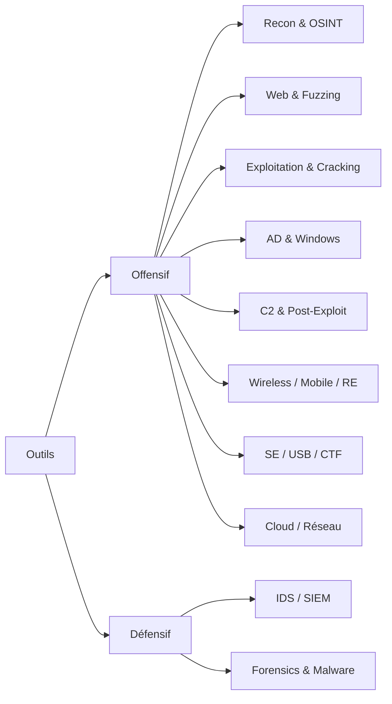

# Bibliothèque d'Outils — Index

> [!info] **C'est quoi ?**
> Chaque fiche décrit **un outil de cybersécurité en détail** : concept, installation, commandes
> essentielles, workflow pas à pas, détection & défense, pièges. Outils **offensifs** et **défensifs**,
> des plus connus aux plus méconnus, toutes familles confondues.



---

## Vue dynamique par catégorie (Dataview)

> [!info] Tableau auto-généré : chaque nouvel outil créé apparaît ici sans toucher à ce fichier.

```dataview
TABLE WITHOUT ID
  length(rows) AS "Outils"
FROM "Cybersécurité Offensive/Outils"
WHERE type = "outil"
GROUP BY categorie AS "Catégorie"
SORT length(rows) DESC
```

---

## Reconnaissance & OSINT

| Outil | Rôle |
|---|---|
| [[Outil - Amass|Amass]] | Amass (OWASP) est l'outil de référence pour l'énumération de sous-domaines : il agrège ... |
| [[Outil - Censys|Censys]] | Censys indexe en continu les hôtes, services, certificats et vulnérabilités du monde en... |
| [[Outil - chaos|chaos]] | chaos donne accès aux datasets DNS de ProjectDiscovery pour retrouver passivement l'his... |
| [[Outil - dnsx|dnsx]] | dnsx interroge en masse tous les types d'enregistrements DNS et valide les sous-domaine... |
| [[Outil - gau|gau]] | gau collecte toutes les URLs connues d'un domaine en interrogeant Wayback, Common Crawl... |
| [[Outil - httpx|httpx]] | httpx transforme une liste de domaines et d'IPs en inventaire des services web vivants,... |
| [[Outil - katana|katana]] | katana parcourt les sites web (SPA comprises) et en extrait les URLs, endpoints et rout... |
| [[Outil - Maltego|Maltego]] | Maltego est un outil de « link analysis » qui visualise sous forme de graphe les relati... |
| [[Outil - Masscan|Masscan]] | Masscan est le scanner de ports le plus rapide au monde : jusqu'à 10 millions de ports/... |
| [[Outil - naabu|naabu]] | naabu scan les ports de milliers d'hôtes en quelques secondes et alimente directement h... |
| [[Outil - Nmap|Nmap]] | Nmap (« Network Mapper ») est le scanner de ports de référence pour cartographier un ré... |
| [[Outil - Recon-ng|Recon-ng]] | Recon-ng est un framework de reconnaissance modulaire en ligne de commande (Tim Tomes /... |
| [[Outil - RustScan|RustScan]] | RustScan est un scanner de ports ultra-rapide écrit en Rust qui découvre tous les ports... |
| [[Outil - Shodan|Shodan]] | Shodan est un moteur de recherche qui indexe les bannières de tous les appareils connec... |
| [[Outil - Shodan CLI|Shodan CLI]] | Shodan indexe les bannières de millions de services (RDP, SSH, caméras, bases de donnée... |
| [[Outil - spiderfoot|spiderfoot]] | SpiderFoot est une plateforme OSINT automatisée qui combine plus de 200 modules (DNS, w... |
| [[Outil - subfinder|subfinder]] | subfinder agrège des dizaines de sources OSINT pour retrouver tous les sous-domaines d'... |
| [[Outil - theHarvester|theHarvester]] | theHarvester est un outil OSINT qui collecte emails, noms d'utilisateurs, hôtes et sous... |
| [[Outil - waybackurls|waybackurls]] | waybackurls remonte le temps pour retrouver toutes les URLs qu'un domaine a exposées, g... |

## Scan Web & Fuzzing

| Outil | Rôle |
|---|---|
| [[Outil - Burp Extensions (BApp Store)|Burp Extensions (BApp Store)]] | Le BApp Store est la boutique d'extensions officielle de Burp Suite : une galerie d'ext... |
| [[Outil - Burp Suite|Burp Suite]] | Burp Suite = le proxy d'interception web de référence : on s'intercale entre le navigat... |
| [[Outil - Caido|Caido]] | Caido est une alternative moderne, ultra-légère et rapide à Burp Suite, écrite en Rust ... |
| [[Outil - dirsearch|dirsearch]] | dirsearch est un scanner de répertoires web écrit en Python, riche en options de sortie... |
| [[Outil - Feroxbuster|Feroxbuster]] | Feroxbuster est un brute-forcer de répertoires écrit en Rust, très rapide, avec récursi... |
| [[Outil - ffuf|ffuf]] | ffuf est un fuzzer web ultra-rapide en Go, basé sur le mot-clé `FUZZ`, pour découvrir r... |
| [[Outil - gobuster|gobuster]] | gobuster brute-force les répertoires, les hôtes virtuels (vhosts) et les sous-domaines ... |
| [[Outil - mitmproxy|mitmproxy]] | mitmproxy est un proxy d'interception TLS ultra-puissant et 100 % scriptable en Python,... |
| [[Outil - nikto|nikto]] | nikto est un scanner de serveurs web ancien mais efficace pour détecter fichiers danger... |
| [[Outil - nuclei|nuclei]] | nuclei est un scanner de vulnérabilités piloté par des templates YAML, ultra-rapide, co... |
| [[Outil - OWASP ZAP|OWASP ZAP]] | OWASP ZAP (Zed Attack Proxy) est le scanner de sécurité web open source de référence : ... |
| [[Outil - wfuzz|wfuzz]] | wfuzz est un fuzzer web en Python qui remplace le mot-clé `FUZZ` dans les URL, headers,... |
| [[Outil - wpscan|wpscan]] | wpscan est un scanner WordPress qui énumère plugins, thèmes et utilisateurs, et détecte... |

## Exploitation & Cracking

| Outil | Rôle |
|---|---|
| [[Outil - CrackMapExec|CrackMapExec]] | CrackMapExec, désormais **NetExec (`nxc`)**, = la boîte à outils post-exploitation Acti... |
| [[Outil - hashcat|hashcat]] | Hashcat = le cracker de hashes le plus rapide : GPU (CUDA/OpenCL) et CPU, 500+ modes (`... |
| [[Outil - hashid|hashid]] | hashID est un script Python qui identifie le type d'un hash à partir de signatures (lon... |
| [[Outil - hash-identifier|hash-identifier]] | hash-identifier est le petit script interactif préinstallé sur Kali qui, en collant un ... |
| [[Outil - hydra|hydra]] | Hydra = brute-force de login multi-protocoles : il teste des couples user/mot de passe ... |
| [[Outil - John the Ripper|John the Ripper]] | John the Ripper = cracker **CPU** historique, réputé pour la détection **automatique du... |
| [[Outil - LinPeas|LinPeas]] | LinPEAS (Linux Privilege Escalation Awesome Script) est le script d'énumération de réfé... |
| [[Outil - Medusa|Medusa]] | Medusa = brute-force en ligne **massivement parallèle**, alternative moins connue à hyd... |
| [[Outil - Name-That-Hash|Name-That-Hash]] | Name-That-Hash identifie instantanément le type d'un hash inconnu et affiche directemen... |
| [[Outil - ncrack|ncrack]] | ncrack est l'outil de cracking réseau haute vitesse de la suite Nmap : il brute-force l... |
| [[Outil - Patator|Patator]] | Patator = brute-force/fuzzing multi-thread **hautement customisable** : mêmes objectifs... |
| [[Outil - SearchSploit|SearchSploit]] | SearchSploit = la base **Exploit-DB en local** : chercher, copier et exploiter des expl... |
| [[Outil - sqlmap|sqlmap]] | sqlmap = l'outil d'exploitation automatique des injections SQL : détection de la techni... |

## Active Directory & Windows

| Outil | Rôle |
|---|---|
| [[Outil - BloodHound|BloodHound]] | BloodHound est un outil de **cartographie graphique d'Active Directory** : il collecte ... |
| [[Outil - Evil-WinRM|Evil-WinRM]] | Evil-WinRM est un **shell WinRM en Ruby** : il se connecte aux machines Windows via le ... |
| [[Outil - Impacket|Impacket]] | Impacket est un framework Python qui implémente les protocoles Windows (SMB, Kerberos, ... |
| [[Outil - Kerbrute|Kerbrute]] | Kerbrute est un outil Go d'**énumération et de brute-force Kerberos** : il valide des n... |
| [[Outil - Mimikatz|Mimikatz]] | Mimikatz est l'outil de référence de la post-exploitation Windows : il extrait les iden... |
| [[Outil - mitm6|mitm6]] | mitm6 empoisonne **IPv6/DHCPv6** : il se fait désigner comme **DNS** et **WPAD** par le... |
| [[Outil - Responder|Responder]] | Responder empoisonne les protocoles de résolution de noms **LLMNR, NBT-NS et mDNS** pou... |
| [[Outil - Rubeus|Rubeus]] | Rubeus est un **toolkit Kerberos en C#** (GhostPack) qui s'exécute en mémoire sur un po... |

## C2 & Post-Exploitation

| Outil | Rôle |
|---|---|
| [[Outil - Chisel|Chisel]] | Chisel est un tunnel TCP/UDP encapsulé dans une connexion HTTP via WebSocket : un clien... |
| [[Outil - Covenant|Covenant]] | Covenant est un framework C2 open-source écrit en C#/.NET avec une interface web complè... |
| [[Outil - Havoc|Havoc]] | Havoc est un framework C2 moderne, gratuit et open-source, très proche de Cobalt Strike... |
| [[Outil - Ligolo-ng|Ligolo-ng]] | Ligolo-ng est un outil de tunneling et de pivoting « reverse » : un agent tourne sur la... |
| [[Outil - Metasploit|Metasploit]] | Metasploit Framework est le framework d'exploitation open-source le plus utilisé : rech... |
| [[Outil - Mythic|Mythic]] | Mythic est un framework C2 open-source cross-platform basé sur une UI web, qui exécute ... |
| [[Outil - PowerShell Empire|PowerShell Empire]] | Empire (Empire Starkiller / BC Security fork) est un framework de post-exploitation et ... |
| [[Outil - Sliver|Sliver]] | Sliver est un framework C2 open-source écrit en Go, pensé comme un remplaçant moderne d... |

## Wireless & Réseau

| Outil | Rôle |
|---|---|
| [[Outil - aircrack-ng|aircrack-ng]] | Suite de référence pour le **pentest WiFi** : capture des handshakes WPA/WPA2, attaques... |
| [[Outil - bettercap|bettercap]] | Framework de **MITM (Man-in-The-Middle)** moderne : spoofing ARP, reniflage de trafic, ... |
| [[Outil - hcxdumptool|hcxdumptool]] | Outil de **capture PMKID/handshake** en mode moniteur, conçu pour produire des captures... |
| [[Outil - Kismet|Kismet]] | Détecteur **passif** de signaux **WiFi, Bluetooth et SDR**, avec interface web, logging... |
| [[Outil - mdk4|mdk4]] | Outil de **DoS WiFi** par injection massive : déauthentification de masse, **beacon flo... |
| [[Outil - Reaver|Reaver]] | Outil d'attaque **WPS (Wi-Fi Protected Setup)** par brute force du PIN de 8 chiffres, c... |
| [[Outil - Wifiphisher|Wifiphisher]] | Outil d'**evil twin / rogue AP** qui clône un réseau WiFi et sert un **portail captif d... |
| [[Outil - Wifite|Wifite]] | Script d'attaque WiFi **entièrement automatisé** : scan des réseaux, sélection automati... |

## Mobile & Reverse Engineering

| Outil | Rôle |
|---|---|
| [[Outil - APKTool|APKTool]] | **apktool** décompile puis recompile un APK Android pour **lire le code smali, décoder ... |
| [[Outil - Cutter|Cutter]] | **Cutter** est l'**interface graphique** de radare2 : désassemblage, **vue graphe**, dé... |
| [[Outil - Frida|Frida]] | Frida est la **boîte à outils d'instrumentation dynamique** de référence : il injecte d... |
| [[Outil - Ghidra|Ghidra]] | **Ghidra** est le framework de **reverse engineering** open-source de la NSA : analyseu... |
| [[Outil - jadx|jadx]] | **jadx** est le décompilateur **Java/Dalvik** le plus pratique : il transforme le bytec... |
| [[Outil - MobSF|MobSF]] | **MobSF (Mobile Security Framework)** est une plateforme web d'analyse **statique et dy... |
| [[Outil - objection|objection]] | **objection** est une surcouche interactive sur Frida qui automatise le hacking runtime... |
| [[Outil - radare2|radare2]] | **radare2 (r2)** est un framework de reverse engineering **100% CLI** : analyse, désass... |

## Social Engineering & Phishing

| Outil | Rôle |
|---|---|
| [[Outil - BeEF|BeEF]] | BeEF est un framework de test d'intrusion qui transforme le navigateur d'une victime en... |
| [[Outil - CredSniper|CredSniper]] | CredSniper est un framework de phishing en Python/Flask qui supporte la capture d'ident... |
| [[Outil - Evilginx2|Evilginx2]] | Evilginx2 est un framework de phishing avancé qui agit comme un reverse proxy entre la ... |
| [[Outil - GoPhish|GoPhish]] | GoPhish est un framework web open source qui permet de créer, envoyer et suivre des cam... |
| [[Outil - King-Phisher|King-Phisher]] | King-Phisher est un framework open source pour créer, déployer et analyser des campagne... |
| [[Outil - Modlishka|Modlishka]] | Modlishka est un reverse proxy de phishing avancé qui réplique des sites entiers en tem... |
| [[Outil - SET|SET]] | Le Social-Engineer Toolkit (SET) est la boîte à outils open source de référence pour au... |
| [[Outil - SocialFish|SocialFish]] | SocialFish est un outil de phishing en Python (Flask) qui clone un site web, génère une... |
| [[Outil - Weeman|Weeman]] | Weeman est un petit outil en Python qui clone une page de connexion HTTP, la sert sur u... |
| [[Outil - XSStrike|XSStrike]] | XSStrike est un framework de détection et d'exploitation XSS en Python : crawler, moteu... |

## USB / HID & Gadgets

| Outil | Rôle |
|---|---|
| [[Outil - Bash Bunny|Bash Bunny]] | Une clé USB « quad-core » qui combine **injection HID**, **émulation de stockage**, **a... |
| [[Outil - Duckuino|Duckuino]] | Un convertisseur qui transforme un script **Duckyscript** en **sketch Arduino** (.ino) ... |
| [[Outil - Flipper Zero (USB & radio)|Flipper Zero (USB & radio)]] | Le Flipper Zero est un couteau suisse de pentest physique : BadUSB (clavier HID), RFID/... |
| [[Outil - Hak5 Payload Studio|Hak5 Payload Studio]] | L'IDE officiel et gratuit de Hak5 (en ligne) pour écrire, compiler et partager des payl... |
| [[Outil - O.MG Cable|O.MG Cable]] | Un câble de charge USB-C/Lightning parfaitement innocent… mais qui embarque un **implan... |
| [[Outil - P4wnP1 A.L.O.A.|P4wnP1 A.L.O.A.]] | Un firmware (mame82) qui transforme une **Raspberry Pi Zero W** en gadget USB composite... |
| [[Outil - USB Host Shield|USB Host Shield]] | Un shield Arduino (MAX3421E) qui transforme l'Arduino en **hôte USB** : intercalé entre... |
| [[Outil - USB Rubber Ducky|USB Rubber Ducky]] | Un gadget USB qui se fait passer pour un **clavier** et frappe un script « Duckyscript ... |
| [[Outil - WiFi Pineapple|WiFi Pineapple]] | Une plateforme sans-fil (OpenWrt) conçue pour créer des **points d'accès rogues** : ell... |

## CTF & Développement

| Outil | Rôle |
|---|---|
| [[Outil - binwalk|binwalk]] | Scannez, identifiez et extrayez les fichiers et firmwares cachés dans une image ou un b... |
| [[Outil - CyberChef|CyberChef]] | La « Cyber Cheesecake Factory » : un outil web pour chaîner décodages, encodages, trans... |
| [[Outil - exiftool|exiftool]] | Lire, écrire et manipuler les métadonnées (EXIF, IPTC, XMP...) de tout type de fichier ... |
| [[Outil - gdb-peda|gdb-peda]] | GDB avec une interface colorée et des commandes d'exploitation intégrées (checksec, pat... |
| [[Outil - pwntools|pwntools]] | La boîte à outils Python ultime pour construire des payloads, interagir avec des binair... |
| [[Outil - ROPgadget|ROPgadget]] | Cherchez dans un binaire tous les « gadgets » (morceaux de code réutilisables) et génér... |
| [[Outil - RsaCtfTool|RsaCtfTool]] | Attaque automatique des cryptosystèmes RSA fragiles : si `n`, `e`, `c` (ou `p`, `q`) tr... |
| [[Outil - stegsolve|stegsolve]] | Passez une image pixel par pixel, plan de bits par plan de bits, pour révéler le flag i... |
| [[Outil - zsteg|zsteg]] | Détectez et extrayez en une seule commande les données cachées dans les images PNG/BMP ... |

## Wordlists & Générateurs

| Outil | Rôle |
|---|---|
| [[Outil - BruteDum|BruteDum]] | BruteDum est un script Python interactif qui orchestre Hydra, Medusa et Ncrack pour bru... |
| [[Outil - CeWL|CeWL]] | CeWL spider un site web et en extrait tous les mots, e-mails et métadonnées pour créer ... |
| [[Outil - Crunch|Crunch]] | Crunch génère toutes les combinaisons possibles à partir d'une longueur (min/max) et d'... |
| [[Outil - CUPP|CUPP]] | CUPP interroge une série de questions sur la cible (nom, naissance, enfants, animaux, v... |
| [[Outil - kwprocessor|kwprocessor]] | kwprocessor, l'outil C officiel du projet hashcat, génère des mots de passe formés par ... |
| [[Outil - Mentalist|Mentalist]] | Mentalist est un générateur de wordlists en GUI Windows qui applique des mutations visu... |
| [[Outil - OneRuleToRuleThemAll|OneRuleToRuleThemAll]] | OneRuleToRuleThemAll est un fichier de règles hashcat (`.rule`) qui regroupe des millie... |
| [[Outil - pydictor|pydictor]] | pydictor est un générateur de wordlists Python ultra-complet : jeux de caractères, soci... |
| [[Outil - rsmangler|rsmangler]] | rsmangler prend une petite liste de mots (noms, marques, produits) et la transforme en ... |
| [[Outil - SecLists|SecLists]] | SecLists est la boîte à listes de référence du testeur d'intrusion : usernames, mots de... |

## Distributions & Lab

| Outil | Rôle |
|---|---|
| [[Outil - BlackArch|BlackArch]] | BlackArch est un dépôt et une distribution basée sur Arch Linux fournissant plus de 290... |
| [[Outil - Commando VM|Commando VM]] | Commando VM (FireEye/Mandiant) est une machine virtuelle Windows préconfigurée embarqua... |
| [[Outil - Flare VM|Flare VM]] | Flare VM est une distribution Windows (FireEye/Mandiant) entièrement dédiée à l'analyse... |
| [[Outil - Kali Linux|Kali Linux]] | Kali Linux est la distribution offensive de référence, basée sur Debian, embarquant plu... |
| [[Outil - Parrot OS|Parrot OS]] | Parrot OS est une distribution basée sur Debian qui combine outils de pentest (600+) et... |
| [[Outil - REMnux|REMnux]] | REMnux est une distribution Ubuntu dédiée à l'analyse de malwares (static et dynamique)... |
| [[Outil - SIFT Workstation|SIFT Workstation]] | SIFT Workstation est une distribution Linux (Ubuntu, SANS) spécialisée dans l'investiga... |
| [[Outil - Tails OS|Tails OS]] | Tails OS est un système d'exploitation live USB amnésique basé sur Debian qui achemine ... |

## Cloud & Containers

| Outil | Rôle |
|---|---|
| [[Outil - cloudfox|cloudfox]] | CLI de pénétration cloud de Bishop Fox qui cartographie les chemins de confiance (IAM, ... |
| [[Outil - kubectl|kubectl]] | La CLI de contrôle de Kubernetes : une fois un kubeconfig en main, elle te donne les cl... |
| [[Outil - Pacu|Pacu]] | Framework post-exploitation open source qui te permet de lancer des modules d'exploitat... |
| [[Outil - Prowler|Prowler]] | Outil de sécurité cloud qui audite AWS, Azure et GCP contre les benchmarks CIS, NIST, P... |
| [[Outil - ScoutSuite|ScoutSuite]] | Suite d'audit open source (successeur de Scout2) qui génère un rapport HTML navigable d... |

## Réseau & Capture

| Outil | Rôle |
|---|---|
| [[Outil - Hping3|Hping3]] | hping3 assemble et envoie des paquets TCP/IP entièrement personnalisés (flags, adresses... |
| [[Outil - nload|nload]] | nload est un moniteur console en temps réel du trafic réseau, qui affiche sous forme de... |
| [[Outil - Scapy|Scapy]] | Scapy est une bibliothèque Python capable de créer, envoyer, intercepter, disséquer et ... |
| [[Outil - tcpdump|tcpdump]] | tcpdump est l'outil de capture et d'analyse de paquets en ligne de commande, léger, omn... |
| [[Outil - tcpreplay|tcpreplay]] | tcpreplay rejoue des captures pcap sur un réseau réel à un débit contrôlé, en réécrivan... |
| [[Outil - tshark|tshark]] | tshark est la version CLI de Wireshark : le même moteur de décodage, mais scriptable, i... |
| [[Outil - Wireshark|Wireshark]] | Wireshark est l'analyseur de protocoles de référence pour inspecter en profondeur chaqu... |

## Malware & Sandbox

| Outil | Rôle |
|---|---|
| [[Outil - CAPE|CAPE]] | CAPE (Config And Payload Extraction) est la sandbox qui prolonge Cuckoo en dépaquetant ... |
| [[Outil - Cuckoo Sandbox|Cuckoo Sandbox]] | Cuckoo Sandbox est le framework open-source de référence pour exécuter un malware dans ... |
| [[Outil - dnSpy|dnSpy]] | dnSpy est le débogueur/décompilateur .NET qui permet de lire un malware C# en pseudo-co... |
| [[Outil - FakeNet-NG|FakeNet-NG]] | FakeNet-NG (FireEye/Mandiant) redirige tout le trafic réseau d'un malware vers de faux ... |
| [[Outil - oletools|oletools]] | oletools est la boîte à outils Python de référence pour inspecter les fichiers Office (... |
| [[Outil - Process Hacker|Process Hacker]] | Process Hacker est un gestionnaire de tâches open-source détaillé qui révèle processus,... |
| [[Outil - Sysinternals Suite|Sysinternals Suite]] | Sysinternals Suite regroupe les utilitaires Microsoft (Process Explorer, Procmon, Autor... |
| [[Outil - unblob|unblob]] | unblob est l'outil le plus précis pour identifier et extraire les systèmes de fichiers ... |
| [[Outil - x64dbg|x64dbg]] | x64dbg (et son jumeau 32 bits x32dbg) est le débogueur moderne de référence pour dépaqu... |

## IDS / SIEM / EDR

| Outil | Rôle |
|---|---|
| [[Outil - Elastic|Elastic]] | Elastic Stack (ELK) — **Elasticsearch, Logstash, Kibana, Filebeat** — est la plateforme |
| [[Outil - Graylog|Graylog]] | Graylog est un **remplaçant open source de Splunk** : il ingère les logs (GELF, Syslog.... |
| [[Outil - osquery|osquery]] | osquery transforme le système (processus, fichiers, réseau, registre...) en **base de d... |
| [[Outil - Snort|Snort]] | Snort est l'IDS/IPS **à base de règles** le plus connu : il analyse le trafic en temps ... |
| [[Outil - Splunk|Splunk]] | Splunk est le **SIEM leader du marché** : il ingère des flux de logs, les **indexe** par |
| [[Outil - Suricata|Suricata]] | Suricata est l'IDS/IPS **multi-thread** qui remplace Snort : mêmes règles (compatibles), |
| [[Outil - Velociraptor|Velociraptor]] | Velociraptor est une plateforme **DFIR/ediscovery** qui collecte des preuves **à grande |
| [[Outil - Wazuh|Wazuh]] | Wazuh est une plateforme **XDR/SIEM open source** (agent + manager) qui collecte logs, |
| [[Outil - Zeek|Zeek]] | Zeek (ex-Bro) est un **NSM (Network Security Monitor)** qui, sans règles de signatures, |

## Forensics, Threat Intel & Honeypots

| Outil | Rôle |
|---|---|
| [[Outil - Autopsy|Autopsy]] | Autopsy est l'interface graphique d'analyse forensique de disques basée sur The Sleuth ... |
| [[Outil - Canarytokens|Canarytokens]] | Canarytokens est un service de honeypot « léger » qui génère des leurres (URL, DNS, doc... |
| [[Outil - Cowrie|Cowrie]] | Cowrie est un honeypot SSH/Telnet qui émule un shell factice : il enregistre chaque com... |
| [[Outil - FTK Imager|FTK Imager]] | FTK Imager est l'outil gratuit d'AccessData (Exterro) pour créer des images forensiques... |
| [[Outil - MISP|MISP]] | MISP (Malware Information Sharing Platform) est une plateforme open source de partage d... |
| [[Outil - OpenCTI|OpenCTI]] | OpenCTI (Open Cyber Threat Intelligence) est une plateforme open source de CTI qui modé... |
| [[Outil - Sigma|Sigma]] | Sigma est un format ouvert et générique de règles de détection orientées logs, comparab... |
| [[Outil - Volatility|Volatility]] | Volatility est le framework de référence pour l'analyse de la mémoire vive (RAM dump), ... |
| [[Outil - YARA|YARA]] | YARA est un langage de règles pour identifier et classer les familles de malwares par s... |

## Cloud & Containers

| Outil | Rôle |
|---|---|
| [[Outil - grype|grype]] | grype analyse une image conteneur ou un filesystem pour lister les CVE des packages, co... |
| [[Outil - kube-bench|kube-bench]] | kube-bench audite un cluster Kubernetes contre le CIS Kubernetes Benchmark : côté défen... |
| [[Outil - kube-hunter|kube-hunter]] | kube-hunter scanne un cluster Kubernetes de l'extérieur ou depuis un pod pour repérer l... |
| [[Outil - peirates|peirates]] | peirates automatise l'escalade et le pivot dans un cluster Kubernetes depuis un pod com... |
| [[Outil - syft|syft]] | syft génère un SBOM (inventaire des packages) d'une image conteneur ou d'un filesystem ... |
| [[Outil - trivy|trivy]] | trivy analyse images conteneurs, fichiers, dépôts et manifests Kubernetes pour lister l... |

## Divers

| Outil | Rôle |
|---|---|
| [[Outil - Ncat|Ncat]] | Ncat, l'implémentation de Nmap, reprend netcat et y ajoute le chiffrement TLS, les conn... |
| [[Outil - Netcat|Netcat]] | Netcat (`nc`) est l'outil de référence pour toute opération TCP/UDP en ligne de command... |
| [[Outil - socat|socat]] | socat connecte deux flux de données (sockets TCP/UDP/UNIX, fichiers, processus, ports s... |

---

## Comment choisir ?

| Besoin | Outil |
|---|---|
| Je commence en web | [[Outil - Burp Suite|Burp]] + [[Outil - gobuster|gobuster]] + [[Outil - nuclei|nuclei]] |
| Je dois pivoter | [[Outil - Ligolo-ng|Ligolo-ng]] ou [[Outil - Chisel|Chisel]] |
| Active Directory | [[Outil - BloodHound|BloodHound]] + [[Outil - Impacket|Impacket]] + [[Outil - Mimikatz|Mimikatz]] |
| Cracker des hashes | [[Outil - hashcat|hashcat]] (GPU) ou [[Outil - John the Ripper|John]] (CPU) |
| WiFi | [[Outil - aircrack-ng|aircrack-ng]] ou [[Outil - Wifite|Wifite]] |
| Analyser un malware | [[Outil - Ghidra|Ghidra]] + [[Outil - YARA|YARA]] + [[Outil - Volatility|Volatility]] |
| Logs / SIEM | [[Outil - Wazuh|Wazuh]] ou [[Outil - Splunk|Splunk]] |
| Généner des wordlists | [[Outil - CeWL|CeWL]] + [[Outil - CUPP|CUPP]] + [[Outil - Crunch|Crunch]] |
| Recon automatisée | [[Outil - subfinder|subfinder]] + [[Outil - httpx|httpx]] + [[Outil - gau|gau]] |
| Cloud / K8s | [[Outil - Pacu|Pacu]] + [[Outil - ScoutSuite|ScoutSuite]] + [[Outil - trivy|trivy]] |
| Phishing | [[Outil - GoPhish|GoPhish]] + [[Outil - Evilginx2|Evilginx2]] |

---

## Gadgets & matériel

- Les outils physiques (Proxmark3, Flipper Zero, Bus Pirate...) ont leurs fiches dédiées :
  [[Bibliothèque technique| Bibliothèque de Techniques]] → section Hardware.

---

> [!info] **Sources**
> - [HackTricks](https://book.hacktricks.wiki/)
> - [PayloadsAllTheThings](https://github.com/swisskyrepo/PayloadsAllTheThings)
> - [Awesome Hacking](https://github.com/Hack-with-Github/Awesome-Hacking)

**Liens :** [[Tools| Index général]] · [[Bibliothèque technique| Techniques]] · [[10 - Cheatsheets| Cheatsheets]] · [[12 - Ressources & Lab| Ressources & Lab]]
