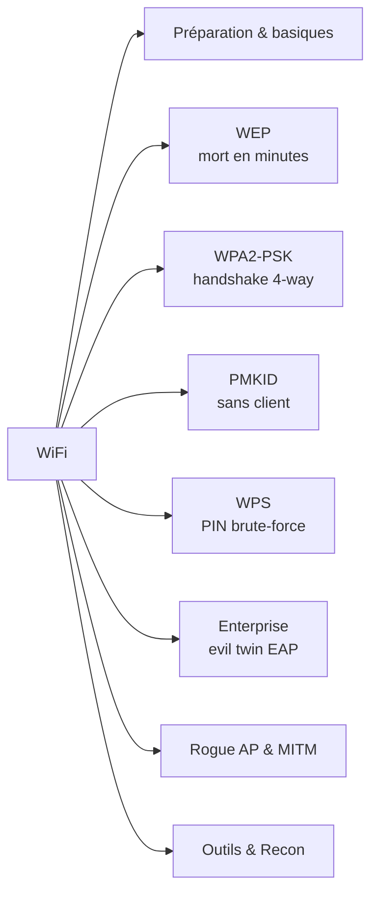
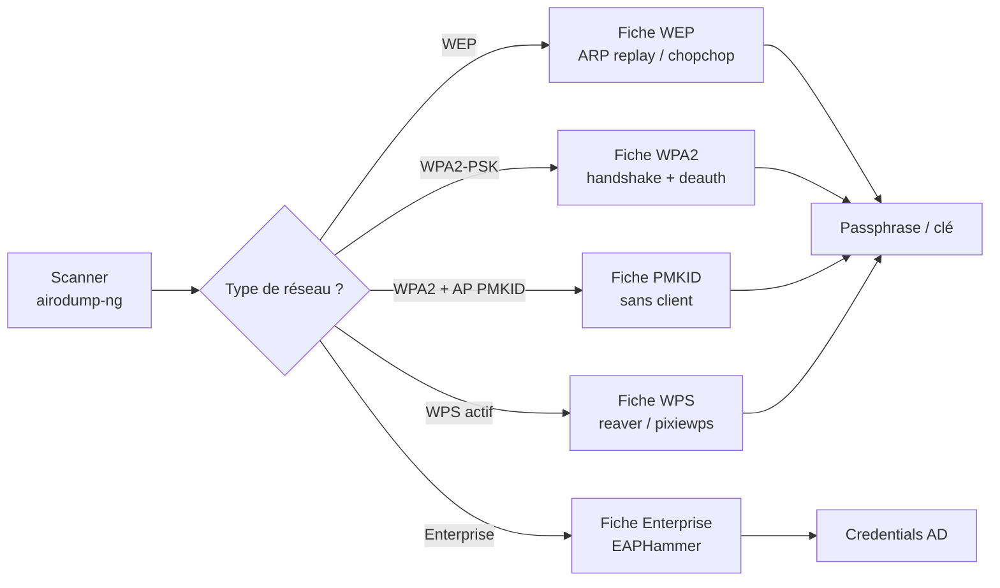

# Attaques WiFi — Hub & Index

> [!info] **En 1 phrase**
> Le hacking WiFi se découpe en **attaques spécialisées** : **WEP** (mort, minutes), **WPA2-PSK** (handshake → crack offline),
> **PMKID** (sans client), **WPS** (PIN), **WPA2-Enterprise** (phishing EAP) — chaque sujet a désormais **sa propre fiche dédiée** ci-dessous.

---

## Index des fiches WiFi

| Sujet | Fiche dédiée | Cible |
|---|---|---|
| **Préparation** : adaptateurs, monitor, injection, fake auth, deauth | [[Techniques/Attaques WiFi - Préparation & Basiques\| Préparation & Basiques]] | Toutes les attaques |
| **WEP** : ARP replay, fragmentation, chopchop, SKA | [[Techniques/Attaques WiFi - WEP\| WEP]] | Réseaux WEP (legacy) |
| **WPA2-PSK** : capture handshake + crack (aircrack, John, Pyrit, coWPAtty, airolib, bettercap) | [[Techniques/Attaques WiFi - WPA2 PSK\| WPA2-PSK]] | Réseaux domestiques/SMB |
| **PMKID** : capture sans client + hashcat 16800 | [[Techniques/Attaques WiFi - PMKID\| PMKID]] | WPA/WPA2 avec AP compatible |
| **WPS** : Reaver, pixiewps, bypass rate-limit | [[Techniques/Attaques WiFi - WPS\| WPS]] | AP avec WPS activé |
| **Enterprise (EAP)** : EAPHammer, evil twin, hostile portal, captive portal | [[Techniques/Attaques WiFi - Enterprise\| Enterprise (EAP)]] | Réseaux d'entreprise 802.1X |
| **Rogue AP** : airbase-ng, Karmetasploit, AP MITM | [[Techniques/Attaques WiFi - Rogue AP\| Rogue AP & MITM]] | Phishing, MITM, capture handshake |
| **Outils** : airdecap-ng, airgraph, Kismet, giskismet, filtrage MAC, tshark | [[Techniques/Attaques WiFi - Outils & Recon\| Outils & Recon]] | Analyse, décryptage, cartographie |

---

## Quick reference (ordre de bataille)

## Liens

- [[Password Cracking| Password Cracking]]
- → Note complète : [[07 - Wireless, MITM & Social Engineering| Wireless / MITM / SE]]
