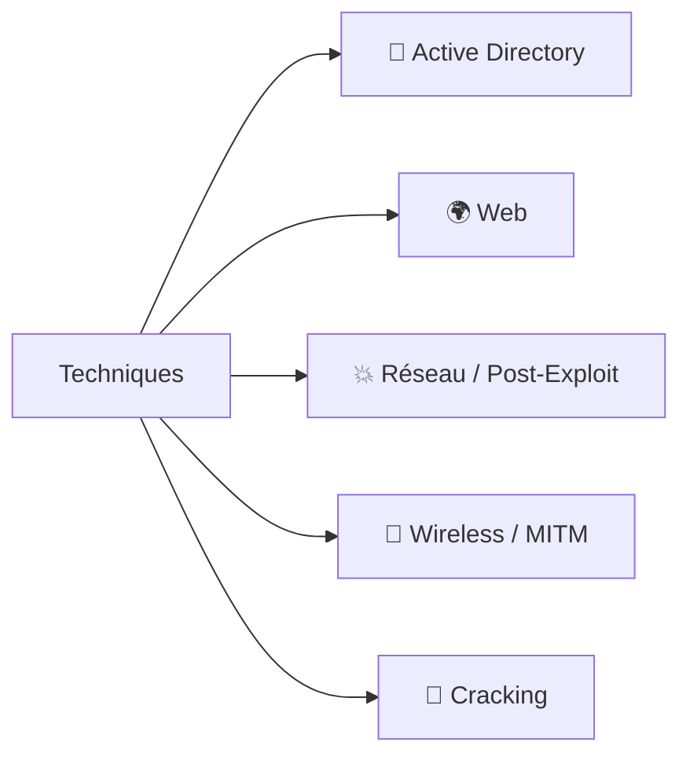

# 🗂️ Bibliothèque de Techniques

> [!info] **C'est quoi ?**
> Chaque note ici décrit **une attaque/concept en détail** : définition, diagramme, étapes,
> commandes, détection/défense et pièges. Les notes principales y renvoient partout.



---

## 📊 Vue dynamique par catégorie (Dataview)

> [!info] Tableau auto-généré : chaque nouvelle fiche créée apparaît ici sans toucher à ce fichier.

```dataview
TABLE WITHOUT ID
  length(rows) AS "📄 Fiches"
FROM "Cybersécurité Offensive/Techniques"
WHERE type = "technique"
GROUP BY categorie AS "📂 Catégorie"
SORT length(rows) DESC
```

```dataview
LIST WITHOUT ID
  file.link
FROM "Cybersécurité Offensive/Techniques"
WHERE type = "technique"
SORT categorie ASC, file.name ASC
```

---

## 👑 Active Directory

| Technique | Note | Clé du mécanisme |
|---|---|---|
| Protocole | [[Kerberos - Le protocole\|Kerberos]] | Tickets TGT/TGS, clés krbtgt & services |
| Tickets | [[Golden Ticket\|Golden Ticket]] | Forger un TGT (clé krbtgt) |
| Tickets | [[Silver Ticket\|Silver Ticket]] | Forger un TGS (clé service) |
| Tickets | [[Pass-the-Ticket et Overpass-the-Hash\|Pass-the-Ticket]] | Rejouer un ticket / hash→TGT |
| Hash | [[Pass-the-Hash\|Pass-the-Hash]] | Se connecter avec un hash NTLM |
| Hash | [[DCsync\|DCsync]] | Répliquer NTDS.dit (hashes du domaine) |
| Hash | [[Kerberoasting\|Kerberoasting]] | Cracker un TGS (compte de service) |
| Hash | [[AS-REP Roasting\|AS-REP Roasting]] | Cracker un TGT sans pre-auth |
| Réseau | [[LLMNR-NBT-NS Poisoning\|LLMNR/NBT-NS Poisoning]] | Capturer des NetNTLMv2 |
| Réseau | [[NTLM Relay\|NTLM Relay]] | Relayer une auth vers une cible |
| Droits | [[ACL Abuse AD\|ACL Abuse]] | Abuser des permissions d'objets |
| Délégation | [[Kerberos Delegation\|Délégation Kerberos (hub)]] | Unconstrained / Constrained / RBCD / Bronze Bit |
| Délégation | [[Kerberos - Unconstrained Delegation\|Unconstrained Delegation]] | Le service garde le TGT → vol du TGT d'un admin |
| Délégation | [[Kerberos - Constrained Delegation\|Constrained Delegation]] | S4U2Self/S4U2Proxy vers une liste de SPN |
| Délégation | [[Kerberos - RBCD (Resource-Based Constrained Delegation)\|RBCD]] | La cible autorise un compte machine contrôlé |
| Délégation | [[Kerberos - Bronze Bit\|Bronze Bit]] | Reforge d'un ST non-forwardable (CVE-2020-17049) |
| Délégation | [[Coerce - PrinterBug et PetitPotam\|Coerce (PrinterBug/PetitPotam)]] | Forcer le DC à s'authentifier vers nous |
| Secrets | [[LAPS et GMSA\|LAPS & GMSA]] | Lire les mdp admin local / comptes de service |
| Secrets | [[Shadow Credentials\|Shadow Credentials]] | Se lier une clé dans msDS-KeyCredentialLink |
| Secrets | [[Dump NTDS.dit\|Dump NTDS.dit]] | Récupérer tous les hashes du domaine |
| Certs | [[ADCS et Certificats (ESC)\|ADCS/ESC]] | Abuser des templates de certificats |
| Mdp | [[Password Spraying\|Password Spraying]] | 1 mdp / beaucoup de comptes |

## 🌍 Web

### 🗃️ Injections (server-side)

| Technique | Note |
|---|---|
| [[Injection SQL\|Injection SQL]] | Manipuler les requêtes BDD |
| [[Injection de commandes\|Injection de commandes]] | Exécuter des commandes OS |
| [[LFI et RFI\|LFI / RFI (hub)]] | Lire/inclure des fichiers serveur |
| [[Path Traversal\|Path Traversal]] | Lire un fichier hors docroot (`../`) |
| [[LFI - Local File Inclusion\|LFI]] | `include()` local → RCE (wrappers, log poisoning) |
| [[RFI - Remote File Inclusion\|RFI]] | `include()` distant → RCE (allow_url_include) |
| [[SSRF\|SSRF]] | Forcer le serveur à fetch l'interne |
| [[SSTI\|SSTI]] | Injecter du code template → RCE |
| [[XXE\|XXE]] | Lire des fichiers via XML |
| [[NoSQL\|NoSQL]] | Manipuler les requêtes MongoDB |
| [[LDAP Injection\|LDAP Injection]] | Bypass auth / exfil via LDAP |
| [[XPATH Injection\|XPATH Injection]] | Interroger des documents XML |
| [[XSLT Injection\|XSLT Injection]] | Exécuter du code via XSLT |
| [[SSI Injection\|SSI / ESI Injection]] | Inclure du code serveur |
| [[CRLF Injection\|CRLF Injection]] | Injecter des headers / réponses |
| [[CSV Injection\|CSV Injection]] | Formules Excel malveillantes |
| [[LaTeX Injection\|LaTeX Injection]] | RCE / lecture via templates |
| [[Type Juggling\|Type Juggling]] | Bypass de comparaisons PHP |
| [[Regular Expression\|Regular Expression]] | ReDoS & bypass de filtres regex |
| [[ORM Leak\|ORM Leak]] | Fingerprinter / fuiter via ORM |

### 🎭 Client-side

| Technique | Note |
|---|---|
| [[XSS (Cross-Site Scripting)\|XSS]] | Injecter du JS chez la victime |
| [[DOM Clobbering\|DOM Clobbering]] | Réécrire des variables DOM |
| [[CSS Injection\|CSS Injection]] | Exfiltrer via des selecteurs CSS |
| [[XS-Leak\|XS-Leak]] | Fuites via réponses cross-origin |
| [[Clickjacking\|Clickjacking]] | Cliquer à travers un iframe |
| [[Open Redirect\|Open Redirect]] | Rediriger vers un site malveillant |
| [[Tabnabbing\|Tabnabbing]] | Piéger l'onglet parent |
| [[CORS\|CORS]] | Lire des réponses cross-origin |
| [[CSRF\|CSRF]] | Actions à la place de la victime |
| [[HTTP Parameter Pollution\|HPP]] | Confusion proxy / backend |

### 🔑 Auth, API & logique

| Technique | Note |
|---|---|
| [[Attaques JWT\|Attaques JWT]] | Forger / altérer des tokens |
| [[OAuth\|OAuth]] | Abuser des flows OAuth 2.0 |
| [[SAML\|SAML]] | Forger des assertions SAML |
| [[GraphQL\|GraphQL]] | Abuser de l'introspection GraphQL |
| [[IDOR\|IDOR]] | Accéder aux ressources d'autrui |
| [[Account Takeover\|Account Takeover]] | Chaîner pour voler un compte |
| [[Mass Assignment\|Mass Assignment]] | Sur-écrire des champs non exposés |
| [[Business Logic\|Business Logic]] | Abuser des règles métier |
| [[Hidden Parameters\|Hidden Parameters]] | Débusquer des paramètres cachés |
| [[Brute Force Rate Limit\|Brute Force / Rate Limit]] | Contourner les protections |

### 📁 Fichiers & upload

| Technique | Note |
|---|---|
| [[Upload de fichiers\|Upload de fichiers]] | Webshell via upload |
| [[Path Traversal\|Path Traversal]] | Lire des fichiers hors racine |
| [[Client Side Path Traversal\|Client Side Path Traversal]] | Traversée côté navigateur |
| [[Zip Slip\|Zip Slip]] | Écrire des fichiers via un zip |

### 🏗️ Archi, cache & protocoles

| Technique | Note |
|---|---|
| [[HTTP Request Smuggling\|HTTP Request Smuggling]] | Désynchroniser proxy / backend |
| [[Web Cache Deception\|Web Cache Deception]] | Piéger le cache |
| [[Web Sockets\|Web Sockets]] | Hijacking / fuzzing WS |
| [[Headless Browser\|Headless Browser]] | Exploiter les bots headless |
| [[DNS Rebinding\|DNS Rebinding]] | Contourner les checks de nom |
| [[Virtual Hosts\|Virtual Hosts]] | Énumérer / cibler des vhosts |
| [[Reverse Proxy\|Reverse Proxy]] | Contourner via le proxy |
| [[Prompt Injection\|Prompt Injection]] | Manipuler les IA / LLM |

### 🧬 Désérialisation & runtime

| Technique | Note |
|---|---|
| [[Insecure Deserialization\|Insecure Deserialization]] | Gadget chains PHP / Java |
| [[Prototype Pollution\|Prototype Pollution]] | Polluer Object.prototype |
| [[Java RMI\|Java RMI]] | Exploiter le port 1099 |
| [[Insecure Randomness\|Insecure Randomness]] | Prédire les PRNG |

### 🔗 Supply chain & secrets

| Technique | Note |
|---|---|
| [[Dependency Confusion\|Dependency Confusion]] | Vol de packages |
| [[API Key Leaks\|API Key Leaks]] | Détecter des clés exposées |
| [[Insecure Source Code Management\|Insecure SCM]] | Exfil via git / .svn |
| [[Insecure Management Interface\|Insecure Management Interface]] | Interfaces d'admin exposées |
| [[Google Web Toolkit\|Google Web Toolkit]] | Exploiter les apps GWT |
| [[Encoding Transformations\|Encoding Transformations]] | Détecter des encodages |
| [[External Variable Modification\|External Variable Modification]] | Modifier des variables externes |

### 💣 Divers / DoS

| Technique | Note |
|---|---|
| [[Denial of Service\|Denial of Service]] | Épuiser les ressources |
| [[CVE Exploits\|CVE Exploits]] | Patterns d'exploitation publics |

## 💥 Réseau / Post-Exploit

| Technique | Note |
|---|---|
| [[Reverse Shells\|Reverse Shells]] | La cible se connecte vers nous |
| [[Pivoting et Tunneling\|Pivoting / Tunneling]] | Passer à l'interne via une machine |
| [[Privilege Escalation Linux\|Privesc Linux]] | user → root |
| [[Privilege Escalation Windows\|Privesc Windows]] | user → SYSTEM |
| [[DLL Hijacking\|DLL Hijacking]] | Charger notre DLL via un service |
| [[Buffer Overflow\|Buffer Overflow]] | Écraser EIP → shellcode |

## 📡 Wireless / MITM

| Technique | Note |
|---|---|
| [[Attaques WiFi (WPA2 et PMKID)\|Attaques WiFi (Hub)]] | Index des attaques WiFi |
| [[Attaques WiFi - Préparation & Basiques\|WiFi - Préparation]] | Monitor, injection, fake auth, deauth |
| [[Attaques WiFi - WEP\|WiFi - WEP]] | ARP replay, fragmentation, chopchop, SKA |
| [[Attaques WiFi - WPA2 PSK\|WiFi - WPA2-PSK]] | Handshake 4-way → crack offline |
| [[Attaques WiFi - PMKID\|WiFi - PMKID]] | Sans client → hashcat 16800 |
| [[Attaques WiFi - WPS\|WiFi - WPS]] | Reaver, pixiewps (Pixie Dust) |
| [[Attaques WiFi - Enterprise\|WiFi - Enterprise]] | EAPHammer, evil twin, hostile portal |
| [[Attaques WiFi - Rogue AP\|WiFi - Rogue AP]] | airbase-ng, Karmetasploit, MITM |
| [[Attaques WiFi - Outils & Recon\|WiFi - Outils & Recon]] | airdecap, Kismet, giskismet, tshark |
| [[ARP Spoofing et MITM\|ARP Spoofing / MITM]] | S'intercaler dans le trafic |

## ⚙️ Hardware & IoT

### 🕹️ Interfaces de debug & dump

| Technique | Note |
|---|---|
| [[Hardware - UART\|UART]] | Console série → shell |
| [[Hardware - JTAG et SWD\|JTAG / SWD]] | Débogueur matériel complet |
| [[Hardware - I2C et SPI\|I2C / SPI]] | Bus internes, EEPROM |
| [[Hardware - Dump et Analyse de Firmware\|Dump de firmware]] | flash SPI, binwalk, reverse |
| [[Hardware - Fault Injection\|Fault Injection]] | Glitch voltage/clock/EM |
| [[Hardware - Secure Boot\|Secure Boot]] | Chaîne de confiance & bypass |

### 🛠️ Gadgets & outils

| Technique | Note |
|---|---|
| [[Hardware - Flipper Zero\|Flipper Zero]] | Couteau suisse portable (RFID/Sub-GHz/BadUSB) |
| [[Hardware - Proxmark\|Proxmark]] | Recherche RFID LF/HF |
| [[Hardware - iCopy-X\|iCopy-X]] | Copieur RFID autonome |
| [[Hardware - HydraBus\|HydraBus]] | Plateforme multi-protocoles (SPI/I2C/UART/JTAG) |
| [[Hardware - HydraFlash\|HydraFlash]] | Shield NAND flash dump |
| [[Hardware - HydraNFC\|HydraNFC]] | Shield NFC (dump/émulation/sniff) |
| [[Hardware - HydraUSB3\|HydraUSB3]] | USB2/USB3/SerDes fuzzing |
| [[Hardware - ESP32\|ESP32]] | µC IoT le plus répandu (esptool, pinout) |
| [[Hardware - Raspberry Pi\|Raspberry Pi]] | GPIO header comme interface |
| [[Hardware - Bus Pirate\|Bus Pirate]] | Adaptateur debug multi-protocoles |
| [[Hardware - CH341A\|CH341A]] | Programmeur flash SPI pas cher |
| [[Hardware - Logic Analyzer\|Logic Analyzer]] | PulseView/Sigrok, décodeurs UART/I2C/SPI |
| [[Hardware - Memory Programmer\|Memory Programmer]] | RT809H (eMMC/NAND/SPI) |
| [[Hardware - Arduino\|Arduino]] | JTAGenum, analyseur logique |
| [[Hardware - Pwnagotchi\|Pwnagotchi]] | Capture WiFi autonome |
| [[Hardware - GoodFET\|GoodFET]] | Facedancer21, émulation USB |
| [[Hardware - Bruschetta Board\|Bruschetta Board]] | WHID / UART / JTAG / SPI sur FT232H |
| [[Hardware - M5Stack\|M5Stack]] | Evil-M5Core2 (WiFi pentest) |
| [[Hardware - microbit\|micro:bit]] | Extraction de firmware + SWD |

### 📡 Protocoles & radios

| Technique | Note |
|---|---|
| [[Hardware - RFID et NFC\|RFID / NFC (hub)]] | Cloner/rejouer/relayer les badges |
| [[Hardware - RFID MIFARE (HF 13.56 MHz)\|MIFARE (HF)]] | Classic/Ultralight/DESFire, crypto1 cassée, Vigik |
| [[Hardware - RFID LF (HID, EM410X, Indala, HiTag)\|LF (125 kHz)]] | HID, EM410X, Indala, HiTag, T55xx |
| [[Hardware - Amiibo et NTAG215\|Amiibo / NTAG215]] | Mot de passe dérivé du UID, dump/rejeu |
| [[Protocole Bluetooth\|Bluetooth / BLE]] | GATT, sniffing, attaques |
| [[Protocole Zigbee\|Zigbee]] | KillerBee, clé Trust Center |
| [[Protocole LoRa\|LoRa]] | Radio 868 MHz, brute force SF |
| [[Protocole CAN Bus\|CAN Bus]] | Frames, UDS, injection auto |
| [[Protocole Modbus\|Modbus]] | ICS/SCADA, registres |
| [[Protocole MQTT\|MQTT]] | Broker IoT, wildcards, injection |
| [[Protocole DNP3\|DNP3]] | Réseaux électriques |
| [[Protocole MMS\|MMS]] | IEC 61850, GOOSE |
| [[Protocole SS7\|SS7]] | Télécom, interception SMS |
| [[Protocole USB\|USB]] | Descriptors, BadUSB, fuzzing |
| [[Protocole UPnP\|UPnP]] | SSDP, SSRF, ouverture de ports |
| [[Protocole HTTP (IoT)\|HTTP (IoT)]] | APIs embarquées, OTA |
| [[Protocole GPS\|GPS]] | Spoofing, jamming, NMEA |

### 🧭 Recon & ressources

| Technique | Note |
|---|---|
| [[Hardware - Identification de puces\|Identification de puces]] | Marquages, datasheets |
| [[Hardware - Recherche FCC ID\|Recherche FCC ID]] | Photos internes via fccid.io |
| [[Hardware - SDR\|SDR]] | Radio logicielle (HackRF, RTL-SDR) |
| [[Hardware - LimeSDR et BTS\|LimeSDR & BTS]] | Fausse BTS GSM 2G |
| [[Hardware - Composants électroniques\|Composants électroniques]] | Reconnaissance PCB |
| [[Hardware - Mots de passe par défaut IoT\|Mots de passe par défaut IoT]] | Wordlist Mirai & co |
| [[Hardware - Kits et ressources\|Kits & ressources]] | CTF hardware, livres, kits |

## 🔐 Cracking

| Technique | Note |
|---|---|
| [[Password Cracking\|Password Cracking]] | Offline / online, hashcat, John |

---

> [!tip] 💡 **Navigation**
> Reviens au centre : [[Bibliothèque technique|🗺️ Index de la base de connaissances]]
