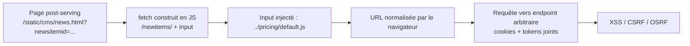

# Client Side Path Traversal

> [!info] **En 1 phrase**
> CSPT (Client-Side Path Traversal) = injection de `../` dans une **URL construite côté client** par `fetch()` — le navigateur normalise la séquence et la requête part vers un **endpoint arbitraire** avec les cookies automatiquement joints.
>
> Source principale : **[PayloadsAllTheThings (swisskyrepo)](https://github.com/swisskyrepo/PayloadsAllTheThings/blob/master/Client-Side%20Path%20Traversal/README.md)**

---

## Concept



> [!info] **Pourquoi ça marche**
> La normalisation du chemin est faite **côté client** (navigateur) avant l'envoi. L'entrée contrôlée par l'attaquant n'est pas encodée dans le path construit par `fetch()` → la séquence `../` survit jusqu'à la requête réelle.
> Comme toute la requête part **du frontend**, le navigateur joint cookies, sessions et tokens anti-CSRF automatiquement.

---

## CSPT → XSS

> Un paramètre contrôlable est concaténé dans une URL fetchée. On redirige le fetch vers un endpoint qui **reflète/évalue** l'input → XSS.

```text
# Page vulnérable : /static/cms/news.html prend ?newsitemid
# Le JS fetche : /newitems/<newsitemid>
# Point d'injection XSS : /pricing/default.js?cb=<reflected>

# Payload final
/static/cms/news.html?newsitemid=../pricing/default.js?cb=alert(document.domain)//
```

---

## CSPT → CSRF (CSPT2CSRF)

> L'OSRF/CSPT redirige des requêtes **légitimes du frontend** → l'app ajoute elle-même les tokens (auth, CSRF, SameSite) → le contrôle CSRF classique est contourné.

| Capacité | CSRF classique | CSPT2CSRF |
|---|---|---|
| POST CSRF | | |
| Contrôle du body | | |
| Fonctionne avec token anti-CSRF | | |
| Fonctionne avec SameSite=Lax | | |
| GET / PATCH / PUT / DELETE | | |
| CSRF 1-click | | |
| Impact dépend source + sink | | |

```text
# CVE-2023-45316 — Mattermost, sink POST
/<team>/channels/channelname?telem_action=under_control&forceRHSOpen&telem_run_id=../../../../../../api/v4/caches/invalidate

# Erasec — annulation de carte (sink GET)
https://example.com/signup/invite?email=foo%40bar.com&inviteCode=123456789/../../../cards/123e4567-e89b-42d3-a456-556642440000/cancel?a=

# Grafana JSON API plugin — CVE-2023-5123
```

---

## Détection

> [!tip] **Approche**
> 1. Chercher dans le JS les appels `fetch` / `axios` / `XMLHttpRequest` qui concatènent un paramètre dans un **path** (pas une query).
> 2. Tester l'input avec `../`, `..%2f`, `%2e%2e%2f` (encodage, voir [[Encoding Transformations| Encoding Transformations]]).
> 3. Observer la requête réelle dans l'onglet Network / Burp → le path final change-t-il ?
> 4. Chercher des **sinks** réflexifs (JS serveur avec paramètre `cb`, JSONP, endpoints qui renvoient l'input) pour transformer en XSS.

```bash
# Outils
# Extension Burp : doyensec/CSPTBurpExtension
# Playground : doyensec/CSPTPlayground
# Labs : Root-Me "CSPT - The Ruler"
```

---

## Détection & Défense

| Mesure | Détail |
|---|---|
| **Encodage des inputs** | Encoder/valider toute valeur injectée dans un path d'URL côté client (`encodeURIComponent`, allowlist de caractères) |
| **Ne jamais concaténer brut** | Construire les URL fetch avec des objets URL / paramètres, pas des strings `path + input` |
| **Côté serveur** | Normaliser et vérifier le chemin final (`resolve` + vérification du préfixe attendu) — ne jamais servir hors du dossier autorisé |
| **Sinks réflexifs** | Éviter les endpoints qui reflètent un paramètre dans du JS (`?cb=`) sans `Content-Type` strict + CSP |
| **CSP strict** | Limiter les sources de script pour contenir le XSS résultant |

---

## Tips & Pièges

> [!tip] **Chercher les sources ET les sinks**
> L'impact dépend du couple source (input contrôlé dans l'URL) + sink (endpoint qui reflète/évalue). Un CSPT sans sink réflexif ne donne que de l'OSRF.

> [!warning] **Pièges**
> - Le `../` doit survivre à la **normalisation du navigateur** : tester les variantes encodées (`%2e%2e%2f`, `..%2f`, doubles encodages) car certaines passes WAF mais sont dénormalisées.
> - Le **body n'est pas contrôlable** en CSPT2CSRF → chercher des actions qui s'exécutent avec des **paramètres GET/query** ou des endpoints sensibles sans body.
> - Les **sessions du navigateur** sont jointes automatiquement : ça marche même avec SameSite=Lax et tokens anti-CSRF.
> - Le fichier upload (ex: upload de fichier dont le nom est ensuite fetché) est aussi un vecteur CSPT classique.

> [!info] **Référence clé**
> "Exploiting Client-Side Path Traversal — CSRF is dead, long live CSRF" — Doyensec Whitepaper (M. Schmitt, 2024).

---

## Liens

- [[Path Traversal| Path Traversal]]
- [[Encoding Transformations| Encoding Transformations]]
- [[XSS (Cross-Site Scripting)| XSS]]
- [[CSRF| CSRF]]
- → [[03 - Exploitation Web| Exploitation Web]]
- Source : [PayloadsAllTheThings — Client-Side Path Traversal](https://github.com/swisskyrepo/PayloadsAllTheThings/blob/master/Client-Side%20Path%20Traversal/README.md)
